5 0 1 5 GLOBAI THREAT REPORT

# INSIDE:

- Targeted Intrusions
- Criminal and Hacktivist Activity
- 2016 Predictions

CROWDSTRIKE

PROVIDED BY THE CROWDSTRIKE INTELLIGENCE TEAM

### LETTER FROM THE CEO

If there's one thing that businesses, boards of directors and C-level execs can take from CrowdStrike's 2015 Threat Report, it is that the paradigm has broadened beyond people, processes, and technology to now include integrated, crowdsourced, and enriched threat intelligence.

Our Global Threat Report highlights that today's threats, more than ever before, are driven by geopolitical and economic events around the world. The primary motivation behind global cyber activity has now shifted from disparate activities carried out by individuals, groups and criminal gangs pursuing short-term financial gain, to skilled adversaries driven by strategic global conflicts. The economic downturn and new Five Year Plan in China will continue to drive their state-sponsored cyber espionage activities. The situation in the Ukraine and falling oil prices will continue to fuel targeted intrusions from Russia. The conflict in the Middle East between Saudi Arabia and Iran over Yemen will continue to generate hacktivism from that region. CEOs and boards of directors who ignore or disregard the ramifications of global events such as these will pay for it in the loss of revenue, jobs, intellectual property, and shareholder value.

This shift underscores the importance for an effective intelligence program about the motivations of your adversary. The mantra "people, processes and technology" is no longer enough for cyber security. In today's threat environment, it takes people, processes, technology AND intelligence. Intelligence is no longer a "nice-to-have." It is a mandatory element of stopping breaches.

How can you expect to win if you do not have a solid understanding of how your adversary operates, what their tendencies are, what their goals are, and what motivates them? Recognize why they would want to come after you and your company. If you don't know the game plan of your adversary, you will fail to defend your corporation. It sounds like common sense, but it is something that is lost in the outdated discussion of people, processes and technology. Companies must have intelligence, either home-grown or provided by third-party sources who have the trained personnel to monitor, capture and analyze threat data effectively.

Emphasizing intelligence has been a cornerstone for CrowdStrike's approach to security since the foundation of the company five years ago: Providing cloud-based security powered by comprehensive, in-house threat intelligence. With our Falcon Platform and Threat Intelligence team, we have a unique bird's-eye view by having our endpoint sensors deployed in more than 170 different countries, handling more than ten billion events per day, as well as providing incident response services in response to some of the largest breaches. The "brains" behind our Falcon Platform is our Threat Graph engine, which constantly collects and analyzes billions of events, both in real time and retrospectively. As a result, on a weekly basis, we are identifying and mitigating hundreds of breaches for which traditional defenses silently fail.

INTELLIGENCE

The CrowdStrike team has put tremendous effort into capturing this real attack telemetry, analyzing it, distilling how adversaries operate, and more importantly, what motivates them. We hope our experiences and the lessons learned that are manifested in the 2015 Threat Report will provide companies a sampling of the intelligence they need to protect themselves in 2016 and beyond.

George Kurtz. President, CEO & Co-Founder

# INTRODUCTION | 3-4

# TARGETED INTRUSION | 5-46

### CHINA 5

- 07 PII Breaches
- 10 Legal and Regulatory Challenges Posed by PII-Focused Targeted Intrusion Operations
- 12 Hacking Team Campaigns
- 12 Possible Timeline
- 13 Censorship, Corruption, and China's "Cyber Sovereignty"
- 14 Rise of the MPS
- 18 Corruption Crackdown and Military Reorganization
- 19 Island-Building in the South China Sea
- 21 TURBINE PANDA

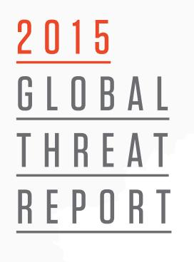

### RUSSIA 23

25 Resurgence of Russian Power & Expansion of Intel Gathering 28 The Fifth Domain - The Information Battlespace in Ukraine 29 CyberBerkut 30 BERSERK BEAR

### NORTH KOREA 31

31 North Korean Cyber Espionage in 2015 33 Milmanbag 33 Hawup 33 AIMRAT

### IRAN 35

35 Iranian Control of Western Influence 37 Black Spider and the Arrests of Iranians 38 Supreme Leader Streamlines & Obtains Further Control Over the Internet 39 Iran Prioritizes its National Internet, Network Infrastructure, and Cyber Capabilities

42 ROCKET KITTEN

43 INDIA

45 SOUTH AMERICA

# E-CRIME | 47-56

49 Trends in eCrime Activity - 2015 51 Emergence of Extortion-Based Criminal Operations

- 52 Intelligence-Powered Social Engineering Scams
- 54 Blurring Lines Between
- Criminal and Espionage Activity

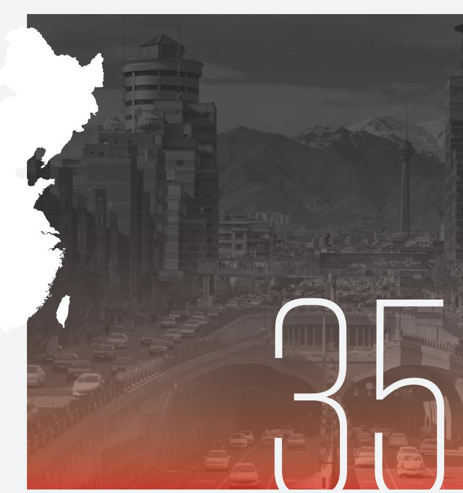

# HACKTIVIST | 57-68

- 59 The Rise of Hacktivism in the Middle East
- 59 Iran-Related Groups
- 59 Parastoo, Remember EMAD, and SOBH Cyber Jihad
- 60 Yemen Cyber Army
- 61 Pro-/Anti-ISIS Activity
- 63 Intrusion Capabilities of ISIS
- 63 GEKKO JACKAL Demonstrates Resilience and a Criminal Motivation in 2015

# LOOKING FORWARD TO 2016 | 69-91

- 69 Review of 2014 Predictions
- 71 Adversary Operational Security
- 71 Increased Targeting of Embedded Devices
- 71 China Will Continue Conducting Espionage
- 71 Joint Plan of Action as a Catalyst
- 71 Cyber Spillover from Regional Conflict
- 72 Point-of-Sale Attacks in the Wake of EMV
- 72 Destructive and Disruptive Attacks
- 72 R&D
- 73 x86 System and Firmware Security
- 74 State of the TLS Ecosystem
- 74 Attacks and Incidents
- 75 New Developments
- 75 Changes to the Protocol
- 76 Container and Virtualization Security
- 76 Containers
- 77 Virtual Machines
- 78 Targeted Intrusion
- 78 China
- 78 Chinese Intentions in Cyberspace
- 79 The Shifting Dynamics of China's Cyber Operators
- 80 China's 13th Five-Year Plan
- 81 Russia
- 82 Iran
- 88 North Korea
- 88 Criminal
- 88 Targeted Criminal Intrusion
- 88 Commodity Malware
- 89 Extortion
- 89 Hacktivism
- 89 Motivation
- 89 DDoS
- 92 Conclusion

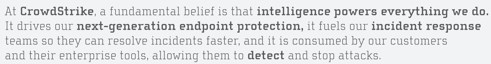

well-known proverb captures the essence of intelligence: In the land of the blind, the one-eyed man is king. One who is better informed than his adversaries will have the advantage. Intelligence helps remove uncertainty from decision making; businesses around the world use various types of intelligence to ascertain what markets they should focus on, and how they should enter those markets. Intelligence about what personnel, which business units, or what products are being targeted by malicious threat actors can similarly aid in the decision-making process for the business. This transcends the security operations center and incident response measures. This information can help the business make more informed decisions, from the IT team, the C-suite, and even the board of directors.

Increasingly, organizations around the globe are using threat intelligence to make their enterprises smarter and more resilient. These organizations use threat intelligence to stay ahead of the adversary. As more and more organizations begin to utilize threat intelligence, the value in understanding what these threats mean to the business becomes evident. Intelligence powers everything we do, and it can power everything you do as well.

This year's CrowdStrike Intelligence Global Threat Report contains a wealth of intelligence regarding adversary behavior, capabilities, and intentions. More importantly, it ties it back to the events that influenced those activities. By understanding the events that shape the beliefs and motivations of threat actors—regardless if they are criminal, nation-state, or hacktivist—it is possible to comprehend what drove the adversaries to behave as they did, and perhaps to understand what this will mean for the future. The hope is that this report will provide a lens by which the reader can begin to view the world through the eyes of the attacker and use that information to stay ahead of the adversary—or as some might say, "to the left of boom".

CrowdStrike buckets more than 70 designated adversaries into three different motivations. These motivations—Targeted Intrusion, eCrime, and Hacktivism—can be influenced by a wide range of external factors. Targeted intrusion is most frequently executed by nation-states seeking to collect intelligence to facilitate public and private decision making. These nations have collected intelligence from private enterprises, non-governmental organizations, military and defense related businesses, foreign

governments, and individuals deemed to be dangerous to the aggressor. Electronic crime (eCrime) is financially motivated activity by threat actors targeting any number of victims ranging from individuals to corporations. Targeted eCrime is an issue that is emergent and covered in the report as well. Hacktivism can pop up at any time, for any reason, anywhere; hacktivist actors may be nationalists, social activists, terrorist supporters, or pranksters.

This report is organized differently from our previous Global Threat Reports. In years past, the reports contained a review of notable activity followed by adversary-specific information, and they culminated in a looking forward section. These reports were contiguous and meant to be read from start to finish. This report is designed to flow more like a magazine; there are feature reports on various topics, smaller pieces meant to augment those topics, and profiles of select adversaries. The basic structure covers the three adversary motivations tracked by CrowdStrike: Targeted Intrusion, eCrime, and Hacktivism. This is followed by a review of predictions from last year's report to track how those predictions panned out, and what to expect for 2016.

# TARGETED INTRUSION

In 2015 high-profile targeted intrusion activity was observed that revealed behavior not often associated with China-based adversaries, and which also provided some insight into how these actors operate

 In recent years, adversaries aliqned with the interests of the People's Republic of China (PRC) have dominated vendor threat reporting, security research bloqs, and mainstream news by tarqetinq international businesses, qovernments, dissident qroups, and not-for-profit orqanizations. Durinq 2015, however, the media coverage was inundated by a series of breaches of personally identifiable information (PII) stretching back through 2014. The breaches were announced in rapid succession by a number of U.S. healthcare providers and the U.S. Office of Personnel Manaqement (OPM).

The targeting of PII is fascinating, as targeted intrusion operators historically have not pursued such personal information. This targeting underscores that intrusion operations associated with nation-states pose a significant risk to all data, no matter how uninteresting it may seem. The intentions of these actors can be debated; one might argue these incursions point to integration between cyber espionage and human intelligence targeting. This implies the creation of a massive database of information that may be used to identify individuals who might be susceptible to recruitment for espionage. An alternate hypothesis is that the intrusions were executed in an effort to better understand western healthcare systems in order to satisfy the healthcare objectives of China's 12th Five-Year Plan (FYP).

In the wake of the July breach of the Italian information technology company Hacking Team, the public release of stolen data included a number of

exploits that were quickly adopted by malicious actors. The adversaries leveraging the compromised exploits included numerous China-based targeted intrusion actors who rapidly operationalized exploit code and used it against a wide variety of target organizations. The speed and similarities in the technical implementation of the leaked exploit code underscored the possibility that these actors may be connected to one another through a shared tool development center or vendor.

Several major events of strategic importance set the stage for the cyber activity observed in 2015, and they will continue to influence future events in CrowdStrike's 2016 outlook for China-based cyber adversaries. China's increased efforts at domestic censorship and the notion of "cyber sovereignty" are key to understanding the way that the Communist Party of China (CPC) views the role of computer network exploitation. Territorial expansion actions by China in the South China Sea

during 2015 continued to be a source of tension between China and members of the international community. President XI Jinping's domestic corruption crackdown and subsequent military reorganization, which were observed in 2015, will have far-reaching effects well into the new year.

# PII BREACHES

eginning in early 2015, several private organizations in the U.S. healthcare sector, as well as entities in the U.S. and Japanese government, began announcing that they suffered massive data breaches. These breaches compromised the PII of millions of individuals. While data breaches occur frequently, these incidents were unique in that they were not carried out by actors looking to profit from the information, but rather by China-based targeted intrusion adversaries. While historically these actors have not been interested in PII data, these incidents hinted toward possible new interests and collection requirements for China-based adversaries.

The first of the breaches attributed to China-based actors was announced by healthcare provider Anthem in February 2015; it reportedly resulted in the acquisition of customer names, Social Security numbers, physical and email addresses, and income data for between 37.5 and 78.8 million customers. Two other U.S. healthcare providers, Premera and CareFirst (both under the BlueCross/BlueShield umbrella along with Anthem), followed suit in March and May, respectively. Premera reported a PII breach of up to 11 million of its customers, while CareFirst put the number around 1.1 million. All told, these healthcare breaches resulted in the compromise of anywhere from approximately 50 to 80 million Americans.

In addition to the compromises in the healthcare sector, major breaches believed to be the result of Chinese intrusion operations were reported at government organizations in the U.S. and

Japan. On 1 June 2015, the Japanese government reported a significant breach at the Japan Pension Service (JPS). This attack was conducted during May 2015 using a campaign of spear phishing emails with themes including requests for comment on policy, participation in seminars, and notifications about medical expenses. As a result of this compromise, JPS officials announced that pension IDs, names, birthdates, and physical addresses were obtained by the attacker, although sensitive information about premiums and benefits were not accessible through the compromised part of the network. Three days later, the U.S. Office of Personnel Management (OPM) reported that a breach resulted in the compromise of approximately 4 million individuals associated with the federal government.

The theft of large amounts of PII by China-based targeted intrusion adversaries is anomalous to their typical tactics, techniques, and procedures (TTPs). These actors are generally interested in sensitive information of a more strategic nature such as intellectual property, information related to business operations, or sensitive government documents. Stolen PII is typically used to facilitate identity theft or other types of financially motivated crimes; however, when viewed through a more strategic lens, the PII compromised in the healthcare and government breaches over the past year could be of significant use to a foreign government or state-run enterprise.

Looking specifically at the healthcare breaches, the targeting of organizations relating to population welfare may be part of an intelligence-collection effort intended to support the aims of China's 12th FYP, which was launched in 2011. While these plans are generally broad and cover a range of topics to improve and stabilize China's future, an important element of the 12th Plan is the concept of "inclusive sustainable growth". This includes specific considerations for welfare of the populace, including a com-

mitment to boosting growth in social security, private pensions, and medical insurance.

Drilling down into the medical sector, priorities include improvement in medical technology, provision and management of a basic healthcare service for the entire population, and the creation of a healthcare database for 70 percent of urban residents. It also emphasizes foreign investment in developing the Chinese healthcare sector during this time.

With these requirements in mind, it is possible that the network compromises detailed here may have been executed to better understand how other countries have structured their systems and to obtain an understanding of large, multinational healthcare providers to support negotiations for foreign investment. This emphasis on healthcare services has carried over into the 13th FYP as the CPC has promised basic universal healthcare for all Chinese citizens by 2020. Targeting of the western healthcare sector may be as much about logistics and know-how for running national-level health insurance schemes as it is about siphoning data.

However, because of the personal, individualized nature of the information that was targeted for data exfiltration during each of these breach events, there may be a wider strategic use for it within the Five-Year Plan. This raises an altogether more disconcerting scenario for organizations and their customers: Information about their personal circumstances is of value to the attackers in some way. While the official response to most of these breaches has been to offer a period of identity theft protection and credit monitoring to each affected individual, it is unlikely that concerted efforts to compromise multiple networks within the same sector would be undertaken for the purpose of fraud. Another possible scenario is that these attacks are being used to build out profiles on individuals to support future operations.

# "ALL TOLD, THESE HEALTHCARE BREACHES RESULTED IN THE COMPROMISE OF ANYWHERE FROM APPROXIMATELY

# 50 to 80 MILLION AMERICANS."

# "AN IMPORTANT ELEMENT OF THE 12TH PLAN IS THE CONCEPT OF 'INCLUSIVE SUSTAINABLE GROWTH'.

THIS INCLUDES SPECIFIC CONSIDERATIONS FOR WELFARE OF THE POPULACE, INCLUDING A COMMITMENT TO BOOSTING GROWTH IN SOCIAL SECURITY, PRIVATE PENSIONS, AND MEDICAL INSURANCE."

The breached healthcare entities are all federation members of the Blue Cross Blue Shield Association, which offers coverage to state and federal employees through the Federal Employees Health Benefit Plan. During the public broadcast of an Oversight Committee hearing on 16 June regarding the OPM network breach, the Director of OPM stated that records held on the compromised systems did not include actual medical record information on employees, but they did include details on their healthcare providers. It is likely that a combination of these two datasets would be extremely valuable to gain deeper insight into the lives and vulnerabilities of federal employees.

In the case of OPM, information acquired by the attackers went far beyond the data obtained in the breaches of the U.S healthcare providers. In addition to the typical personal data common to other breaches, the OPM network held data collected through "Standard Form 86" (SF86), which must be completed by individuals applying for national security positions. The SF86 is a comprehensive document that collects large amounts of highly personal information on applicants so they can be vetted for possible vulnerabilities that may be exploited by hostile actors in order to gain information. Without doubt, access to this degree of PII for both successful and unsuccessful applicants represents a treasure trove of information that may be exploited for counterintelligence purposes. China has publicly declared this breach the work of criminals and announced that they had arrested several individuals who were responsible in late 2015.

At this time, it is difficult to know exactly how this voluminous amount of information might be leveraged in the future. It is possible that insights could be gained into targets of interest by correlating information about this potential target across the multiple compromised datasets. Knowledge acquired during these operations could be used to create more individualized, and therefore

more effective, spear phishing campaigns, or also in more traditional, real-world espionage activity. Data contained in the SF86 documentation would be particularly useful to traditional HUMINT operations as it contains details of a very personal nature about current and former government employees, as well as private sector employees working on government contracts.

It is possible that the adversary's goal for these compromises was to build a dataset on a large number of individuals of intelligence value through which detailed profiles of these individuals could be produced. Such a project would require the theft of PII from multiple organizations such as those observed in this campaign.

If this was the goal of this campaign, then it is possible that more PII breaches by targeted intrusion adversaries could occur in the future. While there is currently no indication that PII theft is going to be a continuous trend, organizations across all sectors—but particularly those that possess PII on government employees or other individuals that may be of counterintelligence value—should remain alert to the possibility of similar activity going into 2016.

██ he loss of any kind of information, be it PII or sensitive/strategic data, is of great concern to all organizations; however, these incidents of theft of PII by targeted intrusion operators may indicate a disturbing new trend. In the past, organizations that were victims of targeted intrusions suffered the loss of valuable business information, but that loss could usually be kept a secret as there is little in the way of disclosure requirements associated with that sort of data. The U.S. Securities and Exchange

Commission (SEC) does have guidance stating that companies falling under the SEC's purview should report cybersecurity incidents that have a material impact on the business, but the decision on what rises to the level of necessitating disclosure is still left up to the company.

In the case of a breach of PII, numerous state and federal laws require affected organizations to disclose the breach to affected individuals. This means that targeted intrusion incidents that result in the theft of PII are forced into the public eye during the disclosure process, making a targeted intrusion incident not only potentially damaging to a company's strategic position in their marketplace, but also damaging to it financially and reputationally.

Financial damage can come in multiple forms including the cost of carrying out the breach notification processes required by the various data breach statutes. Notification costs can easily run into the millions of dollars. A publicly disclosed breach can also be damaging to a company's stock value. Target's stock slid 11 percent in the weeks after it announced a massive data breach at the end of 2013.

Reputational damage can be as significant as the financial cost of a breach, or even more so. Publicly acknowledging the theft of data can make people question a company's dedication to security and overall competence. What is more, a targeted intrusion incident that is disclosed due to PII theft will also likely lead people to question what other data was compromised. If the wrongdoers were able to gain access to databases containing PII, were they also able to take valuable intellectual property, information on key mergers and acquisitions projects, and strategies concerning ongoing negotiations? These types of concerns could undermine a company's market position.

| ACTOR | EXPLOIT | TARGETING | MALWARE |
| --- | --- | --- | --- |
| DYNAMITE | 5119 & | SOUTHEAST ASIA / | GHOST |
| PANDA | 5122 | FINANCIAL |  |
| STONE PANDA | 5119 | UNKNOWN | UNIDENTIFIED |
| EMISSARY PANDA | 5119 | HONG KONG / PRO-DEMOCRACY | HTTPBROWSER |
| GOBLIN PANDA | 5119 | SOUTH CHINA SEA ISSUES | PLUGX |
| TURBINE PANDA | 5122 | U.S./AEROSPACE, DEFENSE | ISSPACE |
| UNDETERMINED | 5119 | UNKNOWN | TERMINATOR |
| UNDETERMINED | 5119 & 2122 | JAPAN | EMDIVI |
| UNDETERMINED | 5119 | UNKNOWN | HTTPBROWSER |
| UNDETERMINED | 5119 & 5122 | JAPAN | PLUGX |
| UNDETERMINED | 5122 | CHINESE DISSIDENTS | PLUGX |
| UNDETERMINED | 5122 | JAPAN | PLUGX |
| UNDETERMINED | 2122 | UNKNOWN | SMAC |
| UNDETERMINED | 5122 | CHINA ISSUES | EVILGRAB |
| UNDETERMINED | 5119 | INTERNET SERVICES | SAKULA |

The incidents represented in this table are only a portion of the operations tracked in the wake of the Hacking Team breach. However, the incidents depicted in the table all shared significant similarities in the methods by which the actors leveraged the CVE-2015-5119 and CVE-2015-5122 exploits: all exploit files used the same ActionScript class name (either HT_Exploit or flash_exploit_002); additional ActionScript class names were also nearly identical; all files had create dates of either 7/7/2015 or 7/11/2015; files were compressed with LZMA; and, all contained embedded, zlib-compressed payloads.

It is still too soon to tell whether PII theft is going to become a consistent trend for targeted intrusion operators, but the incidents disclosed in 2015 certainly underscore the potential threat. Any business that collects PII for any reason should be aware that a targeted intrusion could result in a PII breach that would lead to required disclosure. This is particularly true for any company storing the information of government employees, as those individuals are likely to be of particular interest to foreign governments that carry out targeted intrusion operations.

# HACKING TEAM CAMPAIGNS

n 5 July 2015, an unknown actor successfully breached the network of the Italian information technology company Hacking Team, whose primary business was selling offensive intrusion and surveillance capabilities to governments, law enforcement, and similar organizations. Soon after the breach, the actor responsible publicly leaked all of Hacking Team's tools and communications. Among the approximately 400 GB of leaked data was exploit code for a number of different, and at the time unknown, vulnerabilities.

China-based targeted intrusion adversaries rapidly adopted exploits for two of these vulnerabilities: CVE-2015-5119 and CVE-2015-5122. CrowdStrike Intelligence closely tracked the proliferation of this exploit code amongst Chinese actors and identified numerous incidents from named and still-unidentified actors.

The high degree of similarity in the exploit code files is an indication that the actors responsible for the operations summarized in the table are somehow related. Evidence of a relationship between these actors is further strengthened by the tight time frame in which the operations were carried out. Seven of the actors began using the HT_Exploit variant within 72 hours of each other, with the rest following in the same week. The flash exploit 002 variant began appearing around 14 July 2015, with five actors or sets carrying out operations using that variant within 24 hours of each other, and the final incident occurring a week later.

# POSSIBLE TIMELINE

ased on the similarity in the exploit code and usage time frame there are three primary scenarios that could explain the extent to which these actors are connected.

• The tactics and timing of the observed incidents indicate that the most likely scenario is that there is an entity that creates or repurposes exploit code and develops tools for targeted intrusion adversaries to easily operationalize that code, such as a builder tool that would allow an actor to bind an executable to the exploit code. The way in which the CVE-2015-5119 and CVE-2015-5122 exploit code was operationalized between the HT Exploit and flash exploit 002 clusters is identical across all adversaries in those clusters. It seems highly unlikely that the 14 distinct actors identified between the two clusters independently operationalized the

code for the two exploits in the same way. If each actor were operating independently of the others, it would be expected that there would be at least minimal differences in the way the exploits were weaponized.

Additionally, the rapid time frame in which the exploits were adopted suggests that a centralized source disseminated a builder tool to these various actors within hours or days of the code being leaked. Such rapid proliferation is unlikely to occur outside of a formal dissemination channel.

- Another potential scenario is that these actors were sharing tools because they are different parts of a larger overarching organization. For example, each actor in the HT Exploit and flash exploit 002 clusters could represent a team working within a Chinese government/ military organization or possibly a China-based defense or intelligence contractor. There is not enough evidence at this time to make a more definitive statement about the likelihood of this scenario, however the sharing of tools and the close-in-time deployment of those tools could be explained by a scenario in which these actors are all working for the same organization.
Similar targeting amongst the adversaries from the HT Exploit and flash exploit 002 cluster may also suggest that they work for the same organization. Of the nine actors whose targeting was directly observed or could be inferred from their TTPs, seven targeted Southeast or East Asia. It is possible that the targeting overlap observed with these actors is the result of a directive to target entities in Southeast and East Asia by an overarching organization in which the actors operate.

- A third possible scenario to explain the apparent connection between these actors is that they all obtained access to the same tools through a more informal, shared tool dissemination channel.
Such a channel could involve sharing of code or tools from one actor to other actors, or possibly a forum or other communication channel that some China-based actors use to share code or tools.

This seems like the least likely scenario when taking into account the identical nature of the way in which the exploit code was operationalized, the close-in-time nature in which the activity occurred, and the overlapping targeting between a number of adversaries. It is unlikely that an informal, shared dissemination channel would result in this many actors receiving access to the same tool or exploit code in such a small window of time and that this many actors would then put the tool to use so quickly.

The key take-away from the Hacking Team incident is that the adversary can move quickly and capitalize on a fortuitous release of exploit data. Whether the actors have consumed a weaponized exploit through a shared tool development, purchased it from a third party that developed it, or benefited from a released implementation of these exploits from an underground forum, they proved that they could rapidly retool and use the new exploit to conduct intrusions. Events such as the Hacking Team leak do happen; historically several security companies with vulnerability or exploit data have been breached, and if the data those firms have is exposed, it can be expected that the adversary will find a way to make it their own.

█ 015 demonstrated that China intends to aggressively pursue the concept of cyber — sovereignty and push it as an international norm by going on the offensive if necessary. Almost immediately after the New Year, there was an aggressive crackdown on those circumventing China's censorship apparatus commonly referred

to as the Great Firewall of China (GFW). This included additional blocking of sites, shutting down Virtual Private Network (VPN) providers, and most importantly, new methods of DNS poisoning, which directed users attempting to access forbidden sites to third-party sites, sometimes creating a Distributed Denial of Service (DDoS) on innocent servers. In response to the intensified crackdown, multiple anti-censorship sites began hosting censored material on distributed content delivery networks (CDNs) in a concept called "collateral freedom". One anti-censorship site, Greatfire.org, after hosting their censored content on CDNs and being pressured to remove the content, began hosting their material on open-source code sharing site Github.

The Chinese government responded by publicly unveiling for the first time its offensive counterpart to the GFW, the so-called "Great Cannon". This weapon redirected a subset of international users' traffic that touched servers connected Baidu's Wangmeng (Chinese equivalent to Google Adwords) and redirected traffic to hit Github repositories where censored material was being hosted, resulting in a massive DDoS attack. This crippled Github for several days.

Although the attacks were ultimately unsuccessful at coercing Github to remove the content, this was a clear message by China that it intended to enforce its notion of cyber sovereignty, even overseas. CrowdStrike and other industry researchers traced the origins of the Great Cannon back to the backbone of China's Internet, suggesting that the China Internet Network Information Center (CNNIC) and cvber czar LU Wei (鲁炜) were involved at a high level in facilitating the attacks. There was virtually no repercussion against the Chinese government for, at the very least, tacitly allowing an attack on western systems.

Though the Great Cannon did not make another appearance in 2015, China continued to push

its concept of cyber sovereignty and continued its crackdown on VPN providers within its borders. Several popular circumvention sites were shut down, and their authors often left cryptic messages shortly before the Chinese Ministry of Public Security (MPS) questioned them or their social media presence went dark. Interestingly, several of these circumvention tools have been observed in use by DEEP PANDA after their shutdowns, suggesting that the MPS either took their tools and reused them, or the operators themselves are reliant on them to avoid the GFW.

# RISE OF THE MPS

FT hroughout 2015, CrowdStrike Intelligence identified a concerning number of initiatives taken by the Communist Party of China (CPC) to strengthen Internet regulation and censorship, and to enforce cybersecurity reform. Not only was the MPS increasingly active in enforcing the CPC's notion of cyber sovereignty, but it was clear that 2015 marked an increase in responsibility for the MPS with regard to cybersecurity reform and operating overseas.

While the MPS has historically been involved in enforcing internal cybersecurity practices, the increased use of this ministry in China's new efforts that traditionally would have fallen under other branches, such as the Ministry of State Security (MSS), could be indicative of a the powerful role for the MPS under President XI Jinping. Such efforts include the creation of MPS units within major Chinese Internet and web service providers, widespread arrests for Internet crimes—both in the homeland and abroad, and leading high-level global cybersecurity dialogues with countries such as the U.S.

Additionally, as the MPS is taking a prominent role in anti-terrorism efforts, it is expected that new Internet restrictions and enforcement efforts will be conducted under the guise of

combatting terrorism. As President XI Jinping and the CPC continue efforts to obtain "cyber sovereignty" within China and protect its netizens, it is likely the MPS will continue to play a leading role in enforcing those efforts in 2016.

The MPS, currently headed by Minister GUO Shengkun, is the principal police and security authority of the People's Republic of China and the government agency that exercises oversight over law enforcement duties. This includes management of the system of Public Security Bureaus (PSB), which are in turn are responsible for carrying out local policing functions. The MPS ostensibly operates under the State Council. However, in reality, it is believed to operate under the direct control of the CPC leadership, specifically Politburo member MENG Jianzhu. MENG is the most recent former minister of the MPS; he leads the Central Political and Legal Commission (CPLC) of the Communist Party and reports directly to President XI Jinping.

The MPS has a history of training security officials and police officers in cybersecurity, particularly computer network exploitation and attack techniques. The People's Public Security University in Beijing, a part of the MPS that trains China's police and internal security forces, reportedly has several units engaged in training and operations for carrying out cyber operations. While the motivation behind this training appears to be internal law enforcement operations, it provides the MPS with a fully capable cadre skilled in computer network operations. According to a former Chinese security official, the MPS holds more power within the CPC than other organizations such as the MSS, and therefore "likely has more authority to task and manage hacker activities both domestically and overseas." In mid-2015, paralleling a number of pieces of new Internet legislation and reform released by the CPC, the MPS appeared to take a stronger role in cybersecurity enforcement efforts. In early August 2015, the MPS announced the creation and implementation of "network security offices" at major Chinese Internet companies and service providers such as China Mobile, Baidu, Alibaba, and Tencent.

Reporting indicates the primary motivations behind the creation of these units were to assist companies in handling illegal Internet activities, protecting private information, and improving incident response time by the MPS. The units will also assist companies in preventing the spread of "disinformation" harmful to the Chinese state.

Historically, the CPC has placed the majority of responsibility for monitoring Internet content at the company level. The embedding of MPS units shifts this power back to the MPS and the CPC, and it will greatly enforce not only regulations, but also punishment.

On 18 August, two weeks after the announcement of Internet police units, the MPS announced the incarceration of 15,000 people for crimes that "jeopardized Internet security". According to the MPS, the arrests were made under a new six-month program launched in July 2015 named "Cleaning the Internet". The details of the arrests were not provided, but the MPS claimed the sweep had targeted approximately "66,000 websites" providing "illegal and harmful information."

In what appears to be an associated effort, on 22 August a popular workaround to China's censorship apparatus known as the Great Firewall (GFW), ShadowSocks, was forcibly taken down from the code-sharing site GitHub. Shadow-Socks' author. clowwindv. made a final post on the GitHub repository hosting ShadowSocks, stating that Chinese police forces enforced the removal of the code from GitHub and demanded any research on the project cease.

There was a significant outpouring of support from Chinese and western users who vowed to

fork the code and keep the ShadowSocks project alive despite efforts to censor it. Then on 25 August, the Github repository hosting another popular GFW circumvention tool, GoAgent, was also removed. The author of the tool, phuslu, deleted the repository without explanation, but he ominously changed his account description to be "Everything that has a beginning has an end". Advocates of free speech similarly suspect that China's police force played a role in the takedown.

In addition to enforcement of regulations in the name of public security, the MPS is also being leveraged in efforts associated with state security—a mission traditionally carried out by the MSS. In 2015, the CPC openly acknowledged the lead role of the MPS in Operation Fox Hunt, a campaign launched in July 2014 to pursue and "bring home" corrupt Chinese officials who have fled outside of the country.

MPS undercover teams of "hunters" prepare and collect information on identified targets before locating them across the globe and "persuading" them to return to China to answer for their crimes. Locally, the operation is seen as a success for President XI and his ongoing efforts at combating corruption, with reports indicating approximately 930 criminals repatriated by the MPS since July 2014. Globally, however, the MPS operation is disconcerting, as it is a brazen show of CPC power reaching outside of China's borders by a Ministry traditionally tasked with maintaining local security.

Notably, much of this activity occurred in the buildup to President XI's first official visit to the U.S. in late September when he and President Barack Obama formalized the U.S./China Cybersecurity Agreement. During President XI's visit, the U.S. and China announced an agreement not to direct or support cyber attacks that steal corporate records for economic benefit, the result of lengthy negotiations between the two governments.

"AS PRESIDENT XI JINPING AND THE CPC CONTINUE EFFORTS TO OBTAIN 'CYBER SOVEREIGNTY' WITHIN CHINA AND PROTECT ITS NETIZENS, IT IS LIKELY THE MPS WILL CONTINUE TO PLAY A LEADING ROLE IN ENFORCING THOSE EFFORTS IN 2016."

# "ALTHOUGH THE ATTACKS WERE ULTIMATELY UNSUCCESSFUL AT COERCING GITHUB TO REMOVE THE CONTENT, IS WAS A

Also announced during President XI's U.S. visit was the creation of a high-level cyber dialogue between China and the U.S.—a new approach to the previous working-level talks that were discontinued after the U.S. indicted five PLA officers for cybercrimes.

According to the White House, the dialogue "will be used to review the timeliness and quality of responses to requests for information and assistance with respect to malicious cyber activity of concern identified by either side." Notably, the first dialogue of what will be bi-annual meetings was held in December 2015 and was led by the MPS Minister, GUO Shengkun.

In addition to the agreement, open source reporting surfaced shortly after President XI's visit detailing the quiet arrests of Chinese hackers by the MPS at the urging of the U.S. government. These arrests reportedly occurred in the weeks before President XI came to the U.S. and are believed to be a gesture of the CPC's dedication in responding to U.S. concerns over cybersecurity, as well as a move to defuse tensions over possible sanctions.

Notably, there have been limited details released surrounding these arrests, and there is no indication if they are connected to the aforementioned "Cleaning the Internet" program. It appears clear that regardless of the motivations of these actions, President XI is aggressively pushing an image of power and cooperation in handling concerns over cybersecurity-a similar image he strives for in China.

The efforts observed throughout 2015 appear to be elevating the MPS into an increasingly powerful position of authority. As the MPS continues to be leveraged in enforcing CPC regulations, it is likely these actions will lead to continued arrests and harsher repercussions for those not abiding by the law.

While the MPS has long been a forerunner in monin the financial, non-governmental organization itoring China's Internet content, repressing internal (NGO), technology, and manufacturing sectors. dissent within China and acting on information found "harmful" to the Chinese state traditionally Now past its second year, the crackdowns have fell to the MSS. Although the majority of MPS' nearly quadrupled, but they are finally showing actions aim to counter internal issues and enforce results as XI's ability to push rapid reforms has imcensorship for Chinese citizens, the global activiproved remarkably. Nowhere does this seem more ties carried out by the MPS not only demonstrate apparent than the PLA, where XI's administration the Ministry's capability and willingness to support has purged 42 senior officers across the PLA's lead-CPC regulations and objectives, but also its intent ership on corruption charges. This follows the apto carry out operations on foreign soil. As we enproach by former Chinese leaders MAO and DENG ter into 2016, the MPS will likely continue to gain of reshuffling military leaders in order to prevent authority and take a leading role in supporting and dissention and to better consolidate military power. enforcing President XI and the CPC's larger goal in mandating China's vision of Internet sovereignty. The purges increased dramatically in 2015 in what

— ince assuming office, President XI Jinping has rejected the communist tradition of collective leadership and has established himself as the paramount leader who will guide China into a new age of prosperity. Almost immediately he engaged in a massive crackdown on corruption within the Communist Party designed to remove political rivals (even from the highest positions of government) and to rapidly consolidate power with such ruthless efficiency that it harkens back to the first early purges by communist leaders.

In office just two years, XI is now head of the Communist Party and the Central Military Commission, the two traditional pillars of Chinese party leadership, as well as the head of leading groups on the economy, military reform, cybersecurity, Taiwan, and foreign affairs. He also leads a commission on national security. This same sense of urgency is now being reflected in aggressive legislation moves that appear to have begun in early 2015 with the tightening of China's Internet access, and that have continued with controversial national security measures, which are expected to be finalized in 2016 and to significantly affect entities

appears to have been preparation for a massive reorganization of China's current PLA-centric military into a more western joint-command structure where the Air Force and Navy are more evenly represented. XI first announced this in September 2015 by stating that 300,000 officers would be cut from the PLA. Though unpopular within the army, the reorganization plans appear to be proceeding at an extremely rapid pace, with the seven current military regions set to be reduced to four and additional resources being given to the Air Force (PLAAF) and Navy (PLAN).

The military reorganization serves several purposes for XI:

- It increases the oversight of the Central Military Commission (CMC), which XI heads, further consolidating the CCP's control of the military.
- It allows for a leaner, more efficient fighting force as it looks at having to potentially defend its territorial claims in both the East China Sea (ECS) and South China Sea (SCS).
- It comes at a convenient time when more oversight into cyber operations are needed in order to avoid further upsetting the U.S., prompting a reshuffling of the military's cyber units.

WHILE A COMPLETE SHIFT AWAY FROM MILITARY-ENABLED TARGETING IS HIGHLY UNLIKELY,

A BRIEF HIATUS OR SUDDEN OVERLAPPING/ SHARING OF TOOLS AMONG KNOWN ADVERSARY GROUPS MAY OCCUR AS A MORE EFFICIENT, CENTRAL-IZED CYBER MILITARY FORCE TAKES SHAPE.

99

This last point is obviously extremely important as it shapes what CrowdStrike expects to see from China-based adversaries in 2016. While a complete shift away from military-enabled targeting is highly unlikely, a brief hiatus or sudden overlapping/sharing of tools among known adversary groups may occur as a more efficient, centralized cyber military force takes shape. The complete reorganization has an end goal of 2020, however the weight cyber has on diplomatic relations has increased over the past few years, and the importance China places on information dominance likely signifies that the cyber reorganization will be one of its top priorities in 2016.

TURBINE PANDA is an adversary believed to be operating out of the People's Republic of China. This group focuses primarily on intelligence collection against organizations in the aerospace sector, including those developing and operating aviation technology for both civilian and defense purposes. The majority of the targeted organizations are located in western nations including the United States, the United Kingdom and Europe. In addition to this activity, this actor has also been observed launching attacks against companies in the wider technology and manufacturing sectors, suggesting an overarching objective of obtaining information about the development of related fields such as advanced materials research, sensing systems, radio-frequency engineering, and energy generation.

# Meet Turbine Panda: OPERATING SINCE MID-2014

Objectives: Theft of sensitive information pertaining to high technology and aerospace.

### Victim Profile:

- Aerospace Defense Manufacturing Technology
Primary Malware: PlugX

# TARGETED INTRUSIONS

hereas territorially motivated cyber activity in 2014 from China-based adversaries was predominantly focused on the disputed oil rig HYSY-981 in the South China Sea (SCS) and enforcement of its unilaterally declared air defense identification zone (ADIZ) in the East China Sea (ECS), 2015 saw the stakes increased significantly. Throughout 2014, China began dredging up sand to make artificial islands in the Spratly Island chain and building structures on the new islands, angering rival SCS claimants like the Philippines, Vietnam, and Malaysia.

Much of this activity was conducted in a low-profile way, and it was not until the islands were nearing completion in 2015 that media and several think tanks began to pay close attention to China's efforts. Although most of these other countries have built upon the existing land masses in the contested areas to boost their territorial claims, China took it a step further by changing the physical size of the land features and adding dual-use features like airstrips and guardhouses with potential military applications.

CrowdStrike observed a significant amount of cyber reconnaissance and phishing campaigns targeting rival claimants throughout this process that increased dramatically as further reporting on China's rapid progress was made. This targeting included campaigns carried out by the usual PANDA suspects targeting countries in the SCS to include GOBLIN, OVERRIDE, PREDATOR,

VIXEN. MAVERICK. and LOTUS. In addition. there was renewed activity defacing government websites of several countries in the SCS by some of China's patriotic hacker groups, such as 1937cn Team, which were previously active during the 2014 clashes with Vietnam over the oil rig.

While Chinese cyber targeting around geopolitical events is by no means new, the activity in the SCS is particularly noteworthy because of the importance Beijing places on securing what it sees as its territory using national security as its basis for doing so, and the impact that Chinese control of the islands would have on the balance of trade, natural resources, and territorial integrity in Asia. China is considering enforcing an ADIZ in the SCS (in addition to its nine-dash line, which already encroaches on nearly all countries' exclusive economic zones [EEZ] in the area), and it is something it may seek to enforce by both cyber means and traditional military means. Targeting against airlines was already observed in 2014, possibly in support of ADIZ enforcement. This would have a huge impact on the countries and business operating in that area across all sectors, as well as an incredible amount of global trade that passes through the SCS.

China has repeatedly stated that it does not intend to militarize the islands, however it claims

them as indisputably sovereign territory and has increasingly been aggressive in its rhetoric of defending the islands as part of its normal national security mission. This aggressiveness has only increased after U.S. freedom of navigation exercises such as the October sailing of a guided missile destroyer, and the November/December B-52 flights came within 12 nautical miles of the islands and challenged China's territorial claims. These actions may prompt China to begin formal militarization of the islands in 2016.

China appears to be taking several steps to prepare for this possibility, including a November 2015 purchase of 24 Russian Sukhoi-35 multi-role fighters by China. Their larger fuel tanks hold the possibility for deployment on the mainland or the new airfields on the SCS islands and gives a longer "loiter time", which helps enforce their territorial claims. Most recently China conducted successful landing tests of civilian aircraft on the Nansha Island and Fiery Cross airstrips, despite protests from regional neighbors.

The conflict in the SCS will likely be one of the defining moments of geopolitical significance in 2016, and a hotbed for cyber activity from China-based adversaries.

# TARGETED INTRUSI

International conflict, balance o power, energy issues, and the economy were the common themes observed within active intrusion campaigns conducted by Russian actors in 2015.

International conflict, balance of power, energy issues, and the economy were the common themes observed within active intrusion campaigns conducted by Russian actors in 2015. The crisis in Ukraine as well as the Russian military involvement in Syria were major focal points for conflictrelated intrusion activity. The use of cyber warfare operations in Ukraine were manifested in at least two unique forms—overt and clandestine.

Overt activity was conducted by a group known as CyberBerkut; while they might not be directly linked to actors operating on behalf of the Russian Federation, their actions do closely align with the interests of the motherland. CyberBerkut operations comprised disinformation campaigns, DDoS attacks, and intelligence gathering against Ukrainian targets.

Clandestine actions involved the deployment of malware by various actors used primarily for intelligence collection. The tools employed in these actions may also have been capable of destroying data or eliciting physical, real-world impacts as well.

Conversely, Russia has largely relied on a more traditional military campaign in Syria. The use of regular warfare has not entirely removed the potential for asymmetric tactics from the battlespace. For example, following the destruction of a Russian Su-24 Fencer at the hands of Turkish military, widespread DDoS attacks against Turkish targets were observed.

At times, these high-profile conflicts overshadowed equally significant political and strategic steps that Russian national leadership took in tandem in order to balance power. President Vladimir Putin worked to extend the reach of Russian influence through the creation of strategic agreements with nations in Eastern Europe and Central Asia. The formation of these alliances generated concern with some believing these actions to be the first steps toward further regional annexation.

- Perhaps in an attempt to gauge the extent of this concern, and in an effort to stay one step ahead in strategy, Russia is believed to have proliferated stealthy and effective malware within the European Union to engage in reconnaissance. Through the implementation of Strategic Web Compromise (SWC), delivery of implants, and use of spear-phishing techniques, actors have been able to establish a broad intelligence-gathering capability that targets government and national defense in the EU. One possible target of these collections was joint NATO exercises conducted in
"THROUGH THE CREATION OF STRATEGIC AGREEMENTS WITH NATIONS IN EASTERN EUROPE AND CENTRAL ASIA, THE FORMATION OF THESE ALLIANCES GENERATED CONCERN WITH SOME BELLEVI.

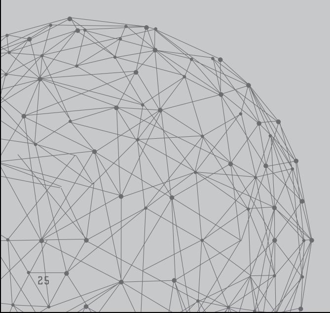

2015. As the U.S. engaged in training with EU and non-NATO partners in the region, the Russian military also increased its military presence in kind.

Concerns regarding energy security and the economy were also at the forefront for Putin as the national gas industry, Gazprom, struggled to secure agreements for infrastructure and supply agreements with Europe. As the year progressed and Russia was impacted by U.S. and EU sanctions as well as decreases in the global price of oil, the Russian economy faced the possibility of recession. Perhaps in an effort to hedge against these challenges or to gain information to formulate monetary policy. Russia performed broad intelligence-collection campaigns.

Additional challenges in the energy sphere included regional tensions in Ukraine that precipitated a series of high-profile events involving electrical power infrastructure in the region as reports in December revealed the involvement of BlackEnergy malware in an external attack on at least one power station in western Ukraine.

Major geopolitical themes impacting Russia closely align with the ongoing cyber activity observed in 2015. Considering these activities, in turn, provides a portrait of Russian strategic goals and gives insight into capabilities, priorities, and what actions Russia is willing to take to achieve those ends.

t the outset of 2015. Russia was haunted by the specter of economic sanctions from the previous year. The concerted effort by western powers to compel Russia to withdraw from Crimea only made President Putin more intransigent in his views and led to further shifts away from cooperation. As Russia sought greater autonomy from the west this past year, it has also

strengthened its military posture and refocused its strategic agreements. Russia also took several actions to tighten domestic control on the media, aid groups, and specific political actors. This shift in stance necessitated an increase in information gathering for planning, advantage in negotiations, and security, and that is precisely what has been observed within the cyber campaigns of 2015.

In February, widespread spear phishing conducted by COZY BEAR was detected and analyzed. These attacks targeted numerous entities in government, defense, and non-governmental organizations (NGOs) in the U.S., Europe, Asia, and South America. Review of the email distribution lists indicated targets may have been selected from previously disclosed information breaches, such as the Strategic Forecasting, Inc. (STRATFOR) breach. The involvement of publicly leaked information for targeting has not typically been associated with advanced operators within the Russian sphere, but it could be indicative of the greater need to expand collection and a willingness to broaden the resources they consider acceptable for use.

Additional evidence of intelligence gathering was seen throughout April, as BERSERK BEAR collection was directed against the Middle East. While the exact targets in this campaign are unknown, it is known that a major focus was the oil and gas sector in this region. During the early part of the year, Russia took steps to bolster its economy and buffer the nation against the dual shocks of economic sanctions and falling oil prices. Russia engaged in a number of monetary policy shifts, particularly in the form of interest rate changes at the beginning of the year in order to avoid a steep recession. The expansion of reconnaissance in this region at this time may have been an effort on the part of the Russian government to seek understanding of changes in oil pricing in order to inform these national economic policies.

The focus in May was squarely on the military, as Russia celebrated the 70th anniversary of victory in Europe during WWII. Early in the month, Russian Naval forces engaged in harassment operations in the Baltic Sea as regional nations attempted to lay undersea cable infrastructure between Sweden and Lithuania.

Following the annual military parade in Red Square, Russian military forces took part in joint military exercises with Chinese Navy assets in the Mediterranean. These exercises underscored significant strategic cooperation between the two nations, as China and Russia had also recently signed a cyber non-aggression pact and agreed to share information involving issues of law enforcement and security.

In the background of this regional partnership, however, CrowdStrike observed FANCY BEAR targeting Chinese aerospace manufacturers. Intelligence collected from these campaigns could potentially provide Russia with insight into decisions involving procurement, as the Chinese have been reliant on Russian and Ukrainian military sales in the past. A postscript to this activity may have revealed itself in November, as China purchased two billion dollars worth of Sukhoi Su-35 multi-role fighter jets from Russia. Targeting within this sector provides access to information involving development of Chinese domestic military technologies, which would be of military value to Russia.

Military activities continued through the month of May as Russia projected its air power westward, first in the form of bomber flights near the UK and later in intelligence flights over Estonia. Additionally, snap inspections in the northwestern region of Russia were ordered just as NATO was engaging in Arctic Challenge exercises in late May. One final item of note that supports the discussion involving Russia's increasing control of information: President Putin signed a decree at the end of May

criminalizing the discussion of military casualties in special operations, deeming these deaths "state secrets". This action has the potential to support plausible deniability of involvement in irregular military campaigns like the conflict in Ukraine.

At the end of May, President Putin signed legislation that banned NGOs that Russia determined to be "undesirable" and established the framework for prosecution of employees of these groups. Active targeting of NGOs followed in July as some of the objectives from earlier in the year were again the focus of COZY BEAR spear phishing. Major charitable organizations that had long been operational in Russia chose to cease operations and depart the country in late July. Included within this spear phishing campaign were targets in government, aerospace, media, and energy sectors. Interestingly, following this reconnaissance gathering, Russia again adjusted monetary policy. The Russian Central Bank took steps to limit the purchase of foreign currency and adjusted interest rates downward.

VENOMOUS BEAR conducted a wide-scale strategic web compromise (SWC) campaign throughout 2015 spanning multiple sectors: government, NGOs, technology, energy, and education. Potential motivations for the launch of this broad campaign are unclear, but it is possible that the SWC may have enabled the actor to gauge the response to the address President Putin provided to the UN Security Council on 28 September or to gain insight into planning and response to the Russian engagement of air operations in Syria that began in earnest on 30 September. Additional intelligence-gathering methods were deployed in early October, most likely to either supplement earlier coverage established by the SWC or to add redundancies in targeting to guarantee collection material from specific targets within that earlier campaign.

Russia's engagement in Syria not only preoccu-

pied military leaders and the media, but it also created real consequences for Russian citizens in October when a civilian passenger plane that departed from Egypt's Sinai Peninsula crashed as a result of an improvised explosive device aboard the flight, killing all 224 people aboard. Further impacts of the Syrian conflict were felt when a Turkish fighter shot down a Russian fighter that was returning from a mission conducted in Syrian territory. This action was viewed with hostility by the Kremlin as Turkey, a NATO member, was unapologetic in its decision to order the shoot down, an action President Putin described as "a stab in the back". The event elicited both digital and economic consequences for the Turkish government and banking sector, respectively. On 17 December, several Turkish national banks and government sites were hit by a massive DDoS attack. Simultaneously, the Russian Federal Security Service (FSB) raided international branches of stateowned banks for claims of money laundering.

The end of the year was no less eventful for the Russian government. Energy struggles continued to predominate in the conflict in Ukraine, and an attack on a power station in western Ukraine drew speculation of Russian involvement. In his regular question-and-answer show, President Putin finally publicly admitted to a Russian military presence in Ukraine, but he downplayed the extent of the engagement.

Domestic crackdowns persisted as warrants were issued toward the end of the month for prominent supporters of democracy in Russia. Additionally, companies and organizations that had long-term investments or partnerships in the region continued to withdraw from the country. On the final day of the year, President Putin signed the Russian National Security Strategy, officially codifying much of the strategy he actively pursued in 2015. The document sets forth goals and policies intended to raise the global stature of Russia and contains a significant focus on

domestic initiatives. It also sets the stage for plans that Russia aims to implement throughout 2016.

# THE FIFTH DOMAIN -NFORMATION BATTLESPACE IN UKRAINE

ussia has previously employed cyber capabilities in conjunction with military campaigns, as was observed in the conflict in Georgia in 2008. However, many of the tactics, techniques, and procedures (TTPs) employed in Ukraine are vastly improved from those observed during the Georgia campaign. Current cyber TTPs were informed by early experiences, driven by national strategy, and ultimately refined and integrated into military doctrine in December 2014. Therefore, the continued employment of digital attacks on the military front in 2015 comes as no surprise.

Much of the clandestine cyber conflict in Ukraine focused on directing public sentiment through the application of pressure to centers of gravity. Some of those centers of gravity have been broadly identified through current targeting actions as the military, energy sectors, media, government, and and non-governmental organizations. Looking specifically at the critical infrastructure center of gravity, it is easy to identify a persistent pattern in targeting within the energy sector.

The Ukrainian energy sector was targeted as early as May 2014 when BlackEnergy malware was discovered on power company networks. These attacks came amid Ukrainian national elections as well as negotiations for gas purchases from Russia. Then, in June of 2015, the Russian energy sector was subjected to DDoS attacks when Gazprom, the Russian state gas industry, and its associated bank Gazprombank were targeted.

These attacks were observed during and subsequent to joint Russia/Ukraine negotiations regarding the price of natural gas. Then, in late November 2015, physical attacks were directed at

# "THE UKRAINIAN ENERGY SECTOR WAS TARGETED AS EARLY AS MAY 2014 WHIEN BLACKENERGY MALWARE WAS DISCOVERED ON POWER COMPANY NETWORKS.'

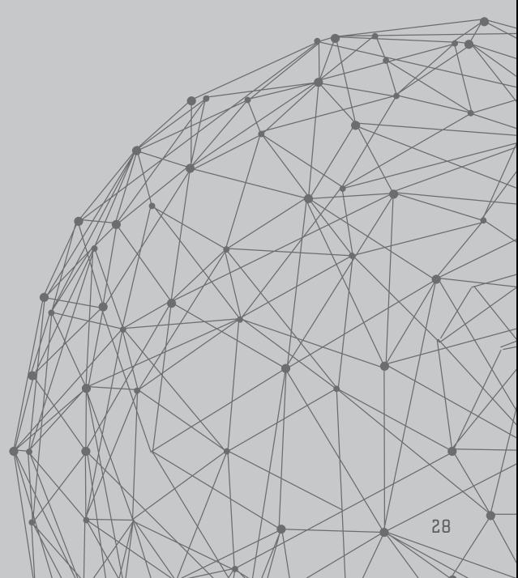

major power lines that delivered energy from Ukraine to the pro-Russian breakaway region of Crimea, leaving approximately two million people in the region without power. In what could be described as a retributive attack, BlackEnergy was again found within energy companies' networks in western Ukraine. In at least one of these companies, this malware was associated with causing a power outage in the region.

The totality of these events, from May to the present, exemplifies how hybrid conflicts are conducted across the physical and information battlespace, also referred to as "the fifth domain". A force able to cause physical effects by leveraging the fifth domain is a force to be reckoned with.

# CYBERBERKUT

█ yberBerkut is a group of pro-Russian separatists operating within Ukraine, involved in regular online attacks against Ukrainian, NATO, and U.S. interests. CrowdStrike first reported on this group in May 2014, shortly after its inception and during the concerted efforts it made to disrupt and undermine Ukrainian national elections in 2014. Since that initial report, the arc of reporting performed by CrowdStrike underscored the degree to which CyberBerkut has impacted both national and international interests in the region and illustrates their willingness to persist in attacking government targets, leaking or falsifying private documents, and publicizing stolen information in support of their propaganda campaign against Ukraine and the west.

Throughout 2015 the group conducted DDoS attacks against German government websites, multiple Ukrainian government websites, and numerous nationalist Ukrainian rivals. In addition to said DDoS attacks, the group consistently made declarations as it sought to illustrate its access to restricted sites, documents, or devices. The group supports claims like these by releasing

# "THERE ARE INDICATIONS THAT CYBERBERKUT HAS TIES TO RUSSIAN STATE SECURITY."

purportedly stolen documents on their site. CyberBerkut posted more than 50 unique items, ranging from emails, reports, agreements, proposals, annotated overhead imagery, and personal identification. The veracity of these documents cannot be independently verified and there have been accusations that the group has edited or even falsified entire releases. It is important to note, however, that despite the questionable nature of their reliability, the document releases tend to garner a great deal of attention.

There are indications that CyberBerkut has ties to Russian state security. These indications are based on several factors. First, CrowdStrike has identified specific correlations between the group's interference in Ukrainian national elections and the messaging delivered by Russia-owned state media that signify close coordination. Additionally, there are significant parallels between the current techniques employed by CyberBerkut and those used in previous conflicts associated with Russia, namely the conflict in Estonia in 2007.

These techniques, leveraging Soviet-style deception, propaganda, and denial tactics, suggest a process in which the first iterations of online warfare implemented in Estonia are now being perfected in Ukraine. CyberBerkut will likely continue to pose a challenge for stability and security within the region, particularly with regard to military forces, diplomatic missions, contractors, and business interests operating in Crimea.

- 
## Meet Berserk Bear: OPERATING SINCE 2004

Objectives: Theft of sensitive information pertaining to international law, diplomacy, non-profit organization, and domestic threats related to political dissent and terrorism.

## Victim Profile:

Energy Government Media NGO/International Organizations

The BERSERK BEAR adversary group has strong ties to Moscow, as well as technical and operational overlaps with other suspected Russian state-sponsored groups such as ENERGETIC BEAR, TEAM BEAR, and VOODOO BEAR. The targeting profile of the group observed by CrowdStrike appears to align very closely with the likely collection priorities of Russian intelligence services.

This group has been operating for at least 10 years; their earliest malware used email-based C2 channels. Over the following several years, the adversary moved to HTTPbased implants and more recent variants with added technical complexities. Notably, during the timeframe of the 2008 conflict between Russian and Georgia, a variant was also repurposed to conduct DoS attacks against Georgian government websites. The operators continue to exhibit a high level of technical skill and regard for OPSEC, but they are not above making tactical errors in the usage of their tools, which has enabled detailed attribution and unique insights into the BERSERK BEAR TTPs, detailed in reporting available to CrowdStrike customers.

Primary Malware: Proprietary Implant

# LARGETED HITRUSTONS

2015 proved to be a tumultuous year on the Korean Peninsula, a year that started off under the cloud of the Sony Pictures Entertainment breach.

In January, President Obama issued Executive Order 13687, which imposed further economic sanctions on the "hermit kinqdom". Numerous hiqh-rankinq officials were executed in 2015 as the younq leader Kim Jonq Un souqht to solidify his control of the reqime. Weapons tests, such as a spring announcement about the test of a Submarine Launched Ballistic Missile (SLBM), and continued development of the missile and space proqrams, further illustrated the intentions of the Democratic People's Republic of Korea (DPRK) to continue aqitatinq the international community.

Drought conditions and continued friction with the Republic of Korea (RoK) surrounding land mines that maimed a South Korean patrol continued to further isolate North Korea. In terms of offensive cyber capabilities, the DPRK focused on espionage in 2015 versus more aggressive operations, which likely supported the requirements of the DPRK leadership to navigate the various international riffs they created in 2015.

CrowdStrike Intelligence observed multiple malware samples with suspected association to DPRK actors throughout 2015. The majority of this malware appears to have been leveraged

in activity for intelligence collection rather than destructive purposes, and was directed primarily against targets within the RoK. Many of the samples were linked back to campaigns beginning in 2014, suggesting either a continuation of previous activity, or a resurgence of those programs. The identification of recent malware samples—particularly around mid-2015—aligns with a period of increased tensions between the RoK and the DPRK, lending further credence that the activity at the end of 2015 was associated with operations aimed at gleaning information of value for intelligence purposes.

# NORTH KOREAN CYBER ESPIONAGE IN 2015

orth Korean cyber activity in 2015 fits into three categories by virtue of the malware that was used. Milmanbag was identified being used against targets in South Korea at the beginning of 2015. Hawup utilized previously unknown vulnerabilities in a popular Korean language word processor to deploy. AIMRAT is closely related to the infamous Operation Troy. One notable point is that all three malware families were heavily deployed in August 2015 when relations between the North and South were most strained.

# MILMANBAG

T n January 2015, CrowdStrike Intelligence identified three exploit documents leveraging L identical shellcode to that which was identified in the attacks against the networks of Korea Hydro & Nuclear Power Co. Ltd (KHNP) by suspected DPRK actors in late 2014. The first of the exploit documents dropped a destructive Master Boot Record (MBR) wiping malware that matched the malware found at KHNP. However, the two other exploit documents dropped a Remote Access Tool (RAT) and a keylogger. Analysis of the RAT—known as Milmanbag—revealed notable similarities to an espionage campaign identified in 2013 against RoK entities known publically as "Kimsuky". After CrowdStrike began tracking the Milmanbag RAT, further identified samples revealed activity occurring in August 2015, leading to the assessment that the actors behind this campaign remained active or had resurfaced. While the infection vector remains unconfirmed, it is believed to be delivered via spear phishing, as some instances of the malware are known to have been spread through exploit documents targeting the Hangul Word Processor (HWP) software. Of note, HWP is primarily used in South Korea, especially in the government sector.

The Milmanbag RAT likely acts as a first-stage tool as it transmits basic system information and downloads further malware. As aforementioned, tool marks in the RAT binaries suggest a similar programming style as the malware used to conduct the wiping attack against KHNP in December 2014. In addition, artifacts in the binaries suggest a Korean-speaking author. Based on the use of HWP documents, it is suspected that RoK entities were the primary targets of this malware. This aligns with the previous target scope of Kimsuky operations in 2013, which targeted multiple RoK entities in the government and think tank sectors.

# HAWUP

▼ n September 2015, open source reporting identified further malicious HWP documents in L the wild exploiting a new vulnerability, CVE-2015-6585. CrowdStrike identified two exploit documents associated with this vulnerability apparently used in an August 2015 campaign malware known to CrowdStrike as the Hawup RAT.

One of the CVE-2015-6585 exploit documents dropping the Hawup RAT used a Korean-language document lure titled "Scrum vs Kanban.hwp". This decoy document appears to be information directly taken from a January 2014 blog post from the authentication services provider Stormpath titled "So Long Scrum, Hello Kanban". The creation of a custom-made lure document from a blog post is interesting, as advanced adversaries tend to use pre-existing documents, often to maintain the air of legitimacy. Additionally, given the date of the article, it is possible this lure was created and leveraged as early as January 2014. The use of a subject lure directly associated with a company specializing in user management and authentication services also suggests a very specific target scope for this activity.

# AIMRAT

uring September 2015, CrowdStrike encountered another targeted RAT utilizing the AOL Instant Messenger (AIM) protocol for Command and Control (C2), which is now referred to as AIMRAT. The AIMRAT malware uses the Open System for CommunicAtion in Realtime (OSCAR) protocol to communicate with its controller, which is likely to consist of a custom Graphical User Interface (GUI) program sharing common code with the RAT. The RAT uses a set of AIM accounts set up in advance by the attackers. The use of a normally benign protocol, and the inclusion of various obfuscation and anti-analysis features over the observed course of the RAT's development from early 2014 to late 2015, suggests that the operators have some concern for operational security (OPSEC) considerations. Although the infection vector used to deploy the RAT is unknown, the small scale of the activity suggests that it is highly targeted in nature.

Technical analysis of AIMRAT also revealed the activity associated with the malware appeared to be carried out by likely Korean-speaking actors since at least January 2014 through July 2015. Additionally, there were identified instances of the malware author using the word "Troy" in place of Trojan in a number of identified samples, a naming convention identified in the public reporting on DPRK activity known as Operation Troy in 2013.

The timing of the other identified DPRK-associ-While the identification of suspected DPRK-asated samples appears to be directly associated sociated malware could be indicative of either a with increased tensions between DPRK and RoK. continuation or resurgence of DPRK espionage The majority of identified samples appear to have operations, one thing remains clear: DPRK actors remained active in 2015. As the observed activity been created around July and August 2015 when landmine blasts, loudspeakers blaring propaganda, appeared to be primarily directed towards RoK an exchange of artillery fire, and threats of hosentities during a period of heightened tensions, it is highly likely DPRK actors will continue to tilities quickly increased tensions between DPRK stay active through 2016 as tensions between and RoK. Espionage targeting against RoK entities during this time frame would yield information the two countries remain unstable.

that would be of interest to DPRK intelligence operations and aligns with known DPRK intentions.

Notably, open source reporting in November 2015 acknowledged what appeared to be a resurgence of malware connected to Operation Troy (also known as Dark Seoul) campaign from 2013. Malware samples with behavior similar to the aforementioned Operation Troy campaign were identified dating back to June 2015, more than two years after the original attacks in South Korea were reported. Researchers who revealed the activity further noted that these attacks likely leveraged spear phishing to deliver a Trojanized version of a legitimate software installation executable hosted by a company in the industrial control systems sector. Identified targets included a transportation and logistics sector in Europe.

This specific targeting could align with RoK's participation in the Iron Silk Road/Eurasia Initiative, a plan to connect transport and energy infrastructure from Asia through Russia into Europe. RoK president Park Geun-hye has repeatedly called on North Korea to rebuild the disconnected railway sections in the Demilitarized Zone on the North's side in cooperation with the project. In early July 2015, the RoK launched a 20-day train journey through Asia and Europe in order to raise awareness for the initiative. It is possible, therefore, that the aforementioned transportation targeting was an effort to garner further information on this particular event.

- 34
# TARGETED INTRUSIONS

Several notable geopolitical events occurred in Iran during 2015 that shaped cyber activity, and will continue to do so into 2016.

Several notable qeopolitical events occurred in Iran during 2015 that shaped cyber activity, and will continue to do so into 2016. The most important of these was the finalization of the Joint Comprehensive Plan of Action (JCP0A) that occurred in July 2015.

The JCPOA, an agreement reached to ensure a peaceful end to Iran's nuclear program, dominated the coverage of Iran in 2015. Iran's implementation of the requirements laid out in the JCPOA will lead to the long-term lifting of sanctions currently related to Iran's nuclear program. The JCPOA's "Implementation Day" is the day Iran confirms it has met all obligations of the JCPOA agreement and economic sanctions will be terminated (but can be reinstated in the event of significant non-compliance). Implementation day occurred on 16 January 2016.

The Iranian government seems to distinctly understand that the lifting of sanctions, including the unfreezing of financial assets and the subsequent influx of funds and revenue as Iran reopens trade internationally, also comes with a certain corresponding infiltration of western influence. There were already political machinations occurring in 2015 that allow the Iranian government to better prepare to combat

these influences using its cyber capabilities, such as the renewed appointment of members of the Supreme Council of Virtual Space.

The Iranian government also showed constant attention to Islamic values and the Internet. Iran is taking the advantages of the Internet for Iran's economic and Islam's cultural benefit very seriously as implementation of the JCPOA nears, but it is recognizing the significant impact western influence can have. It is highly likely Iran intends to use all the resources at its disposal, including national cyber capabilities of censoring and monitoring, to diminish the impact as far as possible.

Portions of Iran's 6th Five-Year Plan (6th FYP, 2016-2021) also reveal the Iranian government's focus on improving national cyber capabilities. Such improvements support many national goals, several of which are likely to continue to control and censor the flow of information in Iran and strengthen national capabilities to support Iran's aspirations toward regional hegemony.

# "THE BLACK SPIDER PROGRAM REPORTEDLY HAD BEEN DEVELORED SOLELY AS AN INVESTIGATIVE TOOL FOR FACEBOOK ACCOUNTS, MONTHORING AMIC. VAL

HOWEVER. IRANIAN OFFICIALS ALSO STATED IN MARCH THAT THE PROGRAM WOULD BE EXPANDED TO INCLUDE OTHER MESSAGING AND SOCIAL MEDIA APPS, SUCH AS INSTAGRAM, VIBER, AND WHATSAPP."

During 2015, law enforcement appeared to step up arrests of Iranian Internet users posting unacceptable content online. Authorities announced the use of technical programs, such as Black Spider, to locate and arrest Iranian social media users, sending the message publicly that circumventing government filters may allow visitation of blocked websites, but does not protect Iranians from arrest.

# IRANIAN CONTROL OF WESTERN INFLUENCE

In 2015 the Iranian regime sought to shield the country's netizens from dissident and pro-democratic ideas. These actions ultimately meant to prevent the infusion of western ideology into Iran resulted in the arrest of individuals who were seen as problematic to the regime. Internally. Iran's targeted cyber operations included reports of arrests of Iranians for their online activities, largely for charges that are variations of offending Islam or blasphemy.

▼ n March, the Iranian Cyber Police reported 12 arrests that took place in January, which _ included Iranian student activists. Notably, two of the students were previously arrested in the 2009 election protests and were members of the Green Movement. Those students, and others like them, had likely been continuously monitored for other opportunities of arrest. The Iranian Cyber Police stated they had employed a program called Black Spider to investigate the suspects' Facebook accounts and had arrested them for various crimes including posting content contrary to Islamic values.

The Black Spider program reportedly had been developed solely as an investigative tool for Facebook accounts, monitoring approximately eight million accounts for content contrary to Islamic values. However, Iranian officials also stated in

March that the program would be expanded to include other messaging and social media apps, such as Instagram, Viber, and WhatsApp.

In June, another individual was arrested, accused of starting 23 anti-cultural groups on the messaging applications LINE and WhatsApp. At least 11 others were reported, also in June, and arrested for "anti-security activities" on social media and for corruption using social media. Lastly, in August, it was reported that four individuals were arrested for "promoting prostitution and blasphemy" online.

66

ONCE PRESIDENT ROUHANI TOOK OFFICE IN 2013, THE SUPREME COUNCIL OF VIRTUAL SPACE WAS EFFECTIVELY NON-EXISTENT, AS ROUHANI'S ADMINISTRATION ATTEMPTED TO PUSH INTERNET INITIATIVES AND PUSH BACK ON HARDLINERS' STRICT LAWS BANNING OR BLOCKING THEM.

### 99

This is not the first time the Iranian government has been concerned about the influence of western online social media and messaging applications. Facebook and Twitter have been banned since the 2009 elections, believed by the Iranian government to have contributed to the protests. Gmail, Yahoo, and Google were banned from February through October 2012.

In January 2015, online apps LINE, WhatsApp, and Tango were under threat of ban. Further, in October 2015, encrypted messaging app Telegram experienced interruptions and two days of blocking

after reportedly receiving a communication from Iranian officials requesting monitoring tools for the program. Iranian officials deny the accusations.

Most notably, the arrests send the message to the Iranian populace that although Internet users in Iran can access banned or blocked websites via Virtual Private Networks (VPNs), the Cyber Police continue to monitor users' activities and are willing to arrest those acting in opposition to the beliefs and values of Islam.

The Iranian government's focus on strengthening and improving its cyber capabilities can be seen clearly when observing the events around the recent reappointments for members of the Supreme Council of Virtual Space by Ayatollah KHAMENEl on 5 September 2015.

The Supreme Council was first established in March 2012, nearly two years after the discovery of Stuxnet in June 2010, while Iran was still in the early stages of improving its cyber defenses and capabilities. There are some criticisms, mostly by hardliners, that once President Rouhani took office in 2013, the Supreme Council of Virtual Space was effectively non-existent, as Rouhani's administration attempted to push Internet initiatives and push back on hardliners' strict laws banning or blocking them.

Those chosen for positions include the president, several ministers, the IRGC, and police chiefs. The leaders chosen for the positions were not as surprising given the move the Supreme Leader made once choosing them—to give the authority of Internet policy and regulation within Iran completely to the Council by dissolving similar responsibilities in other government entities and putting them under the responsibility of

the Council. This established ultimate authority of Iran's Internet censorship and the development of the National Internet ultimately under the government entity answering to him.

Ayatollah KHAMENEI then called for members of the Council to quickly bring Iran out of its "existing passivity in cyberspace" and provided guidance for them to work quickly on the National Internet, also giving them the equally large task of developing administrative and organizational parameters for cyberspace such as security, legal, judicial, and an enforcement system among others, such as considering how to protect Islamic values online.

The efforts of the Iranian leadership in 2015 clearly depict a regime struggling with the benefits and the threats of the impending JCPOA and the outside influence that is attached to it. On the one hand is much-needed economic relief from the years of isolating sanctions, on the other, the influence of western ideology that threatens to come during crucial election cycles.

n 30 June 2015, just before the finalization of the JCPOA, Supreme Leader Ayatollah Ali KHAMENEI revealed the outline of Iran's 6th Five-Year Plan (6th FYP). Within the 6th FYP there are several areas that show Iran's upcoming focus of improving its infrastructure and cyber capabilities.

The first priority over the next five vears is to gain "superior status in the region" with the development of the National Information Network (National Internet). While the National Internet project was conceived in 2006, at this time it is not nearly the insulated network that it was touted it would be, as a Halal Internet of sorts. Rather there are a few indigenous online search engines and social

media websites replicating western originals. Now that Iran is experiencing the challenge of reopening international trade while attempting to filter out western and un-Islamic ideals that could come with it, the government has increased political will to complete some variation of a more shielded National Internet as a part of the solution. To this end, Iran announced—once in January 2014 and again in June 2015—that China would cooperate with Iran in the continued development and completion of Iran's National Internet.

Another emphasis for the information, communication and technology sector (ICT) improvement by the Supreme Leader in the 6th FYP is to increase the number of indigenous social networks by at least five times. Indigenous social networks would ease the ability of the government to monitor users' posts for any western influence, content contrary to Islamic beliefs, and threats to the regime, yet allow the Iranian population to continue to share in the widespread pastime and potential revenue-generating platform.

The 6th FYP also calls for increased infrastructure investments in the ICT sector to mirror the level of infrastructure in top countries in the region. This effort undoubtedly enhances the daily life of millions of Iranians and provides vital enabling infrastructure for what will be a rapidly expanding e-commerce system, but it also provides a stronger backbone from which to conduct cyber operations.

Reference is made by the Supreme Leader to improving cyber capability in the 6th FYP with regard to defense and security. The statement is to allocate at least five percent of the public budget for defense to "increase the balance" as a regional power. In accomplishing this, the objective is to create a soft power capacity and provide cyber defense and cyber security defense for infrastructure. However, it is not clear what the distinction is between cyber defense and cyber security defense, as the two seem closely

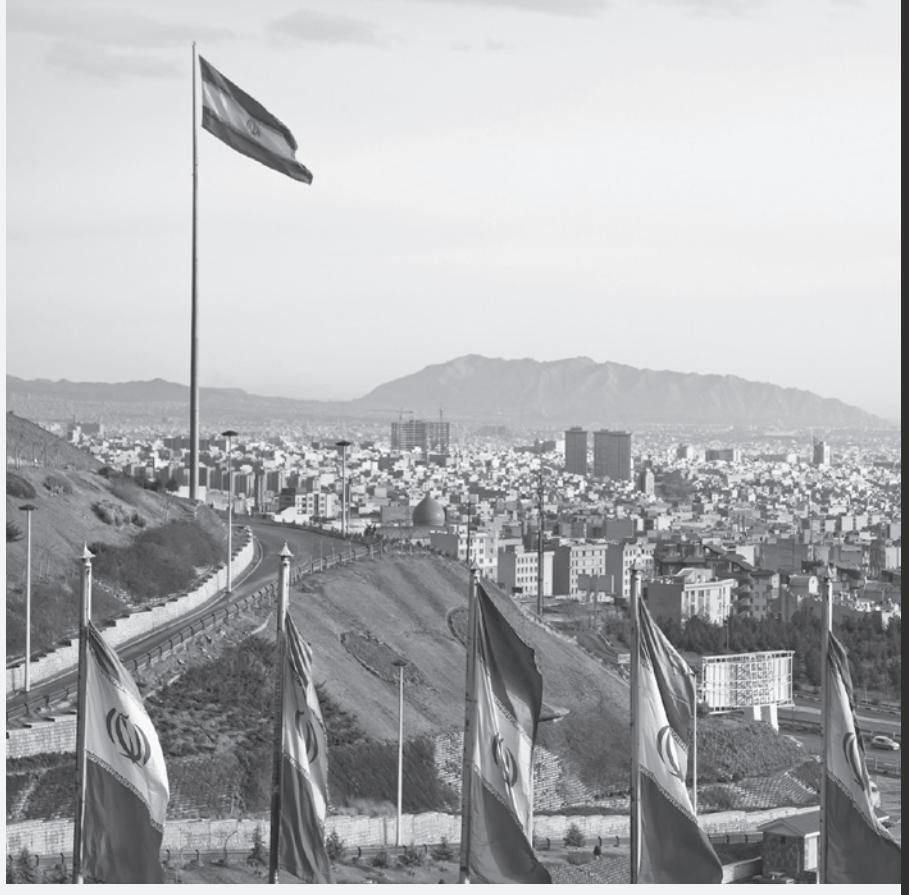

related and no additional details are provided.

Lastly, and not surprisingly considering the Iranian government's current obsession over the threat of western influence, there is one last reference in the 6th FYP regarding improving Iran's cyber capabilities. When discussing the future improvements for Iran's culture, a focus is given to create an online presence for cultural and government institutions to promote "culture, concepts and Islamic identity" and also to "counter Iranian threats". The threat to Iranian and Islamic culture is clearly a great concern for Ayatollah KHAMENEI. However, there are no details about exactly how the government would counter "Iranian threats". It is not likely the threats are being solely considered foreign threats. It is more likely that Iranians living in Iran will come under great scrutiny of the affiliations they develop with foreigners going forward, and any perception of them disseminating western ideals as a threat against Islam or the lranian government. Additionally, foreigners in Iran will likely be under great scrutiny as well.

"IRAN ANNOUNCED-ONCE IN JANUARY 2014 AND AGAIN IN JUNE 2015-THAT

# 5-YEAR PLAN

# NUCLEAR ENERGY RELATED BUSINESSES

### Impact:

- · Mergers and acquisitions, multi-party bids
- Research into safer nuclear energy usage
- · Technology supporting nuclear energy
- Nuclear facilities know-how

## CLEAN ENERGY

### Impact:

- Processes and techniques for clean energy production
- International climate policy and discussions
- International emissions research and reporting
- Clean energy technology

## OIL

### Impact:

- · Oil company pipeline construction projects
- Operations and surveys in South China Sea
- Bidding and contracting for resources
- Extraction, mapping, and safety technology

## HIGH-SPEED RAIL PROJECTS

### lmpact:

- · Railway project bidding
- Government transportation authorities
- High-speed rail technology/research

## ELECTRIC/HYBRID TRANSPORTATION

### Impact:

- Electric car production facilities
- Charging station technology
- · Companies developing component technologies

ROCKET KITTEN is an adversary group that is suspected to operate out of the Islamic Republic of Iran. Their primary targets are Israeli organizations adjacent to the defense and space sectors, western governments, and minorities, as well as political opponents in and outside of Iran. The individual campaigns by this group align with tasking to support a mission as it would be expected of a group that conducts espionage on behalf of the Iranian government; various rounds of talks between the P5+1 group and Iran with regard to the country's nuclear program were accompanied by attacks against the countries hosting the meetings.

Furthermore, an ongoing espionage program against Israeli targets of military interest is in line with the Iran/Israel proxy conflict that experiences increasing tension since the Arab Spring, and especially since the Syrian Uprising in 2011. Targeted attacks by ROCKET KITTEN against the Israeli victims seem plausible against the backdrop of these military conflicts. Finally, several attacks targeted minority groups like the Bahá'í that are subject to constant persecution in Iran.

# Meet Rocket Kitten: OPERATING SINCE 2014

Objectives: Theft of sensitive information pertaining to scientific and technological research, political meetings/discussions, military/defense organizations, and dissident groups in and outside of Iran.

### Victim Profile:

Aerospace Defense Government Research Technology

# Primary Malware:

Commercial Pentesting Tool

# TARGETED INTRUSIONS

The Indian government has expressed concern that the Islamic State (ISIS) and other extremist groups are reaching out to Indian Muslims by spreading jihadi messages in native Indian languages.

Officials in the Ministries of Home and Telecommunication, the Intelliqence Bureau (IB), National Technical Research Orqanisation (NTRO), and Computer Emerqency Response Emergency Team-India (CERTIn) have deliberated on ways to combat this threat to include setting up a 24/7 operations center to monitor social media.

CrowdStrike Intelligence observed an increase in VICEROY TIGER targeting in the Middle East over the summer of 2015, perhaps in response to these political concerns. The campaign used CVE-2012-0158 and lures that referenced the U.S./Iran nuclear agreement as well as regional issues.

Underground hacking groups in India have also united to address the ISIS threat. Following the terrorist attacks in Paris, the previously disparate groups joined forces to take down ISIS-linked Twitter accounts and launch DDoS attacks against ISIS websites. Only a few days later, some of the same hacker groups launched defacement campaigns against Pakistani websites on the seventh anniversary of the Mumbai attacks.

|  | CrowdStrike noted several upgrades to |
| --- | --- |
| er | VICEROY TIGER's toolset in 2015, including |
| e | Zonero, a Python-based RAT. A variant of |
|  | AndroRAT, purportedly developed by VICEROY |
|  | TIGER, it includes functionality that suggests both |
|  | Pakistani and Middle Eastern targeting. These |
|  | new capabilities provide evidence that NTRO |
|  | and other Indian organizations are preparing |
|  | to expand their efforts in monitoring threats. |
|  | The Indian government remains concerned |
|  | about the percentage of their websites that are |
|  | vulnerable to attack. In addition to offensive cyber |
|  | operations, India is making large investments |
|  | into network defense initiatives. India continues |
|  | to pursue cybersecurity agreements with Singa- |
|  | pore and other ASEAN countries to collectively |
|  | fortify against Chinese cyber espionage |

# TARGETED INTRUSIONS

While the Latin American region normally sees fewer state-sponsored targeted intrusion activities than other regions, 2015 saw the unraveling of one such campaign based out of Colombia.

The case has come to be known as Andromeda, after the name of a cyber-intelligence cell operating on behalf of the Colombian military. The activity consisted of the recruitment of civilian hackers on the part of the Colombian security services for the purpose of spying on various tarqets. The main objectives were members of the FARC-EP insurqent force, but there were also victims amonq foreign government officials, human riqhts activists, and local politicians.

The principal attack vector for this campaign appears be spear phishing emails featuring lure documents thematically ranging from politics to music to pornography. The victim's computer is then infected with files from the Ragua toolkit that is disguised as Java. The toolkit is uniquely attributed to this group and its usage dates back to at least 2008. It contains features such as logging of keystrokes and the clipboard; capturing of audio; geolocation; screenshots; and exfiltration of files from the local hard drive or attached USB drives to a remote server or a specially prepared USB storage medium.

The authors chose Python as the programming language, converted the scripts to stand-alone Windows executables, and wrapped a Nullsoft Scriptable Install System (NSIS) installer around them, also including a decoy. This leads to very large files sizes and is, together with the choice of Python as the primary programming language, an indicator of rather low sophistication.

The context for the case is closely linked to the evolving reality of Colombian politics and national security policies. The Andromeda cell (and similar initiatives) was established by the Colombian military during times of open conflict

between the government and armed groups like FARC-EP and ELN. The president at the time was Álvaro Uribe, and the Minister of Defense was Juan Manuel Santos. By the time Santos was elected to succeed Uribe, FARC-EP was reeling from military operations, and peace negotiations in Havana were initiated. However, the evidence suggests that not only did the Andromeda cell continue to target conflict-related objectives, but it also began targeting the Santos administration itself in retaliation for its perceived softness on FARC.

Despite the fact that this campaign is known to have been dismantled, with some of its participants prosecuted by the executive and judiciary branches of the Colombian government, CrowdStrike is currently monitoring continuing activity. This activity may be an indicator that the Colombian state's ample security apparatus still possesses cyber-intelligence units that operate with little or no civilian supervision. Potential targets are the negotiations in Havana, and the Santos government and its former allies (now bitter rivals) in the Álvaro Uribe camp. In addition to this, Colombia continues to have poor relations with the Maduro government of neighboring Venezuela—another logical target for Bogotá's cyber-intelligence efforts.

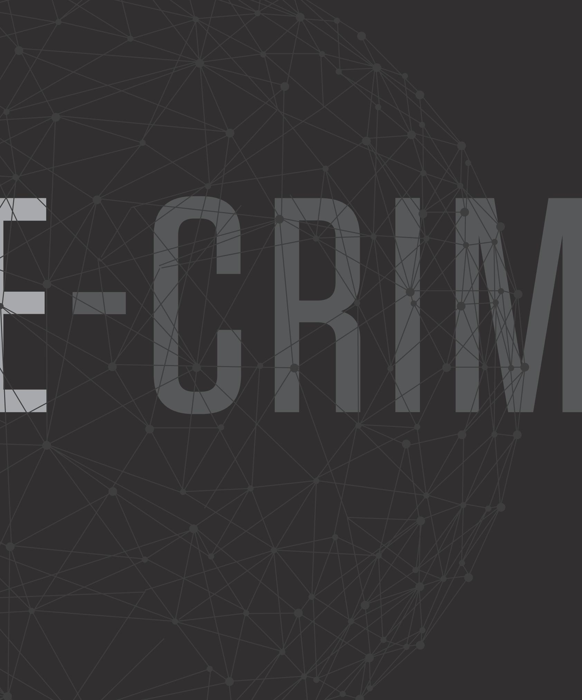

# 2015

# TRENDS IN ECRINE ACTIVITY - 2015

2015 was an active year for cyber crime. CrowdStrike observed growth in the popularity and sophistication of banking Trojans, ransomware, and exploit kits.

riminal activity in the cyber domain, eCrime, is a complex topic. There are many different components to eCrime; this includes the distribution of malware, complex phishing schemes, malware operations, monetizing funds from compromised systems or accounts, the laundering of funds, and reshipping schemes for ill-gotten gains. The reality is that eCrime is an ecosystem, where different organizations and individuals weave intricate relationships in order to exploit their victims, and they are constantly evolving and improving their tradecraft.

To understand the eCrime threat landscape, one must use a wide aperture to fully appreciate the variety and magnitude of the problem. In 2015, CrowdStrike observed some interesting trends in the criminal activity affecting our customers, ranging from technical innovations through novel attack techniques. Notably, 2015 saw the re-emergence of extortion schemes using Distributed Denial of Service (DDoS) attacks; this behavior has been replicated by several actors.

Additionally, there was a massive uptick in intelligent phishing schemes where the attackers leveraged remote access toolkits to learn the lexicon of their targets, and they used the intelligence they collected to devise compelling schemes in order to manipulate targets in the finance organizations of companies. Criminal activity continues to thrive in the shadow of legal impediments to law enforcement, and the ability of the actors to hide in the relative anonymity of the Internet.

# TRENDS IN ECRIME ACTIVITY - 2015

- In 2014, CrowdStrike predicted the increased presence and development of the large-scale banking Trojans Dridex and Dyre. Code development on Dridex has been extremely active, first adding public key cryptography and then full end-to-end SSL for communications, in addition to a host of smaller changes in code. Dyre has seen more steady development, with only minor code modifications taking place. Instead, most changes happened within its distribution mechanism with the introduction of Pony Loader (a.k.a. Fareit) being used alongside the usual Upatre delivery. Upatre itself integrated new sandbox detection techniques to evade automated analysis, making it more
difficult to track second-stage hosts. Both threats remain prevalent and have increased targeting beyond their original focus of the U.S. and the UK to the rest of Europe, Australia, and other developing parts of the world.

- While Dridex and Dyre have continued to monopolize the banking Trojan market, Neverquest (a.k.a. Vawtrak) has also seen a steady rise in popularity. New contenders have started emerging, too, with Shifu and Core Bot appearing around summer 2015 and both containing the capability required to gain a share of this market. The leak of the Tiny Banker (a.k.a. Tinba) source
code has had a similar effect to the Zeus source leak, with multiple groups popping up with slightly tweaked and repacked Tinba instances.

- · The CrowdStrike Intelligence prediction of increased use of ransomware during 2015 also came to fruition. A number of different families have emerged in the wake of the success of the now-defunct CryptoLocker, with its successor CryptoWall, in its fourth generation, emerging as the file-encrypting malware of choice. Crypto-Wall's success was likely fueled by the adversary's ability to adapt, reading blogs by researchers and security vendors about weaknesses in their product and then fixing them. Early versions of CryptoWall, for example, stored the private decryption key locally on machines, enabling victims to trivially decrypt their files until this information was made public. CryptoWall is far from the only ransomware available, with large campaigns emerging toward the end of 2015 of the new Teslacrypt and reappearance of Nymaim, a loader that also contains a locker component.
- · Phishing emails continued to dominate crimeware distribution throughout the year as the primary mechanism used for the aforementioned banking Trojans and ransomware threats. 2015 saw an increase in popularity of Office-based macros for distributing malware, and a variety of Microsoft Word and Excel macro builder kits have become available on the criminal underground. Some kits have added complexity that includes macros that drop Visual Basic and Powershell scripts to disk to fetch files from compromised URLs, and in some cases even deploying these scripts in encrypted form via cloud services such as Pastebin or Dropbox. Removing these interim scripts after a campaign hampers researchers' efforts in tracking these threats, which elongates the lifespan of the payload on infected hosts.
- In addition to phishing attachments, exploit kit usage rose throughout 2015 fueled by the wealth of Flash vulnerabilities and associated exploits. This is a similar trend to the effect the availability of Java exploits had on the exploit kit market back in 2012/2013. Angler has emerged as the current leader partly due to the agility of the adversary in incorporating new exploits such as those made available in the Hacking Team leak. It is also due to the use of techniques adopted by the Angler developers such as virtual machine checks, checks for analysis tools, constantly altering obfuscation and URLs to prevent detection, and even adopting Diffie-Hellman into the encryption process of exploits to prevent analysis. Other kits have been close behind with Nuclear, Rig, and Neutrino all showing an increase in use throughout the year.
- Botnet takedowns were less prominent this year than last, but successful operations did take place. During September 2015, the United Kingdom's National Crime Agency (NCA) led an operation to sinkhole a large portion of the Dridex botnet in conjunction with arresting Andrey Ghinkul (a.k.a. Smilex), one of the sub botnet operators. This caused a hiatus of Dridex with a break in spam runs but saw the adversaries then re-emerge throughout October with further aggressive spam campaigns to rebuild their botnets. This highlights the delicate relationship between technical operations and arrests where actors outside accessible jurisdictions have the motivation and resources necessary to rebuild and carry on an operation after a takedown. In contrast, in February Europol led a technical operation to take down and sinkhole the Ramnit botnet. This did not see the actors attempt to rebuild their botnet, suggesting they may have fewer resources available or that they have alternative means of generating their revenue.

█ rowdStrike Intelligence has observed a significant increase in extortive attacks carried out by organized criminal groups in 2015. Leveraging far-reaching botnets—socalled "stressers" or "booter" services—the goal of these financially motivated actors is not to permanently cripple a brand or business, but instead to temporarily disrupt their target's web presence for long enough to coerce a ransom payment in exchange for ceasing the attack.

CrowdStrike Intelligence tracks multiple extortive criminal groups, including the infamous group DDOS 4 Bitcoins, or DD4BC, which pioneered the techniques replicated by other follow-on criminal gangs. DD4BC actors, tracked by CrowdStrike as PIZZO SPIDER, primarily target businesses that provide payment processing via Bitcoin or that otherwise have a nexus to crypto-currency within their product offerings.

Originally beginning their operations in late 2014, the group continues to follow a consistent pattern of simultaneously initiating a low-intensity (5-10 Gbps) DDOS attack on a target while at the same time making contact privately via email to demand a ransom payment. Ransom notes from the group follow a routine format, with an introduction and explanation of the group's previous exploits and DDoS power, followed by a demand for a varying amount of Bitcoins. The group also includes threats of increasingly powerful DDoS attacks and costs to resolve the attacks if payment is not made promptly.

PIZZO SPIDER actors have not utilized social media platforms to call out targets during the initial stages of attacks, likely in an effort to allow targets to retain plausible deniability during that phase. A targeted company identified by the actors as paying the ransom could face

social media backlash for kowtowing to the group's demands, and cause future targets to be less likely to respond to ransom demands.

In 2015, extortion schemes carried out by PIZZO SPIDER broadened from Bitcoin mining pools, gambling websites, and virtual currency-based businesses to include larger and more mainstream companies and major financial institutions in the U.S., Europe, Asia, and Australia. More than 100 different attacks believed to be attributed to PIZZO SPIDER were observed in 2015, prompting CERTs and regulatory associations in multiple countries to issue warnings about the threat posed by DD4BC. leading to the arrest of two individuals associated with the group.

The success of PIZZO SPIDER has not gone unnoticed and has enticed copycat actors to emulate their TTPs. A group of criminal actors operating under the name Armada Collective began extortive DDoS operations in late 2015. The group primarily targeted secure email providers using an attack playbook almost directly copied from DD4BC. Attacks by Armada Collective are believed to be largely ineffective, with actual DDoS capabilities falling well short of the group's claimed 1 Tbps attack power.

A notable event in Armada Collective attacks occurred after an initial DDoS campaign targeting secure webmail provider ProtonMail. After ProtonMail administrators paid the initial ransom to anonymous Bitcoin wallets belonging to Armada Collective attackers, a second significantly stronger DDoS attack was undertaken. Follow-up comments from Armada Collective on social media disavowed responsibility for the second wave of attacks and stated the group did not have the resources for the sustained 50 Gbps of traffic that disabled ProtonMail. No actors have since come forward to claim responsibility, leading to speculation that nation-state-sponsored attackers with a vested interest in knocking the crowdsourced

secure email provider offline used the Armada Collective attacks as a cover for their actions.

The anonymous nature of these attackers, combined with the high media profile surrounding the attacks, has lead to the possibility of differing groups of attackers using the name and tactics of Armada Collective for their own uses. In late 2015, three Greek banks were targeted by attackers using the Armada Collective name and TTPs, however a significant difference was seen in the amount of ransom demanded by the attackers. In this case more than 20,000 Bitcoins were demanded, a ransom equal to more than 7.2 million dollars at the time of the attack. This exponentially larger ransom was out of character for previous Armada Collective attacks, which demanded 20-50 Bitcoins from their targets. In the case of ProtonMail, Armada Collective even refunded a portion of the ransom once the DDoS was sustained by unknown actors after the initial attack.

These criminal actions, while illegal in many countries, are extremely difficult and expensive to mitigate once an attack commences. Many of these attacks abate due to the attacker's short attention span, or over-stated capabilities, running out. While DDoS attacks are hardly a new phenomenon, organized criminal groups utilizing their skills and botnets for extortive attacks recently re-emerged with a now-proven efficacy.

l he prevalence of social engineering schemes using inside knowledge of the target flourished in 2015. These scams, which seem to be perpetrated by Nigeria-based criminal groups, may be responsible for the largest heists in 2015. CrowdStrike Intelligence tracked scammers who successfully conducted social engineering operations against numerous organizations across multiple business verticals

during the last year. These operations leverage social engineering techniques to deceive financial personnel into transferring money to criminals masquerading as representatives of organizations doing business with the target. The necessary knowledge about the target organization, including the identity of vendors, social conventions, and organizational structure, is most likely acquired in a preparation step, using commodity malware or openly available tools such as njRAT, Netwire, and Keybase keylogger.

Generally, these scams fit into one of two scenarios. In the first, the attacker will construct an email from a corporate executive, spoofing the Reply to field or using an approximate domain

# "THE ATTACKER WILL ATTEMPT TO MODIFY THE PAYMENT ACCOUNT, CAUSING THE VICTIM TO UNKNOWINGLY

—which may only be registered temporarily using a technique known as domain tasting—to trick the recipient. The scam varies and is often created completely manually, making very specific targeting possible and also indicating different approaches by different advisaries.

In some cases the actor will simply request money to be sent to a specific account; in more complex schemes, they will spoof the first email from a corporate executive and reference using outside counsel. Soon after, someone purporting to be outside counsel will contact the victim with specifics of the transaction. In at least one scam, the attacker held numerous telephone conversations with the victim from a mobile phone number. The payments may be requested in incremental amounts or in a lump sum, again pointing to multiple adversaries.

The second scenario became more prevalent in the latter half of 2015, with the actor targeting accounts payable offices spoofing vendors known to the victim. The attacker will attempt to modify the payment account, causing the victim to unknowingly deposit accounts-payable funds to attackers versus the legitimate vendor account. These attacks may go unnoticed for months until the accounts payable department is contacted by the vendor.

Organizations across all sectors should remain vigilant for these types of scams. Emails requesting the transfer of money should be validated by multiple individuals to assure that payment to the intended organization is appropriate and that the account information provided is correct. Personnel should be trained in methods to verify that emails requesting transfer of funds are coming from legitimate email addresses and not from spoofed addresses.

▼ n the past, malware has often been distinguished as being either commodity or specifically crafted to fit a certain target. Often, this classification of the malware indicates the class of the incident: Obviously, a sample of a malware family known to engage in spam campaigns is unlikely to have been used as part of a targeted espionage attack. Vice versa, a malware with pure surveillance functionality does not fit a botnet-like monetization technique that relies on large-scale distributed activities such as sending spam or denial of service. In turn, the type of the incident reflected the actor's motivation, often ranging from pure financial gain to state-sponsored intelligence gathering. While certainly applicable to some cases, this distinction is no longer exclusive.

There are a number of examples that highlight that the boundaries between commodity and targeted attack malware blur. TeamViewer remote administration software is a classic example of a tool used for both cyber espionage and criminal activity. CrowdStrike tracks a Russia-based adversary, TEAM BEAR, that primarily used TeamViewer in targeted intrusion campaigns focused on political and military institutions in countries of interest to the Russian state. Crowd-Strike has also observed a number of criminal campaigns leveraging the TeamViewer tool.

A more recent example of the crossover between cyber espionage and criminal campaigns occurred In spring 2015, when CrowdStrike identified a malware family it refers to as DownRage, which is used by the Russia-based adversary FANCY BEAR to conduct targeted intrusions. This malware exhibits code overlap with the Carberp banking Trojan. One explanation could be that Carberp and DownRage were authored by the same entity. However, given Carberp's source code leak in mid-2013, it is equally reasonable

# DOWNRAGE.

WHICH IS USED BY THE RUSSIA-BASED ADVERSARY FANCY BEAR TO CONDUCT TARGEMED WATERIONS. THIS MALWARE EXHIBITS CODE OVERLAP WITH THE CARBERP BANKING TROJAN."

"THROUGH THE USE OF STEGANOGRAPHY, IT IS ABLE TO HIDE MALICIOUS CODE IN INNOCUOUS IMAGES. AT THE SAME TIME, BENIGN IMAGE-HOSTING WEBSITES SERVE AS PEERS IN ORDER TO DISTRIBUTE THE MALICIOUS CODE-

A SUCCESSFUL WAY TO EVARE REPUTATION-BASED PROTECTION MEANS AND A CHALLENGE FOR TAKEDOWN ATTEMPTS."

that DownRage was deliberately made to look similar for decoy purposes. Possibly, the FANCY BEAR malware was intended to be misattributed to alleged Carberp operations in order to cover traces of targeted attack activity and blend in with the bulk of commodity malware in the wild.

As another example, variants of Black Energy, a malware family traditionally used for distributed denial-of-service (DDoS) attacks, have been adapted for targeted attacks. In this specific case, it is likely that Black Energy was shared among multiple actors, and thus it is reasonable to assume that the groups performing DDoS attacks are separate from those conducting intelligence-gathering and disk wiping operations.

Research into the Gameover Zeus botnet suggests that sometimes typical cybercrime activities and intelligence gathering are performed by the same actor. While publicly well known for its banking fraud and the distribution of additional malware such as CryptoLocker, the peer-topeer-based Gameover Zeus botnet was leveraged to search for information regarding foreign intelligence services of Russia's neighbouring countries. In short, some crimeware tools have turned into targeted attack malware and no longer allow a precise classification in either category.

In 2015, the Stegoloader malware was an example of a stealthy and sophisticated tool that fits this category. Through the use of steganography, it is able to hide malicious code in innocuous images. At the same time, benign image-hosting websites serve as peers in order to distribute the malicious code—a successful way to evade reputation-based protection means and a challenge for takedown attempts. Verbose profiling of an infected computer allows the operator to selectively deploy modules required for a specific purpose, such as monetization, or intelligence gathering.

Possibly as a consequence of the confluence of cybercriminal and espionage activities, tomorrow's malware may likely develop into a multi-purpose tool that provides a platform suitable for a wide variety of malicious operations. Such an open-ended architecture and the complexities involved in determining the actor's intent is likely to pose a research challenge to defenders in the near future.

- 
- 
- 
- 
- 
- 
- 

Hacktivism is the loose cannon of the threat landscape. Actors who participate in hacktivism can range from seasoned hacking veterans to angry neophytes who volunteer to join a participatory DDoS. Hacktivism can be conducted in the quise of activism, nationalism, or simply mischief.

Hacktivist activity may occur in concert with geopolitical issues such as the controversial Canadian Anti-Terrorism Act (C-51), which resulted in widespread DDoS against Canadian government organizations. It can also manifest in the form of social activism such as the DDoS attacks against targets in Baltimore, Maryland following the funeral service for Freddie Gray, a man who died in police custody.

Some cases of hacktivism are difficult to distinguish from nation-state offensive cyber activity. Groups like the Syrian Electronic Army (SEA), tracked by CrowdStrike as DEADEYE JACKAL, or the Yemeni Cyber Army can have strong overlap with regimes that want to use nationalistic hackers as a volunteer army to support the cause of a regime.

Hacktivism such as that which followed the Charlie Hebdo events in Paris, or in wake of the increasing presence of Islamic extremism manifested by Da'esh (ISIS) and pro-ISIS groups, may take on an aggressive hacktivist versus hacktivist dynamic. Hacktivism can happen anywhere, at any time, for any reason,

"HACKTIVISM SUCH AS THAT WHICH FOLLOWED THE CHARLIE HEBDO EVENTS IN PARIS, OR IN WAKE OF THE INCREASING PRESENCE OF ISLAMIC EXTREMISM MANIFESTED BY DA'ESH (ISIS) AND PRO-ISIS GROUPS,

59

against any target. Understanding the motivation and core ethos of hacktivist groups can help organizations be prepared to defend themselves against these aggressors; no matter how altruistic their beliefs may be, the disruption and damage they cause can be quite real.

■ eopolitical issues have increasingly served as drivers for hacktivist activity in the Middle East/North Africa (MENA) region throughout 2015. CrowdStrike has specifically observed a significant increase in attack activity from both pro-ISIS and anti-ISIS actors. Regional conflicts such as those in Yemen and Syria, as well as more localized political issues such as the current governmental gridlock in Lebanon, have also proven to be major catalysts for politically motivated actors. Victim sets vary by campaign, however CrowdStrike has noted an increased emphasis on government and financial sector organizations across the globe. Additionally, sustained and disruptive hacktivist DDoS campaigns have been observed targeting organizations across multiple sectors in Saudi Arabia including government, financial, telecommunications, and energy.

## IRAN-RELATED GROUPS

### PARASTOO, REMEMBER EMAD, AND SOBH CYBER JIHAD

██ hroughout 2015 CrowdStrike has observed continued activity from pro-Iranian hacktivist groups. Primary among these are Parastoo, Remember EMAD, and SOBH Cyber Jihad. The earliest activity attributed to Parastoo, the oldest of the three groups, is a 2012 claim to have compromised computer systems at the International Atomic Energy Agency (IAEA). Activity associated with Parastoo, Remember EMAD, and SOBH Cyber Jihad in

2015 consisted largely of sensational but unsubstantiated threats and claims of responsibility.

In August 2015, the self-styled hacktivist group Remember EMAD claimed that it carried out an attack on U.S. Department of Defense (DoD) networks and threatened to leak the allegedly pilfered data. No subsequent data leaks were observed and the group's claims could not be verified. Remember EMAD appears to have formed in 2015, and the name of the group is presumably intended as a tribute to Imad Mughniyeh, a former Hezbollah commander who was killed in 2008. Similarly, in September SOBH Cyber Jihad claimed in an online communiqué to have compromised networks belonging to the U.S. Department of Energy under the banner OpWinterlsComing. The group asserted that it utilized a custom-developed Java-based tool to carry out the attack, however no available evidence has corroborated these claims.

Lastly, in December 2015 the hacktivist group Parastoo issued an announcement via the activist organization Cryptome after recent open source reporting revealed that a cyber attack linked to Iranian actors targeted a New York dam facility in 2013. Parastoo's claim indicated that its affiliate, SOBH Cyber Jihad, was responsible for the attack but that a warning "by state-level power players" prevented the group from making public announcement at that time.

# YEMEN CYBER ARMY

▼ n addition to the three aforementioned in London, Beirut, Riyadh, and New York. groups. which openly operate as pro-Iranian _ hacktivists, CrowdStrike continues to track The second and most significant intrusion operaactivity associated with the self-described Yemeni tion attributed to the YCA in 2015 was the group's hacktivist group, Yemen Cyber Army (YCA). While attack on the Saudi Ministry of Foreign Affairs (MOFA) on 20 May 2015. The adversary released YCA does not self-identify as an Iranian group, its attacks align with the interests of the Iranian a statement via Pastebin and several other paste state. Additionally, public messaging by the group and file-sharing sites claiming that it had hacked suggests a potential association with suspected all sub-domains and servers of mofa.gov.sa and

Iranian groups including Remember EMAD and Parastoo. Most significantly, YCA claimed responsibility for a breach of Saudi Ministry of Foreign Affairs (MOFA) networks in May 2015, and in July threatened further attacks against Saudi energy and financial sector organizations.

YCA first emerged in April 2015 as a self-described pro-Houthi and pro-Hezbollah hacktivist group. The impetus for the group's formation was ostensibly the Saudi-led Gulf Cooperation Council (GCC) coalition's ongoing military action against the Houthi rebels in Yemen. The first observed attack claimed by YCA in 2015 occurred on 13 April and targeted the London-based Al-Havat newspaper. The attack included a defacement of the newspaper's website, which replaced the page's original content with anti-Saudi rhetoric warning readers to "accept Yemen Revolution and join us against your dictators", adding "come with all your Israeli and U.S. made Weapons!" Defacement imagery also showed apparent support for Hassan Nasrallah, the leader of the Lebanon-based Shiite militant group Hezbollah.

In addition to the defacement, the attackers leaked the names, email addresses, and hashed passwords of Al-Hayat's users and subscribers. Despite being a London-based publication, Al-Hayat may have been seen as an attractive target due to the paper being owned by former Saudi deputy defense minister Khalid Bin Sultan. Al-Hayat also holds symbolic value as a target because it is widely characterized as a "pan-Arab" publication and is printed globally including

that its operators were able to successfully breach 3,000 computers and servers at the ministry.

YCA's statement, which was also posted to a variety of additional paste sites to ensure redundancy, claimed that the group was able to successfully breach 3,000 computers and servers at the Saudi MOFA. A 1.5 Gb sample cache of documents, along with a larger collection subsequently provided to and published by Wikileaks, appears to substantiate YCA's claims. Further statements and accompanying screenshots posted by the group claimed that the attack on the Saudi MOFA involved the use of wiper malware, however this could not be independently verified.

# PRO-/ANTI-ISIS ACTIVITY

SIS has proven to be one of the most significant drivers of hacktivist activity throughout L 2015. CrowdStrike observed sustained campaigns leveraging website defacement, DDoS, "doxxing", and social media account hijacking TTPs carried out both by supporters and opponents of the terrorist organization.

Hacktivist operations opposing ISIS most often follow kinetic events associated with the so-called Islamic State, such as the group's release of execution videos or announced capture of territory. In January 2015 a pro-ISIS campaign using the banner #OpFrance was initiated following the attack against the satirical media outlet Charlie Hebdo in Paris. Similarly, pro-ISIS online campaigns are frequently conducted in retaliation to coalition military action against the group or on the anniversaries of significant dates, such as September 11.

Anti-ISIS hacktivist campaigns during 2015 were most commonly led by actors and groups associated with the Anonymous collective. Such campaigns include #OpISIS and #OpParis, which was launched in retaliation to the November 2015 terrorist attacks in Paris. Observed tactics

include: the hijacking of ISIS-affiliated Twitter accounts, doxxing of suspected ISIS members on social media, defacement of jihadi websites and forums, and claimed intrusion and DDoS attacks against known ISIS web forums.

In addition to their disruption of extremist web forums and social media communications, anti-ISIS hacktivist activity has produced collateral effects on unrelated organizations. The most visible example of this mistaken targeting is evidenced by the #OpISIS hacktivist campaign. Likely due in part to the ease with which hacktivists can now leverage paid network stress testing (or stresser services) to conduct attacks, however, target vetting is often minimal and as a result, unrelated organizations throughout the Middle East have become the victims of ensuing attacks.

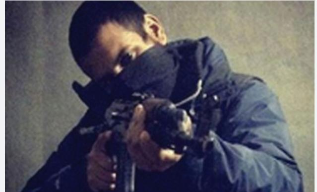

For example, CrowdStrike observed repeated disruptive DDoS attacks leveraged against a Kuwaiti IT services provider throughout 2015. The firm was mistakenly included in compiled target lists due to the presence of Arabic script on its website. Because of the widespread proliferation of target lists among hacktivist actors and the lack of scrutiny given to ensuring that these lists include relevant targets, the firm—along with numerous other innocent victims—has suffered attacks against its public web presence.

Conversely, CrowdStrike observed pro-ISIS hacktivist activity both from newly formed

groups supporting the so-called Islamic State as well as from known MENA-based actors formerly affiliated with the Anonymous collective. Most prominent among the newly formed groups is the IS Hacking Division and the currently active Caliphate Cyber Army (CCA).

The IS Hacking Division group was active during much of 2015 until the October arrest of its leader, Kosovoan national Ardit Ferizi, in Malaysia. The group's activity comprised a series of website defacement campaigns as well as an operation that entailed the compromise of a U.S. online retailer in order to obtain the personally PII of its customers, which included U.S. government employees and military personnel.

This information was provided by the IS Hacking Division to ISIS propagandist and online recruiter, Junaid Hussain. The PII of U.S. military personnel was reportedly used to support ISIS military operations, while additional U.S. government employee PII was publicly disclosed by Hussain via social media in August in a campaign intended to inspire lone-wolf attacks against U.S.-based targets. In late August, Hussain was subsequently killed when a U.S. military Unmanned Aerial Vehicle (UAV) conducted an air strike in Syria against ISIS personnel.

While pro-ISIS hacktivist groups represent the most visible online threat associated with the terrorist organization, they are generally regarded as the least technically sophisticated and are most often inspired, but not directed, by ISIS itself. These groups' greatest value to ISIS as an organization lies in their ability to spread its propaganda. This is achieved through website defacement and social media campaigns that propagate the group's multimedia content and in turn serve as a recruitment tool. Although attacks carried out by pro-ISIS hacktivist groups are generally unsophisticated, they are nonetheless damaging to the reputation of victim organizations.

"WHILE PRO-ISIS HACKTIVIST GROUPS REPRESENT THE MOST VISIBLE ONLINE THREAT ASSOCIATED WITH THE TERRORIST ORGANIZATION,

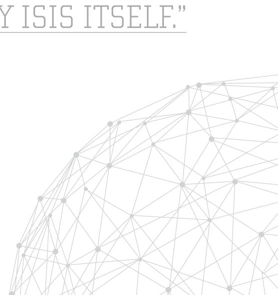

Regional disputes such as the war in Yemen and multi-nation action against Da'esh continue to be flash points for Hacktivist activity in the region. This activity emanates from actors in this region, and also targets those actors as a tete-a-tete conflict rages between opposing hacktivist groups across the world. These incidents range from completely fabricated to devastating, and they only continue to become more frequent as capabilities of various actors are developed and tested.

# INTRUSION CAPABILITIES OF ISIS

T t is generally believed the Islamic State currently possesses internal capabilities including _ the use of keyloggers and unidentified network surveillance software for investigations to identify, locate, and arrest dissidents and suspected spies. Additionally, open source reporting throughout 2014 and 2015 has attributed at least three offensive cyber operations to ISIS, one of which includes the use of primitive malware suspected to be leveraged in locating dissident operatives in Syria. The remaining two reported operations involved the alleged compromise of UK and Iraqi government systems, however these reports could not be independently confirmed.

Despite the relative lack of intrusion cases attributable to ISIS operatives, the organization's published online content indicates that it likely possesses an adequate level of technical ability

to successfully carry out offensive operations against targeted individuals. This is evidenced both through anecdotal open source reporting indicating the recruitment of individuals formally trained in various technical fields of study, as well as by ISIS' dedicated information security branch. The latter maintains a public web presence that provides operational security information and support to ISIS members and supporters.

015 was a notable year for the adversary C known as LizardSquad. tracked by Crowd- Strike Intelligence as GEKKO JACKAL. After gaining notoriety for a series of successful DDoS attacks against the gaming industry over the Christmas 2014 holiday, the largely unsophisticated hacker group surprised many by remaining resilient in the wake of law enforcement crackdowns and continuing DDoS attacks against a variety of sectors throughout 2015.

Moreover, the group's efforts in leveraging its notoriety to break through into the criminal sector with their own black market service offerings was notable and is a trend that may be continued by copycat groups. While a combination of continued arrests and internal infighting toward the end of 2015 caused GEKKO JACKAL to go silent, new threats emerging

over the Christmas 2015 holiday could be indicative that this resilient group will continue to be an adversary to watch out for in 2016.

After a handful of arrests and weeks of inactivity following the DDoS activity against the gaming sector in late December 2014, GEKKO JACKAL re-emerged in early 2015 continuing DDoS attacks against popular gaming platforms such as Microsoft's Xbox Live and Daybreak Games, formerly known as Sony Online Entertainment. While it was largely believed that GEKKO JACKAL was conducting this activity for little reason other than to upset the gaming industry and increase their "hacker status". CrowdStrike Intelligence assessed there was another motivation behind GEKKO JACKAL's efforts: a self-promotional effort for their newly released LizardStresser DDoS tool and their opening in the black market with their newly launched Shenron website. The website, built atop the foundation of the LizardStresser, sold itself as a Silk Road-like black market, offering services for spamming and DDoS-for-hire, as well as the purchase and delivery of drugs.

Shortly following this DDoS activity, GEKKO JACKAL targeted google.com.vn and lenovo.com in DNS hijacking activity. Media reports indicate that the hijackings were possible because the attackers seized control over Webnic.cc, the Malaysian registrar that serves both domains and 600,000 others.

# Timeline:

# NIFICANT DISTRIBU DENIAL OF SERVICE ( ATTACKS FROM 20

- 02 Microsoft Xbox Live Network 06 U.S. Army Domain 08-11 French Govt. & Media Domain 08-18 Israeli Telecommunications Domain 11 & 14 Russian Federal Security Service (FSB) 12 Ukrainian Media Domain 27 Islamist Domains 29 GEKKO JACKAL
01 Sony PlayStation Network 07 U.S. Army Domain 14-17 Electronic Arts Network 16 Sony PlayStation + Steam Network 22 Saudi Arabian Financial Institutions 27 U.S. Army Domain 28 Sony PlayStation Domain 28 Electronic Arts Network

# MARCH:

01 Turkish Government and Businesses 02 Russian Security Services (FSB) 07-16 The British Broadcasting Corporation (BBC) Domain 11 Wisconsin, Michigan, Oklahoma, and Missouri Domain 17 Global Jihad Network Domain 27 Github's Domain

In the case of Lenovo, researchers said the attackers briefly redirected users to another address, while also intercepting internal company emails. GEKKO JACKAL posted an email exchange between Lenovo employees discussing Superfish, the software that was at the center of a public uproar after researchers said they found it allowed hackers to impersonate banking websites and steal users' credit card information. By continuing attacks against the gaming sector and piggybacking on the media attention surrounding the Lenovo scandal, GEKKO JACKAL quickly made it back into the headlines as a prominent hacker group and garnered further publicity.

GEKKO JACKAL renewed DDoS attacks against the gaming sector in mid-June 2015. Although the group did not claim responsibility via its official social media channels, several associated actors appeared to claim responsibility, and the attacks were launched by infrastructure previously attributed to GEKKO JACKAL. The infrastructure responsible for launching the attacks is called bashlite (also known as gayfgt), which is based on the lightaidra malware, an open-source IRC-based mass router scanner/exploiter. GEKKO JACKAL has previously made use of this infrastructure when carrying out DDoS attacks, likely using second-stage infrastructure to give commands to the control server.

- 12 U.S. Department of Energy Domain 27 Domain of Federal, State, and Local Government Agencies, Financial Institutions, the Baltimore/Washington International Airport and Local Businesses in and around Baltimore 29 British Security Service, MI5 Domain
By early 2015, GEKKO JACKAL had developed and deployed a new version of the bashlite malware family targeting Unix machines. This version took advantage of the Shellshock vulnerability, which was discovered in Fall 2014 and exploited the bash command shell in Linux systems, affecting a wide array of users. GEKKO JACKAL has previously tested out its new infrastructure and tools before mounting the larger attacks it takes public credit for, suggesting that the mid-June 2015 attacks were serving as the initial testing phase.

After June 2015, GEKKO JACKAL infrastructure was observed in what appeared to be random attacks against sectors outside of the gaming industry, lending further evidence that the group was beginning to leverage its resources for DDoSfor-hire services. On 10 July 2015, CrowdStrike observed a DDoS attack targeting the aviation sector in the United Arab Emirates (UAE) that originated from the bashlite botnet infrastructure. Then on 13 August 2015, CrowdStrike Intelligence observed multiple DDoS attacks targeting two technology sector organizations originating from the same infrastructure. While it remains unclear if these attacks were carried out personally by group members or as part of contracted services, the latter seems more likely as there was no claim of responsibility for these attacks.

Throughout the end of August and through September, CrowdStrike observed what appeared to be a continuing deterioration of the group. This activity included further target scope deviation, clientele arrests, termination of their botnet infrastructure, and uncharacteristic silence. For example, in late August a DDoS attack launched against the public website of a prominent financial institution used the bashlite infrastructure. This attack appeared to draw significant criticism from members worried that provoking the financial sector had crossed a line and would lead to increased criminal investigation.

Although the motivation for the attack against the financial sector is unknown, it appears to have been at the behest of a client, indicating that many of GEKKO JACKAL's members are likely financially motivated and pushed the use of the botnet infrastructure for contract DDoS attacks to bring in additional revenue. However, the group appears to have little control over the botnet's ultimate usage, suggesting clients are given direct access to the infrastructure.

Shortly following the attack on the financial institution, the UK National Crime Agency (NCA) announced the arrest of six teenagers involved in the use of GEKKO JACKAL's DDoS LizardStresser service. Although there is no indication these arrests are directly related to the DDoS attacks against the financial institution, the timing is notable, especially after members of the group expressed specific concern over attracting law enforcement.

Shortly after the announcement of the arrests and a warning to other users of the service, GEKKO JACKAL, in true form, threatened retaliation. On September 2 there were confirmed reports that the NCA's website was unreachable due to a DDoS attack. While this comes as no surprise, it is notable that clientele of GEKKO JACKAL's services are being actively sought by law enforcement. The NCA further acknowledged in early September that they were visiting approximately 50 addresses belonging to users registered on the GEKKO JACKAL Shenron website.

It is also potentially significant to note that the adversary's indication via Twitter in early September that the group has been inactive appears to contrast with recent CrowdStrike observations regarding DDoS attack activity carried out by suspected GEKKO JACKAL infrastructure. Throughout September, CrowdStrike observed a number of DDoS attacks leveraging the lightaidra-based botnet infrastructure against targets across a wide scope of sectors. This included a popular fast food chain, a South American outsourcing firm, an online grocery supplier, a popular social networking platform, and a pharmaceutical entity. Many of the observed attacks appear consistent with hacktivist intentions; however, GEKKO JACKAL generally claims responsibility for its attacks, and given the lack of responsibility claims for the September attacks, it is unclear if this activity is directly associated with the group.

# MAY:

03 British Security Service, MI5 Domain 14-15 Fort Knox Domain 20-23 Russian Federation's RosKomNadzor 22 Several Bank Domains in India, Chile, and Brazil 25 Egyptian Ministry of Communications and IT Domain

# JUNE:

13 The World Cup and FIFA Domain 17 Canadian Government, Legislative, Judicial and Intelligence Agencies (CSEC and CSIS) Mid Several Gaming Sector Networks 12 Ukrainian Media's Domain 22-23 Government Communications Headquarters' (GCHQ) Domains

# JULY:

- 12 Telegram Servers 13 UAE Airline Domain 17 EU Financial Institution Domain 27 Gazprombank, Gazprom Domain 28 Canadian Government Domains
# AUGUST:

- 13 Cloud-based Email Provider
- 17 Gaming Sectors Infrastructure
- 18 Saudi Arabian Telecom, Financial, and Government Sector Domains, and the Infrastructure of Upstream Providers
- 22 U.S. Airline and Financial Organization Domains Service (FSB) Domain

# SEPTEMBER:

- 09 Drug Enforcement Administration (DEA) Domain 10 Several Russian Financial Institutions' Domains 18 Brazilian Banks and Federal Government Agency's Domains 12 Saudi Government and Financial Sector Domains Service (FSB) Domain
- It is possible that the September activity represented testing rather than actual operations. Alternatively, it may be further evidence of division within the group, particularly regarding the sanctioning of "official" attacks carried out in the group's name. During this time, given the code leak for the bashlite botnet in January 2015, there was an observed increase in proliferation of the now-leaked code base among hacktivist groups that resulted in a number of new infrastructure sets not directly attributed to known GEKKO JACKAL actors.
- Finally, in late September, CrowdStrike observed a control server associated with the GEKKO JACKAL implant issuing self-destructive commands intended to terminate the implant and remove traces of the file. Analysis indicates that due to the nature of the issued commands, the activity was likely not carried out for maintenance purposes, but rather to ensure destruction of the infrastructure and prevent re-propagation.
- The source and specific motivation behind the destructive termination of this botnet infrastructure is not currently known, however several possibilities exist. CrowdStrike Intelligence observed a significant amount of internal dispute amongst GEKKO JACKAL members, specifically regarding which individuals are granted access and control privileges to launch attacks from the group's infrastructure. As such,

# 04, 06, & 09

The Romanian Ministry of Education and Scientific Research 09 The Turkish E-Government & the Ministry of National Education 15 The Ukrainian Secretariat of Cabinet of Ministers 18 & 19 The Saudi Arabian Ministry of Foreign Affairs and Ministry of Defense and Aviation

"WHILE A COMBINATION OF CONTINUED ARRESTS AND INTERNAL INFIGHTING TOWARD THE END OF 2015 CAUSED KO JACKAL TO GO SHOW

# Timeline:

# 13. 17. 28-29

Saudi Arabian Government, Private Investment, & Financial Organizations' Domains 14 Protonmail Mail Client 15 U.S. Postal Service Domain 17 Russia's Federal Security Service (FSB) Domain 14 Greek Financial Institutions' Domains 27 U.S. Postal Service Domain

# CEMBER:

03 Saudi Investment Bank's Domain 08 U.S. National Research Labs 17, 22 & 28-29

Turkish Financial, Commercial and Government Domains 20 U.S. National Research Labs, the Pentagon, a Connecticut Education Network (CEN) Affiliated Domain, and Army, Navy, & Air Force Domains it is possible that the recently observed termination commands were issued by a disgruntled associate or individual otherwise in competition with the botnet's operators for propagation and commercial sale of similar infrastructure. Such tensions may have been exacerbated by ongoing disputes over revenue from contracted DDoS services provided on a hacker-for-hire basis for other clients outside of the GEKKO JACKAL group, as revenue from such activities has not been equally shared among group members.

The observed destruction of this particular bashlite infrastructure could also be the result of a third-party takedown activity; however, CrowdStrike Intelligence notes that the witnessed destructive termination with potential for collateral damage more likely represents red-on-red conflict between underground actors. After the base code leak in January, proliferation of the source code for the bashlite implant during mid- to late summer 2015 has dramatically increased the number of potential actors that may be familiar with this infrastructure.

The weak authentication mechanism for the botnet C2 further created vulnerabilities that may have been exploited for destructive action by more experienced competing operators. GEKKO JACKAL has continuously angered members in the underground community, primarily for the group's lack of sophistication and propensity to attack the gaming community, making a red-on-red attack a feasible explanation.

Since the destruction of the bashlite infrastructure in late September, GEKKO JACKAL has been uncharacteristically quiet. Previous GEKKO JACKAL attacks were quickly claimed by the group via an associated social media platform, often followed with pompous hacktivist rhetoric. If, in fact, GEKKO JACKAL is experiencing internal strife, pressure from law enforcement, and possible hostility from the underground

community, maintaining Internet silence could be the most plausible option for the group's survival.

The long-term effect the infrastructure loss and law enforcement involvement will have on future GEKKO JACKAL activity is yet to be determined, but it is expected that this group will exhibit operational changes in the months to come, or will disband altogether. While GEKKO JACKAL briefly resurfaced to reiterate threats against the gaming industry during the Christmas 2015 holiday, the expected bravado and follow-on attacks that are hallmark tactics of the group were not observed.

It should also be noted that social media messaging from GEKKO JACKAL has indicated that the group is actively involved in populating an alternative network of infected hosts for use in DDoS attacks. Over the summer, GEKKO JACKAL was leveraging another IRC-based infrastructure in addition to their bashlite botnets. This may, in part, allow the group to remain resilient in the face of the destruction of the bashlite infrastructure and start anew.

Threats from groups like GEKKO JACKAL are significant, as they can impact the reputation and operational effectiveness of targeted organizations both in the short and long term. Unlike traditional hacktivist groups who target organizations based on ideology and political motives, GEKKO JACKAL appears to target organizations and services primarily for media attention to promote their cybercriminal business. Given GEKKO JACKAL's success in carrying out attacks and attracting media attention throughout 2015 (in addition to the leaked bashlite code), it is likely copycat groups will attempt to follow GEKKO JACKAL's lead in 2016 in order to garner their own fame, create their own criminal service offerings, or both.

Throughout the year, the CrowdStrike Intelligence team provides numerous intelligence summaries to customers with varying periodicity. These intelligence summaries are meant to memorialize what occurred in a specified period of time. It is our hope that by reviewing previous activity, we can beqin to peer around the corner to predict what may occur in the future.

Adversaries are human; they have patterns, preferences, and shortand long-term plans. If we pay close attention, these patterns can lead to a better understanding of the mindset of the adversary, and ultimately allow us to know their next move. The Looking Forward section is a sample of the CrowdStrike Intelligence analysts, peering around the corner to see what the coming year may hold.

# REVIEW OF 2014 PREDICTIONS

The 2014 Global Threat Report had many predictions based on analytic judgements about what might happen in 2015. We believe that when we make such assessments, it is a good exercise to review them each year so we can continue to improve our tradecraft.

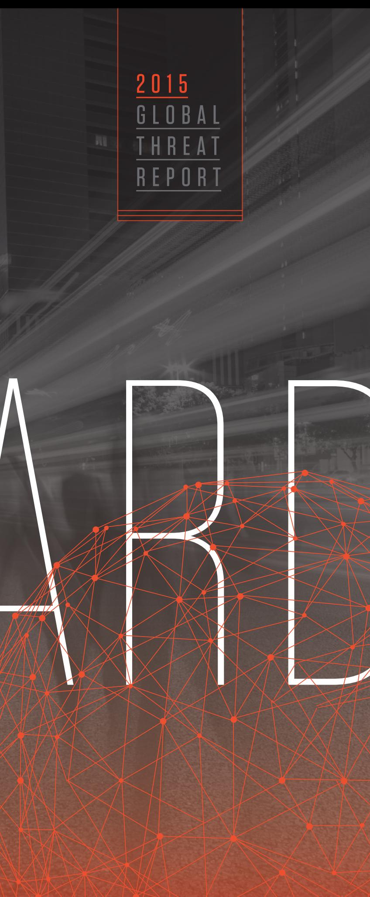

### Adversary Operational Security

In the 2014 report, CrowdStrike assessed that the launch of the free SSL certificate service Let's Encrypt might have an impact on increased usage of secure communication protocols by adversary tools. Let's Encrypt did not launch as expected, and it only entered public beta in the final weeks of 2015. Even with the late 2015 launch, public reporting indicates that certificates from Let's Encrypt were misused in an Angler campaign within weeks of the public beta.

CrowdStrike also advised that it was possible that adversaries would deploy more sophisticated encryption schemes in 2015. CrowdStrike did observe a number of adversaries increasingly implementing Virtual Private Networks (VPNs), novel encryption schemes, and Point-to-Point encryption solutions in 2015. This dynamic by multiple actors was observed across all adversary motivations.

### Increased Targeting of Embedded Devices

CrowdStrike assessed that we would see increased targeting of embedded devices by various actors. This is well highlighted by the actions of GEKKO JACKAL, who deployed a massive botnet using a weakness introduced by the Shellshock vulnerability on embedded routers, cameras, and other network-attached devices. Targeted intrusion actors were observed compromising Cisco routers and switches in victim environments, and an unknown actor has been tracked compromising embedded devices across the globe.

### China Will Continue Conducting Espionage

CrowdStrike did not need a crystal ball for this one; we assessed that China would continue conducting espionage that supported objectives laid out in the 12th Five-Year Plan, supported their agenda in the South China Sea, and worked against an increasingly defiant Taiwan. We further assessed that China would continue to conduct attacks in support of "soft power" initiatives,

from which efforts such as the Shanghai Cooperation Organization (SCO) and the Silk Road Initiative would benefit. All of these activities were observed throughout the course of 2015, with Chinese intrusion activity expanding in all directions to include increased targeting in support of anti-corruption measures implemented by the government under President XI.

### Joint Plan of Action as a Catalyst

The CrowdStrike Intelligence team's 2014 predictions around Iranian intrusion activity vis-a-vis the success or failure of the JPOA were thankfully not tested. The prediction pertained to the likelihood that Iran would conduct retaliatory cyber attacks if the JPOA was perceived by Iran as taking a disadvantageous turn, or outright failing. Fortunately, neither of those scenarios came to fruition, even though the JPOA negotiation process took longer than expected and was arduous.

Furthermore, increased escalation of activity in Yemen by Houthi fighters and the military action of other nations diverted much of Iran's attention to that region. Further escalation in the Syrian civil war further distracted Iranian actors whose attention appears to have been focused on Gulf Cooperation Council (GCC) members, specifically Saudi Arabia.

### Cyber Spillover from Regional Conflict

Ukraine, the South China Sea, Syria, and global energy prices were all identified in the 2014 report as being potential flash points for cyber activity. This was all very much the case in 2015. Ukraine was a hotbed of activity by a variety of Russian Federation-based adversaries who conducted extensive intelligence-collection operations and possibly even kinetic attacks using cyber means. The South China Sea continued to be an issue between various nations in that region as China continued to develop airstrips and naval stations in the contested atolls.

Chinese intrusion activity against Vietnam, the Philippines, and Taiwan occurred routinely as the Chinese sought to collect critical intelligence on potential repercussions of their aggressive posture. ISIS activity in Syria and abroad spawned numerous groups on both sides of Da'esh, who sniped at each other with compromises, data leaks, and disruptive attacks. The impact of economic sanctions and global energy prices surely had an impact on Russian intrusion activity, as it conducted operations against countries from the Commonwealth of Independent States (CIS), across Europe, and into the United States.

### Point-of-Sale Attacks in the Wake of EMV

CrowdStrike assessed that the instances of pointof-sale (PoS) malware would sharply decline as EMV became the predominant technology in the United States. In October 2015, many payment processors implemented a fraud liability shift for vendors not supporting EMV technology. This technology does make commodity PoS malware as it existed ineffective—an unforeseen occurrence, despite increased usage of PoS malware at the end of 2015. As criminals realized that the PoS tools they had developed would be rendered useless, they rapidly deployed their malware in a lastditch effort to collect as much data as possible.

### Destructive and Disruptive Attacks

CrowdStrike, as expected, observed an increase in disruptive and destructive attacks. The lion's share of these attacks was conducted by hacktivist actors conducting DDoS attacks for a variety of motivations. Attacks by extortionist actors such as PIZZO SPIDER, MIMIC SPIDER, and other copycat groups became an almost-daily occurrence, moving from Bitcoin businesses to large-scale financial and technology companies. Ransomware also increased substantially in distribution and variety over the course of 2015, a constant threat with the potential to devastate anyone from an individual, small/medium business up through massive enterprises. Destructive

attacks by nation-state actors continued through 2015, with activity by VOODOO BEAR dominating the headlines toward the end of 2015.

# R&D

A key component of understanding the threat landscape and where it is going is to observe the direction of security research. Tomorrow's exploitable vulnerability or security bypass is likely being explored by researchers today. Time and time again the security community's research has been picked up by savvy attackers and forged into a weapon used by adversaries to achieve their goals.

In 2015, issues with encryption dominated the headlines of attacks, as well as being relentlessly tested by security researchers seeking to find flaws in these systems that protect our personal data and business secrets. Secure boot processes are a key component of trusted computing; if the boot process has been compromised, then it's game over.

Over the years, an arms race has been raging between system designers and researchers driving down to the silicon chips that support the boot process, exposing previously unknown flaws in software that we rely on every day. This leads to enhanced protections, and in some cases, wily attackers can use the flaws to compromise systems at a very low level.

Virtual Machine computing is another area of intense research. In the last year, it became apparent here, too, that low-level drivers and code to support antiquated devices could diminish the security of the overall system. With these research stories slowly percolating into the mainstream media, it is important to keep an eye on novel research that may lead to critical exposures in the future.

### x86 System and Firmware Security

After seeing adversaries deploy Basic Input Output System (BIOS) implants for some time, the topic of system and firmware security seems to have finally arrived in mainstream security discussions. The Hacking Team leak revealed them to be developing a BIOS persistence implant deployed via physical access; other government-backed actors such as ENERGETIC BEAR have also been observed by CrowdStrike Intelligence to scout BIOS dumps after remote system compromise, potentially enabling BIOS implantation. Besides deploying BIOS implants after remote compromise, ensuring the integrity of a system after physical access due to border inspections or supply chain interdiction is a growing concern for many medium- and high-ranking business officials.

> 61 TOMORROW'S EXPLOITABLE VULNERABILITY OR SECURITY BYPASS IS LIKELY BEING EXPLORED BY RESEARCHERS TODAY.

Modern flash chips that store BIOS images. colloquially known as Read Only Memory (ROMs), should be write-protected after system boot to protect against simple firmware reflashing attacks, which can occur after privileges have been escalated in the running operating system. Even with such protection, vulnerabilities in the boot process (or sometimes after the boot

99

process) can be exploited to circumvent this simple write-protection. Pedro Vilaça uncovered a vulnerability in how Apple OS X manages flash chip write-protection: Upon resume after suspend-to-RAM, the boot code failed to ensure write-protection, effectively leaving the flash chip unprotected following the first suspend-resume iteration. Since a suspend can generally also be triggered by malicious software running on the system, this effectively enables BIOS implant deployment after remote compromise.

Polish security researcher Joanna Rutkowska covered the state of establishing a trustworthy boot chain on the x86 architecture in a much broader analysis in her excellent paper "Intel x86 considered harmful". While her analysis paints a rather grim picture of the current state of affairs, it is an accurate picture of analysis from a paranoid perspective.

The Purism company attempted to create a "fully liberated" laptop that did not depend on any binary or closed-source firmware for any of its components. However, to date they have not managed to "liberate" the different firmware packages required for running modern Intel processors (see also Rutkowska's analysis of Intel ME and associated binary blobs). Google Chromebooks rely on the open-source Coreboot firmware for initializing the system and can be seen as fully open-source boot chain implementation. Yet even they have to rely on binary blobs supplied by Intel to support chipset and processor initialization and memory training. Multiple researchers are actively working on reverse engineering Intel ME firmware binary blobs. and CrowdStrike expects more publications on this in 2016.

lt appears impossible to create a fully user-controlled boot chain on x86 going forward, and it is expected that there will be further research into the closed binary blobs and uncovering of associated vulnerabilities. A new extension to the Intel processors called Software Guard Extensions (SGX) has been gaining attention by security researchers. SGX was designed to bootstrap a trusted enclave in an untrusted ecosystem (such as cloud computing), but it may also be abused for Digital Rights Management (DRM) or rootkit purposes according to multiple researchers' assessments. As the first processors implementing SGX become available in 2016, CrowdStrike expects offensive and defensive research leveraging this technology to follow suit promptly.

### State of the TLS Ecosystem

Transport Layer Security (TLS) is the centerpiece of modern connected systems providing a secure communication protocol. As such, it was not surprising that 2015 saw a wealth of attacks on the TLS protocol. During the same time, standards bodies were actively improving the protocol and phasing out old and insecure aspects of it in order to help mitigate possible attack surface.

### ATTACKS AND INCIDENTS

Throughout 2015 numerous notable events took place that demonstrated potential misuse of TLS and possible implications of such misuse.

- In February 2015, it was revealed that computer maker Lenovo had been pre-installing the Superfish Visual Search software on its computers running Windows. This software installed a static TLS root certificate authority (CA) and corresponding private key into the system, thereby placing every user at risk of being attacked via a Man-In-The-Middle attack on the TLS protocol. Lenovo published an apology to its users and released a removal tool as open-source software. Later in 2015, it was discovered that Dell had also been pre-installing a root CA and key on its Windows machines, resulting in the same security risks for users.
- In March of 2015, the Chinese root CA CNNIC was removed from some major browsers after a security incident was revealed by the Google Chrome team. CNNIC had issued a full root CA certificate to a third party that had used it for testing in network equipment designed to do transparent TLS interception.
- March 2015 also saw the first large-scale attack of the so-called Great Cannon of China. In this incident, unsuspecting international visitors of the Baidu search engine had malicious JavaScript injected into their connection. As CrowdStrike pointed out at BlackHat USA 2015, this attack would have been impossible with HTTPS in place, a lesson that many large Chinese companies have not yet taken to heart.
- In December, the government of Kazakhstan announced that it would require Internet users to install a custom root CA certificate, thereby making it possible for the government to intercept all of the HTTPS connections of its citizens.

One alarming trend is for security software, such as anti-virus programs, to do TLS interception and inspection by installing their own certificate into the browser root CA store. While these tools generate a certificate for each installation, they sometimes introduce other weaknesses.

During a survey, it was discovered that commonly used AV software such as Avast, Kaspersky, and ESET would degrade the security of TLS by being susceptible to the FREAK and CRIME attacks. This is facilitated by not implementing HTTP Public Key Pinning (HPKP) or Online Certificate Status Protocol (OCSP), stapling, and in general supporting older, less-secure ciphers. Due to the difficulty of implementing TLS correctly, it is perhaps not surprising that running additional software to do TLS interception increases the attack surface of a system.

### New Developments

On 3 December, the first free and automated TLS Root Certificate Authority launched to the general public. Called Let's Encrypt, it offers free certificates for manual and automated consumption. Contrary to existing CAs, it does not require any manual interaction to get or refresh a TLS certificate for a website, which is why certificates issued by Let's Encrypt will only be valid for three months.

The HTTP/2 specification was finalized by the Internet Engineering Task Force (IETF) in May 2015 (RFC 7540). It is a major overhaul of the venerable HTTP protocol that will greatly increase the performance of resource-heavy interactive websites and speed up browsing for mobile users. While the IETF working group refrained from making TLS/HTTPS (and thus encryption) mandatory for HTTP/2, a number of browser vendors have already announced that they will only support HTTP/2 with HTTPS. Support for HTTP/2 already exists in major browsers and web servers, but it remains to be seen whether the added functionality will result in new vulnerabilities. HTTP/2 will require less performance trickery by application developers, and it makes dedicated external Content Delivery Networks (CDNs) for JavaScript less attractive.

In April 2015, the Public Key Pinning Extension for HTTP (HPKP, RFC 7469) was published by the IETF. This is an HTTP header which tells browser to "pin" a public key certificate for the current website, only accepting this particular certificate for a specific time range. Used correctlv. this extension will make intermittent TLS Man-In-The-Middle practically impossible.

In January, the Certificate Transparency project by Google started to be made mandatory for Extended Validation (EV) certificates in the Chrome browser. This project, which is basically a verifiable log of issued certificates, will make it

impossible for a CA to issue a certificate without the rightful domain owner becoming aware of it.

Other software on the web landscape is also creating a noticeable incentive for the adoption of TLS/HTTPS. The HTML5 ServiceWorker spec will enable fast, near-native online and offline applications, but it will only work on HTTPS websites. The Chrome browser will now display mixed-content warnings (HTTP and HTTPS content) like plain unencrypted websites. W3C initiatives like Subresource Integrity (SRI) and the Content Security Policy 2.0 (CSP), both actively developed during 2015, greatly increase the security and robustness of web applications. Furthermore, these measures can mitigate some of the inherent risk emanating from insecure websites. In 2015, multiple (free) services appeared that aid users in checking for insecure web-server and header settings and offer ready-made configuration snippets to achieve A-grade TLS security without much effort.

### Changes to the Protocol

The IETF is currently in the process of developing version 1.3 of the TLS protocol. While TLS v1.3 is still in draft state, a number of promising improvements have already emerged. TLS v1.3 will no longer support any type of handshake that does not offer perfect forward secrecy (PFS). A number of cryptographically weak ciphers and options will be removed in v1.3. In terms of performance, TLS v1.3 will also enable faster handshakes that use fewer round trips between client and server. This will greatly increase performance, thus further driving TLS adoption.

### Looking Ahead

While an automated and free CA will hopefully drive the adoption of TLS, it can also be used for malicious purposes. The end of 2015 already saw Let's Encrypt being employed for malicious ads. Our prediction for 2016 is that we will encounter more incidents where actors leverage the ease

and anonymity of creating TLS certificates to enable attacks and hide their tracks. With a valid TLS certificate, malicious content can be referenced across domains without triggering mixed content warnings. If an attacker can host content on a subdomain of a legitimate business, he will be able to create a TLS certificate for that domain that will look authentic to a user. Traffic protected by TLS can bypass systems like an IDS more easily, as it is encrypted. As the "green lock" of TLS-protected websites become more prevalent on the Internet, users will have to be educated that it does not imply trustworthiness of the site. In the face of these challenges to network-based security solutions. next-generation endpoint protection will become even more critical to enterprise security.

# CONTAINER AND VIRTUALIZATION SECURITY

In 2015, virtualization was still the go-to technology to achieve multi-tenancy for a number of applications. Dozens of companies have emerged that either offer such infrastructure as a service or provide solutions for monitoring and managing the ever-growing fleet of virtual machines. It is not surprising that the demand for secure deployment guidelines has surged.

### Containers

Another emerging trend in terms of multi-tenancy is the containerization of applications. Containers are not as heavyweight as VMs, and thus are easier to set up and significantly more resource effective than VMs on shared hardware. For many users, the only reason to employ VMs is the perceived lack of isolation that popular container software offers at this time. Providing a secure isolation layer will be paramount for driving the future adoption of containers.

Docker is a container solution built on recently added features of the Linux kernel, and it is arguably the most prominent and widely used

"IN THE FACE OF THESE CHALLENGES TO NETWORK-BASED SECURITY SOLUTIONS,

container software today. There has been some confusion as to the purpose of Docker containers and the level of isolation these can offer. Since applications can easily escape Docker containers under certain circumstances, even proponents of containers have gone so far as to point to VMs for isolation of possibly malicious code.

From the attacks on the Docker ecosystem and the ensuing discussions in the community, it is apparent that users are frequently not educated about the implications of running containers with potentially malicious code. Currently, the lack of support for user namespaces in Docker means that it is easy to inadvertently run an application inside a Docker container as root. In 2015, Docker also added signature verification for images, a feature that enterprise customers had been waiting for.

The Docker container ecosystem offers a way for users to share the containers they created via the so-called Docker Hub. This repository holds a large number of pre-installed Docker container images, both from official software vendors as well as regular users. Users can typically expect to find an existing Docker image for the software they want to run inside a container.

In May, there was an automated survey of the official Docker images, i.e., those from the actual software vendors. It found that about 40 percent of the images suffered from severe vulnerabilities that were discovered and fixed in the course of the previous year (e.g., Shellshock, POODLE, Heartbleed).

Docker itself saw a number of Common Vulnerability and Exposures (CVEs) assigned in 2015, most of them relating to ways the container could either disable or circumvent Linux security models and affect the host system. The Docker Engine is the actual software behind Docker that is responsible for creating and managing

containers on a host system. Because of the power that the Docker Engine wields with regard to the host system, tools instrumenting it will be a prime target for attackers.

### Virtual Machines

There have been a number of critical advisories related to virtualization technology such as Xen and KVM. For Xen, there were 10 advisories in 2015 that described a way for the guest OS to escape its confinement, potentially compromising the host system. Another 15 advisories described various ways for guests to perform a Denial of Service (DoS) of the host system.

In May, CrowdStrike discovered a vulnerability in Xen that allowed x86 HVM guests to escape to the host system through the QEMU floppy disk controller. The vulnerability was patched as part of XSA-133. Like other privilege-escalation vulnerabilities, this one affected more than one virtualization solution since it originated in the QEMU emulator, which is used by multiple projects such as Xen, KVM, and VirtualBox. Other companies came forward with similar bugs, showing the vested interest that a wide range of industries has in keeping the security model of VMs robust and intact.

BlackHat USA 2015 and DefCon featured talks on cross-VM covert channel communication using the CPU. These kinds of attacks are certainly quite complex and may be hard to execute, yet they show the multitude of potential pitfalls for providers offering VMs to users.

### Looking Ahead

CrowdStrike expects a number of new challenges to arise as a result of an increased adoption of containerization technology. The most obvious one will be the fact that more developers and users will use containers for external reasons. Efficiency and the continuous march toward virtual appliances and cross-platform deployment will drive increased adoption of these technologies.

Currently, the user base of containers can probably be described as "educated early adopters", while future generations of users might not be so savvy. As a result, there will likely be cases where insecure software inside of containers is not updated because users lack the knowledge to do so or because they don't understand the security implications. Current operating systems frequently offer automatic updates for software installed through system facilities, such as shared libraries or servers. Containers, on the other hand, require a different approach to dealing with the update process. Even if the need to update is evident to the user, it remains to be seen whether container and software deployment processes can keep up with the pace of security issues.

## TARGETED INTRUSION: CHINA

2016 looks to be a pivotal year for China-based, state-sponsored cyber adversaries as China enters a transformational period in terms of its economy, its global status, and the cyber methods it uses to achieve its strategic goals. This is most easily discussed by separating out Chinese intentions in cyberspace, the changing dynamics of Chinese cyber operators, and China's new Five-Year Plan (FYP).

### Chinese Intentions in Cyberspace

For China, cyber operations have previously been a relatively inexpensive means to some of these strategic ends: It has conducted cyber reconnaissance on its neighbors to make calculated territorial maneuvers; used extensive cyber monitoring capabilities to simultaneously suppress dissidents and manage a growing population of domestic Internet users: and conducted cyber espionage in order to steal intellectual property, fill technological gaps, and maintain its impressive economic growth.

Efforts by the private sector and the U.S. government to expose Chinese cyber operations over the past several years has raised the cost of these operations both from a financial as well as an economic perspective for Beijing, and in 2015 it came to a boiling point. The threat of U.S. economic sanctions and potential diplomatic fallout appears to have finally forced meaningful dialogue between governments.

If observed campaigns in late 2015 were any indication, it is unlikely China will completely cease its cyber operations, and 2016 will show the new direction it is headed. Although China and the U.S. signed a cyber agreement and restarted cyber dialogue between the two nations following President XI's September 2015 visit to Washington. the wording was described by most analysts as extremely vague and largely open to interpretation. A short time later, China sought to sign identical agreements with the UK and Germany, and even sought to normalize a similar agreement at U.N. proceedings not long after.

Beneath the surface, however, China has not appeared to change its intentions where cyber is concerned. This is best illustrated by how Beijing treats its allies as opposed to its rivals. Whereas the agreements that China has been attempting to normalize specify not hacking for economic espionage purposes, China signed a May 2015 pact with Russia, a known ally, with both sides abolishing malicious hacking of any type against one another. Yet CrowdStrike actually observed an increase in activity against Russian targets from HAMMER PANDA directly following the agreement. The Russian targeting continued over several months after the friendly agreement had been signed, suggesting that Chinese intentions are far removed from the agreements they sign, even with allies.

China was also observed targeting the website of the Permanent Court of Arbitration in the Hague during a week-long hearing on its SCS dispute with the Philippines. The tribunal was intended to be a neutral ground to resolve international disputes, but Beijing refused to acknowledge the

case as valid, instead infecting the website and potentially any victims interested in the landmark case. This further shows Chinese intentions to continue to use cyber as a means to gain the upper hand in any international disputes, even when the victim is an impartial judge designed to equalize opponents and prevent bullying.

Observed activity has shown that China may change tactics and reduce its cyber activity when under close inspection. Examples of these reductions are apparent in the drop-off of COMMENT PANDA activity after the May 2014 PLA indictments, or the cessation of PUTTER PANDA following the public release of Crowd-Strike's analysis of their activity in June 2014. China has demonstrated that their operators will resume normal activities when scrutiny has diminished. The cyber agreements appear to be an attempt to appease the U.S., avoid economic sanctions, and offer a chance for China to seize upon a global initiative to "normalize" sanctioned cyber activity. China has promised new cyber tact, however the reality of its intentions is far divorced from what it has promised. Given its remaining technological gaps and the strategic edge cyber can provide its economy, there is still plenty of incentive for China to engage in commercial cyber espionage when opportunities arise.

### The Shifting Dynamics of China's Cyber Operators

A reduction in activity by China-based adversaries in 2016 is possible; such a reduction would be indicative of a shift in the way China goes about cyber espionage. The cyber agreements come at a time when President XI has been preparing a massive militarv overhaul that would see a bloated PLA trimmed and more resources distributed to the PLAAF and PLAN. President XI has said that a joint-command structure similar to the U.S. military is necessary to provide China with a modern, nimble fighting force capable of defending China's territory. This carries obvious implications for enforcing China's interests as well

as defending them from a physical standpoint, and will likely make the SCS a continued flash point as the reorganization will likely allow Chinese military forces more mobility and faster response times to potential conflict.

The reorganization may also split China's military cyber forces into their own division and likely serves the dual purpose of revamping China's cyber forces at a time when more oversight is needed while giving the impression of a reduction in U.S. targeting. CrowdStrike has frequently observed duplicated collection efforts by multiple groups, indicating relatively little oversight or coordination between units. At present, preventing an outright violation of the cyber agreement with the U.S. is a high priority for China, as economic sanctions would place a severe strain on its already-troubled economy. The potential embarrassment of soldiers moonlighting as contractors and carrying out operations on behalf of Chinese companies has likely prompted a significant drop in normal activity by Chinese military operators as they undergo a fundamental shift in how they carry out operations.

This reorganization will not happen overnight. It is slated for completion by 2020; however, cyber will likely be a priority due to China's emphasis on winning informatized wars, meaning that the shift may be observed soonest in that arena. Potential signals that the reorganization has made China's cyber forces more efficient would include improved tradecraft, better sharing of tools between groups, and coordination on targets.

As China's military cyber forces undergo changes, China will likely increase its reliance on its civilian intelligence agencies and associated contractors, all of which generally employ better tradecraft. This includes the Ministry of Public Security (MPS), which has already seen some monumental changes to its mission in 2015 such as increased overseas operations, as well

as the Ministry of State Security (MSS), which has typically employed top-tier contractors. To illustrate this point, DEEP PANDA, which CrowdStrike associates as being one of the non-military cyber organizations China regularly uses, has engaged in activity across a wide variety of sectors since the cyber agreement with the U.S., and it is expected to continue to do so.

Overall, Chinese cyber activity may shift dynamics, but it is not expected to cease anytime soon. Beijing views winning informatized wars as integral to its rejuvenation as a "great nation", and despite the promotion of domestically sourced innovation and technologies. China still has numerous intelligence gaps that cyber espionage can assist in filling to accomplish its long-term strategic goals. A cessation of intrusions associated with China is unlikely.

### China's 13th Five-Year Plan

Notably, China's economy has reached a tipping point as it looks to maintain medium/high growth trajectory and to better satisfy its exponentially growing middle class with better access to quality food, affordable healthcare, and job opportunities. President XI and senior officials have frequently alluded to economic reforms multiple times in the past two years, highlighting that the CCP recognizes a troubled economy constitutes one of the largest threats to party rule. China will look to transform its global status as an exporter of cheap goods (i.e., "Made in China") to that of a domestic powerhouse and innovator.

China also suffered two serious embarrassments on a global scale: the Chinese stock market crashes in mid-2015 and its issuing a pollution red alert for Beijing during the Paris climate talks. Both of these events showed significant weaknesses where China has been looking to brand itself as a global leader, and it is likely that China will seek to avoid any further incidents that reflect negatively on China in the financial and energy sectors.

"CHINA SIGNED A MAY 2015 PACT WITH RUSSIA, A KNOWN ALLY, WITH BOTH SIDES ABOLISHING MALICIOUS HACKING OF ANY TYPE AGAINST ONE ANOTHER.YET CROWDSTRIKE

These factor heavily into the first draft of China's 13th Five-Year Plan, which was released in November 2015 and will be finalized in early 2016. These plans typically provide a roadmap for what China will target using cyber means. Alternative energy and domestic technological innovations will have a renewed focus as China looks to transform its standard of living and become less reliant on foreign technology. This will likely resonate with Chinese citizens as increased opportunity, both in terms of everyday prospects and entrepreneurship, which the CCP is promoting heavily along with private sector/military cooperation as a way to stimulate growth and innovation.

The combination of China becoming increasingly untrusting of western information technology and a desire to promote its own sectors of industrial manufacturing and retail may lead to a gradual tapering off of targeting against these sectors. However, it will also likely mean increased cyber targeting in areas like agriculture, healthcare, and alternative energy that China deems crucial to promoting the wellbeing of its growing middle class, and where it has the most technological gaps.

2016 may see Chinese cyber operators targeting these sectors not just for intellectual property, but also for know-how such as building native supply chains and administrative expertise. The targeting of U.S. healthcare institutions in 2015 was suspected to be for espionage purposes, though it may have had the dual purpose of providing western models for supplying affordable healthcare to citizens as China looks to modify its current healthcare system.

It is no coincidence that a plethora of key state projects have completion goals of 2020. 2021 will mark the 100th anniversary of the founding of the CCP, and the party intends to have myriad successes to present to the Chinese people in order to reinforce its political legitimacy. These projects

and targets are wide ranging, with some very specific goals (e.g., achieve a 60 percent urbanization rate, complete the Chinese space station, reveal a domestically produced aircraft carrier, double 2010 levels of growth) and some extremely vague goals (e.g., become an "Internet Power" and become a "moderately well-off society"). However, there are several stated goals that have strategic and economic implications for several sectors.

The included infographic gives a further breakdown of potential targets across sectors based on China's 13th FYP and its strategic projects that are slated for completion by 2020.

# RUSSIA

The Russian National Security Strategy, released on 31 December 2015, both establishes the plans the leadership aims to implement throughout 2016 and reflects the desire for the nation to realign its interests, focus domestically, and improve its influence and standing. A realignment of interests orients Russia eastward toward China and India and places a greater focus on regional partnerships, such as the Collective Security Treaty Organization (CSTO), as it distances itself from NATO. This shift portends further military joint training engagements and may also be either complicated or reinforced by attempts at intelligence collection associated with nations in Russia's sphere of interest.

The domestic focus alluded to in the strategy is multifaceted, but in terms of technology the nation is poised to increase investments in the technology sector. Some of these investments were announced or had already begun in 2015 as reports of intent to develop mobile operating systems and nationally developed hardware proliferated. Supplementing the growth in the national technological sector will be the increasing internalization of data resources and application of control over content. In 2015 Roskomnadzor,

Russia's communication, information technology, and mass media service, had enforced legislation governing how private data of Russian citizens' information is handled. The service cracked down on foreign companies who operate in Russia and do not comply. Per legal guidance, companies that possess data belonging to Russian citizens must provide the government access to the data or house their servers within Russian territory. In terms of content control, Russia has surreptitiously employed teams of online bloggers, commentators, and "trolls" to disseminate false information, drown out the voices of legitimate users, and direct discussion in a manner chosen by the government. Operating under the broad moniker "Internet Research Agency," these operators have employed their techniques following high-profile events such as the assassination of political activist Boris Nemtsov in late February, and they are expected to continue their operations throughout 2016.

Additionally expected in 2016 are domestic deployments of systems that may allow expanded government control of online resources. GosSOPKA is a government system reportedly designed to detect and eliminate computer attacks. First imagined in 2013, GosSOPKA is intended for development and management by the FSB. It potentially supplements existing forms of online overwatch such as SORM, but it also adds an aspect of real-time defense.

GosSOPKA began its initial implementations in 2015 on Ministry of Economic Development network resources. Wider plans for distribution in 2016 and bevond include government agencies as well as Russia's diplomatic offices and consular bureaus located overseas.

In an effort to improve status and influence, Russia is still expected to project military power in the form of bomber training flights and joint military exercises, but these will likely be seen less fre-

quently than in 2015 due to economic challenges faced domestically. Improvement of the economy was a major talking point within the strategy and a large portion of Russia's focus on domestic issues. The improvements will most likely come in concrete forms such as sales of natural resources, but also in terms of changes to financial policy and development of partnerships for domestic investment. These shifts will most likely necessitate information for decision making, and therefore they portend increased intelligence collection by Russia-based adversaries particularly against regional targets and global energy companies.

# IRAN

Due to the intense concern of possible future degradation of Iran's Islamic values as businesses (primarily western) renew trade with Iran, it is highly likely the Iranian government will react by increasing Internet monitoring and censorship on a national scale as quickly and as effectively as possible.

It is likely, too, that Iran will also conduct increasing domestic cyber espionage operations to be vigilant of any influence of western ideals on Iran, threatening its Islamic culture. Subsequently, it is also likely that arrests of Iranians for content offensive to Islam or threatening to the Iranian government (both statements that are broad in application to activities) will increase as more technical apparatus is put in place to monitor and censor network traffic.

Furthermore, the Iranian government will almost certainly be concerned about the contents of any reports from investigative regulatory bodies on Iran's continued compliance with the nuclear agreement. The relief of sanctions from the JCPOA is of vital importance to Iran and its economy. During the JPOA negotiations through 2014 and into 2015, Iranian adversary

This infographic depicts the impacts and targeting priorities for key business verticals of the Chinese 13th Five-Year Plan. Each vertical is split into the most likely components to be tarqeted. The number of Chinese based threat actors known to tarqet that vertical are depicted in the black circles.

High Speed Rail Projects IMPACT: • Railway project bidding · Government Transportation Authorities

· High Speed Rail R&D

### Nuclear Energy related businesses IMPACT:

• Mergers and Acquisitions, multiparty bid information • Research into safer nuclear energy usage • Technology Supporting Nuclear Energy • Nuclear Facilities operations and procedures

### Clean Energy IMPACT:

• Processes and Techniques for Clean Energy Production • International climate policy and discussions • International emission research and reporting · Clean energy technology

## Oil

IMPACT: • Oil company pipeline construction projects • Operations and surveys in South China Sea • Bidding and contracting for resources · Extraction, mapping, and safety technology

### Electric/Hybrid Transportation IMPACT:

• Electric car/bus production facilities · Charging Station/Rechargeable Battery Technology · Companies developing component technologies Airlines IMPACT: • Passenger Name Records • Mergers and Acquisitions Information • Logistics/Operations/Processes information • Route Information

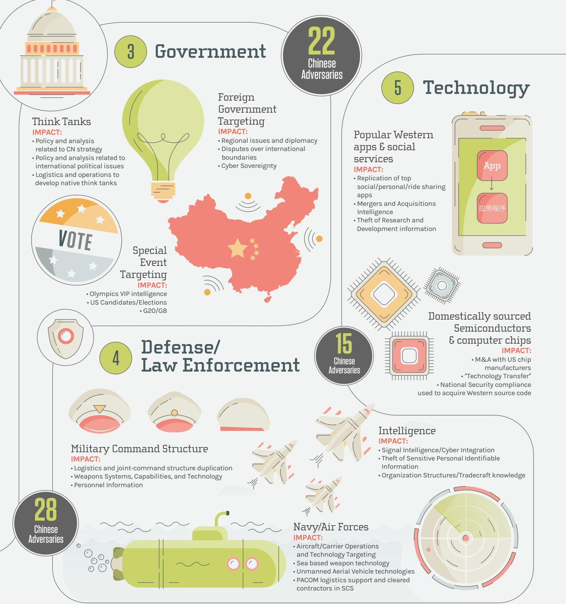

84

tures & tele

erals or oth om the earth

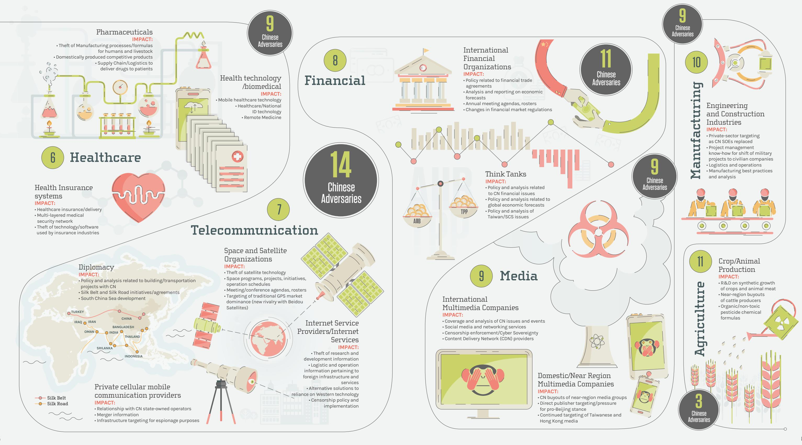

Governmen Institutions dedicated to providing variou gov't services at the national, stat or local level.

Jealthcar Provide goods and ervices meant to treat patients with curative preventive rehabilitative, & alliative care.

or chemica transformation c materials, or components into new products

Manufacturin Mechanical, phys rimary purpose i age to the

Dil/Fas nvolved in the xtraction, refini transportation, & marketing of

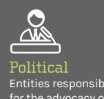

alized educati t. & ski

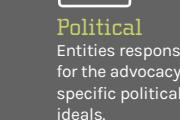

mmunication

Organizations that design

Think Tank/NGO Provide advice & deas or advocate on ehalf of specific ssues such as politics, economic or int'l relations.

ROCKET KITTEN was observed continuing to target European and regional targets in cyber espionage campaigns with the likely intent (at least in part) of obtaining an advantage in the negotiating process. Thus, reporting associations, receiving parties, and third parties such as host governments for meetings should expect it is likely they would be included in targeting by Iranian cyber espionage operations for knowledge gathering. The threat is increased if Iran violates, or is accused of violating, the JCPOA and risks the re-establishment of economic sanctions.

Lastly, as assessed once evaluating the U.S. Government report in June 2015, Iran separates its nuclear policy (and the JCPOA agreement with the P5+1 countries) from its foreign policy in the Middle East. Through 2014, regardless of ongoing nuclear negotiations, Iran continued to support Lebanese Hezbollah, a number of Iraqi Shia militant groups, Hamas, Palestine Islamic Jihad, and the regime of Syrian President Bashar al-Assad. Although the report was from 2014, U.S. officials claim the activities continued into 2015. Additionally, Iran is also strongly suspected of providing various means of logistical and financial support for the Zaidi Shiite insurgent group known as the Houthis throughout 2014 and 2015.

There are no indications that the Iranian government will shift from its current foreign policy supporting the aforementioned groups. Specifically, there are increasing tensions between the two regional powers of Iran and the Kingdom of Saudi Arabia (KSA) that increase the likelihood that Iran would use its proven cyber capabilities in 2016, targeting Saudi Arabia and regional governments that are becoming involved in the two countries' dispute by choosing to align with Saudi Arabia.

One escalating tension is the Yemen conflict, in which Iran has supported the Houthi rebels against a Saudi-backed Yemeni government in exile. The Saudi-led coalition announced on 2

January 2016 that the 15 December 2015 ceasefire agreement, which had been violated multiple times by both sides, would end on that day at 1100 GMT, meaning the conflict is far from over. A Saudi Arabian air strike on 8 January 2016 resulted in the near-bombing of Iran's embassy in Sanaa, Yemen. Erroneously, Iran media first reported that the embassy had been hit during the air strike.

On the same day as the end of the Yemeni ceasefire on 2 January 2016, Saudi Arabia executed Shiite cleric Nimr Al-Nimr. Sheikh Al-Nimr had been charged with instigating unrest while he participated in protests against the Saudi government during the Arab Spring in 2011. Al-Nimr was convicted in October 2012, sentenced to death, and had been scheduled for execution with 46 other prisoners at an undetermined date.

Following the executions, Iranian protestors motivated by the execution of a prominent Shiite cleric and seeing the action as an offense against Shiite Muslims by the Sunni-ruled Saudi Arabia—attacked the Saudi Arabian embassy in Tehran. Saudi Arabia was forced to remove its diplomatic personnel from the embassy. Adding to the tensions, the governments of Bahrain, Sudan, Qatar, Kuwait, and the United Arab Emirates (UAE) also severed or downgraded diplomatic ties in support of their alliance with Saudi Arabia.

With the regional tensions heading into 2016, there is increased likelihood Iran would use its cyber capabilities—which are also expected to strengthen and improve going forward—against its perceived enemies, particularly Saudi Arabia, regional governments, and their allies. This would likely occur for a few primary reasons: to conduct network reconnaissance activities to prepare for any future offensive or retaliatory cyber operations; to conduct retaliatory cyber operations damaging or destroying networks; or to obtain information to answer any current intelligence gaps of its enemy's political strategies, military

objectives, and mission details. The lifting of sanctions will likely improve economic conditions in Iran and make infrastructure and technology purchases significantly easier. This potentially foreshadows an increase in both augmented capabilities and the ability to operate more globally for Iranian threat actors.

# NORTH KOREA

While the Democratic People's Republic of Korea (DPRK) has been involved in offensive cyber operations since at least 2009, the activity identified in 2015 suggests a growing confidence to leverage such operations for espionage purposes during periods of heightened tension.

China has been historically inconsistent in directing North Korean behavior, recently publicly condemning nuclear tests but privately providing more aid, while fearing any escalation that could lead to a spillover of North Korean refugees into Chinese territory. China has been the DPRK's number one source of aid and trade in recent years, and potentially a gateway for North Korean cyber operations; however, its increasing responsibility in the global community consistently puts it at odds with protecting the rogue state. The DPRK has been observed increasing its ties with the Russian Federation, potentially reducing the influence Beijing has over the rogue nation.

A major shift in Chinese support may cause the DPRK to seek more a more aggressive cyber posture, on the high end as a preparation for military readiness and on the low end as a means to reiterate its demands on the international stage by provoking western powers. It also cannot be dismissed that DPRK cyber operations may further branch out into criminal activity as a way to increase the regime's financial position.

Monetization of cyber intrusion is consistent with the responsibilities of the so called "3rd floor"

bureaus, which have participated in illegal drugs, counterfeiting, and other illicit activity. The cyber agreement between the U.S. and South Korea is only likely to exacerbate the DPRK's justification for continuing to target the the two countries. CrowdStrike anticipates continued intelligence collection activity and incremental improvements in the technological capabilities of the DPRK in 2016.

# CRIMINAL

### Targeted Criminal Intrusion

During 2015, cases of targeted intrusion were observed by groups dubbed Carbanak. Butterfly (a.k.a. Wild Newtron), and FIN4. These groups have all used customized malware to target large organizations for high-value financial gain. Crowd-Strike assesses it is likely that targeted criminal activity will continue to increase in the coming year. Groups operating globally but often originating out of Lagos, Nigeria used opportunistic targeting in 2015 to gain a foothold in organizations using readily available remote access tools. These groups used this foothold to collect intelligence about lexicon, organizational charts, and business processes to conduct highly targeted social engineering. Similar groups focused research on publicly available information to collect their intelligence. Such activity is likely to continue into 2016, as the potential financial reward is high and the prosecution of such activity is difficult.

### Commodity Malware

Markets used to obtain banking Trojans and ransomware will both increase and diversify with more malware family authors attempting to gain increased market share. Criminal actors often obtain malware, exploits, and binders (packers) from underground markets and forums; competition in these forums has been observed and continues to increase. Authors are constantly looking to grow their user base through novel features and increased stealth from anti-virus technology;

this drives the complexity of such malware up, providing criminal elements who intend to use the malware with increased revenue-generating opportunities. It is probable that in 2016, the introduction of new malware families with increased complexity and stealth will continue to expand. Ransomware has been a growth market for criminals in 2015, and this trend shows no sign of abating.

# EXTORTION

Extortion actors in 2015 were extremely prevalent; groups such as PIZZO SPIDER, MIMIC SPIDER, and other copycats targeted all manner of businesses. This activity may continue, however due to increased awareness and lack of paying victims, it is unlikely that these groups will see high return on investment and may disband. Due to the high visibility of these attacks, coordinated investigation and disruption is likely by international law enforcement.

Analysis of transactions to Bitcoin addresses observed in various extortion schemes indicates a very low number of paying victims. Businesses that are extorted for Bitcoin often have no idea how to find the necessary funds, and the delivery of ransom notes to email addresses that may not be monitored or to users who have no idea what the note is referring to result in slow response times. During those slow response times, the actors often move on to another target.

# HACKTIVISM

### Motivation

Regional conflicts will likely remain a primary driver of nationalistic hacktivist activity in 2016. Gulf Cooperation Council (GCC) military involvement in Yemen, for example, has been cited by hacktivist actors operating on both sides of the conflict. These hacktivist campaigns often occur in near-real time to the

real-world events that inspire them, and as such they can often be difficult to anticipate.

While some nationalist groups are well established and maintain a public web presence, such as DEADEYE JACKAL, others often materialize—seemingly instantaneously—to carry out a sensational attack in retaliation to a real-world event. Examples of the latter include the previously discussed Yemen Cyber Army and, more recently, the January 2016 compromise of Saudi-owned broadcaster Al Arabiya's website by the Defenders of the Hijaz group. 2016 will almost certainly see a continuation of hacktivist activity mirroring regional conflict events.

In addition to politically motivated actors, hacktivists seeking public recognition will also likely continue to be prominent in 2016. GEKKO JACKAL provides an example trajectory of how such groups can increase in skill level and thus ultimately begin to move toward a financially motivated criminal operation. Copycat groups, such as Phantom Squad, are currently involved primarily in DDoS attacks against gaming-sector targets; however, it should be expected that these attacks, as seen in the case of GEKKO JACKAL, will broaden to include additional verticals. International events such as the 2016 Olympic Games in Brazil will almost certainly attract hacktivist actors seeking to capitalize on the global visibility of the event.

### DDoS

2015 saw a notable increase—both in frequency and effects—in DDoS attacks carried out by hacktivist actors. DDoS-based hacktivist activity throughout the year varied in motivation and included more traditional protest-style campaigns as well as those carried out by actors driven solely by a desire for media attention. One common trend identified as being in part responsible for this increase in DDoS activity is the widespread availability of paid network

stress testing, or stresser services. CrowdStrike assesses that the increasing adoption of paid stresser services for use in hacktivist operations will likely continue throughout 2016.

These DDoS-for-hire services allow low or unskilled actors to carry out disruptive attacks leveraging amplification TTPs. Such functionality represents a marked improvement over that offered by traditionally popular, freely available DDoS tools such as LOIC, Torshammer, or PyLoris. Additionally, the use of third-party web-based DDoS services reduces the risk of attribution to the attacker, since disruptive traffic is not generated from the attacker's own network as it is with the aforementioned freely available tools.

In addition to their ease of use and relatively low cost, stresser services have proven to be a powerful tool in the hands of low-sophistication hacktivist actors, enabling them to disrupt the operations of victim organizations. Attacks carried out in early 2015 by actor Bitcoin Baron, for example, underscore the disruptive and dangerous capability provided by such services. In March 2015, Bitcoin Baron launched a series of attacks against state and local government agencies in Wisconsin in protest of an alleged incident of police brutality. The ensuing DDoS attack disrupted not only the public websites of the city of Madison and local banks, but also affected internal networks used for emergency communication by the department of public safety. Specifically, police officer mobile data terminals (MDT) as well as payment-processing systems were reportedly impacted.

Additionally, due to the low barrier to entry, relatively low risk of attribution, and ease of use associated with stresser services, hacktivist campaigns leveraging them are increasingly employing little vetting of target lists to ensure victim organizations are in line with the operation's stated aims. This is best evidenced, as previously discussed, in Anonymous-led DDoS attacks opposing ISIS,

which often mistakenly target unrelated websites. CrowdStrike assesses that the risk of organizations being affected as collateral damage in hacktivist campaigns will remain prevalent throughout 2016.

66

# CROWDSTRIKE ASSESSES IT IS LIKELY THAT TARGETED CRIMINAL ACTIVITY WILL CONTINUE TO INCREASE IN THE COMING YEAR. 99

This report previously discussed GEKKO JACKAL's development of a botnet-based DDoS-for-hire service using a lightaidra malware variant called bashlite. The source code for GEKKO JACKAL's bashlite implant was publicly leaked in January 2015. CrowdStrike has subsequently observed a proliferation of this malware across multiple hacktivist communities and therefore assesses that its prevalence will likely increase during 2016. Similarly, the presence of bashlite infrastructure in identified attacks will likely no longer be intrinsically indicative of GEKKO JACKAL involvement.

In addition to GEKKO JACKAL, CrowdStrike has observed similar copycat hacktivist activity during 2015. Like GEKKO JACKAL, these groups originate largely from online gaming communities, which is often reflected in their targeting of entertainment sector organizations. A recent example of such activity was the DDoS attacks against Xbox Live, PlayStation, and other gaming networks during the 2015 Christmas holiday by groups including Phantom Squad and OurMine Team. These groups are motivated primarily by public recognition, and their activity will likely remain prominent in 2016. >>

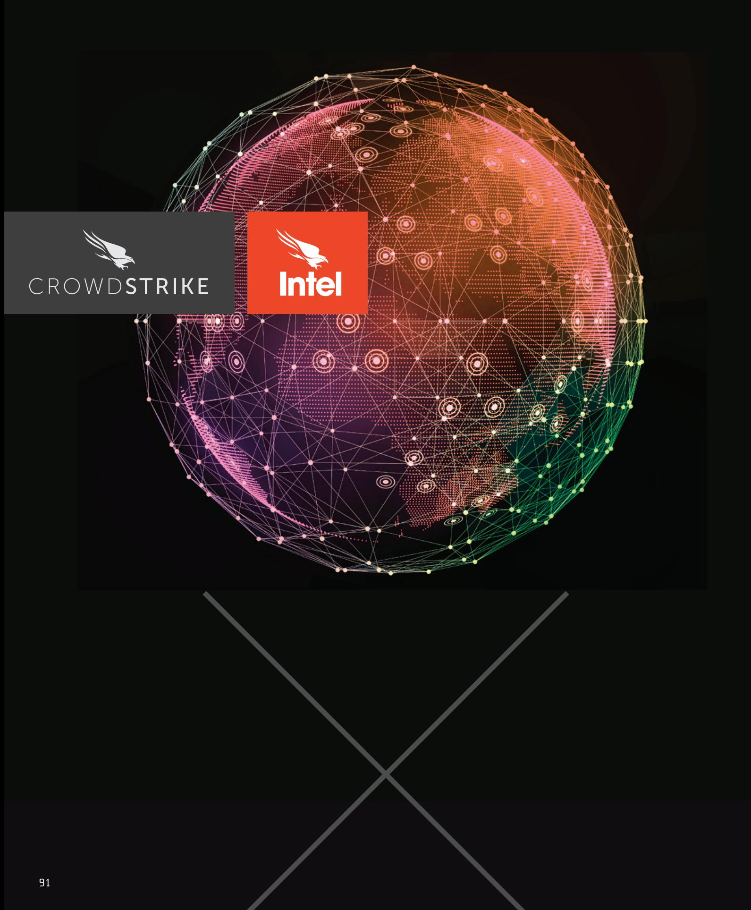

Bundling all of the security-related events in our increasingly connected world from the past year into one document tested all of the judgement, restraint, and nerves of the CrowdStrike Intelligence team. So many events that raced across the headlines of 2015 could not be feasibly included in this report, even though there was at least one analyst lobbying for its inclusion.

hat is clear in this year's report is that these events that may instantaneous after an event; they need to prepare, plan, and act. The instant an event belong in the digital realm are that impacts the adversary occurs, the clock increasingly relatable to the world around us. The behaviors begins ticking as they enter a process described of malicious adversaries in the retrospective by the loop we have referenced many times window of 2015 seem so obvious when we look before—observe, orient, decide, and act (OODA). at the events that influenced them. Whether it If you can go through these steps faster than the be the predictable Russian Federation intrusions adversary, then you will know what they will do. from Ukraine through Europe to the United States, or the hacktivist-on-hacktivist attacks following In 2016, practitioners of information security the terror attacks in Paris, or the massive uptick will increasingly play a role in protecting and in Cryptographic Ransomware by eCrime actors guiding businesses toward the right decisions following the success of Cryptolocker-the events to ensure the successful execution of their objectives. Whether you are an IT professional, a that precipitated these actions are obvious. By understanding the adversary, how they manager, a CEO, or a board member, in 2016 your think, and what events impact their beliefs and decisions can be more certain with the help of motivations, it is possible to better prepare intelligence. It can power everything you do.

and react. Adversary activity is generally not

# ST UK BRACES BPAVZDIS SPAKE

# ABOUT CROWDSTRIKE

CrowdStrike is the leader in next-qeneration endpoint protection, threat intelliqence and response services. CrowdStrike's core technoloqy, the Falcon platform, stops breaches by preventing and responding to all types of attacks – both malware and malware-free.

CrowdStrike has revolutionized endpoint protection by combining three crucial elements: nextgeneration AV, endpoint detection and response (EDR), and a 24/7 managed hunting service — all powered by intelligence and uniquely delivered via the cloud in a single integrated solution. Falcon uses the patented CrowdStrike Threat Graph™ to analyze and correlate billions of events in real time, providing complete protection and five-second visibility across all endpoints.

Many of the world's largest organizations already put their trust in CrowdStrike, including two of the 10 largest global companies by revenue, four of the 10 largest financial institutions, three of the top 10 health care providers, and two of the top 10 energy companies. CrowdStrike Falcon is currently deployed in more than 170 countries.

> STOP BREACHES. PERIOD. Find out how: www.crowdstrike.com

# CROWDSTRIKE We Stop Breaches

