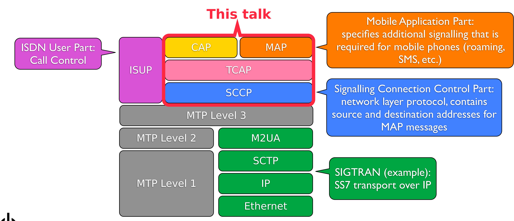
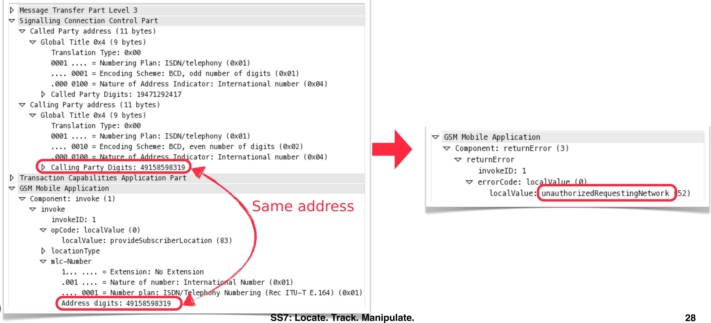
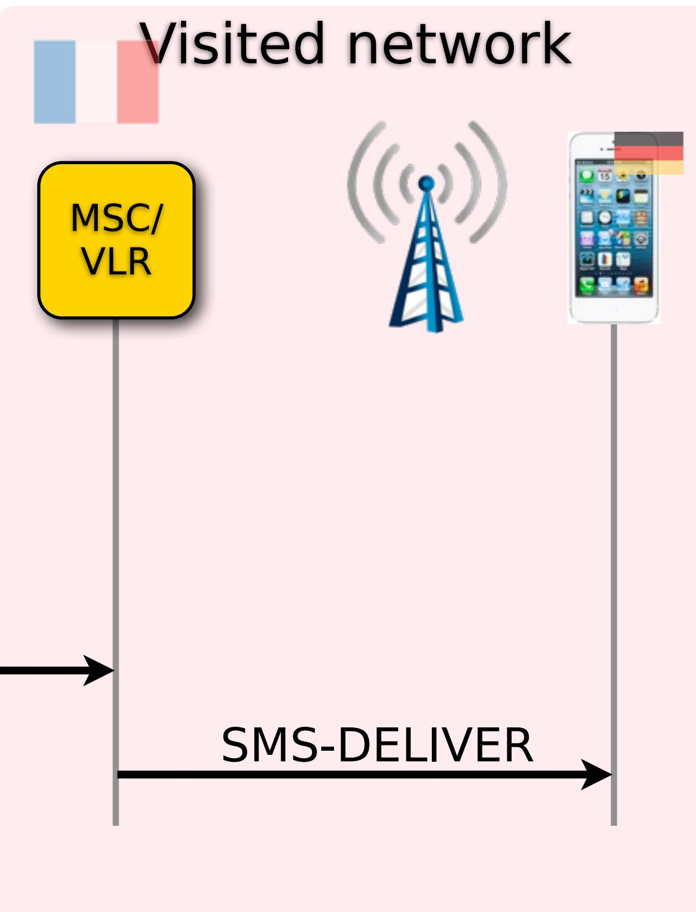

# SS7: Locate. Track. Manipulate.


You have a remote-controlled tracking device in your pocket

Tobias Engel <tobias@ccc.de> @2b_as

### SkyLock™ Product Description

### Locate. Track. Manipulate.

### History Module - Recalling targets past movements

The History module enables simple recollection and filtering of all SkyLock query results, alerts and notifications. This includes single queries as well as automatic (recurring queries).The main SkyLock functions which rely on the history module include:

| Track | Automatic | Wallary | Agent |  | Reports | Cher Admin |  | Penonal | 24 Hot 010 0 |  |  |
| --- | --- | --- | --- | --- | --- | --- | --- | --- | --- | --- | --- |
| Clates | Notification   Adive Quartio |  |  |  |  |  |  |  |  |  |  |
| Dates |  |  | 中国 |  |  |  |  |  |  |  |  |
| MSISON |  |  | Jap |  | Target | MSISCH | Status | Date | Cell | Usemane | Mission |
|  |  |  |  | E |  |  | ldle | 2012-05-07 16:19 | traq | Simon | DEMOGER |
| From |  | 2012-09-02 16:2 |  | 四 | Car | 17120000000 | ldle | 2012-09-07 16:05 | 606100065c3d9 | Alex |  |
| To |  | 2012-09-07 14 |  | D | CON |  | ldie | 2012-05-07 15:05 | 50610005543c0 | AlexCr |  |
| User |  |  | 1 | 2 | Cali | 2214 | ldle | 2012-09-06 23:21 | 504570019686bd | AlexCr |  |
|  | 上 |  | 1 0 | 03 | CLA | 221-50000 | ldia | 2012-09-06 23:21 | 60156019606bd | Quali |  |
| Mission | M |  |  |  |  |  |  |  |  |  |  |
|  |  |  | 4 ਦੀ 0 |  | (CALL) | State States | 14 | 2012-09-06 23:02 | 27/400 od02c2a | Esca |  |
|  |  | Find | 29 |  | Cat | 2121400000000 | Switchto | 2012-09-00 21:35 | 17150103ee2b0b | Eade |  |
|  |  |  | 29 |  | CO | 210/800000000 | Map View | 2012-09-06 20:10 |  | Zack |  |
|  |  |  | 29 |  | 0 | 51590000000 |  | 2012-09-06 19:40 | 17100103ea2b9b | Zadi | Zack missions |
|  | Filters |  |  | Collapse |  |  |  |  |  |  |  |
|  | Area |  |  | Filters Area |  |  |  |  |  |  |  |

Figure 5 - SkyLock tabular History screen


### The movement.

The combination of the Infiltrator Real-Time Tracking System as a strategic location solution and the Intelligence Interceptor, a tactical interception and location system, provides accurate, real-time data of target suspects and people of interest by tracking their mobile phones.

The Infiltrator Real-Time Tracking System will provide the location (GPS coordination) at a Cell-ID level. The input will be t target mobile number or the IMSI and the result will show the BTS coordination, where the target is registered on any map.


Real-Time Infiltrator Tracking System is an innovative tool for governmental and security organizations that require real-time data about suspects' location and

| INFILTRATER |  |  |  |  |  |  |
| --- | --- | --- | --- | --- | --- | --- |
|  |  |  | ative Locatio |  |  |  |
|  | Locator | Analyzer Runner |  | Reports | System | Lot |
| Personal | Location Result |  |  |  |  |  |
| Dates | MSISDN |  | 7 |  |  |  |
| MSISON | IMSI | 2509913009051 |  |  |  |  |
| Alerts | Country | UnitedKingdom |  |  |  |  |
|  | Cell | 32f4012fd91d |  |  |  |  |
| My Group | Status | ldle | S |  |  |  |
| Dates | Date | 2011-09-18 13:57:16 |  |  |  |  |
| MSISDN | Last Action | 2 |  |  |  |  |
|  | Conrrinates | 51 506547 -0 074666 |  |  |  |  |


### Signalling System #7

- Protocol suite used by most telecommunications network operators throuqhout the world to talk to each other
- Standardized in the 1980s in ITU-T Q.700 series ●
- When it was designed, there were only few telecoms operators, and they were either state controlled or really big corporations
- "Walled Garden" approach: trusted each other, so no authentication built in


# Signalling System #7 today

- • New protocols added in the 1990s and 2000s by ETSI and 3GPP to support mobile phones and the services they need (roaming, SMS, data...)
- Mobile Application Part (MAP) .
	- ► Contains everything mobile phones need that is not call signalling
- CAMEL Application Part (CAP) ●
	- ► New protocol that allows the network operator to build custom services that are not possible with MAP
- still no authentication for any of this o


## Signalling System #7 today

- Getting access is easier than ever .
	- ► Can be bought from telcos or roaming hubs for a few hundred euros a month
	- ► Usually (not always), roaming agreements with other networks are needed, but some telcos are reselling their roaming agreements
	- ► Some network operators leave their equipment unsecured on the internet
	- ► Femtocells are part of the core network and have been shown to be hackable


### SS7 Procotol Stack




SS7: Locate. Track. Manipulate.


7

### Home Location Register

Database containing all data on a subscriber:

- phone nùmber
- post-paid or pre-paid contract
- calls / text messages / 0 data allowed?
- call forwardings 0

O

■ ■ ■

: Basestation Subsystem - where is the subscriber, i.e. MSC/VLR that is currently serving the subscriber


SS7: Locate. Track. Manipulate.


### Home Location Register

Database containing all data on a subscriber:

- phone nùmber
- post-paid or pre-paid contract
- calls / text messages 0 data allowed?
- call forwardings 0

O

■■■

: Basestation Subsystem o --- where is the subscriber, i.e. MSC/VLR that is currently serving the subscriber


### Cell-Level Tracking


- The network needs to know which base station ("cell") is closest to the subscriber to deliver calls, SMS...
- If you can find out the ID of that cell, it's geographical position can be looked up in one of several databases
- The location of the cell tower is also a good approximation of ● the subscriber's location
- In cities, cell towers are so close that subscriber tracking down to street level is possible


SS7: Locate. Track. Manipulate.

11

### Commercial Tracking Providers

- o coverage of about 70% of worldwide mobile subscribers (with some restrictions ... )
- · Only the MSISDN (phone number) is required to locate a subscriber


Several commercial providers offer cell-level tracking as service, claim

The Infiltrator Real-Time Tracking System is an innovative tool for governmental and security organizations that require real-time data about suspects' location and

The system will not present the location of Israeli subscribers in Israel, and USA subscribers

Target's Location will be based on the target's MSISDN (public mobile number). In most case


- 


• MAP's anyTimeInterrogation (ATI) service can query the subscriber's HLR for her Cell-Id and IMEI (phone serial number, can be used to look up phone type)

SS7: Locate. Track. Manipulate.


- External networks should not be able to invoke it
- but still... o


# · Only meant as a network-internal service (e.g. to implement "home zones").

| GSM MAP 198 invoke anyTimeInterrogation |
| --- |
| GSM MAP 238 returnResultLast anyTimeInterrogation |
| SubSystem Number: HLR (Home Location Register) (6) |
| [Linked to TCAP, TCAP SSN linked to GSM_MAP] |
| Global Title 0x4 (9 bytes) |
| action Capabilities Application Part |
| obile Application |
| mponent: returnResultLast (2) |
| returnResultLast |
| invokeID: 1 |
| v resultretres |
| ▽ opCode: localValue (0) |
| localValue: anyTimeInterrogation (71) |
| v subscriberInfo |
| ▽ locationInformation |
| ageOfLocationInformation: 54 |
| > vlr-number: 91 -- 917f1 |
| > locationNumber: 6- -- 44291701 |
| Address digits: 44927110 |
| ▽ cellGlobalIdOrServiceAreaIdOrLAI: cellGlobalIdOrServiceAreaIdFixedLength (0) |
| cellGlobalIdOrServiceAreaIdFixedLength: ###1f235141 |


- Many networks actually block ATI by now


- Instead, query the MSC/VLR directly .
- . numbers, to identify subscribers
- ●


But MSC/VLR use IMSIs (International Mobile Subscriber Identifiers), not phone

ask the HLR for the subscriber's IMSI and Global Title of the current MSC/VLR Visited network


- MSC/VLR can be asked for the cell id of the subscriber


• When the attacker knows the IMSI of the subscriber and the Global Title, the

SS7: Locate. Track. Manipulate.

17

- Works for a lot of networks
- Most VLR/MSC accept ● requests from anywhere
- no plausibility checks ●


invoke provideSubscriberInfo

returnResultLast provideSubscriberInfo

| > Global Title 0x4 (9 bytes) |
| --- |
| > Transaction Capabilities Application Part |
| GSM Mobile Application |
| ▽ Component: returnResultLast (2) |
| ▽ returnResultLast |
| invokeID: 1 |
| v resultretres |
| ▽ opCode: localValue (0) |
| localValue: provideSubscriberInfo (70) |
| v subscriberInfo |
| V locationInformation |
| ageOfLocationInformation: 0 |
| > vlr-number: 91 -- 410000 |
| > locationNumber: 0417 ------ 10000 |
| Address digits: 714 - 10000 |
| ▽ cellGlobalIdOrServiceAreaIdOrLAI: cellGlobalIdOrServiceAreaIdFixedLength (0) |
| cellGlobalIdOrServiceAreaIdFixedLength: 62f |
| > msc-Number: 91 10000 |
| currentLocationRetrieved |
| sai-Present |
| △ subscriberState: assumedIdle (0) |
| imei: 5392422000 |
| IBCD digits: 3529240200 |


### Real-life tracking

- We tracked some folks (but only after asking for permission) o
- For about two weeks, cell id was queried once per hour

- Many, many thanks to Sascha for his work on the maps!


### Observations of a German network operator

- borders
- essentially eliminated the simple form of tracking as seen before
- Attack traffic dropped more than 80%:
	- ► Some of that traffic was due to misconfiguration at other networks
	- ► Commercial use cases:
		- a shipping company was tracking its vehicles
		- out if the SIM was recently swapped


• The Operator started filtering all network-internal messages at the network's

· This (combined with SMS home routing, which the operator has in place)

– an SMS service provider for banks who use text messages as a second form of authentication (mTAN) was using the MAP sendIMSI request to find


### Observations of a German network operator

- Some of the network operators where the attacks originated either did not . respond or played dumb when the issue was addressed by the German operator
- The operator believes that those attacks are being performed by state actors or the other network's operators themselves
- Some attacks are still happening, which requires other information sources or ● brute-forcing to get VLR/MSC and IMSI


- · In the US, E911 mandates: "Wireless network operators must provide the latitude and longitude of callers within 300 meters, within six minutes of a request by a Public Safety Answering Point"
- LCS can use triangulation to further narrow down a subscriber's position or even request a GPS position from the phone (via RRLP)
- · Emergency services request a subscriber's location from the Gateway Mobile Location Center (GMLC)
- GMLC requires authentication •


3GPP TS 23.271 version 11.2.0 Release 11


- VLR


· Authentication at the GMLC can also be circumvented by directly querying the

SS7: Locate. Track. Manipulate.


# Verifying the sender. MAP


- Routing of MAP messages . happens in the SCCP layer
- Requests get routed to the o "Called Party Address" (e.g. the address of an VLR)
- Responses will be sent back to ● the "Calling Party Address" from the request

```
Pointer to first Mandatory Variable parameter: 3
  Pointer to second Mandatory Variable parameter: 13
  Pointer to third Mandatory Variable parameter: 23
V Called Party address (10 bytes)
  D Address Indicator
     SubSystem Number: VLR (Visitor Location Register) (7)
     [Linked to TCAP, TCAP SSN linked to GSM_MAP]
  ▽ Global Title 0x4 (8 bytes)
       Translation Type: 0x00
       0001 ... = Numbering Plan: ISDN/telephony (0x01)
            0010 = Encoding Scheme: BCD, even number of digits (0x02)
        000 0100 = Nature of Address Indicator: International number (0x04)
       Called Party Digits: 6281106089
          Called or Calling GT Digits: 6281106089
          Number of Called Party Digits: 10
          Country Code: 62 Indonesia (Republic of) (length 2)
V Calling Party address (10 bytes)
  Address Indicator
     SubSystem Number: HLR (Home Location Register) (6)
     [Linked to TCAP, TCAP SSN linked to GSM MAP]
  ▽ Global Title 0x4 (8 bytes)
       Translation Type: 0x00
       0001 ... = Numbering Plan: ISDN/telephony (0x01)
            0010 = Encoding Scheme: BCD, even number of digits (0x02)
        .000 0100 = Nature of Address Indicator: International number (0x04)
       Calling Party Digits: 6281105190
          Called or Calling GT Digits: 6281105190
          Number of Calling Party Digits: 10
          Country Code: 62 Indonesia (Republic of) (length 2)
```


# Verifying the sender, MAP-style

- Problem:
	- SCCP doesn't know anything ● about MAP or what entities should be able to use which MAP services
- "Solution": •
	- Have the sender(!) put another copy of its "Calling Party Address" in an extra field in the MAP layer, so it can be verified
	- Routing will still happen to addresses from the network layer

```
= Numbering Plan: ISDN/telephony
          0001 = Encoding Scheme: BCD, odd number of digits
           100 = Nature of Address Indicator: Internationa
   > Called Party Digits: 19471292417
Calling Partv address (11 bvtes
                                                     onse will
 V Global Title Øx4 (9 bvt
   ~ m c-Nump
                  = Extension: No Extension 
         001 ... = Nature of number : In ernational Number (0x01)
             0001 = Number plan: ISDN Telephony Numbering (Rec ITU-T E.164) (0x01)
        Address digits: 49158598319
```


## Verifying the sender, MAP-style

### If we tell the truth: o

eocole



## Verifying the sender, MAP-style

### ●

eocole


- most network's VLR/MSC don't do any plausibility checks
- . VLR altogether


SS7: Locate. Track. Manipulate.

### Denial of Service

· It is not only possible to read subscriber data - it can also be modified, since

Control every aspect of what a subscriber is allowed to do: enable or disable incoming and/or outgoing calls / SMS or data or delete the subscriber from the


- · "Customised Applications for Mobile networks Enhanced Logic"
- Specified in 3GPP TS 23.078 .
- Like an overlay over usual MAP logic
- Defines a set of events, for which the VLR should contact the CAMEL entity in the subscriber's home network (gsmSCF = "GSM Service Control Function)
- The gsmSCF then decides if the desired action can continue unmodified or modified or will be aborted


### CAMEL


- Example: German subscriber is roaming in France
- German HLR tells French VLR "notify my gsmSCF at address +4917… whenever the subscriber wants to make a call"


### CAMEL

- Subscriber wants to make a phone call, but dials number in German national format ● (0317654...)
- MSC asks gsmSCF in home network what to do with the call ●
- the new number


gsmSCF rewrites number to international format (+49317654...) and tells MSC to continue with

SS7: Locate. Track. Manipulate.


- "fake gsmSCF" address


• • Attacker overwrites gsmSCF address in subscriber's MSC/VLR with it's own,


- instead of the subscriber's gsmSCF


SS7: Locate. Track. Manipulate.

### Subscriber wants to call +345678..., but the MSC now contacts the attacker


- PBX)


SS7: Locate. Track. Manipulate.

• Attacker rewrites number to +210987... his recording proxy (e.g. an Asterisk


- · MSC sets up call to +210987..., which bridges it to the original +345678... Both subscribers can talk to each other, while the attacker records the .
- conversation


SS7: Locate. Track. Manipulate.


### HLR: Location Update

- MAP updateLocation request to the subscriber's HLR


SS7: Locate. Track. Manipulate.

• When a subscriber travels to another region or country, the VLR/MSC sends a


### HLR: Update Location

- address of the VLR/MSC


SS7: Locate. Track. Manipulate.

• The HLR sends a copy of the subscriber's data to the VLR/MSC and saves the


## HLR: Update Location

- MSC


• • Now, when somebody wants to call or text the subscriber, the HLR gets asked for routing information (sendRoutingInfo...) and hands out the address of the VLR/



SS7: Locate. Track. Manipulate.


### HLR: Stealing Subscribers

- The updateLocation procedure is also not authenticated
- An attacker can simply pretend that a subscriber is in his "network" by sending the updateLocation with his Global Title to the subscriber's HLR


### HLR: Stealing Subscribers

- Now, calls and SMS for that subscriber are routed to the attacker
- Example: Subscriber's bank sends text with mTAN. Attacker intercepts . message and transfers money to his own account


SS7: Locate. Track. Manipulate.


## HLR: Supplementary Services

- USSD codes can be executed for other subscribers
	- ► Some carriers offer transfer of prepaid credits via USSD
- Call forwardings can be set/deleted ●
	- ► An attacker could forward a subscriber's calls to a premium rate number controlled by him and then call the subscriber's number, billing all the premium rate calls to the subscriber
- Switch active SIM in case of Multi-SIM ●


## HLR: Supplementary Services

- . sending the request
GSM Mobile Application ▽ Component: returnResultLast (2) ▽ returnResultLast invokeID: 1 v resultretres ▽ opCode: localValue (0) localValue: processUnstructuredSS-Request (59) ▽ ussd-DataCodingScheme: Øf ... . 1111 = Language: Language unspecified (15) ussd-String: a0e09a5e2fb3d9e539e858a7a3c3e2b25b0782b9703450b1.. USSD String: |Aktuelles Guthaben: 0.84 EUR.

Requests can even be sent without a previous updateLocation procedure, because the HLR does not check if the subscriber is in the network that is

0000 .... = Coding Group: Coding Group Ø(Language using the GSM 7 bit default alphabet) (0)


### Hybrid Attacks: TMSI De-anonymization

- An attacker can find out the phone numbers of subscribers around him:
	- ► Paging of subscribers (e.g. to notify them of an incoming call) has to happen unencrypted
	- TMSI (Temporary Mobile Subscriber Identifier) is normally used for paging so ▲ that the real identity of the subscriber (IMSI) does not have to be sent over the air unencrypted


SS7: Locate. Track. Manipulate.


### Hybrid Attacks: TMSI De-anonymization

 Attacker captures TMSI over the air, e.g. with OsmocomBB ●


### Hybrid Attacks: TMSI De-anonymization

- The MSC can be asked to hand out the IMSI if the TMSI is known ●
- With updateLocation, the attacker can figure out the MSISDN belonging to the IMSI


SS7: Locate. Track. Manipulate.


## Hybrid Attacks: Intercept Calls

### The MSC can be also be asked for the session key for of the subscriber! ●


## Hybrid Attacks: Intercept Calls

- it using the session key
- Passive attack, no IMSI catcher necessary ●


• If the attacker captures an encrypted GSM or UMTS call, he can then decrypt

SS7: Locate. Track. Manipulate.


- LTE uses the Diameter protocol in the core network
- SS7 is becoming a legacy protocol, but: .
	- ▶ A lot of the SS7 design has been ported to Diameter, including its flaws
	- ► E.g. there is still no end-to-end authentication for subscribers
	- ► GSM/UMTS (and with them SS7) will be around for a long time to come (probably around 20 years)
- To be able to have connections from GSM/UMTS to LTE, there are interfaces mapping most of the SS7 functionality (includinq its flaws) onto Diameter


### LTE


- An attacker needs SS7 access and (most of the time) SCCP roaming with his victim's network
- Then, with only his victim's phone number, he can o
	- ► Track his victim's movements (in some networks with GPS precision)
	- ► Intercept his victim's calls, text messages (and probably data connections, not verified)
	- ► Disable calls, SMS, data
	- ► Re-route calls, at the victim's expense
- With only a TMSI, captured over the air interface, he can
	- · decrypt calls captured off the air (GSM, UMTS)
	- find out the IMSI and phone number belonging to the TMSI ▲

### Summary

- SS7: Locate. Track. Manipulate.


### Countermeasures (for operators)

- · Network operators should remove all necessities to hand out a subscriber's IMSI and current VLR/MSC to other networks
	- ► With SMS Home Routing, all text messages traverse an SMS router in the subscriber's home network
	- ▶ When the HLR receives sendRoutingInfoForSM request, it only needs to hand out the address of the SMS router instead of the MSC address
	- ► Instead of the subscriber's IMSI, only a correlation id will be returned (that can be resolved by the SMS router)
- · All MAP and CAP messages only needed internally in the network should be filtered at the network's borders
	- ▸ If Optimal Routing is not used, sendRoutingInfo (the one for voice calls, another source of MSC and IMSI), can also be filtered


- SS7: Locate. Track. Manipulate.


### Countermeasures (for subscribers)

- Tell your operator to take action
- Throw away phone

- (Sorry, there really isn't that much you can do)


### References

- ●
- Defentek Infiltrator product brochure:  ●
- Signalling System #7, ITU-T Q.700 series:  ●
- ●
- CAMEL Phase 4; Stage 2: 3GPP TS 23.078:  series/23.078/ ●
- ●
- 1qavLmF
- 23 series/23.271/
- osmocomBB:  ●
- www.3gpp.org/ftp/Specs/archive/29_series/29.272/
- ●
- www.slideshare.net/phdays/phd4-pres-callinterception119


SS7: Locate. Track. Manipulate.

Verint Skylock product brochure: 

Mobile Application Part (MAP) specification, 3GPP TS 29.002: 

CAMEL Application Part (CAP) specification, 3GPP TS 29.078:  series/29.078/

Washington Post, For sale: Systems that can secretly track where cellphone users go around the globe: 

Functional stage 2 description of Location Services (LCS), 3GPP TS 23.271: 

Evolved Packet System (EPS): MME and SGSN related interfaces based on Diameter protocol, 3GPP TS 29.272: http://

Study into routeing of MT-SMs via the HPLMN, 3GPP TR 23.840:  series/23.840/ Sergey Puzankov and Dmitry Kurbatov, How to Intercept a Conversation Held on the Other Side of the Planet: http://


