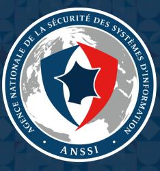

# ATTACKS INVOLVING THE MIESPINOZA/PYSA RANSOMWARE

2

TLP:WHITE

Attacks involving the Mespinoza/Pysa ransomware

## Table of contents

| 1 Context |  |
| --- | --- |
| 2 Technical analysis |  |
| 2.1 The Mespinoza/Pysa ransomware . | 3 |
| 2.1.1 Two versions of the ransomware | 3 |
| 2.1.2 Ransom demand messages | 4 |
| 2.1.3 A third ransomware . | 4 |
| 2.2 Tactics, Techniques and Procedures . |  |
| 2.2.1 Infection vector, reconnaissance and lateral movement . |  |
| 2.2.2 Stealth and resilience | ર |
| 2.2.3 Command and Control . | 6 |
| 2.3 Comments . | 6 |

## 1 Context

In the past few weeks, ANSSI became aware of cyber attacks targeting French local authorities. These attacks involved ransomwares whose use resulted in several encrypted files. The origin of these attacks is still unknown, and investigations are in progress. However, ransomware attacks are usually opportunistic and driven by a lucrative purpose.

This document aims at describing the behaviour of the intrusion set involved in these attacks, as well as providing related indicators of compromise.

## 2 Technical analysis

The operation detailed in this document targeted interconnected information systems, and seems to leverage a variant of a ransomware known in open sources as Mespinoza. Note that the technical elements presented thereafter come from ongoing analysis and are prone to evolve.

## 2.1 The Mespinoza/Pysa ransomware

The Mespinoza ransomware was first used in October 2018 at least. The first versions produced encrypted files carrying the « . locked » extension, common to many ransomwares. Since December 2019, a new version of Mespinoza is documented in open sources. This version is often called Pysa because it produces encrypted files with the « . pysa » extension.

### 2.1.1 Two versions of the ransomware

The ransomware used in this attack seems to be a variant of Pysa. Two versions were dicovered during the investigations:

- An executable file named « svchost . exe ». This file came along with several .bat scripts whose purpose was to copy the executable in the « C : \windows\temp » directory (which is not the legitimate location of the standard service host) and to execute it.
- A Python archive named « 17535. pyz », that contained the Python source code of the ransomware.

| Filename | SHA-1 | Size (bytes) |
| --- | --- | --- |
| svchost.exe | 52b2fc13ec0dbf8a0250c066cd3486b635a27827 | 516608 |
| 17535.pyz | c74378a93806628b62276195f9657487310a96fd | 279590 |

#### The Windows executable version

NEW The executable version of the ransomware drops and executes a script named « update. bat » whose purpose is to delete it after execution [T1107].

NEW Several system artefacts are generated by the ransomware. First, the malicious code creates a Mutex named « Pysa ». Then, it modifies the registry key SOFTWARE|Microsoft|Windows|CurrentVersion|Policies|System [T1112] to add the following entries:

- · «legalnoticetext = [Ransom demand message] »
- · « legalnoticecaption = PYSA »

NEW Finally, the encryption routine contains a list of targeted file extensions for encryption, as well as a list of strings identifying the critical files that should be spared (for instance, ":(Windows)"). The files created by the en-

#### Attacks involving the Mespinoza/Pysa ransomware

cryption routine carry the « . pysa » extension [T1486].

These observations are perfectly consistent with those regarding previous Pysa samples analysed in open sources, see [1].

#### The Pvthon version

The Python archive « 17535 . pyz » is made of a run.py file together with Python libraries pyaes and rsa that are in charge of the encryption function [T1486].

The run.pv file contains the ransomware configuration, including the RSA public key used for encryption, the ransom demand message as well as a variable allowing to choose the extension of the encrypted files. In the present version, this variable contained the value « . pysa ».

NEW The run,py file also contains an instruction allowing to delete the ransomware after execution, as in the executable version [T1107].

### 2.1.2 Ransom demand messages

Out of the « . pysa » file extension, there is no evidence indicating that both versions of the ransomware were leveraged by the same intrusion set. However, both create a ransom demand file, in the form of a pop-up window and a « Readme . README » file for the first, and a file named « RECOVER_YOUR_DATA . txt » for the second.

These ransom demands are written in English, but contain several mistakes. Despite being different, both messages contain identical strings such as «To get a11 your data back contact us : ». One of them also offers free decryption of two files, as a proof of good faith. These characteristics were also available in former versions of the Pysa ransomware.

Finally, both ransom demand messages contain PROTONMAIL e-mail addresses that seem to be generated from randomly chosen names.

Note that both ransom demand messages contain the same e-mail addresses. Moreover, similar e-mail addresses were used in former versions of the Pysa ransomware.

## 2.1.3 A third ransomware

NEW On one of the compromised information systems, a third ransomware has been used. This ransomware is made of two PowerShell scripts named « step1.ps1 » and « step2.ps1 » [T1086].

| Filename | SHA-1 | Size (bytes) |
| --- | --- | --- |
| step1.ps1 |  | 12066 |
| step2.ps1 | 24c592ad9b21df380cb4f39a85d4375b6a8a6175 | 4869 |

NEW These codes operate in the following manner:

- The purpose of «step1.ps1» is to produce a list of files of the compromised system. The script contains some regular expressions whose aim is to avoid some critical directories and files, as in Pysa's binary version. The filenames are base-64 encoded (and separated by a "\" character), and then given as a parameter to « step2.ps1».
- In order to launch « step2. ps1 », the « step1. ps1 » script creates a copy of powershell.exe under a random name of the form « EnNoB-X.exe», where X is an integer ranging between 1000 and 9876. (The code of « step1. ps1» thus contains the path of « step2. ps1 » on the victim's machine, which is the reason why its hash is not mentioned above.)
- · The « step2.ps1 » script does encrypt the files passed in parameter. To do so, it contains a RSA public key and uses the AES-CBC algorithm [T1486]. Again, the script contains a list of file extensions to be spared. In this version, the encrypted files carry the « . newversion » extension, which can be modified in the script.

#### Attacks involving the Mespinoza/Pysa ransomware

Finally, « step2. ps1 » contains an instruction that deletes the copy of powershell.exe that is responsible for its execution [T1107].

NEW The « step1. ps1 » script creates a ransom demand file named « Readme. READ ». Albeit very short, this message contains the same PROTONMAIL e-mail addresses as above. It is thus likely that all these attacks were led by the same intrusion set.

NEW To conclude, note that none of the analysed ransomwares has a self-propagation capability.

## 2.2 Tactics, Techniques and Procedures

Several artefacts tied to the intrusion set's activity were observed on the compromised information systems.

### 2.2.1 Infection vector, reconnaissance and lateral movement

The initial infection vector is currently unknown, but several events that occured before the attack could be linked to the intrusion set and its initial access or lateral movement methods.

- Some bruteforce attempts were observed on a central management console, as well as on some ACTIVE DI-RECTORY accounts [T1110]. Moreover, some domain administrator accounts were indeed compromised.
- · A password database has been exfiltrated shortly before the attack [T1081].
- Some illegitimate RDP connections occured between domain controllers using an unknown hostname potentially linked to the intrusion set [T1076].

The « . bat » scripts used by the intrusion set to copy and execute the ransomware (see Section 2.1.1) reveal a significant use of the remote administration tool PsExec [T1035], as well as the PowerShell language [T1086].

NEW The analysis of compromised machines also revealed the presence of several Mimikatz samples, potentially used to gain access to credentials [T1003].

NEW Tinally, the network reconnaissance tools Advanced Port Scanner and Advanced IP Scanner by FAMATECH were discovered on the information system [T1016].

## 2.2.2 Stealth and resilience

One of the aforementioned « . bat » scripts is dedicated to the execution of a PowerShell script named « p. ps1 » on machines across the network. This script has several functionalities, among which:

- Stopping antivirus services, some other services and processes, as well as uninstalling WINDOWS DEFENDER [T1089].
- · Deleting restore points and shadow copies [T1490].
- · Modifying README files to allow double-click opening.
- Broadcasting the MAC address of the machine in a UDP datagram sent over port 7.
- Modifying local accounts passwords [T1498].

It seems that this script is used to improve stealth, maintain the access to the network and mostly prepare the ransomware execution. The last functionality suggests that the intrusion set has a program listening over port 7, but such a program has not been discovered at the time of writing.

NIW Several tools discovered on the information system may have allowed the attacker to maintain an access to some machines or to exfiltrate data, such as Putty or WinSCP [T1021].

## TLP:WHITE

#### Attacks involving the Mespinoza/Pysa ransomware

## 2.2.3 Command and Control

#### Remote Access Tool in Go

NEW The following binary was found on several compromised machines.

| SHA-1 | Size (bytes) |
| --- | --- |
| f2dda8720a5549d4666269b8ca9d629ea8b76bdf | 5207040 |

NEW This file was discovered under several legitimate filenames as sshsc.exe or explorer.exe. One was located under « C: \windows\temp\svchost.exe », the same path as the Pysa ransomware (see Section 2.1.1). This suggests that these tools could have been used by the same intrusion set.

NEW The above binary is a Remote Access Tool written in Go language. A characteristic of this malware is the logging in plaintext in the file « %TEMP%\h1og . 1og ».

#### Use of Empire

Several agents of the post-exploitation tool Empire were discovered, in particular on domain controllers of the compromised information systems. Although no technical link is established with the use of the Pysa ransomware, it is likely that these tools were used by the same intrusion set.

## 2.3 Comments

The intrusion set observed in these attacks is consistent with an opportunistic actor driven by profit.

The leveraged tactics, techniques and procedures are classic and not particularly evolved. The intrusion set performed some actions to avoid detection by security solutions, by disabling some of them. However, the purpose of these actions is more likely to allow the ransomware to be executed in good conditions rather than covering the tracks.

The Python version of the ransomware is based on public libraries and its specific code is short. The observed elements suggest that this tool could have been developed quickly. Moreover, the use of three ransomwares in the same attack suggests that the intrusion set may have adapted to the characteristics of the targeted information systems. Finally, many publicly available post-exploitation tools were used during the attack.

These elements are consistent with an opportunistic actor leveraging resources adapted to its final objective.

Attacks involving the Mespinoza/Pysa ransomware

## Bibliography

- [1] [TLP:WHITE] MALWARE.NEWS, Another one for the collection Mespinoza (Pysa) Ransomware. Dec. 2019.
