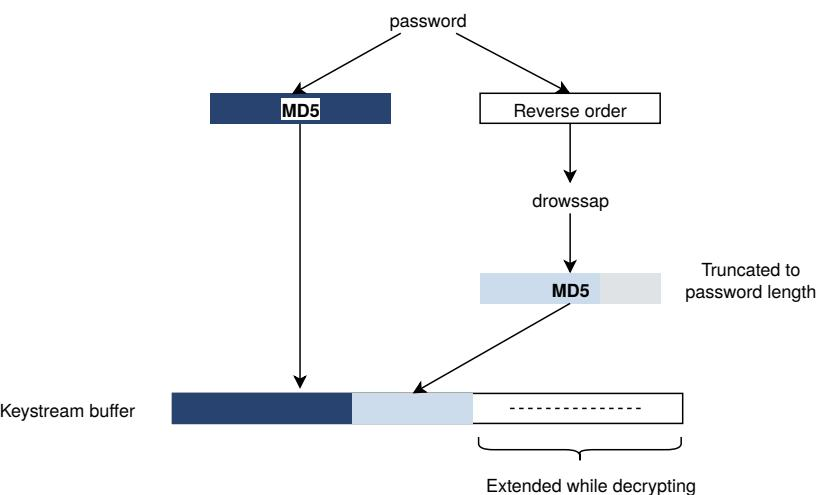
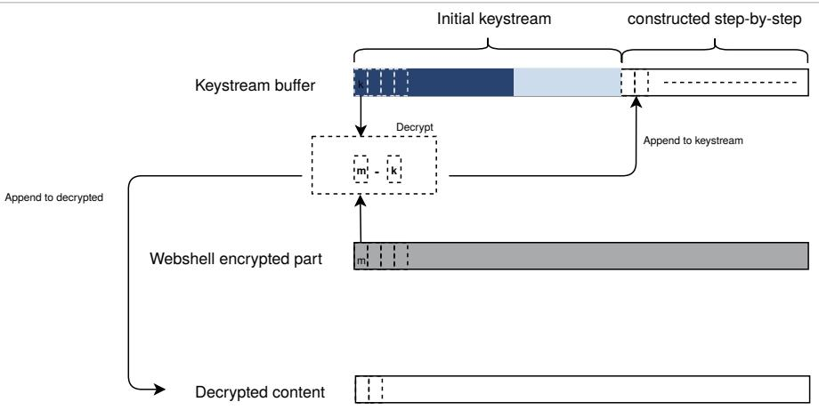
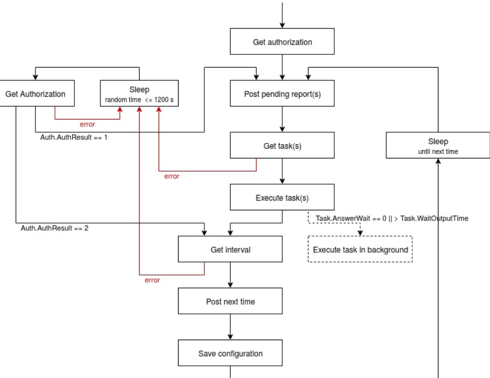

# SANDWORM INTRUSION SET CAMPAIGN TARGETING CENTREON SYSTEMS

## DESCRIPTION AND REMEDIATION

1.0 27/01/2021


TLP:WHITE

Sandworm intrusion set campaign targeting Centreon systems

# Table of contents

| 1 | Targeted systems . . . | 4 |
| --- | --- | --- |
| 2 | Malwares . | 4 |
|  | 2.1 Webshell P.A.S. 3.1.4 | 4 |
|  | 2.1.1 Context on the webshell | 4 |
|  | 2.1.2 Webshell upload | 4 |
|  | 2.1.3 Webshell characteristics | 5 |
|  | 2.2 Exaramel backdoor . . . | 11 |
|  | 2.2.1 Installation | 11 |
|  | 2.2.2 Analysis . | 11 |
|  | 2.2.3 Backdoor versions | 20 |
|  | 2.3 "SetUID" binary . | 21 |
| 3 | Infrastructure | 21 |
|  | 3.1 Anonymisation infrastructure | 21 |
|  | 3.2 Command and Control infrastructure | 21 |
| 4 | Technics, tactics and procedures | 22 |
| 5 | Links with the intrusion set Sandworm | 22 |
| 6 | Recommandations | 23 |
|  | Patch applications 6.1 | 23 |
|  | 6.2 Limit monitoring systems external exposure | 23 |
|  | 6.3 Server hardening | 23 |
| 7 | Detection methods | 24 |
|  | 7.1 P.A.S. webshell detection | 24 |
|  | 7.1.1 YARA rules | 24 |
|  | 7.1.2 Network detection | 26 |
|  | 7.2 Exaramel backdoor detection | 31 |
|  | 7.2.1 System artefacts | 31 |
|  | 7.2.2 YARA rules | 32 |
|  | 7.2.3 Network detection | 36 |
|  | 7.3 Indicators of compromise . | 36 |
| 8 | Bibliography | 37 |

Sandworm intrusion set campaign targeting Centreon systems

## Summary

ANSSI has been informed of an intrusion campaign targeting the monitoring software Centreon distributed by the french company CENTREON which resulted in the breach of several French entities.

The first victim seems to have been compromised from late 2017. The campaign lasted until 2020.

This campaign mostly affected information technology providers, especially web hosting providers.

On compromised systems, ANSSI discovered the presence of a backdoor in the form of a webshell dropped on several Centreon servers exposed to the internet. This backdoor was identified as being the P.A.S. webshell, version number 3.1.4. On the same servers, ANSSI found another backdoor identical to one described by ESET and named Exaramel [1].

This campaign bears several similarities with previous campaigns attributed to the intrusion set named Sandworm.

This report provides technical information detailing this campaign: targeted systems (Section 1), detailed malwares code analysis (Section 2), infrastructure (Section 3), tactics, techniques, and procedures (Section 4) and link with the intrusion set Sandworm (Section 4). Recommandations (Section 6) and detection methods (Section 7) are suggested to better protect against this kind of attack and remediate eventual compromissions.

Sandworm intrusion set campaign targeting Centreon systems

## 1 Targeted systems

Centreon is a software developed by a company of the same name. Its purpose is to monitor applications, networks and systems. An open-source version exists under the GPL 2.0 licence. The editor-issued virtual image is based on the CENTOS operating system. However, it is also available on other LINUx operating systems.

The simplified software architecture is divided between a monitoring core named Centreon Engine and a graphical user interface named Centreon Web UI [2]. The default installation settings use the ΑΡΑΣΗΕ server and serve the interface on the URL 

Compromised servers identified by ANSSI ran the CENTOS operating system. Centreon had not recently been updated. The most recent installation version studied by ANSSI was 2.5.2.

The initial compromise method is not known.

## 2 Malwares

### 2.1 Webshell P.A.S. 3.1.4

### 2.1.1 Context on the webshell

The P.A.S. webshell was developed by an ukrainian student, Jaroslav Volodimirovich Panchenko, who used the nickname Profexer [3][4]. It was developed in PHP and features a characteristic password-based encryption [5]. This tool was available through a form on his website, where a user had to provide a password to receive a custom webshell. The form suggested a donation to the developer. It was commonly used, including during a WORDPRESS website attack [6] [7].

In december 2016, the DEPARTMENT OF HOMELAND SECURITY published a report known as Grizzly Steppe [8] that presented tools, techniques and infrastructure used during various attacks on the 2016 U.S. elections. Its appendix features a webshell that the DHS named Fobushell, an alternate name for the P.A.S. webshell.

Some webshells included in the Grizzly Steppe report [8] used the version numbers 3.0.10 and 3.1.0. Their passwords were root, avto, 123123, we kome and |F3Jk 6k6. The report does not mention the versions and passwords for several samples.

Following the report, the developer stopped its webshell generation service and contacted the U.S. authorities [3]. The last known version of this webshell was the 4.1.1. However, many samples of this webshell remain publicly available.

### 2.1.2 Webshell upload

Centreon servers analysed by ANSSI analysed presented several illegitimate PHP files. Further analysis allowed their identification as versions of the P.A.S. webshell, the source code displaying the version number 3.1.4. They could be found at the following paths:

- · /usr/local/centreon/www/search.php
- /usr/share/centreon/www/search.php
- /usr/share/centreon/www/modules/Discovery/include/DB-Drop.php

The first files were thus reachable through internet using the URL  php.

Sandworm intrusion set campaign targeting Centreon systems

Commentary: Even though the 3.1.4 version does not seem to be publicly available, it is still easy to modify the webshell source code. For example, it is possible to trivially alter the password or the version number.

Another illegitimate PHP file was identified at the path /usr/share/centreon/www/htm1Header . php. This file was deleted before ANSSI could recover and analyse it.

On all servers analysed by ANSSI, webshell-related files were created by the apache user.

### 2.1.3 Webshell characteristics

The following section exposes the results of an analysis based on the P.A.S. sample identified by the following hashes:

#### P.A.S. sample hashes

| Algorithm | Value |
| --- | --- |
| MD5 | 84837778682450cdca43d1397afd2310 |
| SHA-1 | c69db1b120d21bd603f13006d87e817fed016667 |
| SHA-256 | 893750547255b848a273bd1668e128a5e169011e79a7f5c7bb86cc5d7b2153bc |

#### 2.1.3.1 Webshell encryption

One of the distinctive characteristics of the malware is the use of a specific encryption layer to both conceal its internals from scrutiny and enforce an access control when deployed on a compromised host. This mechanism, previously documented by Trustwave [5], will be quickly reviewed thereafter.

The webshell PHP file is composed of two main parts:

- · the encrypted and base64 encoded core functionalities to be executed once activated and compressed;
- a form backed by the decryption mechanism to process the password supplied by the operator. The code snippet below shows a formatted and deobfuscated version of this part of the webshell.

```
$password = isset($_POST['password']) ? $_POST['password'] : (isset($_COOKIE['password']) ?
 1
        $ COOKIE['password']: NULL);
     t
2
    if($password!==NULL)
 3
4
    ન
        $password = md5($password).substr(MD5(strrev($password)),0,strlen($password));
 5
        for($counter = 0; $counter < 15571; $counter++)
 6
7
        イ
            $webshell_data[$counter] = chr(( ord($webshell_data[$counter]) -
 8
            -> ord($password[$counter]))%256);
 9
            $password .= $webshell data[$counter];
        }
10
11
        if($webshell data = @gzinflate($webshell data))
12
        イ
13
            if(isset($_POST['password']))
14
                @setcookie('password', $_POST['password']);
 15
            $counter=create function('',$webshell data);
16
            unset($password,$webshell_data);
17
            $counter();
 18
        }
19
    }
20
```
Sandworm intrusion set campaign targeting Centreon systems

The decryption logic can be described as follows.

- · The webshell data is first base64 decoded;
- the password is received via the login form, depicted in figure 2.1, through a POST parameter variable or in a cookie if the login phase has already happened.

| 127.0.0.1/webshell/fobushe ×   十 |  |
| --- | --- |
| (←) → C ↑ | 0       127.0.0.1/webshell/fobushell.php |
|  | > |

Fig. 2.1: P.A.S. login page

Commentary: The name of the variable used to convey the password changes in the different versions of the webshell. However it mainly follows the same structure in available samples. The one defined in our case is q_q. Other ones extracted from available P.A.S. samples include 1___ l_, _f___f or wp__wp.

- A decryption keystream buffer is built using the MD5 hash of the password, concatenated with a second value based on the MD5 hash computed from the password in reverse order and truncated to the length of the password.


Fig. 2.2: P.A.S. decryption key setup

- The program then enters a loop where for each iteration a character from the decryption key buffer is subtracted from a byte of the encrypted webshell. The result is both used as the decrypted data and appended to the key buffer, thus building the keystream on the fly.
- At the end, the decrypted buffer is passed to PHP's gzinflate function in order to uncompress it.

Sandworm intrusion set campaign targeting Centreon systems




- At that point, if the buffer decryption was correct, the inflate action should succeed and the newly available code run. If it is not already the case, i.e. if it is the initial connection, the password is set in a cookie for future use.
#### 2.1.3.2 Functionalities

The webshell has several functionalities grouped by categories within sub-menus accessible from the interface's navigation bar. The malware is built on a main view which is updated to reflect navigation choices whenever a subfunction webshell is started. The different choices will be discussed below. As a global overview, each function of the webshell is built upon a form that seeks to get the task parameters before running it, then update the interface in order to display the results.

Commentary: The field names for these forms are statically defined by the webshell code. Several detection strategies are detailed in the appendix.

#### Explorer Menu

The first webshell menu regroups file handling tasks. It offers the following actions:

- list files and several of their characteristics such as extension, file size, ownership or permissions;
- · interact with a file to to move, copy, delete or download it;
- · rename a file;
- · create a new file or modify an already existing file;
- · upload a file on the compromised host.

#### Sandworm intrusion set campaign targeting Centreon systems

| Fig. 2.4: Snapshot of the Explorer menu of P.A.S. |
| --- |

Fig. 2.4: Snapshot of the Explorer menu of P.A.S.

When editing a file, it is possible to:

- change its permissions;
- change its group;
- change its last modification date.

Regarding the last options, if the file does exists, by default the last modification date is set to the original file last modification date. If not, the webshell uses the last modification date of the folder.

| Searcher | Explorer | SOL-client | Network Tools | nasswd BruteForce Server info | CMD |  |  |
| --- | --- | --- | --- | --- | --- | --- | --- |
| /var/www/html/webshell/ | Go to : |  |  |  |  |  |  |
| Jump : /var/www/html/webshell/ |  |  |  |  |  |  |  |
| Show as image | Edit file |  |  |  |  |  |  |
| /var/www/html/webshell/fobushell.php |  |  |  |  |  |  | Save |
| A COUNTY COLLUMNULU/ LULUMNULU/ LUFULAUN/WANI WA VI 7/ IW   VO/ LITEMAPLACELLA UVANIYAS VIII LUTA |  |  |  |  |  |  |  |
| F8CVbqzMP\ZRtV+ag1ArPbF\D2UikhRto//HjXeD7K7GJdhocxNtKhos5XYfAEkvrK5WCzGTz40u/fdK |  |  |  |  |  |  |  |
| /00wpPCxGfFx6r1r0wcidDGuHRAW3e48R6vWUhabuLdf+Bnik4Y1zmi9CutR4AaH01N7U08jeknaY4hB |  |  |  |  |  |  |  |
| +AChEf6f/VX9PBF3jPR4bW5Ujm7V6aiFpkvvhzi9c5IbskZ3RifBNgAE4TRt04dcFf0vfSH7Vv7t5mnf |  |  |  |  |  |  |  |
| z93vufTw1mI/1Vr126FA0wKOF3o0αKvuDRMpRJY0R9vLd+0Cnat8YEJ1ci+2b51aUu+mArQ0h0f/RzZs |  |  |  |  |  |  |  |
| M95hCmoSt405Cb1EXMX4DI3WibMc8oKP4HHDJa0WumSwWtnoV0sZ5uLVrKcvTJAlZY7ArhAu0Moevz0L |  |  |  |  |  |  |  |
| 0HuSMNu/cKeZ6lVmktr2U0eiccahi5EI6l+RnixNPVZw4flhmZbBdsEZ00DdaJf/FA7g5Vzi3BDknae+ |  |  |  |  |  |  |  |
| α3vICBUwrDnzOk2C1ve8xJ9+AlV1Av/QaIiN7ZaDRCW/GJ015Auks6IeGC/1nJNptFkSeivv/v62HnFk |  |  |  |  |  |  |  |
| 0oamWUbTG+x6HbCM8ZpUBN55bnnaJ5xp0RzE6tnACdgBM+6F5buFPodvhasiWdw8iJtuJaaeI/exR16A |  |  |  |  |  |  |  |
| NTB+QZFo8amjLTpdwnPXoT/sTP0m/IwGjDmujUt6H3hDQAIXOHH08DWq420aModxvrq0eZkhLqJESQGL |  |  |  |  |  |  |  |
| UEgLNDE61YVDHiOIblHllF+47fGp6ctF/3rM8azaZ/GY6XETnHmG182oxgi3KQGY5iNUSJgdygQfKLWb |  |  |  |  |  |  |  |
| D08379L0kdFs2t2VfzBWxnEdNUVAduH6GR81rdyIc+cp2Jwg+lH3k0JPXmeP+s1Kq6U3udk4vsPzkJIv |  |  |  |  |  |  |  |
| eWhBbvRe4X+B9Wn7LA0fOT2p1aYA0oV//05DgiziKs8LcGood7WI4TD+NkMlsXbC6StOnJZQVsPdKH2f |  |  |  |  |  |  |  |
| aaa92YawCGOSsDAU9STqPDshcLFrMtuIhp4nDiF4M04gRLw5eZbDM8l1G+x41balWnrCi9VZzAAJW8vg |  |  |  |  |  |  |  |
| 08hRCZ+CHB916H1VCRv+dhgqx05ibVajIQSHrbqPqq== |  |  |  |  |  |  |  |
| '));$g g =isset($ POST('g g ')/?$ POST['g g '];(isset($ COOKIE['g g '])?$ COOKIE['g g ']:WULL);if($g g !==MULL) |  |  |  |  |  |  |  |
| ($g_g_=md5($g_g_),substr(MD5(strrev($g_g_)),0,strlen($g__g_));for($g_______ _ = 15571;$g______ _ +){$g__ |  |  |  | a (sq |  | a  =chr(( |  |
| ord($g_g_g_($g_g_l)-ord($g_g_($g_g_l))%256);$g_g_=$g_g_l;}if($g__g_egzinflate($g_ |  |  |  | 9 1) |  |  |  |
| {if(isset($_POST['g_g_']))@setcookie('g_g_', $_POST['g_g_']);$g__g_=create_function('',$g__g_); |  |  |  |  |  |  |  |
| unset($q q ,$q q );$q q ();}}?><form method="post" action=""><input type="text"name="q q "value=""/><input |  |  |  |  |  |  |  |
| tvpe="submit"value="&qt:"/></form> |  |  |  |  |  |  |  |
| > Group: 33 | Perms: 00640 | > |  | Mtime (ctime: 2020-12-21 17:03:08):  2020-12-10 19:29:32 |  | > |  |

Fig. 2.5: File edition interface of P.A.S.

TLP: 트

#### Sandworm intrusion set campaign targeting Centreon systems

#### Searcher Menu

The webshell has a function enabling the search of specific elements within the file tree of the compromised host's file system. This search can be set within a specific path with the following parameters:

- · the properties of the elements (read/write access or all);
- · the nature of the searched element (folder, file or all);
- a pattern to match within the element name supporting wildcard characters * and ?;
- · a character chain appearing in the content of the targeted file.

| Fig. 2.6: Search menu of P.A.S. |
| --- |

Fig. 2.6: Search menu of P.A.S.

#### SQL-client menu

The webshell P.A.S. can interact with SQL databases. The matching interface represented in figure 2.7 is divided in three parts.

- The top panel is used to define database connexion parameters. The malware SQL client can use three database formats: MySQL, MSSQL and PostgreSQL.
- The left part lists accessible databases and tables.
- · The central part lists the database contents and the query that was used.

|  |  | Explorer | Searcher | SQL-client | Network Tools | passwd BruteForce | CMD | Server info |  |  |  |
| --- | --- | --- | --- | --- | --- | --- | --- | --- | --- | --- | --- |
| Go to : | /var/www/html/webshell/ |  |  |  |  |  |  |  |  | > | Home |
|  | Jump : /var/www/html/webshell/ |  |  |  |  |  |  |  |  |  |  |
| Type : | MySQL   Host : localhost |  |  | User : user |  | Password : password |  | DB : foo |  | > |  |
| 0 | Databases : |  |  | Query : SELECT * FROM `foo`.` bar` LIMIT 0,10 |  |  |  |  |  |  | > |
|  | information schema |  | id | user |  | password |  |  | email |  |  |
| foo |  |  |  |  |  |  |  |  |  |  |  |
| mysql |  |  | root |  | root |  | root@domain.com |  |  |  |  |
|  | performance schema | 2 | admin |  | admin123 |  | admin@domain.com |  |  |  |  |
| sys |  | 3 | user1 |  | password123 |  | user1@domain.com |  |  |  |  |
|  | Dump |  |  |  |  |  |  |  |  |  |  |
|  | [ foo ] |  |  |  |  |  |  |  |  |  |  |
| bar |  |  |  |  |  |  |  |  |  |  |  |
|  | Dump |  |  |  |  |  |  |  |  |  |  |

Fig. 2.7: SQL client menu of P.A.S.

#### Sandworm intrusion set campaign targeting Centreon systems

Other than database navigation, the malware can also to extract the content of the database in order to get a local copy.

#### Network Tools Menu

From this menu, the P.A.S. webshell can perform three distinct network tasks:

- · create a bind shell with a listening port;
- · create a reverse shell with a distant address as a parameter;
- run a network scan in order to find open ports and listening services on a machine.

The webshell creates distant shell with PERL scripts. These scripts are run using code snippets completed with adequate parameters and assembled to form the final script. Its file is stored in a sub-folder of /tmp/ and is be deleted after being run with unlink.

#### Passwd BruteForce Menu

The P.A.S. webshell has a brute force password attack function against six services: SSH, FTP, PDP3, MySQL, MSSQL and PostgreSQL. This function can be run by selecting one or more services, as well as predefined user/passwords as presented in figure 2.8.

| Fig. 2.8: Passwd BruteForce menu interface |
| --- |

Fig. 2.8: Passwd BruteForce menu interface

#### CMD Menu

The CMD menu is a minimalistic interface allowing the execution of a command or the evaluation of a PHP expression.

#### Server info Menu

The last P.A.S. menu has two preset actions enabling the quick collection of informations on the compromised host. The first will run the command phpinfo to list PHP server configuration details. The second action, available only for LINUX systems, allows to display the /etc/passwd file.

Sandworm intrusion set campaign targeting Centreon systems

## 2.2 Exaramel backdoor

Exaramel is a backdoor first publicly reported by ESET in 2018 [1]. Two samples were identified, one targeting the WINDOWS operating system and the other targeting LINUX operating systems. A sample of the LINUx version was uploaded to VIRUSTOTAL in october 2019, as stated by ESET researcher Anton Cherepanov [9]. This sample hashes are as follows:

#### Exaramel sample hashes available on VIRUSTOTAL

| Algorithm | Value |
| --- | --- |
| MD5 | 8eff45383a7a0c6e3ea6d526a599610d |
| SHA-1 | f74ea45ad360c8ef8db13f8e975a5e0d42e58732 |
| SHA-256 | c39b4105e1b9da1a9cccb1dace730b1c146496c591ce0927fb035d48e9cb5c0f |

### 2.2.1 Installation

ANSSI's investigation allowed to identify the use of Linux/Exaramel for multiple victims of this campaign.

The backdoor's name is centreon_module_linux_app64. It has been found in the Centreon server folder, either at /usr/share/centreon/www/ or at /usr/local/centreon/www/modules/.

In the same folder, several other files have been found including a script named respawner . sh, configuration files config. json and configtx. json, as well as several files named with a number followed by the .rep extension. Their role is detailed further down in this analysis.

Logs indicating daily execution of respawner .sh by CRON were observed from november 2017 to february 2018. Its content could not be retrieved, its role is thus unknown.

All Linux/Exaramel-related files analysed by ANSSI were created by the apache user.

Analysis performed by ANSSI did not allow to identify the origin of the backdoor binary.

### 2.2.2 Analysis

For this analysis, Linux/Exaramel will simply be referred as Exaramel.

Exaramel is written in Go. Its source code length is approximately 1400 lines. It is divided in 5 packages: main, worker, configur, scheduler and networker. Besides Go standard library, Exaramel uses two publicly-available third-party packages.

- github.com/robfig/cron
- · github.com/satori/go.uuid

This analysis uses the following sample:

#### Linux/Exaramel hash

| Algorithm | Value |
| --- | --- |
| MD5 | 92ef0aaf5f622b1253e5763f11a08857 |
| SHA-1 | a739f44390037b3d0a3942cd43d161a7c45fd7e7 |
| SHA-256 | e1ff729f45b587a5ebbc8a8a97a7923fc4ada14de4973704c9b4b89c50fd1146 |

#### Sandworm intrusion set campaign targeting Centreon systems

This sample is an ELF compiled for x86 64 bits architectures and Linux operation systems. Symbols and debug informations were not wiped. The compiler used is:

«go1.8.3 (2017-05-24T18:14:11Z)»

#### 2.2.2.1 Notations

The following variables will be used.

- · $EXARAMEL DIR, folder where Exaramel is written.
- · $EXARAMEL_PATH, full path of Exaramel binary.
- · $EXARAMEL GUID, UUID field of Exaramel configuration.
- · $SERVER_URL, Exaramel Command and Control URL.
- $DEFAULT SERVER IP, Command and Control IP address in the default configuration.

#### 2.2.2.2 Comparison with previous version

Only minor differences were observed between the analysed sample and ESET's sample, listed below.

| Difference | ESET sample c39b410[ ... ] | ANSSI sample e1ff729[ ... ] |
| --- | --- | --- |
| Configuration encryption key | s0m3t3rr0r | odhyrfjcnfkdtslt |
| Configuration file name | config.json | configtx.json |
| Unix socket name | /tmp/.applock | /tmp/.applocktx |
| C2 URL setting process (App.SetServer) | At the end of the list; contacted last | At the beginning of the list; contacted first |
| Default C2 IP address | 176.31.225.204 | $DEFAULT_SERVER_IP |

#### 2.2.2.3 Operation overview

Exaramel is a remote administration tool supporting a limited set of tasks, including: file copy from Command and Control server to Exaramel host, file copy from host to Command and Control server and shell command execution. Exaramel communicates using HTTPS with its Command and Control server in order to get the list of tasks it is supposed to run. Exaramel persists on the system using different methods.

Exaramel execution can be divided in two parts: initialisation and the main loop.

#### Initialisation

- 1. Exaramel creates a UNIX socket /tmp/. app1ocktx. This socket is not used to communicate but only to avoid concurrent executions of Exaramel. If the socket creation fails with an error code stating that the local address is already in use, Exaramel halts its execution and writes to the standard output: App has a1ready started!
- 2. Exaramel sets a handler for the following signals: SIGINT, SIGTERM, SIGQUIT and SIGKILL. The handler terminates the Exaramel process.
- 3. Exaramel reads its configuration file. More details about this behaviour are available in Section 2.2.2.4.
- 4. Exaramel checks if a persistence method is activated. If this is not the case, Exaramel tries to become persistent. More details about this behaviour are available in Section 2.2.2.8.

Sandworm intrusion set campaign targeting Centreon systems

#### Main loop

The main loop body can be summed up in four steps:

- 1. Exaramel contacts its Command and Control server to get a list of tasks to execute.
- 2. Exaramel runs the tasks it received. Some might run in the background indefinitely.
- 3. Exaramel contacts its Command and Control server to get the time interval it is supposed to spend suspended without contacting the server.
- 4. Exaramel suspends itself until the end of the time interval.

A detailed description of this loop is presented in figure 2.9.



Fig. 2.9: Detailed execution flow of Exaramel main loop.

#### Command line arguments

Exaramel accepts an optional command line argument. It can take two values.

- de1ete: Exaramel self-deletes. It uninstall its persistence, deletes its configuration file and stops its execution.
- · status: at the end of each main loop iteration, Exaramel prints a summary of its internal state on the standard output.

### TIPAME

#### Sandworm intrusion set campaign targeting Centreon systems

#### 2.2.2.4 Configuration

Exaramel stores its configuration in a file named configtx . json in the folder $EXARAMEL_DIR. This file is encrypted using the RC4 algorithm and the key odhyrf jcnfkdts1t. Once decrypted, the file is in a JSON format. Its specification is given below in Go syntax.

```
Config struct {
1
        // URLs server list
 2
        Hosts []string
 3
        // Proxy HTTP URL to connect to servers (optional)
 4
        Proxy string
 5
        // EXARAMEL version
6
        Version string
 7
        // UUID, used probably to identify an Exaramel instance
 8
 9
        Guid string
        // Time span of the last run pause between two mails loop run.
10
        // This field is updated before each execution pause.
11
        Next int64
12
        / / Date when EXARAMEL last paused its execution
 13
        Datetime string
14
15
        // Timeout value given to HTTP/HTTPS implementation
16
        Timeout int
17
        // Time during which EXARAMEL paused its execution between two
18
        // main loop iterations. This field is used when EXARAMEL
19
        // fails to get a time interval from its control server.
        Def int64
20
   }
21
```
During the initialisation phase, Exaramel tries to read its configuration file. If it fails, it uses its default configuration and creates a new configuration file. The default configuration is given below:

```
1
   イ
        "Hosts": [" SERVER IP/api/v1"],
 2
        "Proxy":"",
3
        "Version":"1",
4
        "Next":20,
        "Datetime":"",
        "Timeout":30,
        "Def":20
   }
```
When the default configuration is used, the GUID field is generated with the uuid Go package.

A the end of the main loop run, the configuration is rewritten to the same file. It is deleted when Exaramel selfdeletes.

#### 2.2.2.5 Tasks lists

5

6

7

8

9

- App.Delete
	- Description: Exaramel self-deletes. It uninstalls the persistence, deletes its configuration file and stops itself.
	- Argument: none.
- · App.SetServer
	- Description: adds a server URL to the configuration field Hosts. The new URL is added at the beginning of the list

#### Sandworm intrusion set campaign targeting Centreon systems

- Argument: server URL.
- · App.SetProxy
	- Description: sets a new value for the configuration field Proxy.
	- Argument: proxy URL.
- App.SetTimeout
	- Description: sets a new value for the configuration field Timeout.
	- Argument: timeout in seconds.
- App.Update
	- Description: downloads a file from the Command and Control server, replace the current binary with it, runs it and halts itself.
	- Argument: filename of the new Exaramel version.
- IO.ReadFile
	- Description: copies a file from Exaramel host to Command and Control server.
	- Argument: file path on the Exaramel host.
- · IO.WriteFile
	- Description: copies a file from Command and Control server to Exaramel host.
	- Argument: file path on the Exaramel host.
- OS.ShellExecute
	- Description: runs a shell command and sends a copy of both standard and error output to the Command and Control server.
	- Argument: shell command.

#### 2.2.2.6 Reports

Once the task is run, Exaramel produces a report with no particular formatting rules. These reports are sent to the Command and Control server either once the task ends or when the main loop starts again.

Most reports are saved to files before being sent to the Command and Control server. Report files are created in the $EXARAMEL_DIR folder and are named $TASK_ID . rep where $TASK_ID is the numeric identification of the task.

When a report is succesfully sent, the corresponding file is deleted. However, if it fails, the file is kept and Exaramel will try to send it again at the start of each main loop run.

| Task | Report content | Report file |
| --- | --- | --- |
| App.Delete | Status message | no |
| App.SetServer | Status message | yes |
| App.SetProxy | Status message | yes |
| App.SetTimeout | Status message | yes |
| App.Update | Status message | only if it fails |
| IO.ReadFile | File to read or error message | only if it fails |
| IO.WriteFile | Status message | yes |
| OS.ShellExecute | Standard output of the shell process | yes |

Exaramel does not keep internally a list of reports waiting to be sent. At the beginning of the main loop. Exaramel tries to send reports in bulk to its Command and Control server. In order to list these files, Exaramel lists the directory $EXARAMEL DIR and all its subdirectory recursively in order to find report files. Exaramel considers that a file is a report if its name contains the regular expression . rep.

#### Sandworm intrusion set campaign targeting Centreon systems

#### 2.2.2.7 Communication

Exaramel communicates with its Command and Control server using HTTPS. To do so it uses the standard library of the Go language. Exaramel does not check the certificate exposed by the server. Data exchanged through HTTPS are mostly formatted in JSON but not exclusively.

Exaramel tries to reach each of the server specified in the configuration (Hosts field) until it finds one that responds to its request, without checking the HTTP status code. This server will become its Command and Control server. Further communications will be sent only to this server.

Exaramel uses six different types of requests to communicate with its Command and Control server. They are detailed below.

#### Get Authorization

It is the first request run by Exaramel. It is used to identify an active server within the configuration list. Exaramel runs a POST request to $SERVER_URL/auth/app. The following information is sent (percent-encoded) in the body of the POST request.

- · guid: $EXARAMEL GUID.
- · whoami: result of the shell command whoami.
- platform: result of the shell command uname -a.
- · version: version number (configuration field Version).
- · generation: hardcoded and set to 1.

The server is expected to respond either with a RespAuth or with a RespError structure, both in JSON.

```
RespAuth struct{
 1
        Auth struct {
 2
            GUID string `json:"guid"`
 3
            AuthResult int `json:"auth_result"`
4
        } `json:"response"`
 5
    }
 6
7
    RespError struct{
 8
        Error struct {
 9
            Code uint32 `json:"error_code"`
10
            Message string `json:"error_msg"`
11
        } `json:"response"
12
   }
13
```
An answer is considered positive if Auth. AuthResult is set to 1. But in practice, the server answer does not have much impact. If the server answers, it will be chosen by Exaramel as its Command and Control server.

As described on the left part of figure 2.9, if Exaramel receives an error to any other type of request, it will try to find a new Command and Control server.

#### Send Report

In order to send a report to its Command and Control server, Exaramel uses a POST request to the url $SERVER, -URL/tasks.report/. The body request is encoded in multipart/form-data. It contains three parts named fi1e, guid et task_id.

The server is expected to respond either with a Reports or with a RespError structure, both in JSON.

27/01/2021

Sandworm intrusion set campaign targeting Centreon systems

```
Reports struct{
 1
        Response struct {
 2
            ID string `json:"guid"`
 3
            CommandID string `json:"id"`
4
            Status int `json:"status"`
 5
        } `json:"response"`
 6
   }
7
```
If the answer is positive, the field Response. Status is set to 1.

#### Get Tasks

in order to get new tasks from its Command and Control server, Exaramel runs a GET request to $SERVER -URL/tasks.get/$EXARAMEL_GUID.

The server is expected to respond either with a Tasks or with a RespError structure, both in JSON.

```
Tasks struct{
1
        // Liste de tâches
2
        Response []TaskResponse `json:"response"`
 3
    ጉ
 4
 5
    type TaskResponse struct{
 6
        // Task identification
7
        ID uint32 `json:"id"`
8
       // Task type, e.g. "OS.ShellExecute" or "IO.ReadFile"
9
        Method string `json:"metod"`
10
       // Optional argument needed for some tasks
11
        Arguments string `json:"arguments" `
12
     // Not used
13
        Attachment int `json:"attachment"`
14
       // Only for "OS.ShellExecute" task. If the field is non zero, the shell process
15
        // will be run in the background.
16 
        AnswerWait int `json:"answer_wait"`
17
        // No real impact in task processing
18
        DoAsync int `json:"answer_async"`
19
       // If the field is non zero, the report will be sent as soon as the task ends
20
        AnswerImmediately int `json:"answer_immediately"
21
       // Max task duration. Once it is reached the task
22
23
       // is left in the background and a report is produced.
        WaitOutputTime int `json:"wait output time"`
24
   }
25
```
Commentarv: When a shell command runs in the background (HnswerWoit == 0 or WaitDutputTime is over), data written to standard and error outputs are lost.

#### Get File

In order to download a file from its Command and Control server, Exaramel runs a GET request to $SERVER -URL/attachment.get/EXARAMEL_GUI/$FILE_ID. The file identification number, which is noted in this analysis $FILE_ID, is always equal to the corresponding task identification number.

The server is expected to respond either directly with the file in the response body, or with a JSON formated RespError structure.

#### Sandworm intrusion set campaign targeting Centreon systems

#### Get Interval

In order to get from the Command and Control server the time interval during which it is supposed to suspend its execution between two main loop runs, Exaramel executes a GET to $SERVER. URL/time.get/$EXARANEL_GUID.

The server is expected to respond either with a Intervals or with a RespError structure, both in JSON.

```
type Intervals struct{
 1
        Response struct {
 2
            // Not used
 3
            ID string `json:"id"`
4
            // This field used role is unknown
 5
            Timeout string `json:"online_period"`
6
            // Two timestamps using the format "15:04:05" separated with a whitespace
7
            PermHours string `json:"online_interval"
8
            // Day(s) of the week, crontab syntaxe
9
            PermDays string `json:"online_days_of_week"
10
            // Day(s) of the month, crontab syntaxe
11
            PermNumberDays string `json:"online_days"`
12
            // Month, crontab syntaxe
13
            PermMonths string `json:"online_months"
14
        } `json:"response"`
15
   }
16
```
Most of the fields of the Intervals structure are parts of a crontab expression. The cron package mentioned before is used to analyse this structure's fields in order to set the date of the next communication rendez-vous.

Commentary: It is the only use of the cron package. It is not used by persistence methods.

#### Send Next Time

After resolving the date at which it has to contact the Command and Control server, Exaramel sends it to the server. Exaramel runs a POST request to $SERVER_URL/time. set. The following information is sent (percent-encoded) in the body of the POST request.

- · guid: $EXARAMEL_GUID.
- next connection: time span in seconds during which Exaramel will suspend its execution (configuration field Next).

The server answers with either a NextTime or a RespError structure, both in JSON.

```
type NextTime struct{
 1
       Response struct {
            ID string `json:"id"`
            Status int `json:"status"`
 4
       } `json:"response"`
   }
6
```
The server's response is ignored by Exaramel.

Commentary: It can be noted that Exaramel authors probably mistook the proxy URL (Prozy configuration field) with the server URL in this request. The server URL is used instead of the proxy URL. The Command and Control server might never receive this request.

#### 2.2.2.8 Persistence

When Exaramel starts, it checks if its persistence is active. If this is not the case, it scans its running environment (running privileges and startup system) and tries to persist. The persistence is deleted when Exaramel self-deletes. Several methods are used depending on the running environment. Theys are listed below.

27/01/2021

2

3

5


#### Sandworm intrusion set campaign targeting Centreon systems

#### Exaramel is not run by root

- Installation: Exaramel adds two entries to the user crontab, one that restarts Exaramel every minute (+/1 * * * * ) and another one that starts Exaramel at the system start (@reboot).
- · Deletion: Exaramel deletes every entries of the user's crontab.
- Check: Exaramel searches for $EXARAMEL_PATH in the crontab entries of the user.

Commentary: This persistence method is the only one that was seen by ANSSI during this campaign.

#### Exaramel is run by root and the startup system is systemd

- · Installation: Exaramel creates the file /etc/systemd/system/syslogd.service, enables the new unit (systemctl enable syslogd.service) and reloads the systemd manager configuration (systemct1 daemon-reload). At this time, the new unit is not active. It means that if Exaramel stops, it will not be restarted until the next time system reboot.
- Deletion: Exaramel disables the unit (systemctl disable syslogd.service) then deletes the file /etc/ systemd/system/syslogd.service, reloads several the systemd manager daemon (systemctl daemon-reload)and stops the unit(systemctl stop syslogd. service). Every crontab entries of the root user are also deleted.
- · Check: Exaramel tests if the file /etc/systemd/system/syslogd.service exists.

The content of the file / etc/systemd/system/syslogd.service is given below.

```
[Unit]
 1
    Description=Syslog daemon
 2
    [Service]
 4
    WorkingDirectory=$EXARAMEL_DIR
 5
    ExecStartPre=/bin/rm -f /tmp/.applocktx
6
    ExecStart=$EXARAMEL PATH
7
    Restart=always
 8
9
    [Install]
10
    WantedBy=multi-user.target
11
```
#### Exaramel is run by root and the startup system is upstart

- · Installation: Exaramel creates the file /etc/init/syslogd.conf.
- Deletion: Exaramel deletes the file /etc/init/syslogd.conf and runs the shell command stop syslogd. Every crontab entries of the root user are also deleted.
- · Check: Exaramel checks if the file /etc/init/syslogd.conf exists.

The content of the file /etc/init/syslogd.conf is given below.

```
start on runlevel [2345]
 1
    stop on runlevel [06]
 2
3
    respawn
 4
5
    script
 6
    rm -f /tmp/.applocktx
 7
    chdir $EXARAMEL_DIR
8
    exec $EXARAMEL_PATH
9
    end script
10
```

```
27/01/2021
```


Sandworm intrusion set campaign targeting Centreon systems

Exaramel is run by root and the startup system is SystemV

- Installation: Exaramel creates the file / etc/init . d/ syslogd and runs the commands update-rc . d syslogd defaults and update-rc.d syslogd enable.
- Deletion: Exaramel deletes the file / et c/ ini t . d/ sys logd and runs the commands update-r . d f syslogd remove and update-rc.d syslogd disable. Every crontab entries of the root user are also deleted.
- · Check: Exaramel checks if the file /etc/init.d/syslogd exists.

The content of the file /etc/init.d/syslogd is given below.

```
#!/bin/sh
 1
    ### BEGIN INIT INFO
 2
    # Provides: 
                      sysloqd
3
    # Required-Start: $network $local_fs
4
    # Required-Stop:
 5
    # Default-Start:
                         2 3 4 5
 6
                         016
    # Default-Stop:
7
    # Short-Description: Syslog service for monitoring
00
    ### END INIT INFO
9
10
   rm -f /tmp/.applocktx && cd $EXARAMEL_DIR && exec $EXARAMEL PATH &
 11
```
Exaramel is run by root and the startup system is FreeBSD rc

- Installation: there is no specific installation method for this startup system. By default, the first installation method based on crontab is used (first described method). However it is possible that the intrusion set uses a second persistence methods specific to FreeBSD rc. However it is not implemented in EXARAMEL.
- · Deletion: Exaramel deletes the file / etc/rc. d/syslogger/ as well as all lines of /etc/rc. conf that contains syslogger enable. Every crontab entries of the root user are also deleted.
- · Check: Exaramel checks if the file /etc/rc.d/syslogger exists.

The content of the file /etc/rc.d/sys1ogger is not known.

Exaramel is run by root but the startup system is not known

The persistence method based on crontab (first described method) is used by default.

#### 2.2.3 Backdoor versions

Before march 2018, ANSSI identified the existence of an unencrypted configuration file named config. ¡son at the same time of a socket file /tmp/.applock. However, the file /tmp/.applock was also found subsequently to the presence of the file /tmp/. applocktx. At least three versions seem to exists:

| Version | Activity | Persistence | Configuration file encryption | Configuration file encryption | Socket |
| --- | --- | --- | --- | --- | --- |
|  | 11/2017 - 02/2018 | respawner.sh and cron | non | config.json | /tmp/.applock |
| 2 (ESET) | 04/2018 | cron | yes | config.json |  |
|  | 03/2018 - 05/2020 | cron | ves | configtx.json | /tmp/.applocktx |

Commentary: Even if this version timeline is not entirely coherent, it does suggest several evolutions of the backdoor, including during the intrusion.

Sandworm intrusion set campaign targeting Centreon systems

## 2.3 "SetUID" binary

2

3

An additional binary was identified with SetUID functionnalities on the path /bin/backup. It offers the execution of a list of commands with high privileges. The decompiled code is noted below.

```
int __cdecl main(int argc, const char **argv, const char **envp){
 1
        setuid(0) :
        system("/usr/share/centreon/www/include/tools/check.sh");
       return 0;
 4
   ﻟﻬﺎ
5
```
This binary runs the content of the check. sh file as the system root user. This file can be edited by the user apache.

## 3 Infrastructure

ANSSI's investigation identified two infrastructure clusters used by the intrusion set.

- Anonymisation: the intrusion set uses common VPN services in order to connect to webshells;
- Command and Control: the intrusion set uses a separate set of servers to manage C2 communications with the malwares.

### 3.1 Anonymisation infrastructure

Most of the IP adresses that connected to the webshells belonged to following public or commercial anonymisation services:

- · Tor network;
- PRIVATEINTERNETACCESS (VPN) network;
- ExPRESSVPN network;
- VPNBook network.

Other IP adresses could not be linked to public or commercial anonymisation infrastructure.

### 3.2 Command and Control infrastructure

Exaramel Command and Control servers are directly contacted by the malware through their IP adresses on the port 443 using the HTTPS protocol. They are most probably entirely controlled by the intrusion set.

Sandworm intrusion set campaign targeting Centreon systems

## 4 Technics, tactics and procedures

The campaign technics, tactics and procedures are listed below:

| Phase | ATT&CK Number | Name | Commentary |
| --- | --- | --- | --- |
| Initial Access | T1190 | Exploit Public-Facing Application | Uses Centreon UI |
| Persistence | T1505.003 | Server Software Component - Web Shell | Webshell P.A.S. 3.1.4 |
| Persistence | T1503.003 | Scheduled Task/Job: Cron | Exaramel can use Cron |
| Persistence | T1503.004 | Scheduled Task/Job: Launchd | Exaramel can use Launchd |
| Persistence | T1543 | Create or Modify System Process | Exaramel can use Upstart |
| Persistence | T1543 | Create or Modify System Process | Exaramel can use SystemV |
| Persistence | T1543.002 | Create or Modify System Process: Systemd Service | Exaramel can use systemd |
| Persistence | T1543.004 | Create or Modify System Process: Launch Daemon Service | Exaramel can use systemd |
| Execution | T1059.004 | Command and Scripting Interpreter - Unix Shell | Linux shell use |
| Privilege Escalation | T1548.001 | Abuse Elevation Control Mechanism - Setuid and Setgid | SetUID binary |
| Defense Evasion | T1140 | Deobfuscate/Decode Files or Information | P.A.S. 3.1.4 encryption |
| Defense Evasion | T1140 | Deobfuscate/Decode Files or Information | Exaramel - RC4 encryption of the configuration file |
| Discovery | T1083 | File and Directory Discovery | Folder parsing |
| Command and Control | T1573 | Encrypted Channel | Exaramel - HTTPS communications |
| Command and Control | T1071.001 | Application Layer Protocol: Web Protocols | Exaramel - HTTPS communications |
| Exfiltration | T1041 | Exfiltration over C2 Channel | Exaramel - HTTPS exfiltrations |

## 5 Links with the intrusion set Sandworm

Commentary: An intrusion set is the sum of tools, tactics, technics, procedures and characteristics used by one or more actors within one or more campaigns. It should not be confused with a threat actor which consists in peoples or organisations.

The webshell P.A.S. was freely available on the developer's website. As such, it was accessible to multiple threat actors. Taken independantly, it is not an indicator that allows a link to an intrusion set.

Linux/Exaramel has already been analysed by ESET. They noted the similarities between this backdoor and Industroyer that was used by the intrusion set TeleBots, also known as Sandworm [1]. Even if this tool can be easily reused, the Command and Control infrastructure was known by ANSSI to be controlled by the intrusion set.

Generally speaking, the intrusion set Sandworm is known to lead consequent intrusion campaigns before focusing on specific targets that fits its strategic interests within the victims pool. The campaign observed by ANSSI fits this behaviour.

Sandworm intrusion set campaign targeting Centreon systems

# 6 Recommandations

## 6.1 Patch applications

Applications vulnerabilities are often corrected by the editors. It is therefore recommanded to update applications as soon as vulnerabilities are public and corrective patches are issued. This is especially imperative for critical systems such as monitoring systems.

## 6.2 Limit monitoring systems external exposure

Monitoring systems such as Centreon need to be highly intertwined with the monitored information system and therefore are a prime target for intrusion sets seeking lateralisation. It is recommanded either not to expose these tools' web interfaces [10] to Internet or to restrict such access using non-applicative authentication (TLS client certificate, basic authentication on the web server).

### 6.3 Server hardening

If a monitoring systems is exposed, it is recommended to harden the Linux server hosting these tools using the Renforcé profile of the guide Recommandations de configuration d'un système GNU/Linux [11].

It is also recommended to export web server logs and to store them for at least one year.

Sandworm intrusion set campaign targeting Centreon systems

## 7 Detection methods

Commentary: Yara rules are also available in the attached file.

### 7.1 P.A.S. webshell detection

### 7.1.1 YARA rules

This first yara rule was designed to identify a file containing the webshell P.A.S.. It is based on a public rule written in 2016 by US-CERT in the document JAR-16-20296A [12] within Grizzly Steppe reports. It was slightly modified to account for different character chains or file size limits.

Code Source 7.1: P.A.S. webshell detection

```
rule PAS_webshell {
 1
 2
        meta:
 3
             author = "FR/ANSSI/SDO"
 4
             description = "Detects P.A.S. PHP webshell - Based on DHS/FBI JAR-16-2029 (Grizzly
 5
             - Steppe)"
             TLP = "White"
 6
7
 8
        strings:
 9
             $php = "<?php"
10
             $base64decode = /='base'\.\(\d+(\*|\/)\d+\)\.'_de'\.'code'/
11
             $strreplace = "(str_replace("
12
             $md5 = ".substr(md5(strrev($" nocase
13
             $gzinflate = "gzinflate"
14
             $cookie = "_COOKIE"
15
             $isset = "isset"
 16
17
        condition:
18
19
             (filesize > 20KB and filesize < 200KB) and
20
             #cookie == 2 and
 21
             #isset == 3 and
 22
             all of them
 23
    }
 24
```
Sandworm intrusion set campaign targeting Centreon systems

Code Source 7.2: Detection of Zip archives created by P.A.S.

```
rule PAS_webshell_ZIPArchiveFile {
 1
 2
        meta:
 3
            author = "FR/ANSSI/SDO"
4
            description = "Detects an archive file created by P.A.S. for download operation"
 5
            TLP = "White"
 6
7
        strings:
 8
            $ = /Archive created by P\.A\.S\. v.{1,30}\nHost: : .{1,200}\nDate :
 9
             ⇒ [0-9]{1,2}-[0-9]{1,2}-[0-9]{4}/
10
        condition:
11
            all of them
12
    }
13
```
Code Source 7.3: Detection of PERL network scripts created by P.A.S.

```
rule PAS_webshell_PerlNetworkScript {
1
 2
       meta:
 3
           author = "FR/ANSSI/SDO"
4
           description = "Detects PERL scripts created by P.A.S. webshell to supports network
5
            →  functionnalities"
           TLP = "White"
 6
7
       strings:
 8
           $pl_start = "#!/usr/bin/perl\n$SIG{'CHLD'}='IGNORE'; use I0::Socket; use FileHandle;"
 9
           $pl_status = "$o=\" [OK]\";$e=\"
10
           $pl_socket = "socket(SOCKET, PF_INET, SOCK_STREAM,$tcp) or die print \"$1$e$!$1"
11
12
           $msg1 = "print \"$1 
                                   OK! I\\'m successful connected.$1\""
13
14
15
       condition:
16
           filesize < 6000 and
17
           ($pl start at 0 and all of ($pl*)) or
 18
           any of ($msg*)
19
   }
20
```
Sandworm intrusion set campaign targeting Centreon systems Code Source 7.4: Detection of SQL files created by P.A.S.

```
rule PAS_webshell_SQLDumpFile {
 1
2
        meta:
3
             author = "FR/ANSSI/SDO"
4
             description = "Detects SQL dump file created by P.A.S. webshell"
 5
             TLP = "White"
6
7
         strings:
 8
             $ = "-- [ SQL Dump created by P.A.S. ] -- "
9
10
         condition:
11
             all of them
 12
    }
13
```
### 7.1.2 Network detection

The URL allowing to connect to the webshell is  It is not a classic Centreon URL path. Valid connections to this URL can be considered malicious.

#### 7.1.2.1 Specific value used for password detection

As detailed in the webshell decryption analysis, each request to the webshell needs to transfer the password, either through a cookie if the user was already logged in, or through the login form. It is possible to detect a characteristic field used to transfer the password, as suggested by the following Snort rules.

```
alert tcp any any -> any any ( sid:2000211001; msg:"P.A.S. webshell - Password cookie"; \
 1
       flow:established; content:"g__g_="; http_cookie; offset:0; )
2
3
   alert tcp any any -> any any ( sid:2000211002; msg:"P.A.S. webshell - Password form var"; \
 4
       flow:to server,established; content:"POST"; http method; \
 5
       content:"g__g_="; http_cookie; http_client_body; offset:0; )
```
#### 7.1.2.2 POST request parameters for forms

#### Explorer webshell operations

The different operations allowed by the Exp1orer menu and the combination of P0ST parameters used by its forms are summarised in the table 7.2.

#### Sandworm intrusion set campaign targeting Centreon systems

| Operation | Parameter | Example |
| --- | --- | --- |
| Get (unique file) | fe | fe=&fdw=%2Fine%2Fjjj%2Fugzy%2Fjrofuryy%2Fgrfg |
|  | fdw |  |
| Copy (unique file) | fe | fe=&fcf=%2Fine%2Fjjj%2Fugzy%2Fjrofuryy%2Fgrfg |
|  | fcf |  |
| Move (unique file) | fe | fe=&fm=%2Fine%2Fjjj%2Fugzy%2Fjrofuryy%2Fgrfg |
|  | fm |  |
| Del (unique file) | fe | fe=&fd=%2Fine%2Fjjj%2Fugzy%2Fjrofuryy%2Fgrfg |
|  | fd |  |
| Paste (following a copy Or a move) | fe | fe=&fbp=Paste |
|  | fbp |  |
| Download (multiple files) | fe | fe=&fc%5B%5D=%2Fine%2Fjjj%2Fugzy%2Fjrofuryy%2Fgrfg& |
|  | fc | fdwa=Download |
|  | fdwa |  |
| Copy (multiple files) | fe | fe=&fc%5B%5D=%2Fine%2Fjjj%2Fugzy%2Fjrofuryy |
|  | fc | %2Fgrfg_qve%2Fgrfg2&fc%5B%5D=%2Fine%2Fjjj |
|  | fca | %2Fugzy%2F jrofuryy%2Fgrfg_qve%2Fgrfg3.cf1&fca=Copy |
| Move (multiple files) | fe | fe=&fc%5B%5D=%2Fine%2Fjjj%2Fugzy%2Fjrofuryy |
|  | fc | %2Fgrfg_qve%2Fgrfg2&fc%5B%5D=%2Fine%2Fjjj |
|  | fma | %2Fugzy%2Fjrofuryy%2Fgrfg_qve%2Fgrfg3.cf1&fma=Move |
| Delete (multiple files) | fe | fe=&fc%5B%5D=%2Fine%2Fjjj%2Fugzy%2Fjrofuryy%2Fgrfg& |
|  | fc | fda=Delete |
|  | fda |  |

Table 7.1: POST parameters associated with Explorer menu operations

#### Where:

- · fe is File Explorer ;
- fdw is File Download ;
- fcf is File Copy File ;
- fm is File Move ;
- · fd is File Delete ;
- f c is File Collection ;
- fdwa is File Download Action ;
- f ca is File Copy Action ;
- fma is File Move Action ;
- et fda is File Delete Action.

The following Snort rules allow to identify these parameters.

```
alert tcp any any -> any any ( sid:2000210001; msg:"P.A.S. webshell - Explorer - download
1
    ⇒ file": \
        flow:to server,established; content:"POST"; http method; \
 2
        content:"fe=&fdw=%2F"; http_client_body; offset:0)
 3
 4
    alert tcp any any -> any any ( sid:2000210002; msg:"P.A.S. webshell - Explorer - copy file";
 5
    - 1
        flow:to_server,established;  content:"POST"; http_method; \
 6
7
        content:"fe=&fcf=%2F"; http_client_body; offset:0)
8
    alert tcp any any -> any any ( sid:2000210003; msg:"P.A.S. webshell - Explorer - move file";
 9
    - 1
        flow:to_server,established;  content:"POST"; http_method; \
10
        content:"fe=&fm=%2F"; http_client_body; offset:0)
11
12
    alert tcp any any -> any any ( sid:2000210004; msg:"P.A.S. webshell - Explorer - del file"; \
13
        flow:to_server,established;  content:"POST"; http_method; \
 14
        content:"fe=&fd=%2F"; http_client_body; offset:0)
15
16
    alert tcp any any -> any any ( sid:2000210005; msg:"P.A.S. webshell - Explorer - multi file
 17
    →  download"; \
        flow:to_server,established;  content:"POST"; http_method; \
18
        content:"fe=&fc%5B%5D=%2F"; http_client_body; offset:0; \
19
        content:"&fdwa=Download"; http_client_body; )
 20
 21
```

```
27/01/2021
```
Sandworm intrusion set campaign targeting Centreon systems

```
alert tcp any any -> any any ( sid:2000210006; msg:"P.A.S. webshell - Explorer - multi file
22
    → copy"; \
        flow:to_server,established;  content:"POST"; http_method; \
23
        content:"fe=&fc%5D%%D=%2F"; http_client_body; offset:0; \
24
        content:"&fca=Copy"; http_client_body;)
25
26
   alert tcp any any -> any any ( sid:2000210007; msg:"P.A.S. webshell - Explorer - multi file
27
    → move"; \
       flow:to_server,established;  content:"POST"; http_method; \
28
        content:"fe=&fc%5B%5D=%2F"; http_client_body; offset:0; \
29
        content:"&fma=Move"; http_client_body; )
30
31
   alert tcp any any -> any any ( sid:2000210008; msg:"P.A.S. webshell - Explorer - multi file
 32
    → delete"; \
       flow:to_server,established;  content:"POST"; http_method; \
33
        content:"fe=&fc%5B%5D=%2F"; http_client_body; offset:0; \
34
        content:"&fda=Delete"; http_client_body; )
35
36
   alert tcp any any -> any any ( sid:2000210009; msg:"P.A.S. webshell - Explorer - paste"; \
37
       flow:to_server,established;  content:"POST"; http_method; \
38
        content:"fe=&fbp=Paste"; http_client_body; offset:0; )
39
40
```
#### Searcher webshell operations

The form used to search files on the compromised systems used the following parameters:

- f sr is the read/write status of (File Searcher Readable) ;
- fst is the searched type, file or folder (File Searcher Type) ;
- · fsn is the searched file pattern (File Searcher Name) ;
- fsp is the path where the search should be run (File Searcher Path) ;
- · f s is the generic identification of the menu (File Searcher) ;
- · fss is the characters to identify within a file (File Searcher String).

The following Snort rules is a regular expression allowing to detect a communication with these parameters.

```
alert tcp any any -> any any ( sid:2000210010; msg:"P.A.S. webshell - Searcher form
1
   → parameters"; \
       flow:to_server,established;  content:"POST"; http_method; \
2
       content:"fe=&fsr="; offset:0; fast_pattern; \
3
       pcre:"/fe=&fsr=[0-2]&fst=[0-2]&fsn=(\*|[A-Za-z0-9 *._%-]+)&fsp=[A-Za-z0-9
4
       → *._%-]+&fs=%3E&fss=.*/";)
```
#### SQL Client webshell operations P.A.S.

The form that allows to connect to the database takes the following inputs:

- sc [tp] is the database type (Sql Client Type), either mysq1, mssq1 or pg ;
- sc [ha] is the SQL database host adress (Sql Client Host Address) ;
- · sc [hp] is the connexion port (Sql Client Host Port) ;

Sandworm intrusion set campaign targeting Centreon systems

- · sc [un] is the database user (Sql Client User Name) ;
- · sc [up] is the database password (Sql Client User Password) ;
- sc [db] is the targeted database (Sql Client Database) ;
- se is the generic submit identification of this form and defined as the character >.

The following Snort rule allows to detect a request with such parameters.

```
alert tcp any any -> any any ( sid:2000210011; msg:"P.A.S. webshell - SQL-client connect
1
   → parameters"; \
       flow:to_server,established; content:"POST"; http_method; \
2
       content:"sc%5Btp%5D="; offset:0; http_client_body; fast_pattern; \
3
       pcre:"/sc%5Btp%5D=(mysql|mssql|pg)&sc%5Bha%5D=/"; http_client_body;)
4
```
#### Network Tools webshell operations

The different actions managed by the Network Tools menu are assiociated with the following parameters.

| Operation | Parameters | Example |
| --- | --- | --- |
| Bind port | pb | pb=8888&nt=bp |
| Back-connect | hbc | hbc=127.0.0.1&pbc=9999&nt=bc |
|  | pbc |  |
| Port scanner | hs | hs=localhost&pf=0&pl=65535&sc=50&nt=ps |
|  | pf |  |
|  | pl |  |
|  | ହ୍ନଦ |  |

Table 7.2: POST parameters for Network Tools forms

Where:

- · pb is the Bind Shell port (Port Bind);
- · hbc is the Reverse Shell host (Host Back Connect);
- · pbc is the Reverse Shell port (Port Back Connect);
- · hs is the IP address to scan (Host Scanner);
- · pf is the first port to scan (Port First);
- · p1 is the last port to scan (Port Last);
- · and sc is the max parrallel connexion to run (Stream Count).

The following Snort rules are a suggestion to detect related communication.

```
alert tcp any any -> any any ( sid:2000210012; msg:"P.A.S. webshell - Network Tools - Bind
1
    -> Port"; \
       flow:to_server,established; content:"POST"; http_method; \
2
       content:"pb="; offset:0; http_client_body; \
3
       pcre:"/pb=[0-9]{1,5}&nt=bp/"; )
4
 5
   alert tcp any any -> any any ( sid:2000210013; msg:"P.A.S. webshell - Network Tools -
 6
    → Back-connect"; \
       flow:to_server,established; content:"POST"; http_method; \
7
       content:"hbc="; offset:0; http_client_body; \
8
       pcre:"/hbc=[a-z0-9.-]{4,63}&pbc=[0-9]{1,5}&nt=bc/"; )
 9
10
   alert tcp any any -> any any ( sid:2000210014; msg:"P.A.S. webshell - Network Tools - Port
11
    → scanner"; \
```
27/01/2021

Sandworm intrusion set campaign targeting Centreon systems

```
flow:to_server,established; content:"POST"; http_method; \
12
        content:"hs="; offset:0; http_client_body; \
13
        pcre:"/hs=[a-z0-9.-]{4,63}&pf=[0-9]{1,5}&pl=[0-9]{1,5}&sc=[0-9]{1,5}&nt=ps/"; )
14
```
#### Passwd BruteForce webshell operations

The BruteForce attack form parameters are listed in the table 7.3.

| Parametter | Description | Values |
| --- | --- | --- |
| br | bruteforce tool | N/A |
| brp[]=X | attacked protocol | Where the protocol might be: |
|  | Bruteforce protocol[]=protocol | h (SSH) |
|  |  | f (FTP) |
|  |  | m (Mail) |
|  |  | v (MySOL) |
|  |  | s (MsSOL) |
|  |  | p (PostgreSQL) |
| h [X] =val | attack target host[protocol]=target | Where the protocol is chosen within the following list and the target is ei- |
|  |  | ther a domain or an IP address. |
| p[X]=val | port[protocol]=targeted port | Where the protocol is chosen within the following list or the port is a nu- |
|  |  | merical value. |
| el | user/password couple root : root | on |
| ep | user/password couple root : ftproot | on |
| er | user/password couple root : toor | on |
| es | user/password couple root : rootftp | on |

Table 7.3: POST parameters for the brute force attack form

The following extract shows an example for this menu.

br=&brp%5B%5D=f&h%5Bf%5D=1ocalhost&p%5Bf%5D=21&h%%5Bm%5D=1ocalhost&p%5Bm%5D=110&e1=on&er=on&bg=%3B

The following Snort rule allows to detect traffic related to these parameters.

```
alert tcp any any -> any any ( sid:2000210015; msg:"P.A.S. webshell - passwd BruteForce form
1
   →  parameters"; \
       flow:to_server,established;  content:"POST"; http_method; \
2
       content:"br=&brp%5B%5D="; http_client_body; fast_pattern; \
 3
       pcre:"/br=&brp%5B%5D=[hfmysp]&h%5B[hfmysp]%5D=.{1,64}&p%5B[hfmysp]%5D=[0-9]{1,5}/" ;
4
          http_client_body;)
        ﺐ
```
#### 7.1.2.3 Handshake for remote command shell

As seen above, both remote shells, either Bind or Reverse, have a specific chain of characters that can be detected by the following Snort rule.

```
alert tcp any any -> any any ( sid:2000210016; msg:"P.A.S. webshell - Bind shell session"; \
 1
       content:"Hello from P.A.S. Bind Port"; )
 2
3
   alert tcp any any -> any any ( sid:2000210017; msg:"P.A.S. webshell - Reverse shell session";
 4
    ﺐ 
       content:"Hello from P.A.S. BackConnect"; )
```
#### 7.1.2.4 Webshell page content

In addition to the various requests to the webshell, the webpage content itself can be detected.

A fragment that can be used is the HTML available in the footer of the page as follows:

27/01/2021

5


Sandworm intrusion set campaign targeting Centreon systems

- the network traffic should be the answer to a POST request with a 200 status code;
- · transfered content should be encoded using GZIP;
- the uncompressed content should contain the following HTML snippet:

```
<fieldset class="footer"><table width="100%" border="0"><tr><td>P.A.S. v
```
The following Snort rule follows this method.

```
alert tcp any any -> any any ( sid:2000210000; msg:"P.A.S. webshell - Response Footer"; \
 1
       flow:to_client,established; content:"200"; http_stat_code; \
 2
       file_data; content:"<fieldset class=\"footer\"><table width=\"100%\"
 3
           border=\"0\"><tr><td>P.A.S. v";)
         t
```
### 7.2 Exaramel backdoor detection

#### 7.2.1 System artefacts

List of files that might be created by Exaramel:

- $EXARAMEL_DIR/configtx.json;
- $EXARAMEL_DIR/config.json;
- · $EXARAMEL_DIR/$TASK_ID.rep where $TASK_ID is a number;
- $EXARAMEL PATH. o1d save file created during an update. It is usually wiped at the end of an update;
- · /etc/systemd/system/syslogd.service;
- · /etc/init/syslogd.conf;
- · /etc/init.d/syslogd;
- /etc/rc.d/syslogger (this file is not directly created by Exaramel but is linked to one of its persistence method).

List of sockets created by Exaramel:

- · UNIX sockets /tmp/.applocktx and /tmp/.applock
- · TCP socket for HTTPS communication to Command and Control server.

Exaramel indirectly creates system logs during its persistence setup and deletion. The system logs type depends on the persistence method used.

Exaramel creates shell processes to run 0S. She11Execute tasks. If Task. AnswerWait is equal to 0 for one of these tasks, the process becomes defunct when its execution ends. As a consequence, it is deleted only when the execution of the Exaramel process has also ended.

### 7.2.2 YARA rules

The following YARA rules are proposed to detect Exaramel samples.

```
/* configuration file */
1
 2
   rule exaramel configuration key {
3
4
 5
            meta:
                    author = "FR/ANSSI/SDO"
 6
                    description = "Encryption key for the configuration file in sample
 7
                    → e1ff72[...]"
                    TLP = "White"
8
 9
            strings:
10
                    $ = "odhyrfjcnfkdtslt"
11
12
            condition:
13
                    all of them
14
   }
15
 16
   rule exaramel_configuration_name_encrypted {
17
18
            meta:
19
                    author = "FR/ANSSI/SDO"
 20
                    description = "Name of the configuration file in sample e1ff72[...]"
 21
                    TLP = "White"
22
23
            strings:
24
                    $ = "configtx.json"
25
26
            condition:
 27
                    all of them
 28
   }
 29
30
   rule exaramel_configuration_file_plaintext {
 31
32
            meta:
33
                    author = "FR/ANSSI/SDO"
34
                    description = "Content of the configuration file (plaintext)"
35
                    TLP = "White"
36
37
            strings:
38
                    $ =
39
                     →
40
            condition:
 41
                    all of them
42
   }
 43
44
   rule exaramel_configuration_file_ciphertext {
45
46
            meta:
47
                    author = "FR/ANSSI/SDO"
48
                    description = "Content of the configuration file (encrypted with key
49
                    →  odhyrfjcnfkdtslt, sample e1ff72[...]"
                    TLP = "White"
50
```

```
27/01/2021
```
Sandworm intrusion set campaign targeting Centreon systems

```
 51
            strings:
52
                     $ = {6F B6 08 E9 A3 OC 8D 5E DD BE D4} // encrypted with key odhyrfjcnfkdtslt
53
54
            condition:
 55
                     all of them
56
    }
57
 58
    /* persistence */
59
60
    private rule exaramel_persistence_file_systemd {
 61
 62
            meta:
 63
                     author = "FR/ANSSI/SDO"
64
                     description = "Beginning of the file /etc/systemd/system/syslogd.service
65
                     →  created for persistence with systemd"
                     TLP = "White"
66
67
            strings:
68
                     $ = /\[Unit\]\nDescription=Syslog
69
                     →  daemon\n\n\[Service\]\nWorkingDirectory=.{1,512}\nExecStartPre=\/bin\/rm
                     → \-f \/tmp\/\.applocktx\n/
70
            condition:
71
                     all of them
72
    }
73
74
    private rule exaramel_persistence_file_upstart {
 75
 76
            meta:
77
                     author = "FR/ANSSI/SDO"
78
                     description = "Part of the file /etc/init/syslogd.conf created for
79
                     →  persistence with upstart"
                     TLP = "White"
80
 81
            strings:
82
                     $ = /start on runlevel \[2345\]\nstop on runlevel
83
                     →  \[06\]\n\nrespawn\n\nscript\nrm \-f \/tmp\/\.applocktx\nchdir/
84
            condition:
85
86
                     all of them
    ን
87
 88
    private rule exaramel_persistence_file_systemv {
 89
90
            meta:
 91
                     author = "FR/ANSSI/SDO"
92
                     description = "Part of the file /etc/init.d/syslogd created for persistence
93
                     →  with upstart"
                     TLP = "White"
94
95
            strings:
96
                     $ = "# Short-Description: Syslog service for monitoring \n### END INIT
97
                      - INFO\n\nrm -f /tmp/.applocktx && cd "
98
            condition:
99
```

```
27/01/2021
```
Sandworm intrusion set campaign targeting Centreon systems

```
all of them
100
    }
101
102
    rule exaramel_persistence_file {
103
104
              meta:
105
                       author = "FR/ANSSI/SDO"
106
                       description = "File created for persistence. Depends on the environment"
107
                       TLP = "White"
108
109
              condition:
110
                       exaramel_persistence_file_systemd or exaramel_persistence_file_upstart or
111
                          exaramel_persistence_file_systemv
                       ﺐ
    }
112
113
    /* misc */
114
115
    rule exaramel_socket_path {
116
117
              meta:
118
                       author = "FR/ANSSI/SDO"
119
                       description = "Path of the unix socket created to prevent concurrent
120
                        →  executions"
                       TLP = "White"
121
122
              strings:
123
                       $ = "/tmp/.applocktx"
124
125
              condition:
126
                       all of them
127
    }
128
129
    rule exaramel_task_names {
 130
131
132
              meta:
                       author = "FR/ANSSI/SDO"
133
                       description = "Name of the tasks received by the CC"
134
                       TLP = "White"
135
136
              strings:
137
                       $ = "App.Delete"
138
                       $ = "App.SetServer"
139
                       $ = "App.SetProxy"
140
                       $ = "App.SetTimeout"
141
                       $ = "App.Update"
142
                       $ = "IO.ReadFile"
143
                       $ = "IO.WriteFile"
144
                       $ = "OS.ShellExecute"
145
146
              condition:
147
                       all of them
148
    }
149
150
    rule exaramel_struct {
151
152
              meta:
153
```

```
27/01/2021
```
Sandworm intrusion set campaign targeting Centreon systems

```
author = "FR/ANSSI/SDO"
154
                     description = "Beginning of type _type struct for some of the most important
155
                      → structs"
                      TLP = "White"
156
157
             strings:
158
                      $struct_le_config = {70 00 00 00 00 00 00 00 00 00 00 00 00 00 00 47 2d 28
159
                      △ 42 0? [2] 19}
                     $struct_le_worker = {30 00 00 00 00 00 00 00 00 00 00 00 00 00 00 46 6a 13
160
                      → e2 0? [2] 19}
                     $struct_le_client = {20 00 00 00 00 00 00 00 00 00 00 00 00 00 00 00 7b 6a 49
161
                       → 84 0? [2] 19}
                     $struct_le_report = {30 00 00 00 00 00 00 00 00 00 00 00 00 00 00 bf 35 0d
162
                      △ f9 0? [2] 19}
                     $struct_le_task = {50 00 00 00 00 00 00 00 00 00 00 00 00 00 00 88 60 a1
163
                      → c5 0? [2] 19}
164
             condition:
165
                     any of them
166
    }
167
168
    private rule exaramel_strings_url {
163
170
             meta:
171
                     author = "FR/ANSSI/SDO"
172
                     description = "Misc strings coming from URL parts"
173
                     TLP = "White"
174
175
             strings:
176
                     $url1 = "/tasks.get/"
177
                     $url2 = "/time.get/"
178
179
                     $url3 = "/time.set"
                     $url4 = "/tasks.report"
180
                     $url5 = "/attachment.get/"
181
                      $url6 = "/auth/app"
182
183
             condition:
184
                     5 of ($url*)
185
186
    }
187
    private rule exaramel_strings_typo {
I 88
189
             meta:
190
                     author = "FR/ANSSI/SDO"
191
                     description = "Misc strings with typo"
192
                     TLP = "White"
193
194
             strings:
195
                     $typo1 = "/sbin/init |  awk "
196
                     $typo2 = "Syslog service for monitoring \n"
197
                     $typo3 = "Error.Can't update app! Not enough update archive."
198
                     $typo4 = ":\"metod\""
199
200
             condition:
201
                     3 of ($typo*)
202
    }
203
```
27/01/2021

Sandworm intrusion set campaign targeting Centreon systems

```
204
    private rule exaramel_strings_persistence {
205
206
             meta:
207
                       author = "FR/ANSSI/SDO"
208
                       description = "Misc strings describing persistence methods"
209
                       TLP = "White"
210
211
              strings:
 212
                       $ = "systemd"
213
                       $ = "upstart"
214
                       $ = "systemV"
215
                       $ = "freebsd rc"
216
 217
             condition:
218
                       all of them
 219
    }
 220
221
    private rule exaramel_strings_report {
 222
223
 224
             meta:
                       author = "FR/ANSSI/SDO"
225
                       description = "Misc strings coming from report file name"
226
                       TLP = "White"
 227
 228
             strings:
229
                       $ = "systemdupdate.rep"
 230
                       $ = "upstartupdate.rep"
231
                       $ = "remove.rep"
 232
233
              condition:
234
235
                       all of them
    }
236
 237
    rule exaramel strings {
 238
239
             meta:
 240
                       author = "FR/ANSSI/SDO"
241
                       description = "Misc strings including URLs, typos, supported startup systems
 242
                       → and report file names"
                       TLP = "White"
243
244
              condition:
245
                       exaramel_strings_typo or (exaramel_strings_url and
246
                           exaramel_strings_persistence) or (exaramel_strings_persistence and
                       ﺐ
                           exaramel_strings_report) or (exaramel_strings_url and
                        ↓
                           exaramel_strings_report)
                        t
    }
247
```
### 7.2.3 Network detection

Exaramel uses HTTPS to communicate with its Command and Control server. It uses the standard Go TLS library. No unusual parameters are used, which does not enable the identification of Exaramel communications.

Sandworm intrusion set campaign targeting Centreon systems

## 7.3 Indicators of compromise

A MISP event is available with techical elements indicated in this report.

Sandworm intrusion set campaign targeting Centreon systems

## 8 Bibliography

- ESET. New Telebots Backdoor : First Evidence Linking Industrover to NotPetya. October 2018. [1] URI:
- [2] Centreon. Centreon Documentation. URL: 
- Andrew E. Kramer and Andrew Higgins. "In Ukraine, a Malware Expert Who Could Blow the Whistle on [3] Russian Hacking". August 2017. URI: 
- Petri Krohn. Did a Ukrainian University Student Create Grizzly Steppe? January 2017. [4] URI: 
- Trustwave Spiderlabs. Authentication and Encryption in PAS Web Shell Variant. ારા URI: 
- Wordfence. US Govt Data Shows Russia Used Outdated Ukrainian PHP Malware. December 2016. ારા URL:
- Yobi Wiki. Forensics on Incident 3. 2014. [7] URL: on Incident 3.
- DHS/CISA US-CERT. Enhanced Analysis of Grizzly Steppe Activity. December 2017. | 8 | URL: 
- Anton Cherepanov. November 11, 2019. 191 URL:
- ANSSI. Recommandations relatives à l'administration sécurisée des systèmes d'information. 2018. [10] URL:
- [11] ANSSI. Recommandations de configuration d'un système GNU/Linux. 2019. URI: 
- [12] DHS/CISA US-CERT. Malware Initial Findings Report (MIFR) - 10105049-Update2. March 2017.

1.0 - 27/01/2021 Open License (Étalab - v2.0)

AGENCE NATIONALE DE LA SÉCURITÉ DES SYSTÈMES D'INFORMATION

ANSSI - 51 boulevard de la Tour-Maubourg, 75700 PARIS 07 SP www.cert.ssi.gouv.fr / cert-fr.cossi@ssi.gouv.fr


