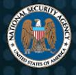

# SANDWORM ACTORS EXPLOITING VULNERABILITY IN EXIM MAIL TRANSFER AGENT

## Summary

Russian cyber actors from the GRU Main Center for Special Technologies (GTSST), field post number 74455, have been exploiting a vulnerability in Exim Mail Transfer Agent (MTA) software since at least August 2019. The cyber actors responsible for this malicious cyber program are known publicly as Sandworm team.

Exim is a commonly used MTA software for Unix® -based systems and comes pre-installed on some Linux distributions such as Debian®2. On 5 June 2019, an update for a critical vulnerability (CVE-2019-10149) in Exim was released. The remote code execution vulnerability was introduced in Exim version 4.87. An unauthenticated remote attacker can send a specially crafted email to execute commands with root privileges allowing the attacker to install programs, modify data, and create new accounts [1]. An advisory was published to the Exim webpage urging users to update to the newest version as older versions are unsupported [2].

The actors exploited victims using Exim software on their public facing MTAs by sending a command in the "MAIL FROM" field of an SMTP (Simple Mail Transfer Protocol) message. Below is a sample, which contains parameters the actor would modify per deployment.

Figure 1: Sample "MAIL FROM" exploitation command

When CVE-2019-10149 is successfully exploited, an actor is able to execute code of their choosing. When Sandworm exploited CVE-2019-10149, the victim machine would subsequently download and execute a shell script from a Sandworm-controlled domain. This script would attempt to do the following on the victim machine:

- add privileged users
- disable network security settings ●
- update SSH configurations to enable additional remote access
- execute an additional script to enable follow-on exploitation

# Mitigation Actions

#### Apply Exim Updates Immediately

Update Exim immediately by installing version 4.93 or newer to mitigate this and other vulnerabilities. Other vulnerabilities exist and are likely to be exploited, so the latest fully patched version should be used [3]. Using a previous version of Exim

1 Unix is a registered trademark of The Open Group.

2 Debian is a registered trademark of Software in the Public Interest, Inc.

leaves a system vulnerable to exploitation. System administrators should continually check software versions and update as new versions become available [4].

Administrators can update Exim Mail Transfer Agent software through their Linux distribution's package manager or by downloading the latest version from 

#### Detect Exploit Attempts and Unauthorized Changes

Additionally, network-based security appliances may be able to detect and/or block CVE-2019-10149 exploit attempts. For example, Snort® rule 1-50356 alerts on exploit attempts by default for registered users of a Snort Intrusion Detection System (IDS) [5]. Administrators are encouraged to review network security devices protecting Exim mail servers both for identifying prior exploitation and for ensuring network-based protection for any unpatched Exim servers. Raw traffic logs can also be queried for emails with a recipient containing "$(run", which would likely indicate a CVE-2019-10149 exploit attempt. Other attack methods exist for non-default configurations and may not be detected using these methods.

Routinely verifying no unauthorized system modifications, such as additional accounts and SSH keys, have occurred can help detect a compromise. To detect these modifications, administrators can use file integrity monitoring software that alerts an administrator or blocks unauthorized changes on the system.

#### Apply Defense-in-Depth Security Strategy

Security principles such as least access models and defense-in-depth should be applied when installing public facing software such as MTAs and can help prevent exploitation attempts from being successful. Network segmentation should be used to separate networks into zones based on roles and requirements. Public facing MTAs should be isolated from sensitive internal resources in a demilitarized zone (DMZ) enclave. When using a DMZ for public Internet facing systems, firewall rules are important to block unexpected traffic from reaching trusted internal resources. In addition, MTAs should only be allowed to send outbound traffic to necessary ports (e.g. 25. 465. 587), and unnecessary destination ports should be blocked. Least access model firewall rules around a DMZ can inhibit attackers from gaining unauthorized access, as unexpected port traffic should be blocked by default.

If an MTA DMZ was configured in a least access model, for example to deny by default MTA initiated outbound traffic destined for port 80/443 on the Internet while only permitting traffic initiated from an MTA to necessary hosts on port 80/443, the actors' method of using CVE-2019-10149 would have been mitigated.

#### Indicators of Compromise (IOC)

Since at least August 2019, the following IP addresses and domains were associated with these attacks from the Sandworm actor:

- 95.216.13.196
- 103.94.157.5
- hostapp.be ●

## Works Cited

- Narang, S. (2019), CVE-2019-10149: Critical Remote Command Execution Vulnerability Discovered in Exim. [Online] Available at: [1]  [Accessed Feb. 12, 2020]
- Exim (2019). CVE-2019-10149 Exim 4.87 to 4.91. [Online] Available at:  [2] [Accessed Feb. 12, 2020]
- NCSC (2019). Advisory: Exim mail server vulnerabilities. [Online] Available at:  advisory [Accessed Feb. 12, 2020]
- NSA (2019). Update and Upgrade Software Immediately. [Online] Available at:  1/0/UPDATE AND UPGRADE SOFTWARE IMMEDIATELY.PDF [Accessed Feb. 12, 2020]
- The Snort Team (2019). Sid 1-50356. [Online] Available at  docs/1-50356 [Accessed Feb. 12, 2020] ાંકા

3 Snort is a registered trademark of Cisco Technology, Inc.

## Disclaimer of Endorsement

The information and opinions contained in this document are provided "as is" and without any warranties or guarantees. Reference herein to any specific commercial products, process, or service by trade name, trademark, manufacturer, or othenwise, does not constitute or imply its endorsement, recommendation, or favoring by the United States Government, and this guidance shall not be used for advertising or product endorsement purposes.

## Contact

Client Requirements / General Cybersecurity Inquiries: Cybersecurity Requirements Center, 410-854-4200, Cybersecurity Requests@nsa.gov Media inquiries / Press Desk: 443-634-0721, MediaRelations@nsa.gov

