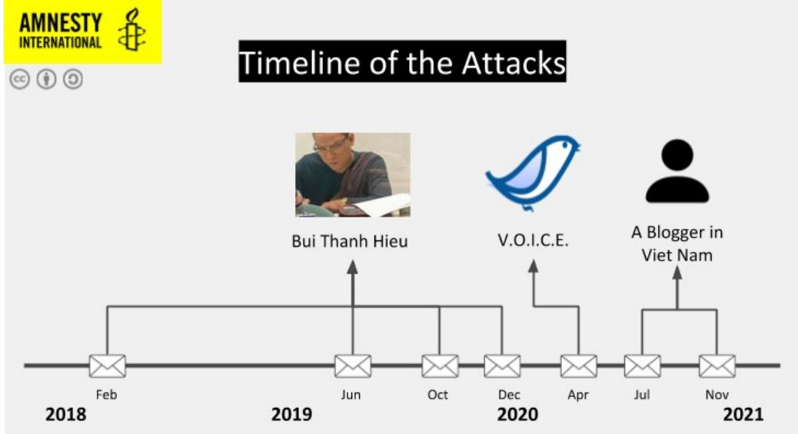
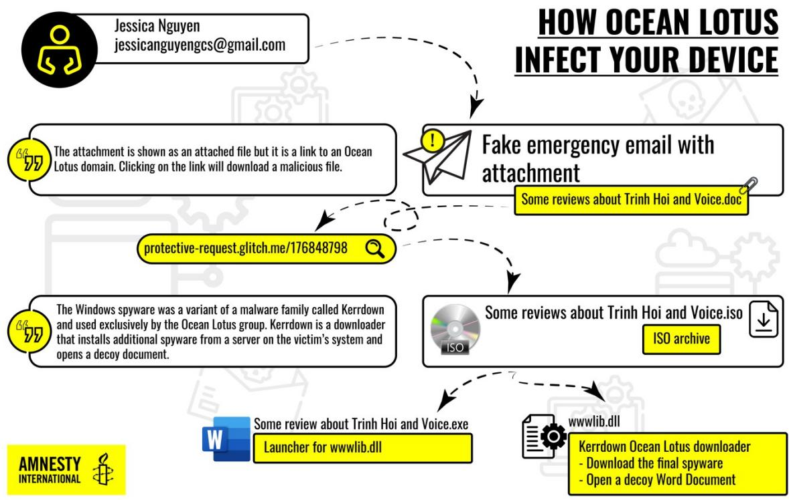

# Click and Bait: Vietnamese Human Rights Defenders Targeted with Spyware Attacks

Under strict embargo until the 24th of February 2021 at 2am CET (8am GMT+7

A new Amnesty International investigation has identified a campaign of spyware attacks targeting Vietnamese human rights defenders (HRDs) from February 2018 to November 2020. Amnesty International's Security Lab attributes these attacks to an attack group known as Ocean Lotus. The group has been active since at least 2014, targeting the private sector and HRDs.

The spyware attacks investigated and identified by the Security Lab are the latest evidence of a crackdown on freedom of expression in Viet Nam and against Vietnamese activists outside the country.

### Viet Nam's History of Online Repression

Human rights are increasingly under attack both offline and online in Viet Nam. Over the past 15 years, repression linked to online activity has intensified, leading to a wave of harassment, intimidation, physical assault, and prosecution.

Amnesty International has documented multiple cases of the arrest and prosecution of HRDs in Viet Nam in retaliation for their online expression since 2006. That year, former prisoner of conscience Truong Quoc Huy was arrested at an internet café in Ho Chi Minh City. Many activists and bloggers have been convicted for "conducting propaganda against the state." Human rights blogger Nguyen Ngoc Nhu Quynh (Mother Mushroom) was sentenced to 10 years in prison in June 2017 on such charges.

Activists and bloggers also face frequent physical assaults by officials or government-connected thugs. Police place activists under house arrest or briefly detain them to prevent them from participating in public events. The government also uses travel bans to prevent activists and HRDs from going abroad and engaging with the international community.

In December 2020, Amnesty International published "Let Us Breathe", a report documenting the widespread criminalization, online harassment and physical attacks faced by activists and bloggers and the rising numbers of individuals detained for peacefully expressing themselves online. Amnesty International also revealed the increasing complicity of tech giants Facebook and Google in the Vietnamese authorities' harsh censorship regime, whereby any expression of peaceful dissent is liable to be blocked or otherwise restricted.

Activists and HRDs are jailed, harassed, attacked, and censored into silence on the basis of vague and sweeping laws that do not comply with international human rights standards. In January 2019, a controversial Law on Cybersecurity came into effect in Viet Nam, granting the government broad powers to limit online freedom, to compel technology companies to hand over vast amounts of data and to censor users' content.

#### What is Ocean Lotus?

The cyber-security industry, comprised of individual and company-based researchers, routinely researches and publishes information about attack groups targeting companies and governments. The industry often gives informal names to groups they continuously track based on each group's unique tactics and tools. Ocean Lotus (also commonly called APT32 or APT-C-00) is one of these groups.

The first known Ocean Lotus attack happened in 2014. It targeted US-based NGO Electronic Frontier Foundation (EFF), the Associated Press international news organization and two Vietnamese activists. This group was named Ocean Lotus in a report from the Chinese company Qihoo 360 in May 2015. In 2017, the American cyber-security company FireEye published a report linking the 2014 EFF and other attacks to this same Ocean Lotus.

Over the years, Ocean Lotus has developed a sophisticated spyware toolkit comprised of several variants of Mac OS spyware, Android spyware and Windows spyware. They also strategically compromise websites in order to identify visitors and conduct further targeting. More recently, Ocean Lotus was found creating fake media websites based on content automatically gathered online.

A significant part of the group's activities is the targeting of HRDs and civil society. In 2017, the cybersecurity company Volexity revealed that over 100 websites were compromised, including many belonging to human rights organizations from Viet Nam, in an attack campaign that they attributed to Ocean Lotus. Numerous other spyware attacks linked to Ocean Lotus against human rights organizations have also been reported, such as the targeting of the Cambodian human rights organization, LICADHO in 2018.

The cyber-security company FireEye describes Ocean Lotus' operations as "aligned with Vietnamese state interests" based on the list of targeted companies and civil society groups they identified. In December 2020, Facebook published a threat report linking Ocean Lotus' activities with a Vietnamese company named CyberOne Group. Although Amnesty International was unable to independently verify any direct connection between Ocean Lotus and CyberOne or with the Vietnamese authorities, the attacks described in this investigation confirm a pattern of targeting Vietnamese individuals and organizations.

### Attacks against HRDs

The investigation conducted by Amnesty International's Security Lab revealed that two HRDs and a nonprofit human rights organization from Viet Nam have been targeted by a coordinated spyware campaign. This spyware allows to fully monitor a compromised system, including reading and writing files, or launching other malicious programs.

Bui Thanh Hieu is a blogger and pro-democracy activist who goes by the name "Nguoi Buon Gio" (The Wind Trader). He writes about social and economic justice and human rights. He is also critical of the Vietnamese government's policies and actions regarding its relations with China, including the dispute over sovereignty in the South China Sea. Due to his writing and activism, the licence for an Internet Café he owned in Ha Noi has been

revoked and he has been repeatedly subjected to reprisals. He was arrested along with activists Pham Doan Trang and Nguyen Ngoc Nhu Quynh in 2009 and was kept in police custody for 10 days for

"abusing democratic freedoms to infringe upon the interests of the State." In January 2013, Bui Thanh Hieu reported on the trial of 14 dissidents in Viet Nam and was arrested and released a few days later. He has since left Viet Nam and has lived in exile in Germany since 2013.

Vietnamese Overseas Initiative for Conscience Empowerment (VOICE) is a nonprofit organization supporting Vietnamese refugees and promoting human rights in Viet Nam. It was established in 1997 in the Filipino capital of Manila as a legal aid office, before formally registering in the United States in 2007. The organization continues to operate out of Manila and has helped 3,000 Vietnamese

refugees resettle in third countries. Since 2011, VOICE has operated an internship programme to equip Vietnamese people with knowledge, skills, and tools to become effective activists. The organization has faced reprisals from Vietnamese authorities several times. Staff at VOICE told Amnesty International that employees and interns have been harassed, banned from travelling, and have had their passports confiscated when they have returned to Viet Nam. Furthermore, state-owned media has run an unsubstantiated smear campaign against VOICE, claiming that the organization is a terrorist group.

A blogger residing in Viet Nam has also been confirmed as an Ocean Lotus target by the Security Lab, but due to security concerns their name has been omitted. They are known to have spoken out publicly about the Dong Tam incident on 9 January 2020, when approximately 3,000 security officers from Ha Noi raided Dong Tam village and killed the 84-year-old village leader Le Dinh Kinh. Three police officers were also killed. The Dong Tam incident sparked a national outcry in Viet Nam. Activists and bloggers were at the forefront of the public debate online, prompting a nationwide crackdown on online expression by the government. VOICE and the two bloggers all received emails containing spyware between February 2018 and November 2020.

These emails pretended to share an important document. They either contained spyware as an attachment or as a link. Once downloaded and launched on the victim's computer, the spyware would then open a decoy document in line with what the email pretended to share to trick the victim in believing the file was benign.

| From Jessica Nguyen <jessicanguyengcs@gmail.com> > | S Reply | «> Reply All v > Forward | More v |
| --- | --- | --- | --- |
| Subiect Some reviews about Trinh Hoi and Voice |  |  | 4/29/20, 3:58 PM |
| To [REDACTED] <> ☆ |  |  |  |

Dear [REDACTED], Some reviews about Trinh Hoi and Voice. Please give your suggestions for this. Thanks and best regard

Some reviews about Trinh Hoi and Voice.doc

#### Screenshot of the email sent to VOICE in April 2020

The spyware identified by the Security Lab were either for Mac OS or Windows systems. The Windows spyware was a variant of a malware family called Kerrdown and used exclusively by the Ocean Lotus group. Kerrdown is a downloader that installs additional spyware from a server on the victim's system and opens a decoy document. In this case, it downloaded Cobalt Strike, a commercial spyware toolkit developed by the American company Strategy Cyber and routinely used to lawfully audit the security of organizations through simulated attacks. It allows an attacker full access to the compromised system including executing scripts, taking screenshots or logging keystrokes. Unlicensed versions of Cobalt Strikes have been increasingly used by attack groups, including Ocean Lotus, over the past three years.

Example of Windows Spyware Infection Chain from one of the emails received

The Mac OS Spyware was a variant of a malware family for Mac OS developed and used exclusively by Ocean Lotus, analysed by Trend Micro in April 2018 and November 2020. It allows the perpetrator to access system information, download, upload or execute files and execute commands.

### Unlawful Surveillance: A Threat to Human Rights

Our investigation was not able to attribute Ocean Lotus' activities to any company or government entity. However, the extensive list of people and organizations targeted by Ocean Lotus over years shows that it has a clear focus on targeting human rights and media groups from Viet Nam and neighbouring countries. This raises questions about whether Ocean Lotus is linked to Vietnamese state actors. The consistent evidence linking Ocean Lotus to Viet Nam should trigger the Vietnamese authorities to undertake an impartial, thorough and independent investigation into the group's unlawful activities and human rights abuses.

The targeting of human rights defenders using digital surveillance technology is unlawful under international human rights law. Unlawful surveillance violates the right to privacy and impinges on the rights to freedom of expression and opinion, of association and of peaceful assembly. Both the Universal Declaration of Human Rights and the International Covenant on Civil and Political Rights protect these rights. The Covenant guarantees the right to hold opinions without interference and the right to free expression (Article 19) and guards against arbitrary and unlawful intrusion of privacy (Article 17). International law and standards also require that any interference by the state on the right to privacy should be lawful, necessary, proportional, and legitimate. States are required to ensure that individuals whose rights have been violated have access to remedy (Article 2(3)). This includes the positive obligation to take appropriate measures to prevent, punish, investigate or redress the harm caused by such acts by private persons or entities.

This targeted surveillance led by Ocean Lotus is part of a broader pattern of censorship and criminalization of online expression in Viet Nam, described in depth in Amnesty International's "Let Us Breathe" report. Along with the censorship of political content involving the complicity of "big tech" companies Google and Facebook and the criminalization of bloggers, it describes the systemic online harassment and abuse of activists. Against this background, these attacks further undermine the ability of HRDs to exercise their rights to freedom of expression, opinion and peaceful assembly. Targeting people solely for peacefully exercising their human rights is unlawful. The Vietnamese government should conduct an independent and transparent investigation on these attacks and ensure that effective legal remedies are provided to people who complain of abuses of their human rights due to surveillance.

### Recommendations

#### To Vietnamese authorities:

- Conduct an independent, impartial, and transparent investigation into the unlawful targeted surveillance of the human rights defenders mentioned in this report, including investigating the attack group Ocean Lotus and determining whether there are links between this spyware campaign and any specific government agencies
- Implement a human rights regulatory framework that governs surveillance. Until such a framework is implemented, a moratorium on the purchase, sale, transfer, and use of surveillance equipment should be enforced.

Addressing unlawful targeted surveillance also requires changes from the Vietnamese authorities. You can find a full list of recommendations in the "Let Us Breathe" report from December 2020.

### How to protect yourself

- Be careful when receiving emails with attachments or links. If you did not expect to receive the email or do not know the sender, do not click on the links in the email or open attached or shared files.
- You should pay particularly close attention to shortened links, especially on social media. Attacks often use these – from Bitly and other shortening services – to trick you into thinking you are clicking a legitimate link, when in fact you are being inadvertently directed to a fake site. When in doubt about the shortened link, here is the guide on how to reveal full URLs
- Be careful when a website or application asks for access to your Google account. If it asks to access your emails ("Read, send, delete and manage your email"), do not accept unless you have full trust in the application getting access to it.
- Enable two-factor authentication (two-step verification) on all your accounts, especially on your email.
- Make sure your operating system and applications are up to date. Avoid using pirated system software and office tools, as serious damage can be caused to your PC by malware and spyware included within the copy of the pirated software you receive.
- Use antivirus software. Macs need this just as much as Windows computers. Make sure Windows Defender (if you are a Windows user), and XProtect (if you are a Mac user) are turned on.
- If you believe you have been targeted with attacks similar to the ones described in this report, please

#### share@amnesty.tech

- You can find more guidelines on how to protect yourself here
## Appendix

contact us at:

Here is the list of emails identified in this investigation:

| Date | Target | Subject | Spyware |
| --- | --- | --- | --- |
| Feb 12, 2018 | Bui Thanh Hieu | Thư mời thuyết trình | Mac OS Spyware |
|  |  | trong HMDC Stuttgart |  |
|  |  | 2018 |  |
| Jun 10, 2019 | Bui Thanh Hieu | Tài liệu quan trọng ! | Mac OS and Windows |
|  |  |  | Spyware |
| Oct 8, 2019 | Bui Thanh Hieu | Danh sách nhân sự dự | Mac OS Spyware |
|  |  | khuyết Đại hội13 Đảng |  |
|  |  | CSNN |  |
| Dec 20, 2019 | Bui Thanh Hieu | Đơn kêu cứu của gia | Mac OS Spyware |
|  |  | đình anh Lê Nam Trà |  |
| Apr 29, 2020 | VOICE | Some reviews about | Windows Spyware |
|  |  | Trinh Hoi and Voice |  |
| Jul 28, 2020 | [REDACTED] | Thanh toán hóa đơn | Windows Spyware |
| Nov 18, 2020 | [REDACTED] | Yêu cầu thanh toán | Windows Spyware |
| Nov 27, 2020 | [REDACTED] | Hỗ trợ truyền thông | Windows Spyware |

For a technical analysis of the spyware used in these attacks, see the technical analysis published on Github.

