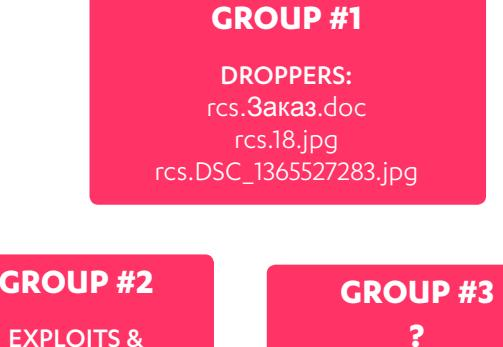
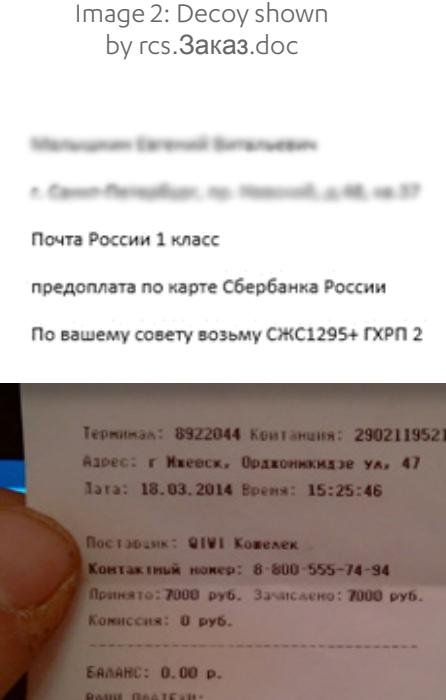
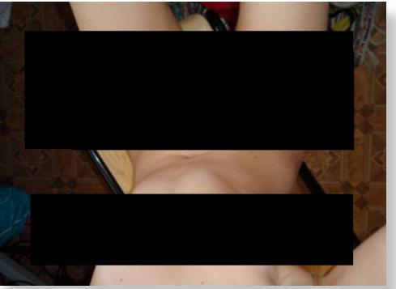
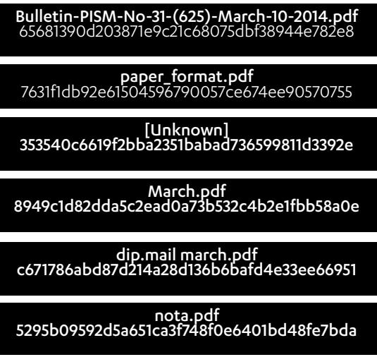
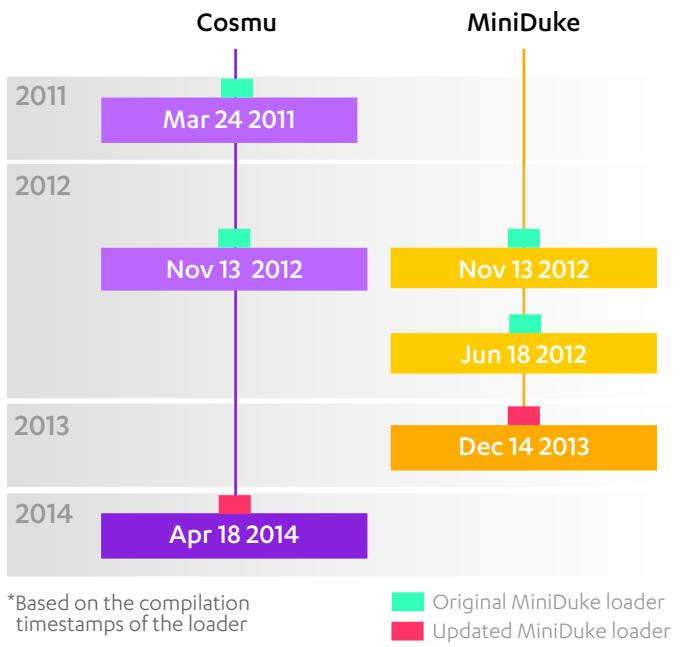
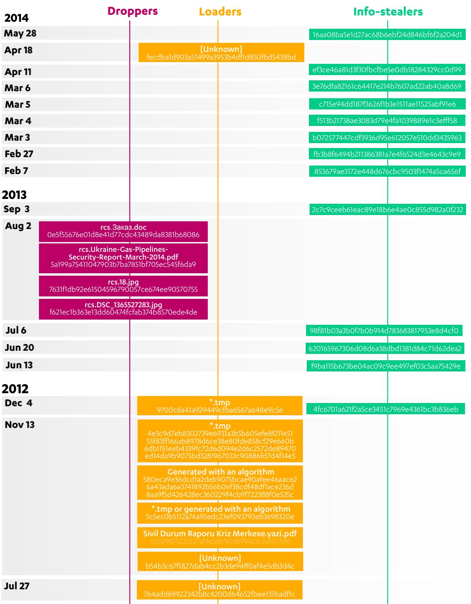
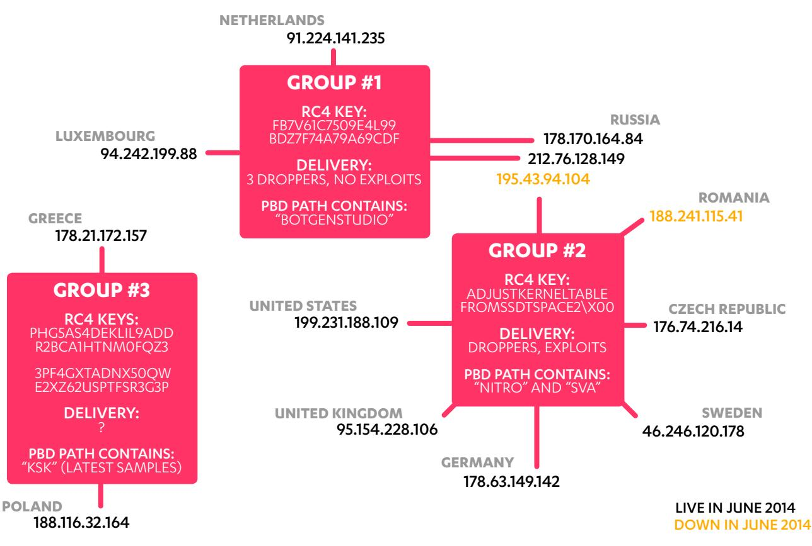
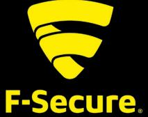

# COSMICDUKE Cosmu with a twist of MiniDuke

# TLP: WHITE

#### CONTENTS

| INTRODUCTION | 2 |
| --- | --- |
| Scope | 2 |
| Target Arrival | ധ N |
| Infection | 3 |
| Data theft | 3 |
| Data transmission | 3 |
| TECHNICAL DETAILS | 4 |
| Dropper: RLO | 4 |
| Dropper: Decoys | 5 |
| Exploit | 6 |
| Loader: MiniDuke 3rd Stage | 6 |
| Main Component: Info-stealer | 7 |
| RC4 Encryption | 9 |
| Samples Comparison | 9 |
| APPENDIX A   SAMPLES | 13 |
| APPENDIX B   SERVERS | 12 |

In this document we report on our analysis of CosmicDuke - the first malware seen to include code from both the notorious MiniDuke APT trojan and another longstanding threat, the informationstealing Cosmu family. When active on an infected machine, CosmicDuke will search for and harvest login details from a range of programs and forward the data to remote servers, some of which were active at the time of writing.

## F-SECURE LABS SECURITY RESPONSE

Malware Analysis Whitepaper


#### FIGURE 1: SIMPLIFIED OVERVIEW OF COSMICDUKE'S CHAIN OF ACTION

# INTRODUCTION

In early 2013, the MiniDuke malware was discovered in use in a series of attacks against NATO and European government agencies. While investigating MiniDuke loaders in April 2014, we were surprised to notice that the malicious executable being decompressed and loaded into memory was very similar to the Cosmu family of information-stealers, which we saw as long ago as 2001. Cosmu is the first malware family we have seen to share code with MiniDuke.

This analysis is focused on those Cosmu samples that share code with MiniDuke. Some of these are older than the oldest publicly documented MiniDuke samples, implying that the shared code might have been originally used by Cosmu, not MiniDuke. For convenience, we decided to name the samples showing this amalgamation of MiniDuke-derived loader and Cosmu-derived payload CosmicDuke.

The filenames and content used in CosmicDuke's attack files to lure victims into opening them contain references to the countries of Ukraine, Poland, Turkey and Russia,either generally in use of language or included detail, or in allusions to events or institutions. The filenames and content chosen seem to be tailored to their tarqet's interests, though at the time of writing, we have no further information on the identity or location of these victims.

CosmicDuke infections start by tricking victims into opening either a PDF file that contains an exploit or a Windows executable whose filename is manipulated to make it look like a document or image file.

Once the victim opens the file, the malware gains persistence on the system and starts collecting information. The data collection components include a keylogger, clipboard stealer, screenshotter, and password stealers for a variety of popular chat, email and web

browsing programs. It also collects information about the files on the system, and has the capability to export cryptographic certificates and the associated private keys.

Once the information has been collected, it is sent out to remote servers via FTP. In addition to stealing information from the system, Cosmu allows the attacker to download and execute other malware on the system.

F-Secure has detections for all the different malicious components used by the Cosmu variants described in this report.

## SCOPE

We have seen dozens of Cosmu samples that share code with MiniDuke. Rather than cover the entire spectrum of samples, the scope of this analysis was intentionally limited to highlighting the most interesting of the recent samples. This includes examining the attack files used to infect targets, the remote servers storing data collected from the victims and the differences between the MiniDuke loaders and Cosmu info-stealers used in the samples.

# TARGET

This analysis is based on examination of files we gathered through our sample collection systems. Based on the nature of the filenames and decoy documents used, and the fact that the MiniDuke loader is known to be used as a part of targeted attacks, we suspect that CosmicDuke may also be used in such operations. At the time of writing, we have not identified any victims ourselves, nor are we aware of any public reports confirming this scenario.

# ARRIVAL

At this time, we have no information on how the CosmicDuke attack files are delivered to the victims, thouqh based on the findings from the analysis, we can make an educated guess.

It is possible that the PDF documents containing exploits were emailed to the targeted users as file attachments. Assuming that the email gateway used by the victims does not include an antivirus solution capable of identifying the exploit, such files would have little impediment to being spread by email.

It is however unlikely that the samples which camouflaged the executable files as image or document files would be distributed in the same way. Regardless of any tricks played with the filenames, the files themselves are Windows executables, and many email solutions today prevent users from opening attached executable files.

# INFECTION

The attackers are using at least two different methods for infecting the systems: exploits and social engineering.

#### DOCUMENT-BASED EXPLOIT

CosmicDuke malware samples that use exploits to qain entry onto a target system (referred to as exploit files in the rest of this document) start with a malicious Flash object embedded into a PDF file. When the file is launched, the object exploits the known CVE-2011-0611 vulnerability in specific versions of Adobe Flash, Reader and Acrobat products.

Unlike the CosmicDuke files geared towards social engineering, the exploit files do not actually display any documents to the user as a form of distraction; the malware simply straightaway exploits the vulnerability.

#### SOCIAL ENGINEERING

Less technically challenging CosmicDuke samples use simple social engineering to trick the user into willingly launching the attack file. Once launched, the file drops the malware onto the system (such files are therefore referred to as droppers in the rest of this documents).

To do so, the malware's executable file is first disquised as an image or document to make it seem innocuous. When launched, a document or image is displayed in order to draw the user's attention away from any background activity. In the meantime, the malware's malicious files are silently installed and executed on the system.

## DATA THEFT

CosmicDuke's primary purpose is to steal information. The different ways it collects information from the infected machine are as follows:

- · Keylogger
- Taking screenshots
- · Stealing data from clipboard
- Stealing files
- · Stealing PKI certificates and associated private keys
- Stealing usernames and passwords from browsers, instant messengers and email clients
- Stealing WLAN passwords
- Stealing Windows password hashes

# DATA TRANSMISSION

The information collected by the malware is automatically uploaded to remote servers via FTP. Our analysis also reveals various details of the remote sites contacted by CosmicDuke, including the login credentials used and the FTP folder structure.

At the time of writing, most of these remote sites are live. A list of the servers CosmicDuke malware connects to is on page 15.

# TECHNICAL DETAILS

CosmicDuke samples can be divided into 3 distinct groups based on similarities between the C&C servers they contact, file characteristics and decoy document used. The full details of how the samples were grouped is listed on page 11; Figure 2 at left provides a quick summary of the grouping as they relate to how CosmicDuke is delivered, and the decoy documents shown.

The first group of samples (Group #1) is spread using 3 dropper files that display specific decoy documents. The second sample group (Group #2) uses both exploit-loaded files and dropper files. The third group (Group #3) is rather an exception, as it does not use the droppers or exploits listed here: for the sake of simplicity. we will exclude considering Group #3's delivery method.

#### FIGURE 2: COSMICDUKE SAMPLES GROUPED BY INFECTION VECTOR



| Name | Type | Size |
| --- | --- | --- |
| rcs.3akas.doc | Screen saver | 396 KB |
| 12 rcs.Ukraine-Gas-Pipelines-Security-Report-March-2014.pdf | Screen saver | 920 KB |
| = rcs.18.jpg | Screen saver | 792 KB |
| rcs.DSC_1365527283.jpg | Screen saver | 420 KB |
| Sivil Durum Raporu Kriz Merkexe.yazi.pdf | Application | 682 KB |

DROPPERS

Image 1: Screenshot of folder containing CosmicDuke dropper files

# DROPPER: RLO

CosmicDuke's author(s) disquised the fact that the malware is an executable file by using the Right-to-Left Override (RLO) feature in Windows to hide the file's correct file extension, .exe or .scr, and replace it with .jpg, .pdf or .doc, in order to make the file appear to be an innocuous document or image.

Image 1 is a screenshot of how the filenames look like in Windows 7. The real file extension for the top four files is .scr, while the real extension for the bottom one is .exe.

Note that the attacker has also carefully changed the icon of the executable to reflect the fake filetype for the first four.

The bottom file is a curious exception, as it does not use a PDF icon as would be expected with a .pdf file extension; instead, it uses an NVIDIA icon, most likely to reflect the fact that the product name of the executable is listed as "NVIDIA Update Components" in the file's version information. This seems to be a common fake product name used in the latest Cosmu samples. Meanwhile, the

filename readily visible to the users is translated from Turkish as "civilian crisis center status report".

The use of RLO is a smart move from the attackers. Why go through the trouble of exploiting anything if you can simply trick the user into double-clicking an executable that looks a lot like a document file?

As the screenshot demonstrates, unchecking "Hide extensions for known filetypes" does not help. The threeletter file extensions seen at the end of the filename is not the real file extension. Even though the information in the Type column is correct, most of the users probably do not even check it.

# DROPPER: DECOYS

CosmicDuke dropper files all display some kind of a decoy document or image to distract the user when the attack file is launched.

The following are the droppers used by Group #1. Here are the filenames of the decoys, as displayed in Windows, and the decoy images or files they show when launched:

- rcs.Заказ.doc - Image 2
- rcs.18.jpg
- Image 3 ● rcs.DSC 1365527283.jpg - Image 4

The decoys are interesting. Заказ means "order" in Russian. Based on the characters СЖС-1295 and ГХРП found in the decov, the document looks like an order for growth hormones. The document contains full delivery address, including the name of the person placing the order.

An interesting detail about the image file of a receipt (Image 3) shown by rcs.18.jpg is that it contains EXIF metadata, including the date when the photo was taken and the model of the mobile phone that was used to take the photo. Part of this EXIF metadata is shown in Image 3a.

The third dropper file we've seen uses the filename 'rcs. Ukraine-Gas-Pipelines-Security-Report-March-2014.pdf', and displays the decoy document shown in Image 6. This particular dropper file is notable in that its info-stealer (SHA1:f513b21738ae3083d79e4fa1039889e1c3efff58) is the same one used by the exploit file named "Bulletin-PISM-No-31-(625)-March-10-2014.pdf".

> Image 3a: EXIF metadata for file from image 3

lmaqe 3:

Decov shown by rcs.18.jpg

Image 6: Decoy document shown by rcs.Ukraine-Gas-Pipelines-Security-Report-March-2014.pdf

| Disrupted Ukraine Gas Pipelines Won't Send ... |  |
| --- | --- |
| Today's Markets |  |
| Today's Markets |  |
| Private Briefing |  |
| DIIA -11.17 (-0.07%) 16.340.08 NASDAO 16.14 (0.37%) 4.323.33 | 0.57 (0.03%) 1,868.20 |
| Why Disrupted Ukraine Gas Pipelines Won't Send Gas |  |
| Prices Skyrocketing |  |
| By TARA CLARKE, Associate Editor, Money Morning |  |
| Oil and gas prices shot up this week on | GET FULL ACCESS TO MONEY MORNING |
| conflict with Russia. | Access exclusive member-only stock charts, premium reports and of |
| Yesterday (Monday), gas futures climbe | financial news stories delivered straight to your inbox - every weekd |
| price for oil rose more than 2%. | Enter your email address below to sign up - it's absolutely free. |
| The market reacted on news over the v | Cancel at any time I How it works |
| terminate its natural gas discounts to UI |  |
| billion heating fuel debt - a scary prospe |  |
| In January 2009, Gazprom shut down it |  |



| ImageWidth | 1552 |
| --- | --- |
| ImageLength | 2592 |
| Bits PerSample | 888 |
| PhotometricInterpretation | 2 |
| Make | HTC |
| Model | HTC HD2 T8585 |
| Orientation | Top left |
| SamplesPerPixel | 3 |
| XResolution | 72.00 |
| YResolution | 72.00 |



Image 4: Decoy shown by rcs.DSC 1365527283.jpg

#### EXPLOIT

The code used by CosmicDuke to exploit the CVE-2011-0611 vulnerability appears to be derived from this proofof-concept code that was made available in early 2011:

#### · 

The samples we analyzed of the exploit-based CosmicDuke variety had the file names and SHA1 values listed in Figure 3 at right (see "Appendix A | Samples" for more details).

Some of these exploit files have interesting filenames, such as "dip.mail march.pdf" and "Bulletin-PISM-No-31-(625)-March-10-2014.pdf". The PISM mentioned in the latter presumably refers to the Polish Institute of International Affairs [1].

## LOADER: MINIDUKE 3RD STAGE

The CosmicDuke samples we analyzed used the same loader as MiniDuke's stage 3 [2] samples, making this the first occasion in which we've seen other malware using this particular loader.

The parallel usage of the loader in the CosmicDuke and MiniDuke families is interesting. The oldest samples we have of this loader that loads Cosmu malware show the compilation date of the loader as March 24 2011, which predates the oldest publicly documented MiniDuke sample (with a recorded loader compilation date of June 18 2012). The earlier use of the loader with a Cosmu payload leads us to suspect the existence of a link between the author(s) of Cosmu and MiniDuke.

The most common compilation date seen for the loaders that load the Cosmu malware is November 13 2012. Perhaps coincidentally, we found one MiniDuke sample (originally reported by CrySys [3]) that also shows the same compilation date. In this case however, the MiniDuke component is actually a downloader; it connects to an IP address in Turkey, and when it receives a response, decrypts and executes it.

Also of interest is that once the MiniDuke loader was updated, we saw CosmicDuke samples take the updated loader into use in mid-April 1 2014, a few months after MiniDuke started using the latest loader in mid-December 2013. It seems possible that the actors behind the two malware families share code and/or tools.

#### FIGURE 3: FILENAMES AND SHA1 VALUES OF COSMICDUKE EXPLOIT FILES



#### FIGURE 4: MILESTONES IN PARALLEL LOADER USE* IN COSMU AND MINIDUKE FAMILIES



1. Polish Institute of International Affairs; 

- 2. CIRCL Computer Incident Response Center Luxembourg; Analysis of a stage 3 Miniduke sample; published 30 May 2013; 
- 3. Laboratory of Cryptography and System Security (CrySyS Lab); MiniDuke: Indicators; published 27 February 2013;  indicators public.pdf

7

# MAIN COMPONENT: INFO-STEALER

The Cosmu info-stealer is the main component of the CosmicDuke malware. The technical description of the info-stealer is based on analysis of the following sample:

#### SHA1: b072577447cdf3936d95e612057e510dd3435963.

#### PERSISTENCE

Cosmu has a couple of different mechanisms for achieving persistence on the system. It creates a scheduled task and installs a Windows service.

The scheduled task is typically named "Watchmon Service". It executes the malware at system startup.

The service typically has name javamtsup, and the display name is "Java(TM) Virtual Machine Support Service". The size of the service binary on disk varies, but typically the real size is 5120 bytes (based on PE headers) and the SHA1 value is 7803f160af428bcfb4b9ea2aba07886f232cde4e.

The service itself is very straightforward: it opens a handle to explorer.exe process, duplicates its process token, reads the path of the actual malware binary from registry (key HKLM\Software\JavaSoft, value Supplement) and starts the malware using the duplicated process token.

Cosmu copies itself with a couple of different filenames to %WINDIR%\system32. The binaries on the disk have a variable length of zero-padding but they are all essentially copies of the original malware binary.

The filenames for both the Cosmu copies and the service binary are generated by randomly taking two items from the following list and concatenating them, resulting in filenames like usbmon.exe, urllsa.exe, and rasdns.exe:

- nt
- inf
- svc
- ras
- pptp
- obj
- net
- host
- lsa
- · cms
- dsp
- sql
- dhcp
- 
- srv • dns
- ip

- mon · pdb
• ms

• cpl

• sys

• fw

- - id
	- wdm
	-
- ui
- schd
- · tapi
- · eng
- cfg • api
- -
- fs · url

## PASSWORD STEALING

The malware targets the following software:

- Instant messaging
	- ◆ Skype

The malware steals Skype login MD5. The attacker can obtain victim's Skype username and password by using a bruteforce or dictionary attack to crack the MD5. The attack was publicly documented in 2006 [4].

- ◆ Google Talk Cosmu decrypts and steals saved credentials from Google Talk.
- ◆ MSN Messenger Cosmu decrypts and steals saved credentials from MSN Messenger.
- · Browsers
	- · Google Chrome

Cosmu steals saved credentials from Google Chrome.

- ♦ Internet Explorer
Cosmu steals autocomplete passwords from IE. It also collects information about visited websites, i.e., browsing history.

· Firefox

Cosmu steals saved credentials and the associated URLs from Firefox. The malware does not decrypt the credentials.

- Email clients
## • Thunderbird

Cosmu steals saved credentials and the associated mail server hostnames from Thunderbird. The malware does not decrypt the credentials.

- ♦ Bat email client
Cosmu steals credentials from Bat email client by parsing account.cfn and decrypting the credentials.

- ♦ Outlook Express
Cosmu steals saved credentials and information about the associated mail server from Outlook Express.

- ◆ Outlook
Cosmu steals saved credentials and information about the associated mail server from Outlook.

- · Google Desktop
Cosmu decrypts and steals saved credentials from Google Desktop.

4. Fabrice Desclaux & Kostya Kortchinsky; Vanilla Skype part 2; published June 17th 2006; 

# • pc • ctf

- wm
	- · win

• env

• lib

• udf

- 
- mar
- 
- 

#### • Others

- Windows credentials
LM and NT hashes, cached domain passwords, LSA secrets.

- ◆ WLAN
Cosmu uses WlanGetProfile to retrieve plain text keys for WLANs.

### CERTIFICATE STEALING

Cosmu exports certificates and, if available, the associated private keys from system store by calling PFXExportCertStoreEx. The malware uses the password "saribas" to encrypt the exported data.

#### TARGETED FILETYPES

Cosmu searches the hard drives and network drives for files that match any of the below patterns:

| ● | *.doc | • *.pdf | · *pass* |
| --- | --- | --- | --- |
| . | *.xps | • *.zip | • *login* |
| ● | *.xls | *.rar | · *admin* |
| ● | *.ppt | • *.docx | • *sifr* |
| ● | *.pps | · *.url | · *sifer* |
| ● | *.wps | *.xlsx | • *vpn |
| ● | *.wpd | · *.pptx | • *.jpg |
| ● | *.ods | • *.ppsx | • *.txt |
| ● | *.odt | • *.pst | • *.lnk |
| • *.lwp |  | • *.ost |  |
| ● | *.jtd | · * * * * |  |

Patterns *sifr* and *sifer* are interesting because they clearly target non-English filenames, given that 'sifr' is the Arabic word for zero (and interestingly enough, also the base word for an encryption cipher in many languages).

Cosmu searches removable drives for a broader set of files – only files whose filename matches any of the following patterns are skipped/ignored:

- *.exe
- *.ndb
- · *.mp3
- *.avi

An interesting detail is that Cosmu skips searching the removable drive if the volume name is "trandescend" (case insensitive comparison).

#### KEY LOGGER

The keylogger is implemented using the GetKeyboardState API. Key logging is skipped if one of the following AV process is running on the system:

- avp.exe
- acs.exe
- outpost.exe
- mcvsescn.exe
- mcods.exe
- navapsvc.exe
- kav.exe
- AvastSvc.exe
- AvastUi.exe
- nod32krn.exe
- nod32.exe
- ekern.exe
- dwengine.exe
- · MsMpEnq.exe
- msseces.exe
- ekrn.exe
- savservice.exe
- · scfservice.exe
- savadminservice.exe

#### SCREENSHOTTER

Cosmu takes screenshots periodically and sends them to the attacker, together with other stolen data.

#### CLIPBOARD STEALER

Cosmu copies the content of the clipboard every 30 seconds and sends those to the attacker together with other stolen data.

#### CONFIGURATION

The configuration can contain the followinq information:

- HTTP server IPs and URL paths
- · FTP server IPs, usernames and passwords
- · WebDav IPs, usernames and passwords
- Filename prefix and file extension for downloaded files
- Filename prefix and file extension for exfiltrated data

In all the configurations we have seen, the servers are specified using IP addresses, not domain names.

The configuration is embedded into the info-stealer. It is compressed using an algorithm similar to but simpler than LZNT-1 [5].

<sup>5.</sup> Microsoft Developer Network; 2.5 LZNT1 Algorithm Details; 

# NETWORK COMMUNICATIONS

The sample makes HTTP GET requests to the server(s) specified in the configuration. The GET request contains the following fields in this order:

- m or mgn
- Auth
- · Session
- DatalD
- · FamilvID
- BranchID
- VolumeID
- · User
- · Query.

The first field, m or mgn, does not have any value.

The value of Auth is the ID of the sample. It is the same 8-character hex digit that can be found in the PDB path, among other places.

The value of Query depends on the request. It is either encoded using URL safe base64, or then the value is a 1792-character string. That string is composed of a 256-character string that is repeated seven times.

The 256-character string is generated by selecting characters randomly from the following 32-character alphabet:

#### abcdefghijklmnopqrstuvwxyz012345

The malware uses the FTP servers and WebDav servers both for exfiltrating the collected data and for updating the malware.

All servers used by the info-stealers listed in "Appendix A | Samples" are listed in "Appendix B | Servers".

# RC4 ENCRYPTION

Cosmu uses RC4 to decrvpt incoming data and encrypt outqoing data. The RC4 routine is not standard RC4, but instead of an intentional customization it seems that the implementation is simply buggy. The mistake is illustrated in Figure 5 that shows a Python re-implementation of the buggy RC4.

All RC4 keys are 32 bytes. Here are the known keys:

- · pHG5AS4deKLil9ADdR2BcA1hTNm0FQz3
- · 3Pf4GxTaDnx50qWe2Xz62uSptFsR3g3P
- AdjustKernelTableFromSSDTSpace2\x00
- FB7V61C7509E4L99BDZ7F74A79A69CDF

Even though only the first 32 bytes are used as the RC4 key, the first two RC4 keys in the above list are followed by

#### FIGURE 5: PYTHON IMPLEMENTATION OF THE BUGGY RC4 ENCRYPTION

```
bytearrav (kev
return output
```
#### an interesting string:

Atruefriendissomeonewhothinksthatyou area qoode qq eventhoughheknowsthatyouareslightlycrackedgroove

"A true friend is someone who thinks that you are a good egg even though he knows that you are slightly cracked" is a Bernard Meltzer quote.

# SAMPLES COMPARISON

A comparison of the compilation times of the samples, and of other similarities observed in the file characteristics, reveals some interesting patterns. For more details, see "Appendix A | Samples".

#### LEGACY CREDENTIALS AND FTP FOLDER STRUCTURE

The oldest Cosmu samples we saw have a compilation timestamp of 2001-09-25. Since it is possible for the compilation timestamp to be manipulated, it may be that the samples are not that old. We have however not seen any samples that would give us reason to suspect that the timestamp has been tampered with.

These old samples do not use the MiniDuke loader and therefore are not discussed in detail in this analysis. They do however show some characteristics that link them to these fresh variants. For example, the credentials and same FTP folder structure used by the old samples have been used on another Cosmu FTP server that is still active.

#### FIGURE 6: TIMELINE OF COMPILATION TIMESTAMPS & FILENAMES FOR COSMICDUKE'S DROPPERS, LOADERS & INFO-STEALERS



#### FIGURE 7: INFO-STEALER GROUPS & C&C SERVERS USED PER GROUP



#### COMPILATION TIMELINE

All droppers were compiled on 2013-08-02. The majority of the loaders were compiled on 2012-11-13, though one was compiled on 2012-12-04 - oddly enough, the same day when one MiniDuke payload reported by BitDefender (6) and Kaspersky [7], (md5: 6bc34809e44c40b61dd29e0a387ee682) was compiled. This was a downloader that connects to an IP address in Turkey. As the server is no longer up however, we were unable to investigate it further.

The compilation timestamps of the info-stealers show more variation. The oldest variant loaded with the MiniDuke loader was compiled on 2012-12-04. Most of the info-stealers were compiled in February and March 2014.

#### INFO-STEALER GROUPING

The info-stealer samples we have analyzed can be also be separated into three distinct groupings based on the following attributes:

- The program database (PDB) path
- · Server address and credentials
- · The loader
- Filenames and decoy content

Full list of the servers contacted by samples in these groupings in available in Appendix B | Servers on page 15.

#### Group #1

All samples in this group have a PDB path on the infected system's C:\ drive that contains the directory "botgenstudio".

6. BitDefender; M. Tivadar, B. Balazs & C.Istrate; A Closer Look at MiniDuke; 

7. Securelist; C. Raiu, I. Soumenkov, K. Baumgartner & V. Kamluk; The MiniDuke Mystery: PDF O-day Government Spy Assembler Ox29A Micro Backdoor; 

- c:\botgenstudio\generations\8f1777b0\bin\Bot.pdb
- c:\botgenstudio\generations\fed14e50\bin\Bot.pdb
- c:\botgenstudio\generations\55ff7700\bin\Bot.pdb

All samples in this group use the same RC4 key:

"FB7V61C7509E4L99BDZ7F74A79A69CDF"

The servers used by this group are exclusive to this group, i.e.. the other sample groups do not use any of the servers group #1 uses. The IP address of the servers used by this group of samples are in Luxembourg, Netherlands, and Russia. See "Appendix B | Servers" for details.

We have seen three different droppers for this sample group. All droppers use the RLO trick.

We have not found any exploits associated to this group of samples.

#### Group #2

All samples in this group have a PDB path that contains directories named "NITRO" and "SVA". The PDB path is always on D:\ drive. Here are some examples:

- D:\production\nitro\sva\generations\809113dd\bin\ Bot.pdb
- D:\SVA\NITRO\PRODUCTION\Generations\805B1D01\ bin\bot.pdb
- D:\PRODUCTION\NITRO\SVA\Generations\8052B6C0\ bin\Bot.pdb
- D:\PRODUCTION\NITRO\SVA\Generations\80B8A0BA\ bin\bot.pdb

All samples except one in this group use PDF files with exploits as an infection vector. The sole exception is sha1:98f81b03a3b0f7b0b914d783683817953e8d4cf0. It does not use an exploit and it does not use a dropper; instead the loader has a filename (Sivil Durum Raporu Kriz Merk?fdp.izay.exe) that uses the same RLO trick used in Group #1 samples.

Another interesting detail for this sample is the PDB path:

d:\sva\nitro\botgenstudio\interface\ generations\80ddfcc1\bin\Bot.pdb

Even though this contains both "SVA" and "NITRO", it also contains "botqenstudio", aqain making it similar to Group #1. One other sample in Group #2 (sha1: fb3b8f6494b211386381a7e4f6524d3e4643c9e9) shows a similar PDB path.

The servers used by this group are exclusive to this group, i.e., the other sample groups do not use any of the servers group #2 uses.

#### Group #3

The most recent CosmicDuke samples all belong to this group. Unlike Groups #1 and #2, no exploits or droppers are known to be associated with Group #3 samples, and the loader filenames do not use the RLO trick. As such, we will not cover Group #3's delivery method further.

Of more interest with Group #3 is that older samples within this groupin show some differences from the latest variants. A few older samples in Group #3 still use the original MiniDuke loader, while most recent ones are using the updated MiniDuke loader.

Another difference is that unlike the older ones, the latest samples use the following PDB path:

- D:\PRODUCTION\NITRO\KSK\Generations\70BCDEA1\ bin\Bot.pdb.
This is quite similar to Group #2, though it seems "SVA" has been replaced by "KSK".

All samples in Group #3 connect to an FTP server at IP 188.116.32.164 using the same username ("adair") and password. This is the only server that the samples with the original MiniDuke loader use.

Meanwhile, the most recent sample in Group #3, which uses the updated loader with t the SHA1 value fecdba1d903a51499a3953b4df1d850fbd5438bd, also connects to another server at IP address 178.21.172.157. The updated loader has PDB path, C:\Projects\NEMESIS\ nemesis-gemina\nemesis\bin\carriers\ezIzma x86 exe. pdb.

# APPENDIX A | SAMPLES

#### Exploit files

| First seen | Filename | SHA1 | Size |
| --- | --- | --- | --- |
| (YYYY-MM-DD) |  |  |  |
| 2013-11-04 |  | 353540c6619f2bba2351babad736599811d3392e | 946124 |
| 2014-03-20 | nota.pdf | 5295b09592d5a651ca3f748f0e6401bd48fe7bda | 917093 |
| 2014-03-14 | dip.mail march.pdf | c671786abd87d214a28d136b6bafd4e33ee66951 | 919914 |
| 2014-03-11 | Bulletin-PISM-No-31-(625)-March-10-2014.pdf | 65681390d203871e9c21c68075dbf38944e782e8 | 917093 |
| 2014-03-05 | March.pdf | 8949c1d82dda5c2ead0a73b532c4b2e1fbb58a0e | 908285 |
| 2013-07-01 | paper format.pdf | 74bc93107b1bbae2d98fca6d819c2f0bbe8c9f8a | 917093 |

#### Droppers

| First seen | Filename | SHA1 | Compiled | Size |
| --- | --- | --- | --- | --- |
| (YYYY-MM-DD) |  |  | (All times in UTC) |  |
| 2014-04-27 | rcs.DSC 1365527283.jpg | f621ec1b363e13dd60474fcfab374b8570ede4de | Fri Aug 2 10:50:12 2013 | 430080 |
| 2014-03-18 | rcs.18.jpg | 7631f1db92e61504596790057ce674ee90570755 | Fri Aug 2 10:50:12 2013 | 811008 |
| 2014-03-13 | rcs.Ukraine-Gas-Pipelines- Security-Report- | 5a199a75411047903b7ba7851bf705ec545f6da9 | Fri Aug 2 10:50:12 2013 | 942080 |
|  | March-2014.pdf |  |  |  |
| 2013-11-11 | rcs.Заказ.doc | 0e5f55676e01d8e41d77cdc43489da8381b68086   Fri Aug 2 10:50:12 2013 |  | 405504 |

#### Loaders

| First seen | Filename | SHA1 | Compiled | Size |
| --- | --- | --- | --- | --- |
| (YYYY-MM-DD) |  |  | (All times in UTC) |  |
| 2013-11-04 | *.tmp | 9700c8a41a929449cfba6567a648e9c5e4a14e70 | Tue Dec 4 14:25:19 2012 | 862720 |
| 2014-06-03 | Unknown | fecdba1d903a51499a3953b4df1d850fbd5438bd | Fri Apr 18 06:53:42 2014 | 738304 |
| 2014-05-26 | Unknown | b54b3c67f1827dab4cc2b3de94ff0af4e5db3d4c | Tue Nov 13 09:52:51 2012 | 792064 |
| 2014-05-23 | Unknown | 764add69922342b8c4200d64652fbee1376adf1c | Fri Jul 27 11:37:20 2012 | 504832 |
| 2014-04-27 | Generated by the dropper | 6a43ada6a3741892b56b0ef38cdf48df1ace236d | Tue Nov 13 09:53:11 2012 | 697856 |
| 2014-03-26 | *.tmp or generated by the | 5c5ec0b5112a74a95edc23ef093792eb3698320e | Tue Nov 13 09:51:48 2012 | 732160 |
|  | dropper |  |  |  |
| 2014-03-20 | *.tmp | 55f83ff166ab8978d6ce38e80fde858cf29e660b | Tue Nov 13 09:53:11 2012 | 697856 |
| 2014-03-18 | Generated by the dropper | 8aa9f5d426428ec360229f4cb9f722388f0e535c | Tue Nov 13 09:53:11 2012 | 697856 |
| 2014-03-14 | *.tmp | 6db1151eeb4339fc72d6d094e2d6c2572de89470 | Tue Nov 13 09:52:51 2012 | 744960 |
| 2014-03-05 | *.tmp | ed14da9b9075bd3281967033c90886fd7d4f14e5 | Tue Nov 13 09:53:11 2012 | 697856 |
| 2013-07-22 | Sivil Durum Raporu Kriz | ccb29875222527af4e58b9dd8994c3c7ef617fd8 | Tue Nov 13 09:53:11 2012 | 697856 |
|  | Merkexe.yazi.pdf |  |  |  |
| 2013-11-14 | Generated by the dropper | 580eca9e36dcd1a2deb9075bcae90afee46aace2 | Tue Nov 13 09:53:11 2012 | 697856 |
| 2013-07-16 | *.tmp | 4e3c9d7eb8302739e6931a3b5b605efe8f211e51 | Tue Nov 13 09:53:11 2012 | 697856 |

# APPENDIX A | SAMPLES (CON'D)

#### Info-stealers

The filenames for all Info-stealer samples are all generated at runtime (see the Persistence section on page 7).

| First seen | SHA1 | Compiled | Size |
| --- | --- | --- | --- |
| (YYYY-MM-DD) |  | (All times in UTC) |  |
| 2013-11-04 | 4fc6701a621f2a5ce3451c7969e4361bc3b836eb | Tue Dec 4 14:13:53 2012 | 352256 |
| 2014-06-03 | 16aa08ba5e1d27ac68b6ebf24d846bf6f2a204d1 | Wed May 28 14:40:02 2014 | 129024 |
| 2014-05-26 | 853679ae3172e448d676cbc9503f1474a5ca656f | Fri Feb 7 10:02:26 2014 | 124416 |
| 2014-05-23 | f9ba115b673be04ac09c9ee497ef03c5aa75429e | Thu Jun 13 14:29:06 2013 | 122880 |
| 2014-04-27 | ef3ce46a81d3f30fbcfbe5e0db18284329cc0d99 | Fri Apr 11 09:38:43 2014 | 212992 |
| 2014-03-20 | fb3b8f6494b211386381a7e4f6524d3e4643c9e9 | Thu Feb 27 07:40:23 2014 | 178688 |
| 2014-03-18 | b072577447cdf3936d95e612057e510dd3435963 | Mon Mar 3 13:07:34 2014 | 208896 |
| 2014-03-14 | 3e76dfa82161c64417e214b7607ad22ab40a8d69 | Thu Mar 6 13:14:26 2014 | 188416 |
| 2014-03-11 | f513b21738ae3083d79e4fa1039889e1c3efff58 | Tue Mar 4 14:37:15 2014 | 173568 |
| 2014-03-05 | c715e94dd187f3626f1b3e1511ae11525abf91e6 | Wed Mar 5 10:30:04 2014 | 183808 |
| 2013-11-11 | 2c7c9ceeb61eac89e18b6e4ae0c855d982a0f232 | Tue Sep 3 13:13:56 2013 | 172032 |
| 2013-07-22 | 98f81b03a3b0f7b0b914d783683817953e8d4cf0 | Sat Jul 6 14:46:59 2013 | 176128 |
| 2013-07-01 | 620165967306d08d6a38dbd1381d84c71d62dea2 | Thu Jun 20 10:09:59 2013 | 388608 |

| IP Address | Sample Group | Country | Protocol | Live in June 2014? |
| --- | --- | --- | --- | --- |
| 178.21.172.157 | 3 | Greece | FTP, HTTP | Yes |
| 188.116.32.164 | 3 | Poland | FTP, HTTP | Yes |
| 176.74.216.14 | 2 | Czech Republic | FTP, HTTP | Yes |
| 178.63.149.142 | 2 | Germany | FTP, HTTP, WebDav | Yes |
| 188.241.115.41 | 2 | Romania | FTP, HTTP, WebDav | No |
| 195.43.94.104 | 2 | Russia | FTP, HTTP | Connection refused |
| 95.154.228.106 | 2 | United Kingdom | FTP, HTTP | Yes |
| 199.231.188.109 | 2 | United States | FTP, HTTP | Yes |
| 46.246.120.178 | 2 | Sweden | FTP, HTTP | Yes |
| 94.242.199.88 | 1 | Luxembourg | FTP, HTTP | Yes |
| 178.170.164.84 | 1 | Russia | FTP, HTTP | Yes |
| 212.76.128.149 | 1 | Russia | FTP, HTTP | Yes |
| 91.224.141.235 | 1 | Netherlands | FTP, HTTP | Yes |

# APPENDIX B | SERVERS

For more information, please contact: viruslab@f-secure.com

For an electronic version of this document, please go to: 



