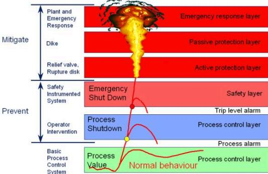
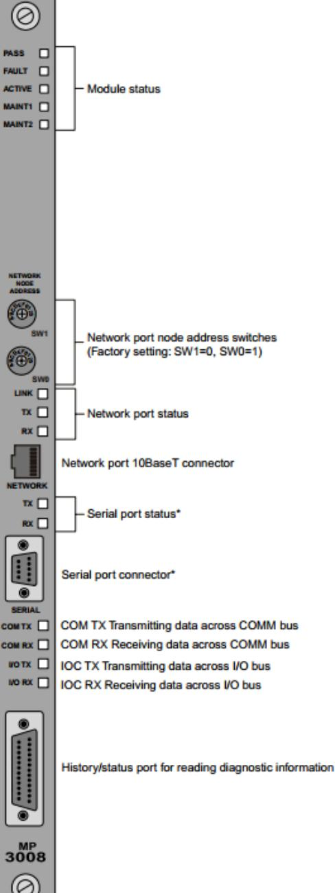
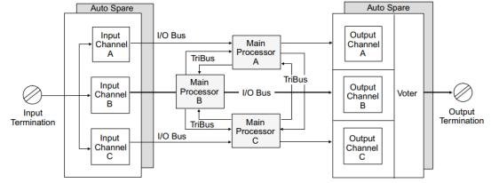
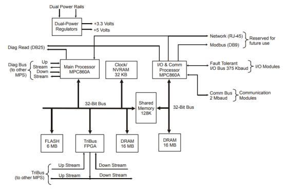
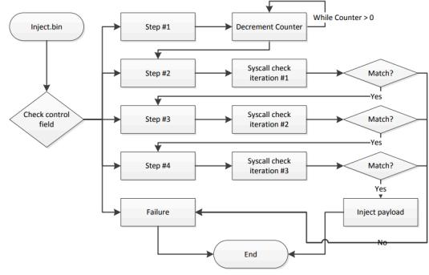
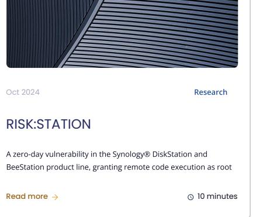

30 Minutes January, 2018 Blog

#### ANALYZING THE TRITON INDUSTRIAL MALWARE


#### Introduction

Last month FireEye released a report detailing an incident that their subsidiary Mandiant responded to at a critical infrastructure organization. Here a malware framework, dubbed TRITON (also referred to as TRISIS or HatMan), was discovered targeting the Schneider Electric Triconex line of industrial safety systems, allegedly in order to cause physical damage and shut down operations. The activity was believed to be consistent with a nation state preparing for an attack. According to a Dragos report on the same malware their team discovered TRITON being deployed against at least one victim in the Middle East in mid-November 2017.

This blog post aims to discuss the incident background, the TRITON framework and the attack payload in an effort to clarify this attack in particular and attacks on industrial safety systems in general. It draws upon previously published reports by FireEye, Dragos and ICS-CERT as well as analysis (which can be found here) by Midnight Blue and Ali Abbasi of the publicly available malware. Further details of the incident and malware are likely to be discussed by others during this week's S4x18 TRITON/TRISIS session

# Summary

 TRITON is the first publicly known example of malware targeting industrial safety controllers, an escalation with serious potential consequences ompared to previous ICS-focussed incidents. It has been deployed against at least one victim in the Middle East with no indications of victims outside of the Middle East so far. TRITON is a framework for implanting Schneider Electric Triconex safety controllers with a passive backdoor through which attackers can, at a later point in time, inject potentially destructive payloads.

Though the potential impact is very serious (including infrastructural damage and loss of life resulting from sabotaging critical safety systems) it is important to nuance the threat posed by the discovery of this malware, especially when the original attacker intent remains speculative. In addition the attack is not very scalable even against other Triconex safety controllers due to the complexity of required industrial process comprehension. However, a sufficiently knowledgeable and well-resourced attacker seeking to target a facility using Triconex controllers as part of its safety systems could repurpose TRITON, thereby lowering the bar somewhat by removing the barrier of reverse-engineering the proprietary TriStation protocol. The incident is illustrative of various woes in the industrial cybersecurity world which have been discussed extensively over the past years, ranging from devices which are 'insecure by design' and have been exposed to hyper-connected environments they were not quite designed for to a lack of basic IT/OT security hygiene and early warning insights on part of asset owners.

### Background

 TRITON is one of the few publicly known examples of malware targeting Industrial Control Systems (ICS), after Stuxnet, Havex, Blackenergy2 and Industroyer, and the first publicly known example of malware targeting industrial safety controllers specifically. Safety Instrumented Systems (SIS) are autonomous control systems tasked with maintaining automated process safe states and are typically used to implement safety logic in critical processes where serious damage or loss of life might be a risk. This is done by, for example, monitoring temperature or pressure via sensor inputs and halting the flow or heating of gases when dangerous thresholds are exceeded. They are usually connected to actuators (eg. for opening or closing a valve) in order to override normal process control and halt the runaway process



Basic industrial safety & protection layers (source

Safety controllers are typically a kind of Proerammable Logic Controller (PLC) designed to high standards with redundant modules and tend to have components that allow for safe failure in case the main processor fails or power is lost. They are deployed in a manner specific to the process environment requirements and are usually configured in one of the IEC 61131-3 programming languages (eg. LD, ST, etc.). Of course, safety is not quite the same as security and safety controllers tend to have the same kind of insecure by design' profile as a regular PLC: ie. everything from hardcoded maintenance backdoor accounts to insecure proprietary protocols

 Traditionally, SIS connectivity is limited and systems are segregated from the rest of the Operational Technology (OT) environment which would limit the potential impact of safety controller security issues. But over the vears, as part of a broader trend in embedded systems in general, this isolation has made way for more and more connectivity and systems integration. While this integration comes with benefits in terms of cost, usability and process insights for business intelligence purposes, the flip side is that it exposes systems that were never designed for secure connectivity in the firs place to the wider OT and IT environments and by extension to whatever the wider network itself is exposed to. The potential implications of a malicious SIS-compromising attacker are serious and could range from shutting down a process to allowing for unsafe states and manipulating other parts of the OT environment to create such a state which might result in financial losses, damage to equipment, products and the environment on human safety and loss of life

But it's important to nuance this image and avoid alarmist headlines. First of all because fear, uncertainty and doubt cause sensible analysis and good advice to be lost amid sensationalism and help create a 'boy who cried wolf effect where the stock that ICS equipment vendors and OT asset owners and operators put in the opinions of the security industry as a whole erodes over time. Secondly, while the initial steps along the "CS Kill Chair', up to and including the compromise of the safety controller, might seem relatively simple, crafting the 'OT poylood' that actually does the damage is typically neither easy nor scalable. As pointed out by Benjamin Green, Marina Krotofil and Ali Abbasi such attacks require a high level of process comprehension which would have to be derived from analysis of acquired documents, diagrams, data historian files, device configurations and network traffic. This would have to be done on a facility-to-facility basis since even attacks against two functionally similar facilities will require attackers to take differences in process scale and design, equipment and device configuration into account.

In the case of SlS that means that a security compromise does not trivially compromise process safety. Apart from the SlS, the facility in question might have safety measures ranging from sacrificial parts in machines, enclosures and blast dampers to alarms and emergency procedures and as such assessing the implications of SIS compromise would require facility-specific process comprehension as well. This does not mean that such worst-case scenarios are infeasible but that the attacker space capable of bringing them about and their scalability are more limited than often portraved

# The Incident

e attacker gained remote access to a Triconex engineering workstation running Microsoft Windows as well as the Distributed Control System (DCS). The attacker deployed a Py2EXE application, which was disguised as a benign Triconex log reviewing application named Trilog exe, containing the TRITON framework on the engineering workstation together with two binary payload files named inject.bin and imain.bin TRITON does not leverage any 0-days but instead reprograms the target safety controllers via the TriStation protocol (discussed below) which lacks authentication (though ACLs could have been configured on the controllers). As the TriStation protocol is proprietary and undocumented this means the attacker had to reverse engineer it, possibly through a combination of using similarties with the documented Triconex System Access Application (TSA4) protocol, inspection of traffic between the engineering workstation and the controller and reverse-engineering of workstation software and controller firmware

The TRITON framework is capable of autodiscovering Triconex controllers on the network by sending a UDP broadcast message over port 1502 but this functionality was not used during the incident. Instead the IP addresses of the target controllers were specified directly and upon connection the status of the controller was retrieved over TriStation. If the controller was running the inject.bin and imain.bin payload files were injected into the controller program memory and a periodic check was initiated to see if any error was detected. If so, TRITON would reset the controller to the previous state ove Tristation and if this failed it would write a dummy program to memory in what was likely an attempt at anti-forensics. During the incident, the industrial process was shutdown as a result of some controllers entering a failed safe state which caused the asset owner to initiate the investigation The cause of this failed safe state was reportedly a failed validation check between the three separate redundant Triconex processor modules.

The fact that both the DCS and SIS systems were compromised suggests the attacker intended to cause serious damage rather than a mere process shutdown. This hypothesis is strengthened (though not indisputably confirmed) by the fact that the attacker apparently made several attempts to deliver a specific control logic to the safety controllers rather than merely shut them down.

### Triconex Safety Instrumented Systems (SIS)

The Schneider Electric Triconex line of safety controllers consists of the Tricon (CX), Trident and Tri-GP systems all of which share the triple modulan redundancy (TMR) architecture. While the incident targeted Tricon 3008 controllers specifically, the heart of the attack is the (ab)use of the unauthenticated TriStation protocol and as such all safety controllers running this protocol are potentially affected.

#### Work with us



* Reserved for future use

 According to the Planning and Installation Guide for Tricon v9~v10 Systems, a basic Tricon controller consists of the Main Processors, I/O modules, communication modules, chassis, field wiring connections and an engineering workstation PC communicating with the controller over TriStation. A chassis houses three Moin Processor (MP) Modules, each of which serve one channel (or 'leg') of the controller and independently executes the control program and communicates with its own I/O subsystem (every I/O module has three independent channels for serving the three MPs) in parallel with the other Main Processors. The three MP modules, which operate autonomously without shared clocks, power regulation or circuity, then compare data and control program at periodic intervals and synchronize with their neighbors over a high-speed proprietary communications bus named 7riBus TriBus consists of three independent serial links. Hardware voting on the I/O data takes place over TriBus among the MPs and if disagreement occurs, the signal in two out of three prevails and the third MP is corrected. Here one-time differences are distinguished from patterns of differences. This Triple Modular Redundant (TMR) architecture is designed for fault tolerance in the face of transient faults or component failures



Figure 2 Triplicated Architecture of the Tricon Controller

 There are a variety of communication modules, talking to the Main Processors over the communication bus, for Triconex controllers to facilitate serial and network communications across a variety of protocols. Examples include the Advanced Communication Module (ACM) which acts as an interface between a Tricon controller and a Foxboro Intelligent Automation (I/A) Series DCS, the Hiwoy Interface Module (HIM) which acts as an interface between a Tricon controller and a Honeywell TDC-3000 control system or the Tricon Communication Module (TCM) which allows communications with TriStation, other Triconex controllers, Modbus master/slave devices and external hosts over Ethernet networks. These communications include the documented Tricon System Access Application (TSAA) protocol, a multi-slave master/slave protocol used to read and write data points, and the undocumented TriStation protocol, a single-slave master/slave protocol used by the TriStation 1131 or MSW engineering workstation software to develop and

Work with us

 The Triconex controllers have a physical four-position ker switch which can be set to either RUW (normal operation, read-only but can be overridden by a GATENB function block in the control program), PROGRAM (allows control program loading and verification), STOP (stop reading inputs, forces non retentive digital and analog outputs to 0, and halts the control program. This position can be overridden by TriStation) or REMOTE (allows writes to control program variables). However, in the incident in question the target controllers were left in PROGRAM mode and the payload injected by TRITON (described below) allows subsequent malicious modifications by means of communications with the implant regardless of key switch position



Architecture of a Model 3008 Main Processor

control program is developed and debugged with the TriStation 1131 / MSW software, downloaded to the controller over the TriStation protocol stored in Flash and then loaded into SRAM or DRAM (denending on the Tricon version) to be executed by the Main Processor module. The control program is translated from one of the IEC 61131-3 languages (LD, FBD, ST) into native PowerPC machine code and interfaces only with the mair processor

 Shortly after the incident was disclosed, the TRITON framework and payloads were found to be publicly available from multiple sources. The payload files (eg, imain.bin) contain PowerPC shellcode and from this we can infer that the target Triconex controllers in the incident seem to have been using the Tricon 3008 Main Processor Modules. Since older Tricon MPs such as the 3006 or 3007 would use the 32-bit Notiond/ Semiconductor 32G/32 and newer ones such as the 3009 use a (reportedly ARM) dual-core 32-bit processor running at 800MHz, the 3008 are the only Tricon MPs (to our knowledge) which use the PowerPC architecture. More specifically they use the 32-bit Freescale PowerQUICC MPC860EN microcontroller, a detail which will be relevant when dissecting the shellcode payloads later on

The Tricon 3008 MP runs the Enhanced Triconex System Executive (ETSX) firmware (stored in flash) which executes the control program on the main processor. On older Tricon MP modules firmware updates had to take place by manually replacing EPROMs made accessible through cutouts in module side panel but on the Tricon 3008 firmware can be upgraded over Ethernet through the port on the front panel. This can be done by connecting the Ethernet port to a workstation PC running the TcxFwm.exe firmware manager. The dedicated Input and Output Control and Communication (IOCCOM) processor (also an MPC860EN) runs its own firmware separate from the ETSX which can be upgraded in the same fashion using the firmware manager

# The TRITON Framework

 lean TRITON framework was built to facilitate interacting with a Tricon controller via the unauthenticated TriStation protocol over Ethernet lt is capable of functionality such as reading and writing control programs and data, running and halting a program and retrieving status information The framework is written in Python and consists of the following components:

- TS_cnames.py. contains named lookup constants for TriStation protocol function and response codes as well as key switch and control program states
- TsHi.pv; the high-level interface of the framework which allows for reading and writing functions and programs as well as retrieving project information and interaction with the implant payload (as described later). Most interestingly, it includes the SofeAppendProgramMod function which fetches the program table, reads programs and functions and appends supplied shellcode to an existing control program. It also handles CRC32 checksums where necessary.
- TsBose.pc acts as a translation laver between the high-level interface and the low-level TriStation function codes and data formatting for functionality such as uploading and downloading of programs or fetching control program status and module versions
- TsLow.py: the lowest layer which implements the functionality to send TriStation packets crafted by the upper layers to the Tricon Communication Module (TCM) over UDP. Also includes auto-discovery of Tricon controllers by sending an UDP 'ping' broadcast message (0x06 0x00 0x00 0x00 0x00 0x88) on port 1502.

Finally, apart from the framework there is a script named script_test.py which uses the framework to connect to a Tricon controller and inject a multi stage payload described later on

### The TriStation Protocol

The TriStation protocol is a typical UDP-based serial-over-ethernet protocol as encountered throughout the world of industrial control systems Request packets consist of a 2-byte function code (FC) followed by a counter ID, length field and request data together with checksums. Responses consist of a response code (RC), length field, response data and checksums

 While we will not exhaustively document the TriStation protocol as reconstructed from the TRITON framework here, the 'heart' of the TRITON attack lies in the following sequence of function codes and expected response codes

- 'Start download change' (FC: 0x01). Expects 'Download change permitted' (RC: 0x66). Arguments are 'fold_name] [version info] [new_name] [program info]`.
- 'Allocate program' (FC: 0x37). Expects 'Allocate program response' (RC: 0x99). Arguments are `[id] [next] [full_chunks] [offset] [len] [data]`) 'End download change' (FC: 0x0B). Expects 'Modification accepted' (RC: 0x67)
- 

Apart from that the following TriStation command is used to communicate with the implant after it has been successfully injected

- 'Get MP status' (FC: 0x1D). Expects 'Get system variables response' (RC: 0x96). Arguments are `[cmd] [mp] [data]
Interestingly, the TriStation Developer's Guide mentions it is possible to restrict access to a Tricon controller from a TriStation PC.Projects themselves can be 'password protected' (though in practice this often comes down to a hashed or even plaintext password stored in the project file which the workstation software checks upon opening the project) and a password can be required for connecting to the controller (which is specified in the project and takes effect after it has been downloaded to the controller). Such a password is not present initially and by default the password is PASSWORD'. Seeing as how the TriStation protocol itself is unencrypted, however, any attacker capable of observing network traffic between the controller and workstation is likely to be able to circumvent such a protection.


The developer's guide also mentions that model 4351A and 4352A TCMs allow for IP-based client access control lists to be specified which regulate access to a resource (ability to perform download change or download all, access to diagnostic information, etc.) at a certain level (deny, read only or read/write). It seems that this functionality could potentially be used to restrict from what IP addresses the TRITON framework could inject its payload or communicate with the implant but the strength of such a workaround would rely on mitieating the ability of the attacker to move laterally among engineering workstations. UDP IP spoofing could also be a problem here

Work with us

# The Payload

The payload used in the incident can be thought of as a four-stage shellcode. The first stage is an argument-setting piece of shellcode. The second stage is formed by inject.bin (which is currently not publicly available) which functions as an implant installer. The third stage is formed by imdin.bin (discussed below) which functions as a backdoor implant capable of receiving and executing the fourth stage. The final stage would have been formed by an actual 'OT poyloɑd' performing the disruptive operations but apparently no such payload was recovered during the incident since the attacker was discovered while preparing the implant. A high-level description of the first two stages can be found in the United States Department of  ICS-CERT report on TRITON/TRISIS/HatMan.

#### Stage 1: Argument-Setter (PresetStatusField)

After connecting to the target controller the script calls PresetStatusField which injects a piece of shellcode using SafeAppendProgramMod. What this shellcode does is iterate through memory from address 0x800000 to 0x800100 (in DRAM) until it finds an address where two 32-bit marker values 0x400000 and 0x600000 reside side-by-side. If it finds this, it writes a value (0x00008001) to offset 0x18 from this address. We reverse-engineered and created a cleaned-up pseudo-c for this shellcode:

```
r2 = 0x800000;
 -
 2
   while (true)
 ന
 4
    {
        if ((uint32_t)*(uint32_t*)(r2) == 0x400000)
 5
 6
        {
            if ((uint32 t)*(uint32 t*)(r2 + 4) == 0x
 7
            {
                 r2 += 0x18; // cp_status.fstat
0
                 *(uint32_t*)(r2) = (uint32_t)value;
10
                 break;
11
12
            }
        }
13
14
        if ((r3 & 0xfffffffff) >= 0x800100)
15
16
        {
17
            break;
        }
18
19
        r2 += 4;
   system call(-1);
```
This shellcode writes the attacker-supplied value into the 'ßtot' field of the Control Progrom (CP) Status structure. This is followed by a TriStation reques for the CP status and a check to see whether the returned value equals the supplied value. The value in question (0x0008001) is used as an argument by the second-stage inject.bin shellcode.

# Stage 2: Implant Installer (inject.bin)

Since inject.bin has not been publicly released, we will limit our discussion here to what has been published by other parties and can be inferred from the publicly available materials. Based on these resources it is our conjecture that inject.bin is an implant installer which relocates the imain.bin implant backdoor to part of the Enhanced Triconex System Executive (ETSX) in order to allow for attacker read/write/execute access to safety controller memory regardless of the Tricon key switch position.

 After the argument-setting shellcode has been injected, inject.bin and imain.bin are injected using SafeAppendProgramMod. It is interesting to note here that imain.bin is sandwiched between two markers (0x1234 and 0x56789A) and length fields. The ICS-CERT report mentions inject.bin assumes the argument written by the first stage payload resides at a static address and uses it as 1) a countdown for the number of cycles to idle 2) a step counter to track and control execution progress and 3) a field for writing debug information upon failure. In this way the attacker can monitor inject.bir




iniect.bin control-flow (source

The inject.bin shellcode has the above flowchart (courtsey of the VCS-CERT report) and seems to be a finite state machine which starts by waiting for number of cycles before issuing a number of system calls and checking their results. If these checks are passed, the imain.bin shellcode is relocated and the function pointer of the 'zet mgin processor digenostic dødr TriStation command is changed to the address of the relocated imain.bin so that it is executed prior to the normal handler

As Reid Wightman noted, inject.bin seems to contain egg-hunter functionality hunting for the 0x1234 and 0x56789A 'eggs' surrounding imain.bin. This is probably due to a lack of control by the TriStation functionality underlying SafeAppendProgramMod in determining where the injected code ends up which would require a piece of GetPC code to determine where inject.bin currently lives and a subsequent egghunt to determine where any other injected code or data lives if one cannot be sure offsets remain static upon injection. After this information is known to inject.bin it can safely relocated imain.bin

#### Stage 3: Backdoor Implant (imain.bin)

The third stage shellcode, imain.bin, is a backdoor implant which allows an attacker to have read/write/execute access to safety controller memor regardless of the Tricon key switch position or any reset of control programs by the engineering workstation. This would allow an attacker to inject and execute a disruptive 'OT payload' at a later moment. It is currently unclear whether the backdoor would persist across a safety controller reboot as it seems to modify the in-memory copies of the control program and firmware rather than their on-flash copies. The FireEve report mentions that the patched the attacker script to allow for in-memory persistence of the payload but this seems unrelated to cross-reboot persistence

lt is executed before the actual handler for the TriStation 'get moin processor diognostic dato' command and looks for a specifically crafted packet body from which it extracts a command value and its arguments. It supports three commands: reading and writing from and to memory as well as executing code at an arbitrary address. It is capable of making non-persistent changes to the running firmware by disabling address translation, writing to it and then flushing the instruction cache and re-enabling address translation

The TRITON framework can communicate with the implant over the aforementioned channel by using the ISHLExolReddRgm(Ex. TsHi.ExplWriteRom(Ex and TsHi.ExplExec functions which utilize the TsBαse.ExecuteExploit function. The latter function send a TriStation 'get main processor diognostic dato command with a crafted packet body of the form:

[command (1 byte)] [MP (1 byte)] [field_0 (4 bytes)] [field_1 (4 bytes)] [field_2 (N bytes)]

We reverse-engineered the imain.bin implant and manually reconstructed the following approximation in pseudo-C

```
1  #define M READ RAM  0x17
 2
   #define M_WRITE_RAM 0x41
   #define M_EXECUTE
 3
                         0xF9
4
   struct arqument struct
ട
   {
6
7
        uint16_t unknown_ui16_00;
        uint8 t unknown ui8 02;
8
0
        uint16_t return_value;
                                     // cmd field
10
        uint8_t cmd;
                                         // mp field
11
        uint8_t mp;
                                      // arqument fi
12
       uint32_t field_0;
        uint32_t field_1;
13
                                      // arqument fi
        uint8_t_ field_3[...];
                                     // arqument fiĸ
14
   };
15
16
   void imain(void)
17 
18
    {
        arq = (struct argument_struct*)get_argument
19
        // Retrieve implant command and MP value
20
        cmd = arg->cmd;
21
        mp = arg->mp;
22
```
70

71 72

73

74

```
compare_mp = *(uint8_t*)(0x199400);  
23
24
    if ((mp == compare_mp) || (mp == 0xFF))
25 
26 
     ー
  
          mp = arg->return_value; 

                        memcpy(&arg->cmd, addrє
42
                        return_value = (size +
43
                    } 
 44
45
                   
                    else
46
                   ー
                        goto main_end;
47
                    }
48 
                
  
49
                 else 
50 
             
51
                 イ
52
                   goto main_end;
                 ﮮ
53
54
         
55 
56 
      // Write N bytes to RAM at address --- ω υαττι αλλ.
57 
58 
        
59 
                 size = arg->field_0; 
60 
61 
                 address = arg->field_1;
                 data = arg->field_3;
62 
63 
64 
               
                 if ((size > 0) && (size == (mp
65 
                 {
                 reenable_address_translati(
66 
67
                    if (address < 0x100000) 
68
                     { 
69
                       reenable_address_transl
                        disable_address_transla
                    ト
                    memcpy(address, &data, sizє
```

| 75 | Work with us |
| --- | --- |
| 76 | if (reenable_address_transl |
| 77 | { |
| 78 | enable_address_translat |
| 79 | } |
| 80 |  |
| 81 | return_value = 0xA; |
| 82 | } |
| 83 | else |
| 84 | ( |
| 85 | goto main_end; |
| 86 | } |
| 87 |  |
| 88 | }break; |
| 89 |  |
| 90 | // Execute function at address X |
| ਰੇ T | case M_EXECUTE: |
| 92 | { |
| ਰੇਤੇ | if (mp >= 0x10) |
| 94 | { |
| 95 | function_ptr = arg->field_{ |
| 96 |  |
| 97 | if (function_ptr < 0x10000( |
| 98 | پ |
| 99 | call(function_ptr); |
| 100 | return_value = 0xA; |
| 101 | } |
| 102 | else |
| 103 | { |
| 104 | goto main end; |
| 105 |  |
| 106 | } |
| 107 | else |
| 108 | ์ |
| 109 | goto main end; |
| 110 | } |
| 111 |  |
| 112 | }break; |
| 113 } |  |
| 114 |  |
| TTE | switch_end: |
| 116 | arg->unknown_ui8_02 = 0x96; |
| 117 | arg->return_value = return_value; |
| 118 | tristation_mp_diagnostic_data_resp( |
| 119 |  |
| 120 } |  |
| 121 |  |
| 122 | // This most likely continues with the actu |
| 123 main_end: |  |
| 124 | jump(0x3A0B0); |
| 125 ﻟﻢ |  |
| 126 |  |

```
127  void disable_address_translation(void)
128 
129     mtpsr eid, r3;
     r4 =  =0x40;
130 
131
132 
133 
134 
135 }
136 
137  void enable_address_translation(void)
138 {{
F3 = 0xC000000; 
 

      mtspr eie, r3; 
147 
     return; 
148 }
149
150  // This most likely retrieves the argument to 1
151  void get argument(void)
152 {
153 = r3 = r31; 154 = r31; 154 
155 }
156
157  // This most likely sends a response to the Tri
158  void tristation mp diagnostic data response(voi
159 
160
162 }
```
#### Stage 4: Missing OT Payload

to affect operations beyond a mere process shutdown (ie the dreaded cyber chusical damage scenario) a fourth stage 'OT navio; s claimed no OT payloa





Sep 2024

Cases

© 0

Work with us

#### Case studies coming Soon

We are currently in the process of writing several case studies regarding experiences and engagements througout our clientele. Check back soon.

Read more →

# Interested in working together?

sales[ ]midnightblue[ ]nl

PGP (0x9035856DF1D41F73)

© 2024 Midnight Blue

All Rights Reserved

We Respect Your Privacy

