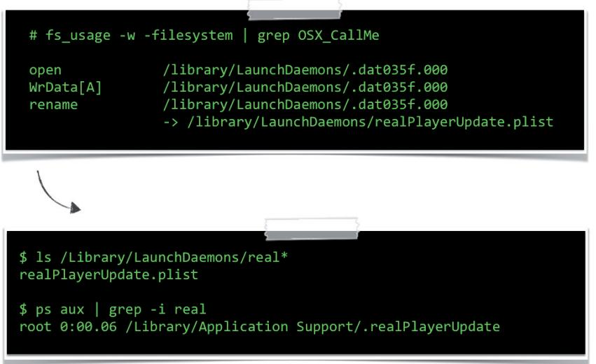

# METHODS OF MALWARE PERSISTENCE ON MAC OS X

Patrick Wardle Synack, USA

Email patrick@synack.com

### ABSTRACT

As Mac OS X continues to increase in popularity, OS X malware (once a rare phenomenon) is now more common than ever. Therefore, it is essential for cybersecurity and malware analysts to possess an in-depth understanding of OS X and how it may be attacked by persistent, malicious code.

This paper presents a detailed analysis of Apple's anti-malware mechanisms (revealing several significant weaknesses), before diving into the bowels of the Mac startup process. Here, points of persistence are detailed comprehensively. Following this, examples of OS X malware are examined to illustrate how code may abuse the OS in order to achieve reboot persistence.

Finally, a novel open-source tool is discussed that can enumerate and display persistent OS X binaries that are set to execute automatically upon reboot. Armed with such a tool, users can ensure that they are protected against both current and future persistent OS X threats.

### BACKGROUND

Before diving into methods of persistence abused by OS X malware, it is important to understand why such a topic is truly relevant.

As is obvious to even the most naïve amongst us, Macs have become more prevalent than ever. According to a recent study by the International Data Corporation (IDC), Apple is now the number three US computer vendor, making up almost 15% of computer sales [1]. Moreover, if 'iDevices' (iPhones, iPads, etc.) are added to the equation, Apple devices

outsold Windows PCs globally in Q4 of 2013 [2].

One of the driving forces behind the increased adoption of Apple computers is the notion that OS X is immune to malware. This claim was propagated by Apple, who claimed '[Mac OS X] doesn't get PC viruses. A Mac isn't susceptible to the thousands of viruses plaguing Windows-based computers' [3].

Ironically, the first personal computer virus discovered in the wild (Elk Cloner), was a Mac virus that infected Apple IIs [4]. Since then, Mac malware has flourished. Just last year, over 30 new OS X malware families were discovered, some infecting the corporate systems of companies such as Apple, Facebook, and Twitter [5, 6].


Figure 1: Mac's growth 2009-2013.

### APPLE'S ANTI-MALWARE ENHANCEMENTS AND THEIR FLAWS

In recent versions of OS X, Apple has introduced a myriad of security enhancements which aim to thwart malware. Examples of these enhancements include: XProtect (Apple's built-in anti-virus solution), Gatekeeper (which verifies downloaded software), sandboxing (which prevents Mac Store applications from accessing OS-level components), and signed-code requirements (where signatures are verified and only signed kernel extensions can be loaded). While these are spun by Apple's marketing team as proactive security measures, in reality they are more reactive and act as an acknowledgement of the OS X malware problem. Moreover, while they are a step in the right direction, many of these security enhancements are trivial to bypass.

#### XProtect

Apple's attempt at an anti-virus product is internally referred to as XProtect. Implemented within the CoreServicesUIAgent, it uses signatures from /System/Library/CoreServices/CoreTypes.bundle/ Contents/Resources/XProtect.plist to detect OS X malware.

Figure 2 shows an entry from the XProtect signature file.

| C |  |  | M |
| --- | --- | --- | --- |
| XProtect.plist |  |  | + |
| ===== XProtect.plist > No Selection |  |  | a |
| Key | Type | Value |  |
| V Root | Array | (38 items) |  |
| Item 0 | Dictionary | (3 items) |  |
| Item 1 | Dictionary | (3 items) |  |
| Item 2 | Dictionary | (3 items) |  |
| V Item 3 | Dictionary | (3 items) |  |
| Description | 90 String | . OSX.LaoShu.A |  |
| T LaunchServices | Dictionary | (1 item) |  |
| LSItemContentType | String | com.apple.application-bundle |  |
| ▼ Matches | Array | (1 item) |  |
| V Item 0 | Dictionary | (3 items) |  |
| Identity | Data | <2e243393 a4e997d5 3d3d8051 6571a64f 10313116> |  |
| ▼ MatchFile | Dictionary | (1 item) |  |
| NSURLNameKey | String | worty |  |
| MatchType | String | Match |  |

Figure 2: XProtect's signature for LaoShu.A.

The highlighted entry in Figure 2 aims to detect the OSX/LaoShu.A malware by matching a SHA1 hash and a filename ('worty'). While the benefit of such an exact match/ detection scheme is zero false positives, there are several major downsides. For one, a slight change in the malware (the renaming of a file, or a recompilation to change the hash), will prevent a match, and thus detection, from being made. The malware will remain undetected and will be able to execute. Another obvious downside to XProtect's signature-based malware detection scheme is that new malware will never be detected.

Besides the weaknesses in the detection scheme used by XProtect, it is plagued by other design issues. In its current implementation, XProtect only scans binaries that contain a quarantine attribute. This attribute is set by the application that downloaded the binary (e.g. a browser), not the OS. This is problematic, as an exploit-based attack that manually downloads malware will, of course, do so without setting the quarantine attribute. As such, these binaries will not be scanned, allowing downloaded malware to execute without fear of detection.

### Gatekeeper

According to Apple, Gatekeeper helps protect Macs from malicious apps that are downloaded and installed from the Internet [6].


Figure 3: Gatekeeper in action.

Contrary to popular belief, Gatekeeper (like XProtect), is fairly limited in the attacks it can prevent. Specifically, it is limited to only preventing attacks where users are coerced into downloading and installing malicious content (e.g. fake Flash installers or 'media plug-ins' ), from infected or rogue websites. This is due to the fact that Gatekeeper will only examine binaries that contain a quarantine attribute. As previously mentioned, this attribute must be set by the downloading application. Thus binaries downloaded as the result of a 'drive-by' exploit-based attack will not be subjected to examination. Interestingly, this is precisely how employees of Apple, Facebook and Twitter were recently infected by malware which 'bypassed OS X Gatekeeper protection' [7].

Another shortcoming is based on the fact that, in its default configuration, Gatekeeper may allow any signed application to execute. Hence if a malware sample is signed with a valid Apple Developer ID (code-signing certificate), it may be able to 'bypass the Gatekeeper security feature' [8].

# Signed applications

Borrowing from iOS, OS X now verifies all binary signatures. This is important as it allows the OS to verify that binaries have not been subverted (e.g. infected by a virus). Binary infection is a powerful technique as it affords an attacker a way to persist, hide, and inherit trust. For example, imagine a malicious piece of code that infects Safari. Every time the user launches Safari, the malicious code is also executed (persistence). Since the malicious code may exist solely within the infected binary, no external malicious files or processes are required (stealth). Finally, as the browser is expected to access network resources, malicious code hosted within its process space should also be able to access the network (inheriting trust), even if a personal firewall is installed.

So what happens if malware infects a signed application or binary? Well, when loading signed binaries (or applications), the OS loader will check the digital signature. Any modifications will invalidate this signature, easily allowing the loader to detect any subversions. By design, the OS loader will then immediately terminate (crash) the modified binary.

| Process: | Safari [1599] |
| --- | --- |
| Path: | /Applications/Safari.app/Contents/MacOS/Safari |
| Crashed Thread: 0 |  |
| Exception Type: | EXC CRASH (Code Signature Invalid) |
| Exception Codes: 0x |  |

Figure 4: OS X loader terminating a modified signed application.

On OS X (unlike iOS), unsigned apps are allowed to execute freely. During the loading process, the OS loader checks whether the binary is signed by looking for an embedded LC_CODE_SIGNATURE block. If it finds one, it verifies the binary's signature. However, research has revealed that if the LC CODE SIGNATURE signature block is removed, the loader performs no verifications, allowing the binary to be modified with no consequences. This is a rather big security issue, as any signed application can be unsigned, then infected with viral code, and will still be allowed to execute.

To illustrate this security weakness, a python script (unsign.py) was created to 'unsign' and infect Apple's signed applications. The script is shown in Figure 5.

#### i.app/Contents/Ma 633d043cf9742d6f0787acdee742

- unsign.py Safari.app/Contents/Ma code signature
- md5 Safari.app/Contents/MacOS, 825edd6a1e3aefa98d7cf99a60ba
- Safari.app/Contents/MacOs
- ns aux grep Safar ਹ ਦੇ ਚੇਰੇ ਰੋ /Applications/Safari.app/Contents/MacOS/Safar patrick

Figure 5: Unsigning (and modifying) an Apple signed application.

As shown in Figure 4, Safari was previously terminated when the OS loader detected a modification. However, as Figure 5 illustrates, once unsigned, Safari, can be modified, and still able to execute without interference or termination.

#### Signed kernel extensions

In order to protect the kernel from malicious code (i.e. rootkits), all kernel extensions (or 'kexts') are required to be signed on OS X Mavericks. An unsigned or modified kext will fail to load. Unfortunately for Apple, it turns out that this anti-malware mechanism is trivial to bypass. The first method of bypassing these code-signing requirements is described in [9]. In a nutshell, the user-mode daemon that loads kernel extensions (kextd) is responsible for verifying the signature. Yes, the signature is verified in user mode - fail! This is clearly a security issue, since it means that an attacker can easily subvert (turn off) the user-mode checks, then load any unsigned kext. As described in [9], this can be accomplished by injecting code into the kextd, then patching out the code-signing checks (in the checkKextSignature() function). For illustrative purposes, this can also be accomplished via a debugger, as shown in Figure 6.

```
# lldb -p <pid of kextd>
(lldb) disassemble -start-address <addr>
       0x10087c0df: 
                           %eax, %ebx
                     mov
       0x10087c0ef:
                     ret
(lldb) memory write -s 2 <addr> 0xc031
(lldb) disassemble -start-address <addr>
       0x10087c0df:
                     xorl
                            %eax, %eax
       0x10087c0ef:
sh-3.2# kextload unsigned.kext
sh-3.2# kextstat | grep -i unsigned
0xffffff7f81bb0000 com.synack.unsigned
```
Figure 6: Patching out kext code-signing requirements.

The publicly described technique requires some pretty low-level hacking (e.g. code injection and in-memory patching). Research performed at the start of the year revealed a non-public, 0-day technique that allowed any unsigned kext to be loaded1. By first stopping the daemon that is responsible for loading kernel extensions (kextd), then attempting to load the unsigned kext with the kextload command, an alternate code path is executed. This code path loads the kext directly into the kernel, bypassing the logic that enforces the kext code-signing requirements.

In the case of computer security, ignorance is not bliss. The various weaknesses in the OS X anti-malware/security mechanisms presented above should be a cause for concern for the ever-growing Mac user base, especially as OS X malware is an ever-growing threat. One way to combat such threats is to gain a thorough understanding of the Mac system startup process, identifying methods of persistence that are abused by

1 This technique (or a slight variation) was later discussed independently at Black Hat Asia by Team T5 [10].

OS X malware. With this information, persistent malware may be detected generically or, ideally, even prevented.

### MAC SYSTEM STARTUP

Before cataloguing methods of persistence abused by OS X malware, it is important to understand what happens when a Mac is powered on.

The boot/startup process is somewhat complex, but can be broken down into easily understandable stages. These stages include power-on/boot, kernel initialization, the execution of launchd daemon, and the LoginWindow process. It should be noted that many of the low-level technical details of the startup process are beyond the scope of this paper. However, interested readers are encouraged to consult [11] for a very comprehensive and thorough discussion of the entire startup process.

Early startup covers everything from power-on, until the kernel (OS X) begins execution. Once power is present, the bootROM takes over. The bootROM, or firmware, is the first code to execute. It verifies memory, begins hardware initialization and selects the OS partition. Once complete, the bootROM executes the boot.efi program. This performs a variety of actions such as initializing the device tree (IO registry), locating and loading the kernel into memory, loading any boot kernel extensions, and finally jumping to the kernel's entry point.

Once the early boot stage is complete, OS X begins its initialization. This starts with the kernel, which is composed of various sub-systems (each of which must be initialized). First, the Mach subsystem is initialized, then IOKit loads all device-specific kexts. Finally, the BSD subsystem initializes, which most notably includes executing launchd, the first user-mode process.

Launchd, as its name suggests, launches all daemons and agents (both of which are somewhat conceptually similar to Windows services). As the first process (pid of 0x1), it is an ancestor of all other processes.

The final step before reaching the desktop is authenticating the user. This is handled by the LoginWindow process, which authenticates the user, sets up their environment, and then hangs around to manage the user's session. Once the user is presented with their desktop, the Mac system startup process is complete.

### METHODS OF PERSISTENCE

A decent understanding of the Mac startup process provides the necessary background for examining the ways in which it may be abused to achieve persistence. Before diving in, recall that persistence is essential for malware, as it ensures that whenever a computer is restarted, the malicious code is automatically re-executed by the OS.

### Low-level/pre-OS X

Starting at the lowest level, there are several options for persistence. While these options are complex, and often hardware specific, they run 'below' (before) the OS, and thus are very difficult to detect. Possible low-level options for persistence may include: re-flashing the firmware, installing a malicious EFI component, or even infecting boot.efi. It should be noted that, due to the complexities of these techniques, each could fill a paper unto themselves. For a more in-depth analysis of low-level methods of persistence, interested readers should consult [12], an intriguing paper on Mac EFI rootkits.

# Kernel extensions

Since code in the kernel runs at the highest privilege level, it is a great place for advanced malware to live. Malware that executes here is often referred to as a rootkit. It is fairly trivial to create a persistent kernel extension that will automatically be executed by the OS whenever the computer is restarted. First, a kext can be created via the 'Generic Kernel Extension' template in XCode, as described in Apple's documentation [13]. It is important to set the kext's match category (in its Info.plist) to 'IOResources.' As described in [11], this is 'a special provider class that provides system-wide resources' and ensures that, once installed, the kext will automatically be started by OS X.

To install a kext persistently, it should be copied into one of the OS X kext directories: /System/Library/Extensions or /Library/ Extensions.

Once copied to an install directory, the kext should be set to be owned by root and, optionally, the kernel cache rebuilt. If these steps are followed, the kext will automatically be loaded each time the OS is (re)loaded.

| # cp -R persist.kext /Library/Extensions |
| --- |
| # chown -R root:wheel /Library/Extensions/persist.kext |
| # kextcache -system-prelinked-kernel |
| # kextcache -system-caches |

Figure 7: Installing a persistent kernel extension.

As mentioned previously, starting with OS X Mavericks, kext extensions must be signed. However, malware may abuse several previously stated methods in order to bypass this requirement.

# Launch daemons/agents

While code that runs in the kernel is very powerful, it is difficult to get right. Running in user mode is far simpler and thus often preferable. Launch daemons and agents are the 'Apple-approved' way to persist non-application binaries (e.g. software updaters, anti-virus products, etc.). Both launch daemons and launch agents are commonly abused by OS X malware as a means to gain persistence. Launch daemons are non-interactive, and run before user login. On the other hand, launch agents run once the user has logged in, and may be interactive. Creating a persistent launched daemon or agent is as simple as creating the binary, then placing a configuration property list in one of the launch daemon or agent directories, as shown in Table 1.

Property lists (or 'plists' in Apple parlance) are xml files that are used by OS X to store serialized objects. In the case of the launch daemons and agents, there is a plist for each daemon or

| Launch daemon (plist) | Launch agent (plist) |
| --- | --- |
| directories | directories |
| /System/Library/ | /System/Library/ |
| LaunchDaemons | LaunchAgents |
| /Library/LaunchDaemons | /Library/LaunchAgents and |
|  | ~/Library/LaunchAgents |

Table 1: Launch daemon/agent plist directories.

agent that contains required configuration information. These files are processed by the OS as part of its initialization process and can contain key value pairs that may instruct the OS to automatically start the daemon or agent. Figure 8 shows a snippet from an example launch daemon/agent configuration plist file. Besides containing the path to the binary image of the daemon or agent (and any program arguments), it also contains a key value pair (RunAtLoad: true), to indicate that it should be started automatically by the OS.

| <dict> |
| --- |
| <key>ProgramArguments</key> |
| <array> |
| <string>/path/to/persist</string> |
| <string>args...</string> |
| </array> |
| <key>RunAtLoad</key> |
| <true/> |
| </dict> |

Figure 8: A launch daemon/agent plist.

# Cron jobs

Containing a large amount of BSD code and logic within its core, OS X presents many 'Unix-y' flavoured persistence mechanisms that may be abused by OS X malware. Cron jobs are an example of exactly this. OS X supports cron jobs, which can be used to execute a command or script at certain intervals. For example, Figure 9 illustrates how a cron job can be created to echo some text each minute. To register the cron job, the command to execute is saved to file, then registered via the crontab command. To confirm the registration of the command, the crontab command is re-executed with the '-l' parameter.


Figure 9: Cron job creation/enumeration.

# Login/logout hooks

By creating a login or logout hook, a script or command can automatically be executed whenever a user logs in or out. Apple states that these hooks are deprecated [14], but they still work

on OS X Mavericks. The 'defaults' command can be used to create such a hook. Simply specify a write action, the com.apple.loginwindow.plist file, and then script or command to persist (see Figure 10).

| # defaults write com.apple.loginwindow LoginHook /usr/bin/hook.sh |  |
| --- | --- |
| / / com. apple. loginwindow.plist |  |
| < ?xml version="1.0" encoding="UTF-8"?> | < ! DOCTYPE plist ... > |
| <plist version="1.0"> | <dict> |
| <key>LoginHook</key> | <string>/usr/bin/hook.sh</string> |
| </dict> | </plist> |

Figure 10: Creation of a login hook

### Login items

For applications, login items are the 'Apple-approved' way to persist. Anything that's registered as a login item is visible in a GUI, via the System Preferences app. Login items are stored in the user's Library/Preferences directory, in a plist file named com.apple.loginitems.plist. This file contains an entry for each login item, which contains the name of the item, whether it should be hidden, and base64-encoded data containing the path to the persistent application. Login items can be created via the GUI, programmatically by utilizing the 'launch services' API, or by directly manipulating the login item's plist (com.apple.loginitems.plist).


Figure 11: Login item: in the GUI and plist.

#### Sandboxed login items

With the introduction of the application sandbox, applications downloaded from the Mac application store can no longer create or register themselves as traditional login items. To maintain compatibility, Apple designed a new way in which sandboxed applications could create login items. In order to register an application persistently in this manner, two applications are required: a main application and a helper. The application to persist (the helper), should be placed into a LoginItems sub-directory of the main application, as shown in Figure 12.


Figure 12: Required layout for a sandboxed login item.

Once executed, the main application should invoke the SMLoginItemSetEnabled() function. This function causes the helper application to persist, and ensures that it will automatically be executed whenever the user logs in.

```
//enable login item
    >use application bundle as identifie
SMLoginItemSetEnabled((
                         bridge CFStringRef)@"com
```
Figure 13: Code to persist a sandboxed login item.

#### Re-opened applications

OS X recently introduced a feature that automatically reopens applications whenever the user (re)logs in. The applications to reopen are stored in a plist within the user's Library/ Preferences/ByHost directory. Viewing the contents of this plist reveals keys such as the ID of the application, whether to hide it,

Figure 14: Plist entry of a re-launched application (terminal.app).

and of course the path to the application. While there is not a (documented) programmatic API to manipulate the re-opened application plist directly, it may be possible to modify it directly in order to gain persistence.

### Startup items

Another deprecated technique that still works on OS X Mavericks is 'startup items'. Apple documentation explains that startup items allow a command or script to automatically be executed during OS X initialization. Creating a startup item involves placing two files into a startup item directory. The first file is a script that is to be executed automatically. The other file must be named 'StartupParameters.plist' and must contain a 'Provides' key that contains the name of the script file. Both of these files should be placed in a sub-directory in either the /System/Library/StartupItems or /Library/StartupItems directory. The name of the sub-directory must be the same as the name of the script file (and the value of the 'Provides' key in the StartupParameters.plist). Figure 15 illustrates the required file-system layout of a startup item.


Figure 15: Directory structure of a startup item.

#### Rc.common

RC scripts are used in another BSD-flavoured persistence technique that works on OS X, allowing scripts or commands to automatically be executed. For example, the rc.common file can be edited to insert arbitrary commands that will automatically execute when OS X starts.


Figure 16: Injecting commands into rc.common.

### Launchd.conf

Recall that launchd is the first user-mode program to execute during OS X's initialization. The launchd.conf file, as its name suggests, contains configuration parameters for launchd. As launchd.conf can contain arbitrary commands (via the bsexec command), malware can inject malicious instructions in order to achieve persistence.

echo bsexec 1 /bin/bash <anything.script> > /etc/launchd.con

Figure 17: Injecting commands into launched.conf.

#### DYLD INSERT LIBRARIES

Via the DYLD_INSERT_LIBRARIES environment variable, OS X provides a way to load arbitrary dynamic libraries ('dylibs') into a process. Specifically, when loading a process, the dynamic loader will examine the DYLD_INSERT_ LIBRARIES variable and load any libraries it specifies. By abusing this technique, an attacker can ensure that a malicious library will persistently be loaded into a targeted process whenever that process is started.

There are two main ways to set the DYLD_INSERT_ LIBRARIES environment variable so that arbitrary libraries will be loaded into a specific (targeted) process. When targeting a launch daemon or agent, an 'EnvironmentVariables' dictionary may be added to launch item's plist. For targeting an application, the application's Info.plist can be altered to contain a 'LSEnvironment' dictionary, see Figure 18.

| $ less /Applications/Safari.app/Contents/Info.plist |
| --- |
| . . . |
| <key>LSEnvironment</key> |
| <dict> |
| <key>DYLD INSERT LIBRARIES</key> |
| <string>/Applications/Safari.app/Contents/evil.dylib</string> |
| </dict> |

Figure 18: The application's Info.plist is altered to contain a 'LSEnvironment' dictionary.

### Mach-O binary infection

Computer viruses are one of the oldest forms of malware. Viruses infect files by injecting viral code in order to replicate. However, this viral code can also provide persistence: any time the infected binary is executed, the virus code will be executed as well. Since OS X binaries (and applications) can be unsigned, viral infection may be back in fashion! There are many ways to infect an OS X (mach-O) binary. The simplest method, described initially by the (in)famous VX'er roy g biv, involves injecting some viral code into a target binary, then hijacking the entry point to point to the virus code.

Figure 19 shows the LC MAIN load command within an uninfected macho-O binary. This load command contains the 'Entry Offset,' or entry point, which may be hijacked during infection (to point to the viral code).

| RVA |  |  |  |  |
| --- | --- | --- | --- | --- |
| V Executable (X86_64) | Offset | Data | Description | Value |
| Mach64 Header | 00000410 | 80000028 | Command | LC_MAIN |
| T Load Commands | 00000414 | 000000018 | Command Size | 24 |
| LC SEGMENT 64 ( PAGEZERO) | 00000418 | 0000000000000F8C | Entry Offset | 3980 |
| LC_SEGMENT_64 ( TEXT) | 00000420 | 000000000000000000 | Stacksize | 9 |
| LC_SEGMENT_64 (_DATA) |  |  |  |  |
| LC SEGMENT_64 ( LINKEDIT) |  |  |  |  |
| LC DALD INFO_ONLY |  |  |  |  |
| LC_SYMTAB |  |  |  |  |
| LC_DYSYMTAB |  |  |  |  |
| LC_LOAD_DYLINKER |  |  |  |  |
| LC_UUID |  |  |  |  |
| LC_VERSION_MIN_MACOSX |  |  |  |  |
| LC SOURCE VERSION |  |  |  |  |
| LC MAIN |  |  |  |  |

Figure 19: Mach-O binary structure/entry offset.

#### Application-specific persistence

The final persistence mechanism covered in this paper is more of a generic class: application-specific persistence. Many applications (such as browsers) support plug-ins, which are generally dynamic libraries that are loaded automatically when the application is run. While plug-ins can legitimately extend the functionality of an application, malware can abuse this functionality to gain persistence. Applications that may be subverted include browsers such as Safari, Firefox and Chrome, or others such as iTunes [15].

It should be noted that sometimes it may be challenging to coerce an application to execute a malicious plug-in (it might load the plug-in, then decide it doesn't like it). However, if the persistent plug-in exports a constructor (see Figure 19), it will automatically be executed (by the OS loader) as soon as it is loaded. Thus, even if the host application rejects the plug-in, it is too late as persistent code execution has already been achieved.

```
#include <syslog.h>
//automatically invoked when loaded
 attribute_((constructor)) void myConstructor()
    //dhg msg
    syslog(LOG_ERR, "loaded in process %d", getpid());
    / / do anything else here!
    return;
}
```
Figure 20: Dynamic library (plug-in) constructor.

#### Rest in peace

While researching methods of malware persistence, several previously functional persistence techniques were found to have either been fully deprecated or removed in OS X

Mavericks. These include modifying environment.plist, modifying com.apple.SystemLoginItems.plist and setting an 'AutoLaunchedApplicationDictionary' within the /Library/ Preferences/loginwindow file.

While these methods of persistence are (or were?) common in older OS X malware samples, they are likely to fade into oblivion as they no longer work on the latest version of OS X.

### PERSISTENT OS X MALWARE

While not all of the methods of persistence presented are (yet) abused by OS X malware, many are. The following section examines several OS X malware samples and reveals their persistence mechanisms.

### OSX/CallMe

A few years ago, somebody (likely the Chinese government), started targeting Tibetan activists with malicious Word documents that attempted to exploit CVE-2009-0563. The payload of these attacks was named OSX/CallMe [16]. This malware was fairly basic, providing the attackers with the ability to execute arbitrary commands on an infected host, as well as exfiltrating the victim's contacts (address book) [17]. In order to persist, CallMe installs itself as an auto launched launch daemon. Specifically, it creates a launch daemon plist, realPlayerUpdate.plist, within the /Library/LaunchDaemons directory that references the malware's binary, .realPlayerUpdate (see Figure 21).

### OSX/Flashback

Flashback shattered the notion that OS X was immune to malware. By exploiting a known, but unpatched Java vulnerability, Flashback was able to automatically infect users as they visited a compromised or malicious website. At its height, it amassed over 600,000 infected hosts, making it the most 'successful' OS X malware to date [18]. Flashback's goal



Figure 21: CallMe's launch daemon persistence.

was simply financial gain – by injecting ads into users' web sessions. To ensure it was (re)executed each time an infected computer was rebooted, it installed itself as a user launch agent (com.java.update.plist, .jupdate). (See Figure 22.)

#### OSX/Crisis

According to online sources, OSX/Crisis is 'an expensive rootkit used by governments' [19]. Delivered via targeted exploits, it provides extensive surveillance capabilities by collecting audio, images, screenshots and keystrokes. Crisis also employs some fairly sophisticated stealth capabilities via a rootkit (kernel) component that can hide processes and files. Figure 23 illustrates some pseudo-disassembly, revealing the malware building a path to a file within the user's launch agent directory. In other words, the disassembly shows the malware preparing to persist as a launch agent.

### OSX/Janicab

Janicab is a somewhat unique OS X malware sample, as it is written in Python (though compiled for distribution). The malware is also signed with an Apple Developer ID, probably in an attempt hide its maliciousness and thwart Gatekeeper. Since it is written in Python, the malware is easy to analyse and uncovering its persistence mechanism is trivial. As may be seen in the malware installer's code, a cron job (set to execute every minute) is created to ensure that the malware is persisted (see Figure 24). It should be noted that once the malware is installed, the crontab -l command easily reveals the malicious cron job.

#### OSX/Kitmos

Kitmos is another OS X malware sample that targets activists. Discovered on an activist's computer during the Oslo Freedom Forum Workshop, Kitmos takes screenshots and uploads them to a remote command and control server [20]. As the disassembly in Figure 25 shows, the malware invokes the LSSharedFileListInsertItemURL() function to add itself as a login item for the current user. Once registered as a login item, the malware will automatically be (re)executed by the OS whenever the user logs in.


Figure 22: Flashback's launch agent persistence.

|  | ; build path for malware's launch agent plist |
| --- | --- |
|  | -[RCSMUtils createLaunchAgentPlist:forBinary: ] |
| call | NSHomeDirectory |
| mov | [esp+0Ch], eax |
| lea | edx, @"Library/LaunchAgents/com.apple.mdworker.plist" |
| mov | [esp+10h], edx |
| lea | edx, "%@/%@" |
| mov | [esp+8], edx |
| mov | esp+4], stringWithFormat message refs |
| mov | [esp], NSString clsRef |
| call | objc msgSend |

Figure 23: Crisis' launch agent persistence.


Figure 24: Janicab's cron job persistence.


Figure 25: Kitmos' login item persistence


Figure 27: Renepo's startup item persistence


Figure 28: MacProtector's login item per

#### OSX/Yontoo

It is fairly common for malware to use social engineering tricks to coerce the user into infecting themselves. Yontoo masquerades as an 'HD video codec' to trick users who visit compromised or malicious websites into installing the malware. The malware creates malicious plug-ins for Safari, Firefox and Chrome. This allows the malware to automatically be executed whenever the user launches their browser. Once loaded into the context of the browser's process content, the plug-ins transmit information about the loaded pages to a remote server as well as injecting ads into the user's browsing session (see Figure 26).

### OSX/Renepo

Renepo is an older OS X malware sample that disables security mechanisms before downloading and executing other 'hacker tools' such as password crackers [21]. Since this malware is a script (which helpfully includes comments), it is easy to understand its installation and persistence logic. As shown in Figure 27, it persists as a startup item.

#### OSX/MacProtector

MacProtector is a fake (or 'rogue') anti-virus product. When a user visits a compromised or malicious website, MacProtector tries to convince the user that their computer is infected and that they should download an application to 'fix' it [22]. Unfortunately, if the user allows the downloaded installer to complete, they become infected with MacProtector. Reverse engineering this malware reveals that it installs itself as a login item. Though this will cause the malware to persist, it will also make it appear in the GUI (as well as in the login item's plist). (See Figure 28.)

#### OSX/Clapzok

The previously discussed OS X malware samples are generally all stand-alone binaries or applications. OSX/Clapzok bucks this trend: it is a classic virus that infects binaries both to spread and to gain persistence [23]. It works by injecting viral code into a binary, then hijacking the entry point. However, since Clapzok infects signed apps (without un-signing them), it will likely

| 000 |  |  | = i206 infected |  |  |
| --- | --- | --- | --- | --- | --- |
| RAW | RVA |  |  | Q |  |
| VExecutable (X86) |  | Offset | Data | Description | Value |
| Mach Header |  | 0000001C | 000000001 | Command | LC SEGMENT |
| ▼ Load Commands |  | 00000020 | 00000038 | Command Size | 56 |
| LC SEGMENT ( PAGEZERO) |  | 00000024 | 5F5F504147455A45524F000 ... | Segment Name | PAGEZERO |
| LC_SEGMENT (_TEXT) |  | 00000034 | 0000000000 | VM Address | 0×0 |
| >LC_SEGMENT ( DATA) |  | 00000038 | 00001000 | VM Size | 4096 |
| >LC SEGMENT ( OBJC) |  | 0000003C | 00005000 | File Offset | 20480 |
| LC_SEGMENT (_LINKEDIT) |  | 00000040 | 00000B3A | File Size | 2874 |
| LC_DALD_INFO_ONLY |  | 00000044 | 00000005 | Maximum VM Protection |  |
| LC SYMTAB |  |  |  | 000000001 | VM_PROT_READ |
| LC_DYSYMTAB |  |  |  | 000000004 | VM_PROT_EXECUTE |
| LC_LOAD_DYLINKER |  | 00000048 | 00000005 | Initial VM Protection |  |
| LC UUID |  |  |  | 000000001 | VM_PROT_READ |
| LC_VERSION_MIN_MACOSX |  |  |  | 000000004 | W_PROT_EXECUTE |
| LC UNIXTHREAD |  | 0000004C | 0000000000 | Number of Sections | 0 |
| LC_LOAD_DYLIB (Foundation) |  | 00000050 | 0000000000 | Flags |  |

Figure 29: Clapzok's mach-O infection persistence [23].

cause major annoyances and, as a result, will be easily discovered (see Figure 29).

### КИОСККИОСК

Research into persistence mechanisms on OS X has revealed many locations within the boot process and OS startup sequence that can be abused by malicious code. As we have shown in this paper, many OS X malware variants exist in the wild that are abusing several of these persistence mechanisms. Although Apple has introduced several anti-malware mitigations, these clearly fall short, as OS X users worldwide continue to be infected.

In order to generically detect persistent OS X malware, a new tool has been created that can enumerate and display persistent OS X binaries. Named KnockKnock, its goal is simple: to tell you who's there! Armed with this tool, users can ensure that they are protected against both current and future OS X threats.

There are many methods of persistence on OS X – and new ones are sure to be found. As such, the open-source, Python-based KnockKnock [24] was designed to use a plug-in-based architecture, where each plug-in can scan for a particular persistence technique. When new persistence techniques are discovered, KnockKnock can easily be extended with new plugins. Luckily, as its core performs most of the work, writing a plug-in is incredibly simple. This is illustrated in the example in Figure 30, which shows the main logic for a plug-in that enumerates all launch daemons that are set to execute automatically as a Mac computer boots up.

As the code snippet in Figure 30 illustrates, it only takes about 10 lines of Python code for this plug-in to enumerate a specific persistence class. (For more details, including a comprehensive plug-in-writing guide, see [24].)

KnockKnock has the ability to display persistent OS X binaries that are set to execute automatically at each boot. Since KnockKnock takes such an unbiased approach, it can generically detect persistent OS X malware today, as well as in the future. It should be noted though, that this approach will also list legitimate binaries. However, as KnockKnock can filter out


Figure 31: KnockKnock Janicab (runner.pyc) detection.

| # python knockknock.py -p launchDandA |
| --- |
| who's there? |
| [ launchDaemons ] |
| realPlayerUpdate |
| path: /Library/Application Support/.realPlayerUpdate |
| hash: 544539ea546e88ff462814ba96afef1a |
| [launchAgents] |
| Little Snitch Agent |
| path: /Library/Little Snitch/Little Snitch Agent.app/ |
| hash: 1a4a575ba98acd455bbb0712abee8df7 |


unmodified Apple-signed binaries, the output is reduced by a factor of roughly 90%, generally leaving a handful of binaries that can quickly be examined and verified manually.

The screenshots in Figures 31 and 32 show KnockKnock revealing various OS X malware infections, including OSX/Janicab (cron job) and OSX/CallMe (launch daemon).

### CONCLUSION

Even in the latest version of Mac OS X, Apple's anti-malware mitigations fall far short, allowing OS X malware to become an ever more pervasive reality. However, by thoroughly

```
#launch daemon directories
LAUNCH DAEMON DIRS = ['/System/Library/LaunchDaemons/', '/Library/LaunchDaemons/']
#init results
results[ 'launchAgents'] = []
#get all files in each launch daemon directory
for directory in LAUNCH DAEMON DIRS:
      launchItems.extend(glob.glob(directory + '*' ))
#iterate over these files (plists)
# ->save the program of those that have 'RunAtLoad' set
for item in launchItems:
      plistData = utils. loadPlist (item)
      if plistData['RunAtLoad']:
            results.append(file.File(plistData['ProgramArguments'][0]))
```
Figure 30: KnockKnock launch daemon plug-in.

understanding the Mac's startup process, points of persistence can be identified, which allow for the generic detection of malware. KnockKnock, an open-source tool, aims to aid in this detection and to ensure that everyday users are protected against both current and future OS X threats.

## REFERENCES

- IDC Worldwide Quarterly PC Tracker, 9 January 2014. [1]  5914.
- [2] Apple passing Microsoft.  benedictevans/2014/2/12/apple-passes-microsoft.
- Apple homepage. 2012.  [3]
- Ször, P. The Art of Computer Virus Research and [4] Defense. Symantec Press. 2005.
- F-Secure Threat Report, H1 2013.  [5] com/static/doc/labs_global/Research/Threat_Report_ H1_2013.pdf.
- OS X: About Gatekeeper.  [୧] ht5290.
- Mac malware that infected Facebook bypassed OS X [7] Gatekeeper protection.  security/2013/03/mac-malware-that-infected-facebookbypassed-os-x-gatekeeper-protection/.
- [8] Researchers find more versions of digitally signed Mac OS X spyware.  article/2039640/researchers-find-more-versions-ofdigitally-signed-mac-os-x-spyware.html.
- Breaking OS X signed kernel extensions with a NOP. [9] 
- [10] You can't see me. 
- [11] Levin, J. Mac OS X and iOS Internals: To the Apple's Core. Wrox. 2012.
- DE MYSTERIIS DOM JOBSIVS Mac EFI Rootkits. [12]  Paper.pdf.
- [13] Creating a Device Driver with Xcode.  apple.com/library/mac/documentation/Darwin/ Conceptual/KEXTConcept/KEXTConceptIOKit/iokit_ tutorial.html#//apple_ref/doc/uid/20002366.
- Customizing Login and Logout.  [14] com/library/mac/documentation/macosx/conceptual/ bpsystemstartup/chapters/CustomLogin.html.
- iTunes Evil Plugin Proof of Concept.  ારી as/2014/02/15/appledoesntgiveafuckaboutsecurityitunes-evil-plugin-proof-of-concept/.
- New Targeted Attack on Tibetan Activists Using OS X ારા Discovered.  new-targeted-attack-on-tibetan-activists-using-os-xdiscovered/.
- [17] New CallMe malware discovered.  thesafemac.com/new-callme-malware-discovered/.
- [18] Kaspersky Lab confirms Flashfake/Flashback botnet infected more than 600,000 Mac OS X Computers.  Kaspersky_Lab_Confirms_Flashfake_Flashback_ Botnet_Infected_more_than_600_000_Mac_OS X Computers Describes Ramifications and Remedies.
- [19] New OSX/Crisis or Business Cards Gone Wild. 
- OSX Kitmos analysis.  [20] osx-kitmos-analysis.html.
- Renepo worm targets Mac OS X users, Sophos reports. [21] 
- [22] Mac Security Threats: How Vulnerable Is Apple?  article/0.8599.2075218.00.html.
- [23] Clapzok.A: reversing the OS X part of a multiplatform PoC infector. 
- [24] KnockKnock. 

