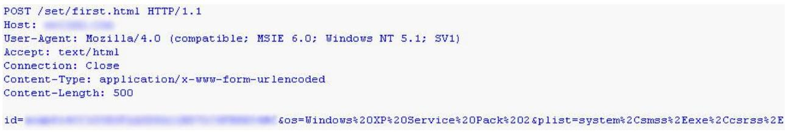
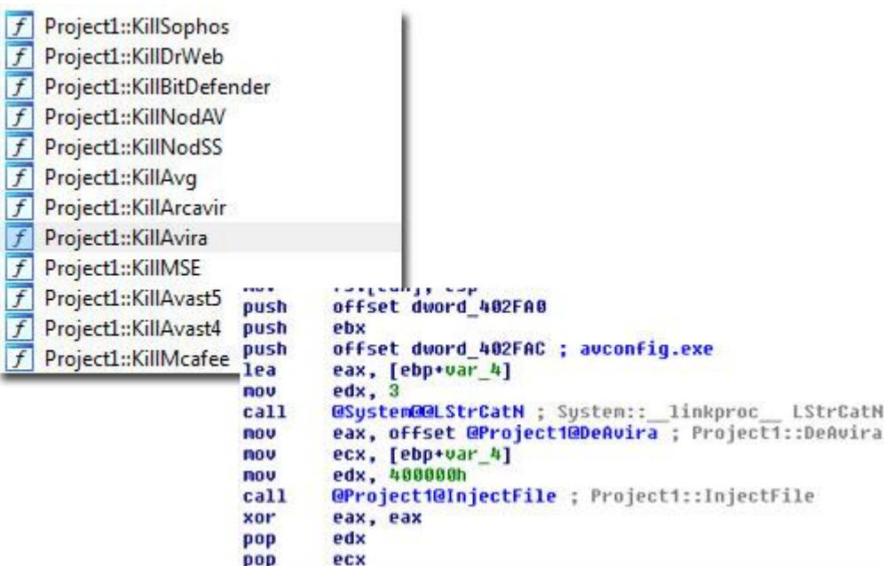

Carberp - a modular information stealing trojan

Marco Giuliani Head of Prevx Advanced Malware Research Team

Andrea Allievi Prevx Malware Analyst

# PREFACE

Nowadays most banking operations and payments are done on the web, through e-banking services and online payment solutions, like MoneyBookers or Paypal. Since online transactions are increasing their volume, malware authors are focusing more and more on the development of malicious software able to steal sensitive data from the infected computers.

Today there are several kits sold online, botnet solutions available to everyone, developed to build up in a couple of minutes a brand new version of a specific Trojan able to hide itself from antivirus scanners and armored by some interesting features like remote control and sensitive data stealing routines.

With an expense of just 700/800 dollars – such kits are not expensive - a potential attacker could gain several thousands of dollars and he could build up his own botnet that can be then sold or rent, or yet used to attack sensitive websites.

The two most infamous botnet kits available online were ZeuS and SpyEye, and we already talked about them in our blog posts here and here.

It looks like that between Q3/Q4 2010 ZeuS author decided to stop the development of his trojan and chose to sell the source code to the authors of SpyEye, giving to it the leadership of info stealing trojans.

We have already analyzed the last variant of SpyEye with ZeuS enhancements here in our Prevx blog.

During the second half of 2010 we have monitored the growth of a new trojans available on the underground market: it is called Carberp.

After some cycles of hard development, today Carberp has probably become the second worst threat to customers data, following SpyEye.

In this paper we are going to analyze this trojan in depth, looking at how it is evolved and what we can expect in the future from the team behind this trojan.


### DROPPER ANALYSIS

This trojan is usually dropped by fake webpages containing exploit codes or spread through social engineering. The file itself changed many times during the last few months.The dropper is crypted by a strong encryption layer. While the encryption itself is not really complicated, a manual analysis approach is not trivial because of several tricks implemented by the developer during the layer development.

By analyzing droppers caught during past few months, we have seen a wide range of tricks implemented in the decryption layer to make the unpacking job a challenge. In some variants the code was totally messed up. Usually this kind of spaghetti code is enough to stop most reversers from manually analyzing the code.

The dropper implements a number of fake API system calls, using invalid parameters. This trick is used to fool antivirus emulators, to stop them from emulating the trojan code. Antivirus emulators usually try to statically or dynamically emulate Windows behavior so that the malicious code can be executed in a controlled environment and it can be checked by the antivirus engine. System emulation is often far from being perfect, and the emulation of system calls doesn't really emulate all possible situations. By implementing several fake API calls with invalid parameters, the trojan tries to stop antivirus emulators from working correctly.

| push | 0 ; wrong API call |
| --- | --- |
| push |  |
| push | 0 0 |
| push |  |
| push | 9 |
| push | 3337h |
| call | ds:RegQueryValueExA |

It tries to call uncommon and more rare Windows APls, those APIs that are sometimes not emulated by antivirus emulators.

Carberp doesn't import API functions by using documented ways. Instead it manually parses system libraries to import needed API addresses. It implements a hashing routine to hide the API names that it's going to import so that it slows down the analysis of the malicious code. Instead of passing the name of the API that needs to be imported, the trojan uses a hash that is calculated from the name of the function. The hashing routine used by the dropper we have analyzed is the one showed in the image below:

| rol | eax, 7 ; eax contains current hash |
| --- | --- |
| xor | al, [esi] ; hash is being xor'd with all the characters in a loop |
| add | esi, 4 |
| nop |  |
| sub | esi, 3 ; esi is moved to the next character |
| cmp | byte ptr [esi], 0 |
| jnz | short hash ; eax contains current hash |

EAX register stores the hash. It is rotated left by 7 on every loop and it is then xor'd with the string character pointed by the ESI index. It is a common technique used by malware. Carberp will use this technique again in the unpacked code – however it will implement a different hashing algorithm.

| 元日本共同第四期四肖 |
| --- |
| ; LPVOID stdcall UirtualAlloc O(LPVOID lpAddress, SIZE T dwSize, DWORD FlAllocationType, DWORD FIProtect) |
| UirtualAlloc dd 697A6AFEh : DATA XREF: .data:004021E110 |
| ; decrypt routine relocated +1A1r ... |
| ; HMODULE stdcall LoadLibraryA 0(LPCSTR lpLibFileName) |
| LoadLibraryA dd DC8AC8026h ; DATA XREF: .data:0040216210 |
| : FARPROC stdcall GetProcAddress 0(HMODULE hModule, LPCSTR lpProcName) |
| GetProcAddress dd 1FC0EAEEh |
| ; BOOL stdcall UnmanUiewOfFile(LPCVOID lpBaseAddress) |
| UnmapUiewOfFile dd 77CD9567h DATA XREF: .data:0040228110 |
| ; decrypt routine relocated+9A1r |
| ; BOOL stdcall VirtualFree(LPUOID IpAddress, SIZE T dwSize, DWORD dwFreeType) |
| UirtualFree dd 3A35705Fh : DATA XREF: .data:0040224810 |
| : decrupt routine relocated+C51r |
| . |

The encryption layer is divided into two parts: the first part tries to fool manual analysis and automated emulators analysis – as described above.

The second part is the actual decryption layer, which is based on mathematical instructions obfuscated by junk code. After the decryption is finished, the real trojan code is executed.


### FIRST STAGE TROJAN EXECUTION

Here we are at the real trojan code. PE static analysis shows that there isn't any import table directory. The trojan manually imports all needed APls by parsing the needed system libraries. This is the technique already used in the decryption loader code, it just changes the hashing algorithm. The new one is showed below:

| mov | eax, [ebp+currHash] |  |
| --- | --- | --- |
| sh1 | eax, 7 |  |
| mou | ecx, [ebp+currHash] |  |
| shr | ecx, 19h | for (index = 0; index < szLen; index++) |
| or | eax, ecx | { |
| mou | [ebp+currHash], eax | tmp = (BYTE)Name[index]; |
| mou | edx, [ebp+currChar] |  |
| mousx | eax, byte ptr [edx] | temp1 = (hash << 0x7)   (hash >> 0x19); |
| XOr | eax, [ebp+currHash] |  |
| mou | [ebp+currHash], eax | hash = temp1; |
| mou | ecx, [ebp+currChar] | temp1 = tmp; |
| add | ecx, 1 | temp1 ^= hash; |
| mou | [ebp+currChar], ecx | hash = temp1; |
| imp | short hash algo | } |

The trojan imports all needed APIs every time they are needed.

Carberp will place itself inside current logged in account startup folder, to make sure it will start at next startup. The used file name is arbitrarily chosen by the attacker during the trojan build up procedure through the Carberp creation kit. It usually uses one of Windows system file names.

To hide itself in the system the trojan will use user mode rootkit techniques. We'll analyze them later in this paper.

Carberp is a fully modular trojan, able to download and execute new plugins from the command and control server. Indeed the trojan already contains two plugins embedded in its code.

Every plugin is encrypted by using another encryption algorithm. This is the reason why the embedded plugins are well hidden from the user.

Carberp plugins have a common file format, which is based on a 14 bytes header followed by the encrypted code. The 14 bytes header contains the encryption key and a string used to identify new downloaded plugins: 'BJB'.

| 00000000: 142 46 42 07 00 00 00 33 33 34 33 37 7E 64   BJB> 3303437,4 |
| --- |
| 0000010: 19 44 40 25 BB 18 6F 56 5E 6C 98 05 FR 60 9B 2E   FDM'5 00 11 (AM. |
| 00000020: 19 EVFP F2 C5 A8 DB 86  7B 5C 57 0A DD 10 13 1E   FOYON "UN \W . + ! . |
| 00000030: E9 A4 AF 82 95 B8 4B B6 B1 8C 87 DA DD A0 83 8E.   é× ■■ K¶±■■UY ■■ |
| 00000040: B9 54 5F 52 25 C8 FB E6 C1 FC F7 EB ED F0 49 EE   ¹T R%ÉûæAü÷ëÍðIÍ |

The encryption algorithm is almost trivial, yet it is quite effective. It is a xor algorithm based on the encryption key and index positions of the involved bytes. The algorithm is showed below:


```
; CODE XREF: decrypt_plugin+70;j
read next byte:
                 mov
                         eax, [ebp+IndexBuf]
                              [ebp+Size] ; decrypted all code?
                 cmp
                         eax.
                 jnb
                         short
                               end
                                          ; start reading first byte of the key
                         [ebp+Index].
                                      9
                 mov
                                          ; CODE XREF: decrypt plugin+651j
loop:
                 mov
                              [ebp+Key]
                         ecx.
                               [ebp+Index]
                 add
                         ecx .
                              bute ntr [ecx]
                 mousx
                         edx.
                                               keu
                 test
                         edx.
                              edx
                         short move next
                                          byte ; key finished, move to next plugin byte
                 iz
                         eax .
                              Tebo+Key]
                 mov
                 add
                         eax.
                               ebp+Index]
                 movsx
                              byte ptr [eax]
                                              ; Get Key Byte
                         ecx.
                               [ebp+IndexBuf]
                 mov
                         edx,
                 imul
                         edx.
                               ebp+Index]
                                             IndexBuf
                                           =
                 add
                         ecx.
                              edx
                                            KeuBute + (IndexBuf * Index)
                 mov
                         eax,
                               Tebp+Buf1
                               [ebp+IndexBuf
                 add
                         eax.
                                                Get Byte at
                         edx,
                              byte ptr [eax]
                 MOUZX
                         edx.
                                          : xor Bute
                 xor
                              ecx
                                                       KeuBute deriu
                               [ebD+Buf]
                 mou
                         eax.
                               [ebp+IndexBuf]
                 add
                         Pax .
                 mou
                         [eax]
                                dl
                                          ; put back the bute
                         ecx,
                 mou
                              [ebp+Index
                 add
                         ecx.
                                            increment Index
                 mov
                         [ebp+Index], ecx
                         short loop
                 imp
                 for (indexBuf = 0; indexBuf < Size; indexBuf++)
                      for (index = 0; index < strlen(key); index++)
                      {
                          derivKey = (BYTE)key[index];
                          tmpVal = indexBuf * index;
                          derivKey += tmpVal;
                          tmpVal = PlugBuf[indexBuf];
                          tmpVal ^= derivKey;
                          PlugBuf | indexBuf | = (BYTE)tmpVal;
```
With the help of the reversed algorithm, we can extract the two embedded plugins and analyze them.

The first plugin is r00f_dll.dll and it is extracted at the trojan startup.

Carberp trojan is a pure user mode trojan, which means it is able to run completely in user mode, even inside limited accounts. It tries to run some specific code in kernel mode, to restore SSDT hooks, if they are present.

r00f_dll.dll's job is executing code in kernel mode to restore original System Service Descriptor Table. It tries to unhook following native APIs:

NtSetContextThread NTGetContextThread NtCreateThread NtOpenThread NtTerminateThread NtQueueApcThread

NtResumeThread NtUnmapViewOfSection NtCreateKey NtSetValueKey NtAllocateVirtualMemory NtWriteVirtualMemory

NtProtectVirtualMemory NtAdjustPrivilegesToken NtOpenProcess NtTerminateProcess


This technique would allow the Trojan to evade from security software that monitor the system by hooking the above kernel functions.

The trojan maps the original kernel file in memory and gets original kernel pointers, then it prepares the code to be executed in kernel mode. Here the plugin tries to use two different methods to execute code in kernel mode.

First attempt is done by using an old Windows vulnerability - MS08-025 - already patched by Microsoft. If the system has not been patched, the vulnerability allows the trojan to gain system privileges and run code in ring0.

If the exploit has been patched, the trojan tries to get debug privileges by calling RtlAdjustPrivilege and then tries to write inside the kernel memory by invoking ZwSystemDebugControl API with SysDbgWriteVirtualMemory parameter.

These attacks are executed only on Windows 2000, Windows XP and Windows 2003 operating systems. If the trojan is running in a limited account and the system is fully patched, these attacks won't go succeed.

The second embedded plugin, screens dll.dll, is used to capture display screenshots.

After the r00f plugin has been executed, Carberp starts its infection routine. To better hide its behavior, Carberp does not execute its payload from its process, but instead it spawns a new explorer.exe process in a suspended state. This process will host the malicious code.

After the explorer.exe process has been created, Carberp creates a new section object and maps itself inside this newly created section. Then, this section is mapped into the explorer.exe process through a call to ZwMapViewOfSection.

| text:0040529F | push | 40h : Protect |
| --- | --- | --- |
| text:004052A1 | push | S : AllocationType |
| text:004052A3 | push | 1 ; InheritDisposition |
| text:004052A5 | lea | ecx, [ebp+UiewSize] |
| text:004052A8 | push | ecx : UiewSize |
| text:004052A9 | push | ર : SectionOffset |
| text:004052AB | mov | edx, [ebp+var 8] |
| text:004052AE | push | edx : CommitSize |
| text:004052AF | push | ર ; ZeroBits |
| text:004052B1 | lea | eax, [ebp+SectionBase] |
| text:004052B4 | push | eax : BaseAddress |
| text:004052B5 | push | OFFFFFFFFFFFF ; ProcessHandle |
| text:004052B7 | mov | ecx, [ebp+SectHandle] |
| text:004052BA | push | ecx ; SectionHandle |
| text:004052BB | call | CallZwMapUiewOfSection |
| text:004052C0 | add | esp, 28h |
| text:004052C3 | test | eax, eax |
| text:004052C5 | inz | Cleanup |
| text:004052CB | mov | edx, [ebp+MyNtHdr] |
| text:004052CE | mov | eax, [edx+50h] ; eax = SizeOfImage |
| text:004052D1 | push | eax ; DataLen |
| text:00405202 | mov | ecx, [ebp+OrgData] |
| text:004052D5 | push | ecx ; OrgData |
| text:004052D6 | mov | edx. [ebp+SectionBase] |
| text:004052D9 | push | edx ; SectionBase |
| text:004052DA | call | CopyDataToSection |
| text:004052DF | add | esp, OCh |
| text:004052E2 | mov | [ebp+pBaseAddress], 0 |
| text:004052E9 | push | 4 0h : Protect |

The malicious code has been injected inside the explorer.exe process. To start it, Carberp has been observed using two different techniques. The first technique is hijacking explorer.exe entry point in memory, patching it with a PUSH/RET instruction to redirect the flow code to the injected malicious code.


#### Original Entrypoint

| E8 00 00 00 00 | call 0x1005f0f |
| --- | --- |
| 5D | DOD ebp |
| 6A 01 | push 0x1 |
| 83 C5 17 | add ebp, 0x17 |
| 55 | push ebp |
| FF 55 F8 | call [ebp-0x8] |
|  | Hijacked Entrypoint |
| 68 F0 89 09 00 | push 0x989f0 |
| C3 | ret |
| 6A 01 | push 0x1 |
| 83 C5 17 | add ebp, 0x17 |

The second technique used is queuing an APC routine to the main explorer.exe thread by calling ZwQueueApcThread. Then both techniques start the suspended explorer.exe process by calling ZwResumeThread.

The original Carberp dropper terminates, it is now running inside its child explorer.exe. It will then inject its code inside the original system's explorer.exe process through a CreateRemoteThread call. To find out the original explorer.exe process, the trojan looks for the Shell TrayWnd class name.

The trojan creates a new instance of svchost.exe process, where it will inject the code able to communicate with the command and control server.

### USER MODE HOOKS

Carberp acts as an information stealing trojan and a user mode rootkit. To hide itself inside the system, it'll inject a copy of itself in every running process and it will hook ntdll.dll NtQueryDirectoryFile API. By hooking this system function, the trojan is able to hide its file from the user.

From a technical perspective, the hook replaces the standard SystemCallStub address with its own routine:

#### Original ZwQueryDirectoryFile

| ntdll   ZwQueryDirectoryFile: |  |  |
| --- | --- | --- |
| 7c91d76e b891000000 | mov | eax . 91h |
| 7c91d773 ba0003fe7f | mov | edx, offset SharedUserData! SystemCallStub |
| 7c91d778 ff12 | cal. | dword ptr [edx] |
| 7c91d77a c22c00 | ret | 2Ch |
| 7c91d77d 90 | nop |  |

#### Hijacked ZwQueryDirectoryFile

| ntdll!ZwQueryDirectoryFile: |  |  |
| --- | --- | --- |
| 7c91d76e b891000000 | MOV | eax 91h |
| 7c91d773 bad099de01 | mov | edx , 1DE99D0h |
| 7c91d778 ff12 | call | dword ptr [edx] |
| 7c91d77a c22c00 | ret | 2Ch |
| 7c91d77d 90 | nop |  |

The call dword ptr [edx] instruction will invoke the trojan routine, able to filter out the trojan file from file enumeration.

While this technique is easy to be bypassed in several ways – direct sysenter call, direct file opening, unhooking – it is actually quite effective and it does its job.


The trojan hooks ntdll.dll NtResumeThread in the same way.

Carberp uses a a Man-In-The-Browser approach to steal information data. It hooks following APIs:

| HttpSendRequestA | InternetWriteFile |
| --- | --- |
| HttpSendRequestW | InternetReadFileExA |
| HttpSendRequestExA | InternetReadFileExW |
| HttpSendRequestExW | InternetQueryDataAvailable |
| InternetReadFile | InternetCloseHandle |

CreateFileW TranslateMessage

InternetWriteFile, TransloteMessage and CreateFileW hooks are set on the fly if one of the following strings are found in the URL:

*cyberplat* */ibc/* *bsi.dll*

Previous variants of the trojan hooked only HttpSendRequestA/W and HttpSendRequestExA/ExW APls – still TranslateMessage and CreateFileW were set on the fly. Moreover those previous versions tried to steal information data only if *cyberplat* or *bsi.dll* strings were found in the URL. Current Carberp releases upload every relevant data to the collector server, with particular attention to the strings listed above.

There isn't any watchdog thread monitoring the presence of the malware hooks, so a trivial code restore can help in fixing the malware.

| 77197687 | ab |  |  |
| --- | --- | --- | --- |
| 1270155 | -E9 A367FB88 | JMP 0014DE60 | HttpSendRequestA hijacked |
| 771976BD | 6H 13 | and and on the 1 and 1 and 1 all one |  |
| 771976BF | CH NO | PUSH 0 |  |
| 77197601 | FF75 18 | PUSH DWORD PTR SS: [EBP+18] |  |
| 771976C4 FF75 14 |  | PUSH DWORD PTR SS: [EBP+14] |  |
| 771976C7 | FF75 10 | PUSH DWORD PTR SS: [EBP+10] |  |
| 771976CH | FF75 MC | PUSH DWORD PTR SS: [EBP+C] |  |
| 771976CDI FF75 08 |  | PUSH DWORD PTR SS: [EBP+8] |  |
| 77197600 E8 4C69FFFF |  | CHLL WININET.7718E0S1 |  |

### COMMUNICATION

Carberp is not just an information stealing trojan, it is a remote controlled malware that turns the infected PC in a zombie. Carberp can communicate with a list of servers, usually embedded inside the binary.

In previous variants of the trojan, those servers were not encrypted, and they could be read in plain text.

| ord: %s .. Path: %s .. | Information.txt screen.jpeg luckystraki.org setrakim |
| --- | --- |
| aki.com 188.229.90.134 PROCESSOR IDENTIFIER | 20 17599 A BENTELL COLLEGI COL |
| %d%d %d %d % d % d % d ARRING A BULLE BUND STATE | %5 %5 %5 % %0 |
| 2X RSDSi : P2 c 00C = = u0 3 B . d | H:\carberp\lastwork\carberp\Release\carberp.p |
| db |  |

More updated variants of Carberp encrypt them with a trivial xor-based encryption algor

| v Fpw (h q fm+fjh |
| --- |
| v fpw (h q fm+fjh |
| Fih |
| 15 AY dru UID |
| . 5732282nd LAM200W82fa10 ■ 5 HAFAQUUL7 2- 24 2013 |


The algorithm –and relative decoded string – are showed below:

| decrypt str: lodsb |  |  |
| --- | --- | --- |
| test | al, al |  |
| jz | short loc 405F8F | f :\>Decode_Carberp.exe decstr "v fpw (hiq fm+fjh" |
| sub | al, 10h |  |
| xor | al, 5 | secure-mytech.com |
| add | al, 10h | £ : /> |
| stosb |  |  |
| imp | short decrypt str |  |

Carberp can be configured to contact even more servers.

When the infected computer contacts the C&C for the first time, the trojan will send back to the server some information about the victim machine – operating system version, process lis, along with a unique ID calculated from the infected computer.



The trojan could download a specific configuration file from the server. The file name of the configuration file is stored inside the trojan binary and it's encrypted using the same algorithm described in the previous page. This configuration file name will be even used when generating the unique name of the infected machine used by the C&C server.

Then the trojan will contact a specific webpage of the C&C server - <domain>/set/task.html - looking for specific commands from the server.

The version of Carberp we have analyzed can receive the following commands:

- √ Download
- く update
- V grabber
- V loaddll
- V startsb
- V getwm

lt can update itself, download and execute new executable files or load dll, and even start a remote VNC session by downloading a specific Carberp plugin (vnc.plug).

As written before in the paper, Carberp is a fully modular trojan, able to download and execute specific plugins written by Carberp developers.

We have been able to download and analyze three of most used plugins. They are passw.plug, stopav.plug, miniav.plug. All these plugins are encrypted with the encryption algorithm described earlier in this paper.

Stopav.plug is a plugin used to disable a number of specific antivirus software. Currently it tries to disable following security software:

- > Arcavir Antivirus
- > Avast4 Antivirus
- > Avast5 Antivirus
- > AVG Antivirus


- √ Avira Antivirus
- √ BitDefender Antivirus
- √ Dr.Web Antivirus
- V McAfee Antivirus
- √ Microsoft Security Essentials
- V Eset Antivirus
- V Eset Smart Security
- > Sophos Antivirus

The plugin looks into the Windows registry looking for specific registry keys related to these antivirus products. If found, the common procedure is to try to disable the security software by creating a specific antivirus process in a suspended state and then injecting there the payload to delete one or more antivirus core files. Process is then resumed.

| Security software | Newly created process | Files attempted to be deleted |
| --- | --- | --- |
| Arcavir Antivirus | arcavir.exe | adc.%#^.462 |
|  |  | update tmp.exe (killed) |
| Avast4 Antivirus | ashDisp.exe | \Setup\setiface.ovr |
|  |  | Setup\setiface.dll |
| Avast5 Antivirus | AvastUl.exe | Setup\setiface.ovr |
|  |  | Setup\setiface.dll |
| AVG Antivirus | avgtray.exe | avgupd.exe |
| Avira Antivirus | avconfig.exe | updaterc.dll |
| BitDefender Antivirus | livesrv.exe | upgrepl.exe |
|  |  | v live s.xml |
| Dr.Web Antivirus | SpIDerAgent.exe | DrWebUpW.exe |
|  |  | update.drl |
| McAfee Antivirus | mcshell.exe | mcupdmgr.exe |
| Microsoft Security Essentials | msseces.exe | MsMpLics.dll |
| Eset Antivirus |  | \updfiles\upd.ver |
| Eset Smart Security |  | \updfiles\upd.ver |
| Sophos Antivirus | AlMon.exe | scf.dat |



stopav plugin screenshot

This plugin has been written in Borland Delphi.


The second plugin, written in Borland Delphi too, is miniav.plug. This plugin is responsible of scanning the system looking for other trojan infections. It looks for - and try to clean - following trojans:

|  |  |  |  |
| --- | --- | --- | --- |
| > | Barracuda |  | miniav plugin screenshot |
| > | BlackEnergy |  |  |
| > | Generetic | call | @Miniav@UnhookApi : Miniav::UnhookApi |
|  |  | call | @Miniav@CheckMyLoader ; Miniav :: Checkh |
| √ Limbo |  | call | @Miniav@CheckBarracudaAndBlackEnergy ; |
| ✓ MyLoader |  | call | @Miniav@CheckZeus ; Miniav::CheckZeus |
| V | ZeuS | call | @Miniav@CheckLimbo ; Miniav :: CheckLimt |
|  |  | call | @Miniav@CheckAdrenalin ; Miniav :: Check |
|  |  | call | @Miniav@CheckImageFileExecution : Mini |
|  |  | call | @Miniav@CheckGeneretic ; Miniav :: Check |
|  |  | call | @System@@Halt0 ; System :: linkproc |

The plugin also checks the Image File Execution Options registry key, looking for "Debugger" value inside every subkey. This is a common technique used by malware to deny the creation of specified processes or to get their code to be executed when the specified process is run.

The third plugin, passw.plug, is a grabber able to scan the infected PC looking for passwords and user accounts. It can grab a lot of information from an infected PC, for example:

- V Live Messenger, Yahoo, Trillian, Pidgin, MySpace, Gaim, QIP, Odigo, ICQ, GTalk, Gizmo, Jabber, Gadu-Gadu, AOL, Miranda accounts;
- √ Password and forms data saved in most common browsers (Opera, Internet Explorer, Safari, Firefox, Chrome);
- V Mail accounts and relative passwords from most common e-mail clients (Outlook, Windows Live Mail, The Bat!, Becky, Eudora, Mail.Ru, IncrediMail, PocoMail, ForteAgent, Scribe, POP Peeper, MailCommander etc...);
- V User accounts and passwords from most common FTP clients (CuteFTP, WS FTP, FileZillo, FTPCommonder, BProofFTP, SmartFTP, CoffeeCup, CoreFTP, Friqate3, UltraFXP, FlashFXP, FTPRush, WebSitePublisher, BitKinex, FreeFTP, WinSCP, TotalCommander etc ... );
- V System Information along with credential passwords for desktop remote control, VNC passwords, Cisco VPN accounts;

All stolen information are stored in a database and uploaded to the remote server.


## CONCLUSIONS

While SpyEye leads the world of infostealing trojans after ZeuS code has been sold, Carberp silently appeared on the underground market and showed the world a lot of potential.

lts modular structure along with the ability to run even in limited accounts and the active development team behind it make this trojan a very dangerous threat.

lts encryption layer looks very effective in bypassing classic antivirus scanners, showing the need of a multi-layered security approach to fight against today's threats.

Prevx SafeOnline has been able to proactively protect our customers' navigation sessions from Carberp infostealing hooks – successfully preventing it from stealing bank accounts and passwords put in the browser while surfing on the online banking webpage.

We expect to see Carberp to be much more widespread during 2011, quickly becoming one of the top infostealing threats.

### ABOUT PREVX

Prevx provides cloud-based products with unparalleled capabilities for protecting consumers, SMEs and enterprises, banks, and government organizations from the latest malware threats.

The entire Prevx suite is underpinned by its award-winning flagship security agent, Prevx 3.0, and connects to the world's largest cloud-based threat database. Prevx 3.0 is the world's smallest, fastest, and lightest endpoint security agent yet its detection, protection and removal capabilities rival the largest antivirus solutions. Prevx specializes in detecting zero day attacks, reducing the time exposed to danger and providing real-time protection against the latest and the most malicious forms of malware, including keyloggers, Trojans, and rootkits - catching the threats that are missed by traditional antivirus providers.

Prevx is a division of Internet security service company Webroot. With its main operations in the United Kingdom, Prevx products are also sold and supported across Europe and in the United States. Before acquisition by Webroot in 2010, Prevx was formed by IT entrepreneur Mel Morris who acquired Immunify Ltd in 2005 and re-launched it as Prevx. Now vice president and general manager of the Prevx division at Webroot, Morris named Prevx to reflect the organization's mission to help customers - from consumers and small businesses to the largest financial institutes and global organizations - to best protect themselves against the evolving and unknown nature of malicious software. Prevx: preventing the unknown.

Prevx's family of security software is deployed by leading banks, enterprises, and government agencies and supports over 15 million users worldwide.


