# Operation
Cloud Hopper

Exposing a systematic hacking operation with an unprecedented web of global victims

..

April 2017

In collaboration with

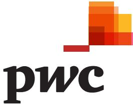

# Contents

| Foreword | SF |
| --- | --- |
| Executive summary |  |
| APT10 as a China-based threat actor | 5 |
| Motivations behind APT10's targeting | 14 |
| Shining a light on APT10's methodology | 16 |
| Conclusion | 20 |
| Appendices | 21 |

# Foreword

This report is an initial public release of research PwC UK and BAE Systems have conducted into new, sustained global campaigns by an established threat actor against managed IT service providers and their clients as well as several directly targeted organisations in Japan. Given the scale of those campaigns, the activity identified here is likely to reflect just a small portion of the threat actor's operations.

This report is primarily fact-based. Where we have made an assessment this has been made clear by phraseology such as "we assess", and the use of estimative language as outlined in Appendix A.

By publicly releasing this research, PwC UK and BAE Systems hope to facilitate broad awareness of the attack techniques used so that prevention and detection capabilities can be configured accordingly. It is also hoped that rapid progress can be made within the broader security community to further develop the understanding of the campaign techniques we outline, leading to additional public reports from peers across the security community.

As a part of our research and reporting effort, PwC UK and BAE Systems have collaborated with the UK's National Cyber Security Centre (NCSC) under its Certified Incident Response (CIR) scheme to engage and notify managed IT service providers, known affected organisations and other national bodies.

Supplementary to this report, an Annex containing our technical analysis will be released.

# Executive summary

Since late 2016, PwC UK and BAE Systems have been assisting victims of a new cyber espionage campaign conducted by a China-based threat actor. We assess this threat actor to almost certainly be the same as the threat actor widely known within the security community as 'APT10'. The campaign, which we refer to as Operation Cloud Hopper, has targeted managed IT service providers (MSPs), allowing APT10 unprecedented potential access to the intellectual property and sensitive data of those MSPs and their clients globally. A number of Japanese organisations have also been directly targeted in a separate, simultaneous campaign by the same actor.

We have identified a number of key findings that are detailed below.

### APT10 has recently unleashed a sustained campaign against MSPs. The compromise of MSP networks has provided broad and unprecedented access to MSP customer networks.

- . Multiple MSPs were almost certainly being targeted from 2016 onwards, and it is likely that APT10 had already begun to do so from as early as 2014.
- · MSP infrastructure has been used as part of a complex web of exfiltration routes spanning multiple victim networks.

### APT10 has significantly increased its scale and capability since early 2016, including the addition of new custom tools.

- · APT10 ceased its use of the Poison Ivy malware family after a 2013 FireEye report, which comprehensively detailed the malware's functionality and features, and its use by several China-based threat actors, including APT10.
- . APT10 primarily used PlugX malware from 2014 to 2016, progressively improving and deploying newer versions, while simultaneously standardising their command and control function.
- . We have observed a shift towards the use of bespoke malware as well as open-source tools, which have been customised to improve their functionality. This is highly likely to be indicative of an increase in sophistication.

#### Infrastructure observed in APT10's most recent campaigns links to previous activities undertaken by the threat actor.

- . The command and control infrastructure used for Operation Cloud Hopper is predominantly dynamic-DNS domains, which are highly interconnected and link to the threat actor's previous operations. The number of dynamic-DNS domains in use by the threat actor has significantly increased since 2016, representative of an increase in operational tempo.
- Some top level domains used in the direct targeting of . Japanese entities share common IP address space with the network of dynamic-DNS domains that we associate with Operation Cloud Hopper.

### APT10 focuses on espionage activity, targeting intellectual property and other sensitive data.

- . APT10 is known to have exfiltrated a high volume of data from multiple victims, exploiting compromised MSP networks, and those of their customers, to stealthily move this data around the world.
- · The targeted nature of the exfiltration we have observed, along with the volume of the data, is reminiscent of the previous era of APT campaigns pre-2013.

#### PwC UK and BAE Systems assess APT10 as highly likely to be a China-based threat actor.

- . It is a widely held view within the cyber security community that APT10 is a China-based threat actor.
- . Our analysis of the compile times of malware binaries, the registration times of domains attributed to APT10, and the majority of its intrusion activity indicates a pattern of work in line with China Standard Time (UTC+8).
- . The threat actor's targeting of diplomatic and political organisations in response to geopolitical tensions, as well as the targeting of specific commercial enterprises, is closely aligned with strategic Chinese interests.

# APT10 as a China-based threat actor

### APT10 as a China-based threat actor

PwC UK and BAE Systems assess it is highly likely that APT10 is a China-based threat actor with a focus on espionage and wide ranging information collection. It has been in operation since at least 2009, and has evolved its targeting from an early focus on the US defence industrial base (DIB)1 and the technology and telecommunications sector, to a widespread compromise of multiple industries and sectors across the globe, most recently with a focus on MSPs.

APT10, a name originally coined by FireEye, is also referred to as Red Apollo by PwC UK, CVNX by BAE Systems, Stone Panda by CrowdStrike, and menuPass Team more broadly in the public domain. The threat actor has previously been the subject of a range of open source reporting, including most notably a report by FireEye comprehensively detailing the threat actor's use of the Poison Ivy malware family2 and blog posts by Trend Micro³ similarly detailing the use of EvilGrab malware.

Alongside the research and ongoing tracking of APT10 by both PwC UK and BAE's Threat Intelligence teams, PwC UK's Incident Response team has been engaged in supporting investigations linked to APT10 compromises. This research has contributed to the assessments and conclusions we have drawn regarding the recent campaign activity by APT10, which represents a shift from previous activities linked to the threat actor.

As a result of our analysis of APT10's activities, we believe that it almost certainly benefits from significant staffing and logistical resources, which have increased over the last three years, with a significant step-change in 2016. Due to the scale of the threat actor's operations throughout 2016 and 2017, we similarly assess it currently comprises multiple teams, each responsible for a different section of the day-to-day operations, namely domain registration, infrastructure management, malware development, target operations, and analysis.

APT10 withdrew from direct targeting using Poison Ivy in 2013 and conducted its first known retooling operation, upgrading its capabilities and replatforming to use PlugX. It is highly likely that this is due to the release of the 2013 FireEye report.

Our report will detail the most recent campaigns conducted by APT10, including the sustained targeting of MSPs, which we have named Operation Cloud Hopper, and the targeting of a number of Japanese institutions.

1  The defence industrial base comprises the US Department of Defense and a plethora of companies that support the design, development and maintenance of defence assets and enable US military requirements to be met. 

2 

3 

# Time-based analysis of APT10's operations

As part of our analysis, we have made a number of observations about APT10 and its profile, which supports our assessment that APT10 is a China-based threat actor. For example, we have identified patterns within the domain registrations and file compilation times associated with APT10 activity. This is almost certainly indicative of a threat actor based in the UTC+8 time zone, which aligns to Chinese Standard Time (CST).

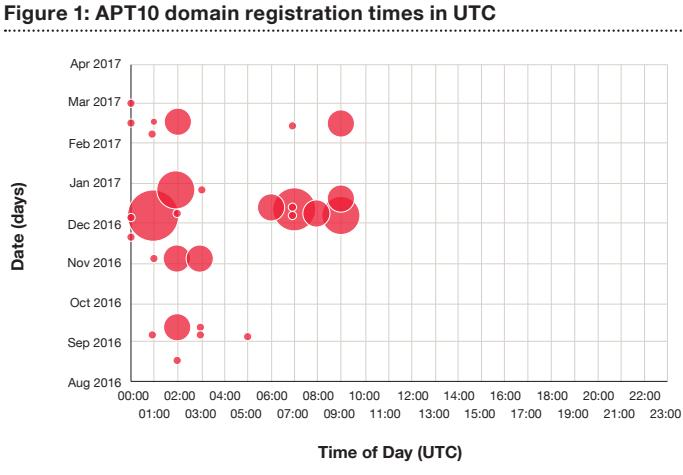

Further analysis of the compile times of PlugX, RedLeaves and Quasar malware samples used by APT10 reveals a similar pattern in working hours, as shown in Figure 3.

Shown in Figure 1 are registration times4, represented in UTC, for known APT10 top level domains since mid-2016, which mark a major uptick in APT10 activity.

Mapping this to UTC+8, as in Figure 2, shows a standard set of Chinese business hours, including a two-hour midday break.

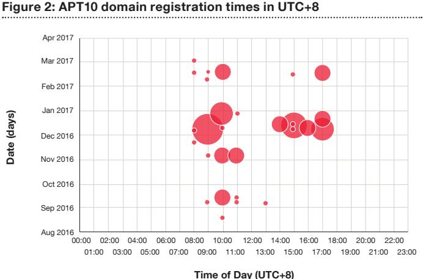

Shifting this to UTC+8 shows a similar timeframe of operation to the domain registrations. There are some outliers, which are likely attributable to the operational nature of this threat actor, such as requirements to work outside normal business hours.

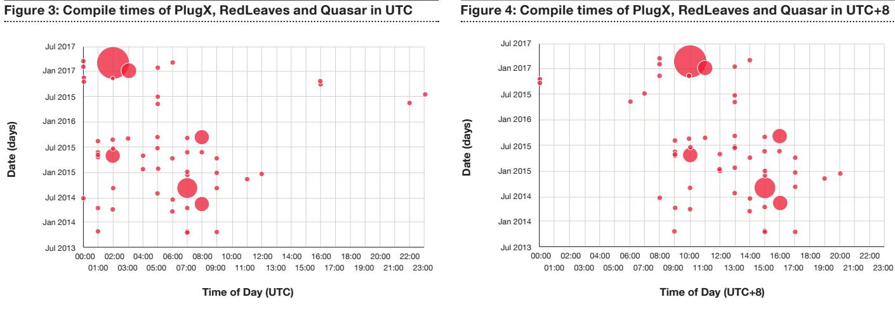

The bubbles shown on Figures 1 through 6 are representative of the number of events observed at that time and date. ব

When applying the time shift to the ChChes malware (newly used by APT10) compilation timestamps, we see a different pattern as shown in Figure 5. While this does not align with Chinese business hours, it is likely to be either a result of the threat actor changing its risk profile by attempting to obscure

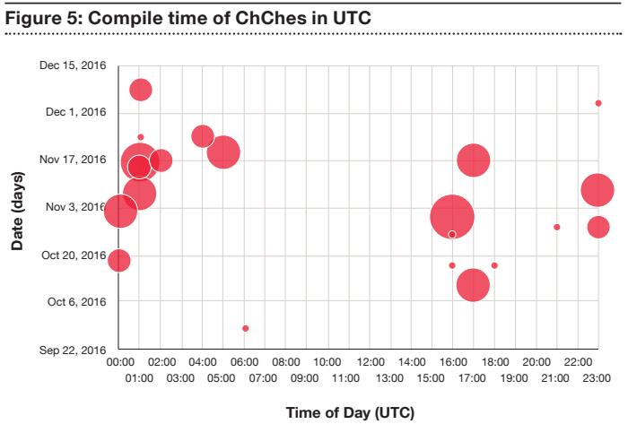

To further this analysis, we have observed the threat actor conducting interactive activities primarily between the hours of midnight and 10:00 UTC, as shown in Figure 7. When converting this to UTC+8 we again see a shift to Chinese business hours, with operations occurring between 08:00 and 19:00. It is a realistic probability that the weekend work observed in Figure 7 may be necessary as part of operational requirements.

The sum of this analysis aligns with the evidence provided by the United States Department of Justice indictment against several individuals associated with APT1,5 another Chinabased threat actor, showing a working day starting at 08:00 UTC+8 and finishing at 18:00 UTC+8 with a two hour lunch break from 12:00 UTC+8 until 14:00 UTC+8.

or confuse attribution or a developer's side project that has ended up being used on targeted operations. Based on other technical overlaps, ChChes is highly likely to be exclusively used by APT10.

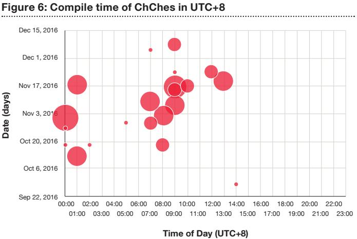

Figure 7: Operational times of APT10 in UTC+8

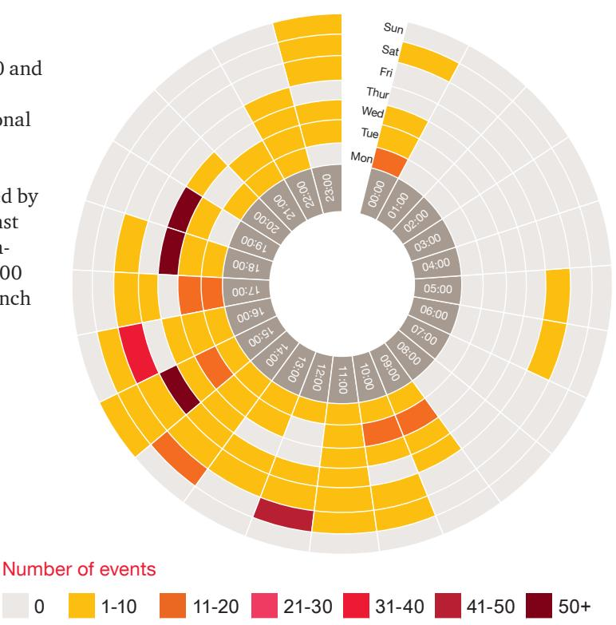

ട 

# Identifying a change in APT10's targeting

APT10 has, in the past, primarily been known for its targeting of government and US defence industrial base organisations, with the earliest known date of its activity being in December 2009. Our research and observations suggest that this targeting continues to date.

During the 2013 – 2014 period there was a general downturn in the threat actor's activities, as was also seen with other related groups. It was widely assessed that this was due to the public release of information surrounding APT1, which exposed its toolset and infrastructure.

From our analysis and investigations, we have identified APT10 as actively operating at least two specific campaigns, one targeting MSPs and their clients, and one directly targeting Japanese entities.

### MSP focused campaign

### APT10 has almost certainly been undertaking a global operation of unprecedented size and scale targeting a number of MSPs.

APT10 has vastly increased the scale and scope of its targeting to include multiple sectors, which has likely been facilitated by its compromise of MSPs. Such providers are responsible for the remote management of customer IT and end-user systems, thus they generally have unfettered and direct access to their clients' networks. They may also store significant quantities of customer data on their own internal infrastructure.

MSPs therefore represent a high-payoff target for espionagefocused threat actors such as APT10. Given the level of client network access MSPs have, once APT10 has gained access to a MSP, it is likely to be relatively straightforward to exploit this and move laterally onto the networks of potentially thousands of other victims. This, in turn, would provide access to a larger amount of intellectual property and sensitive data. APT10 has been observed to exfiltrate stolen intellectual property via the MSPs, hence evading local network defences.

Other threat actors have previously been observed using a similar method of a supply chain attack, for example, in the compromise of Dutch certificate authority Diginotar in 20116 and the compromise of US retailer Target in 2013.7

The command and control (C2) infrastructure chosen by APT10 for Operation Cloud Hopper is predominantly referenced using dynamic-DNS domains. The various domains are highly-interconnected through shared IP address hosting, even linking back historically to the threat actor's much older operations.

At present, the indicators detailing APT10's operations number into the thousands and cannot be easily visualised. The graph in Figure 8 overleaf depicts a high-level view of the infrastructure used by APT10 throughout 2016. As the campaign has progressed into 2017, the number of dynamic-DNS domains in use by the threat actor has significantly increased.

The graph in Figure 9, also shown overleaf, extracts one node of the newer C2 from the infrastructure shown in Figure 8 and maps this to the older infrastructure of APT10, as disclosed by FireEye in their 2014 Siesta Campaign blog post8. In terms of timing, it is highly likely that a single party is responsible for all of these domains, based on our observations of infrastructure overlap.

Through our investigations, we have identified multiple victims who have been infiltrated by the threat actor. Several of these provide enterprise services or cloud hosting, supporting our assessment that APT10 are almost certainly targeting MSPs. We believe that the observed targeting of MSPs is part of a widescale supply-chain attack.

б 

7 

8 

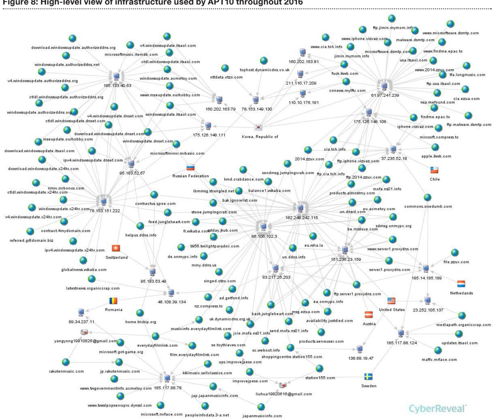

### Figure 8: High-level view of infrastructure used by APT10 throughout 2016

Figure 9: Infrastructure graph linking early Plugx domains to recent APT10 domains

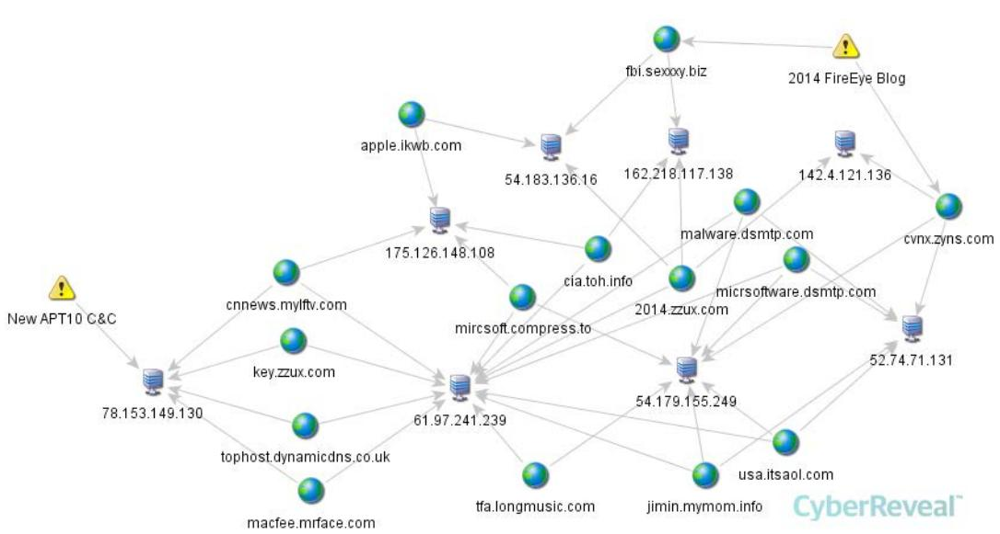

# Japan focused campaign

In a separate series of operations, APT10 has been systematically targeting Japanese organisations using bespoke malware referred to in the public domain as 'ChChes'. While linked to APT10, via shared infrastructure, this campaign exhibits some operational differences suggesting a potential sub-division within the threat actor. These operations have seen APT10 masquerading as legitimate Japanese public sector entities (such as the Ministry of Foreign Affairs, Japan International Cooperation Agency and the Liberal Democratic Party of Japan) to gain access to the victim organisations.

Targeting of these entities by APT10 is consistent with previous targeting by China-based threat actors of a wide range of industries and sectors in Japan. This includes the targeting of commercial companies, and government

agencies, both of which has resulted in the exfiltration of large amounts of data.9

APT10's standard compromise methodology begins with a spear phishing email sent to the target, usually with an executable attachment designed to lure the victim to open it. Analysis of the filenames associated with some of the latest APT10 malware samples, particularly from late 2016, highlights the use of Japanese language filenames which clearly indicates a campaign targeting Japanese-speaking individuals. Further analysis of these files can be found in Annex B.

Table 1 shows some example file names being used by APT10 in this campaign.

#### Table 1: Japanese language filenames used by APT10

| Japanese Filename | Translation |
| --- | --- |
| 1102毎日新聞(回答)._exe | 1102 Mainich Newspaper (answer)._exe |
| 2016県立大学シンポジウムA4_1025.exe | 2016 Prefectural University Symposium A4_1025.exe |
| 事務連絡案内状(28.11.07).exe | Business contact invitation (28.11.07).exe |
| 個人番号の提供について.exe | Regarding provision of Individual number.exe |
| 日米拡大抑止協議e | Japan-US expansion deterrence conference (e) |
| ロシア歴史協会の設立と「単一」国史教科書の作成.exe | Foundation of Russian historical association and Composing 「a unity」 |
|  | state history textbook.exe |

The following is an example of a malicious decoy document referencing Mitsubishi Heavy Industries:

Figure 10: Decoy document based on press release from Japanese firm Mitsubishi Heavy Industries detailing the unveiling of their new ABLASER-DUV (Deep Ultraviolet Laser)

深紫外 (DUV) レーザーを採用したABLASERの新モデルを世界に先駆け開発ABLASER-DUV、 優れた集光性能で超精密加工のさらなる微細化に対応

三菱重工グループの三菱重工工作機械株式会社(社長:白尾誠二、本社:滋賀県栗東市)は 徴細レーザー加工機ABLASER(アブレーザー)の新モデルとして、短パルスの深刻外(DUV )レーザーを採用した「ABLASER-DUV」を世界に先駆けて開発しました。DUVレーザーの特 性と集光光学系の最適設計により、長い焦点深度※1を保ったまま集光径を小さくでき、各種 穴あけをはじめとする超精密加工もより徴細かつ高精度に行うことができます。

ABLASERはレーザー加工様事業の製品第一弾として、2014年度から販売しているもので、高 いピーク出力で加工部分をアブレーション(Ablation : 蒸発、昇華)させることで、加工面へ の熱影響を抑えることができ、穴あけ加工では放電加工や従来のレーザー加工を上回る寸法精 度と表面の平滑性を確保できます。円錐状穴や鼓状穴といった難しい加工も可能で、一般的な 切削加工では困難な高硬度材料や脆性材料の微細高精度加工に貢献しています。

 d

A notable tactic of this APT10 subset is to register C2 domains that closely resemble legitimate Japanese organisations. Table 2 shows a selection of the spoofed domains registered, alongside the email addresses listed at registration and the legitimate impersonated domains.

| Table 2: Domains observed being impersonated by APT10 |  |  |  |
| --- | --- | --- | --- |
| Domain | Imitating | Theme | Description |
| bdoncloud[.]com | Unknown | Cloud | Generic Cloud theme |
| cloud-kingl[.]com |  |  |  |
| cloud-maste[.]com |  |  |  |
| incloud-go[.]com |  |  |  |
| incloud-obert[.]com |  |  |  |
| catholicmmb[.]com | cmmb.org | Religion | Catholic Medical Mission Board |
| ccfchrist[]com | ccf.org.ph |  | Christ's Commission Fellowship - based in Philippines |
| cwiinatonal[.]com | cwi.org.uk |  | Christian Witnesses to Israel |
| usffunicef[.]com | unicefusa.org | Charity | United States Fund For Unicef |
| salvaiona[.]com | salvationarmy.org |  | The Salvation Army |
| meiji-ac-jp[.]com | meiji.ac.jp | Japan / | Meiji University in Japan |
| u-tokyo-ac-jp[.]com | u-tokyo.ac.jp | Academic | Tokyo University in Japan |
| jica-go-jp[.]bike | jica.go.jp | Japan / Public | Japan International Cooperation Agency |
| jica-go-jp[.]biz | jica.go.jp | Sector | Japan International Cooperation Agency |
| jimin-jp[.]biz | jimin.jp |  | Liberal Democratic Party of Japan |
| mofa-go-jp[.]com | mofa.go.jp |  | Ministry of Foreign Affairs |

The top level C2 domains observed in this campaign share a number of features that can be used to further identify affiliated nodes. Table 3 displaying registrant information can be seen below:

#### Table 3: Known APT10 registration details showing a common name server

| Domain | Registrant email | Name Server Contact Name | Contact Street |
| --- | --- | --- | --- |
| belowto[.]com | robertorivera@india.com | ns1.ititch.com Roberto Rivera | 904 Peck Street Manchester, NH 03103 |
| ccfchrist[.]com | wenonatmcmurray@india.com | ns1.ititch.com Wenona | 824 Ocala Street Winter Park, FL 32789 |
|  |  | McMurray |  |
| cloud-maste[.] | meganfdelgado@india.com |  | ns1.ititch.com Megan Delgado 3328 Sigley Road Burlingame, KS 66413 |
| com |  |  |  |
| poulsenv[.]com | abellonav.poulsen@yandex.com ns1.ititch.com Abellona |  | 2187 Findley Avenue Carrington, ND |
|  |  | Poulsen | 58421 |
| unhamj[.]com | juanitardunham@india.com | ns1.ititch.com | Juanita Dunham 745 Melody Lane Richmond, VA 23219 |
| wthelpdesk[]com armandovalcala@india.com |  | ns1.ititch.com | Armando Alcala 608 Irish Lane Madison, WI 53718 |

None of the domains share identical contact information other than stating that the respective registrants are based in the US. The contact streets, organisations, and names are all distinct between domains.

Some of the domains, that do resolve, share common IP address space with the network of dynamic-DNS domains that we associate with Operation Cloud Hopper as detailed earlier

in the report. This connection is highlighted in the infrastructure graph shown in Figure 11 below, where some ChChes C2 domains can be seen in the bottom left, while on the far right are the older APT10 domains referenced in previous reporting.

### Figure 11: Infrastructure graph linking early PlugX domains to recent ChChes domains

# Motivations behind APT10's targeting

# A short history of China-based hacking

China-based threat actors have a long history of cyber espionage in the traditional political, military and defensive arena, as well as industrial espionage for economic gain. Some of the most notable of these events from the past decade are shown below

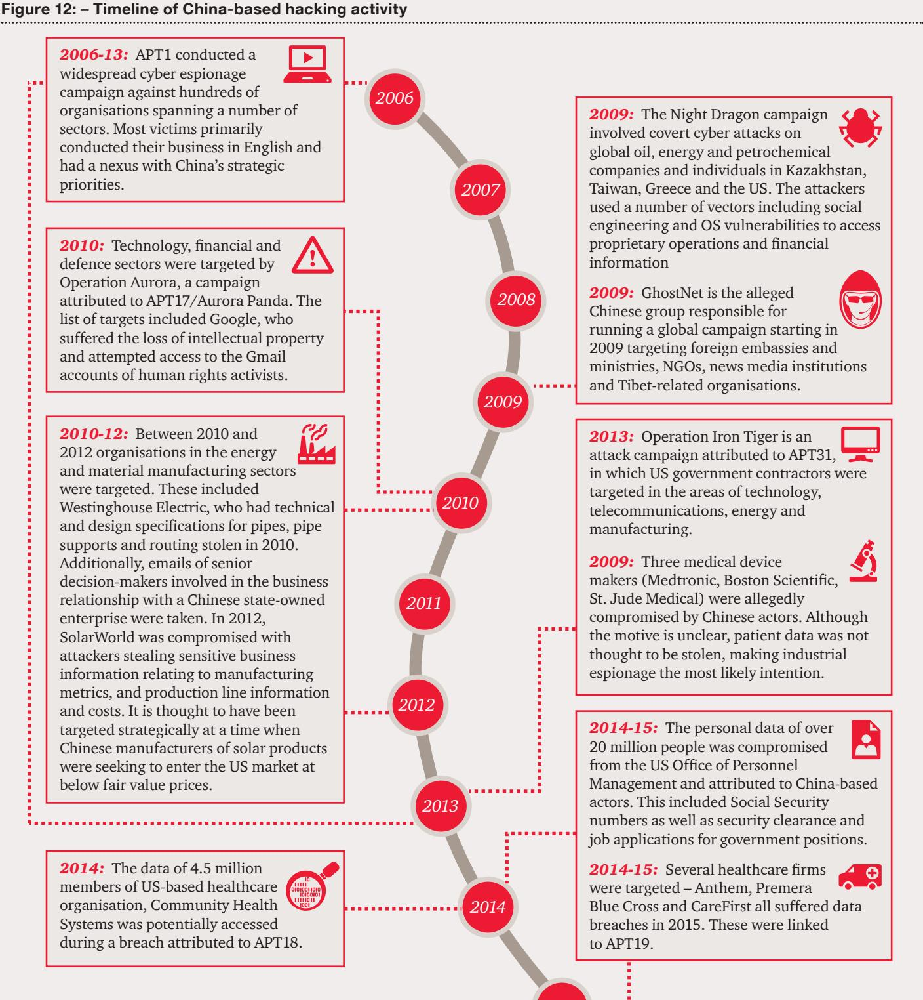

# APT10 alignment with previous China-based hacking

Espionage attacks associated with China-based threat actors, as noted above, have traditionally targeted organisations that are of strategic value to Chinese businesses and where intellectual property obtained from such attacks could facilitate domestic growth or advancement.

There has been significant open source reporting which has documented the alignment between apparent information collection efforts of China-based threat actors and the strategic emerging industries documented in China's Five Year Plan (FYP).10 The 13th FYP was released in March 2016 and the sectors and organisations known to be targeted by APT10 are broadly in line with the strategic aims documented in this plan. These aims outlined in the FYP will largely dictate the growth of businesses in China and are, therefore, likely to also form part of Chinese companies' business strategies.

The latest FYP describes five principles which underpin China's goal of doubling its 2010 GDP by 2020. At the forefront of these principles is innovation, largely focused around technological innovation, with China expected to invest 2.5% of GDP in research and development to attain technological advances, which are anticipated to contribute 60% towards economic growth objectives.11 The areas of innovation expected to receive extensive investment include, next-generation communications, new energy, new materials, aerospace, biological medicine and smart manufacturing.

In addition to the FYP principle of innovation, China is also promoting ten key industries in which it wants to improve innovation in manufacturing as part of the 'Made in China 2025' initiative.12

Figure 13: Industries of interest outlined by 'Made in China 2025' initiative

Observed APT10 targeting is in line with many of the historic compromises we have outlined previously as originating from China. This targeting spans industries that align with China's 13th FYP which would provide valuable information to advance the domestic innovation goals held within China. Given the broad spectrum of priority industries, the compromise of MSPs represents an efficient method of information collection. This strategy also provides additional obfuscation for the actor as any data exfiltrated is taken back through the initial compromised company's systems, creating a much more difficult trail to follow.

10 

11 

12 

# Shining a light on APT10's methodology

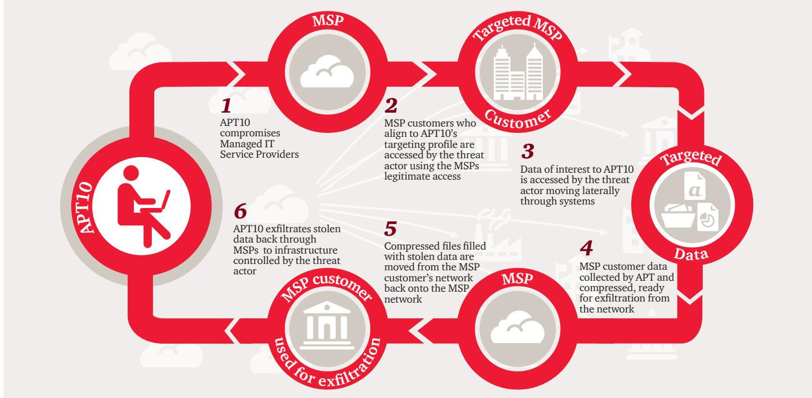

This section details changes made to APT10 tools, techniques and procedures (TTPs) post-2014, following its shift from Poison Ivy to PlugX. These TTPs have been identified as part of our incident response and threat intelligence investigations and have been used in both of the recent campaigns we have encountered. The examples provided in this section will be drawn from both of those campaigns.

### Reconnaissance and targeting

It is often difficult to identify the early stages of a threat actor's preparation for an attack as these initial activities tend to occur below the line of visibility. Our analysis of the most recently used decoy documents by APT10 in its spear phishing campaigns, which is the primary delivery method of its payloads, indicates the actor performs a significant level of research on its targets. In line with commonly used APT actor methodologies, the threat actor aligns its decoy documents to a topic of interest relevant to the recipient.

In the example shown in Figure 14 to the right, an official document hosted on the Japan Society for the Promotion of Science website was weaponised and deployed as part of a spear phishing campaign against a Japanese target in the education sector.

Figure 14: Decoy document used by APT10 to target the Japanese education sector

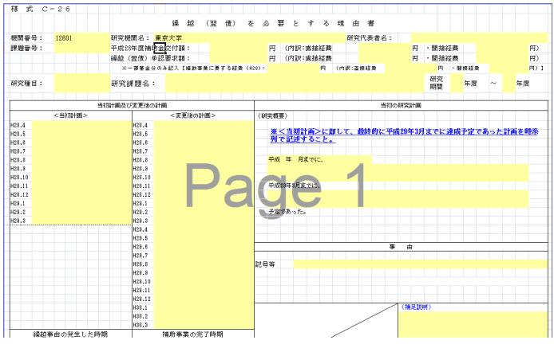

APT10 has been known to use research from their reconnaissance to obtain company email addresses, and then craft a message containing either a malicious attachment or a link to a malicious site.

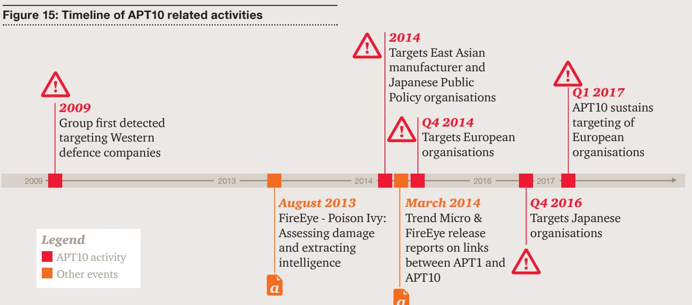

As part of the same campaign, we have also observed an email sent by APT10,13 referencing a Scientific Research Grant Program, and targeting various Japanese education institutes including Meiji University14 and Chuo University.15 The email included a zip file containing a link to download a payload from one of APT10's servers, the ChChes Powersploit exploit, detailed in Annex B.

### Initial compromise and lateral movement

Once on a target network, the actor rapidly deploys malware to establish a foothold, which may include one or more systems that provide sustained access to a victim's network. As APT10 works to gain further privileges and access, it also conducts internal reconnaissance, mapping out the network using common Windows tools, and in later stages of the compromise using open source pentesting tools, detailed in Annex B.

This reconnaissance is run in parallel with the actor ensuring that it has access to legitimate credentials. We have observed that in cases where APT10 has infiltrated a target via an MSP, it continues to use the MSPs credentials. In order to gain any further credentials, APT10 will usually deploy credential theft tools such as mimikatz or PwDump, sometimes using DLL load order hijacking, to use against a domain controller, explained further in Annex B. Regular communications checks are then executed in order to maintain this level of access. In most cases, these stolen MSP credentials have provided administrator or domain administrator privileges.

We have observed the threat actor copying malware over to systems in a compromised environment, which did not have any outbound internet access. In one of these instances, the threat actor spent more than an hour attempting to establish an outbound connection using PlugX until it realised that the host had no internet access, at which point the malware and all supporting files were deleted. APT10 achieves persistence on its targets primarily by using scheduled tasks or Windows services in order to ensure the malware remains active regardless of system reboots.

APT10 heavily leverages the shared nature of client-side MSP infrastructure to move laterally between MSPs and other victims. Systems that share access and thus credentials, from both a MSP and one of its clients serve as a way of hopping between the two.

Systems sharing credentials across the client and the MSP are of particular interest to APT10, and are commonly used by the threat actor in order to gain access to new areas of the network

13 

14 

15 

APT10 simultaneously targets both low profile and high value systems to gain network persistence and a high level of access respectively. For example, in addition to compromising high value domain controllers and security servers, the threat actor has also been observed identifying and subsequently installing malware on low profile systems that provide non-critical support functions to the business, and are thus less likely to draw the attention of system administrators.

As part of the long-term access to victim networks, we have observed APT10 consistently install updates and new malware on compromised systems. In the majority of instances APT10 used either a reverse shell or RDP connection to install its malware; the actor also uses these methods to propagate across the network.

Communication checks are usually conducted using native Windows tools such as ping.exe, net.exe and tcping.exe. The actor will frequently 'net use' to several machines within several seconds, connecting for as little as five seconds, before disconnecting. Further details are provided in Annex B.

### Network hopping and exfiltration

Once APT10 have a foothold in victim networks, using either legitimate MSP or local domain credentials, or their sustained malware such as PlugX, RedLeaves or Quasar RAT, they will begin to identify systems of interest.

The operator will either access these systems over RDP, or browse folders using Remote Access Trojan (RAT) functionality, to identify data of interest. This data is then staged for exfiltration in multi-part archives, often placed in the Recycle Bin, using either RAR or TAR. The compression tools are often launched via a remote command execution script which is regularly named 't.vbs' and is a customised version of an open source WMI command executor which pipes the command output back to the operator.

We have observed these archives being moved outside of the victim networks, either back into to the MSP environments or to external IP addresses in two methods, which are also performed via the command line using t.vbs:

- 1. Mounting the target external network share with 'net use' and subsequently using the legitimate Robocopy tool to transfer the data; and,
- 2. Using the legitimate Putty Secure Copy Client (PSCP), sometimes named rundll32.exe, to transfer the data directly to the third party system.

Using these techniques, APT10 'pushes' data from victim networks to other networks they have access to, such as other MSP or victim networks, then, using similar methods, 'pulls' the data from those networks to locations from which they can directly obtain it, such as the threat actor's C2 servers.

APT10's ability to bridge networks can therefore be summarized as:

- . Use of legitimate MSP credentials to management systems which bridge the MSP and multiple MSP customer networks;
- Use of RDP to interactively access systems in both the MSP . management network and MSP customer networks;
- . Use of t.vbs to execute command line tools; and,
- Use of PSCP and Robocopy to transfer data.

### APT10 malware

We classify APT10's malware into two distinct areas: tactical and sustained. The tactical malware, historically EvilGrab, and now ChChes (and likely also RedLeaves), is designed to be lightweight and disposable, often being delivered through spear phishing. Once executed, tactical malware contains the capability to profile the network and manoeuvre through it to identify a key system of interest. The sustained malware, historically Poison Ivy, PlugX and now Quasar provides a more comprehensive feature set. Intended to be deployed on key systems, the sustained malware facilitates long-term remote access and allows for operators to more easily carry out administration tasks.

Since late 2016, we have seen the threat actor develop several bespoke malware families, such as ChChes and RedLeaves. Additionally, it has taken the open source malware, Quasar, and extended its capabilities, ensuring the incrementation of the internal version number as it does so.

We have also observed APT10 use DLL search order hijacking and sideloading, to execute some modified versions of open-source tools. For example, PwC UK has observed APT10 compiling DLLs out of tools, such as MimiKatz and PwDump6, and using legitimate, signed software, such as Windows Defender to load the malicious payloads.

In Annex B we provide detailed analysis of several of the threat actor's tools as well as the common Windows tools we have observed being used.

#### Timeline

#### Figure 17: Timeline of APT10 malware use

### Retooling Efforts

Alongside APT10's TTPs, we have observed a 'retooling' cycle. Given the pace of technological change and the wide range of freely available online tools and scripts, it is not unusual for an actor to re-evaluate its capabilities and to benchmark multiple offerings against each other. We have observed a decline in the deployment of some of APT10's traditional core tool set, and witnessed an increase in the development and deployment of additional new tools which combine in-house development and open source projects. We assess that this is highly likely due to the public release of APT10 malware by cyber security vendors.

Throughout our investigations, we have observed multiple deployments of the PlugX malware from 2014 to at least 2016. This, along with the downturn in the use of Poison Ivy, supports the notion that a major retooling operation took place post 2014. Additional analysis of the infrastructure associated with each distinct version of PlugX also shows an increase in maturity over time. Earlier PlugX versions were configured with legacy domains and IP addresses, which were originally isolated and more obvious, whereas more recent versions have demonstrated a standardised convention for domain names and IP selection.

During our analysis of victim networks, we were able to observe APT10 once again initiate a retooling cycle in late 2016. We observed the deployment and testing of multiple versions of Quasar malware,16 and the introduction of the bespoke malware families ChChes and RedLeaves.

We assess it is highly likely that due to the frequent public release of information linking PlugX with China-based threat actors, continual long-term use had become unsustainable, introducing an additional operational overhead that is easily attributable to China-based threat actors.

16 

# Conclusion

APT10 is a constantly evolving, highly persistent China-based threat actor that has an ambitious and unprecedented collection programme against a broad spectrum of sectors, enabled by its strategic targeting.

Since exposure of its operations in 2013, APT10 has made a number of significant changes intended to thwart detection of its campaigns. PwC UK and BAE Systems, working closely with industry and government, have uncovered a new, unparallelled campaign which we refer to as Operation Cloud Hopper. This operation has targeted managed IT service providers, the compromise of which provides APT10 with potential access to thousands of further victims. An additional campaign has also been observed targeting Japanese entities.

APT10's malware toolbox shows a clear evolution from malware commonly associated with China-based threat actors towards bespoke in-house malware that has been used in more recent campaigns; this is indicative of APT10's increasing sophistication, which is highly likely to continue. The threat actor's known working hours align to Chinese Standard Time (CST) and its targeting corresponds to that of other known China-based threat actors, which supports our assessment that these campaigns are conducted by APT10.

This campaign serves to highlight the importance of organisations having a comprehensive view of their threat profile, including that of their supply chain's. More broadly, it should also encourage organisations to fully assess the risk posed by their third party relationships, and prompt them to take appropriate steps to assure and manage these.

A detailed technical annex supplements this main report, which provides further information about the tools and techniques used by APT10 and contains Indicators of Compromise relating to all of this threat actor's known campaigns. These have already been provided to the National Cyber Security Centre for dissemination through their usual channels.

# Appendix A

### Collaboration between PwC UK and BAE Systems

PwC and BAE Systems' respective Threat Intelligence teams share a mutual interest in new cyber threats. PwC and BAE Systems partnered through their membership of the Cyber Incident Response (CIR) scheme to share intelligence and develop the most comprehensive picture possible of this threat actor's activities. Information sharing like this underpins the security research community and serves to aid remediation and inform decisions that companies make about their security needs.

# Probabilistic language

Interpretations of probabilistic language (for example, "likely" or "almost certainly") vary widely, and to avoid misinterpretation we have used the following qualitative terms within this report when referring to the level of confidence we have in our assessments. Unless otherwise stated, our assessments are not based on statistical analysis.

#### Table 4: Probabilistic language ..

| Qualitative term | Associated probability range |
| --- | --- |
| Remote or highly unlikely | Less than 10% |
| Improbable or unlikely | 10-25% |
| Realistic probability | 26-50% |
| Probable or likely | 51-75% |
| Highly probable or highly likely | 76-90% |
| Almost certain | More than 90% |

# Appendix B

## PwC UK reporting

PwC UK Threat Intelligence has previously published a range of APT10 related reporting, both in the public domain and via our subscription service. These reports are as follows:

- . APT10 resumes operations with a vengeance, in Threats Under the Spotlight – CTO-TUS-20170321-01A
- · NetEaseX and the Secret Key to Lisboa CTO-TIB-20170313-01A – BlackDLL
- APT10's .NET Foray CTO-TIB-20170301-01B Quasar .
- o APT10 pauses for Chinese New Year, in Threats Under the Spotlight – CTO-TUS-20170220-01A
- . CVNX's sting in the tail – CTO-TIB-20170123-01A – ChChes (Scorpion) Malware
- . China and Japan: APT to dispute -CTO-SIB-20170119-01A
- . Taiwan Presidential Election: A Case Study on Thematic Targeting,  security_updates/2016/03/taiwant-election-targetting. html, published 2016-03-17. Overview of EvilGrab and it being used against Asian targets, specifically around the 2016 Taiwanese election
- •
- "IST-Red Apollo-002 Red Apollo Tearsheet"

### Third party reports

A number of organisations have also published related reporting, as follows:

- . RedLeaves – Malware Based on Open Source RAT -  -- - malwarebased-on-open-source-rat.html – Further technical reporting on RedLeaves, revealing links to an open source RAT.
- . The relevance between the attacker group menuPass and malware (Poison Ivy, PlugX, ChChes), https:// www.lac.co.jp/lacwatch/people/20170223_001224.html, published 2017-02-23. Links APT10 to ChChes, Poison Ivy and PlugX.
- . menuPass Returns with New Malware and New Attacks Against Japanese Academics and Organizations,  com/2017/02/unit42-menupass-returns-new-malwarenew-attacks-japanese-academics-organizations/, published 2017-02-16. APT10 attacks on Japanese academics. Includes info on ChChes (technical), Poison Ivy and PlugX.
- . ChChes – Malware that Communicates with C&C Servers Using Cookie Headers,  jp/2017/02/chches-malware--93d6.html, published 2017-02-15. Technical overview of ChChes malware with IOCs.
- . PlugX TrendMicro "tearsheet",  trendmicro.com/vinfo/us/threat-encyclopedia/malware/ plugx, published 2016-09-07. Technical info and IOCs for PlugX.
- . A Detailed Examination of the Siesta Campaign,  threat-research/2014/03/a-detailed-examination-of-thesiesta-campaign.html, published 2014-03-12. Provides a detailed analysis of activity dubbed the Siesta campaign.
- . POISON IVY: Assessing Damage and Extracting Intelligence,  fireeye-www/global/en/current-threats/pdfs/rpt-poisonivy.pdf, published 2013-08-21. Technical report on Poison Ivy and campaigns that have used it, including menuPass.
- EvilGrab Malware Family Used In Targeted Attacks In . Asia,  published 2013-09-18. Technical overview of EvilGrab.
- CrowdCasts Monthly: You Have an Adversary Problem,  published 2013-10-16, a presentation on Chinese actors including APT, crime and hacktivist. Includes section on Stone Panda (APT10).
- o PlugX: New Tool For a Not So New Campaign, http:// blog.trendmicro.com/trendlabs-security-intelligence/ plugx-new-tool-for-a-not-so-new-campaign/, published 2012-09-10. Gives an introduction to PlugX.
- . Pulling the Plug on PlugX,  com/vinfo/us/threat-encyclopedia/web-attack/112/ pulling-the-plug-on-plugx, published 2012-08-04. Gives a technical overview of PlugX and what it is used for.

### About PwC

At PwC, our purpose is to build trust in society and solve important problems. We're a network of firms in 157 countries with more than 223,000 people who are committed to delivering quality in assurance, advisory and tax services.

PwC UK's cyber security team is a part of this mission, helping clients around the world to assess, build and manage their cyber security capabilities and to identify and respond to incidents through a range of services including threat intelligence, threat detection and incident response.

# PIRED

### We are BAE Systems

At BAE Systems, we provide some of the world's most advanced technology defence, aerospace and security solutions.

At BAE Systems Applied Intelligence, we help nations, qovernments and businesses around the world defend themselves against cybercrime, reduce their risk in the connected world, comply with regulation, and transform their operations. We do this using our unique set of solutions, systems, experience and processes – often collecting and analysing huge volumes of data.

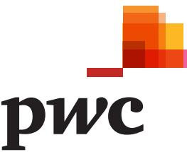

This publication has been prepared for general guidance on matters of interest only, and does not constitute professional advice. You should not act upon the information contained in this publication without obtaining specific professional advice. No representation or warranty (express or implied) is given as to the accuracy or completeness of the information contained in this publication, and, to the extent permitted by law, PricewaterhouseOoopers LLP, its members, employees and agents do not accept or assume any liability, responsibility, responsibility or duty of care for any consequences of you or anyone else acting, or refraining to act, in reliance on the information contained in this publication or for any decision based on it.

© 2017 PricewaterhouseCoopers LLP. All rights reserved. In this document, "PwG" refers to the UK member firm, and may sometimes refer to the PwG network. Each member firm is a separate legal entity. Please see www.pwc.com/structure for further details.

