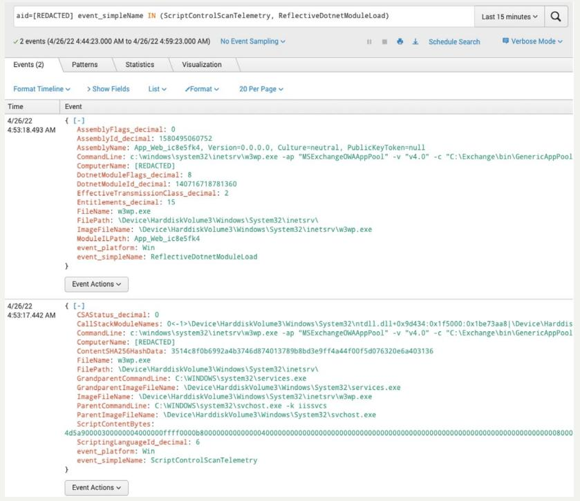
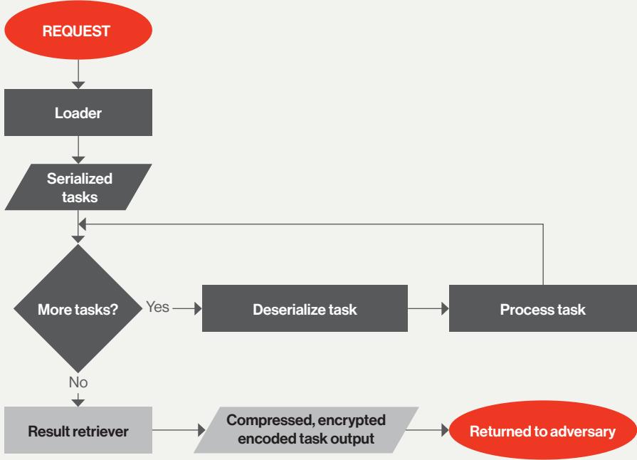
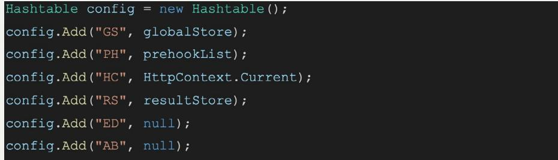
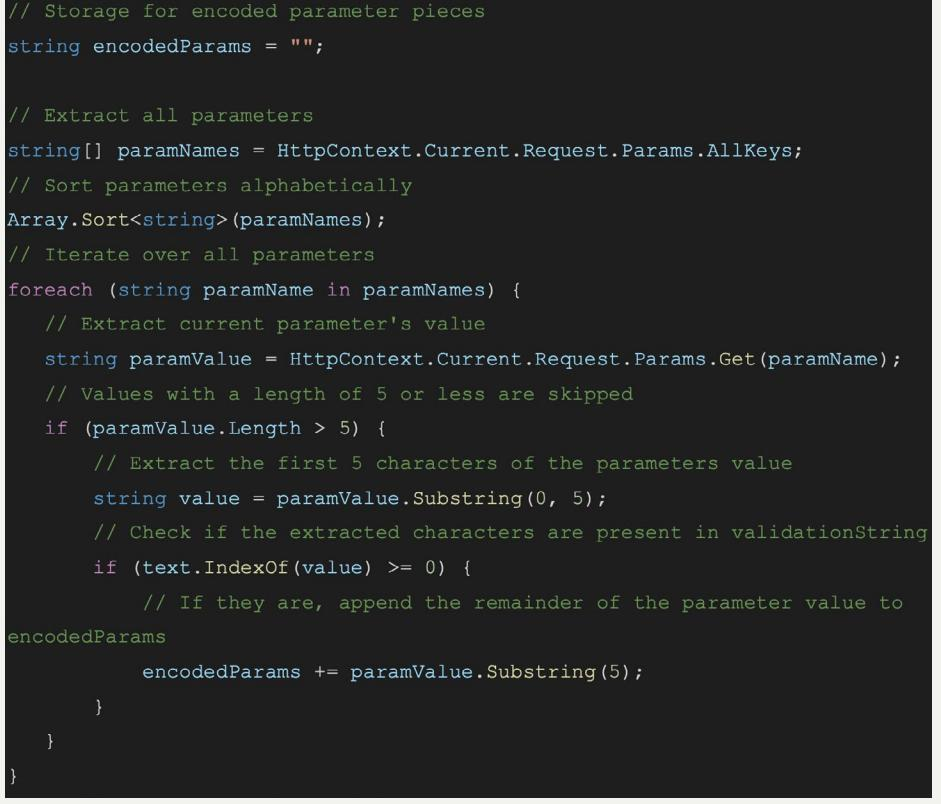
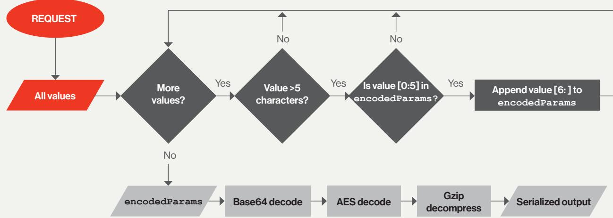
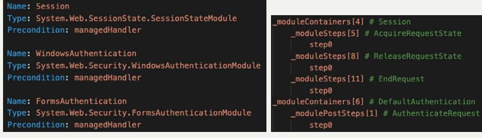
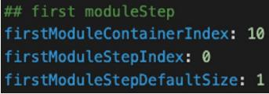

# ICEAPPLE: A NOVEL INTERNET INFORMATION SERVICES (IIS) POST-EXPLOITATION FRAMEWORK

Understanding the threat to your IIS servers

#### ICEAPPLE: A NOVEL INTERNET INFORMATION SERVICES (IIS) POST-EXPLOITATION FRAMEWORK

# INTRODUCTION

The CrowdStrike Falcon OverWatch™ threat hunting team has uncovered a new and highly sophisticated Internet Information Services (IIS) post-exploitation framework that CrowdStrike refers to as IceApple. OverWatch's observations, explored in detail in this paper. suggest that IceApple has been developed by an adversary with detailed knowledge of the inner workings of IIS.

Since OverWatch's discovery of IceApple in late 2021, the framework has been observed in multiple victim environments and in geographically distinct locations, with intrusions spanning the technology, academic and government sectors. Over Watch's investigations have identified at least 18 modules, each adding capabilities to the IceApple framework. Over Watch's observations suggest that this framework is still in active development.

lceApple uses an in-memory-only framework that highlights the adversary's priority of maintaining a low forensic footprint on the infected host. This is typical of long-running objectives aimed at intelligence collection and aligns with a targeted, state-sponsored mission. Though the observed targeted intrusions align with China-nexus, state-sponsored collection requirements, CrowdStrike Intelligence has not attributed IceApple to a named threat actor as of April 2022.

This paper explores how OverWatch made its discovery, detailing both the threat hunting workflows and tooling capabilities that helped uncover the exploitation framework and track its evolution.

Next, this paper examines how the IceApple framework is being used in the wild, providing a high-level summary of its capabilities. It then provides a deep dive on the unique modules and how they work.

The paper concludes with recommendations for defenders on mitigating risks to their IIS servers. The CrowdStrike Falcon® platform detects all currently known lceApple module loads, while OverWatch actively hunts new IceApple modules.

# BACKGROUND INFORMATION

Internet Information Services (IIS) is Microsoft's extensible web server software. Its modular architecture enables developers to build components that extend or replace existing server functionality. IIS components can be either native dynamic-link libraries (DLLs) typically written in C++, or managed modules written in C#.

### PERSISTENT IIS COMMAND EXECUTION

Adversaries are known to leverage two primary techniques for achieving persistence on compromised IIS servers: web shells¹ and malicious IIS components.2 In OverWatch's

<sup>1</sup> For more information, see the MITRE ATT&CK® entry, Server Software Component: Web Shell, at:


<sup>2</sup> For more information, see the MITRE ATT&CK entry, Server Software Component: IIS Components, at:  mitre.org/techniques/T1505/004/

experience — regardless of which technique an adversary uses — the persistent component deployed possesses capabilities to load additional functionality to help an adversary achieve their objectives. These additional functionalities are usually loaded reflectively via precompiled .NET assemblies.3

#### .NET ASSEMBLIES

.NET assemblies form the cornerstone of Microsoft's .NET framework - a cross-platform software development framework. An assembly can function as either a standalone application in the form of an EXE file or as a library for use in other applications as a DLL. Applications can dynamically load .NET assemblies at runtime from the Global Assembly Cache (GAC),4 from the local filesystem or from a byte array containing the full contents of a compiled assembly.

## WHAT THIS MEANS FOR THREAT HUNTERS

Because .NET assemblies can be a powerful and potentially stealthy way for adversaries to pursue their mission objectives, detections for reflective .NET assembly loads are actively being developed by OverWatch threat hunters. These detections successfully uncovered the IceApple post-exploitation framework being used in the wild.

# HOW IS ICEAPPLE BEING USED?

OverWatch observed different IceApple modules being deployed in customer environments, which varied depending on how far the compromise of an environment had progressed.

When used shortly after an adversary gained initial access, IceApple was observed being rapidly deploved to multiple hosts to facilitate credential harvesting from local and remote host registries, credential logging on OWA servers, reconnaissance, and data exfiltration. OverWatch then observed adversaries returning to networks daily to continue their activity.

When used after an adversary had prolonged access to an environment, IceApple was observed being deployed to assist with credential harvesting and basic local reconnaissance. OverWatch observed adversaries in these instances returning every 10 to 14 days, likely as a means of ensuring access was maintained.

# HOW DID OVERWATCH DISCOVER ICEAPPLE?

## THE INITIAL TRIGGER

In late 2021, one of OverWatch's in-development detections for reflective .NET assembly loads was triggered on a customer's Microsoft Exchange OWA server. OverWatch initially detected four .NET assemblies being reflectively loaded into the "MSExchangeOWAAppPool"

<sup>3</sup> For more information, see the MITRE ATT&CK entry, Reflective Code Loading, at:  T1620/

<sup>4</sup> For more information on the Global Assembly Cache, see: 

application pool on two Microsoft Exchange servers with the following names:

- App Web 6nj14khm, Version=0.0.0.0.0, Culture=neutral, PublicKeyToken=null
- App Web 06y3iviz, Version=0.0.0.0, Culture=neutral, PublicKeyToken=null
- · App Web sbp810mc, Version=0.0.0.0, Culture=neutral, PublicKeyToken=null
- App Web ic8e5fk4, Version=0.0.0.0, Culture=neutral, PublicKeyToken=null

At first glance, these assemblies appear to be expected IIS temporary files generated as part of the process of converting Active Server Page Extended (ASPX) source files into .NET assemblies for IIS to load.

However, on closer analysis, OverWatch deemed the activity suspicious for three reasons:

- 1. IIS does not reflectively load its generated temporary .NET assemblies from byte arrays.
- 2. Microsoft Exchange does not reflectively load its .NET assemblies from byte arrays.
- 3. The last eight characters of IIS temporary file names are randomly generated; however, the same four .NET assembly names were seen on both hosts multiple times.

| // C:\Mindows\Microsoft.NET\Framework64\v4.0.30319\Temporary ASP.MET Files\root\e22c2559\92c7e946\App Web 5zz5bcf2.d1l |  |  |  |  |  |  |  |
| --- | --- | --- | --- | --- | --- | --- | --- |
| // App Web 5zz5bcf2, Version=0.0.0.0.0.0.0.0.0. Culture=neutral, PublicKeyToken=null |  |  |  |  |  |  |  |
| 92c7e946 |  |  |  |  |  |  |  |
| Share | View |  |  |  |  |  |  |
| 1 · Framework64 > v4.0.30319 > Temporary ASP.NET Files > root > e22c2559 > 92c7e946 |  |  |  |  | V D | Q | Search 92c7e946 |
| Name |  | Date modified | A Type | Size |  |  |  |
| App_Web_5zz5bcf2.dll |  | 2/4/2022 2:03 PM | Application extension |  | 7 KB |  |  |
| App_Web_14klcr4p.dll |  | 2/8/2022 2:42 PM | Application extension |  | 11 KB |  |  |
| App_Web_gc3jwcns.dll |  | 2/8/2022 2:42 PM | Application extension |  | 12 KB |  |  |
| App_Web_km4mczyp.dll |  | 2/8/2022 2:42 PM | Application extension |  | 8 KB |  |  |
| App_Web_vgjf3bsu.dll |  | 2/8/2022 2:42 PM | Application extension |  | 32 KB |  |  |
| App_Web_ynzyarrn.dll |  | 2/8/2022 2:42 PM | Application extension |  | 7 KB |  |  |

Figure 1. Temporary .NET assemblies generated by IIS and their randomly generated internal assembly's name

#### DIGGING DEEPER

OverWatch worked with the customer to turn on the Script-Based Execution Monitoring prevention policy setting to enable the CrowdStrike Falcon sensorto extract the content of reflectively loaded .NET assemblies across the customer's endpoints, increasing visibility.

After making these changes, OverWatch's reflectively loaded .NET assembly detection triggered again for the same four .NET assemblies (referenced above) being loaded on the originalhosts.With Script-Based Execution Monitoring enabled,OverWatch was able to retrieve and analyze the contents of the .NET assemblies.

### LEVERAGING THE POWER OF THE FALCON PLATFORM

An analyst is only as good as their tools. Before diving into the contents of the loaded assemblies, it is important to look at what the Falcon sensor captures in regard to reflectively loaded .NET assemblies and how OverWatch uses this information to provide its customers with up-to-date intelligence on in-progress compromises.

The Falcon sensor gives customers two key events for analyzing reflectively loaded .NET assemblies: ReflectiveDotnetModuleLoad,whichprovidesthe name ofthe.NET assemblyloaded,and ScriptControlScanTelemetry, which provides the bytes of the .NET assembly loaded.

The AssemblyNamefieldfromthe ReflectiveDotnetModuleLoad eventisveryuseful for developing detections for common .NET tools that are downloaded from GitHub and then compiled and used in an attack without changing the assembly's name. For example, if two different adversaries download and compile Rubeus, the resulting DLL's hashes will be different; however, their assembly names will still be Rubeus, Version=1.0.0.0, Culture=neutral, PublicKeyToken=null. Detectionsbasedon.NETassembly names, much like detections based on hashes, are very brittle, as with minimal effort Rubeus, Version=1.0.0.0, Culture=neutral, PublicKeyToken=null canbecome TotallyLegit, Version=1.3.3.7, Culture=neutral, PublicKeyToken=null and bypass detection.

The ScriptContentBytes fieldfromthe ScriptControlScanTelemetry event contains the ASCII representation of the bytes being reflectively loaded. This ASCII string of hex data can be taken from Falcon Insight™ endpoint detection and response (EDR) and easily converted to the raw bytes of the .NET assembly, using open source tools like Cyber Chef.' That converted data can then be loaded into a .NET decompiler, like dnSpy, and further analyzed.



Figure 2. Falcon Insight showing the IceApple Loader module being loaded

- 6 
- 8 
<sup>5</sup> ScriptControlScanTelemetry events will only be generated if "Script-Based Execution Monitoring" is enabledin the Falcon UI.

<sup>7</sup> 

When developing detections for reflectively loaded .NET activity, OverWatch typically uses a combination of regular expressions on assembly names as well as the presence of a reflective .NET load occurring under an application or IIS application pool that does not typically perform this sortof operation. Analysis of Script Content Bytes (payload bytes) is reserved for confirmation of maliciousness following the initial detection.

# A CLOSER LOOK AT ICEAPPLE

Next, let's explore the 18 IceApple modules that OverWatch has observed to date. These modules support a wide range of capabilities, including:

- Listing directories
- Writing data to a file
- Deleting files and directories
- Retrieving the configuration of installed network adapters
- Making HTTP requests with the hard-coded user agent Microsoft Office/16.0 (Windows NT 10.0; Microsoft Outlook 16.0.4551; Pro)
- Retrieving IIS server variables
- Dumping credentials stored in registry keys on the infected host or a remote host
- Executing queries against Active Directory
- "Normal" exfiltrating of files
- · Special exfiltration of files including large files and several files at a time via a separate HTTP listener
- Capturing OWA credentials



Figure 3. Tasking deserialization and processing flowchart

## MODULE 1: APP_WEB_IC8E5FK4 - LOADER

Loader is the core of the IceApple framework and is the second most complex assembly detailed in this paper. OverWatch believes this assembly is loaded via a webshell, which reflectively loads Loader and calls its single function, C(). The C() function performs the remainder of the functionality in this assembly.

Loader has several processes that it undertakes for each request.

#### Initialization

Loader starts its execution by initializing several variables that are used in processing requests:

| string keyName = "GlobalStore"; |
| --- |
| string prehooks = "PreHooks"; |
| string typeName = "N.C"; |
| string aesKey = "rmT4vFVeW2LL9SJ444XV7+a6ikcDSiZY1EJ/BuGBOxA="; |
| string validationString = "lI94yXWUzwRCbTdxP3LyLDjrP5efCzbQ"; |

Figure 4. Hard-coded values - the variable names have been modified to reflect their purpose

- · keyName : The key name to use when storing and retrieving application-level variables
- prehooks: The key name for a secondary application-level storage location (OverWatch has not observed this value being used)
- · typeName : The internal type name for all .NET assemblies to be reflectively loaded; this is used to prevent Loader from having to try and determine the assembly type information at runtime
- aesKey : A Base64-encoded AES key used to decrypt tasking
- validationString: Used to validate inbound parameter names

Next, Loader creates a key/value store containing all of the information needed by future modules. This key/value store, which OverWatch renamed to config in Figure 5, is the only parameter passed to any of the modules observed during our investigation.



Figure 5. Creation of a key/value store for processing modules

The key/value store comprises:

- · GS : Contains the global store, a key/value store for caching loaded modules for future use
- · PH : Contains the prehooks key/value store
- HC : Contains the current HTTP context for this request, which can be used to retrieve a large amount of information about the request including header, parameters, cookies and request contents
- RS : Contains a list of byte arrays. All uses of this value suggest that modules use RS as a result store for their output. As such, RS will be referred to as the result store. The result store is cleared at the beginning of each request, meaning any results not retrieved at the end of the previous request will be lost.
- ED : The purpose of this value is unknown.
- AB : This value is populated with the decrypted parameters for a module prior to it being called.

#### Extract and Decrypt Tasking

Loader loops over all parameters and performs several checks on their values, including verifying that the value is longer than five characters and that the first five characters exist in the validation String variable discussed in the initialization section above. The value of all parameters that meet these criteria are appended together before moving onto the next step.



Figure 6. Documented parameter extraction code

With the values of all parameters processed, Loader Base64-decodes then AESdecrypts (using the previously mentioned hard-coded AES key and the first 16 bytes of the Base64-decoded value as an initialization vector [IV]). Next, Loader Gzip-decompresses the extracted parameters. This process results in a value that contains all tasking and parameters serialized with a custom algorithm, discussed next.

#### DEFENSE EVASION

Performing parameter extraction this way means the adversary doesn't require a password parameter like conventional CHOPPER-style webshells do. This means that all parameter names can be random or chosen to blend in with the target application.



Figure 7. Parameter extraction and processing flowchart

#### Deserialization and Execution

The final stages that Loader completes are deserialization and execution of the serialized tasking. The serialized value can (and generally does) contain multiple tasks.

The serialization method used appears to be custom – albeit basic – and consists of a repeated pattern of 4 bytes containing the length in bytes of the proceeding value. For example, the following shows how the value "OverWatch" would be serialized:

```
09 00 00 00 4F 76 65 72 57 61 74 63 68
            |-------OverWatch-
|--Size----
```
Figure 8. Example serialization of the value "OverWatch"

```
Using this method, Loader deserializes tasks with the following format:
    keyName
    tag
   assemblyBytes
   assemblyParams
```

```
} Task
```
Figure 9. Task format

- keyName and tag are joined to form a unique key, which is used to cache loaded assemblies for additional requests.
- assemblyBytes containsraw bytes to be reflectively loaded via Assembly. Load ( ) .
- assemblyParams contains a byte array, which is stored in the AB value of the config key/value store. This value contains the parameters for the module being loaded and could contain anything from a string to a byte array. Extracting of parameters from this value is performed by each module.

After deserializing a task, Loader uses the values keyName and t ag to see if the module needed for this task is already loaded and stored in the GlobalStore. If the assembly is not found, then Loader reflectively loads the raw bytes from assemblyBytes in the task and stores the resulting assembly in the GlobalStore for future use. Regardless of whether the assembly was found in the GlobalStore or newly loaded, Loader then executes the Equals ( ) method of the target assembly, passing config as a parameter.

Once a task has been processed, Loader proceeds to deserialize and execute the next task until all tasks are complete.

It is worth noting that the only time Loader will produce an output is if an exception is thrown outside of a task. All outputs from tasks are processed and returned by the App Web pae 1d 9 n 9 Result Retriever module detailed in the Module 2 section.

#### UNDERSTANDING THE MODULE STRUCTURE

Before discussing the rest of the modules observed by OverWatch, it is helpful to understand the structure and initialization common to all modules.

```
namespace N
   internal class C
   8
       public override bool Equals(object obj)
       {
           Hashtable hashtable = obj as Hashtable;
           List<byte[]> list = hashtable["RS"] as List<byte[]>;
           byte[] bytes = hashtable["AB"] as byte[];
           string @string = Encoding.UTF8.GetString(bytes);
           string[] array = @string.Split(new char[]{'|'});
```
Figure 10. An example of a module's initialization

All modules observed consist of a class named C under a namespace of N; however, the t ypeName field discussed in the Loader module suggests this could be easily changed.

Eachmodule overrides the Equals function of the Object class, with Object being the base .NET class all other classes are derived from. The Equals function takes asingle parameter of type Object (effectively allowing any value which subclasses Object to be passed in).

The use of the Equals function to execute code within a reflectively loaded .NET assembly is novel and allows Loader to call this function within any module without having to know anything about the structure of the module, its internal functions or what parameters it takes.9

<sup>9</sup> For more information, see the relevant documentation at: 

The passed-in parameter of type Object is first cast to a Hashtable to recover the config key/value store described above. Next, the value of RS (or the result store) is extracted from config and converted to a List of byte arrays. The resultstore may already contain results from a previously executed task.

The value of AB is extracted from config as a byte array. As mentioned, AB contains the parameters for the current module and may have a different meaning for each module. In this example, AB represents a UTF-8 encoded string that is delimited with a pipe ("(") character.

## MODULE 2: APP_WEB_PAELD9N9 - RESULT RETRIEVER

The Result Retriever module is responsible for the serialization, compression, encryption and transmission of the results of all other modules.

Results are serialized using the method described in Loader before being Gzipcompressed, AES-encrypted and Base64-encoded. Results are then sent as a response to the original tasking request, which suggests that Result Retriever is called as the final task for each series of requests. Results are returned via one of three methods based on the amount of data being returned.

#### Methods

Method 1 - Cookie: Response data is sent as the value for a custom cookie, the name of which is controlled by the adversary.

Method 2 - Header: Response data is sent as the value for a custom header, the name of which is controlled by the adversary.

Method 3 - Body: Response data is sent in the body of the request, wrapped in an adversary-specified template.

#### Parameters

Result Retriever accepts a pipe-delimited string that is split into an array where each field has the following purpose:

| Index | Purpose |
| --- | --- |
| 0 | Base64-encoded AES key |
| 1 | HTTP response code to send with response |
| 2 | A URL to redirect to if the HTTP response code is 3xx |
| 3 | The maximum response size supported by Response Method 1 |
| 4 | The name of the cookie to send the response in for Response Method 1 |
| 5 | The maximum response size supported by Response Method 2 |
| 6 | The name of the header to send the response in for Response Method 2 |
| 7 | The body of the response to send when using Response Method 1 or 2 |
| 8 | The body of the response to send when using Response Method 3; must contain the value "{{DATA}}}", which will be replaced with the encoded response data to return |
| 9 | A value to be prepended to the Base64-encoded results for all response methods |
| 10 | A value to be appended to the Base64-encoded results for all response methods |

## MODULE 3: APP_WEB_06Y3IVIZ — A PREVIOUS VERSION OF MODULE 2

OverWatch observed a previous version of the Result Retriever module with the assembly name App Web 06y3iviz, which used hard-coded values rather than accepting the above parameters.

Of note, Method 1 responses were sent via a cookie named X-Back End Cook ies with the value As 7 prepended to the value returned. In addition, the status code is always 3 0 2 with a redirect header to the OWA login page. Method 2 is not present in the previous version. Method 3 embeds the response in a fake stack trace and redirects to the OWA error page.

```
if (text.Length < 20480)
   HttpRequest request = HttpContext.Current.Request;
   response.Cookies["X-BackEndCookies"].Value = "As7" + text;
   string text2 = string.Concat(new string[]
   {
       "
       request. Url. Host,
       "/owa/auth/logon.aspx?url=",
       Uri.EscapeDataString(request.Url.ToString()),
       "&reason=0"
   });
   string s = "<html><head><title>Object
moved</title></head><body>\r\n<h2>Object moved to <a href=\"" +
text2 + "\">here</a>.</h2>\r\n</body></html>";
   response.StatusCode = 302;
   response.RedirectLocation = text2;
   response. Clear ( ) ;
   response. Write (s) ;
else
   response. StatusCode = 302;
   response. RedirectLocation =
"/owa/auth/errorFE.aspx?httpCode=500";
   response. Clear ( ) ;
   response. Write (" < ! -- \r\nStack Trace: \r\nFzM" + text + "\r\n -->") ;
```
Figure 11. Previous version of Result Retriever

## MODULE 4: APP_WEB_YBRA1DR2 — DIRECTORY LISTER

The Directory Lister module lists information about a list of files and directories including:

- Creation time
- Last write time
- Name
- Size

Directory Lister differs from other IceApple modules in that it performs parameter extraction in the Equals function before calling a second function named Run, which contains the module's functionality.

#### Parameters

Accepts a pipe-delimited list of files and directories to list.

## MODULE 5: APP_WEB_8MYTEDC8 - ANOTHER VERSION OF MODULE 4

OverWatch observed an older version of Directory Lister with the assembly name App Web 8mytedc8 thatuses the Equals function for both parameter extraction and module functionality. App Web 8my ted 8 is functionally identical to Directory Lister.

## MODULE 6: APP_WEB_HP8VZZB4 - FILE WRITER

The File Writer module writes a byte array to a file.

#### Parameters

The passed-in parameter contains a serialized filename followed by raw bytes to be written to the target file.

| Index | Purpose |
| --- | --- |
| 0 | Filename |
|  | Bytes to write |

## MODULE 7: APP_WEB_CFZLQTLR - FILE AND DIRECTORY DELETER

The File and Directory Deleter module deletes files and folders.

#### Parameters

A pipe-delimited string of paths to delete.

## MODULE 8: APP_WEB_67VHAQFF — IFCONFIG

The ifconfig module iterates over all network interfaces on the host and retrieves the following information:

- Name
- Description
- MAC address
- DNS suffix
- DNS servers
- · Gateways
- IPv4 addresses
- = Subnet masks

#### MODULE 9: APP WEB S8X7GRB2 - HTTP GET

HTTP Get (internally named httpget based on error strings) allows the adversary to make basic HTTP requests with no custom parameters or headers except for the hard-codedUserAgentvalueofMicrosoft Office/16.0 (Windows NT 10.0; Microsoft Outlook 16.0.4551; Pro). After completing arequest, HTTP Get pulls information such as the response code, response headers and response content, and reconstructs the response as a string suitable for retrieval by the adversary.

#### Parameters

A single UTF8-encoded string containing the URL to request.

#### MODULE 10: APP WEB F46V5OKG — SERVER VARIABLE DUMPER

The Server Variable Dumper module iterates over all server variables present for the current request and returns them to the adversary.

## MODULE 11: APP WEB 6NJ14KHM - CREDENTIAL DUMPER

The Credential Dumper module allows the adversary to dump the contents of registry keys that contain encrypted credentials, as well as the keying material required to decrypt them. These keys can be dumped from a local or remote host.

The following keys contain encrypted password hashes as well as the keying material needed to calculate the bootkey (i.e., decryption key) needed to decrypt these password hashes:

```
HKLM\SYSTEM\CurrentControlSet\Control\Lsa\JD
HKLM\SYSTEM\CurrentControlSet\Control\Lsa\Skew1
HKLM\SYSTEM\CurrentControlSet\Control\Lsa\GBG
HKLM\SYSTEM\CurrentControlSet\Control\Lsa\Data
HKLM\SAM\SAM\Domains\Account\F
HKLM\SAM\SAM\Domains\Account\Users\*\V
HKLM\SECURITY\Cache\*
```
The following keys are associated with Local Security Authority (LSA) secrets:

```
HKLM\SECURITY\Policy\PolEKList\default
HKLM\SECURITY\Policy\Secrets\*\CurrVal
HKLM\SECURITY\Policy\Secrets\*\OldVal
```
The type of keys dumped are controlled by parameters 1-N.

#### Parameters

Credential Dumper accepts a pipe-delimited string that is split into an array where each field has the following purpose:

| Index | Purpose |
| --- | --- |
| 0 | Host to dump (localhost or a remote host name) |
| 1-N | Strings from the following set: "secrets", "cache", "samaccount" |

## MODULE 12: APP_WEB_AI57ZS2M — ANOTHER VERSION OF MODULE 11

OverWatch observed another version of Credential Dumper with the assembly name App Web ai57zs2m thathasminordifferences.App Web ai57zs2m does.not include an Equals function, instead placing the logic in the assemblies' constructor. While this assembly would still work with Loader, it could not be recalled from the Global Store as its Equals function has not been overwritten.

This version of the assembly also does not utilize the result retrieval method of other payloads observed in this framework. Instead, results are Base64-encoded and wrapped in "junk" (unused) JavaScript and written to four locations under the Microsoft Exchange install location:

- \ClientAccess\Owa\auth\addrbook.cs
- \ClientAccess\Owa\auth\addrbook.js
- \FrontEnd\HttpProxy\owa\auth\Current\scripts\premium\ addrbook.cs
- \FrontEnd\HttpProxy\owa\auth\Current\scripts\premium\ addrbook.js

## MODULE 13: APP_WEB_SBP8LOMC - ACTIVE DIRECTORY QUERIER

The Active Directory Querier module provides an interface for an adversary to perform authenticated requests against an Active Directory server.

#### Parameters

Active Directory Querier accepts a byte array containing several strings serialized using the previously described method. The order and purpose of the serialized strings is set out below:

| Index | Purpose |
| --- | --- |
| 0 | The Active Directory directory to open |
| 1 | Username |
| 2 | Password |
| 3 | Authentication type10 |
| 4 | Search filter |
| 5 | Search scope11 |
| 6 | A pipe-delimited list of properties to return |

<sup>10</sup> For more information, see the relevant documentation at:  directoryservices.authenticationtypes

<sup>11</sup> For more information, see the relevant documentation at:  directoryservices.searchscope

### MODULE 14: APP_WEB_ZM5IVGUM - QUERY2FILE

The query2file module is another version of Active Directory Querier, which is functionally the same as Module 13; however, query2file appears to have been slightly reworked to support long-running queries.

When called, query2file creates a string called threadControlEnvPrefix with the format LDAP_QUERY2FILE_{ 0 } where { 0 } is replaced with the current time in UTC, formatted with the string yyMMddHHmmss. threadControlEnvPrefix is prepended to several environment variables used to control and check the status of running searches.

query2file starts a new thread that performs all other actions while the main thread returns the managed thread ID and the value of threadControlEnvPrefix via the previously discussed result retrieval means.

In addition to the seven parameters described, query2file accepts a file path to output results, which can be either a regular file path or a special path beginning with mem£s : / /, the use of which will cause results to be stored in a memf s entry in the Global Store.

## MODULE 15: APP_WEB_NITM6AXL - FILE EXFILTRATOR

The File Exfiltrator module allows for a single file to be exfiltrated from the target host. The output of this module consists of the target host's hostname and the target file's contents, serialized using the previously discussed method.

#### Parameters

A single UTF8-encoded string containing the path of the file to exfiltrate.

## MODULE 16: APP_WEB_UGRFVUDI - MULTI FILE EXFILTRATOR

The Multi File Exfiltrator module allows for multiple files to be encrypted, compressed and exfiltrated. This module functions slightly differently than other modules. When run, Multi File Exfiltrator creates a HttpListener, which allows it to handle requests to URLs matching an adversary-specified pattern on the target server. All other usage of this module is triggered via requests to this listener.

When a new request is received, the registered handler first checks if the requested URL ends with / stop. If it does, Multi File Exfiltrator stops the HttpListener, preventing further handling of requests.

Next, the module extracts all headers, request parameters and key value pairs defined in the request input. It sorts them alphabetically based on their key and identifies "valid" parameters by looking for the presence of the first five characters of each key's associated value in the hardcoded string KAJdPY30h1e7jSKpcDUivBkZiGUAH3zL, much like Loader's parameter validation method.

These parameters are concatenated, Base64-decoded, Gzip-decompressed and deserialized to recover the name of the file to exfiltrate. Finally, the contents of the target file areread,XOR'ed with the key 3 hu5n idushydf 7 ^ATSD&y3gbhyr bqyusag ° A&Dt, Gzip-compressed and written back as an HTTP response.

## MODULE 17: APP_WEB_XW4CRB70 - IIS MODULE LISTER

IIS Module Lister and OWA Credential Logger (see Module 18 below) have always been observed together. OverWatch suspects that I/S Module Lister is used to dump some values needed to load OWA Credential Logger and to verify that OWA Credential Logger successfully registered an event handler, which is described below.

IIS Module Lister uses reflection to gain access to several internal fields within the "System.Web" assembly, through which it can extract the details of all registered IIS modules, including the events within the IIS request processing pipeline they are registered to receive callbacks for.



Figure 12. An example of IIS Module Lister's output

Finally, three numbers are output, which OverWatch believes are the three numbers OWA Credential Logger takes as its parameters.



Figure 13. An example of the three numbers returned by IIS Module Lister

## MODULE 18: APP_WEB_30QT6248 - OWA CREDENTIAL LOGGER

The OWA Credential Logger module shows the depth of this adversary's knowledge of IIS and is the most complex IceApple module observed by OverWatch to date. Its purpose is to look for and log OWA credentials.

This module monitors for request handlers that are waiting to be used and preemptively injects an event handler into them. This allows the adversary to run some code whenever a request is accepted. When a request is received, OWA Credential Logger checks to see if it is an OWA

#### READER NOTE

It is important to note that all of the fields discussed in this section are internal to Microsoft .NET assemblies and are not intended to be used by third-party developers. Therefore, there is no documentation of these fields' purpose.

OverWatch has inferred the purpose of the fields discussed in this section based on the context in which they are used and the result achieved by the adversary; however, OverWatch cannot comment on Microsoft's intended use of these fields.

The detailed description that follows requires a sound understanding of C# coding terminology.

authentication request and if so, logs the credentials.

When run, OWA Credential Logger starts a new processing thread before returning a success message. The processing thread initially uses reflection to acquire two key referencesfrom System. Web. HttpApplicationFactory:

- theApplicationFactory:Astatic variable used to hold the instance of HttpApplicationFactory,which manages the creation and deletion of all HttpApplication objects needed to handle requests under this IIS worker instance
- freeList:Acollection of HttpApplication objects that have been recycled and are ready for reuse

With the references acquired, the processing thread starts a loop that executes every three seconds as long as the environment variable MODULESTEPS OWALOGIN THREAD STOP does not exist. On each iteration of the loop, the HttpApplication values in freeList are iterated over, and for each one, a new EventHandler is inserted for the adversary's desired event if one is not already present.12

Whenever the registered event handler fires, it checks that:

- Therequested path is / owa / auth. owa.
- The username field is set.
- The password field is set.

If the three conditions above are met, then the values of username and password are writtento C : \ \ Windows \ \ Temp\\ TS MSOL1. tmp.

#### Parameters

OWA Credential Logger accepts a pipe-delimited string consisting of three numbers where each number is used as an offset into an array acquired through reflection to determine if an event handler should be added.


<sup>12</sup> For more information, see the relevant documentation at:


# TIMELINE

The following timeline shows the build timestamps for each of the 18 modules discussed in this paper. This shows the progression of the IceApple framework over the past year and suggests that IceApple remains under active development.

| May 2021 | ● | 05/19/202114:53:36 UTC App Web ic8e5fk4.dll - Loader |
| --- | --- | --- |
|  | . | 06/14/2021 07:55:52 UTC App Web 06y3iviz.dll - File Writer |
| June 2021 | . | 06/14/2021 07:56:22 UTC App Web hp8vzzb4.dll - Active Directory Querier |
|  | . | 06/14/2021 07:56:30 UTC App Web sbp8l0mc.dll - ifconfig |
|  | . | 06/14/2021 07:56:37 UTC App Web 67vhagff.dll - Result Retriever v1 |
| August 2021 | ● | 08/01/2021 08:04:41 UTC App Web xw4crb70.dll - OWA Credential Logger |
|  | . | 08/01/2021 09:11:18 UTC App Web 3ogt6248.dll - IIS Module Lister |
| September 2021 | ● | 09/27/2021 03:21:29 UTC App Web f46v5okg.dll - Server Variable Dumper |
| October 2021 | . | 10/01/2021 07:44:40 UTC App Web 6nj14khm.dll - Credential Dumper |
|  | . | 10/10/2021 10:31:41 UTC App_Web_cfzlqtlr.dll - File and Directory Deleter |
|  | . | 10/12/2021 09:33:16 UTC App Web s8x7grb2.dll - HTTP Get |
|  | ● | 10/17/2021 08:36:23 UTC App Web ugrfvudi.dll - Multi File Exfiltrator |
|  | ● | 10/27/2021 04:41:39 UTC App_Web_zm5ivgum.dll - query2file |
| February 2022 | . | 02/10/2022 02:47:48 UTC App Web 8mytedc8.dll - Directory Lister |
|  | . | 02/11/2022 09:08:00 UTC App Web paeld9n9.dll - Result Retriever v2 |
|  | . | 02/18/2022 03:13:00 UTC App Web nitm6axl.dll - File Exfiltrator |
| March 2022 | ● | 03/10/2022 08:31:21 UTC App Web ai57zs2m.dll - Credential Dumper v2 |
| April 2022 | ● | 04/22/2022 10:27:01 UTC App_Web_ybra1dr2.dll - Directory Lister v2 |

Figure 14. Timeline of IceApple module development

# THE BEST DEFENSE IS A GOOD DEFENSE

At its core, IceApple is a post-exploitation framework focused on increasing an adversary's visibility of a target through acquisition of credentials and exfiltration of data. None of the modules observed by OverWatch provides exploitation or lateral movement capabilities. As such, the best defense is to protect web applications from malicious access through sound processes to maintain good baseline security, effective technology to prevent known threats, and proactive human-led hunting to identify unknown and emerging threats.

OverWatch has only observed IceApple being loaded into application pools associated with Microsoft Exchange; however, it is capable of running under any IIS web application. Therefore, ensuring all web applications are regularly and fully patched is critical to preventing lceApple from ending up in your environment. Technology is also an important part of the equation, and the Falcon platform detects all currently known IceApple module loads.

Finally, threat hunting is a crucial piece of the defensive puzzle when it comes to novel and stealthy adversary tools like IceApple. Hunters draw on their extensive experience of what "normal" looks like in enterprise environments, knowledge of adversary behavior, and upto-the-minute threat intelligence to preempt possible threats. This feeds the development and testing of hypotheses that enhance the hunt and curtail adversary attempts to evade technology-based defenses.

# CONCLUSION

IceApple is a highly sophisticated IIS post-exploitation framework — however, it is by no means the only one. OverWatch regularly identifies new reflectively loaded .NET assemblies of various levels of sophistication, ranging from basic wrappers around Windows utilities such as WMI to highly modularized and well-engineered frameworks with multiple levels of encryption protecting data in transit and between modules. While many of the assemblies observed by OverWatch are only seen in a customer's environment once and then never again, a few — such as IceApple — continue to be reused on target networks while showing signs that they are in active development.

# INDICATORS OF COMPROMISE

| SHA256 | Assembly Name | Module |
| --- | --- | --- |
| 3514c8f0b6992a4b3746d874013789b8bd3e9ff4a44f0 | App Web ic8e5fk4, Version=0.0.0.0. | Module 1: Loader |
| 0f5d076320e6a403136 | Culture=neutral, PublicKeyToken=null |  |
| b6379b98f0993c652fd0c5907395123cfb14fa30818d3 | App Web paeld9n9, Version=0.0.0.0, | Module 2: Result Retriever |
| 153b7655def8329c4c1 | Culture=neutral, PublicKeyToken=null |  |
| 517d08ffdb2889e11a86b7a011de385dc43623f80f6fdf4 | App Web 06y3iviz, Version=0.0.0.0.0. | Module 3: Result Retriever Variant |
| 3e55b683c08206228 | Culture=neutral, PublicKeyToken=null |  |
| 3e72696d5618f013cd8fd686c11f9778ac55ce1ca61f5dd | App Web 8mytedc8, Version=0.0.0.0, | Module 4: Directory Lister |
| 6c5b86b917495bde2 | Culture=neutral, PublicKeyToken=null |  |
| cf9b151e116ee1429d2fcd3553c90d98a73a4d769f97675 | App Web ybra1dr2, Version=0.0.0.0, | Module 5: Directory Lister Variant |
| 9e60d8113a7d8229c | Culture=neutral, PublicKeyToken=null |  |
| 648592597b561c775feb8909148b91bd2e8452ab3b2c1 | App Web hp8vzzb4, Version=0.0.0.0.0. | Module 6: File Writer |
| e98ead2c4f9caf2e3ff | Culture=neutral, PublicKeyToken=null |  |
| 131c7d2ec3c7dba738466a586aca4bd80af540832b124 | App Web cfzlgtlr, Version=0.0.0.0.0, | Module 7: File and Directory Deleter |
| 3ace184918db65ee7e5 | Culture=neutral, PublicKeyToken=null |  |
| 075a8456f3d74da6f830bcae39990f43e4aef63c0a69e | App Web 67vhagff, Version=0.0.0.0.0. | Module 8: ifconfig |
| a2f5a5e1eb8ba51b51e | Culture=neutral, PublicKeyToken=null |  |
| e199faf72661b7e822da2d02aec59227a2d413d02bd288 | App Web s8x7grb2, Version=0.0.0.0, | Module 9: HTTP Get |
| a3b26e5465d59fda5b | Culture=neutral, PublicKeyToken=null |  |
| c5ff6b1b201d6289ab718575d0175b322653b3fe92c4ba | App Web f46v5okg, Version=0.0.0.0, | Module 10: Server Variable Dumper |
| 046fc6e785f83404ed | Culture=neutral, PublicKeyToken=null |  |
| 29fe8f7cdeb8b2a4c0d9e7410cd4cbe1873a22eada4a59 | App Web 6nj14khm, Version=0.0.0.0.0, | Module 11: Credential Dumper |
| 2b9df6f2ee6c335ff9 | Culture=neutral, PublicKeyToken=null |  |
| 189dfd287b0ff6b5161a89343fcde57f509dfa99f44277ad- | App Web ai57zs2m, Version=0.0.0.0, | Module 12: Credential Dumper |
| 6cfb9ccbdfbf436a | Culture=neutral, PublicKeyToken=null | Variant |
| 9c36f62e2f347e709223f38450f8fcd075b- | App Web sbp8l0mc, Version=0.0.0.0, | Module 13: Active Directory Querier |
| 273f164219e6fc6db112fdb26db4d | Culture=neutral, PublicKeyToken=null |  |
| 2e45ad3689e9b13d40880b142925a4922e77c- | App Web zm5ivgum, Version=0.0.0.0.0, | Module 14: query2file |
| 769c9f2809e702d6a4f5485384a | Culture=neutral, PublicKeyToken=null |  |
| 91505feb5369978eecba4c92a07f0aaddbddda238e- | App Web nitm6axl, Version=0.0.0.0.0. | Module 15: File Exfiltrator |
| da207dd08e81a6839750e6 | Culture=neutral, PublicKeyToken=null |  |
| 16cc7ab162aacb38cd0dbf3ad9a9ba836649e3fb7afdb- | App Web ugrfvudi, Version=0.0.0.0.0. | Module 16: Multi File Exfiltrator |
| 189c6d529dd0d9a2bc6 | Culture=neutral, PublicKeyToken=null |  |
| 1629c7a876fb7c63a49a9d182d0c4b993cc3e- | App Web xw4crb70, Version=0.0.0.0, | Module 17: IIS Module Lister |
| 91d4e6c9a2d207a94c2ac810cdd | Culture=neutral, PublicKeyToken=null |  |
| 818e045ad6d365a2560cae35f6cf04e0713586bdfff6f- | App Web 3ogt6248, Version=0.0.0.0.0. | Module 18: OWA Credential Logger |
| 341c2ac19539e58c665 | Culture=neutral, PublicKeyToken=null |  |

# ABOUT CROWDSTRIKE

CrowdStrike, a global cybersecurity leader, has redefined modern security with the world's most advanced cloud-native platform for protecting critical areas of enterprise risk — endpoints and cloud workloads, identity and data.

Powered by the CrowdStrike Security Cloud and world-class Al, the CrowdStrike Falcon® platform leverages real-time indicators of attack, threat intelligence, evolving adversary tradecraft and enriched telemetry from across the enterprise to deliver hyper-accurate detections, automated protection and remediation, elite threat hunting and prioritized observability of vulnerabilities.

Purpose-built in the cloud with a single lightweight-agent architecture, the Falcon platform delivers rapid and scalable deployment, superior protection and performance, reduced complexity and immediate time-to-value.

CrowdStrike: We stop breaches.

Learn more:  Follow us: Blog | Twitter | LinkedIn | Facebook | Instagram Start a free trial today: 

© 2022 CrowdStrike, Inc. All rights reserved.

