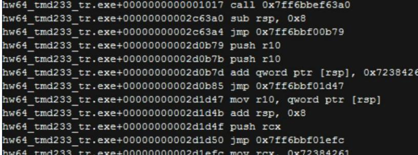
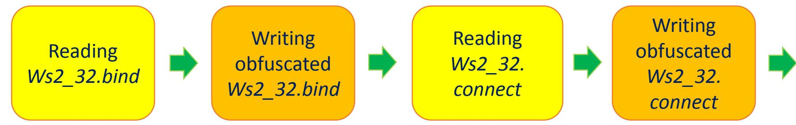
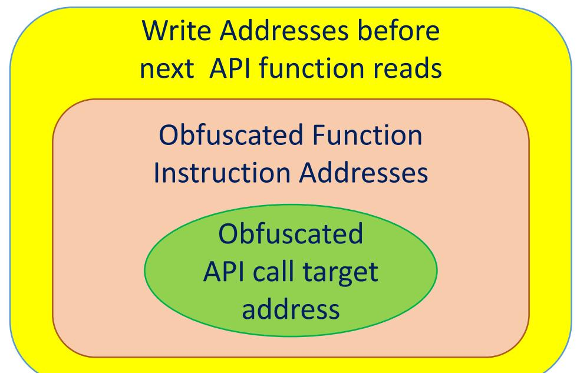
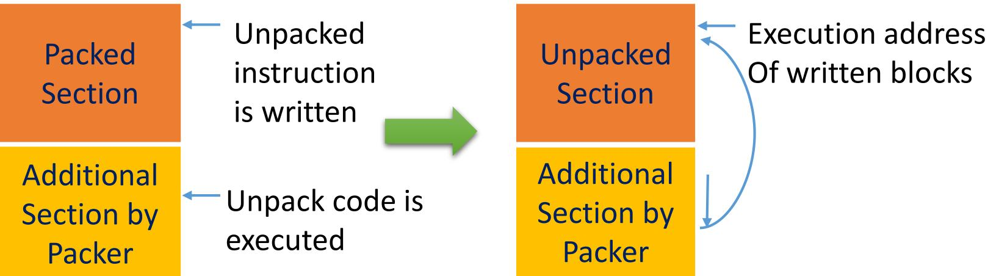
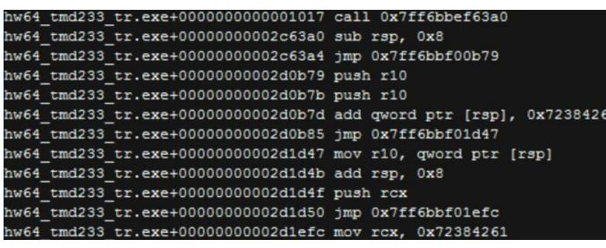
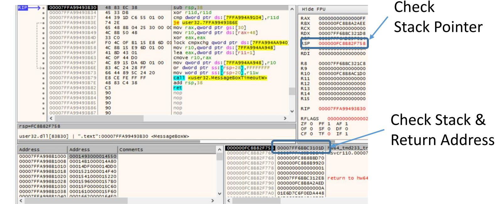
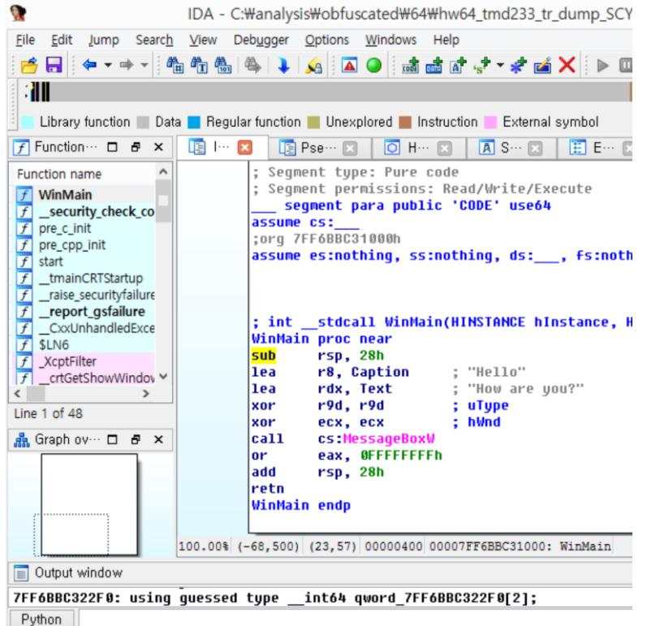
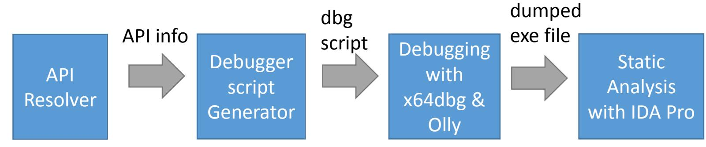

### API Deobfuscator: Reso Wing Obfuscated APKFunctions in Modern Packe

black hat

40 1 5 8.6 Seokwoo

- Introduction
- API Deobfuscation Method
	- Memory Access Analysis for Dynamic Obfuscation
	- Iterative Run-until API method for Static Obfuscation
- Implementation
- Demo
- Conclusion

### Why API deobfuscation matters?

- Malwares hide functionalities by API obfuscation
	- Commercial packers obfuscate API functions
	- Malware authors have their own API obfuscator
- No deobfuscation tools for some modern packers
	- x64 packers
	- Custom packers

#### API obfuscation techniques in modern packers

- Dynamic API Obfuscation
	- API functions are obfuscated during runtime
	- Instructions and addresses changes every run

| helloworldmsgbox32 tiger red.exe+0000100e call 0x68a0000 |
| --- |
| 068a0000 mov edi, edi |
| 068a0002 pushad |
| 068a0003 pushad |
| 068a0004 pushfd |
| 068a0005 jmp Ox68a001a |
| 068a001a xor ecx, 0x2bb296b6 |
| 068a0020 jmp 0x68a0031 |
|  |
| 068a032e pop eax |
| 068a032f call 0x777de9ed |
| user32.dll+0005e9ed mov edi, edi |
| user32.dl1+0005e9ef push ebp |

Branch into a newly allocated block during execution time (obfuscated User32.dll :MessageBox)

### API obfuscation technique modern packers

- Static API Obfuscation
	- API functions are obfuscated compile(packing) time
	- Instructions and addresses are the same

Branch into other section

#### API Call by 'ret' instruction

### API Deobfuscation Goal

- After deobfuscation, we have
	- (Near) original entry point
	- Recovered API function calls at OEP
- With the deobfuscated image, we can do
	- Static analysis with disassembled and decompiled code
	- Dynamic analysis with debuggers

## API Deobfuscation Methods

- How to deobfuscate API obfuscated binaries?
	- Dynamic API Obfuscation
		- → Memory Access Analysis
	- Static API Obfuscation
		- → Iterative Run-until-API Method
- How to evade anti-debugging?
	- Dynamic binary instrumentation (Intel Pin)
	- Anti-anti-debugger plugin in debuggers
	- Emulators

### blackhat USA 2015

### API Deobfuscatio Dynamic Obfusca

### API Deobfuscation for Dynamic Obfuscators

- Memory Access Analysis
	- Relate memory reads on API function code and corresponding memory writes on obfuscated code
		- Instruction addresses of obfuscated API function → Original API function
	- Recover original API function by the obfuscated call target address

### Dynamic Obfuscation Process

- What happens during runtime obfuscation?
	- Runtime obfuscator reads each function, obfuscates each instruction, writes the obfuscated code into a newly allocated memory
	- Each function is obfuscated in sequence

### Memory Access Analysis

- How can we identify the original API function?
	- Record every memory write before the next API function or DLL reads
	- Limit the number of memory write for the last API function

# How to find OEP

#### • Find OEP

- Record every memory write and execute
- OEP is the Last written address that is executed
- Check written memory blocks (1 block = 4 Kbytes) to save memory
- OEP is in the original executable file sections

## Obfuscated Call Identification

- Search for intermodular calls at OEP by pattern matching
	- Matched patterns may contain false positives
	- After target address resolution, misinterpreted instruction disappears

| C *G.P.U* - main thread, module HelloWor |  |  |  | ក X 0 |
| --- | --- | --- | --- | --- |
| 012C1000 1 6A 00 | PUSH QRB |  | Registers (FPU) |  |
| 012C1002 1. 68 10212C01 | PUSH Hellowor. 012C2110 | UNICODE "Hello" | EAX 0920FC00 |  |
| 015C1007 1 . 68 1CS12C01 | PUSH Hellowor. 0120211C | UNICODE "How are you?" | ECX 014BFB5A HelloWor. 014BFB5A |  |
| 012C100C . 6A 00 | PUSH BRO |  | EDX ИОЗНИНИИ |  |
| 01SC100E . E8 EDEFESEE | CALL 011F0000 |  | EBX 014BDCC3 Helloldor. 014BDCC3 |  |
| 012C1013 . 90 | NOR |  | ESP 0020FBEC |  |
| 012C1014 . 83C8 FF | OR EAX. ORFFFFFFFFFF |  | ERR BRANSMIN |  |
| 01201017 L. C2 1000 |  |  |  |  |
| 012C101A . 3B 00 00 | R Found intermodular calls |  |  | 三 |
| 012C101D |  |  |  |  |
| 012C101E 2C |  |  |  |  |
| 012C101F 01 | Address Disassembly | Destination |  |  |
| 012C1020 75 |  |  |  |  |
| 012C1021 · 02F3 |  |  |  |  |
| 015C1023 1 . C3 |  |  |  |  |
| 012C1024 Ed |  |  |  |  |
| 012C1825 FB |  |  |  |  |
| 012C1026 192 |  |  |  |  |
| 012C1027 ાિષ |  |  |  |  |
| 012C1028 . 00B8 4D5AB000 012C1268 CALL 663F0F2B |  |  |  |  |
| 012C102E . 66:3905 00003 012C1282 CALL 663E6E8C |  |  |  |  |
|  | 012C12A3 CALL Hellowor. 012C146C |  |  |  |
| 012C1037 > 33CB | 012C12C0 CALL 66437164 |  |  |  |
| 01201039 .vEB 34 | 012C12D0 CALL 663F0D9B |  |  |  |
| 012C103B  > 8B0D 3C002CB1 012C12EA CALL 01F0997 |  | kernel32. IsDebuggerPresent |  |  |
| 012C1041 . 81B9 00002C01 012C132F DB E8 |  |  |  |  |
| 01201048 . ^75 EA | 012015F4 PUSH EAX | (Initial CPU selection) |  |  |
| 01301010 DO RDG1000 | 012C15F5 CALL 011F06C2 |  |  |  |
|  | 012C1604 CALL 011F07A0 | kernel 32. Get Current ThreadId |  |  |
|  | 012C160D CALL 011F0D2E | kernel 32. Get Tick Count 64 |  |  |
|  | 012C161A CALL 011F07HS |  |  |  |
|  | 012C1678 CALL 663D043F |  |  |  |
| Address   Value Comment | 012C167A CALL 011F099C |  |  |  |
|  | 012C16B2 CALL EST |  |  |  |
| 01202000 011F02FB | 012C16BF CALL 663E6C84 |  |  |  |
| 012C2004 011F06C2 |  |  |  |  |
| 012C2008  011FB7A0 | 012C16FB CALL EST |  |  |  |
|  | 012C1738 CALL Hellowor. 012C1870 |  |  |  |
| 012C200C  011F07A5 | 012C17A2 CALL Hellowor. 012C1882 |  |  |  |
| 012C2010 011F0840 | 012C1842 CALL Hellowor. 012C1888 |  |  |  |
| 012C2014 011F0997 | 012C205F CALL 00005D62 |  |  |  |
| 015CS018 811FB98C |  |  |  |  |
| 012C201C  011F0D2E |  |  |  |  |
| А12С2В2В ИВИНИИИИ |  |  |  |  |

- Direct call resolution
	- If the call targets are in the constructed map from obfuscated addresses to API function, modify call targets to the original API function address
	- Generate a text file that contains resolved API function calls and OEP

- Indirect call resolution
	- Original segments (.text, .idata, ...) are merged into one segment by packing
	- Identify a memory block that contains successive obfuscated API function addresses
	- Modify obfuscated call addresses in the IAT candidate with the original API function

#### • Example: API Deobufscation Information

| OEP:0000112d |  |  |
| --- | --- | --- |
| 00002000 | addr ntdll.dll | RtlDecodePointer |
| 00002004 | addr kernel32.dll | GetSystemTimeAsFileTime |
| 00002008 | addr kernel32.dll | GetCurrentThreadId |
| 0000200c | addr kernel32.dll | QueryPerformanceCounter |
| 00002010 | addr kernel32.dll | lsProcessorFeaturePresent |
| 00002014 | addr kernel32.dll | IsDebuggerPresent |
| 00002018 | addr ntdll.dll | RtlEncodePointer |
| 0000201c | addr kernel32.dll | GetTickCount64 |
| 0000203c | addr ntdll.dll | RtlFreeHeap |
| 0000209c | addr user32.dll | MessageBoxW |
| 0000100e | call user32.dll | MessageBoxW |
| 0000107f | call ntdll.dll | RtlEncodePointer |
| 000012ea | call kernel32.dll IsDebuggerPresent |  |
| 000015f5 |  | call kernel32.dll GetSystemTimeAsFileTime |
| 00001604 | call kernel32.dll GetCurrentThreadId |  |
| 0000160d | call kernel32.dll GetTickCount64 |  |
| 0000161a |  | call kernel32.dll QueryPerformanceCounter |
| 0000167a | call ntdll.dll | RtlEncodePointer |
| 7 |  |  |

Addresses are in RVA

### Debugging Deobfuscated Binary

- Generating a debugger script to resolve API calls
	- The text file generated by the memory access analyzer contains OEP, resolved obfuscated addresses
	- Implemented a python script to generate a debugger script that execute until OEP and resolve obfuscated addresses

### Reversing with API Deobfuscator

- Debugging x86 binary with Ollydbg after running deobfuscation script

| KernelMode - f9cc17734b51eae340b942e85418deb0.exe |  |  |  |  |  |  |
| --- | --- | --- | --- | --- | --- | --- |
| File View | Debug Plugins Options Window Help |  |  |  |  |  |
| 44 × |  |  | >   * * 2 . 2 = L E M T WH C / K B R ... S |  | EHR |  |
|  |  | C   * G.P.U * - main thread, module f9cc1773 |  |  |  |  |
|  | 0048796B RECE 12 |  | XUR EHX EHX |  |  | Realsters (FPU) |
|  | 8848796D 68 80 |  | PUSH BAG |  |  |  |
|  | 8048796F . 394424 BB |  |  |  |  | ERX 8888888 |
| M   Memory map | PB487973 | . 68 00100000 | BBBING HSUA | CHP DWORD PTR SS: [ESP+0x8], EAN |  | ECX 1269E4E5 |
|  | 80487978 . BF94C8 |  | SETE AL |  |  | EDX 7FFB8000 EBN 80674C98 F9cc1773.80674C98 |
| Address Size | 88487978 . 58 |  | XDB HSTId |  |  | ESP 0012F774 |
| 00010000 0001000 | 0048797C | E8 A3765276 | CALL | kerne   32. HeapCreate |  |  |
| 00828000   0000101 | 00487981 98 . |  | NOP |  |  |  |
| 88120888 8888181 | 08487982 - 851 M |  | TEST EAX. |  | R Found intermodular calls |  |
| 8812 FREA REBREPH | 00487984 | . A3 04A05600 | MOU DWORD |  |  |  |
| 80138888 8888481 | 88487989 V 4 36 |  | JE SHORT |  |  |  |
| 80148088   BREAI PI | 0948798B |  | CALL F900 |  | Address   Disassembly | Destination |
| 00150000 0000100 | 00487998 | · 83F8 83 | CMP EAX 0 |  | 00487675 CALL kernel 32. GetFileType | kernel32. GetFileType |
| 00168088   0088181 | 00487993 | . A3 08H05600 | MOU DWORD | 00487608 | CALL kernel 32. Get StdHandle | kernel 32. Bet StdHandle |
| 00170000 0000101 | 88487998 .v75 00 |  | JNZ SHORT |  | 804876E6 CALL kernel 32. GetFileType | kernel 32. GetFileTupe |
|  | 0049799A | . 68 F8030000 | PUSH B& SFI |  | 0048771D CALL kernel 32. SetHandleCount | kernel 32. SetHandleCount |
| 00180000 0006701 001F8000 0008301 | 8848799F | · E8 D1380000 | CALL f900 |  | 0048772E CALL kernel32. TIsAlloc | kerne Sc. TISAL Loc |
| 00288888 8888381 | 88487994 . 59 |  | POP ECX |  | 00487756 CALL kernel32. TisSetUalue | kernel32. TisSet Jalue |
| BR2CARBA 8000181 | 00487995 · VEB OA |  | JMP SHORT | 00487767 | CALL kernel 32. GetCurrent Threadly | kerne   32. GetCurrent Threadly |
| 00208000 0000100 | 004879A7 > 83F8 02 |  | CMP EAX B | 0048779F | 00487791 CALL kernel32. GetLastError CALL kernel 32. TisGetUalue | KERELER, GetLastError kernel32. TisGetJalue |
| 002E0000 0000100 002F0000 0000601 | 684879HR .v75 18 884879AC |  | JINZ SHORT CALL F900 | 004877C3 | CALL kernel32. TisSetUalue | kernel32. TisSetUalue |
| 00388000   8881881 | 00487981 | : E8 0B440000 | TEST ERX. |  | 004877D4 CALL kernel 32. GetCurrent ThreadId | kernel 32. Get Current ThreadId |
| 00310000 0000100 | 00487983 . v 75 OF |  | JNZ SHORT | 004877EB | CALL kernel 32. SetLastError | ntdl   Rt  SetLastWin32Error |
| 00378000 8001FBI | 89487985 | · FF35 04805600 PUSH DWOR |  |  | 00487800 CALL kernel32 GetModuleHandleR | kernei 32. Get ModuleHandleR |
| 00390000 0000101 | 004879BB | E8 DDB58176 | CALL kern | 00487842 00487877 | CALL kernel32. GetUersionExA CALL kernel 32. GetEnvironment VariableR | kernel 82. Get Version ExA |
| BBS8000 BBBBSBI | 00487908 : 90 co |  | NOP |  |  | kernel 32. GetEnvironment VariableR |
| 003F0000 0000100 |  |  | VOD COV. E | 08487807 | CALL kernel 32. Get Module File Name R | kerne 132. Get Module File Name R |
| 00400000 0000101 | EAX=00000001 |  |  | 03487970 | CISCUL kernel 32. HeapCreate | [Initial CPU selection] |
|  | JUND from 08487998 |  |  | 00487988 | CALL kernel 32. HeapDestroy | kerne  32 HeapDestrou |
| 00401000 001680 |  |  |  |  |  |  |
| BOSCOBB 8001FB |  |  |  | 00487A6E | CALL kernel32. GetModuleFileNameR | kernel 32. Get Module File Hame R |
|  |  |  |  |  | 00487844 CALL kernel32. GetStdHandle | kernel32. GetStdrandle |
| 99588899 9898181 |  |  |  |  |  |  |
| 0058C000 800FE01 | Address Ualue | Comment |  | 00487848 | CALL kernel32. WriteFile | kernel32.WriteFile |
| BB68A000 BBBE501 |  |  |  | 88487899 | CALL kernel 32. Get Module HandleR | kernel 32. Get Modu LeHandleR |
|  | 60494FF8 BREGREE |  |  | 00487889 | CALL kernel 32. GetProcAddress | kernel 32. Get ProcAddress |
| 0076F000 0000100 | 80404FFC BREACH BOOK |  |  | 06488H74 | CALL 00801866 |  |
| 00770000 0010101 | RB405000 RESERVED |  |  |  |  |  |
| 00880000 0000100 | 88495884 6388 11888 |  |  | 80489818 | CALL ESI |  |
| 00890000 0000101 |  |  |  | 99438071 |  | CALL ntdll RtlInitializeCriticalSection ntdll.RtlInitializeCriticalSection |
| 00800000   0000201 | BRAHSURR ROHI 8582 |  |  | 004888880 | CALL ntdll. Rt IEnter Critical Section | ntdll.RtlEnterCriticalSection |
|  | 884A508C BSA105ES |  |  | 004 88898 | CALL ntdll. RtlLeaveCriticalSection | ntdll. Rt Leave Critical Section |
| 008880000 0000101 | 08495010 83410804 |  |  | 884 39200 | CALL kernel32. SetEnvironmentUariableR | kernel 32. SetEnvironment UariableR |
| 00808000 0000201 | 084A5014 03A10801 |  |  |  |  |  |
| 00800000 0000100 | 08495018 66381868 |  |  | 0048AF92 | 0048AF76 CALL kernel32 LCMapStringW | kernel 32. LCHapStringli |
| 008E8088  8000101 | 88495810 BCR18022 |  |  | 80489FDB | CALL kernel 32. LCMapStringA CALL kernel32.LCMapStringA | kerne 132. LCMapStringA kernel32.LCMapStringA |
| 008F0000 0000101 | 084A5828 83810E26 |  |  |  | 0048B013 CALL kernel32.MultiByteToWideChar | kernel 32. MultiByte Tollide Char |
| 00900000 0002E01 | 00495824 00000000 |  |  |  | 0048806B  CALL kernel32. Mult   ButeToWideChar | kernel 32. MultiBute Towide Char |
| ସମ୍ପର୍ଗପସ୍ଥିତ । ସମସ୍ତ 3481 | 804A5828 71DE6282 |  | AUIEIL82. AUIStrea |  |  |  |
| 016FD088  0000201 | 0046582C 71DF1011 | RUIFIL82. AUIStreamGetrrame |  |  | PARTY CHILIPS ME | LALOLOLOLAR |
| 016FF000 0000100 | 00495030 80800000 |  |  |  | 0012F7B8 | 228888885 |
| 017FD888  0880201 |  | 004A5834   6F921739   conct 132. In   tCommon Controls |  |  | 0812F784 | CORDERBI |
| 017FF000 0000100 |  | 004R5838 6F92R197   comot 132. InageList SetBkColor |  |  | 0012F7B8 | BBC08881 |
| 018FD000 0000201 | 38355888. | 6F920910 conot 132. InageList_Get InageCount |  |  | 0812F7BC | F7C68881 |
| 018FF000 0000101 |  | 004A5848 EF927CF1 conct 132. InageList_Destroy |  |  | 8812F708 | F (CHORRY) |
| 819FD888   8880201 |  | BB4R5044   6F92DE13   conot 132. ImageList_Read |  |  | 8812F7C4 | 0066L306  +9001778. B066C306 |
| 019FF008 8088161 | 084HE648 88850083 | comct 132. Imagel ist_Duplicate |  |  | 0012F7C8 | FZD2FZD4 |
|  |  |  |  |  | 0812F7CC | 08810812 |
|  | 00495840 CE986FEF | comot 132. ImageList_GetIcon |  |  | 00125200 | 02878880 |
|  |  | CENTRAL PR |  | Udil USeros. FUSTUNITIESSay |  | APERIO |
|  | 5200 | NOV 20, 8009ef30 |  |  |  |  |
|  | 5281 5202 | add ad. exe addr asm a8. "call kernel 32. CloseHandle |  |  |  | 408888 9EF30 491230 |
|  | 5283 | MOU a0, 8009efa6 |  |  |  |  |
|  | 5204 | add ad. exe addr |  |  |  | 480000 9EFH6 |
|  |  | asm a0, "call user32.UnregisterCla |  |  |  | 4911-12 |

### Reversing with API Deobfu

- Decompiled code with dumped file

|  |  |  | IDA - C:WanalysisWobfuscatedWHelloWorldMsgbox32_tiger_red_dump_SCY,exe |  |  |  |  |  | X |  |  |  |  |  |
| --- | --- | --- | --- | --- | --- | --- | --- | --- | --- | --- | --- | --- | --- | --- |
| Edit Jump Search View |  |  | Debugger Options Windows Help |  |  |  |  | File |  |  |  |  |  |  |
| Library Tunction |  | Data | Regular function | Unexplored |  | External symbol |  |  |  |  |  |  | Instruction |  |
| f Functions w ... D |  |  | IDA ... |  |  | St ... |  |  |  |  |  |  |  | O Hex ··· |
| Line 1 of 278 |  |  |  |  |  |  |  |  |  |  |  |  |  |  |
|  |  | । ਦੇ |  |  |  |  |  |  |  |  |  |  |  |  |
| __ XcptFilter |  |  |  |  |  |  |  |  |  |  |  |  |  |  |
| sub_DD1472 |  |  |  |  |  |  |  |  |  |  |  |  |  |  |
| sub_DD1478 |  |  |  |  |  |  |  |  |  |  |  |  |  |  |
| sub_DD1480 |  |  |  |  |  |  |  |  |  |  |  |  |  |  |
| sub_DD 1590 |  |  |  |  |  |  |  |  |  |  |  |  |  |  |
| sub_DD15C1 |  |  |  |  |  |  |  |  |  |  |  |  |  |  |
| start |  |  |  |  |  |  |  |  |  |  |  |  |  |  |
| sub_DD165B |  |  |  |  |  |  |  |  |  |  |  |  |  |  |
| suh DD165F |  |  |  |  |  |  |  |  |  |  |  |  |  |  |
| Output window |  |  |  |  |  |  |  |  | 0 6 |  |  |  |  |  |
| Command "JumpOpXref" failed |  |  |  |  |  |  |  |  |  |  |  |  |  |  |
| Python |  |  |  |  |  |  |  |  |  |  |  |  |  |  |
|  |  |  |  |  |  |  |  |  |  |  | Disk: 41GB |  |  |  |
| Function name |  |  | lgned int |  | 11 sub DD1000(int a1, int a2, |  | Int a3. Int a4) |  |  |  |  |  |  |  |
|  |  | D 3 |  |  |  |  |  |  |  | MessageBoxW(0, L"How are you?", L"Hello", 0); |  |  |  |  |
|  |  | 0 1 | return -1; |  |  |  |  |  |  |  |  |  |  |  |
| Graph overy ... D |  |  |  |  |  |  |  |  |  |  |  |  |  |  |
| sub_DD1000 |  |  |  |  |  |  |  |  |  |  |  |  |  |  |
| sub_DD12E7 |  |  |  |  |  |  |  |  |  |  |  |  |  |  |
|  |  |  | 0000400 sub DD1000:1 |  |  |  |  |  |  |  |  |  |  |  |
| sub_DD145E |  |  |  |  |  |  |  |  |  |  |  |  |  |  |
| ac : | idle |  |  |  |  |  |  |  |  |  |  | Down |  |  |
| sub_DD141D |  |  |  |  |  |  |  |  |  |  |  |  |  |  |
| sub_DD14D0 |  |  |  |  |  |  |  |  |  |  |  |  |  |  |

### blackhat USA 2015

#### API Deobfuscatio Static Obfusca 10

### API Deobfuscation for Static Obfuscators

- Static obfuscation pattern at OEP
	- Obfuscated call pattern
		- "Call qword ptr [ ]" is changed into "Call rel32" when obfuscated
	- Obfuscated call run into API function
		- Stack shape is preserved
		- API call instruction and the first few instructions in the API function are obfuscated
		- After executing obufscated instructions, execution reaches an instruction in the original API function

### Obfuscated Call Identification

- Search obfuscated call by pattern
	- CALL rel32 is a candidate
	- Check whether the address is in another section of the process

| 1000 | 48 83 EC 28 | sub rsp.28 |
| --- | --- | --- |
| 1004 | 4C 8D 05 BD 11 00 00 | lea r8.gword ptr ds:[7FF6BBC321C8] |
| 100B | 48 8D 15 C6 11 00 00 | lea rdx, gword ptr ds: [7FF688C321D8] |
| 1012 | 45 33 C9 | xor r9d.r9d |
| 1015 | 33 C9 | xor ecx,ecx |
| 1017 | E8 84 53 2C 00 | call hw64_tmd233_tr.7FF6BBEF63A0 |
| 101C | 00 83 C8 FF 48 83 | add byte ptr ds:[rbx-7CB70038],a1 |
| 1022 | C4 | 335 |
| 1023 | 28 C3 | sub bl.al |

| 10B9 E8 EF 11 2D 00 |  | ca11 hw64_tmd233_tr.7FF6BBF022AD |
| --- | --- | --- |
| TOBE | 00 48 83 | add byte ptr ds:[rax-7D],cl |
| TOC1 | ਟਰੇ | leave |
| TOCS FF E8 |  | imp far EA: 0 |
| 10C4 01 B7 2C 00 00 48 |  | add dword ptr ds:[rdi+4800002C],esi |

Call rel32; db 00 '00' after call break alignment so thataA few incorrect disassembled code occur

### Obfuscated Call Resoult

- Obfuscated code is executed until API function
- Run-until-API method
	- Change RIP into candidate API call address
	- Run until API function

32 d11+0000000000083b37 cmp dword ptr [ri

Obfuscated Call Start

Execute until API address is met

- Integrity check
	- We need to check whether the stack pointer and the stack content is preserved after executing obfuscate call

### Iterative run-until-API Met

- Apply run-until API method repeatedly on candidate obfuscated calls
	- Save context & Restore

| 00000000000001017 | call | user32.dll MessageBoxW |  |
| --- | --- | --- | --- |
| 000000000000010b9 | call | msvcr110.dll | set app type |
| 000000000000010c3 | call | ntdll.dll RtlEncodePointer |  |
| 0000000000000110f | call | msvcr110.dll | setusermatherr |
| 00000000000001121 | call | msvcr110.dll | configthreadlocale |
| 0000000000001174 | call | msvcr110.dll | getmainargs |
| 000000000000012fc | call | msvcr110.dll | exit |
| 0000000000000130b | call | msvcr110.dll | cexit |
| 0000000000000132e | call | msvcr110.dll | ismbblead |
| 0000000000000135e | call | msvcr110.dll | exit |
| 0000000000000136e | call | msvcr110.dll | cexit |
| 00000000000001395 | call | kernel32.dll | IsDebuggerPresent |
| 000000000000014fc | COLO | msvcr110.dll | XcntFilter |

### Iterative run-until-API Method

- Iterative run-until-API method can be applied to various packers
	- VMP: API function call is virtualizationobfuscated
	- Themida64: API function call is mutated
	- Obsidium: The first few instructions in an API function are obfuscated
	- Custom packers
	- But, at last, execution is redirected into a real API function

### Reversing with API Deobfuscator

- Debugging x64 binary with x64DBG after deobfuscation

| x64_dbg - File: hw64_tmd233_tr.exe - PID: B20 - Module: hw64_tmd233_tr.e |  |  |  |  |
| --- | --- | --- | --- | --- |
| File View Debug Plugins Options Help |  |  |  |  |
| 一个 1 十二十二十四六年之学 8 2 |  |  | Az @ 9 @ |  |
| CPU Log · Breakpoints Memory Map Call Stack |  | <> Script |  | 0 Re |
| 00007FF6BBC31000 48 83 EC 28 sub rsp.28 |  |  |  |  |
| 00007FF6BBC31004 4C 8D 05 BD 11 00 00 |  | 1ea r8, gword ptr ds: [7FF68BC321C8] |  |  |
| 00007FF6BBC3100B 48 8D 15 C6 11 00 00 |  | 1ea rdx, gword ptr ds: [7FF6BBC321D8] |  |  |
| 00007FF6BBC31012 45 33 C9 xor r9d.r9d |  |  |  |  |
| 00007FF6BBC31015 33 C9 xor ecx.ecx |  |  |  |  |
| 00007FF6BBC31017 FF 15 03 11 00 00 |  | call gword ptr ds:[k&MessageBoxW>] |  |  |
| 83 C8 FF 00007FF6BBC3101D or eax. FFFFFFFF |  |  |  |  |
| 00007FF6BBC31020 48 83 C4 28 add rsp.28 |  |  |  |  |
| 00007FF6BBC31024 C3 ret |  |  |  |  |
| 00007FF6BBC31025 CC int3 |  |  |  |  |
| 00007FF6BBC31026 CC 1nt3 |  |  |  |  |
| 00007FF6BBC31027 CC 1nt3 |  |  |  |  |
| 00007FF6BBC31028 CC 1nt3 |  |  |  |  |
| 00007FF6BBC31029 CC int3 |  |  |  |  |
| 00007FF6BBC3102A CC 1nt3 |  |  |  |  |
| 00007FF6BBC3102B CC int3 |  |  |  |  |
| 00007FF6BBC3102C CC 1nt3 |  |  |  |  |
| 00007FF6BBC3102D CC int3 |  |  |  |  |
| 00007FF6BBC3102E CC 1nt3 |  |  |  |  |
| 00007FF6BBC3102F CC 1nt3 |  |  |  |  |
| 00007FF6BBC31030 CC int3 |  |  |  |  |
| 00007FF6BBC31031 CC int3 |  |  |  |  |
| eax=C128A22B |  |  |  |  |
| hw64_tmd233_tr.exe[101D]   " ": 00007FF6BBC3101D |  |  |  |  |
| Address Address Comments |  |  |  |  |
| 00007FF6BBC32000 00007FFA992D1340 kerne132. GetCurn ntThreadId |  |  |  |  |
| 00007FF6BBC32008   00007FFA99201610   kernel32. GetSystemTimeAsFileTime |  |  |  |  |
| 00007FF6BBC32010 00007FFA9920168C kernel32.GetTickCount64 |  |  |  |  |
| 00007FF6BBC32018   00007FFA992D2060   kernel32 . IsDebuggerPresent |  |  |  |  |
| 00007FF688C32020100007FFA992D9004 kerne132.IsProcessorFeaturePresent |  |  |  |  |
| 00007FF6BBC32028   00007FFA99201350   kerne132. QueryPerformanceCounter |  |  |  |  |
| 00007FF6BBC32030 00007FFA97115308 msvcrt.void _cdec] terminate(void) |  |  |  |  |
| 00007FF6BBC32038 00007FFA97123310 msvcrt._XcptF1lter |  |  |  |  |
| C snecific handler | UNDOZEERRC 32040   UOON7EFA99922800   ntd11 |  |  |  |

Run correctly with resolved API call

### Reversing with API Deobfus

#### • Dumping x86/64 binary and static analysis with IDA Pro

| Address |  | Ordinal | Name | Library |
| --- | --- | --- | --- | --- |
| 四 | 00007FF6. |  | GetCurrentThreadid | kernel32 |
| 阿 | 00007FFF6 ... |  | GetSystemTimeAsFileTime | kernel32 |
| ਲਵੀ | 00007FFF6 ... |  | GetTickCount64 | kernel32 |
|  | 00007FFF6 ... |  | IsDebuggerPresent | kernel32 |
| જી | 00007FFF6 ... |  | IsProcessorFeaturePresent | kernel32 |
|  | 00007FFF6 ... |  | QueryPerformanceCounter | kernel32 |
| ਲਵੀ | 00007FFF6 ... |  | ?terminate@@YAXXZ | msvcrt |
| P | 00007FFF6 ... |  | XcptFilter | msvcrt |
| ਲਵੀ | 00007FFF6 ... |  | C_specific_handler | msvcrt |
| P | 00007FFF6 ... |  | crtCapturePreviousContext | msvcr110 |
| や言 | 00007FF6 ... |  | crtGetShowWindowMode | msvcr110 |
| P | 00007FF6 ... |  | crtSetUnhandledExceptionFilter | msvcr110 |
| P | 00007FFF6 ... |  | crtTerminateProcess | msvcr110 |
| 191 | 00007FF6 ... |  | crtUnhandledException | msvcr110 |
| ਲ | 00007FFF6 ... |  | crt_debugger_hook | msvcr110 |
| ਅਵੀ | 00007FFF6 ... |  | dllonexit | msvcrt |
| 的 | 00007FFF6 ... |  | acmdln | msvcr110 |
| P | 00007FFF6 ... |  | fmode | msvcr110 |
| 男 | 00007FF6 ... |  | commode | msvcr110 |
|  | NE 00007FF6 ... |  | getmainargs | msvcrt |

#### IAT recovered

#### API call recovered

### blackhat USA 2015

#### Implementati (0)

### Implementation Detail

- Pin tool to resolve API Address
	- Windows 8.1/7 32/64 bit (on VMWare)
	- Visual Studio 2013
	- Intel Pin 2.14
- Python script to patch obfuscated call
- Reversing tools
	- X64dbg
	- IDA

## Deobfuscation Process

## blackhat USA 2015

#### D emo

### Reversing Packed Binary with API Deobfuscator

- Packed 32/64 bit samples
- Commercial packer packed 32bit malware

## blackhat USA 2015

### Conclusion

- Suggested two methods for API deobfuscatoin
	- Memory access analysis for dynamic obfuscation
	- Run-until-API method for static obfuscation
- Commercial packer protected binary can be analyzed using API deobfuscator
	- Using debugger
	- Using disassembler & decompiler

- Depending on DBI tools
	- Packers can detect DBI tools
		- Defeating the transparency feature of DBI (BH US'14)
		- Ex) Obsidium detect Intel Pin as a debugger
	- DBI tools crash in some applications
- Static whole function obfuscated code cannot be deobfuscated
	- No instructions in the original API function is executed when the whole function is obfuscated

- Anti-anti-debugging
	- Building x86/64 emulator for unpacking
- API function resolution
	- Code optimization and binary diffing for static whole function obfuscation
	- Backward dependence analysis for custom packers

