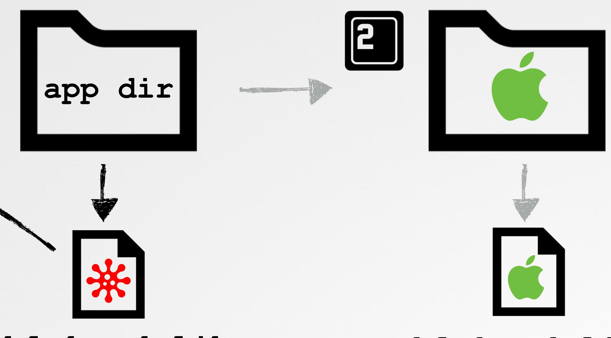
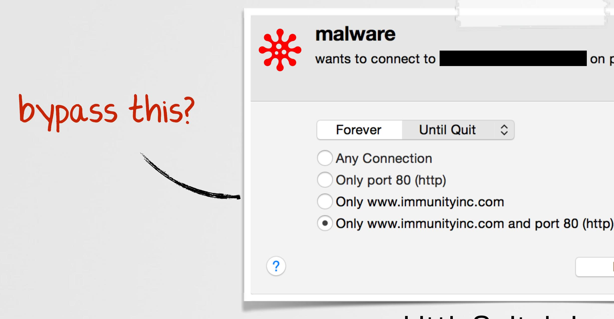
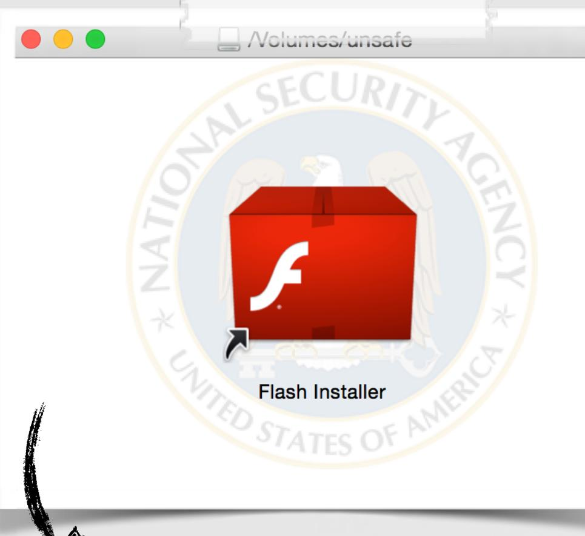
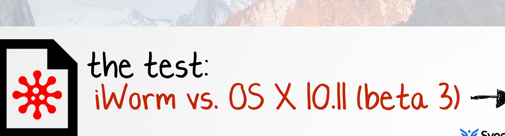

# Writing Bad @$$ Malware for OS X

# WHOIS

# @patrickwardle

always looking for more experts!

"sources a global contingent of vetted security experts worldwide and pays them on an incentivized basis to discover security vulnerabilities in our customers' web apps, mobile apps, and infrastructure endpoints."

## AN OUTLINE this talk will cover...

### overview of os x malware

### persistence self-defense

# OVERVIEW OF OS X MALWARE the current status quo

# THE RISE OF MACS macs are everywhere (home & enterprise)

### #3 usa / #5 worldwide vendor in pc shipments

# MALWARE ON OS X? but macs don't get malware…right?

"It doesn't get PC viruses. A Mac isn't susceptible to the thousands of viruses plaguing Windows-based computers." -apple.com (2012)

os x malware famillies

### "[2014] nearly 1000 unique attacks on Macs; 25 major families" -kasperksy

# OSX/XSLCMD provides reverse shell, keylogging, & screen capture

cstring:0000E910

- db 'clipboardd',0
- db 'com.apple.service.clipboardd.plist',0
- db '/Library/LaunchAgents',0
- db '<plist version="1.0">',0Ah
	- '<key>RunAtLoad</key>',0Ah

# OSX/IWORM 'standard' backdoor, providing survey, download/execute, etc.

| Type | Name (Order by: Uploaded, Size, ULed by, SE, LE) |
| --- | --- |
| Applications | Adobe Photoshop CS6 for Mac OSX |
| (Mac) | F Uploaded 07-26 23:11, Size 988.02 MiB, ULed by aceprog |
| Applications | Parallels Desktop 9 Mac OSX |
| (Mac) | FF Uploaded 07-31 00:19, Size 418.43 MiB, ULed by aceprog |
| Applications | Microsoft Office 2011 Mac OSX |
| (Mac) | FF Uploaded 07–20 19:04, Size 910.84 MiB, ULed by aceprog |
| Applications | Adobe Photoshop CS6 Mac OSX |
| (Mac) | F Uploaded 07-26 23:18, Size 988.02 MiB, ULed by aceprog |

### infected torrents

fs usage -w -f filesvs /Library/LaunchDaemons/com.JavaW.plist 2000 September 2000 Sept B=0x16b 20 92 3 3 2 3 9 7 8 9 9 writte

survey

launch daemon

| 000 |  | 글 | com.JavaW.plist |
| --- | --- | --- | --- |
|  | com.JavaW.plist |  |  |
| EE ■ | com.JavaW.plist > No Selection |  |  |
| Key |  | Type | Value |
| V Root |  | Dictionary | (3 items) |
| Label |  | String | com.JavaW |
| ProgramArguments |  | Array | (1 item) |
| Item 0 |  | + 0 String | > /Library/Application Support/JavaW/JavaW |
| RunAtLoad |  | Boolean | YES |

### launch daemon plist

### persisting

# OSX/WIRELURKER an iOS infector (via USB)

### infected app(s) 'Maiyadi App Store'

# OSX/CRISIS (RCSMAC) hackingteam's implant; collect all things!

### persistence

rootkit component

| SMACI | // modules keywords | #define MODULES KEY | @"modules" |  |
| --- | --- | --- | --- | --- |
| #define MODULES_TYPE_KEY @"module" |  |  |  |  |
| nt; collect all things! | #define MODULES ADDBK KEY @"addressbook" |  |  |  |
| #define MODULES MSGS KEY @"messages" | #define MODULES_POS_KEY | @ position" |  |  |
| #define MODULES DEV KEY @"device" | Object atPatn: (NSString *)aPath | #define MODULES_CLIST_KEY @"calllist" |  |  |
| #define MODULES_CAL_KEY @"calendar" | ease build | @"mic" | #define MODULES MIC KEY |  |
| @ screenshot" | #define MODULES_SNP_KEY | #define MODULES_URL_KEY | @"url" |  |
| vriteToFile: aPath | #define MODULES_APP_KEY | @"application" | atomically: YES]; |  |
| #define MODULES KEYL KEY @"keylog" | #define MODULES_CLIP_KEY @"clipboard" |  |  |  |
| </   A RCSMac >   Thread   >   0 -[ m MUtils saveSLI #define MODULES_CAMERA KEY | @ camera" |  |  |  |
| #define MODULES POSTITON KE | d'nosition' | @"chat" |  |  |
| #define MODULES CHAT KEY | ts/com.apple.loginStoreagent.plist | @"mouse" |  |  |
| #detine MODULES MOUS |  |  |  |  |
| @"call" | #define MODULES C | #detine MODULES PASSW | a password' |  |
| persistence | #define MODULES MONEY KEY | @'money" | @"enabled" | #define MODULES STATUS_KEY |
| features | "There is nothing to be impressed from them from a |  |  |  |
| technical point of view." -@osxreverser |  |  |  |  |
| intelligence collection | ootkit component |  |  |  |

# The (Known) Status Quo the current state of OS X malware

- › trojans
- › phishing/old bugs
- › occasionally exploits

- › well known techniques
- › majority: launch items

persistence

- › minimal obfuscation
- › trivial to detect & remove

self-defense

"current OS X malware, while sufficient, is inelegant, amateur, and trivial to detect & prevent"

stealth

- › 'hide' in plain site
- › stand-alone executables

features

psps bypass

- › inelegantly implemented › suffice for the job
- > no psp detection/logic
- > trivial to detect

# BAD @$$ OS X MALWARE current malware++

# INITIAL INFECTION VECTOR(S) current methods are rather lame

## ects dumb users

### "malware.app" can't be opened because it is from an unidentified developer.

Your security preferences allow installation of only apps from the Mac App Store.

something downloaded this file on an unknown date.

### OK

### Gatekeeper blocking untrusted code

( ?)

somewhat effective, but smart users should be ok.

# Infecting Software Downloads a far better infection channel

### MitM & infect non-SSL'd internet gownloads

my dock

# Infecting AV Software Downloads these should be secure, right!?

avast_free_mac_security.dmg 

bitdefender_antivirus_for_mac.dmg | ...

F-Secure-Anti-Virus-for-Mac_JDCQ-VPGB-RYPY-QQYW-6MY2_ (1).mpkg | ...

LittleSnitch-3.5.1.dmg 

savosx_he_r.zip | ..

eset_cybersecurity_en_.dmg  en .dmg

Internet Security X8.dmg l

TrendMicro_MAC_5.0.1149_US-en_Trial.dmg  ...

NortonSecurity.EnglishTrial.zip l

ksm15_0_0_226a_mlg_en_022.dmg l

# PERSISTANCE current methods are very lame persistence methods

### launch items

# login items

- > well known
	- › easily visible

### MacProtector's login item

$ python knockknock.py

com.apple.MailServiceAgentHelper path: /usr/bin/com.apple.MailServiceAgentHelper

com.apple.appstore.PluginHelper path: /usr/bin/com.apple.appstore.PluginHelper

periodicdate path: /usr/bin/periodicdate

systemkeychain-helper path: /usr/bin/systemkeychain-helper

### wirelurker's 4(!) launch daemons ✈ synack

# BINARY INFECTION? fairly stealthy & difficult to disinfect

# BINARY INFECTION?

# Persistence via Binary Infection (now), lots of options!

### google 'OS.X/Boubou'

difficult to disinfect!

## DYLIB HIJACKING an overview

<blah>.dylib

<blah>.dylib

EAK DYLIB that references a non-existent dylib

LC LOAD* DYLIB with @rpath'd import & multiple LC RPATHs with the run-path dependent library not found in a primary run-path search path

# Dylib Hjacking Persistence via Apple's PhotoStreamAgent ('iCloudPhotos.app')

PhotoStreamAgent

Versions/A/PhotoFoundation

p/Contents/Library/LoginItems/PhotoFoundation.framework/Versions/A/PhotoFou s/iPhoto.app/Contents/Frameworks/PhotoFoundation.framework/Versions/A/PhotoFoundati

novel

no new processes

C no binary/OS modifications

- configure hijacker against PhotoFoundation (dylib)
- copy to /Applications/iPhoto.app/Contents/ Library/LoginItems/PhotoFoundation.framework/

# abuses legitimate functionality of OS X

OS X El Capitan still 'hijackable'

# Plugin Persistence abusing system plugins for persistence

### spotlight importer template

$ reboot lsof -p <pid of mdworker> brary/Spotlight/persist.mdimporter/Contents/MacOS/persist

'on-demand'

| M |
| --- |
| M |
| ロ |

| nce |  | for all file public.da |
| --- | --- | --- |
| Document types | Array | (1 item) |
| ▼ Item 0 | Dictionary | (2 items) |
| Role | String | MDImporter |
| ▼ Document Content Type UTIs | Array | (1 item) |
| ltem 0 | String | public.objective-c-sou |
| plugin match type |  |  |

### ystem/Library/Frameworks/CoreServices.framework/../Metadata.framework/Versions/A/Support/mdworker

### data 'sniffer'

### abuses legitimate functionality of OS X

# SELF-DEFENSE currently, essentially non-existent

### self-defense methods

some crypto

### 'hide' in plain sight

trivial to find

trivial to analyze

trivial to disinfect

### ENCRYPTED MACH-O BINARIES abusing OS X's natively supported encryption //load & decrypt segments load_segment(...){ //decrypt encrypted segments if(scp->flags & SG PROTECTED VERSION_1) unprotect_dsmos_segment(scp->fileoff, scp->filesize, vp, pager_offset, map, map addr, map size); //decrypt chunk unprotect_dsmos_segment(...){ //function pointer to decryption routine crypt_info.page_decrypt = dsmos_page_transform; //decrypt vm_map_apple_protected(map, map_addr, map_addr + map_size, &crypt info); algo: Blowfish ourhardworkbythesewordsguar dedpleasedontsteal (c)AppleC (pre 10.6, AES)

"/the malware] tied the infection to the specific machine, and meant the payload couldn't be decrypted without knowing the NTFS object ID"

"environmental key generation towards clueless agents"

- N: environmental observation
- a one way (hash) function H :
- M: hash(es) H of observation N, needed for activation, carried by agent
- K: a key

//at runtime if H(H(N)) = M then let K := H(N)

# In-Memory Decryption & Loading custom crypto, requires custom loader

C&C server

memory

TIT

local file-system

# In-memory Mach-O Loading dy1d supports in-memory loading/linking

//vars NSObjectFileImage fileImage = NULL; NSModule module = NULL; NSSymbol symbol = NULL; void (*function)(const char *message);

//have an in-memory (file) image of a mach-O file to load/link // ->note: memory must be page-aligned and alloc'd via vm_alloc!

//create object file image NSCreateObjectFileImageFromMemory(codeAddr, codeSize, &fileImage);

//link module module = NSLinkModule(fileImage, "<anything>", NSLINKMODULE OPTION PRIVATE);

//lookup exported symbol (function) " " "HelloBlackHat"); symbol = NSLookupSymbolInModule(module,

//get exported function's address function = NSAddressOfSymbol(symbol);

//invoke exported function function("thanks for being so offensive ;)");

### loading a mach-O file from memory

# SELF DEFENSE other random ideas

### self-monitoring?

### prevent deletion?

### "The schg flag can only be unset in single-user mode"

# chflags schg malware.dylib

# rm malware.dvlib nalware.dylib: Operation not permitted

### 'complicating' deletion

# Run-Time Process Injection getting code into remote processes

## the goal

### external process, architecture detection

google drive

dropbox

## RUN-TIME PROCESS INJECTION target's process architecture

| //remote library loading shellcode (x86 64) |  |
| --- | --- |
| char shellCode[] = |  |
| "\x90" | // nop.. |
| "\x55" | pushq |
| "\x48\x89\xe5" | / movq |
| "\x48\x83\xec\x20" | suba |
| "\x89\x7d\xfc" | / movl |
| "\x48\x89\x75\xf0" | // movq |
| "\xb0\x00" | / movb |
| // call pthread set self |  |
| "\x48\xbf\x00\x00\x00\x00\x00\x00\x00\x00" | // movabso |
| "\x48\xb8" " PTHRDSS" | // movabso |
| "\xff\xd0" | // callq |
| "\x48\xbe\x00\x00\x00\x00\x00\x00\x00\x00" | / / movabso |
| "\x48\x8d\x3d\x2c\x00\x00\x00" | // leag |
| // dlopen |  |
| "\x48\xb8" "DLOPEN | movabso |
| "\x48\xbe\x00\x00\x00\x00\x00\x00\x00\x00" | // movabso |
| "\xff\xd0" | // callq |
| // sleep(1000000)... |  |
| "\x48\xbf\x00\xe4\x0b\x54\x02\x00\x00\x00" | movabso |
| "\x48\xb8" "SLEEP | // movabso |
| "\xff\xd0" | // callq |
| // plenty of space for a full path name here |  |

"LIBLIBLIB" "\x00\x00\x00\x00\x00\x00\x00....";

# Run-Time Process Injection getting code into remote processes

# Load-time Process Injection dylib injection (again) ftw!

no binary / OS file modifications

# 

no complex runtime injection

### gain automatic & persistent code execution within a process only via a dynamic library hijack

### no process monitoring

no detection of injection

# Load-Time Process Injection into Apple's Xcode

$ python dylibHijackScanner.py

Xcode is vulnerable (multiple rpaths) '/Applications/Xcode.app/Contents/MacOS/Xcode' 'binarv' '/DVTFoundation.framework/Versions/A/DVTFoundation' LIC RPATHY: '/Applications/Xcode.app/Contents/Frameworks'

copy to /Applications/Xcode.app/Contents/ Frameworks/DVTFoundation.framework/Versions/A/

compiler now! IK thompson)

### configure hijacker against DVTFoundation (dylib)

# Bypassing Security Products/Technologies ...starting with Apple's

# gateke ber X 1

os x sandbox

code-signing

### so we're all safe now, right?!?

rotect

## nope!

'wins'

# Bypassing Gatekeeper allowing unsigned code to execute

### circumvent gatekeeper's draconic blockage via a dynamic library hijack

# How Gatekeeper Works all files with quarantine attribute are checked

Allow apps downloaded from:

- · Mac App Store
- Mac App Store and identified developers

Anywhere

### "malware.app" can't be opened because it is from an unidentified developer.

Your security preferences allow installation of only apps from the Mac App Store.

"Gatekeeper is an anti-malware feature of the OS X operating system. It allows users to restrict which sources they can install applications from, in order to reduce the likelihood of executing a Trojan horse" -apple.com

### //attributes

$ xattr -l ~/Downloads/malware.dmg com.apple.quarantine:0001;534e3038; Safari; B8E3DA59-32F6-4580-8AB3...

### quarantine attributes

# GATEKEEPER BYPASS go home gatekeeper, you are drunk!

gatekeeper only verifies the app bundle!!

find an £-signed or 'mac app store' app that contains an external relative reference to a hijackable dylib

create a .dmg with the necessary folder structure to contain the malicious dylib in the externally referenced location

#winning

### .dmg/.zip layout

Load command 16 CoreSimulator.framework/Versions/A/CoreSimulator

Load command 30 cmd LC RPATH path @executable_path/../../../SharedFrameworks

Instruments . app - fit's the bill

spct1 tells you if gatekeeper will accept the app

$ spctl -vat execute /Applications/Xcode.app/Contents/Applications/Instruments.app

# GATEKEEPER BYPASS

- 
- 
- 
- 

# GATEKEEPER BYPASS 3) #winning

Allow apps downloaded from:

# (maximum)

### unsigned (non-Mac ADD Store) code execut

# BYPASSING XPROTECT avoiding detection

### circumvent XProtect's malware detection so that malware can run in an uninhibited manner

### bypass this?

(7)

| "Install.app" will damage your computer. You |
| --- |
| should move it to the Trash. |
| It contains the "OSX.iWorm.A" malware. |
| something downloaded this file on an unknown date. |
| V Report malware to Apple to protect other users |
| Cancel Move to Trash |

### XProtect in action (flagging iWorm)

# BYPASSING XPROTECT apple's built-in AV product is weak sauce

|  | ■ XProtect.plist |  |
| --- | --- | --- |
|  | XProtect.plist |  |
| XProtect.plist > No Selection |  |  |
| Key | Type | Value |
| V Item 6 | Dictionary | (3 items) |
| Description CD C | String | ^ OSX.iWorm.A |
| ▼ LaunchServices | Dictionary | (1 item) |
| LSItemContentType | String | com.apple.application-bundle |
| ▼ Matches | Array | (1 item) |
| V Item 0 | Dictionary | (3 items) |
| Identity | Data | <c0800cd5 095b28da 4b6ca0 |
| ▼ MatchFile | Dictionary | (1 item) |
| NSURLNameKey | String | Install |
| MatchType | String | Match |

### XProtect signature file (iWorm)

# ESCAPING THE OS X SANDBOX decently secure, but lots of OS X bugs!

the goal

### escape from the OS X sandbox to so that our malicious code can perform malicious actions.

## [ bypasses ]

20+ bugs that could bypass the sandbox ('project zero')

"Unauthorized Cross-App Resource Access on Mac OS X & iOS"

# Bypassing Kernel-Mode Code Signing allowing unsigned kext to load

# bypass this?

### Kernel extension could not be loaded

The kernel extension at "/Library/Extensions/ unsigned.kext" can't be loaded because it is from an unidentified developer. Extensions loaded from / Library/Extensions must be signed by identified developers.

### load malicious unsigned kexts into the kernel

### OS X kernel-mode signing checks

loadKextsIntoKernel(KextloadArgs * toolArgs)

//sigResult = checkKextSignature(theKext, 0x1, earlyBoot);

//always OK! sigResult = 0;

### patched kextload

### unsigned kext loading

# NEED ROOT? rootpipe reborn!

copy Directory Utility to /tmp to get write permissions

$ ls -lart /private/tmp Directory Utility.app drwxr-xr-x patrick wheel

copy plugin (.daplugin) into Directory Utility's internal plugin directory

### execute Directory Utility

attacker's payload

# BYPASSING SECURITY PRODUCTS ...and the rest (equally lame)

behavioral based (firewall)

# BYPASSING LITTLESNITCH abusing trust to access the network

### generically bypass LittleSnitch to allow malicious code to access the network in an uninhibited manner?

the aga

| nect to | on port 80 (http) |  |
| --- | --- | --- |
| Until Quit く> |  |  |
| ection |  |  |
| 80 (http) |  |  |
| .immunityinc.com |  |  |
| .immunityinc.com and port 80 (http) |  |  |
| LittleSnitch in action | Deny | Allow |

# LITTLE SNITCH BYPASS OX1 load-time 'injection' into a trusted process

$ python dylibHijackScanner.py

GPG Keychain is vulnerable (weak/rpath'd dylib) "binary": '/Libmacgpg.framework/Versions/B/Libmacgpg' 'weak dylib' : 'LC RPATH':

LittleSnitch rule for GPG Keychain

GPG Keychain

...

GPG Keychain: hijacked dylib loaded in /Applications/GPG Keychain.app/Contents/MacQS/GPG Keychain (85436) GPG Keychain: attempting to get data from  GPG Keychain: got response: <!doctype html><htnl itemscope="" itemtype=" lang="en"><head><neta content=" Search the world's information, including webpages, images, videos and more. Google has many special features to hel

### got 99 problems but LittleSnitch ain't one ;)

# '/Applications/GPG Keychain.app/Contents/MacOS/GPG Keychain' '/Applications/GPG Keychain.app/Contents/Frameworks'

| Process | nuie |
| --- | --- |
| GoogleSoftwareUpda ... | * ● Allow any outgoing connection |
| GoogleTalkPlugin | · Allow any outgoing connection |
| 97 GPG Keychain II Messages | ● Allow any outgoing connection |

# LITTLE SNITCH BYPASS OX2 more generically, via iCloud

| Process | On O | Rule |  |
| --- | --- | --- | --- |
| Any Process | 彩 | 7 ● E Allow incoming connections from local network |  |
|  | 彩 | 7 ● E Allow incoming ICMP connections | 8 |
|  | * | 7 ● @ Allow incoming UDP connections | ക |
|  |  | 7 ● E Allow incoming connections from local network | ല |
|  |  | 7 ● @ Allow incoming UDP connections | a |
|  |  | 7 ● E Allow incoming ICMP connections |  |
|  | 20 | Allow outgoing TCP connections to port 443 (https) in domain icloud.com |  |
|  |  | Allow outgoing connections to local network |  |

### LittleSnitch's iCloud rule

o rly!?...yes!

# SIMPLE END-TO-END ATTACK putting some pieces all together

### persist

persistently install a malicious dylib as a hijacker

### exfil file

upload a file ('topSecret') to a remote iCloud account

### download & execute cmd

download and run a command ('Calculator.app')

# doesn't require rOOt!

Synack

# PSP TESTING the AV industry vs me ;)

# DEFENSE free os x security tools

# My Conundrum ...I love my mac, but it's so easy to hack :/

# I should write some OS X security tools to protect my Mac ... and share 'em freely :)

# ha, BULLSHIT!

"No one is going to provide you a quality service for nothing. If you're not paying, you're the product." -unnamed AV company

# OBJECTIVE-SEE free OS X tools & malware samples

# KNOCKKNOCK UI detecting persistence: now an app for that!

| Little Snitch Agent | 0/55 |  |  |
| --- | --- | --- | --- |
| 台 /Library/Little Snitch/Little Snitch Agent.app/Contents/MacOS/Little Snitch Agent | virustotal | info | show |
| UpdaterStartupUtility |  |  |  |
| 吕 /Library/Application Support/Adobe/OOBE/PDApp/UWA/UpdaterStartupUtility | 0/57 |  |  |
|  | virustotal | info | show |
| Creative Cloud |  |  |  |
| 台 /Applications/Utilities/Adobe Creative Cloud/ACC/Creative Cloud.app/Co.../Creative Cloud | 0/56 |  |  |
|  | virustotal | info | show |
| GoogleSoftwareUpdateAgent |  |  |  |
| 台 /Library/GoogleSoftwareUpdate/GoogleSoftwareUpdate.b.../GoogleSoftwareUpdateAgent | 0/57 |  |  |
|  | virustotal | info | show |
| uuid-patcher |  |  |  |
| 님 /Library/Application Support/GPGTools/uuid-patcher | 0/56 |  |  |
|  | virustotal | info | show |
|  |  | scan complete |  |

### KnockKnock (UI)

# KNOCKKNOCK UI VirusTotal integration

### iWor C '님/Users/patrick/Projects/Personal/obj-c/malware/iWorm/JavaW into show irustotal 0/57 台 /Library/GoogleSoftwareUpdate/GoogleSoftwareUpdate.b.../GoogleSoftwareUpdateAgent virustotal info show Q 0/56 台 /Applications/Utilities/Adobe Creative Cloud/ACC/Creative Cloud.app/Co.../Creative Cloud virustotal info show

| SAULLARS COLLEGE TO SHE SHE SULA |  |
| --- | --- |
| /Library/LaunchAgen | startup file: |
| In In Inchil | ANAJARAN ARRECO IN FAMAL |

# TASKEXPLORER

_save

refresh search

## explore all running tasks (processes)

| 000 |
| --- |
| TaskExplorer Flat View |
| 合 1Password mini (1182) |
| Applications/1Password. app/Contents/Library/LoginItems/28UM0452C. com.agilebits. onepassword-oss-hel.per. app/Contents/Ned05/2BURC6F2C. com.agilebits. onepassword-oss-h |
| &adclient (92) |
| /usr/sbin/adclient |
| Adium (887) el |
| /Applications/Adium.app/Contents/MacOS/Adium |
| 음 Adobe CEF Helper (1292) |
| ଡ /Library/Application Support/Adobe/Adobe Desktop Common/HEX/Adobe CEF Helper.app/Contents/MacOS/Adobe CEF Helper |
| Adobe Desktop Service (1291) ଡ |
| /Library/Application Support/Adobe/Adobe Desktop Common/ADS/Adobe Desktop Service.app/Contents/MacOS/Adobe Desktop Service |
| 음 AdobeCrashDaemon (1296) |
| App Lications/Utilities/Adobe Creative Cloud/CoreSync/Core Sync app/Contents/Frameworks/AdobeCrashReporter. Franework/Versions/A/AddeCrashBacmon.app/Contents/MadbeCrashBach09 |
| A AdobeIPCBroker |
| an ITDC / Adaba TOCD malcon o |
| dylibs tiles network |
| 合 Accelerated Math and Image Processing |
| /System/Library/Frameworks/Accelerate.framework/Versions/A/Accelerate |
| ீ AE |
| /System/Library/Frameworks/CoreServices.framework/Versions/A/Frameworks/AE.framework/Versions/A/AE |
| 음 AgileLibrary—Mac |
| /Applications/1Password.app/Contents/Frameworks/AgileLibrary-Mac.framework/Versions/A/AgileLibrary-Mac |
| 음 AirPlaySupport |
| /System/Library/PrivateFrameworks/AirPlaySupport.framework/Versions/A/AirPlaySupport |
| 은 AppContainer |
| /System/Library/PrivateFrameworks/AppContainer.framework/Versions/A/AppContainer |
| & AppKit |
| /System/Library/Frameworks/AppKit.framework/Versions/C/AppKit |
| 合 Apple80211 Framework |
| 1Cuntam II ihnami Musunta Enamal aniea / Ann 1 000714 Enomariano / 1 / Muniana / 1 / Munia 00031 |
| G Q |

|  | filters |  |  |
| --- | --- | --- | --- |
| く> Flat View Q #nonapple | 8 |  |  |
|  |  |  | signing |
| 0/56 ts/MacOS/2BUA8C4S2C.com.agilebits.onepassword-osx-helper virustotal | 1 ◎ info show | ... |  |
| 0/57 | D ◎ |  |  |
| virustotal | info show |  |  |
| 0/56 | 1 ◎ |  |  |
| virustotal | info show |  |  |
| 0/57 | D O |  | virus tot |
| virustotal | info show |  |  |
| 0/56 Service virustotal | D の info show |  |  |
| 0/57 k/Versions/A/AdobeCrashDaemon.app/Contents/MacOS/AdobeCrashDaemon.irustotal | D の |  |  |
|  | info show |  |  |
| 0/56 | 1 ◎ | EX E | dylibs |
| Q Filter Dylibs |  |  |  |
| 0/57 | 1 O |  |  |
| virustotal | info show |  |  |
| ? | D ◎ |  |  |
| virustotal | info show |  | files |
| 0/57 | 1 O |  |  |
| virustotal | info show |  |  |
| ? | D ◎ |  |  |
| virustotal | info show |  |  |
| 0/57 virustotal | ம் の info show |  |  |
|  |  |  | network |
| ? | D の |  |  |
| virustotal | info show |  |  |
| ? | 1 ◎ |  |  |
|  | o |  |  |

# EL CAPITAN (OS X 10.11) next version of OS X to keep us all safe?

System Integrity Protection "A new security policy that applies to every running process, including privileged code and code that runs out of the sandbox. The policy extends additional protections to components on disk and at run-time, only allowing system binaries to be modified by the system installer and software updates. Code injection and runtime attachments to system binaries are no longer permitted." -apple.com

# Questions & Answers feel free to contact me any time!

"What if every country has ninjas, but we only know about the Japanese ones because they're rubbish?" -DJ-2000, reddit.com

### patrick@synack.com

### @patrickwardle

tinal thought :)

# credits

- thezooom.com ।
- deviantart.com (FreshFarhan) ।
- ー

iconmonstr.com

images

- flaticon.com

talks/bool

### @osxreverser

- 
- -
- =
- www.newosxbook.com
- mac hacker's handbook

 SyScan15%20Pedro%20Vilaca%20-%20BadXNU%20a%20rotten%20apple 

