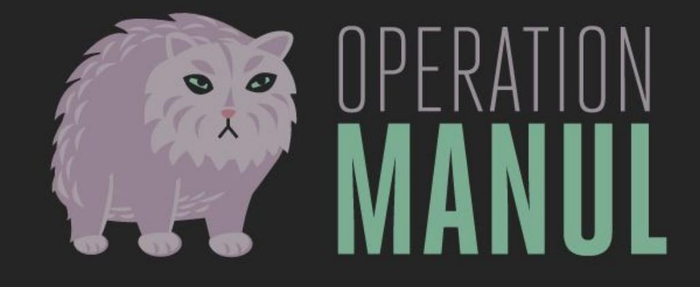
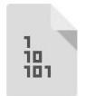

BlackHat USA 2016

# When Governments Attack!

Eva Galperin / Global Policy Analyst / eva@eff.org Cooper Quintin / Staff Technologist / cooperq@eff.org

BlackHat USA 2016

# Whois ?

Eva Galperin

### Cooper Quintin

Morgan Marquis-Boire Claudio Guarnieri

# What is EFF?

"What Binge On does, it includes a proprietary technology and what the technology does is not only detect the video stream but select the appropriate bit rate to optimize to the video, the mobile device. That's part A of my answer. Part B of my answer is, who the fuck are you, anyway, EFF? Why are you stirring up so much trouble, and who pays you?" - John Legere

### Q: Who the Fuck are you, anyway, EFF?

EFF @ @EFF FOLLOWS YOU

We're the Electronic Frontier Foundation. We defend your civil liberties in a digital world.

San Francisco, CA

eff.org Joined August 2006

BlackHat USA 2016

# Legal Work

BlackHat USA 2016

### Q: Why are you stirring up so much trouble?

# Activism

# International Work

MAY 28. 2015 | BY NATE CARDOZO AND EVA GALPERIN

# What Is the U.S. Doing About Wassenaar, and Why Do We Need to Fight It?

On May 20, 2015, the U.S. Department of Commerce's Bureau of Industry and Security (BIS) published its proposed implementation of the December 2013 changes to the Wassenaar Arrangement. What follows is a long post, as we're quite troubled by the BIS proposal. In short, we're going to be submitting formal comments in response, and you should too.

### What is the Wassenaar Arrangement?

The Maccapager Arrangement in a multi national gareement intended to control the event of corrain

BlackHat USA 2016

# Hechnology

# certbot

Automatically enable HTTPS on your website.

### BlackHat USA 2016

# Who pays you?

david carroll @davidecarroll

RETWEETS LIKES

1:50 PM - 7 Jan 2016

पे

6

7

نه

8

0 Following

Hi @JohnLegere, it's people like me that pay @EFF. Hope that answers your question. #WeAreEFF

| David Carroll |  | Property |
| --- | --- | --- |
| Householder |  |  |
| level: | Gold Recurring |  |
| member since: | June 14, 2014 |  |
| exp. date: | Sustaining Donor |  |

2 2 0 0 0 6 2

...

# Targeted Attacks

BlackHat USA 2016

# Ethiopia

BlackHat USA 2016

### Pawn Storm / FancyBear / APT28

Nobody Cares About Kazakhstañ

# Operation Manul

### BlackHat USA 2016

RSS · PDA · TXT · Eng

### 2015 SCORES

### PRESS STATUS Not Free

ESS FREEDOM SCORE

LEGAL ENVIRONMENT (0 = BE-THBO = WO

ROLITICAL ENVIRONMENT

ECONOMIC ENVIRONMENT

информационно-аналитический портал РЕСПУБЛИК/

Политика . Финансы . Бизнес . Общество . Nota Bene . Онлайн-конференции . WikiLeaks . Взгляд

ПОЛИТИЧЕСКИМ РЕПРЕССИЯМ В КАЗАХСТАНЕ

#### NOTA BENE

В связи с непрекращающимися атаками хакеров и возникшими в связи с этим техническими проблемами редакция решила приостановить работу портала и уйти в отпуск ...

#### ИНТЕРВЬЮ

ПОЛИТИКА - После жанаозенских событий у людей осталось ощущение несправедливости. А это именно то, с чего начинаются революции, считает политолог Андрей Грозин ..

#### В ПОИСКАХ ИСТИНЬ

Голод не тетка

месяцев поднялись на 60%. а тенге к доллару укрепился всего лишь на 10% ...

Кто еше работает на Акорду в Британии

Как Назарбаев брату

горы подарил

Еще раз про лоббистов

Назарбаева во Франции

Кто они, лоббисты назарбаевского режима во

Франции, и какие причины заставили их помогать

вопросы мы нашли в переписке дипломата Жана

Галиева. И из нее же узнали, как именно Акорда обрабатывает французскую прессу и общество ..

преследовать Мухтара Аблязова? Ответ на эти

Главных латифундистов Казахстана назвал в своем интервью "Республике" Виктор Храпунов ..

Нефть задержится на ДОСТИГНУТОМ УРОВНЕ

От шаблонов несет

23 июня 2016 года 1:44 MCH

Трагедия в Актобе стала водоразделом, но точно не была случайностью, считает Адил Тойганбаев ..

КНР лучше с «хардом»,

| вид | B |  |
| --- | --- | --- |
| найти на сайте |  | 2 |

ДОСЛОВНО

- · Продавать билеты иностранцам на EXPO-2017 будут россияне ...
builter facebook Youl

- · В РК более 14 тысяч выпускников не одолели на ЕНТ уровень 50 баллов ..
- · Иран подаст иск к США из-за отказа вернуть $2 млрд ..
- Доказанные запасы нефти в РК оцениваются в 30 млрд баррелей ..
- День России подарит жителям своей страны три выходных ..
- «Курдские боевики объявили Турцию опасной страной для туристов ...
- Делегация США не поедет на экономический форум в Питер.

Оставаитесь на волне безопасности!

KASPERSKY:

#### BlackHat USA 2016

#### DECEMBER 10, 2015 | BY BILL BUDINGTON AND EVA GALPERIN

#### 四月号四号

#### Kazakhstan Considers a Plan to Snoop on all Internet Traffic

In an unusually direct attack on online privacy and free speech, the ruling regime of Kazakhstan appears to have mandated the country's telecommunications operators to intercept citizens' Internet traffic using a government-issued certificate starting on January 1, 2016. The press release announcing the new measure was published last week by Kazakhtelecom JSC, the nation's largest telecommunications company, but appears to have been taken down days later -the link above comes courtesy of the Internet Archive, which never forgets. It is unclear whether the retracted press release indicates that Kazakhstan's ruling regime has abandoned the plan in response to widespread criticism, or is simply planning to carry it out at some later date, once attention has died down.

The measure's apparent authority is the country's new communications law. EFF's analysis of the law finds plenty of vague language that could be used to justify this kind of mass surveillance, but nothing that explicitly requires government-issued certificates.

If the country's ruling regime were to successfully implement this plan, it would be able to snoop on, impersonate, and alter the online communications of anyone within their borderseffectively performing a Man in the Middle attack on its entire population. Operating systems and browsers maintain their own list of legitimate root certificates that come bundled with their software. Because of this, it is difficult for ordinary attackers to pull off a Man in the Middle attack successfully on encrypted Internet connections-they have to both be situated in a privileged position within the network (between the user and the remote server), and in

| ARE ACTIUN |
| --- |
| Donate to EFF |
| Stay in Touch |
| Email Address |
| Postal Code (optional) |
| SIGN UP NOW |
| NSA Spying |
| ff.org/nsa-spying |
| EFF is leading the fight against the |
| NSA's illegal mass surveillance |
| program. Learn more about what the |
| program is, how it works, and what |
| you can do. |

SEARCH

#### Follow EFF

#### BlackHat USA 2016

#### 21 SUSPECTED GOVERNMENT USERS

| AMERICAS | EUROPE |  | MIDDLE EAST | AFRICA |  | ASIA |  |
| --- | --- | --- | --- | --- | --- | --- | --- |
| Mexico | Hungary | Turkev | Oman | Egypt | Nigeria | Azerbaiian | Thailand |
| Colombia | Italy |  | Saudi Arabia | Ethiopia Sudan |  | Kazakhstan South Korea |  |
| Panama | Poland |  | UAE | Morocco |  | Malaysia | Uzbekistan |

#### CAUSE FOR CONCERN

52Yo (in bold) fall in the bottom 3rd of a World Bank ranking* of freedom of expression and accountability

29% are in the bottom 3rd for Rule of Law

*World Bank 2012 W

BlackHat USA 2016

### NO DOGS WERE HARMED IN THE MAKING OF THIS TALK.

### WE LOVE DOGS.

### PLEASE ENJOY THIS UNICORN PICTURE.

ALERTS | KAZAKHSTAN

### Kazakh authorities seize embattled weekly's print run

PPrint AA Text Size

#### Share

《월동

New York, September 18, 2009-The Committee to Protect Journalists condemns the seizure of the print run of one of the few remaining independent newspapers in Kazakhstan, which is set to take control of a leading security and human rights organization. The country will become chair of the Organization for Security and Co-Operation in Europe in 2010.

On Friday, court officers in the financial capital Almaty confiscated the entire print run of Almaty-based independent weekly Respublika-Delovoye Obozreniye, the Associated Press reported. Authorities also froze the bank accounts of the weekly and its publisher, news Web site Lenta reported. Court officials reportedly cited a September 9 verdict from the Medeu District Court in Almaty that ordered the weekly to pay 60 million Kazakh tenge (about US$400,000) to the state-owned BTA Bank in damages. The paper plans to file an appeal next week.

RELATED STORIES

BlackHat USA 2016

### I got a letter from the government the other day ..

#### BlackHat USA 2016

Case 2:15-mc-00159-TLN-KJN Document 33 Filed 03/03/16  of 10 2 3 এ 5 6 7 8 UNITED STATES DISTRICT COURT 9 FOR THE EASTERN DISTRICT OF CALIFORNIA 10 11 REPUBLIC OF KAZAKHSTAN, No. 2:15-mc-0159-TLN-KJN 12 Plaintiff, 13 ORDER v. 14 DOES 1 TO 100, INCLUSIVE, 15 Defendants. 16 17 18 Plaintiff The Republic of Kazakhstan ("Kazakhstan"), a sovereign nation, commenced this 19 miscellaneous civil action and filed a motion to compel compliance with a subpoena issued to non-party Facebook, Inc. ("Facebook"). (ECF Nos. 1, 6.) Facebook and other non-parties, 20 21 Respublika and LLC Media-Consult, have opposed the motion, and Kazakhstan filed a reply 22 brief. (ECF Nos. 22, 24, 28.) After carefully considering the parties' written briefing, the court's record, and the 23 applicable law, the court DENIES the motion without prejudice.2 24 25 Rased on the narties' stimulation and for good cause shown the court approved a special

#### BlackHat USA 2016

#### KAZAWORD Kaz news

Home About

### О нас снова пишут ...

#### O May 6, 2016

#### 

Открытое обращение российских правозащитников к представителям французских и британских властей, ООН, ЕС, ОБСЕ, и ПАСЕ, составленное на основании опубликованных в этом блоге документов. Обращение подписано Алексеевой Л.М., Борщевым В.В., Ганнушкиной С.А., Ковалевым С.А., Пономаревым Л.А., Световой З.Ф.

#### Leave a comment

Search ...

#### RECENT POSTS

О нас снова пишут ... Два товарища Наращиваем темп публикаций О работе наших коллег С днем дурака!

#### RECENT COMMENTS

#### ARCHIVES

May 2016 April 2016 March 2016 April 2015 March 2015 February 2015

BlackHat USA 2016

### Mukhtar Ablyazov

BlackHat USA 2016

# Unveiling Operation Manul

1 письмо

### ELECTRONIC FRONTIER FOUNDATION eff.org

#### BlackHat USA 2016

ATABAYEV INVOICE.pdf

BlackHat USA 2016

# JRat / Jacksbot

# Rat Jacksbot

- · Java Based
- . Multi Platform
	- Win, Mac, Linux, Solaris, *BSD
- · Plugin Architecture and API
- · Cheap!

# Rat Jacksbot

| * @ @ IRAT |  |  |  |  |  |  |
| --- | --- | --- | --- | --- | --- | --- |
| Main Tools Clients Plugins Help |  |  |  |  |  |  |
| Clients |  | Statistics Network Usage - |  | On Connect 問 Sockets 問 | Log Plugins |  |
| Country | ID | Status | IP/Port Ping User@Host |  | Operating System |  |
| Z JE IRAT567 |  | Ready | 201.209 ... 480 ms Sample\Sample |  | Windows 7 | O B |
| BR JRAT970 |  | Ready | 96.196.1 ... 243 ms Sample\Sample |  | Windows 8.1 | O El |
| SK jRAT76 |  | Ready | 114.12.1 ... 352 ms Sample\Sample |  | Windows 8 | O E |
| = NI jRAT817 |  | Ready | 216.50.2 ... 34 ms Sample\Sample |  | Windows Server 2012 | OE |
| NC jRAT31 |  | Ready | 60.167.5 ... 74 ms Sample\Sample |  | Windows 10 | O E |
| = BW jRAT282 |  | Ready | 9.199.18 ... 43 ms Sample@Sample |  | Mac OS XCheetah 10.0 0 E |  |
| BJ JRAT176 |  | Ready | 188.157 ... 337 ms Sample@Sample @ Mac OS XPuma 10.1 |  |  | OE |
| I GN JRATO |  | Ready | 224.14.1 ... 309 ms Sample@Sample @ Mac OS X Jaguar 10.2 |  |  | O E |
| CW IRAT385 |  | Ready | 158.232 ... all 223 ms Sample@Sample @ Mac OS XPanther 10.3 |  |  | OE |
| = BW jRAT862 |  | Ready | 224.211 ... 44 ms Sample@Sample @ Mac OS X Tiger 10.4 |  |  | O E |
| DK JRAT906 |  | Ready | 209.188 ... 408 ms Sample@Sample @ Mac OS XLeopard 10.5 0 E |  |  |  |
| F AC IRAT925 |  | Ready | 16 159 6 477 ms Sample@Sample @ Mac OS X Snow Leona 111 |  |  |  |

Server UI

# at Macksbot

|  | Control Panel |
| --- | --- |
|  | System Info Memory Usa |
| m |  |
| stem Info | Key Value |
| mory Usage | note address |
| vironment Variable |  |
| stem Properties |  |
| ves | Stub ID ID |
| nitors |  |
| Info | RAM 8,00 GB |
| nfig | Available Cores 4 |
| ice |  |
|  | Install Date/Last modified |
| n Manager |  |
| no | ername vm |
| ssagebox | omputer Name |
| mote Chat |  |
| eech | erating System Windows 8.1 |
| m Functions | Country HK |
| mote Shell |  |
| mote Process | C: \Users \vm \AppData \Local \Temp\update 7569170 tub Location |
| sts File |  |
| gistry | In Version |
| :talled Programs | Java Version 1.8.0_31-b13 |

# JRat / Jacksbot - Other Features

- · Process List
- . Remote Shell
- Chat
- · Edit Registry
- · Manage Remote Filesystem

# JRat / Jacksbot - Plugins

- · Turn on remote webcam
- . Disable webcam indicator light
- · Password Recovery
- · Keylogger
- · Reverse SOCKS Proxy
- · Roll Your Own ...

# JRat / Jacksbot - Anti Analysis

- · Bytecode obfuscated with Zendix Klass Master
- · Encrypted config file
- Decryption key hidden in zip file metadata
- · Detect Virtualization

# Bandook,

- · Another off the shelf, commodity RAT
- · Continuously developed over a number of years
- · Only targets Windows
- · Modular:

H

- Start shell, record sound, record video, keylogger, take screenshots, etc. etc.
# C&G Servers

Axroot.com, Adobeair.net, kaliex.net...

- · Windows servers, running XAMPP
- · Do not appear to be shared hosts
	- Not many domains / shared document root
- · But they are not sitting idle!
	- Many open ports and many open directories

# C&G Servers

Axroot.com, Adobeair.net, kaliex.net...

- · Windows servers, running XAMPP
- · Do not appear to be shared hosts
	- Not many domains / shared document root
- · But they are not sitting idle!
	- Many open ports and many open directories

■

# er Targets

UTHORIZATION :TTER_Dochester (1).TIF

doc

Bang tinh testkey va password.xls

006.jpg

Acmerica Le gen.

pdf

1020 lo

Zhongnanhai.JPG

America.pdf

COMMERCIAL

INVOICE

Cookies-journal

AN giang 9T1.pdf

Conq van Starprint pdf

Current Session

#### Index of /ram/users/pws

|  | Last modified Size Description |
| --- | --- |
| Parent Directory |  |
| 2 Administrator4390.enc 2015-12-12 20:04 3.0K |  |
| 2 Administrator5705.enc 2015-12-12 20:04 1.9K |  |
| 2 Administrator6186.enc 2015-12-12 20:04 1.9K |  |
| 2 LEO8683.enc | 2015-12-12 20:04 2.2K |
| ? MS9071.enc | 2015-12-12 20:04 2.4K |
| ? Turing9364.enc | 2015-12-12 20:04 1.9K |
| ? VRT5656.enc | 2015-12-12 20:04 1.9K |
| ? Yap7944.enc | 2015-12-12 20:04 2.3K |
| ? nerissa8574.enc | 2015-12-12 20:04 1.9K |
| ? omar6921.enc | 2015-12-12 20:04 2.0K |
| ? workshop4720.enc | 2015-12-12 20:04 2.1K |

Apache/2.4.17 (Win32) OpenSSL/1.0.2d PHP/5.6.15 Server at axroo

# Other Targets

BlackHat USA 2016

# Attribution Is Hard

้

# Links to Kazakhstan

- · Common thread between targets
	- Legal disputes against KZ government
- · Phishing at private email address
	- Subpoenaed by Kazakhstan
- · Arcanum Global Intelligence
	- Cyber Intelligence Operations
	- Hired by KZ to gather intel on Ablyazov family

### OPERATION HANGOVER

### Unveiling an Indian Cyberattack Infrastructure

Snorre Fagerland, Morten Kråkvik, and Jonathan Camp Norman Shark AS

> Ned Moran Shadowserver Foundation

BlackHat USA 2016

# Links Between Operation Manul and Appin

- · Overlapping domains with hangover, including appinsecurity.com
- Alleged use of Hackback trojan / similar to trojan used in Oslo
	- Unable to verify this

#### BlackHat USA 2016

I

■

I

■

BlackHat USA 2016

# Other Considerations I'M NOT SAYING IT WAS ALIENS BUT IT WAS HARO ROOM

BlackHat USA 2016

### MORE RESEARCH

### memegenerator.net

### It doesn't need to be sophisticated to work.

BlackHat USA 2016

# We could(n't) be heroes

# What do we do?

- · Outreach community relations/trust building
- · Incident response malware analysis /forensics/threat intel
- · Education training/IT support/help desk
- · Policy research legal/law enforcement
- · Advocacy awareness/policy change
- Follow up with other affected parties o

# What do we do?

- · Outreach community relations/trust building
- · Incident response malware analysis /forensics/threat intel
- · Education training/IT support/help desk
- · Policy research legal/law enforcement
- · Advocacy awareness/policy change
- Follow up with other affected parties o

BlackHat USA 2016

# What is to be done?

# What industry can do

- Anti-virus state sponsored warnings
- · Better state-sponsored warnings

BlackHat USA 2016

# What you can do

# Pick a cause you care about

and get involved.

# What Else Can You Do?

- · If you have research related to the actors behind Operation Manul publish it, or send it to us!
- · Donate to EFF!

# Hakeaways

- None of this research is "sexy". The tools and the actors aren't sophisticated.
- Attacks don't need to be sophisticated to work.
- But it's not every day that malware research 0 can prevent people from getting kidnapped or killed, and expose state crimes.

### ELECTRONIC FRONTIER FOUNDATION eff.org

โ

# Acknowledgements

- Huge thanks to our fellow researchers: Morgan Marquis-0 Boire and Claudio Guarnieri.
- Operation Hangover: Snorre Fagerland, Morten Kråkvik, Jonathan Camp, Ned Moran.
- Hex-Rays, Joe Sandbox, Virus Total, Passive Total for . donation of their services and software.
- · Additionally we'd like to thank David Greene, Jamie Lee Williams, Meghan Fenzel, Nate Cardozo, Kurt Opsahl, Soraya Okuda, and Marion Marschalek, for their patience, help, support, and advice.

# Further Reading

Operation Hangover:  Oslo Freedom Forum:  Iran 2FA Spearphishing:  Pawn Storm EFF Report:  Wassenaar:  Kidane V. Ethiopia:  Ethiopia and FinFisher:  Human Rights Watch Report on Kazakhstan: 

